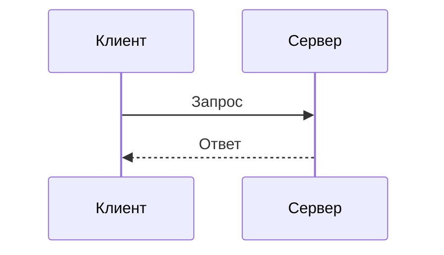

# Справочник разметки

Эти конструкции соответствуют текущему `properdocs.yml`. При конфликте между этим файлом и конфигурацией приоритет имеет конфигурация проекта.

## Admonition

```markdown
!!! note "Примечание"

    Текст заметки.

??? tip "Показать совет"

    Скрываемое содержимое.
```

Поддерживаемые типы: `note`, `abstract`, `info`, `tip`, `success`, `question`, `warning`, `failure`, `danger`, `bug`, `example`, `quote`.

## Вкладки

````markdown
=== "TypeScript"

    ```ts
    const answer = 42;
    ```

=== "JavaScript"

    ```js
    const answer = 42;
    ```
````

Для вкладок внутри admonition добавляй ещё один уровень отступа:

````markdown
!!! example

    === "Шаг 1"

        Текст шага.
````

## Код

Используй `pymdownx.highlight` и `pymdownx.superfences`:

````markdown
```python title="hello.py" linenums="1"
print("Привет")
```
````

Номер строки и заголовок добавляй, только если они помогают ориентироваться в примере.

## Mermaid

````markdown

````

## Математика

Для формул используй LaTeX-синтаксис `pymdownx.arithmatex`; не вставляй HTML MathJax вручную:

```markdown
Inline: \(a^2 + b^2 = c^2\)

$$
\int_0^1 x^2\,dx = \frac{1}{3}
$$
```

## Ссылки и изображения

```markdown
[Соседняя страница](../js/proxy-and-reflect/index.md)


```

Пути считай относительно текущего Markdown-файла. Не ссылайся на файлы из `site/`.

## Полезные расширения проекта

- `toc` — permalink и глубина оглавления;
- `attr_list` — атрибуты элементов;
- `pymdownx.details` — раскрывающиеся блоки;
- `pymdownx.critic` — редакторские пометки;
- `pymdownx.keys` — клавиши;
- `pymdownx.mark`, `caret`, `tilde` — выделение, добавление и удаление;
- `pymdownx.snippets` — включение фрагментов;
- `pymdownx.emoji` — Material/Twemoji-эмодзи;
- `pymdownx.smartsymbols` — типографские символы.
