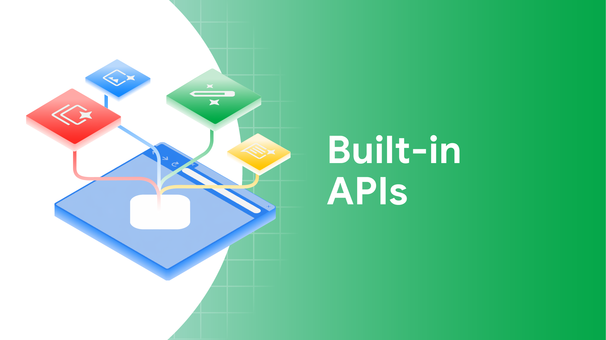
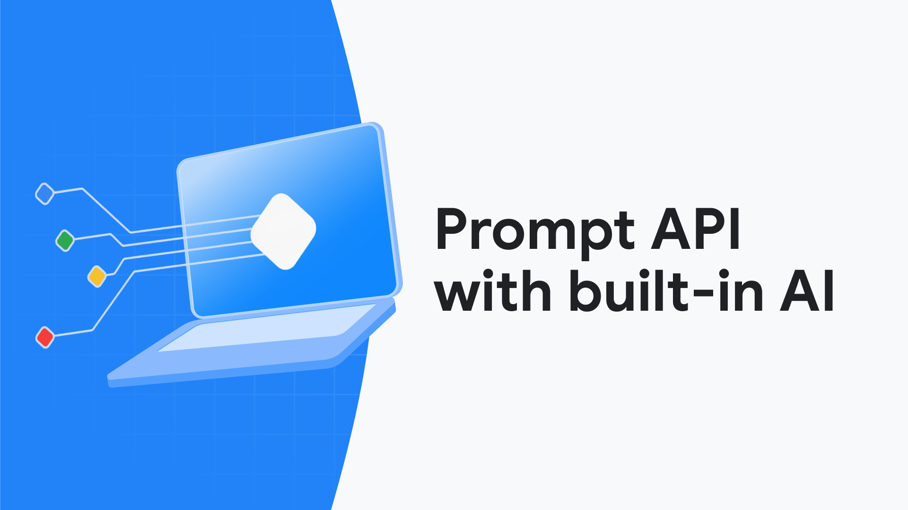

# API искусственного интеллекта в браузере: как использовать Built-in AI в Chrome в реальном вебе

Браузерный ИИ уже вышел из стадии "интересной демонстрации". В Chrome появились встроенные API, которые позволяют делать перевод, определение языка, суммаризацию и генерацию текста локально на устройстве пользователя — без собственного сервера вывода модели.

<!-- more -->

<script type="module" src="/bndby-chatbot.js"></script>

!!!example "Пример чат-бота"

    <bndby-chatbot></bndby-chatbot>

Это не означает "заменяем весь сервер на LLM". Практический сценарий другой: добавить функции ИИ туда, где важны приватность, низкая задержка и офлайн-работа, а для остальных случаев оставить серверный резервный путь.


В этой статье разберем:

- как устроен Built-in AI в Chrome;
- какие API уже можно использовать;
- какие ограничения критичны для продакшена;
- как реализовать корректный резервный путь;
- и как писать код, который не развалится на первом же устройстве без поддержки.

## Что такое Built-in AI в Chrome

Built-in AI — это набор Web API, которые Chrome предоставляет поверх локальных моделей (включая Gemini Nano и специализированные модели для задач вроде перевода).

Ключевая идея: моделью управляет браузер, а не ваше приложение.

Вы:

- не хостите модель сами;
- не управляете обновлениями весов;
- не переносите среду выполнения вывода модели в клиент вручную;
- работаете через нативные API с проверкой доступности возможностей.

Это дает три ключевых эффекта:

1. **Задержка**: нет сетевого обхода до сервера ИИ для каждого запроса.
2. **Приватность**: чувствительный текст можно обработать локально.
3. **Контроль затрат**: часть частых сценариев уходит с дорогого серверного вывода модели.

## Статус API: что уже доступно

По данным Chrome Docs, экосистема сейчас выглядит так:

- **Стабильно в Chrome 138+ (Web + Extensions):**
    - `LanguageDetector API`
    - `Translator API`
    - `Summarizer API`
- **Prompt API:**
    - в Extensions — доступен раньше (Chrome 138+);
    - в Web — rollout в более поздних версиях (указан Chrome 148 в статус-таблице).
- **Writer/Rewriter/Proofreader** — в ранних стадиях (developer trial / origin trial).

Практический вывод: в обычных веб-приложениях сейчас безопаснее всего опираться на `LanguageDetector`, `Translator`, `Summarizer`, а генеративные сценарии строить по гибридной схеме (локально, если доступно; иначе сервер).



## Ограничения, которые нужно принять сразу

### 1) Это в первую очередь настольная платформа

Для части API (особенно связанных с Gemini Nano) мобильные платформы пока не являются основным окружением выполнения.

### 2) Есть требования к железу

Для API на Gemini Nano у Chrome заявлены условия вроде:

- свободное место на диске (в документации фигурирует 22GB для профиля Chrome);
- достаточная RAM/CPU или GPU VRAM;
- немеренная сеть для начальной загрузки модели.

Важно: после загрузки многие сценарии могут работать офлайн.

### 3) `availability()` — не опциональная проверка

Перед использованием API проверяйте состояние:

- `unavailable`
- `downloadable`
- `downloading`
- `available`

И не забывайте, что `create()` часто должен вызываться только после явного действия пользователя.

## Базовый шаблон интеграции (обязательный)

Почти для всех Built-in AI API работает одна и та же схема:

1. Проверка доступности API (`'Summarizer' in self` и т.д.).
2. `availability()` с нужными параметрами.
3. Проверка `navigator.userActivation.isActive` перед `create()`.
4. Подписка на `downloadprogress` и индикация прогресса в интерфейсе.
5. Запуск пакетных или потоковых вызовов.
6. Переход на серверный API при `unavailable` или ошибках.

Этот шаблон лучше вынести в общий служебный слой, а не дублировать по компонентам.

## Матрица решений: какой API выбрать под задачу

Чтобы не "стрелять LLM по воробьям", удобно держать в голове простую матрицу:

| Задача | API | Почему | Когда сразу переходить на сервер |
| --- | --- | --- | --- |
| Определить язык пользовательского текста | `LanguageDetector` | Быстро и недорого на клиенте | Очень короткие фразы, низкая уверенность |
| Перевести сообщение/комментарий | `Translator` | Локально, приватно, с минимальной задержкой | Неподдерживаемая языковая пара |
| Сжать длинную статью/тикет | `Summarizer` | Готовые режимы суммаризации, потоковый вывод | Нет поддержки API или ограничений устройства |
| Преобразовать свободный текст в JSON | `Prompt API` + `responseConstraint` | Контролируемый формат для логики интерфейса | Веб-окружение без поддержки Prompt API |
| Сложные рассуждения и длинные цепочки анализа | Серверный LLM | Полный контроль модели, токенов и инструментов | Почти всегда, если критично качество |

Практическое правило: **локальный ИИ используем как ускоренный путь**, серверный ИИ — как гарантированный путь выполнения.

## Пример 1: language detection + translation

Классический сценарий: пользователь пишет в чат поддержки на любом языке, а оператор работает на русском.

```js
async function translateForSupport(inputText, targetLanguage = 'ru') {
    if (!('LanguageDetector' in self) || !('Translator' in self)) {
        return serverTranslate(inputText, targetLanguage);
    }

    const detectorAvailability = await LanguageDetector.availability();
    const translatorAvailability = await Translator.availability({
        sourceLanguage: 'en', // для проверки пары сделаем позже
        targetLanguage,
    });

    if (
        detectorAvailability === 'unavailable' ||
        translatorAvailability === 'unavailable'
    ) {
        return serverTranslate(inputText, targetLanguage);
    }

    if (!navigator.userActivation.isActive) {
        throw new Error('Нужна пользовательская активация перед create()');
    }

    const detector = await LanguageDetector.create({
        monitor(m) {
            m.addEventListener('downloadprogress', (e) => {
                updateDownloadUI('detector', e.loaded);
            });
        },
    });

    const ranked = await detector.detect(inputText);
    const sourceLanguage = ranked[0]?.detectedLanguage ?? 'en';
    const confidence = ranked[0]?.confidence ?? 0;

    // Для очень коротких фраз confidence может быть низким — это нормальный кейс.
    if (confidence < 0.6) {
        return serverTranslate(inputText, targetLanguage);
    }

    const pairAvailability = await Translator.availability({
        sourceLanguage,
        targetLanguage,
    });

    if (pairAvailability === 'unavailable') {
        return serverTranslate(inputText, targetLanguage);
    }

    const translator = await Translator.create({
        sourceLanguage,
        targetLanguage,
        monitor(m) {
            m.addEventListener('downloadprogress', (e) => {
                updateDownloadUI('translator', e.loaded);
            });
        },
    });

    return translator.translate(inputText);
}
```

Что важно в этом примере:

- используем confidence threshold у `LanguageDetector`;
- проверяем конкретную языковую пару;
- резервный переход на сервер обязателен;
- действие пользователя учитываем до `create()`.

Если сообщений много (например, чат), добавьте очередь, иначе длинные переводы будут блокировать следующие.

```js
class TranslationQueue {
    constructor() {
        this.pending = Promise.resolve();
    }

    enqueue(task) {
        this.pending = this.pending.then(task, task);
        return this.pending;
    }
}

const translationQueue = new TranslationQueue();

function translateQueued(text, target = 'ru') {
    return translationQueue.enqueue(() => translateForSupport(text, target));
}
```

## Пример 2: Summarizer API для длинных страниц

Полезно для документации, тикетов, журналов изменений и длинных переписок.


```js
async function summarizeArticle(articleEl) {
    if (!('Summarizer' in self)) return serverSummarize(articleEl.innerText);

    const availability = await Summarizer.availability();
    if (availability === 'unavailable')
        return serverSummarize(articleEl.innerText);

    if (!navigator.userActivation.isActive) {
        throw new Error(
            "Клик по кнопке 'Сжать текст' должен быть user-initiated",
        );
    }

    const summarizer = await Summarizer.create({
        type: 'key-points', // также: tldr, teaser, headline
        format: 'markdown', // или plain-text
        length: 'medium', // short | medium | long
        sharedContext: 'Это инженерная статья для опытных веб-разработчиков',
        monitor(m) {
            m.addEventListener('downloadprogress', (e) => {
                updateDownloadUI('summarizer', e.loaded);
            });
        },
    });

    // Лучше innerText, а не innerHTML: меньше шума в входных данных.
    const sourceText = articleEl.innerText;

    // Потоковый вариант для длинных текстов
    const stream = summarizer.summarizeStreaming(sourceText, {
        context: 'Нужен акцент на архитектурные решения и trade-offs',
    });

    let output = '';
    for await (const chunk of stream) {
        output += chunk;
        renderPartialSummary(output);
    }

    return output;
}
```

Практический совет: Summarizer особенно полезен как "первый проход", когда нужно быстро сократить входной объем, а затем отправить укороченную версию в серверную обработку.

Также полезно добавить ограничения на размер входа, чтобы не превращать суммаризацию в неконтролируемую операцию:

```js
function truncateForSummary(text, maxChars = 15000) {
    if (text.length <= maxChars) return text;
    return `${text.slice(0, maxChars)}\n\n[TRUNCATED]`;
}

async function summarizeWithBudget(articleEl) {
    const rawText = articleEl.innerText;
    const sourceText = truncateForSummary(rawText);
    return summarizeArticle({ innerText: sourceText });
}
```

## Пример 3: Prompt API со структурированным JSON-ответом

Этот шаблон нужен, когда требуется не "просто текст", а контролируемые данные для логики интерфейса.



```js
async function classifyFeedback(feedbackText) {
    if (!('LanguageModel' in self)) {
        return serverClassify(feedbackText);
    }

    const availability = await LanguageModel.availability({
        expectedInputs: [{ type: 'text', languages: ['en', 'ru'] }],
        expectedOutputs: [{ type: 'text', languages: ['en'] }],
    });

    if (availability === 'unavailable') return serverClassify(feedbackText);
    if (!navigator.userActivation.isActive)
        throw new Error('User activation required');

    const session = await LanguageModel.create({
        expectedInputs: [{ type: 'text', languages: ['en', 'ru'] }],
        expectedOutputs: [{ type: 'text', languages: ['en'] }],
    });

    const schema = {
        type: 'object',
        properties: {
            sentiment: {
                type: 'string',
                enum: ['positive', 'neutral', 'negative'],
            },
            priority: { type: 'integer', minimum: 1, maximum: 5 },
            topic: { type: 'string' },
        },
        required: ['sentiment', 'priority', 'topic'],
        additionalProperties: false,
    };

    const raw = await session.prompt(
        `Classify this customer feedback and return JSON only:\n${feedbackText}`,
        {
            responseConstraint: schema,
            omitResponseConstraintInput: true,
        },
    );

    return JSON.parse(raw);
}
```

Что это дает:

- меньше "болтливости" модели;
- стабильный контракт между AI-ответом и фронтендом;
- проще валидировать и логировать качество.

Для длинных ответов используйте потоковый вывод и `AbortController`, чтобы интерфейс не зависал:

```js
async function streamPromptToUI(prompt, onChunk) {
    const controller = new AbortController();
    const stop = () => controller.abort();

    const session = await LanguageModel.create({
        expectedInputs: [{ type: 'text', languages: ['en'] }],
        expectedOutputs: [{ type: 'text', languages: ['en'] }],
    });

    const stream = session.promptStreaming(prompt, {
        signal: controller.signal,
    });

    let full = '';
    for await (const chunk of stream) {
        full += chunk;
        onChunk(full);
    }

    return { full, stop };
}
```

## Пример 4: служебный адаптер с корректным резервным переходом

Если нужен поддерживаемый код, оберните API в адаптер:

```js
export async function withBuiltInAI(taskName, runLocal, runServer) {
    const startedAt = performance.now();
    try {
        const result = await runLocal();
        logAiMetric({
            taskName,
            mode: 'local',
            latencyMs: performance.now() - startedAt,
        });
        return result;
    } catch (error) {
        logAiMetric({
            taskName,
            mode: 'fallback',
            reason: String(error?.name || error),
            latencyMs: performance.now() - startedAt,
        });
        return runServer();
    }
}
```

И используйте так:

```js
const result = await withBuiltInAI(
    'support-translate',
    () => translateForSupport(userInput, 'ru'),
    () => serverTranslate(userInput, 'ru'),
);
```

Именно такие адаптеры превращают "демонстрацию API" в промышленную возможность.

## Пример 5: React-хук для безопасной инициализации Summarizer

В реальном SPA часто нужно централизовать инициализацию, чтобы не создавать объект при каждом повторном рендеринге.

```tsx
import { useCallback, useMemo, useRef, useState } from 'react';

export function useBuiltInSummarizer() {
    const summarizerRef = useRef(null);
    const [status, setStatus] = useState('idle');
    const [progress, setProgress] = useState(0);

    const canUse = useMemo(() => 'Summarizer' in window, []);

    const init = useCallback(async () => {
        if (!canUse) throw new Error('Summarizer API unsupported');
        if (summarizerRef.current) return summarizerRef.current;

        const availability = await Summarizer.availability();
        if (availability === 'unavailable')
            throw new Error('Summarizer unavailable');
        if (!navigator.userActivation.isActive)
            throw new Error('User activation required');

        setStatus('initializing');
        summarizerRef.current = await Summarizer.create({
            type: 'key-points',
            format: 'markdown',
            length: 'short',
            monitor(m) {
                m.addEventListener('downloadprogress', (e) => {
                    setProgress(e.loaded);
                    setStatus('downloading');
                });
            },
        });
        setStatus('ready');
        return summarizerRef.current;
    }, [canUse]);

    const summarize = useCallback(
        async (text) => {
            const s = await init();
            return s.summarize(text);
        },
        [init],
    );

    return { canUse, status, progress, summarize };
}
```

Преимущество такого хука: единая точка, где можно включить телеметрию, повторы и резервный переход.

## Пример 6: маршрутизация резервного выполнения

Не все ошибки одинаковы. Иногда нужно сразу переходить на сервер, иногда стоит повторить локально.

```js
function shouldFallback(error) {
    const name = String(error?.name || '');
    return (
        name.includes('NotSupportedError') ||
        name.includes('QuotaExceededError') ||
        name.includes('InvalidStateError')
    );
}

async function runWithPolicy({ local, remote, retries = 1 }) {
    let attempt = 0;
    while (attempt <= retries) {
        try {
            return await local();
        } catch (err) {
            if (shouldFallback(err)) return remote();
            attempt += 1;
            if (attempt > retries) return remote();
            await new Promise((r) => setTimeout(r, 200 * attempt));
        }
    }
}
```

Этот слой лучше держать в инфраструктурном модуле, а не в компонентах интерфейса.

## Пример 7: сессии Prompt API без смешивания контекста

Частая ошибка: использовать одну и ту же сессию для разных предметных задач.

```js
class PromptSessionPool {
    constructor() {
        this.byDomain = new Map();
    }

    async get(domain) {
        if (this.byDomain.has(domain)) return this.byDomain.get(domain);

        const session = await LanguageModel.create({
            initialPrompts: [
                {
                    role: 'system',
                    content: `You are an assistant for domain: ${domain}. Keep answers concise.`,
                },
            ],
            expectedInputs: [{ type: 'text', languages: ['en', 'ru'] }],
            expectedOutputs: [{ type: 'text', languages: ['en'] }],
        });

        this.byDomain.set(domain, session);
        return session;
    }

    async destroy(domain) {
        const session = this.byDomain.get(domain);
        if (session) {
            session.destroy();
            this.byDomain.delete(domain);
        }
    }
}
```

Так вы не смешиваете, например, "классификацию отзывов" и "генерацию писем" в одном контекстном окне.

## Пример 8: интеграционный тест резервного перехода

В модульных тестах важно проверять не только успешный сценарий, но и переключение на сервер.

```js
import { describe, expect, it, vi } from 'vitest';

describe('withBuiltInAI', () => {
    it('uses local path when successful', async () => {
        const local = vi.fn(async () => 'local-result');
        const remote = vi.fn(async () => 'remote-result');
        const res = await withBuiltInAI('test-task', local, remote);
        expect(res).toBe('local-result');
        expect(remote).not.toHaveBeenCalled();
    });

    it('falls back to remote on local failure', async () => {
        const local = vi.fn(async () => {
            throw new DOMException('unsupported', 'NotSupportedError');
        });
        const remote = vi.fn(async () => 'remote-result');
        const res = await withBuiltInAI('test-task', local, remote);
        expect(res).toBe('remote-result');
        expect(remote).toHaveBeenCalledTimes(1);
    });
});
```

## Наблюдаемость: что логировать, кроме задержки

Задержка — только верхушка айсберга. Для промышленной эксплуатации обычно нужны еще:

- `availability_state_distribution` (сколько устройств в `available`/`downloadable`/`unavailable`);
- `fallback_reason_top` (какие ошибки чаще всего);
- `prompt_response_parse_error_rate` (для JSON-ответов);
- `stream_cancel_rate` (как часто пользователь прерывает генерацию);
- `model_download_dropoff` (сколько пользователей ушли во время скачивания модели).

Если эти метрики не собирать, команда не поймет, почему возможность "формально есть", но ей мало кто пользуется.

## Безопасность и приватность: практический минимум

Built-in AI помогает приватности, но не заменяет проектирование с учетом безопасности:

- не отправляйте в локальный запрос данные, которые вообще не должны покидать защищенный контур интерфейса;
- редактируйте/маскируйте PII до вызова любого AI (и локального, и серверного);
- логируйте только технические данные (задержка/ошибка/состояние), а не полные пользовательские тексты;
- добавьте понятное пользовательское описание: "обработка может выполняться локально на устройстве".

## Анти-паттерны, которые ломают качество

### 1) Один резервный сценарий "на все случаи"

Правильнее различать:

- неподдерживаемая возможность;
- временная ошибка окружения выполнения;
- некорректные входные данные.

### 2) Слишком короткие тексты для LanguageDetector

Одно-два слова дают шумную вероятность. Добавляйте порог уверенности и состояние "unknown".

### 3) Смешивание HTML и контента

`innerHTML` при суммаризации и переводе обычно ухудшает результат. Предпочитайте `innerText` или очищенный текст.

### 4) Отсутствие понятной индикации при скачивании модели

Если пользователь не понимает, почему операция "подвисла", он закрывает экран раньше, чем API станет полезным.

## Рекомендации по интерфейсу и архитектуре

### Показывайте, что происходит

Если модель скачивается, пользователь должен видеть прогресс и понимать, зачем это нужно.

### Не скрывайте резервный переход

Локальный ИИ — это ускоренный путь, а не единственный путь выполнения.

### Не переиспользуйте одну сессию для несвязанных задач

Для Prompt API держите сессии по предметной логике (классификация, генерация заголовков, извлечение данных), иначе получите шум в контексте.

### Ограничивайте вход

Удаляйте HTML-разметку, служебные токены и "мусорный" текст до вызова API.

### Логируйте режим выполнения

Минимум метрик:

- `local_vs_server_ratio`;
- `download_time`;
- `error_rate_by_api`;
- `p95_latency_local` vs `p95_latency_server`.

Без этого вы не поймете, дает ли Built-in AI реальную пользу вашему продукту.

## Где Built-in AI особенно хорошо окупается

- перевод пользовательского контента "на лету" в поддержке и чатах;
- краткая суммаризация статей, тикетов, журналов и отзывов;
- легковесная классификация и извлечение данных прямо в интерфейсе;
- офлайн-сценарии во внутренних корпоративных инструментах.

## Чеклист перед выкатом в прод

- [ ] Есть проверка доступности для каждого API.
- [ ] Есть `availability()` и обработка всех состояний.
- [ ] Учитывается `userActivation`.
- [ ] Есть явный резервный переход на сервер.
- [ ] Добавлена индикация загрузки модели.
- [ ] Есть ограничения по размеру входа.
- [ ] Есть защита от смешивания сессий между разными доменами задач.
- [ ] Есть тесты на резервный переход и ошибки разбора ответа.
- [ ] Есть телеметрия по локальному и серверному режимам.
- [ ] Учтены ограниченные платформы (browser/os/hardware).

## Вывод

Built-in AI в браузере — это не "замена серверной части", а новый слой оптимизации интерфейса и затрат.

Наиболее практичный путь сейчас:

1. Внедрить `LanguageDetector + Translator` или `Summarizer` в узком флоу.
2. Добавить надежный резервный переход на сервер.
3. Снимать метрики и сравнивать фактическую задержку и стоимость.
4. Постепенно расширять область локального AI там, где это действительно окупается.

Так вы получите измеримую ценность, а не просто "галочку, что у нас есть AI".

## Источники

- [Built-in AI overview](https://developer.chrome.com/docs/ai/built-in/overview)
- [Built-in AI APIs status](https://developer.chrome.com/docs/ai/built-in-apis)
- [Get started with built-in AI](https://developer.chrome.com/docs/ai/get-started)
- [Language Detector API](https://developer.chrome.com/docs/ai/language-detection)
- [Translator API](https://developer.chrome.com/docs/ai/translator-api)
- [Summarizer API](https://developer.chrome.com/docs/ai/summarizer-api)
- [Prompt API](https://developer.chrome.com/docs/extensions/ai/prompt-api)
