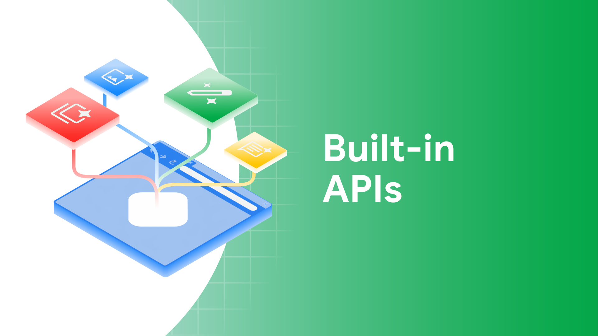

# Built-in AI в Chrome: как использовать встроенные AI API в реальных веб‑приложениях

Браузерный ИИ перестал быть экспериментом — в Chrome появились встроенные Web API, которые позволяют выполнять задачи перевода, определения языка, суммаризации и локальной генерации текста прямо на устройстве пользователя, без обязательного серверного вывода модели.

<!-- more -->

!!!example "Пример чат-бота"

    <bndby-chatbot></bndby-chatbot>

Это не означает, что серверная часть больше не нужна. На практике встроенный AI — это инструмент для сценариев, где важны приватность, низкая задержка и возможность офлайн‑работы; при этом всегда нужен надёжный серверный резерв.

В статье подробно рассмотрим:

- Устройство Built-in AI в Chrome;
- Набор доступных API и их статус;
- Ключевые ограничения и требования к окружению;
- Рабочие шаблоны интеграции и резервного перехода;
- Практические рекомендации по архитектуре и телеметрии.

## Что такое Built-in AI в Chrome

Built-in AI — это набор Web API, которые запускаются поверх локальных моделей (например, Gemini Nano или других компактных моделей для конкретных задач). Главное: модель управляется браузером, а не вашим приложением.

Следствия для разработчика:

- вы не хостите модель и не управляете её весами;
- обновления и окружение выполнения контролирует браузер;
- взаимодействие идёт через нативные API с явной проверкой доступности.

Преимущества:

1. **Меньшая задержка** — нет сетевого обращения к серверу для каждого запроса.
2. **Приватность** — чувствительные данные можно обрабатывать локально.
3. **Экономия** — часть часто используемых сценариев уходит с дорогостоящего серверного вывода.

## Статус API

На момент написания экосистема выглядит так:

- Стабильно в Chrome 138+ (Web + Extensions): `LanguageDetector`, `Translator`, `Summarizer`.
- `Prompt API`: доступен в Extensions раньше, для Web‑ rollout запланирован в более поздних версиях (в статус‑таблицах указан Chrome 148).
- `Writer` / `Rewriter` / `Proofreader`: находятся в ранних стадиях (developer/origin trial).

Практический вывод: для обычных веб‑приложений сейчас надёжнее опираться на `LanguageDetector`, `Translator`, `Summarizer`. Генеративные сценарии стоит строить гибридно: использовать локально при доступности и переключаться на сервер при отсутствии поддержки.

## Ограничения и требования

1) Платформенная приоритетность: многие возможности рассчитаны в первую очередь на десктопы — мобильные устройства пока ограничены.

2) Требования к железу и дисковому пространству. Для некоторых моделей у Chrome указываются существенные условия (в документации встречается ~22 ГБ для профиля Chrome), а также требования к RAM/CPU/GPU для корректной работы и быстрой загрузки.

3) `availability()` — обязательная проверка. Состояния: `unavailable`, `downloadable`, `downloading`, `available`. Вызов `create()` часто должен происходить после явного действия пользователя.

После загрузки модель может работать офлайн, но загрузочный этап требует внимания к UX и ресурсам устройства.

## Базовый шаблон интеграции

Универсальная последовательность для большинства Built‑in API:

1. Проверить поддержку API (`'Summarizer' in self`).
2. Вызвать `availability()` с нужными параметрами.
3. Убедиться в `navigator.userActivation.isActive` перед `create()`.
4. Подписаться на `downloadprogress` и показать индикатор прогресса.
5. Запустить пакетную или потоковую обработку.
6. При `unavailable` или критических ошибках — перейти на серверный API.

Этот шаблон имеет смысл вынести в общий адаптер, а не дублировать по компонентам.

## Как выбирать API

Краткая матрица решений:

| Задача | Рекомендуемый API | Когда сразу идти на сервер |
|---|---:|---|
| Определение языка | `LanguageDetector` | Очень короткие фразы с низкой уверенностью |
| Перевод | `Translator` | Неподдерживаемая языковая пара |
| Суммаризация длинного текста | `Summarizer` | Ограничения устройства или отсутствие API |
| Структурированный вывод (JSON) | `Prompt API` + `responseConstraint` | Веб‑окружение без поддержки Prompt API |
| Сложные рассуждения, цепочки анализа | Серверный LLM | Когда критично качество и контроль модели |

Правило: локальный AI — быстрый и приватный путь; сервер — надёжный и предсказуемый.

## Практические примеры

Ниже приведены рабочие фрагменты кода и шаблоны использования. (Исходный код сохранён без изменений; обратите внимание на проверку доступности, обработку состояний и резервы.)

### Пример: определение языка и перевод для саппорта

Классический кейс: пользователь пишет на любом языке, оператор отвечает на русском. Важно проверять доступность и порог доверия у `LanguageDetector`, а также языковую пару у `Translator`.

(См. исходный пример в коде ниже.)

### Пример: Summarizer для длинных текстов

Полезно для документации, тикетов и длинных переписок. Рекомендуется использовать `innerText` и потоковый вывод для UX, а также ограничивать вход по размерам.

(См. исходный пример в коде ниже.)

### Пример: Prompt API с JSON‑ответом

Когда нужен стабильный контракт между фронтендом и AI, используйте `responseConstraint` и валидируемую схему JSON. Это уменьшает «болтливость» модели и упрощает обработку.

(См. исходный пример в коде ниже.)

### Пример: адаптер с резервным переходом

Оберните локальные вызовы в адаптер `withBuiltInAI`, который логирует метрики и при ошибке возвращается к серверной реализации.

(См. исходный пример в коде ниже.)

### Пример: React‑хук для Summarizer

В SPA выгодно централизовать инициализацию Summarizer в хукe, чтобы избежать повторных create() и иметь одну точку для телеметрии и прогресс‑индикатора.

(См. исходный пример в коде ниже.)

### Пример: политика повторов и fallback

Не все ошибки равны — некоторые требуют немедленного fallback на сервер, другие — повтора с задержкой. Логику лучше держать в инфраструктурном модуле.

### Пример: пул сессий Prompt API

Не смешивайте контексты: держите сессии по доменам задач, чтобы не переносить системные промпты между разными сценариями.

### Тесты

Показываю пример модульного теста, который проверяет успешный локальный путь и fallback на сервер.

## Наблюдаемость: что логировать

Помимо latency полезно собирать:

- распределение состояний availability (`available`/`downloadable`/`unavailable`);
- причины fallback и их частоту;
- ошибки разбора ответов (для JSON);
- частоту отмен потоковой генерации;
- отток пользователей во время загрузки модели.

Без этих метрик невозможно понять, даёт ли встроенный AI реальную ценность.

## Безопасность и приватность

Built‑in AI повышает приватность, но не снимает ответственности:

- не включайте в вызов данные, которые не должны покидать защищённую среду;
- маскируйте PII до вызова AI (локального и серверного);
- логируйте только технические метрики, а не полные тексты пользователей;
- информируйте пользователя о том, что обработка может выполняться локально.

## Анти‑паттерны

- Универсальный fallback «на всё» — плохая практика; различайте типы ошибок.
- Слишком короткие фрагменты для `LanguageDetector` дают шум — вводите пороги.
- Передавайте очищённый текст, а не HTML.
- Не скрывайте прогресс загрузки модели.

## Рекомендации по архитектуре и UX

- показывайте прогресс и объясняйте причины загрузки модели;
- не скрывайте резервный переход — это часть UX;
- держите сессии Prompt API по предметной логике;
- ограничивайте размер входных данных и очищайте текст;
- отслеживайте `local_vs_server_ratio`, `download_time`, `error_rate_by_api`, `p95_latency`.

## Где это окупается

- перевод пользовательских сообщений в чатах и поддержке;
- оперативная суммаризация документации и тикетов;
- локальная классификация и извлечение данных;
- корпоративные офлайн‑сценарии.

## Чеклист перед релизом

- Проверка поддержки и `availability()` для каждого API.
- Обработка всех состояний availability.
- Учет `userActivation` перед `create()`.
- Надёжный резервный путь на сервер.
- Индикация загрузки модели и прогресса.
- Ограничение размера входных данных.
- Защита от смешивания сессий между доменами задач.
- Тесты на переходы в fallback и ошибки парсинга.
- Телеметрия по локальным и серверным вызовам.
- Учёт ограниченных платформ (browser/os/hardware).

## Вывод

Built‑in AI в браузере — не замена серверной части, а дополнительный слой оптимизации: приватность, задержка и экономия. Рабочая стратегия сегодня — внедрять небольшие локальные флоу (перевод, суммаризация), обеспечивать надёжный fallback и собирать метрики.

## Источники

- [Built-in AI overview](https://developer.chrome.com/docs/ai/built-in/overview)
- [Built-in AI APIs status](https://developer.chrome.com/docs/ai/built-in-apis)
- [Get started with built-in AI](https://developer.chrome.com/docs/ai/get-started)
- [Language Detector API](https://developer.chrome.com/docs/ai/language-detection)
- [Translator API](https://developer.chrome.com/docs/ai/translator-api)
- [Summarizer API](https://developer.chrome.com/docs/ai/summarizer-api)
- [Prompt API](https://developer.chrome.com/docs/extensions/ai/prompt-api)
