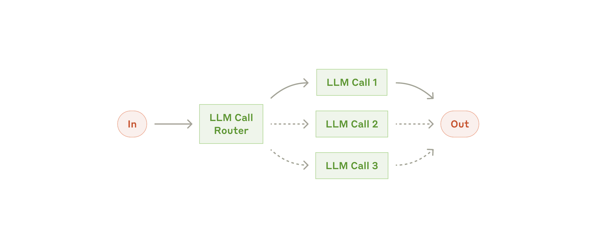
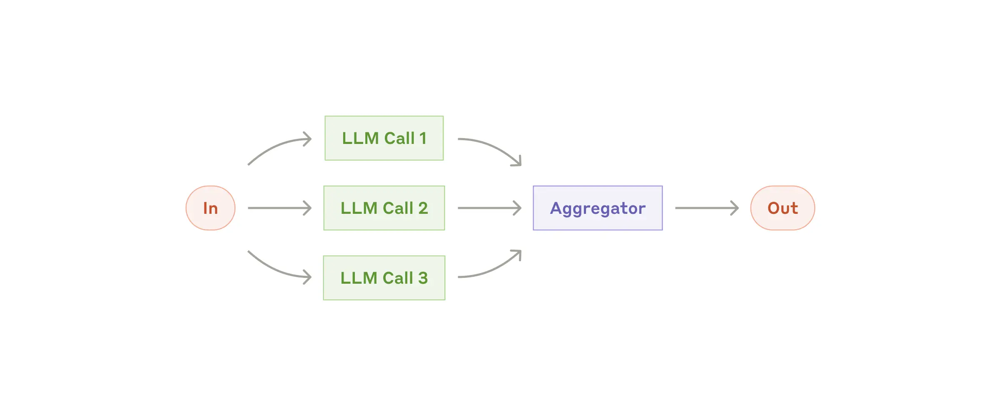
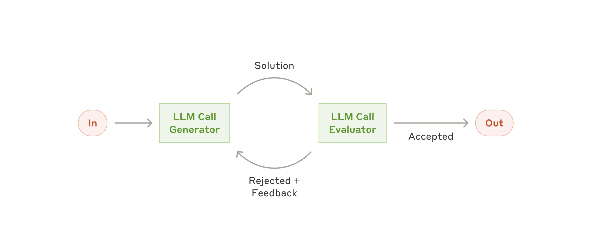
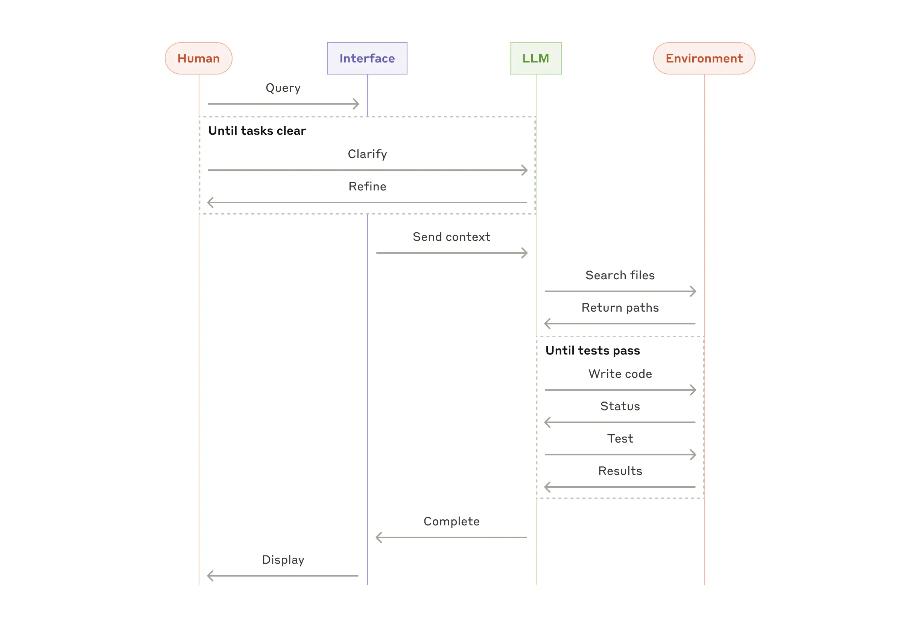

# Создание эффективных агентов

Мы работали с десятками команд, создающих LLM-агентов в различных отраслях. Последовательно, наиболее успешные реализации используют простые, компонуемые паттерны, а не сложные фреймворки.

<!-- more -->

!!!example "Примеры кода"

    В примерах кода используется [AI SDK](https://sdk.vercel.ai/docs/foundations/agents), работающий в  [Durable Objects](https://developers.cloudflare.com/durable-objects).

За последний год мы работали с десятками команд, создающих агентов на основе больших языковых моделей (LLM) в различных отраслях. Последовательно, наиболее успешные реализации не использовали сложные фреймворки или специализированные библиотеки. Вместо этого они строились с использованием простых, компонуемых паттернов.

В этом посте мы делимся тем, что узнали из работы с нашими клиентами и создания агентов самостоятельно, и даем практические советы разработчикам по созданию эффективных агентов.

## Что такое агенты?

"Агент" можно определить несколькими способами. Некоторые клиенты определяют агентов как полностью автономные системы, которые работают независимо в течение длительных периодов времени, используя различные инструменты для выполнения сложных задач. Другие используют этот термин для описания более предписывающих реализаций, следующих заранее определенным рабочим процессам. В Anthropic мы классифицируем все эти варианты как **агентные системы**, но проводим важное архитектурное различие между **рабочими процессами** (workflows) и агентами:

- **Рабочие процессы** — это системы, где LLM и инструменты организованы через заранее определенные пути кода.
- **Агенты**, с другой стороны, — это системы, где LLM динамически направляют свои собственные процессы и использование инструментов, сохраняя контроль над тем, как они выполняют задачи.

Ниже мы подробно рассмотрим оба типа агентных систем. В Приложении 1 ("Агенты на практике") мы описываем две области, где клиенты нашли особую ценность в использовании таких систем.

## Когда (и когда не) использовать агентов

При создании приложений с LLM мы рекомендуем искать максимально простое решение и увеличивать сложность только при необходимости. Это может означать, что агентные системы вообще не нужны. Агентные системы часто обменивают задержку и стоимость на лучшую производительность задач, и вы должны учитывать, когда такой компромисс имеет смысл.

Когда большая сложность оправдана, рабочие процессы обеспечивают предсказуемость и последовательность для четко определенных задач, в то время как агенты являются лучшим вариантом, когда нужна гибкость и принятие решений на основе модели в масштабе. Однако для многих приложений оптимизация одиночных вызовов LLM с извлечением данных и примерами в контексте обычно достаточна.

## Когда и как использовать фреймворки

Существует множество фреймворков, которые упрощают реализацию агентных систем, включая:

- [LangGraph](https://langchain-ai.github.io/langgraph/) от LangChain;
- [AI Agent framework](https://aws.amazon.com/bedrock/agents/) от Amazon Bedrock;
- [Rivet](https://rivet.ironcladapp.com/) — конструктор рабочих процессов LLM с графическим интерфейсом перетаскивания; и
- [Vellum](https://www.vellum.ai/) — еще один графический инструмент для создания и тестирования сложных рабочих процессов.

Эти фреймворки облегчают начало работы, упрощая стандартные низкоуровневые задачи, такие как вызов LLM, определение и анализ инструментов, а также объединение вызовов в цепочки. Однако они часто создают дополнительные слои абстракции, которые могут скрывать базовые промпты и ответы, делая их сложнее в отладке. Они также могут соблазнять добавлять сложность, когда более простая настройка была бы достаточной.

Мы предлагаем разработчикам начинать с прямого использования API LLM: многие паттерны можно реализовать всего в несколько строк кода. Если вы все же используете фреймворк, убедитесь, что понимаете базовый код. Неправильные предположения о том, что происходит под капотом, являются распространенным источником ошибок клиентов.

Смотрите нашу [кулинарную книгу](https://github.com/anthropics/anthropic-cookbook/tree/main/patterns/agents) для примеров реализаций.

## Строительные блоки, рабочие процессы и агенты

В этом разделе мы рассмотрим распространенные паттерны агентных систем, которые мы наблюдали в продакшене. Мы начнем с нашего фундаментального строительного блока — дополненного LLM — и постепенно увеличим сложность, от простых композиционных рабочих процессов до автономных агентов.

### Строительный блок: Дополненный LLM

Основным строительным блоком агентных систем является LLM, дополненный такими возможностями, как извлечение данных, инструменты и память. Наши текущие модели могут активно использовать эти возможности — генерировать собственные поисковые запросы, выбирать подходящие инструменты и определять, какую информацию сохранять.


Мы рекомендуем сосредоточиться на двух ключевых аспектах реализации: адаптации этих возможностей под ваш конкретный случай использования и обеспечении простого, хорошо документированного интерфейса для вашего LLM. Хотя существует множество способов реализации этих дополнений, один из подходов — использование нашего недавно выпущенного [Model Context Protocol](https://www.anthropic.com/news/model-context-protocol), который позволяет разработчикам интегрироваться с растущей экосистемой сторонних инструментов с помощью простой [реализации клиента](https://modelcontextprotocol.io/tutorials/building-a-client#building-mcp-clients).

В оставшейся части этого поста мы предполагаем, что каждый вызов LLM имеет доступ к этим дополненным возможностям.

### Рабочий процесс: Цепочка промптов

Цепочка промптов разбивает задачу на последовательность шагов, где каждый вызов LLM обрабатывает выходные данные предыдущего. Вы можете добавить программные проверки (см. "шлюз" на диаграмме ниже) на любые промежуточные шаги, чтобы убедиться, что процесс все еще на правильном пути.


**Когда использовать этот рабочий процесс**: Этот рабочий процесс идеален для ситуаций, когда задачу можно легко и четко разложить на фиксированные подзадачи. Основная цель — обменять задержку на более высокую точность, сделав каждый вызов LLM более простой задачей.

**Примеры, где полезна цепочка промптов**:

- Создание маркетингового текста, а затем его перевод на другой язык.
- Написание плана документа, проверка того, что план соответствует определенным критериям, а затем написание документа на основе плана.

```ts title="Prompt Chaining"
import { openai } from '@ai-sdk/openai';
import { generateText, generateObject } from 'ai';
import { z } from 'zod';

export default async function generateMarketingCopy(input: string) {
    const model = openai('gpt-4o');

    // First step: Generate marketing copy
    const { text: copy } = await generateText({
        model,
        prompt: `Write persuasive marketing copy for: ${input}. Focus on benefits and emotional appeal.`,
    });

    // Perform quality check on copy
    const { object: qualityMetrics } = await generateObject({
        model,
        schema: z.object({
            hasCallToAction: z.boolean(),
            emotionalAppeal: z.number().min(1).max(10),
            clarity: z.number().min(1).max(10),
        }),
        prompt: `Evaluate this marketing copy for:
    1. Presence of call to action (true/false)
    2. Emotional appeal (1-10)
    3. Clarity (1-10)

    Copy to evaluate: ${copy}`,
    });

    // If quality check fails, regenerate with more specific instructions
    if (
        !qualityMetrics.hasCallToAction ||
        qualityMetrics.emotionalAppeal < 7 ||
        qualityMetrics.clarity < 7
    ) {
        const { text: improvedCopy } = await generateText({
            model,
            prompt: `Rewrite this marketing copy with:
      ${!qualityMetrics.hasCallToAction ? '- A clear call to action' : ''}
      ${qualityMetrics.emotionalAppeal < 7 ? '- Stronger emotional appeal' : ''}
      ${qualityMetrics.clarity < 7 ? '- Improved clarity and directness' : ''}

      Original copy: ${copy}`,
        });
        return { copy: improvedCopy, qualityMetrics };
    }

    return { copy, qualityMetrics };
}
```

### Рабочий процесс: Маршрутизация

Маршрутизация классифицирует входные данные и направляет их на специализированную последующую задачу. Этот рабочий процесс позволяет разделить ответственность и создавать более специализированные промпты. Без этого рабочего процесса оптимизация для одного типа входных данных может ухудшить производительность для других входных данных.



**Когда использовать этот рабочий процесс**: Маршрутизация хорошо работает для сложных задач, где есть четкие категории, которые лучше обрабатывать отдельно, и где классификация может быть выполнена точно либо LLM, либо более традиционной моделью/алгоритмом классификации.

**Примеры, где полезна маршрутизация**:

- Направление различных типов запросов в службу поддержки клиентов (общие вопросы, запросы на возврат средств, техническая поддержка) в различные последующие процессы, промпты и инструменты.
- Маршрутизация простых/распространенных вопросов к меньшим, экономичным моделям вроде Claude Haiku 4.5 и сложных/необычных вопросов к более мощным моделям вроде Claude Sonnet 4.5 для оптимизации производительности.

```ts title="Routing"
import { openai } from '@ai-sdk/openai';
import { generateObject, generateText } from 'ai';
import { z } from 'zod';

async function handleCustomerQuery(query: string) {
    const model = openai('gpt-4o');

    // First step: Classify the query type
    const { object: classification } = await generateObject({
        model,
        schema: z.object({
            reasoning: z.string(),
            type: z.enum(['general', 'refund', 'technical']),
            complexity: z.enum(['simple', 'complex']),
        }),
        prompt: `Classify this customer query:
    ${query}

    Determine:
    1. Query type (general, refund, or technical)
    2. Complexity (simple or complex)
    3. Brief reasoning for classification`,
    });

    // Route based on classification
    // Set model and system prompt based on query type and complexity
    const { text: response } = await generateText({
        model:
            classification.complexity === 'simple'
                ? openai('gpt-4o-mini')
                : openai('o1-mini'),
        system: {
            general:
                'You are an expert customer service agent handling general inquiries.',
            refund: 'You are a customer service agent specializing in refund requests. Follow company policy and collect necessary information.',
            technical:
                'You are a technical support specialist with deep product knowledge. Focus on clear step-by-step troubleshooting.',
        }[classification.type],
        prompt: query,
    });

    return { response, classification };
}
```

### Рабочий процесс: Параллелизация

LLM иногда могут работать одновременно над задачей, а их выходные данные агрегируются программно. Этот рабочий процесс, параллелизация, проявляется в двух ключевых вариациях:

- **Секционирование**: Разбиение задачи на независимые подзадачи, выполняемые параллельно.
- **Голосование**: Запуск одной и той же задачи несколько раз для получения разнообразных выходных данных.



**Когда использовать этот рабочий процесс**: Параллелизация эффективна, когда разделенные подзадачи могут быть параллелизованы для скорости, или когда нужны несколько точек зрения или попыток для результатов с более высокой уверенностью. Для сложных задач с множеством соображений LLM обычно работают лучше, когда каждое соображение обрабатывается отдельным вызовом LLM, позволяя сосредоточенное внимание на каждом конкретном аспекте.

**Примеры, где полезна параллелизация**:

- **Секционирование**:
    - Реализация защитных механизмов, где один экземпляр модели обрабатывает пользовательские запросы, в то время как другой проверяет их на наличие неподходящего содержимого или запросов. Это обычно работает лучше, чем когда один и тот же вызов LLM обрабатывает как защитные механизмы, так и основной ответ.
    - Автоматизация оценок для оценки производительности LLM, где каждый вызов LLM оценивает различный аспект производительности модели по данному промпту.
- **Голосование**:
    - Проверка кода на наличие уязвимостей, где несколько различных промптов проверяют и помечают код, если находят проблему.
    - Оценка того, является ли данный фрагмент контента неподходящим, с использованием нескольких промптов для оценки различных аспектов или требующих различных порогов голосования для баланса ложных срабатываний и пропусков.

```ts title="Parallelization"
import { openai } from '@ai-sdk/openai';
import { generateText, generateObject } from 'ai';
import { z } from 'zod';

// Example: Parallel code review with multiple specialized reviewers
async function parallelCodeReview(code: string) {
    const model = openai('gpt-4o');

    // Run parallel reviews
    const [securityReview, performanceReview, maintainabilityReview] =
        await Promise.all([
            generateObject({
                model,
                system: 'You are an expert in code security. Focus on identifying security vulnerabilities, injection risks, and authentication issues.',
                schema: z.object({
                    vulnerabilities: z.array(z.string()),
                    riskLevel: z.enum(['low', 'medium', 'high']),
                    suggestions: z.array(z.string()),
                }),
                prompt: `Review this code:
      ${code}`,
            }),

            generateObject({
                model,
                system: 'You are an expert in code performance. Focus on identifying performance bottlenecks, memory leaks, and optimization opportunities.',
                schema: z.object({
                    issues: z.array(z.string()),
                    impact: z.enum(['low', 'medium', 'high']),
                    optimizations: z.array(z.string()),
                }),
                prompt: `Review this code:
      ${code}`,
            }),

            generateObject({
                model,
                system: 'You are an expert in code quality. Focus on code structure, readability, and adherence to best practices.',
                schema: z.object({
                    concerns: z.array(z.string()),
                    qualityScore: z.number().min(1).max(10),
                    recommendations: z.array(z.string()),
                }),
                prompt: `Review this code:
      ${code}`,
            }),
        ]);

    const reviews = [
        { ...securityReview.object, type: 'security' },
        {
            ...performanceReview.object,
            type: 'performance',
        },
        {
            ...maintainabilityReview.object,
            type: 'maintainability',
        },
    ];

    // Aggregate results using another model instance
    const { text: summary } = await generateText({
        model,
        system: 'You are a technical lead summarizing multiple code reviews.',
        prompt: `Synthesize these code review results into a concise summary with key actions:
    ${JSON.stringify(reviews, null, 2)}`,
    });

    return { reviews, summary };
}
```

### Рабочий процесс: Оркестратор-работники

В рабочем процессе оркестратор-работники центральный LLM динамически разбивает задачи, делегирует их рабочим LLM и синтезирует их результаты.


**Когда использовать этот рабочий процесс**: Этот рабочий процесс хорошо подходит для сложных задач, где вы не можете предсказать необходимые подзадачи (например, в кодировании количество файлов, которые нужно изменить, и характер изменений в каждом файле, вероятно, зависят от задачи). Хотя он топографически похож, ключевое отличие от параллелизации — его гибкость: подзадачи не предопределены, а определяются оркестратором на основе конкретного входа.

**Пример, где полезен оркестратор-работники**:

- Продукты для кодирования, которые каждый раз вносят сложные изменения в несколько файлов.
- Поисковые задачи, которые включают сбор и анализ информации из нескольких источников для возможной релевантной информации.

```ts title="Orchestrator-Workers"
import { openai } from '@ai-sdk/openai';
import { generateObject } from 'ai';
import { z } from 'zod';

async function implementFeature(featureRequest: string) {
    // Orchestrator: Plan the implementation
    const { object: implementationPlan } = await generateObject({
        model: openai('o1'),
        schema: z.object({
            files: z.array(
                z.object({
                    purpose: z.string(),
                    filePath: z.string(),
                    changeType: z.enum(['create', 'modify', 'delete']),
                }),
            ),
            estimatedComplexity: z.enum(['low', 'medium', 'high']),
        }),
        system: 'You are a senior software architect planning feature implementations.',
        prompt: `Analyze this feature request and create an implementation plan:
    ${featureRequest}`,
    });

    // Workers: Execute the planned changes
    const fileChanges = await Promise.all(
        implementationPlan.files.map(async (file) => {
            // Each worker is specialized for the type of change
            const workerSystemPrompt = {
                create: 'You are an expert at implementing new files following best practices and project patterns.',
                modify: 'You are an expert at modifying existing code while maintaining consistency and avoiding regressions.',
                delete: 'You are an expert at safely removing code while ensuring no breaking changes.',
            }[file.changeType];

            const { object: change } = await generateObject({
                model: openai('gpt-4o'),
                schema: z.object({
                    explanation: z.string(),
                    code: z.string(),
                }),
                system: workerSystemPrompt,
                prompt: `Implement the changes for ${file.filePath} to support:
        ${file.purpose}

        Consider the overall feature context:
        ${featureRequest}`,
            });

            return {
                file,
                implementation: change,
            };
        }),
    );

    return {
        plan: implementationPlan,
        changes: fileChanges,
    };
}
```

### Рабочий процесс: Оценщик-оптимизатор

В рабочем процессе оценщик-оптимизатор один вызов LLM генерирует ответ, в то время как другой предоставляет оценку и обратную связь в цикле.



**Когда использовать этот рабочий процесс**: Этот рабочий процесс особенно эффективен, когда у нас есть четкие критерии оценки, и когда итеративное уточнение дает измеримую ценность. Два признака хорошего соответствия: во-первых, ответы LLM могут быть demonstrably улучшены, когда человек формулирует свою обратную связь; и во-вторых, LLM может предоставить такую обратную связь. Это аналогично итеративному процессу письма, через который может пройти человеческий писатель при создании отполированного документа.

**Примеры, где полезен оценщик-оптимизатор**:

- Литературный перевод, где есть нюансы, которые LLM-переводчик может не уловить изначально, но где LLM-оценщик может предоставить полезную критику.
- Сложные поисковые задачи, которые требуют нескольких раундов поиска и анализа для сбора всесторонней информации, где оценщик решает, нужны ли дальнейшие поиски.

```ts title="Evaluator-Optimizer"
import { openai } from '@ai-sdk/openai';
import { generateText, generateObject } from 'ai';
import { z } from 'zod';

async function translateWithFeedback(text: string, targetLanguage: string) {
    let currentTranslation = '';
    let iterations = 0;
    const MAX_ITERATIONS = 3;

    // Initial translation
    const { text: translation } = await generateText({
        model: openai('gpt-4o-mini'), // use small model for first attempt
        system: 'You are an expert literary translator.',
        prompt: `Translate this text to ${targetLanguage}, preserving tone and cultural nuances:
    ${text}`,
    });

    currentTranslation = translation;

    // Evaluation-optimization loop
    while (iterations < MAX_ITERATIONS) {
        // Evaluate current translation
        const { object: evaluation } = await generateObject({
            model: openai('gpt-4o'), // use a larger model to evaluate
            schema: z.object({
                qualityScore: z.number().min(1).max(10),
                preservesTone: z.boolean(),
                preservesNuance: z.boolean(),
                culturallyAccurate: z.boolean(),
                specificIssues: z.array(z.string()),
                improvementSuggestions: z.array(z.string()),
            }),
            system: 'You are an expert in evaluating literary translations.',
            prompt: `Evaluate this translation:

      Original: ${text}
      Translation: ${currentTranslation}

      Consider:
      1. Overall quality
      2. Preservation of tone
      3. Preservation of nuance
      4. Cultural accuracy`,
        });

        // Check if quality meets threshold
        if (
            evaluation.qualityScore >= 8 &&
            evaluation.preservesTone &&
            evaluation.preservesNuance &&
            evaluation.culturallyAccurate
        ) {
            break;
        }

        // Generate improved translation based on feedback
        const { text: improvedTranslation } = await generateText({
            model: openai('gpt-4o'), // use a larger model
            system: 'You are an expert literary translator.',
            prompt: `Improve this translation based on the following feedback:
      ${evaluation.specificIssues.join('\n')}
      ${evaluation.improvementSuggestions.join('\n')}

      Original: ${text}
      Current Translation: ${currentTranslation}`,
        });

        currentTranslation = improvedTranslation;
        iterations++;
    }

    return {
        finalTranslation: currentTranslation,
        iterationsRequired: iterations,
    };
}
```

### Агенты

Агенты появляются в продакшене по мере созревания LLM в ключевых возможностях — понимании сложных входных данных, вовлечении в рассуждения и планирование, надежном использовании инструментов и восстановлении после ошибок. Агенты начинают свою работу либо с команды от человека, либо с интерактивного обсуждения с пользователем. Как только задача становится ясной, агенты планируют и работают независимо, потенциально возвращаясь к человеку за дополнительной информацией или суждением. Во время выполнения крайне важно, чтобы агенты получали "фактическую истину" из окружающей среды на каждом шаге (например, результаты вызовов инструментов или выполнения кода) для оценки своего прогресса. Агенты могут затем приостановиться для обратной связи от человека на контрольных точках или при столкновении с препятствиями. Задача часто завершается по завершении, но также распространено включение условий остановки (например, максимальное количество итераций) для поддержания контроля.

Агенты могут обрабатывать сложные задачи, но их реализация часто проста. Они обычно представляют собой просто LLM, использующие инструменты на основе обратной связи от окружающей среды в цикле. Поэтому крайне важно четко и продуманно проектировать наборы инструментов и их документацию. Мы подробно рассмотрим лучшие практики разработки инструментов в Приложении 2 ("Промпт-инжиниринг ваших инструментов").


**Когда использовать агентов**: Агенты могут использоваться для задач с открытым концом, где трудно или невозможно предсказать необходимое количество шагов, и где вы не можете жестко закодировать фиксированный путь. LLM потенциально будет работать в течение многих поворотов, и у вас должен быть определенный уровень доверия к его принятию решений. Автономность агентов делает их идеальными для масштабирования задач в доверенных средах.

Автономная природа агентов означает более высокие затраты и потенциал для накопления ошибок. Мы рекомендуем обширное тестирование в изолированных средах вместе с соответствующими защитными механизмами.

**Примеры, где полезны агенты**:

Следующие примеры взяты из наших собственных реализаций:

- Агент для кодирования для решения [задач SWE-bench](https://www.anthropic.com/research/swe-bench-sonnet), которые включают редактирование множества файлов на основе описания задачи;
- Наша [эталонная реализация "использования компьютера"](https://github.com/anthropics/anthropic-quickstarts/tree/main/computer-use-demo), где Claude использует компьютер для выполнения задач.



## Комбинирование и настройка этих паттернов

Эти строительные блоки не являются предписывающими. Это распространенные паттерны, которые разработчики могут формировать и комбинировать для различных случаев использования. Ключ к успеху, как и для любых функций LLM, — измерение производительности и итерация реализаций. Повторим: вы должны добавлять сложность _только_ когда она demonstrably улучшает результаты.

## Резюме

Успех в пространстве LLM — это не создание наиболее сложной системы. Это создание _правильной_ системы для ваших нужд. Начинайте с простых промптов, оптимизируйте их с помощью всесторонней оценки и добавляйте многошаговые агентные системы только когда более простые решения недостаточны.

При реализации агентов мы стараемся следовать трем основным принципам:

- Поддерживать **простоту** в дизайне вашего агента.
- Отдавать приоритет **прозрачности**, явно показывая шаги планирования агента.
- Тщательно создавать интерфейс агент-компьютер (ACI) через тщательную **документацию и тестирование** инструментов.

Фреймворки могут помочь вам быстро начать, но не стесняйтесь уменьшать уровни абстракции и строить с базовыми компонентами по мере перехода к продакшену. Следуя этим принципам, вы можете создавать агентов, которые не только мощные, но также надежные, поддерживаемые и доверенные их пользователями.

### Благодарности

Написано Эриком Шлунцем и Барри Чжаном. Эта работа основана на нашем опыте создания агентов в Anthropic и ценных insights, которыми поделились наши клиенты, за что мы глубоко благодарны.

## Приложение 1: Агенты на практике

Наша работа с клиентами выявила два особенно перспективных применения ИИ-агентов, которые демонстрируют практическую ценность описанных выше паттернов. Оба применения иллюстрируют, как агенты добавляют наибольшую ценность для задач, которые требуют как разговора, так и действия, имеют четкие критерии успеха, позволяют создавать циклы обратной связи и интегрируют значимый человеческий надзор.

### А. Поддержка клиентов

Поддержка клиентов сочетает знакомые интерфейсы чатботов с расширенными возможностями через интеграцию инструментов. Это естественное соответствие для более открытых агентов, поскольку:

- Взаимодействия поддержки естественно следуют потоку разговора, требуя доступа к внешней информации и действиям;
- Инструменты могут быть интегрированы для извлечения данных клиентов, истории заказов и статей базы знаний;
- Действия, такие как выдача возвратов или обновление заявок, могут обрабатываться программно; и
- Успех может быть четко измерен через решения, определяемые пользователем.

Несколько компаний продемонстрировали жизнеспособность этого подхода через модели ценообразования на основе использования, которые взимают плату только за успешные решения, показывая уверенность в эффективности своих агентов.

### Б. Кодирующие агенты

Пространство разработки программного обеспечения показало замечательный потенциал для функций LLM, с возможностями, развивающимися от автодополнения кода до автономного решения проблем. Агенты особенно эффективны, поскольку:

- Решения кода проверяемы через автоматизированные тесты;
- Агенты могут итеративно улучшать решения, используя результаты тестов как обратную связь;
- Проблемное пространство четко определено и структурировано; и
- Качество выходных данных может быть измерено объективно.

В нашей собственной реализации агенты теперь могут решать реальные проблемы GitHub в бенчмарке [SWE-bench Verified](https://www.anthropic.com/research/swe-bench-sonnet) на основе описания pull request'а. Однако, хотя автоматизированное тестирование помогает проверить функциональность, человеческий обзор остается решающим для обеспечения соответствия решений более широким системным требованиям.

## Приложение 2: Промпт-инжиниринг ваших инструментов

Независимо от того, какую агентную систему вы создаете, инструменты, вероятно, будут важной частью вашего агента. [Инструменты](https://www.anthropic.com/news/tool-use-ga) позволяют Claude взаимодействовать с внешними сервисами и API, указывая их точную структуру и определение в нашем API. Когда Claude отвечает, он включит [блок использования инструмента](https://docs.anthropic.com/en/docs/build-with-claude/tool-use#example-api-response-with-a-tool-use-content-block) в ответ API, если планирует вызвать инструмент. Определениям и спецификациям инструментов следует уделять столько же внимания промпт-инжиниринга, сколько и вашим общим промптам. В этом кратком приложении мы описываем, как проводить промпт-инжиниринг ваших инструментов.

Часто существует несколько способов указать одно и то же действие. Например, вы можете указать редактирование файла, написав diff, или переписав весь файл целиком. Для структурированного вывода вы можете вернуть код внутри markdown или внутри JSON. В программной инженерии такие различия косметичны и могут быть преобразованы без потерь из одного в другой. Однако некоторые форматы гораздо сложнее для LLM писать, чем другие. Написание diff требует знания количества изменяемых строк в заголовке блока перед написанием нового кода. Написание кода внутри JSON (по сравнению с markdown) требует дополнительного экранирования переводов строк и кавычек.

Наши предложения по выбору форматов инструментов следующие:

- Дайте модели достаточно токенов для "размышления", прежде чем она загоняет себя в угол.
- Держите формат близким к тому, что модель видела естественно встречающимся в тексте в интернете.
- Убедитесь, что нет накладных расходов форматирования, таких как необходимость вести точный учет тысяч строк кода или экранирование строк любого кода, который она пишет.

Одно правило большого пальца — подумать о том, сколько усилий уходит на интерфейсы человек-компьютер (HCI), и планировать инвестировать столько же усилий в создание хороших интерфейсов агент-компьютер (ACI). Вот некоторые мысли о том, как это сделать:

- Поставьте себя на место модели. Очевидно ли, как использовать этот инструмент, на основе описания и параметров, или вам нужно подумать об этом внимательно? Если да, то это, вероятно, верно и для модели. Хорошее определение инструмента часто включает примеры использования, крайние случаи, требования к формату входных данных и четкие границы с другими инструментами.
- Как вы можете изменить названия параметров или описания, чтобы сделать вещи более очевидными? Думайте об этом как о написании отличной строки документации для младшего разработчика в вашей команде. Это особенно важно при использовании многих похожих инструментов.
- Тестируйте, как модель использует ваши инструменты: Запускайте множество примеров входных данных в нашей [workbench](https://console.anthropic.com/workbench), чтобы увидеть, какие ошибки делает модель, и итеративно улучшайте.
- [Poka-yoke](https://en.wikipedia.org/wiki/Poka-yoke) ваши инструменты. Измените аргументы так, чтобы было сложнее допустить ошибки.

При создании нашего агента для [SWE-bench](https://www.anthropic.com/research/swe-bench-sonnet) мы фактически потратили больше времени на оптимизацию наших инструментов, чем на общий промпт. Например, мы обнаружили, что модель делала ошибки с инструментами, использующими относительные пути к файлам после того, как агент вышел из корневого каталога. Чтобы исправить это, мы изменили инструмент, чтобы он всегда требовал абсолютные пути к файлам — и мы обнаружили, что модель использовала этот метод безупречно.

<small markdown>

Источники:

- <https://www.anthropic.com/engineering/building-effective-agents>,
- <https://developers.cloudflare.com/agents/patterns/>

</small>
