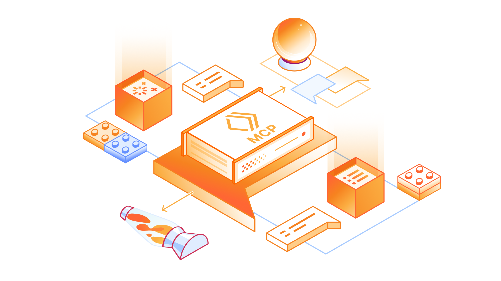

# Подключите любое React-приложение к MCP-серверу в три строки кода

Как подключить React-приложение к удалённому MCP-серверу в три строки кода с помощью use-mcp и использовать AI Playground с открытым исходным кодом для тестирования и отладки интеграций.

<!-- more -->



Вы можете [развернуть](https://developers.cloudflare.com/agents/guides/remote-mcp-server/) [удалённый сервер Model Context Protocol (MCP)](https://blog.cloudflare.com/remote-model-context-protocol-servers-mcp/) в Cloudflare буквально в один клик. Не верите? Нажмите кнопку ниже.

[](https://deploy.workers.cloudflare.com/?url=https://github.com/cloudflare/ai/tree/main/demos/remote-mcp-authless)

Так вы быстро запустите удалённый MCP-сервер с поддержкой актуальных стандартов MCP. Именно поэтому в Cloudflare уже развернули тысячи удалённых MCP-серверов, в том числе компании вроде [Atlassian, Linear, PayPal и других](https://blog.cloudflare.com/mcp-demo-day/).

Но развернуть сервер — это только половина дела. Мы также хотели сделать таким же простым создание и деплой удалённых MCP-клиентов, которые подключаются к этим серверам и открывают новые интеграции на базе ИИ. Поэтому мы создали `use-mcp` — React-библиотеку для подключения к удалённым MCP-серверам — и рады внести её в экосистему MCP, чтобы больше разработчиков могли строить удалённые MCP-клиенты.

Сегодня мы публикуем два инструмента с открытым исходным кодом, с которыми проще создавать и развёртывать MCP-клиенты:

1.  [`use-mcp`](https://github.com/modelcontextprotocol/use-mcp) — React-библиотека, которая подключает к любому удалённому MCP-серверу всего в 3 строках кода, автоматически обрабатывая транспорт, аутентификацию и управление сессиями. Мы рады внести эту библиотеку в [экосистему MCP](https://github.com/modelcontextprotocol), чтобы больше разработчиков могли создавать удалённые MCP-клиенты.

2.  [AI Playground](https://github.com/cloudflare/ai/tree/main/playground/ai) — платформа [AI-чат-интерфейса](https://playground.ai.cloudflare.com/) от Cloudflare, которая использует несколько LLM-моделей для взаимодействия с удалёнными MCP-серверами, поддерживает актуальный стандарт MCP и теперь может быть развёрнута вами самостоятельно.

Создаёте ли вы AI-чат-бота, ассистента поддержки или внутренний интерфейс компании — с этими инструментами можно подключать AI-агентов и приложения к внешним сервисам через MCP.

Готовы начать? Нажмите кнопку ниже, чтобы развернуть свой экземпляр Cloudflare AI Playground и посмотреть, как всё работает.

[](https://deploy.workers.cloudflare.com/?url=https://github.com/cloudflare/ai/tree/main/playground/ai)

## use-mcp: React-библиотека для создания удалённых MCP-клиентов

[`use-mcp`](https://github.com/modelcontextprotocol/use-mcp) — это [React-библиотека](https://www.npmjs.com/package/use-mcp), которая скрывает всю сложность разработки MCP-клиентов. Добавьте хук `useMCP()` в любое React-приложение, чтобы подключаться к удалённым MCP-серверам, с которыми могут взаимодействовать пользователи.

Вот весь код, который нужен для подключения к удалённому MCP-серверу:

```js
import { useMcp } from 'use-mcp/react';
function MyComponent() {
    const { state, tools, callTool } = useMcp({
        url: 'https://mcp-server.example.com',
    });
    return <div>Ваш реальный UI-код</div>;
}
```

Просто укажите URL — и подключение готово.

Под капотом `use-mcp` берёт на себя транспортные протоколы (и Streamable HTTP, и Server-Sent Events), аутентификацию и управление сессиями. Также библиотека включает набор возможностей, которые помогают создавать надёжные, масштабируемые и production-ready MCP-клиенты.

### Управление соединением

Проблемы сети не должны ухудшать пользовательский опыт. `use-mcp` управляет повторными попытками и переподключениями по схеме backoff, чтобы клиент мог восстановить соединение при сетевых сбоях и продолжить с того места, где остановился. Хук отдаёт [состояния подключения](https://github.com/modelcontextprotocol/use-mcp/tree/main?tab=readme-ov-file#return-value) в реальном времени (`"connecting"`, `"ready"`, `"failed"`), что позволяет строить отзывчивый UI без собственной логики управления соединением.

```js
const { state } = useMcp({ url: 'https://mcp-server.example.com' });

if (state === 'connecting') {
    return <div>Устанавливаем соединение...</div>;
}
if (state === 'ready') {
    return <div>Подключено и готово!</div>;
}
if (state === 'failed') {
    return <div>Не удалось подключиться</div>;
}
```

### Аутентификация и авторизация

Многие MCP-серверы требуют аутентификацию для вызова инструментов. `use-mcp` поддерживает [OAuth 2.1](https://oauth.net/2.1/) и обрабатывает весь OAuth-поток целиком. Библиотека перенаправляет пользователя на страницу входа, позволяет выдать доступ, безопасно сохраняет access token от OAuth-провайдера и использует его для последующих запросов к серверу. Также доступны [методы](https://github.com/modelcontextprotocol/use-mcp/tree/main?tab=readme-ov-file#api-reference) для отзыва доступа и очистки сохранённых учётных данных. В итоге вы получаете полноценную систему аутентификации для безопасного подключения к удалённым MCP-серверам без написания этой логики вручную.

```js
const { clearStorage } = useMcp({ url: 'https://mcp-server.example.com' });

// Отозвать доступ и очистить сохранённые данные
const handleLogout = () => {
    clearStorage(); // Удаляет все сохранённые токены, данные клиента и auth-состояние
};
```

### Динамическое обнаружение инструментов

Когда вы подключаетесь к MCP-серверу, `use-mcp` получает список доступных инструментов. Если сервер добавляет новые возможности, приложение увидит их без изменений кода. Каждый инструмент предоставляет типобезопасные метаданные о входных параметрах и функциональности, поэтому клиент может автоматически валидировать ввод пользователя и корректно вызывать инструменты.

### Возможности отладки и мониторинга

Чтобы упростить диагностику интеграций MCP, `use-mcp` предоставляет массив логов со структурированными сообщениями уровней debug, info, warn и error — с временными метками для каждого события. Включите подробное логирование через опцию debug, чтобы отслеживать вызовы инструментов, OAuth-потоки, смену состояния подключения и ошибки. Такая наблюдаемость в реальном времени облегчает поиск проблем и в разработке, и в продакшене.

### Готово к будущим изменениям и обратно совместимо

MCP быстро развивается: недавно обновились транспортные механизмы, а впереди изменения в авторизации. `use-mcp` поддерживает и Server-Sent Events (SSE), и более новый транспорт Streamable HTTP, автоматически определяя и используя более современные протоколы, если их поддерживает MCP-сервер.

По мере развития спецификации MCP мы будем обновлять библиотеку в соответствии с актуальными стандартами, сохраняя обратную совместимость. Также мы рады вносить вклад в [проект MCP](https://github.com/modelcontextprotocol/), чтобы `use-mcp` рос вместе с сообществом.

### MCP Inspector, созданный с помощью use-mcp

В [директории примеров](https://github.com/modelcontextprotocol/use-mcp/tree/main/examples) `use-mcp` есть минималистичный [MCP Inspector](https://inspector.use-mcp.dev/), построенный на хуке `use-mcp`. Введите URL любого MCP-сервера, чтобы протестировать подключение, посмотреть доступные инструменты и отслеживать взаимодействия через debug-логи. Это отличный старт для создания собственного MCP-клиента и удобный инструмент для отладки подключений к вашему MCP-серверу.


[](https://deploy.workers.cloudflare.com/?url=https://github.com/modelcontextprotocol/use-mcp/tree/main/examples/inspector)

## AI Playground с открытым исходным кодом

Изначально мы создали [AI Playground](https://playground.ai.cloudflare.com/) как чат-интерфейс для тестирования разных AI-моделей, поддерживаемых Workers AI. Затем добавили поддержку MCP, чтобы использовать его как удалённый MCP-клиент для подключения к MCP-серверам и их проверки. Сегодня AI Playground становится проектом с открытым исходным кодом: вы получаете полноценный чат-интерфейс со встроенным MCP-клиентом, который можно развернуть самостоятельно и настроить под свои задачи.

[](https://deploy.workers.cloudflare.com/?url=https://github.com/cloudflare/ai/tree/main/playground/ai)

Playground уже включает поддержку актуальных стандартов MCP: транспорт Streamable HTTP и Server-Sent Events, OAuth-потоки аутентификации для входа и выдачи разрешений, а также аутентификацию bearer token для прямых подключений к MCP-серверам.


### Как работает AI Playground

AI Playground построен на Workers AI, что даёт доступ к полному каталогу больших языковых моделей (LLM), работающих в сети Cloudflare, в сочетании с Agents SDK и библиотекой `use-mcp` для подключений к MCP-серверам.

AI Playground использует библиотеку `use-mcp` для управления подключениями к удалённым MCP-серверам. При запуске инициализируется система MCP-подключений через `const {tools: mcpTools} = useMcp()`, что даёт доступ ко всем инструментам подключённых серверов. Изначально список пуст, потому что подключений ещё нет, но после соединения с удалённым MCP-сервером инструменты автоматически обнаруживаются и добавляются в список.

После [подключения](https://github.com/cloudflare/ai/blob/af1ce8be87d6a4e6bc10bb83f7959e63b28c1c8e/playground/ai/src/McpServers.tsx#L550) playground сразу получает доступ к инструментам, которые публикует MCP-сервер. Библиотека `use-mcp` берёт на себя всё протокольное взаимодействие, обнаружение инструментов и поддержку состояния соединения. Если сервер требует аутентификацию, playground проходит OAuth-поток через отдельную callback-страницу, использующую `onMcpAuthorization` из `use-mcp` для завершения процесса.

Когда пользователь отправляет сообщение в чат, playground берёт `mcpTools` из хука `use-mcp` и напрямую передаёт их в Workers AI, чтобы модель понимала доступные возможности и вызывала нужные инструменты по мере необходимости.

```js
const stream = useChat({
    api: '/api/inference',
    body: {
        model: params.model,
        tools: mcpTools, // Инструменты с подключённых MCP-серверов
        max_tokens: params.max_tokens,
        system_message: params.system_message,
    },
});
```

### Отладка и мониторинг

Для мониторинга и отладки подключений к MCP-серверам мы добавили в playground интерфейс Debug Log. Он показывает информацию в реальном времени: статус подключения, состояние аутентификации и любые ошибки соединения.

Во время общения в чате интерфейс отладки показывает сырые сообщения между playground и MCP-сервером, включая вызов инструмента и его результат. Это позволяет видеть JSON payload, отправляемый на сервер, исходный ответ и отслеживать, успешен ли вызов инструмента. Особенно полезно тем, кто создаёт удалённые MCP-серверы: так легче понять, как инструменты ведут себя в интеграции с разными языковыми моделями.

## Вклад в экосистему MCP

Одна из причин, почему MCP так быстро развивается, — это проект с открытым исходным кодом, который двигает сообщество. Мы рады вносить библиотеку `use-mcp` в [экосистему MCP](https://github.com/modelcontextprotocol), чтобы больше разработчиков могли создавать удалённые MCP-клиенты.

Если вы ищете примеры MCP-клиентов или MCP-серверов для старта, загляните в [репозиторий Cloudflare AI на GitHub](https://github.com/cloudflare/ai): там есть рабочие примеры, которые можно развернуть и модифицировать. Включая полный [исходный код](https://github.com/cloudflare/ai/tree/main/playground/ai) AI Playground, несколько удалённых MCP-серверов с разными провайдерами аутентификации и авторизации, а также [MCP Inspector](https://github.com/cloudflare/ai/tree/main/demos/use-mcp-inspector).

Мы также публично разрабатываем [Cloudflare MCP servers](https://github.com/cloudflare/mcp-server-cloudflare) и приветствуем вклад сообщества, чтобы сделать их лучше.

<small>Источник — <https://blog.cloudflare.com/connect-any-react-application-to-an-mcp-server-in-three-lines-of-code/></small>
