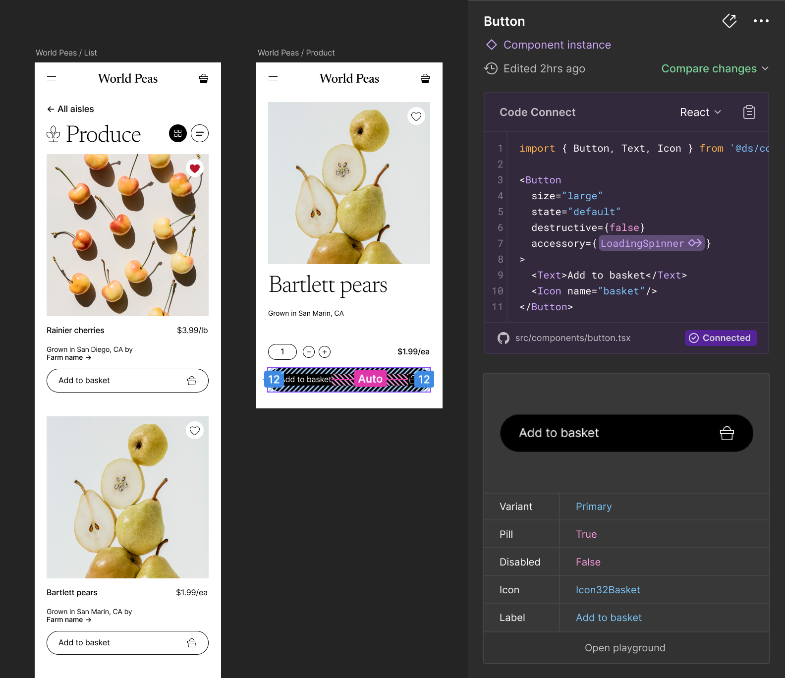
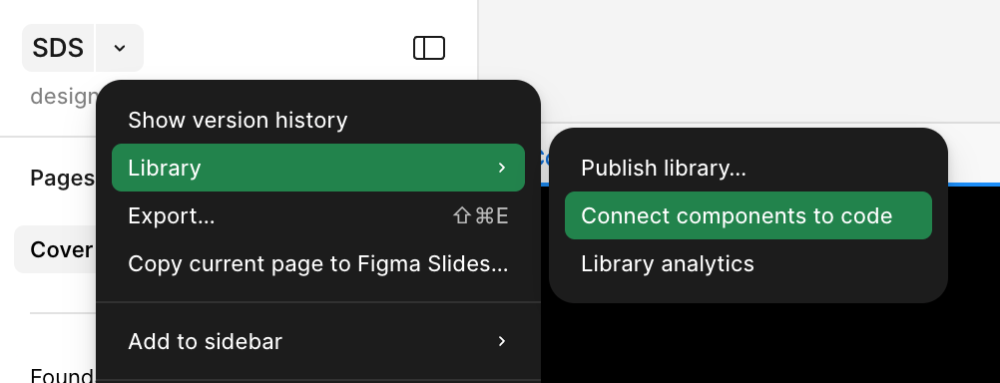
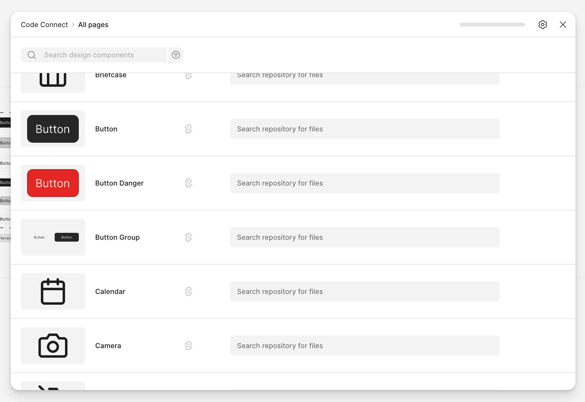
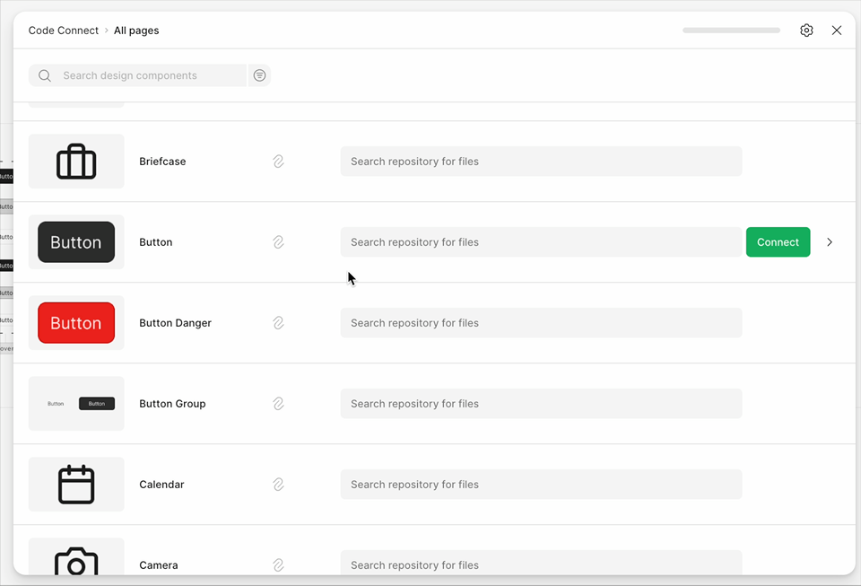
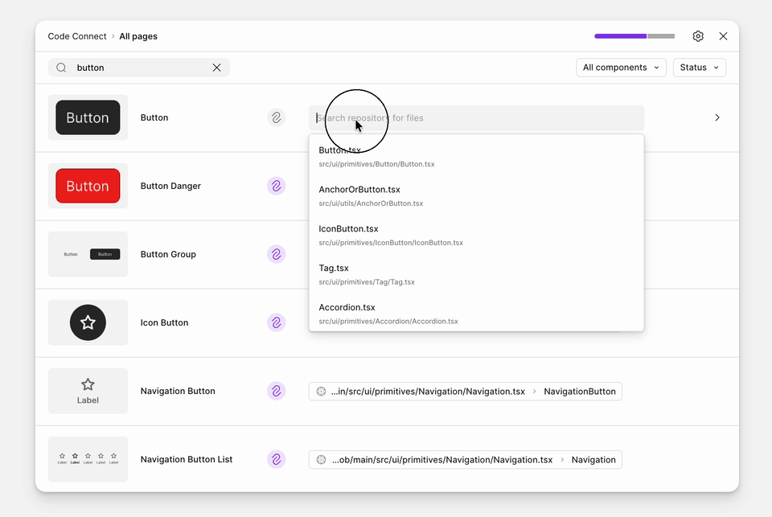
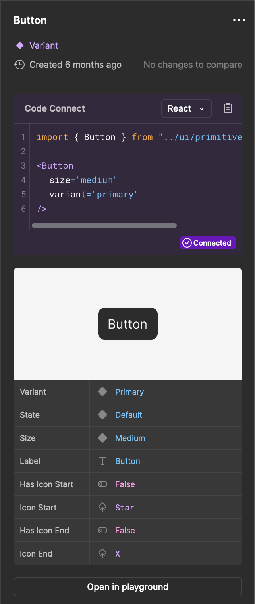

# Figma Code Connect — подробное руководство {#figma-code-connect-guide}

Code Connect связывает компоненты из вашей кодовой базы с компонентами в файлах Figma. После настройки эти связи расширяют возможности [сервера Figma MCP](https://developers.figma.com/docs/figma-mcp-server/): AI-агенты получают более точный контекст реализации и прямые ссылки на фактический код.

<!-- more -->

!!! info "Информация"

    Доступно на [тарифном месте (seat) Dev или Full](https://help.figma.com/hc/en-us/articles/360040328273-Seats-in-Figma#seat-types) в рамках [планов Organization и Enterprise](https://www.figma.com/pricing/)

## Code Connect CLI {#code-connect-cli}

Сделайте дизайн-систему доступной разработчикам и создайте единый источник правды для дизайна и кода.

[Руководство по началу работы](#getting-started-with-code-connect-cli) поможет настроить Code Connect CLI и опубликовать первые компоненты. **[Начало работы с Code Connect CLI →](#getting-started-with-code-connect-cli)**

## Code Connect UI {#code-connect-ui}

**Code Connect UI** позволяет связывать компоненты непосредственно в Figma, а при интеграции с GitHub — получать доступ к репозиторию и дополнительному контексту для сопоставления. UI поддерживает связи «один ко многим»: один дизайн-компонент можно сопоставить с несколькими реализациями на разных фреймворках и языках (например, React и Vue). Это упрощает масштабирование для команд дизайна и разработки. В будущем планируются автоматическое сопоставление и расширенная поддержка фреймворков. **[Начало работы с Code Connect UI →](#getting-started-with-code-connect-ui)**

!!! info "Информация"

    **Code Connect UI** и **Code Connect CLI** можно использовать вместе. Связи, созданные через CLI, отображаются в UI, но редактировать их можно только в CLI. В обоих случаях сопоставления передают серверу Figma MCP дополнительный контекст кода.

## Файлы шаблонов (рекомендуется) {#template-files-recommended}

Рекомендуемый способ использования Code Connect CLI — **файлы шаблонов**. Это не зависящий от фреймворка подход: в TypeScript-файлах вы явно описываете, как должны выглядеть фрагменты кода. Файлы шаблонов работают с любой кодовой базой и дают полный контроль над генерацией результата.

**Button.figma.ts**

```typescript
// url=https://www.figma.com/file/your-file-id/Button?node-id=123
import figma from 'figma';

const instance = figma.selectedInstance;

export default {
    example: figma.code`
    <Button
      size={${instance.getEnum('Size', { Large: 'large', Medium: 'medium', Small: 'small' })}}
      disabled={${instance.getBoolean('Disabled')}}
    >
      ${instance.getString('Text Content')}
    </Button>
  `,
    imports: ['import { Button } from "components/Button"'],
    id: 'button',
};
```

**[Подробнее о файлах шаблонов →](#writing-template-files)**

Если вы используете AI-агента для программирования, [**навык `figma-code-connect`**](#write-template-files-with-an-ai-coding-agent) поможет создать шаблон Code Connect по URL компонента Figma. Подробнее обо всех навыках Figma см. в [Справочном центре](https://help.figma.com/hc/en-us/articles/39166810751895-Figma-skills-for-MCP).

## Устаревшие API, специфичные для фреймворков {#legacy-framework-specific-apis}

Code Connect CLI также включает интеграции для конкретных фреймворков. В руководствах ниже показано, как сопоставлять свойства и варианты для:

- **[React (и React Native) →](#connecting-react-components)**
- **[HTML (например, Web Components, Angular и Vue) →](#connecting-web-components)**

## Публикация в Figma для упрощения передачи в разработку {#publish-to-figma}

После публикации ваши компоненты станут доступны в Dev Mode Figma, а вместо автоматически сгенерированных примеров будут показываться фрагменты кода из дизайн-системы, соответствующие её реальным компонентам.



---

## Начало работы с Code Connect UI {#getting-started-with-code-connect-ui}

!!! info "Информация"

    Доступно на [тарифном месте (seat) Dev или Full](https://help.figma.com/hc/en-us/articles/360040328273-Seats-in-Figma#seat-types) в рамках [планов Organization и Enterprise](https://www.figma.com/pricing/)

    Требуется файл библиотеки Figma с опубликованными дизайн-компонентами

Code Connect UI позволяет сопоставить дизайн-компоненты из библиотек Figma с соответствующими компонентами в репозитории. Такие сопоставления расширяют возможности [сервера Figma MCP](https://developers.figma.com/docs/figma-mcp-server/): AI-агенты получают прямые ссылки на ваш код и более точные рекомендации по реализации.

!!! note "Примечание"

    Компоненты, подключённые через Code Connect UI, не отображают фрагменты кода на панели Inspect. Сейчас показываются только путь к файлу и имя компонента (если они указаны), а также доступен предпросмотр фрагментов, сгенерированных AI. Чтобы отображать фрагменты кода в Inspect, используйте [Code Connect CLI](#getting-started-with-code-connect-cli).

---

### Подключение компонентов из библиотеки дизайна {#podklyuchenie-komponentov-iz-biblioteki-dizayna}

1.  В Figma откройте файл библиотеки с дизайн-компонентами.
2.  Переключитесь в **Dev Mode**.
3.  В выпадающем меню рядом с именем файла выберите **Library → Connect components to code** (Библиотека → Подключить компоненты к коду).



Откроется Code Connect UI со списком всех **опубликованных** компонентов библиотеки. В этом окне можно сопоставить компоненты с кодовой базой.



#### Подключение репозитория GitHub (необязательно) {#podklyuchenie-repozitoriya-github-neobyazatelno}

!!! info "Информация"

    Подключение к GitHub необязательно. Вы можете сопоставить компоненты дизайн-системы с путями в коде вручную без подключения к GitHub.

Нажмите значок **Параметры** в Code Connect UI, чтобы [подключить репозиторий к GitHub](#connect-to-your-github-repository).

Подключение к GitHub даёт дополнительные возможности:

- Поля сопоставления автодополняются путями к файлам из репозитория.
- Можно просматривать и искать компоненты напрямую в GitHub.



#### Ручное подключение компонентов {#manually-connecting-components}

Без подключения к GitHub вы всё равно можете создавать сопоставления, вводя вручную:

- Путь к компоненту в кодовой базе (например, `src/components/Button.tsx`)
- При необходимости — имя компонента (например, `Button`)

Все сопоставления передаются серверу Figma MCP. Когда используется сопоставленный дизайн-компонент, его контекст кода включается в данные, которые отправляются AI-агентам.

!!! note "Примечание"

    При работе в IDE Code Connect также может предлагать встроенные подсказки (открытая бета-версия) через удалённый сервер MCP. Подсказки в реальном времени показывают релевантные сопоставления компонентов и обновления кода, помогая синхронизировать дизайн и код.

---

### Подключение компонентов из выбранного фрейма {#connect-components-from-selected-frame}

При запуске сервера Figma MCP для выбранного фрейма качество результатов зависит от того, сопоставлены ли его дизайн-компоненты с кодом.

- Если во фрейме есть **несопоставленные компоненты**, у сервера MCP не будет полного контекста, и результаты могут быть менее точными.
- На **панели Inspect в Dev Mode** нажмите **Connect components** (Подключить компоненты), чтобы открыть Code Connect UI. Так можно сопоставить недостающие компоненты текущего фрейма.
- После добавления сопоставление сразу передаётся серверу MCP и используется как контекст, повышая точность результатов, сгенерированных AI.


---

### Подключение одного компонента к нескольким фреймворкам {#connecting-one-component-to-multiple-frameworks}

Code Connect UI поддерживает **связи «один ко многим»**, позволяя сопоставить один дизайн-компонент с несколькими компонентами кода на разных языках или фреймворках. Например, дизайн-компонент `Button` можно одновременно связать с реализациями на React и Vue.

Это полезно, когда дизайн-система поставляет компоненты для нескольких платформ. Каждая связь независима: для каждого фреймворка можно указать разные пути к файлам, имена компонентов и пользовательские инструкции.

#### Добавление нескольких связей {#add-multiple-connections}

1.  В Code Connect UI прокрутите до дизайн-компонента, который нужно подключить.
2.  Если компонент ещё не подключён — подключите его.
3.  При наведении на строку компонента появится кнопка добавления, позволяющая подключить ещё один компонент кода.
4.  Укажите путь к файлу и имя нового компонента кода (например, `src/components/Button.tsx`).
5.  Повторите для каждого дополнительного фреймворка или языка.



---

### Добавление пользовательских инструкций для генерации кода AI {#add-custom-instructions-for-ai}

После сопоставления компонента с кодовой базой можно добавить контекст, чтобы AI-агенты генерировали более подходящий код. Это особенно полезно для компонентов со специфическими паттернами использования, требованиями доступности или соглашениями команды.

#### Добавление инструкций для MCP {#add-instructions-for-mcp}

Для любого сопоставленного компонента можно добавить пользовательские инструкции, которые языковая модель (LLM) будет использовать через сервер Figma MCP:

1.  В Code Connect UI выберите подключённый компонент.
2.  Нажмите кнопку **Add instructions for MCP** (Добавить инструкции для MCP).
3.  Напишите промпты, описывающие, как следует использовать компонент, включая:
    - Конкретные свойства или паттерны конфигурации
    - Соображения по доступности
    - Типичные сценарии использования или варианты
    - Соглашения по коду, принятые в команде

Эти инструкции отправляются на сервер MCP вместе с сопоставлением компонента и помогают AI генерировать код, соответствующий реализации вашей дизайн-системы.

#### Предпросмотр фрагментов кода, сгенерированных AI {#preview-ai-generated-code-snippets}

Чтобы проверить, какой код получится с учётом сопоставлений и инструкций, можно просмотреть сгенерированные AI фрагменты прямо в Code Connect UI:

1.  Выберите подключённый компонент в Code Connect UI.
2.  **Измените свойства** дизайн-компонента, чтобы проверить разные конфигурации (например, размеры, состояния или варианты кнопки).
3.  Посмотрите **предпросмотр фрагмента кода**, чтобы увидеть результат работы LLM с учётом:
    - Сопоставления компонента
    - Пользовательских инструкций для MCP
    - Текущих значений свойств

Предпросмотр помогает уточнить инструкции и убедиться, что AI генерирует подходящий код для всех вариантов компонента.

!!! info "Информация"

    Фрагменты в предпросмотре генерируются в другом контексте, чем при реальных запросах к серверу MCP. Поэтому код в предпросмотре может немного отличаться от результата, который LLM выдаст при фактическом использовании, когда у него есть полная история диалога и дополнительный контекст.

---

## Подключение репозитория GitHub {#connect-to-your-github-repository}

Подключение репозитория GitHub к Figma позволяет Code Connect UI обращаться к кодовой базе, упрощает сопоставление компонентов и добавляет контекст для этих сопоставлений.

!!! info "Информация"

    GitHub Enterprise Server (GHES) не поддерживается.

### Что даёт интеграция {#chto-daet-integratsiya}

При подключении репозитория GitHub к Code Connect UI в Figma становятся доступны следующие возможности:

- **Подсказки из кодовой базы**: поля сопоставления компонентов автодополняются путями к файлам и именами компонентов из репозитория, что ускоряет создание точных сопоставлений.
- **Расширенный контекст для AI через MCP**: сопоставленные компоненты дают [серверу Figma MCP](https://developers.figma.com/docs/figma-mcp-server/) более богатый контекст. Когда AI-агенты работают с вашими макетами, они получают прямые ссылки на фактическую реализацию в коде.
- **Пользовательские инструкции для LLM**: для каждого сопоставленного компонента можно добавить инструкции через функцию «Add instructions for MCP». Эти промпты помогают LLM генерировать код, соответствующий паттернам и лучшим практикам вашей команды.

### Подключение файла библиотеки {#podklyuchenie-fayla-biblioteki}

!!! note "Примечание"

    Вы должны быть владельцем файла, который подключаете к GitHub, или администратором организации.

1.  Откройте **Code Connect UI** в файле библиотеки Figma.
2.  Нажмите значок **Параметры**.
3.  Выберите **Connect to GitHub** (Подключить к GitHub). Войдите в учётную запись GitHub с доступом к нужному репозиторию.
4.  По запросу предоставьте доступ к:
    - **Всем репозиториям** в вашей учётной записи.
    - **Конкретным репозиториям**, в которых находятся компоненты вашей дизайн-системы.

### Авторизация доступа {#avtorizatsiya-dostupa}

Следующий шаг зависит от вашей роли в организации GitHub, для которой вы запрашиваете авторизацию:

- **Если у вас есть права администратора**
    1.  Выберите **Install and Authorize** (Установить и авторизовать), чтобы предоставить Figma доступ.
    2.  Подтвердите, к каким репозиториям Figma может обращаться.

- **Если прав администратора нет**
    1.  Выберите **Request access** (Запросить доступ).
    2.  Будет отправлен запрос администратору организации; он должен одобрить доступ, прежде чем вы сможете продолжить.

!!! info "Информация"

    Обзор запрашиваемых разрешений при авторизации через GitHub см. в [**Обзор разрешений приложения GitHub →**](https://developers.figma.com/docs/code-connect/github-permissions/)

### Подключение к репозиторию {#podklyuchenie-k-repozitoriyu}

1.  После завершения авторизации выберите **один репозиторий**, который нужно подключить к файлу библиотеки Figma. К одному файлу библиотеки можно подключить только один репозиторий.
2.  Укажите **каталоги**, в которых находятся UI-компоненты.
3.  После этого эти каталоги станут доступны в Code Connect.

---

## Сравнение Code Connect UI и Code Connect CLI {#comparing-code-connect-ui-and-cli}

Code Connect предлагает два способа связать дизайн-компоненты в Figma с рабочим кодом: **Code Connect UI** и **Code Connect CLI**. Оба используют одну инфраструктуру MCP, но отличаются интеграцией в рабочий процесс, доступом к коду и контекстом, передаваемым через MCP.

### Обзор {#obzor}

**Code Connect CLI** ориентирован на разработчиков и запускается локально в репозитории. Он позволяет сопоставлять свойства, генерировать динамические примеры кода и публиковать связи в Figma из терминала. Интеграции с React и Web Components, а также поддержка документации Code Connect на JavaScript сочетают глубину для популярных фреймворков с гибкостью для любого языка. CLI подходит командам разработки, которым нужны точность и контроль.

**Code Connect UI** ориентирован на доступность и совместную работу. Он работает целиком в Figma, поэтому сопоставления можно создавать непосредственно в файлах дизайна или библиотеках без установки дополнительных инструментов. При подключении к репозиторию GitHub UI получает пути и имена компонентов из кодовой базы и связывает их с дизайн-компонентами. Путь и имя компонента можно также указать вручную, без подключения репозитория. Code Connect UI поддерживает связи «один ко многим»: один дизайн-компонент можно сопоставить с несколькими реализациями на разных фреймворках и языках (например, React и Vue). Сопоставление свойств и динамические примеры пока недоступны, зато подход не привязан к языку, прост в настройке и хорошо масштабируется для команд дизайна и разработки.

### Сравнение возможностей {#sravnenie-vozmozhnostey}

| Возможность | Code Connect CLI | Code Connect UI |
| --- | --- | --- |
| **Контекст MCP** | Путь к компоненту, имя компонента, сопоставление свойств и динамические примеры кода | Путь к компоненту, имя компонента, пользовательский промпт и контекст компонента из кодовой базы |
| **Пользовательский опыт** | Локально в репозитории; публикация из терминала | Интеграция с Figma; сопоставление прямо в файлах дизайна или библиотеках; сейчас ограничено одной кодовой библиотекой |
| **Доступ к кодовой базе** | Локально на вашей машине и в репозитории | Подключение к репозиторию через Figma |
| **Фреймворк и язык** | Парсеры для React, Web Components; документация на JS для любого языка | Достаточно пути к коду и имени компонента; не привязан к языку; связи «один ко многим» между фреймворками |
| **Фрагменты кода** | Показывает фрагменты кода дизайн-системы на панели Inspect. | Показывает путь к файлу и имя компонента (если они указаны); поддерживает предпросмотр фрагментов, сгенерированных AI. |

---

## Начало работы с Code Connect CLI {#getting-started-with-code-connect-cli}

В этом руководстве мы настроим Code Connect CLI с использованием **файлов шаблонов** — рекомендуемого подхода для связи компонентов дизайна с кодом. Файлы шаблонов не зависят от фреймворка и дают полный контроль над фрагментами кода, отображаемыми в Figma.

Мы пройдём по шагам:

1.  [Установка Code Connect CLI](#install-the-code-connect-command-line-tool)
2.  [Настройка проекта](#configure-your-project-step)
3.  Создание первого файла шаблона — [с помощью AI-агента](#write-template-files-with-an-ai-coding-agent) или [вручную](#write-your-first-template-file-manually)
4.  [Публикация в Figma](#publish-code-connect-files)
5.  [Дальнейшие шаги](#next-steps)

### Перед началом {#pered-nachalom}

Для работы по этому руководству вам понадобятся кодовая база дизайн-системы с компонентами и библиотека дизайна в Figma — файл Figma с корневыми компонентами дизайн-системы.

Для практики можно использовать Simple Design System (SDS) от Figma. Если вы выбрали SDS:

1.  Откройте [файл сообщества Simple Design System](https://www.figma.com/community/file/1380235722331273046) в Figma и при запросе выберите **Make a copy** (Создать копию). В файле SDS находятся компоненты дизайн-системы.
2.  Клонируйте [репозиторий SDS](https://github.com/figma/sds). В репозитории находятся компоненты кода, которые вы подключите к своей копии файла SDS.

**Требования**

Для установки и использования Code Connect необходимо:

- Установить [Node.js 18 или новее](https://nodejs.org/en/download/package-manager)
- [Сгенерировать персональный токен доступа](https://help.figma.com/hc/en-us/articles/8085703771159-Manage-personal-access-tokens) с областью Code Connect **Write** и областью File content **Read**.

#### Установка инструмента командной строки Code Connect {#install-the-code-connect-command-line-tool}

Сначала установите инструмент командной строки Code Connect. Он позволяет подключать компоненты, публиковать их и снимать с публикации.

Проще всего установить CLI через Node Package Manager (`npm`):

```bash
npm install --global @figma/code-connect@latest
```

#### Конфиденциальность и Code Connect {#konfidentsialnost-i-code-connect}

Figma собирает только минимальный объём данных, необходимый для работы Code Connect. При запуске `figma connect` через командную строку Figma получает следующие данные:

- Пути к добавленным компонентам
- URL репозитория, в котором реализованы компоненты Code Connect
- Свойства и код в файлах .figma

Figma регистрирует только базовые события, необходимые для анализа использования Code Connect: публикацию и снятие компонентов с публикации, а также вызовы получения данных Figma из командной строки.

Дополнительную информацию о подходе Figma к конфиденциальности см. в [политике конфиденциальности](https://www.figma.com/legal/privacy/) Figma.

#### Настройка проекта {#configure-your-project-step}

Создайте файл `figma.config.json` в корне проекта:

```json
{
    "codeConnect": {
        "include": ["**/*.figma.ts"],
        "label": "React",
        "language": "jsx"
    }
}
```

Значения `label` и `language` определяют, как фрагменты кода помечаются в Figma. Измените их в соответствии с вашей кодовой базой.

Если вы используете TypeScript, добавьте определения типов шаблонов в `tsconfig.json` для автодополнения и проверки типов в файлах шаблонов:

**tsconfig.json**

```json
{
    "compilerOptions": {
        "types": ["@figma/code-connect/figma-types"]
    }
}
```

#### Создание файлов шаблонов с помощью AI-агента {#write-template-files-with-an-ai-coding-agent}

Если вы используете агента с поддержкой сервера Figma MCP, навык **`figma-code-connect`** создаст файлы шаблонов за вас. Укажите компонент или фрейм Figma — и агент сгенерирует в вашем репозитории файлы `.figma.ts`, готовые к публикации через CLI.

Навык выполняет ту же работу, что описана в следующем разделе: разбирает URL Figma, определяет компоненты в выделении без сопоставлений Code Connect, читает определения их свойств, находит соответствующий компонент в репозитории и создаёт файл шаблона с заполненными сопоставлениями свойств. Проверьте результат, при необходимости скорректируйте его, а затем опубликуйте.

Для использования навыка необходимо:

- Агент с установленным сервером Figma MCP. Инструкции по настройке см. в разделе [Подключение к удалённому серверу Figma MCP](https://developers.figma.com/docs/figma-mcp-server/remote-server-installation/).
- Установленный в агенте навык `figma-code-connect`. Проще всего установить плагин Figma для вашей IDE, который включает все навыки Figma. Можно также установить навык вручную из репозитория [`mcp-server-guide`](https://github.com/figma/mcp-server-guide).
- Code Connect CLI установлен и `figma.config.json` настроен, как описано выше.

Полные инструкции по навыку и используемому API см. в [`figma-code-connect/SKILL.md`](https://github.com/figma/mcp-server-guide/blob/main/skills/figma-code-connect/SKILL.md). Обо всех навыках Figma для MCP см. в [Справочном центре](https://help.figma.com/hc/en-us/articles/39166810751895-Figma-skills-for-MCP).

После создания файлов шаблонов [опубликуйте их в Figma](#publish-code-connect-files) так же, как файлы, написанные вручную.

#### Создание первого файла шаблона вручную {#write-your-first-template-file-manually}

Файлы шаблонов связывают компонент Figma с фрагментом кода. Они имеют расширение `.figma.ts` (или `.figma.js`) и располагаются рядом с компонентами в кодовой базе.

Для подключения компонента Figma:

1.  В Figma щёлкните правой кнопкой мыши на компонент и выберите **Copy link to selection**, чтобы получить URL.
2.  Создайте файл `.figma.ts` для вашего компонента. Имя файла должно соответствовать имени компонента, например `Button.figma.ts`:

**Button.figma.ts**

```typescript
// url=https://www.figma.com/file/your-file-id/Button?node-id=123
import figma from 'figma';

const instance = figma.selectedInstance;

const label = instance.getString('Label');
const disabled = instance.getBoolean('Disabled');
const size = instance.getEnum('Size', {
    Large: 'large',
    Medium: 'medium',
    Small: 'small',
});

export default {
    example: figma.code`
    <Button size={${size}} disabled={${disabled}}>
      ${label}
    </Button>
  `,
    imports: ['import { Button } from "components/Button"'],
    id: 'button',
};
```

Файл состоит из трёх основных частей:

- **Метаданные в комментарии** (`// url=...`): связывают файл с конкретным компонентом Figma. URL должен указывать на компонент в файле дизайн-системы (в Figma щёлкните правой кнопкой мыши по компоненту и выберите **Copy link to selection**).
- **Доступ к свойствам**: методы `figma.selectedInstance` позволяют читать свойства компонента Figma и сопоставлять их со значениями в коде. Часто используются `getString`, `getBoolean`, `getEnum` и `getInstanceSwap`.
- **`export default`**: определяет фрагмент кода (`example`), операторы `import`, которые отображаются в начале фрагмента, и уникальный `id` шаблона.

Полный API шаблонов, включая все доступные методы и расширенные возможности, см. в разделе [Написание файлов шаблонов](#writing-template-files).

#### Публикация файлов Code Connect {#publish-code-connect-files}

Чтобы видеть фрагменты Code Connect для компонентов в Dev Mode, сначала нужно опубликовать файлы:

1.  В корне репозитория выполните следующую команду с вашим персональным токеном доступа:

    ```bash
    npx figma connect publish --token=PERSONAL_ACCESS_TOKEN
    ```

    Здесь `PERSONAL_ACCESS_TOKEN` — сгенерированный вами токен доступа к API Figma.

    !!!note "Примечание"

        Вместо этого можно использовать переменную окружения `FIGMA_ACCESS_TOKEN`. В этом случае параметр `--token` не нужен.

    Инструмент опубликует файлы Code Connect и вернёт список имён компонентов и URL соответствующих узлов.

2.  Чтобы посмотреть сопоставленные компоненты в Figma, щёлкните ссылки в списке после публикации. Они откроют соответствующие компоненты в файле дизайн-системы Figma.

3.  На панели инструментов щёлкните **Dev Mode**. Фрагмент кода из Code Connect появится на панели Inspect справа.



#### Снятие файлов Code Connect с публикации {#unpublish-code-connect-files}

При проблемах с сопоставлениями или необходимости отключить компонент можно снять файл Code Connect с публикации. Для этого используйте:

```bash
npx figma connect unpublish --node=NODE_URL --label=LABEL
```

Здесь `NODE_URL` — URL конкретного узла в файле дизайн-системы, а [`label`](#label) — метка для снятия с публикации, например «React» или «Vue».

!!! info "Информация"

    **Важно:** если не указать URL узла, Code Connect снимет с публикации все компоненты, определённые в директории файлов Code Connect. Чтобы узнать о других настройках, используйте флаг `--help`.

### Следующие шаги {#next-steps}

После публикации первого файла шаблона можно изучить следующее:

- **[Написание файлов шаблонов →](#writing-template-files)**: полный API шаблонов, включая вложенные компоненты, условное отображение и другие возможности.
- **[Справочник Template API →](#template-api-reference)**: полный список доступных методов и типов.
- **[Настройка проекта →](#configuring-your-project)**: расширенные параметры конфигурации для `figma.config.json`.
- **API для конкретных фреймворков**: интеграции Code Connect с [React (и React Native)](#connecting-react-components) и [HTML/Web Components](#connecting-web-components).

---

## Настройка проекта {#configuring-your-project}

Code Connect настраивается через файл `figma.config.json`, который должен находиться в корне проекта (например, рядом с `package.json` или `.xcodeproj`).

Для каждой платформы доступны общие параметры конфигурации и параметры, специфичные для этой платформы.

### Общие параметры конфигурации {#obschie-parametry-konfiguratsii}

#### `include` и `exclude` {#include-i-exclude}

`include` и `exclude` — списки glob-паттернов, которые определяют, какие файлы Code Connect нужно разбирать и где искать компоненты при использовании [интерактивной настройки](#configuring-your-project). Пути в `include` и `exclude` должны быть относительными к расположению файла конфигурации.

```json
{
    "codeConnect": {
        "include": [],
        "exclude": ["test/**", "docs/**", "build/**"]
    }
}
```

#### `parser` {#parser}

Code Connect определяет тип проекта по корневой директории:

- Если найден `package.json` с `react`, проект определяется как React.
- Если найден `package.json` без `react`, проект определяется как HTML.
- Если найден файл `Package.swift` или `*.xcodeproj`, проект определяется как Swift.
- Если найден файл `build.gradle.kts`, проект определяется как Jetpack Compose.

Если фреймворк проекта определён неверно, можно задать тип проекта через ключ `parser` в `figma.config.json`. Допустимые значения: `react`, `html`, `swift` и `compose`.

```json
{
    "codeConnect": {
        "parser": "react"
    }
}
```

#### `label` {#label}

`label` задаёт метку, отображаемую в Figma для фрагментов Code Connect. По умолчанию метка соответствует типу проекта, например `React`. Другая метка в Dev Mode может пригодиться, например, для отображения разных версий кода.

Для [HTML-проектов](#connecting-web-components) Code Connect устанавливает метку по умолчанию на основе HTML-фреймворка, обнаруженного в ближайшем родительском `package.json` рабочей директории:

- Если найден `package.json` с `angular`, метка устанавливается в `Angular`.
- Если найден `package.json` с `vue`, метка устанавливается в `Vue`.
- В остальных случаях метка устанавливается в `Web Components`.

#### `language` {#language}

`language` задаёт язык подсветки синтаксиса фрагментов Code Connect в Figma Dev Mode. Параметр полезен, если нужно переопределить автоматически определённый язык или используется [настройка без парсера](#writing-template-files).

Допустимые значения для `language`:

- `jsx`
- `typescript`
- `swift`
- `kotlin`
- `html`
- `plaintext`
- `cpp`
- `ruby`
- `css`
- `javascript`
- `json`
- `graphql`
- `python`
- `go`
- `sql`
- `rust`
- `bash`
- `xml`
- `tsx`
- `dart`

Пример:

```json
{
    "codeConnect": {
        "language": "typescript"
    }
}
```

Если указаны и `label`, и `language`, для подсветки синтаксиса приоритет имеет `language`, а `label` определяет, как фрагмент помечается в Figma.

#### `interactiveSetupFigmaFileUrl` {#interactivesetupfigmafileurl}

`interactiveSetupFigmaFileUrl` задаёт файл Figma для [интерактивной настройки](#configuring-your-project). Если параметр указан в `figma.config.json`, этот URL автоматически используется как URL файла Figma при подключении компонентов.

Если `figma.config.json` уже существует, можно добавить этот параметр в существующий файл.

```json
{
    "codeConnect": {
        "interactiveSetupFigmaFileUrl": "https://www.figma.com/design/abc123/my-design-system"
    }
}
```

#### `documentUrlSubstitutions` {#documenturlsubstitutions}

`documentUrlSubstitutions` позволяет задать набор подстановок, применяемых к URL `figmaNode` при разборе или публикации документов.

Это позволяет использовать несколько файлов `figma.config.json` для публикации фрагментов Code Connect в разных файлах Figma без изменения самих файлов Code Connect. Например, подстановки можно использовать для тестовой версии компонентов.

Подстановки задаются объектом: ключ — строка для замены, значение — строка замены.

Рассмотрим пример:

```json
{
    "codeConnect": {
        "documentUrlSubstitutions": {
            "https://figma.com/design/1234abcd/File-1": "https://figma.com/design/5678dcba/File-2"
        }
    }
}
```

Подстановка в примере выше преобразует URL узлов Figma, например `https://figma.com/design/1234abcd/File-1/?node-id=12:345`, в `https://figma.com/design/5678dcba/File-2/?node-id=12:345`.

#### `defaultBranch` {#defaultbranch}

`defaultBranch` позволяет указать имя основной ветки репозитория, когда она не может быть определена автоматически. Code Connect использует это при генерации ссылок на исходный код в Figma.

```json
{
    "codeConnect": {
        "defaultBranch": "release"
    }
}
```

### Конфигурация проекта для React {#konfiguratsiya-proekta-dlya-react}

```json
{
    "codeConnect": {
        "parser": "react",
        "include": [],
        "exclude": ["test/**", "docs/**", "build/**"],
        "importPaths": {
            "src/components/*": "@ui/components"
        },
        "paths": {
            "@ui/components/*": ["src/components/*"]
        }
    }
}
```

#### `importPaths` {#importpaths}

`importPaths` позволяет переопределить относительные пути импорта компонентов в файлах Code Connect. Это полезно, когда пользователям дизайн-системы нужно импортировать компоненты из конкретного пакета, а не из директории относительно файлов Code Connect. Пути должны быть локальными.

Пути задаются в объекте `importPaths`: ключ — путь для сопоставления и переопределения, значение — путь для использования вместо него.

Например, кодовый компонент `Button.tsx` находится в `./src/components/` (относительно корня проекта). В той же директории — соответствующий файл Code Connect `Button.figma.tsx`:

```jsx
import { Button } from './';
figma.connect(Button, 'https://...');
```

Для импорта `Button` нужно переопределить относительный путь (`./`) и указать другой путь импорта. В `figma.config.json` добавьте:

```json
{
    "codeConnect": {
        "importPaths": {
            "src/components/*": "@ui/components"
        }
    }
}
```

В `importPaths` ключ `src/components/*` с символом подстановки `*` включает все компоненты кода в этой директории, включая `Button.tsx`. Значение задано как `@ui/components`. При следующем запуске Code Connect CLI файл Code Connect для `Button` будет обновлён:

```jsx
import { Button } from '@ui/components';
```

#### `paths` {#paths}

Если в конфигурации TypeScript используются псевдонимы путей, задайте `paths` в `figma.config.json`, чтобы Code Connect мог разрешать импорты. Объект `paths` в конфигурации Code Connect должен соответствовать объекту `paths` в `tsconfig.json` проекта.

#### `imports` {#imports}

Можно переопределить генерируемые операторы `import` для подключённого компонента, передав массив `imports`. Это полезно, когда автоматическое разрешение не подходит для вашего случая.

```jsx
figma.connect(Button, 'https://...', {
    imports: ["import { Button } from '@lib'"],
});
```

## Написание файлов шаблонов {#writing-template-files}

Файлы шаблонов дают независимый от фреймворка способ связать код с компонентами Figma. Вместо парсеров для конкретных фреймворков вы пишете TypeScript-файлы, которые явно определяют, как компоненты должны отображаться. Такой подход проще в сопровождении, гибче и предоставляет больше возможностей, чем API для конкретных фреймворков.

Файлы шаблонов дают полный контроль над генерацией кода, поэтому они идеальны, когда вам нужно:

- **Связи, независимые от фреймворка**: подключить любую кодовую базу, независимо от фреймворка или языка
- **Точный контроль кода**: генерировать именно тот код, который вам нужен, без API парсеров

Мы активно развиваем файлы шаблонов как основной формат Code Connect. Если вы начинаете новую интеграцию Code Connect или хотите участвовать в формировании её будущего, попробуйте этот подход и [оставьте отзыв](https://github.com/figma/code-connect/issues/new/choose).

!!! tip "Совет"

    Если вам нужно подключить большое количество компонентов с одинаковой структурой кода — например, библиотеку иконок, — см. раздел о [пакетных (batch) файлах](#batch-files). Такой подход позволяет не создавать отдельный файл шаблона для каждого компонента.

!!! tip "Совет"

    Если вы используете AI-агента, [**навык `figma-code-connect`**](#write-template-files-with-an-ai-coding-agent) поможет создать шаблон Code Connect по URL компонента Figma. Подробнее обо всех навыках Figma см. в [Справочном центре](https://help.figma.com/hc/en-us/articles/39166810751895-Figma-skills-for-MCP).

### Настройка {#nastroyka}

1.  Убедитесь, что в `figma.config.json` указаны файлы `.figma.ts` (или `.figma.js`), и задайте `label` и `language` (см. [Настройка проекта](#configuring-your-project)):

```json
{
    "codeConnect": {
        "include": ["**/*.figma.ts"],
        "label": "React",
        "language": "jsx"
    }
}
```

1.  При использовании TypeScript добавьте определения типов шаблонов в `tsconfig.json`, чтобы редактор мог предоставлять автодополнение и проверку типов в файлах шаблонов:

**tsconfig.json**

```json
{
    "compilerOptions": {
        "types": ["@figma/code-connect/figma-types"]
    }
}
```

1.  Напишите файл `.figma.ts` (см. [Формат файла шаблона](#format-fayla-shablona))
2.  Опубликуйте файлы шаблонов в Figma, когда будете готовы:

```bash
npx figma connect publish
```

### Формат файла шаблона {#format-fayla-shablona}

Файлы шаблонов связывают код с компонентом в Figma и определяют, как экземпляры этого компонента должны отображаться во фрагменте кода. Пример файла:

**MyComponent.figma.ts**

```typescript
// url=https://www.figma.com/file/your-file-id/Component?node-id=123
import figma from 'figma';

const instance = figma.selectedInstance;

const labelText = instance.getString('Label');
const iconInstance = instance.findInstance('Icon');

export default {
    example: figma.code`
    <MyComponent
      label={${labelText}}
      icon={${iconInstance.executeTemplate().example}}
    />
  `,
    imports: ['import MyComponent from "components/MyComponent"'],
    id: 'my-component',
    metadata: {
        nestable: true,
    },
};
```

#### Метаданные в комментариях {#metadannye-v-kommentariyah}

Каждый файл шаблона должен начинаться с блока специальных комментариев в следующем формате:

- `url` — компонент Figma, к которому опубликован ваш шаблон. В Figma щёлкните правой кнопкой мыши на компонент и выберите «Copy link to selection» (Копировать ссылку на выделение) или скопируйте URL из браузера.
- `source` (необязательно) — путь к файлу (или URL) вашего кодового компонента. Отображается в Figma.
- `component` (необязательно) — имя вашего кодового компонента. Отображается в Figma.

```typescript
// url=https://www.figma.com/file/your-file-id/Component?node-id=123
// source=src/components/MyButton.tsx
// component=MyButton
```

#### Построение фрагмента {#postroenie-fragmenta}

Пример фрагмента — основная часть файла шаблона. Он описывает, как должен выглядеть код с учётом экземпляра компонента Figma.

##### Доступ к свойствам экземпляра {#dostup-k-svoystvam-instansa}

Используйте методы на `figma.selectedInstance` для чтения свойств из вашего компонента Figma:

```typescript
import figma from 'figma';

const instance = figma.selectedInstance;

// Get the value of the Figma instance "Label" string property
const label = instance.getString('Label');

// Get the value of the Figma instance "Disabled" boolean property
const disabled = instance.getBoolean('Disabled');

// Map the possible values of the "Size" enum property to code values
// (e.g. if the Figma "Size" property is "Small", map to 'sm' in code)
const size = instance.getEnum('Size', {
    Small: 'sm',
    Medium: 'md',
    Large: 'lg',
});
```

##### Работа с вложенными экземплярами {#rabota-s-vlozhennymi-instansami}

Чтобы включить вложенные экземпляры компонентов (например, иконку внутри кнопки), используйте `findInstance()` или `getInstanceSwap()` для поиска дочернего элемента, а затем вызовите `executeTemplate()` для его отображения:

```typescript
import figma from 'figma';

const instance = figma.selectedInstance;

// Find a nested instance by layer name
const iconInstance = instance.findInstance('Icon');

// Get the snippet from the nested instance
const iconSnippet = iconInstance.executeTemplate().example;
```

!!! info "Информация"

    **Важно:** хотя фрагменты выглядят как строки, внутри они представлены массивом секций. Благодаря этому Code Connect может корректно отображать интерактивные метки и ошибки.

    При построении фрагмента важно не выполнять над ним строковые операции, например конкатенацию. Вместо этого оборачивайте фрагменты в `figma.code`:

    ```tsx
    figma.code`<MyExample/>${showIcon ? iconSnippet : null}`;
    ```

##### Работа со слотами {#rabota-so-slotami}

Слоты — свойства компонентов, которые создают гибкие области внутри компонента и позволяют свободно редактировать содержимое. В коде слоты обычно соответствуют `children` или свойству `content`, например `children` в React.

Когда компонент Figma имеет свойство слота, используйте `getSlot()` для ссылки на него в шаблоне:

```typescript
import figma from 'figma';

const instance = figma.selectedInstance;

// Get the slot property named "Content"
const content = instance.getSlot('Content');
```

В Dev Mode слот отображается как кликабельная метка с именем свойства слота. При клике выбирается слой слота в дизайне. [**Удалённый сервер Figma MCP**](https://developers.figma.com/docs/figma-mcp-server/) также может перейти внутрь слота, чтобы получить сведения о компоновке и вложенном содержимом.

Чтобы отобразить код экземпляров компонентов, размещённых непосредственно в слоте, используйте свойство `connectedInstances`. Каждый элемент имеет тип `InstanceHandle`, поэтому вызовите `executeTemplate()` для включения связанного примера:

```typescript
import figma from 'figma';

const slot = figma.selectedInstance.getSlot('Actions');
const actions = slot.connectedInstances.map(
    (action) => action.executeTemplate().example,
);

const example = figma.code`<ActionBar>${actions.flat()}</ActionBar>`;
```

Включаются только экземпляры с собственными определениями Code Connect. Поиск выполняется только на верхнем уровне: текст, слои, несвязанные экземпляры и экземпляры, вложенные в другой экземпляр, пропускаются.

##### Выбор между слотами и `findConnectedInstances` {#vybor-mezhdu-slotami-i-findconnectedinstances}

Оба подхода работают с вложенным содержимым, но выбор зависит от того, насколько предсказуема структура этого содержимого.

**Используйте `getSlot()`**, когда слот может содержать произвольное содержимое: дополнительную компоновку, компоненты разных типов или фреймы с разной структурой. Слот отображается как кликабельная метка в Dev Mode, и сервер Figma MCP может перейти внутрь него.

**Используйте `getSlot().connectedInstances`**, когда слот содержит компоненты с Code Connect, которые могут различаться по типу и порядку, а их код нужно отобразить встроенным образом. В отличие от `findConnectedInstances()`, этот подход ограничивает поиск конкретным свойством слота и не требует селектора.

**Используйте `findConnectedInstances()` и отображайте дочерние элементы встроенно**, когда все дочерние элементы имеют один тип компонента и их код нужно полностью развернуть во фрагменте родителя. Например, меню выбора, которое содержит только элементы списка:

```typescript
import figma from 'figma';

const instance = figma.selectedInstance;

// List variant: all children are the same type, render them inline
const options = instance
    .findConnectedInstances((node) => node.hasCodeConnect())
    .map((child) => child.executeTemplate().example);

const example = figma.code`<Select>${options}</Select>`;
```

`findConnectedInstances` принимает два параметра:

- `selectorFn: (node: InstanceHandle) => boolean`: фильтрует, какие дочерние экземпляры включать. Аргумент `node` предоставляет методы `hasCodeConnect()`, `codeConnectId()` и `name`, с помощью которых можно уточнить поиск.
- `opts` (необязательно):
    - `traverseInstances: boolean` — при `true` выполняет рекурсивный поиск через вложенные экземпляры, а не только среди прямых дочерних элементов. По умолчанию `false`.
    - `path: string[]` — ограничивает совпадения экземплярами на конкретной позиции в иерархии слоёв, выражённой как упорядоченный список имён родительских слоёв.

```typescript
import figma from 'figma';

const instance = figma.selectedInstance;

// Custom variant: slot content is freeform, renders as a clickable label in the inspect panel
const content = instance.getSlot('Content');

const example = figma.code`<Select>${content}</Select>`;
```

##### Отображение фрагмента {#otobrazhenie-fragmenta}

В конце постройте пример, обернув код в `figma.code`:

```typescript
import figma from 'figma';

const instance = figma.selectedInstance;

const example = figma.code`Button(
  variant = ButtonVariant.Primary
)`;
```

Полный API, включая все доступные методы, вспомогательные функции и расширенные возможности, см. в [справочнике Template API](#template-api-reference).

#### Формат экспорта {#format-eksporta}

Файл шаблона должен содержать `default export` в следующем формате:

```typescript
export default {
  example: ResultSection[],
  imports: string[]
  id: string,
  metadata?: {
    nestable?: boolean,
    props?: Record<string, any>,
  }
}
```

- `example` — построенный вами фрагмент. Он должен быть обёрнут в ``figma.code`<MyExample />` ``.
- `imports` — массив строк, которые будут отображаться в начале фрагмента. Если фрагмент вложен, импорты поднимаются наверх и дедуплицируются.
- `id` — идентифицирует этот шаблон Code Connect, позволяя другим шаблонам ссылаться на него.
- `metadata`
    - `nestable` (необязательно) — должен ли фрагмент отображаться встроенно при вложении в родителя. При `false` он отображается как интерактивная метка.
    - `props` (необязательно) — делает данные доступными родительским шаблонам через `executeTemplate().metadata.props`.

### Скрипт миграции {#skript-migratsii}

!!! info "Информация"

    Если у вас есть отзыв или возникли проблемы со скриптом, сообщите об этом, создав [issue на GitHub](https://github.com/figma/code-connect/issues/new/choose).

Инструмент командной строки Code Connect предлагает скрипт для локального создания файлов шаблонов из существующих файлов Code Connect. Поскольку скрипт создаёт новые файлы, сначала сохраните незакоммиченные изменения в кодовой базе. Для тестирования также рекомендуем использовать `--outDir`: так проще публиковать новые файлы и снимать их с публикации.

По умолчанию скрипт миграции сканирует текущий проект Code Connect с учётом параметров `include` и `exclude` из `figma.config.json`. Чтобы мигрировать папку или поддерево, ограничьте эти параметры в `figma.config.json`. Для миграции одного или нескольких конкретных файлов используйте `--file`.

По умолчанию скрипт миграции выводит файлы `.figma.ts`. Если нужен JavaScript, передайте флаг `--javascript`:

```bash
npx figma connect migrate [options]
```

**Опции:**

- `--file <file...>` — мигрировать один или несколько конкретных файлов Code Connect. Если параметр не указан, мигрируются все файлы проекта.
- `--outDir <dir>` — записать файлы шаблонов в указанную директорию вместо размещения рядом с исходными файлами
- `--javascript` — выводить файлы `.figma.js` вместо стандартных `.figma.ts`
- `--delete` — удалить исходные файлы Code Connect после успешной миграции
- `--batch <auto|all|none>` — режим пакетной миграции. По умолчанию `auto` пытается мигрировать исходные файлы с десятью и более связями Code Connect. Используйте `all`, чтобы обрабатывать каждый выбранный исходный файл, или `none`, чтобы отключить пакетную миграцию.
- `--include-props` — сохранить блоки метаданных `__props` в результате миграции. По умолчанию они удаляются, поскольку являются деталями реализации файлов на основе парсеров и не нужны в файлах шаблонов. Передайте этот флаг при использовании модификаторов React `.getProps()` или `.render()`, либо если другие файлы шаблонов читают `executeTemplate().metadata.__props` из мигрированных компонентов.

Полное описание команды см. в [справочнике CLI](#figma-connect-migrate).

#### Мигрированные файлы {#migrirovannye-fayly}

Считайте результат миграции отправной точкой, а не готовой к публикации интеграцией Code Connect. Файлы будут отображаться корректно, но их обычно можно упростить: удалить ненужные вспомогательные функции, убрать избыточные свойства и перестроить логику вариантов. Ниже описаны наиболее частые области для проверки.

Для большинства файлов Code Connect на основе парсеров скрипт миграции создаёт отдельный файл шаблона для каждой связи. Есть два исключения:

- Файлы с ограничениями вариантов мигрируются в один файл шаблона с логикой ветвления.
- Исходные файлы с десятью и более связями Code Connect автоматически рассматриваются для создания [пакетных (batch) файлов](#batch-files). Если связи можно безопасно свести к одной форме шаблона, скрипт создаёт один файл `.figma.batch.ts` и один `.figma.batch.json`. Если пакетирование небезопасно, скрипт показывает предупреждение и возвращается к обычному выводу — одному шаблону на связь.

Параметр `--batch all` пытается выполнить пакетную миграцию для каждого выбранного исходного файла Code Connect, даже если в нём меньше десяти связей. Это полезно для файлов, которые, как вы знаете, нужно пакетировать; параметр хорошо сочетается с `--file`:

```bash
npx figma connect migrate --file src/icons.figmadoc.tsx --batch all
```

Параметр `--batch none` отключает автоматические попытки пакетирования и всегда создаёт обычные файлы шаблонов.

Мигрированные файлы шаблонов используют [figma.helpers](#figma-helpers) для корректного отображения кода. Если вы точно знаете, как должен выглядеть результат, некоторые вспомогательные функции можно удалить. Например, если в React отображается обязательное свойство с известным типом, этот код:

```tsx
figma.code`<Counter${figma.helpers.react.renderProp('count', count)} />`;
```

Можно упростить до:

```tsx
figma.code`<Counter count={${count}} />`;
```

#### Проверка пакетной миграции {#proverka-paketnoy-migratsii}

Автоматическая пакетная миграция намеренно консервативна. Она создаёт пакетный файл, только если каждую связь в исходном файле можно свести к одной совместимой форме шаблона с понятными параметрами `figma.batch.*`. Например, такой подход обычно работает для файлов в стиле иконок, где между связями различаются имя компонента, `id`, элемент импорта или простые именованные значения вроде `name="..."` и `size={...}`. Произвольный текст, сложные выражения, псевдонимы и несвязанные формы шаблонов не параметризуются.

При успешном пакетировании проверьте оба созданных файла:

- Файл `.figma.batch.ts` должен быть легко читаемым и содержать только поля, общие для каждой связи.
- Файл `.figma.batch.json` должен содержать Figma `url` для каждой связи и любые значения, различающиеся между связями.

При неудачном пакетировании обычные мигрированные файлы шаблонов всё равно остаются валидными. Если вы хотите вручную преобразовать их в пакетные файлы, используйте следующий промпт для AI-агента:

```text
Я мигрировал Code Connect на основе парсеров в файлы шаблонов. Некоторые из сгенерированных файлов связаны между собой и достаточно похожи, чтобы заменить их одним пакетным JSON-файлом и шаблоном.

Сначала прочитай документацию, чтобы понять точный формат: https://developers.figma.com/docs/code-connect/batch-files/

Найди файлы шаблонов, которые хорошо подходят для преобразования в пакетные файлы, и мигрируй их. Будь внимателен и пропускай те, которые нельзя мигрировать чисто.

Предпочитай крупные группы, например наборы иконок. Небольшие группы пропускай, если выигрыш неочевиден.

При тестировании в репозитории без локального бинарника figma CLI используй:
npx --yes --package @figma/code-connect figma connect parse --file {path}

Если добавляешь JSON-файлы, убедись, что они включены в figma.config.json, например `**/*.figma.batch.json`.

Отдельные файлы шаблонов удаляй только после того, как пакетный файл успешно разбирается и сохраняет ту же документацию Code Connect.

Проверь до/после с помощью `npx figma connect parse --file {pathToTemplateFileOrBatchJson}`
```

#### Ограничения вариантов {#ogranicheniya-variantov}

Компоненты, в которых использовались ограничения вариантов (несколько вызовов `figma.connect`, указывающих на один URL Figma с разными объектами `variant`), мигрируются в один файл со структурой ветвления `if`/`else if`/`else`. Например:

```typescript
// Migration output
let template;
if (figma.selectedInstance.getPropertyValue('Has Label') === 'true') {
    template = {
        example: figma.code`<InputField label={${label}} />`,
        imports: ['import { InputField } from "./InputField"'],
        id: 'input-field',
    };
} else {
    template = {
        example: figma.code`<Input />`,
        imports: ['import { Input } from "./Input"'],
        id: 'input',
    };
}

export default template;
```

Эта структура работает, но громоздка и требует больше ручной проверки, чем другие результаты миграции. В большинстве случаев её можно упростить с помощью `getBoolean()`, `getEnum()` или обычной условной логики:

```typescript
// Cleaned up
const hasLabel = figma.selectedInstance.getBoolean('Has Label');

export default {
    example: hasLabel
        ? figma.code`<InputField label={${label}} />`
        : figma.code`<Input />`,
    imports: hasLabel
        ? ['import { InputField } from "./InputField"']
        : ['import { Input } from "./Input"'],
    id: 'input',
};
```

При проверке мигрированных файлов вариантов обратите особое внимание на:

- **Условия с `getPropertyValue()`**: это прямой перевод исходных ограничений вариантов; обычно их можно заменить типизированными методами, такими как `getBoolean()` или `getEnum()`.
- **Один компонент Figma сопоставляется с несколькими компонентами в коде**: когда разные значения свойств должны отображать совершенно разные компоненты (как в примере выше), упрощённая версия часто использует тернарный оператор или ранний выход вместо полного блока `if`/`else`.
- **Несколько свойств вариантов объединены через AND**: миграция генерирует условия `getPropertyValue('A') === 'x' && getPropertyValue('B') === 'y'`. Их часто можно упростить или свернуть с помощью `getEnum()` и объекта сопоставления.

#### Тестирование в Figma {#testirovanie-v-figma}

Для тестирования этих изменений в Figma настройте `figma.config.json`. Рекомендуем задать для `label` временное значение, чтобы публиковать и снимать новые файлы с публикации, не затрагивая существующий Code Connect, и ограничить `include` только новыми файлами. Подробнее об этих параметрах см. в разделе [Настройка](#nastroyka).

```json
{
    "include": ["**/*.figma.ts"],
    "label": "TEST",
    "language": "jsx"
}
```

Затем можно опубликовать их с временной меткой для тестирования в Figma:

```bash
npx figma connect publish --config <your figma.config.json path>
```

Когда закончите, можно удалить их из Figma с помощью `unpublish`:

```bash
npx figma connect unpublish --config <your figma.config.json path>
```

---

## Справочник Template API {#template-api-reference}

Template API позволяет создавать шаблоны Code Connect, которые управляют тем, как компоненты представлены в MCP и отображаются на панели Code Connect в Figma.

В этом разделе описан полный API — от базовой структуры шаблона до расширенных возможностей, таких как доступ к свойствам и поиск слоёв. Если вы только начинаете, сначала прочитайте о [файлах шаблонов](#writing-template-files).

### `figma` {#figma}

Это основной объект для доступа к данным файла Figma. Импортируйте его в файл шаблона:

```tsx
import figma from 'figma';
```

#### Формат экспорта {#format-eksporta-2}

Шаблоны должны экспортировать объект в следующем формате:

```tsx
export default {
  example: figma.code`<code>`, // The rendered code sections
  id: string,               // Your custom identifier (also known as a Code Connect ID) to connect this template with a Figma instance
  metadata?: {
    /**
     * Controls how nested components appear in the Code Connect panel:
     * - true: Component code is shown directly in its parent
     *   Example: Small icons or labels within a button
     * - false: Component appears as a pill that expands on click
     *   Example: Complex components like modals or forms
     */
    nestable?: boolean,

    /**
     * Data that will be available to components that use this instance.
     * See the executeTemplate() method below for details on accessing these props.
     */
    props?: Record<string, any>,
  }
}
```

Поле `id` задаёт пользовательский идентификатор, также известный как Code Connect ID, для этого шаблона. Можно использовать любую строку: по этому ID другие шаблоны находят экземпляр и обращаются к нему с помощью методов вроде `findConnectedInstance(id)`.

Поле `metadata` содержит необязательные настройки отображения:

- `nestable`: при `true` показывает код вложенного компонента встроенно в родительском; при `false` показывает вложенный компонент как интерактивную метку, раскрывающуюся по клику.
- `props`: делает данные доступными родительским шаблонам через `executeTemplate().metadata.props`.

#### `figma.selectedInstance` — [`InstanceHandle`](#instancehandle-object) {#figma-selectedinstance-instancehandle}

Объект `selectedInstance` представляет текущий выбранный слой в документе Figma и предоставляет методы для работы с его свойствами и дочерними слоями.

#### `figma.code` {#figma-code}

`figma.code` — тегированный шаблонный литерал для построения фрагментов кода. В него можно интерполировать значения (строки, булевы значения и перечисления), вложенные фрагменты кода и вложенные списки отображаемых секций.

```typescript
const iconSnippet = instance.findInstance('Icon').executeTemplate().example
const labelContent = instance.findInstance('Label').executeTemplate().example

const label = figma.code`<label>${labelContent}</label>`

export default {
  example: figma.code`
    <Button disabled={${disabled}}>
      ${iconSnippet}
      ${label}
    </Button>
  `,
  ...
}
```

!!! info "Информация"

    **Важно:** хотя фрагменты выглядят как шаблонные строки, внутри они представлены массивом секций. Благодаря этому Code Connect поддерживает интерактивные метки и отображение ошибок. Не выполняйте строковые операции, например конкатенацию, над фрагментами — всегда компонуйте их внутри `figma.code`:

    ```typescript
    // ✓ correct
    figma.code`<MyExample />${showIcon ? iconSnippet : null}`;

    // ✗ incorrect — breaks rendering
    '<MyExample />' + iconSnippet;
    ```

#### `figma.batch` {#figma-batch}

`figma.batch` доступен в [пакетных (batch) файлах](#batch-files) и предоставляет доступ к данным компонента, определённым в соответствующем файле `.figma.batch.json`. Он включает зарезервированные поля `url`, `source` и `component`, а также любые дополнительные свойства записи компонента.

```typescript
figma.batch: {
  url: string
  source?: string
  component?: string
  [key: string]: any
}
```

Подробнее см. в разделе [Пакетные (batch) файлы](#batch-files).

#### `figma.helpers` {#figma-helpers}

!!! note "Примечание"

    Эти вспомогательные функции полезны при работе с разными типами и вариантами отображения кода. Часто от них можно отказаться, если вы точно знаете, как должен выглядеть результат.

Объект `figma.helpers` предоставляет вспомогательные средства для корректного отображения значений шаблона в разных языках и фреймворках. Вспомогательные функции отвечают за форматирование, экранирование и отображение сложных значений.

##### Вспомогательные функции React {#react-helpers}

Доступны в `figma.helpers.react`:

###### `renderProp(name: string, prop: any): string` {#renderprop-name-string-prop-any-string}

Корректно отображает свойство компонента React с учётом его типа. Функция форматирует разные типы свойств для JSX.

**Примеры:**

```tsx
// Boolean props
figma.helpers.react.renderProp('disabled', true);
// Returns: " disabled"

figma.helpers.react.renderProp('disabled', false);
// Returns: ""

// String props
figma.helpers.react.renderProp('label', 'Click me');
// Returns: ' label="Click me"'

// Number props
figma.helpers.react.renderProp('count', 42);
// Returns: " count={42}"

// Instance/component props
const icon = figma.selectedInstance.getInstanceSwap('Icon');
figma.helpers.react.renderProp('icon', icon?.executeTemplate().example);
// Returns: " icon={<Icon />}" (as sections)
```

###### `renderChildren(prop: any): string | ResultSection[]` {#renderchildren-prop-any-string-resultsection}

Корректно отображает `children` в React с учётом типа значения. Обрабатывает строки, числа, булевы значения, экземпляры и специальные значения.

**Примеры:**

```tsx
// String children
figma.helpers.react.renderChildren('Hello')
// Returns: "Hello"

// Instance children
const children = figma.selectedInstance.findConnectedInstances(...)
figma.helpers.react.renderChildren(children.map(c => c.executeTemplate().example))
// Returns: array of ResultSections representing the children
```

###### Вспомогательные функции для типов значений {#helpery-tipov-znacheniy}

Эти вспомогательные функции создают типизированные значения, форматирование которых поддерживают `renderProp` и `renderChildren`:

**`jsxElement(value: string)`** — оборачивает значение для отображения как JSX

```tsx
figma.helpers.react.jsxElement('<CustomIcon />');
// When used in renderProp: icon={<CustomIcon />}
```

**`function(value: string)`** — оборачивает значение для отображения как функция

```tsx
figma.helpers.react.function('() => alert("clicked")');
// When used in renderProp: onClick={() => alert("clicked")}
```

**`identifier(value: string)`** — оборачивает значение для отображения как идентификатор

```tsx
figma.helpers.react.identifier('myVariable');
// When used in renderProp: value={myVariable}
```

**`object(value: Record<string, any>)`** — оборачивает значение для отображения как литерал объекта

```tsx
figma.helpers.react.object({ color: 'red', size: 'large' });
// When used in renderProp: sx={{ color: "red", size: "large" }}
```

**`templateString(value: string)`** — оборачивает значение для отображения как шаблонный литерал

```tsx
figma.helpers.react.templateString('Hello ${name}');
// When used in renderProp: message={`Hello ${name}`}
```

**`reactComponent(value: string)`** — оборачивает значение для отображения как React-компонент

```tsx
figma.helpers.react.reactComponent('MyComponent');
// When used as children: <MyComponent />
```

**`array(value: any[])`** — оборачивает значение для отображения как массив

```tsx
figma.helpers.react.array([1, 2, 3]);
// When used in renderProp: items={[1,2,3]}
```

###### `renderPropValue(prop: any): string | ResultSection[]` {#renderpropvalue-prop-any-string-resultsection}

Отображает значение свойства внутри литерала объекта. Аналогична `renderProp`, но форматирует значение для объектов, а не для атрибутов JSX.

**Пример:**

```tsx
// Used internally by object literals
const styleObj = {
    color: figma.selectedInstance.getString('color'),
    size: figma.selectedInstance.getEnum('size', { small: 12, large: 16 }),
};
// renderPropValue handles formatting these values correctly
```

###### `stringifyObject(obj: any): string` {#stringifyobject-obj-any-string}

Преобразует объект в строковое представление, подходящее для генерации кода. Обрабатывает вложенные объекты и массивы.

**Пример:**

```tsx
figma.helpers.react.stringifyObject({ a: 1, b: [2, 3], c: { d: 4 } });
// Returns: "{ a: 1, b: [2,3], c: { d: 4 } }"
```

###### `isReactComponentArray(prop: any): boolean` {#isreactcomponentarray-prop-any-boolean}

Проверяет, является ли значение массивом секций React-компонентов (секции CODE, INSTANCE или ERROR).

**Примечание:** эта функция в основном используется внутренней системой отображения, но может пригодиться для сложной логики шаблонов.

### Объект `InstanceHandle` {#instancehandle-object}

#### Свойства {#svoystva}

##### `properties: Record<string, string | boolean | InstanceHandle>` {#properties-record-string-string-boolean-instancehandle}

- Объект, содержащий все свойства экземпляра.

#### Методы {#metody}

##### `getBoolean(propName: string, options?: Record<string, any>): boolean | any` {#getboolean-propname-string-options-record-string-any-boolean-any}

- Получает значение булевого свойства.
- С помощью необязательного объекта сопоставления можно преобразовать булевое значение в любой другой тип.

##### `getString(propName: string): string` {#getstring-propname-string-string}

- Получает значение строкового свойства.

##### `getEnum(propName: string, options: Record<string, any>): any` {#getenum-propname-string-options-record-string-any-any}

- Получает значение свойства-перечисления с необязательным сопоставлением значений.
- Объект `options` сопоставляет значения перечисления с нужными выходными значениями.

##### `getSlot(propName: string):` [`SlotResult`](#slotresult-object) `| undefined` {#getslot-propname-string-slotresult-undefined}

- Получает значение свойства слота.
- Возвращает [`SlotResult`](#slotresult-object) или `undefined`, если свойство слота не найдено или не имеет действительной ссылки.

!!! note "Примечание"

    Для использования слотов установите [последнюю версию Code Connect CLI](#install-the-code-connect-command-line-tool).

##### `getInstanceSwap(propName: string):` [`InstanceHandle`](#instancehandle-object) {#getinstanceswap-propname-string-instancehandle}

- Получает значение свойства подмены экземпляра.
- Возвращает [`InstanceHandle`](#instancehandle-object), соответствующий заменённому экземпляру.

##### `getPropertyValue(propName: string): string | boolean` {#getpropertyvalue-propname-string-string-boolean}

- Получает сырое значение свойства.

##### `executeTemplate(): { example: ResultSection[], metadata: Metadata }` {#executetemplate-example-resultsection-metadata-metadata}

- Выполняет шаблон экземпляра и возвращает отображаемые секции и метаданные.

##### `hasCodeConnect(): boolean` {#hascodeconnect-boolean}

- Возвращает `true`, если у экземпляра есть Code Connect.

##### `codeConnectId(): string | null` {#codeconnectid-string-null}

- Возвращает Code Connect ID экземпляра, если он существует.

##### `findText(layerName: string, opts?: SelectorOptions):` [`TextHandle`](#texthandle-object) `| ErrorHandle` {#findtext-layername-string-opts-selectoroptions-texthandle-errorhandle}

- Находит текстовый слой по имени.
- Необязательные параметры селектора определяют путь и глубину обхода.

##### `findInstance(layerName: string, opts?: SelectorOptions):` [`InstanceHandle`](#instancehandle-object) `| ErrorHandle` {#findinstance-layername-string-opts-selectoroptions-instancehandle-errorhandle}

- Находит дочерний слой-экземпляр по имени.
- Необязательные параметры селектора определяют путь и глубину обхода.

##### `findConnectedInstance(codeConnectId: string, opts?: SelectorOptions):` [`InstanceHandle`](#instancehandle-object) `| ErrorHandle` {#findconnectedinstance-codeconnectid-string-opts-selectoroptions-instancehandle-errorhandle}

- Находит дочерний экземпляр по его Code Connect ID.
- Необязательные параметры селектора определяют путь и глубину обхода.

##### `findConnectedInstances(selectorFn: (node:` [`InstanceHandle`](#instancehandle-object)`) => boolean, opts?: SelectorOptions):` [`InstanceHandle`](#instancehandle-object)`[]` {#findconnectedinstances-selectorfn-node-instancehandle-boolean-opts-selectoroptions-instancehandle}

- Находит все дочерние экземпляры, соответствующие функции селектора.
- Необязательные параметры селектора определяют путь и глубину обхода.

##### `findLayers(selectorFn: (node:` [`InstanceHandle`](#instancehandle-object) `|` [`TextHandle`](#texthandle-object)`) => boolean, opts?: SelectorOptions): (`[`InstanceHandle`](#instancehandle-object) `|` [`TextHandle`](#texthandle-object) `| ErrorHandle)[]` {#findlayers-selectorfn-node-instancehandle-texthandle-boolean-opts-selectoroptions-instancehandle-texthandle-errorhandle}

- Находит все слои (экземпляры или текст), соответствующие функции селектора.
- Необязательные параметры селектора определяют путь и глубину обхода.

### Объект `TextHandle` {#texthandle-object}

#### Свойства {#svoystva-2}

##### `textContent: string` {#textcontent-string}

- Текстовое содержимое текстового слоя.

### Объект `SlotResult` {#slotresult-object}

`SlotResult` — значение, возвращаемое `getSlot()`. Его можно интерполировать в `figma.code`, чтобы отобразить кликабельную метку, ведущую к слоту.

#### Свойства {#svoystva-3}

##### `connectedInstances:` [`InstanceHandle`](#instancehandle-object)`[]` {#connectedinstances-instancehandle}

- Экземпляры компонентов с Code Connect, размещённые непосредственно в слоте.
- Поиск выполняется только на верхнем уровне: текст, слои, несвязанные экземпляры и экземпляры, вложенные в другой экземпляр, пропускаются.

Чтобы встроенно отобразить примеры связанных компонентов, вызовите `executeTemplate()` для каждого экземпляра:

```typescript
const slot = figma.selectedInstance.getSlot('Items');
const items = slot.connectedInstances.map(
    (item) => item.executeTemplate().example,
);

const example = figma.code`<Menu>${items}</Menu>`;
```

### Типы объектов {#tipy-obektov}

Следующие типы предоставляются пакетом `figma` и используются во всём API. Определять их самостоятельно не нужно: они доступны при `import figma from 'figma'`.

#### Секции кода {#sektsii-koda}

Эти типы определяют, как код представлен в панели Code Connect:

```typescript
/**
 * Represents a section of code that will be rendered verbatim in the Code Connect panel
 */
type CodeSection = {
    type: 'CODE';
    code: string;
};

/**
 * Represents a child instance that will be rendered either inline or as a pill
 * depending on the nestable property
 */
type InstanceSection = {
    type: 'INSTANCE';
    /** The guid of the instance layer */
    guid: string;
    /** The guid of the backing component */
    symbolId: string;
};

/**
 * Represents a slot that will be rendered as a clickable label
 * linking to the slot layer in the design
 */
type SlotSection = {
    type: 'SLOT';
    /** The guid of the slot layer */
    guid: string;
};

/** Represents an error that will be displayed in the Code Connect panel */
type ErrorSection = {
    type: 'ERROR';
    message: string;
    errorObject?: ResultError;
};

/** The possible sections that can appear in the Code Connect panel */
type ResultSection = CodeSection | InstanceSection | SlotSection | ErrorSection;
```

#### Результаты шаблона {#rezultaty-shablona}

Эти типы определяют структуру результатов выполнения шаблона:

```typescript
/** The result of executing a template, returned by executeTemplate() */
type SectionsResult = {
    result: 'SUCCESS';
    data: {
        type: 'SECTIONS';
        sections: ResultSection[];
        language: string;
        metadata?: {
            __props: Record<string, any>;
            [key: string]: any;
        };
    };
};

/** A list of rendered sections, including nested lists created with map() */
type ResultSectionList = Array<ResultSection | ResultSectionList>;

/** Values allowed in a nested template interpolation list */
type TemplateArgValueList = Array<
    | ResultSection
    | TemplateStringResult
    | TemplateArgValueList
    | null
    | undefined
>;

/** The possible values that can be used in template strings */
type TemplateArgValueKind =
    | string
    | number
    | boolean
    | TemplateStringResult
    | TemplateArgValueList
    | null
    | undefined;

type TemplateStringResult = SectionsResult['data'];
```

#### Интерфейс `Metadata` {#interfeys-metadata}

Этот интерфейс определяет, как компоненты отображаются в панели Code Connect:

```typescript
/** Metadata that can be included in template exports */
interface Metadata {
    /**
     * Controls how nested instances are rendered in the Code Connect panel:
     * - true: The instance's code will be rendered inline within its parent
     * - false: The instance will be shown as a clickable pill that expands when clicked
     *
     * For example:
     * - Set to true for small components like icons that make sense inline
     * - Set to false for complex components that should be viewed separately
     */
    nestable?: boolean;

    /** Props which can be consumed in a parent instance */
    props?: Record<string, any>;
}
```

#### Интерфейс `SelectorOptions` {#interfeys-selector-options}

Этот интерфейс предоставляет дополнительный контроль над методами поиска слоёв:

```typescript
/** Options for finding layers */
interface SelectorOptions {
    /** List of parent layer names that matches the layer hierarchy */
    path?: string[];
    /** Whether to search through nested instances */
    traverseInstances?: boolean;
}
```

#### Типы ошибок {#tipy-oshibok}

Эти типы представляют различные ошибки, которые могут возникнуть при выполнении шаблона:

```typescript
/** Error when a property is not found */
type PropertyNotFoundErrorObject = {
    type: 'PROPERTY_NOT_FOUND';
    propertyName: string;
};

/** Error when a child layer is not found */
type ChildLayerNotFoundErrorObject = {
    type: 'CHILD_LAYER_NOT_FOUND';
    layerName: string;
};

/** Error when a property type doesn't match expected type */
type PropertyTypeMismatchErrorObject = {
    type: 'PROPERTY_TYPE_MISMATCH';
    propertyName: string;
    expectedType: string;
};

/** Error during template execution */
type TemplateExecutionErrorObject = {
    type: 'TEMPLATE_EXECUTION_ERROR';
};

/** All possible error types */
type ResultError =
    | PropertyNotFoundErrorObject
    | PropertyTypeMismatchErrorObject
    | ChildLayerNotFoundErrorObject
    | TemplateExecutionErrorObject;
```

## Пакетные (batch) файлы {#batch-files}

Пакетные (batch) файлы позволяют связать множество компонентов Figma с кодом с помощью одного общего шаблона. Это рекомендуемый подход для большого количества компонентов с одинаковой структурой. Наиболее распространённый пример — библиотеки иконок, где сотни или тысячи иконок используют одинаковый паттерн кода, но каждая сопоставляется с отдельным узлом Figma.

Без пакетных файлов для каждого компонента потребовался бы отдельный файл `.figma.ts`. Пакетная интеграция сводит это к двум файлам: **шаблону** (`.figma.batch.ts`), описывающему структуру кода, и **JSON-файлу** (`.figma.batch.json`), в котором перечислены все компоненты с URL узлов Figma и пользовательскими данными.

### Структура файлов {#struktura-faylov}

Пакетная интеграция состоит из двух файлов:

| Файл | Назначение |
| --- | --- |
| `*.figma.batch.ts` | Шаблон, описывающий фрагмент кода |
| `*.figma.batch.json` | Список компонентов с URL узлов Figma и пользовательскими данными |

### Написание пакетного шаблона {#napisanie-batch-shablona}

Пакетный шаблон устроен так же, как обычный [файл шаблона](#writing-template-files), но отличается двумя особенностями:

1.  В начале нет комментариев с метаданными (`// url=`, `// source=`, `// component=`). Эти значения задаются в JSON-файле.
2.  Данные каждого компонента доступны через `figma.batch`, а не зашиты в шаблоне.

**icons.figma.batch.ts**

```typescript
import figma from 'figma';

const instance = figma.selectedInstance;

const size = instance.getEnum('Size', {
    Small: '16px',
    Medium: '24px',
    Large: '32px',
});

export default {
    example: figma.code`
    <${figma.batch.name} size={${size}} />
  `,
    imports: [`import ${figma.batch.name} from "${figma.batch.importPath}"`],
    id: figma.batch.id,
};
```

#### `figma.batch` {#figma-batch-2}

`figma.batch` даёт шаблону доступ к данным каждого компонента, определённым в JSON-файле. Три поля имеют особое значение и соответствуют комментариям с метаданными в обычных файлах шаблонов:

| Поле        | Обязательное | Заменяет        |
| ----------- | ------------ | --------------- |
| `url`       | Да           | `// url=`       |
| `source`    | Нет          | `// source=`    |
| `component` | Нет          | `// component=` |

Любые дополнительные поля, определённые в JSON-файле, например `name`, `id` или `importPath` из примера выше, также доступны в `figma.batch`. Поэтому шаблон может обращаться к значениям конкретного компонента, не дублируя их:

```typescript
figma.code`<MyComponent ${figma.batch.myCustomField} />`;
```

Полный тип `figma.batch`:

```typescript
figma.batch: {
  url: string
  source?: string
  component?: string
  [key: string]: any
}
```

### Написание JSON-файла {#napisanie-json-fayla}

JSON-файл определяет, какие компоненты входят в пакет и какие данные каждый из них передаёт шаблону.

#### Один шаблон (сокращённый формат) {#odin-shablon-sokraschennyy-format}

Когда все компоненты используют один шаблон, используйте сокращённый формат с `templateFile` и массивом `components`:

**icons.figma.batch.json**

```json
{
    "templateFile": "./icons.figma.batch.ts",
    "components": [
        {
            "url": "https://www.figma.com/design/ABC/File?node-id=1-1",
            "name": "Icon24Arrow",
            "id": "icon-arrow",
            "importPath": "@company/icons/arrow",
            "source": "./src/icons/Icon24Arrow.tsx"
        },
        {
            "url": "https://www.figma.com/design/ABC/File?node-id=1-2",
            "name": "Icon24Check",
            "id": "icon-check",
            "importPath": "@company/icons/check",
            "source": "./src/icons/Icon24Check.tsx"
        }
    ]
}
```

Каждая запись в `components` должна содержать `url`. Все остальные поля передаются шаблону как свойства объекта `figma.batch`.

#### Несколько шаблонов {#neskolko-shablonov}

Если пакетный файл охватывает компоненты с разными шаблонами, используйте массив на верхнем уровне:

**design-system.figma.batch.json**

```json
[
    {
        "templateFile": "./icons.figma.batch.ts",
        "components": [
            {
                "url": "https://www.figma.com/design/ABC/File?node-id=1-1",
                "name": "Icon24Arrow",
                "id": "icon-arrow",
                "importPath": "@company/icons/arrow"
            }
        ]
    },
    {
        "templateFile": "./buttons.figma.batch.ts",
        "components": [
            {
                "url": "https://www.figma.com/design/ABC/File?node-id=2-1",
                "name": "PrimaryButton",
                "id": "button-primary",
                "importPath": "@company/buttons/primary"
            }
        ]
    }
]
```

### Настройка {#nastroyka-2}

#### Обнаружение {#obnaruzhenie}

CLI обнаруживает пакетные файлы через тот же механизм `include`/`exclude`, что и остальные файлы Code Connect. Glob-паттерны по умолчанию уже включают `**/*.figma.batch.json`, поэтому пакетные файлы работают без дополнительной настройки в проектах, где не задан собственный `include` в `figma.config.json`.

Если в проекте задан собственный список `include`, явно добавьте в него glob для пакетных файлов:

**figma.config.json**

```json
{
    "codeConnect": {
        "include": ["**/*.figma.ts", "**/*.figma.batch.json"],
        "label": "React",
        "language": "jsx"
    }
}
```

Файлы шаблонов (`.figma.batch.ts`), на которые ссылается `templateFile`, **не** обязаны присутствовать в `include`. Они читаются по требованию, когда CLI обрабатывает JSON-файл.

#### Публикация {#publikatsiya}

После подготовки файлов публикуйте их так же, как любые другие файлы Code Connect:

```bash
npx figma connect publish
```

Каждая запись в массиве `components` публикуется как отдельный документ Code Connect. Снятие с публикации также выполняется автоматически: каждый компонент удаляется отдельно по URL узла Figma.

### Полный пример {#polnyy-primer}

Ниже приведён полный пример подключения библиотеки иконок, где каждая иконка поддерживает вариант `Size` и импортируется из собственного пути пакета.

**icons.figma.batch.ts**

```typescript
import figma from 'figma';

const instance = figma.selectedInstance;

const size = instance.getEnum('Size', {
    Small: '16px',
    Medium: '24px',
    Large: '32px',
});

const iconSnippet = figma.code`
  <${figma.batch.name} size={${size}} />
`;

const importsList = figma.batch.withOutline
    ? figma.batch.name
    : [figma.batch.name, 'IconOutline'].join(', ');

export default {
    example: figma.batch.withOutline
        ? figma.code`
    <IconOutline>${iconSnippet}</IconOutline>
  `
        : iconSnippet,
    imports: [`import { ${importsList} } from "${figma.batch.importPath}"`],
    id: figma.batch.id,
    metadata: {
        nestable: true,
    },
};
```

**icons.figma.batch.json**

```json
{
    "templateFile": "./icons.figma.batch.ts",
    "components": [
        {
            "url": "https://www.figma.com/design/XYZ/Icons?node-id=10-1",
            "name": "ArrowIcon",
            "id": "icon-arrow",
            "withOutline": false,
            "importPath": "@acme/icons",
            "source": "./src/icons/ArrowIcon.tsx"
        },
        {
            "url": "https://www.figma.com/design/XYZ/Icons?node-id=10-2",
            "name": "CheckIcon",
            "id": "icon-check",
            "withOutline": true,
            "importPath": "@acme/icons",
            "source": "./src/icons/CheckIcon.tsx"
        },
        {
            "url": "https://www.figma.com/design/XYZ/Icons?node-id=10-3",
            "name": "CloseIcon",
            "id": "icon-close",
            "withOutline": true,
            "importPath": "@acme/icons",
            "source": "./src/icons/CloseIcon.tsx"
        }
    ]
}
```

Полный API, доступный внутри пакетного шаблона, см. в [справочнике Template API](#template-api-reference).

---

## Миграция с парсеров на файлы шаблонов {#migrating-from-parsers-to-template-files}

!!! info "Информация"

    Ранее Code Connect требовал парсеры, специфичные для React, iOS, Android и Web Components. Мы представили [новый Template API](#template-api-reference), который устраняет зависимость от фреймворков и даёт больше контроля над отображением фрагментов кода в Figma. Новым пользователям следует выбирать формат файлов шаблонов, а существующим — воспользоваться приведённым ниже руководством по миграции. После 17 августа 2026 года устаревшие парсеры больше не будут получать обновления и активную поддержку.

    В этом руководстве описаны изменения в формате файлов Code Connect и порядок миграции на файлы шаблонов.

### Code Connect больше не поддерживает парсеры для конкретных фреймворков {#code-connect-bolshe-ne-podderzhivaet-freymvork-spetsifichnye-parsery}

Ранее Code Connect основывался на архитектурном решении рассматривать содержимое файла Code Connect как строку, а не выполнять его. Это обеспечивало проверку типов и поддержку инструментов IDE, но вводило жёсткие ограничения.

Поскольку файлы Code Connect не выполнялись как код внутри Figma, условная логика — тернарные операторы и `switch` — попадала в вывод дословно, а не вычислялась для выбранного экземпляра. Были недоступны даже базовые операции со строками. Хотя исходный API Code Connect постепенно расширялся, оставалось много пограничных случаев, связанных с допустимым кодом.

Новый Template API и файлы шаблонов работают иначе. Шаблон выполняется как функция и возвращает результат для отображения, поэтому его можно писать как обычный код — с условиями, интерполяцией строк и произвольной логикой. Данные Figma доступны шаблону как входные параметры. По сути, в шаблоне допустимо всё, что допустимо в JavaScript или TypeScript. Благодаря этому Code Connect работает одинаково независимо от фреймворка, на котором построена дизайн-система.

В результате получается решение, которое проще освоить и сопровождать и которое предоставляет больше возможностей, чем парсеры. Миграция спроектирована так, чтобы требовать минимум изменений, а результат в Figma оставался прежним.

### Зачем выполнять миграцию {#zachem-vypolnyat-migratsiyu}

Мы рекомендуем всем пользователям перейти на файлы шаблонов: их проще писать и поддерживать, чем файлы Code Connect на основе парсеров. Если вы уже поддерживаете такие файлы или планируете создавать новые, сначала мигрируйте на файлы шаблонов. Именно этот формат будет получать дальнейшие обновления и поддержку, в том числе исправления несовместимостей и проблем безопасности. Команда `migrate`, описанная ниже, детерминированно преобразует существующие файлы и является самым быстрым способом миграции.

Мы рекомендуем завершить миграцию до 17 августа 2026 года. После этой даты парсеры останутся доступными в старых версиях Code Connect CLI, поэтому миграцию можно будет выполнить позже.

### Миграция файлов Code Connect с помощью команды migrate {#migratsiya-faylov-code-connect-s-pomoschyu-komandy-migrate}

Мы понимаем, что многие пользователи потратили значительное время на создание документации Code Connect. Поэтому CLI предлагает команду миграции, которая детерминированно преобразует существующие файлы Code Connect в файлы шаблонов. Сначала команда разбирает весь проект и находит определения Code Connect, затем сохраняет их как файлы шаблонов (`.figma.ts`). Формат новых файлов отличается от исходного, но результат в Figma и MCP остаётся прежним. Когда результат вас устроит, опубликуйте новые файлы в Figma и удалите старые.

!!! tip "Совет"

    Если в вашей организации не используется TypeScript и нужен вывод на JavaScript, передайте флаг `--javascript` при запуске миграции.

```shell
npx figma connect migrate [options]
```

**Опции:**

- `--outDir <dir>` — записать файлы шаблонов в указанную директорию вместо размещения рядом с исходными файлами
- `--javascript` — выводить файлы `.figma.js` вместо `.figma.ts` по умолчанию
- `--delete` — удалить исходные файлы Code Connect после успешной миграции
- `--include-props` — сохранить блоки метаданных `__props` в результате миграции. По умолчанию они удаляются, поскольку являются деталями реализации файлов на основе парсеров и не нужны в файлах шаблонов. Передайте этот флаг при использовании модификаторов React `.getProps()` или `.render()`, либо если другие файлы шаблонов читают `executeTemplate().metadata.__props` из мигрированных компонентов.

#### Мигрированные файлы {#migrirovannye-fayly-2}

Рассматривайте результат миграции как отправную точку, а не как готовый к публикации Code Connect. Файлы будут отображаться корректно, но их обычно можно упростить: удалить ненужные вспомогательные функции, убрать избыточные свойства и перестроить логику вариантов. Наиболее распространённые области для проверки описаны ниже.

Мигрированные файлы шаблонов используют [figma.helpers](#figma-helpers) для корректного отображения кода. Если вы точно знаете, как должен выглядеть результат, некоторые вспомогательные функции можно удалить. Например, если в React отображается обязательное свойство с известным типом, этот код:

```
figma.code`<Counter${figma.helpers.react.renderProp('count', count)} />`
```

Можно упростить до:

```
figma.code`<Counter count={${count}} />`
```

#### Ограничения вариантов {#ogranicheniya-variantov-2}

Компоненты, в которых использовались ограничения вариантов в устаревшем CLI (несколько вызовов `figma.connect`, указывающих на один URL Figma с разными объектами `variant`), мигрируются в один файл со структурой ветвления `if`/`else if`/`else`. Например:

```ts
// Migration output
let template;
if (figma.selectedInstance.getPropertyValue('Has Label') === 'true') {
    template = {
        example: figma.code`<InputField label={${label}} />`,
        imports: ['import { InputField } from "./InputField"'],
        id: 'input-field',
    };
} else {
    template = {
        example: figma.code`<Input />`,
        imports: ['import { Input } from "./Input"'],
        id: 'input',
    };
}

export default template;
```

Эта структура работает, но многословна и требует больше ручной проверки, чем другие результаты миграции. В большинстве случаев её можно упростить с помощью `getBoolean()`, `getEnum()` или обычной условной логики:

```ts
// Cleaned up
const hasLabel = figma.selectedInstance.getBoolean('Has Label');

export default {
    example: hasLabel
        ? figma.code`<InputField label={${label}} />`
        : figma.code`<Input />`,
    imports: hasLabel
        ? ['import { InputField } from "./InputField"']
        : ['import { Input } from "./Input"'],
    id: 'input',
};
```

При проверке мигрированных файлов с вариантами обратите особое внимание на:

- **Условия с `getPropertyValue()`**: это прямой перевод исходных ограничений вариантов; обычно их можно заменить типизированными методами вроде `getBoolean()` или `getEnum()`.
- **Один компонент Figma, сопоставленный с несколькими компонентами в коде**: когда разные значения свойств должны отображать совершенно разные компоненты (как в примере выше), упрощённая версия часто использует тернарный оператор или ранний выход вместо полного блока `if`/`else`.
- **Несколько свойств вариантов, объединённых через AND**: миграция генерирует условия `getPropertyValue('A') === 'x' && getPropertyValue('B') === 'y'`. Их часто можно упростить или свернуть с помощью `getEnum()` и объекта сопоставления.

#### Тестирование в Figma {#testirovanie-v-figma-2}

Для проверки этих изменений в Figma настройте `figma.config.json`. Рекомендуем задать для `label` временное значение, чтобы публиковать и снимать новые файлы с публикации, не затрагивая существующий Code Connect, и ограничить `include` только новыми файлами. Подробнее об этих параметрах см. в разделе [Настройка проекта](#configuring-your-project).

```json
{
    "include": ["**/*.figma.ts"],
    "label": "TEST",
    "language": "jsx"
}
```

Затем можно опубликовать их с временной меткой для проверки в Figma:

```shell
npx figma connect publish --config <your figma.config.json path>
```

Когда закончите, удалите их из Figma с помощью `unpublish`:

```shell
npx figma connect unpublish --config <your figma.config.json path>
```

### Использование навыка Code Connect через MCP для создания файлов шаблонов {#ispolzovanie-mcp-skill-dlya-sozdaniya-faylov-shablonov}

Если вы используете плагин Figma с совместимым MCP-клиентом, можно воспользоваться встроенным навыком Code Connect для создания файлов шаблонов по URL компонента Figma. Агент изучит свойства компонента, найдёт соответствующий компонент в проекте и создаст файл `.figma.ts`.

#### Предварительные требования {#predvaritelnye-trebovaniya}

- Claude Code с установленным плагином Figma
- Компонент Figma, опубликованный в библиотеке команды
- Тарифный план Figma Organization или Enterprise

#### Использование {#ispolzovanie}

Вставьте URL компонента Figma в Claude Code и попросите создать шаблон Code Connect:

```
Create a Code Connect template for https://www.figma.com/design/abc123/MyDS?node-id=42-100
```

Также навык можно вызвать напрямую:

```
/figma-code-connect (url: https://www.figma.com/design/abc123/MyDS?node-id=42-100)
```

Claude:

1.  Определит опубликованный компонент по этому URL
2.  Получит определения его свойств из Figma
3.  Найдёт соответствующий компонент в вашей кодовой базе
4.  Подтвердит совпадение с вами перед записью
5.  Создаст файл `.figma.ts` рядом с существующими файлами Code Connect

#### Проверка результата {#proverka-rezultata}

Рассматривайте сгенерированный файл как отправную точку. Проверьте, например, что сопоставление свойств Figma со свойствами кода корректно. Подробности о формате шаблона и API см. в разделе [Написание файлов шаблонов](#writing-template-files).

#### Публикация {#publikatsiya-2}

Когда файл вас устроит, опубликуйте его в Figma:

```shell
npx figma connect publish
```

### Завершение {#zavershenie}

После полной миграции файлов Code Connect на шаблоны можно удалить оставшиеся файлы на основе парсеров (например, файлы `*.figma.tsx` при использовании парсера React).

Из `figma.config.json` также можно удалить поля, специфичные для парсеров:

- `parser`
- `importPaths` (только React)
- `paths` (только React)
- `imports` (только React)

## Справочник CLI {#cli-reference}

Code Connect CLI (`@figma/code-connect`) — интерфейс командной строки для публикации и управления подключениями Code Connect из терминала и CI/CD-пайплайнов.

### Использование {#ispolzovanie-2}

```bash
npx figma connect [command] [options]
```

### Команды {#komandy}

| Команда | Описание |
| --- | --- |
| [`npx figma connect publish`](#figma-connect-publish) | Публикация файлов Code Connect в Figma |
| [`npx figma connect unpublish`](#figma-connect-unpublish) | Снятие подключений Code Connect с публикации |
| [`npx figma connect parse`](#figma-connect-parse) | Разбор файлов Code Connect и вывод в формате JSON |
| [`npx figma connect create`](#figma-connect-create) | Генерация шаблонного файла Code Connect |
| [`npx figma connect migrate`](#figma-connect-migrate) | Миграция файлов Code Connect на основе парсеров в файлы шаблонов |
| [`npx figma connect preview`](#figma-connect-preview) | Предпросмотр фрагментов Code Connect на панели Inspect в Figma |

### Глобальные опции {#globalnye-optsii}

| Опция | Описание |
| --- | --- |
| `-V, --version` | Вывод номера версии |
| `-v, --verbose` | Подробное логирование для отладки |
| `-t, --token <token>` | Токен доступа Figma. При отсутствии используется переменная окружения `FIGMA_ACCESS_TOKEN`. |
| `-h, --help` | Отображение справки по команде |

---

### figma connect publish {#figma-connect-publish}

Поиск файлов Code Connect и их публикация в Figma.

#### Использование {#ispolzovanie-3}

```bash
npx figma connect publish [options]
```

#### Опции {#optsii}

| Опция | Описание |
| --- | --- |
| `-r, --dir <dir>` | Директория с проектом Code Connect (по умолчанию — текущая рабочая директория) |
| `-f, --file <file>` | Путь к одному файлу Code Connect для публикации |
| `-c, --config <path>` | Путь к файлу конфигурации `figma.config.json` |
| `--exit-on-unreadable-files` | Завершить работу, если какой-либо файл Code Connect не удаётся разобрать. Рекомендуется для CI/CD. |
| `--dry-run` | Тестовый запуск без фактической публикации |
| `--skip-validation` | Пропустить валидацию документов Code Connect |
| `-l, --label <label>` | Метка для применения к опубликованным файлам |
| `-b, --batch-size <batch_size>` | Размер пакета (количество документов) при загрузке |
| `--force` | Перезаписать существующие сопоставления Code Connect, созданные в UI, если они конфликтуют с публикуемыми файлами |
| `-h, --help` | Отображение справки по команде |

#### Описание {#opisanie}

Находит файлы Code Connect в указанной директории, проверяет их через API Figma и публикует. Опубликованные подключения отображаются в Dev Mode у связанных компонентов Figma.

#### Примеры {#primery}

Публикация всех файлов Code Connect в текущей директории:

```bash
npx figma connect publish
```

Публикация из указанной директории:

```bash
npx figma connect publish --dir src/components
```

Публикация одного файла:

```bash
npx figma connect publish --file src/components/Button.figma.ts
```

Пробный запуск для просмотра того, что будет опубликовано:

```bash
npx figma connect publish --dry-run
```

Публикация с меткой:

```bash
npx figma connect publish --label "React"
```

Принудительная перезапись сопоставлений, созданных в UI:

```bash
npx figma connect publish --force
```

---

### figma connect unpublish {#figma-connect-unpublish}

Снятие подключений Code Connect с публикации в Figma.

#### Использование {#ispolzovanie-4}

```bash
npx figma connect unpublish [options]
```

#### Опции {#optsii-2}

| Опция | Описание |
| --- | --- |
| `-r, --dir <dir>` | Директория с проектом Code Connect (по умолчанию — текущая рабочая директория) |
| `-f, --file <file>` | Путь к одному файлу Code Connect для снятия с публикации |
| `-c, --config <path>` | Путь к файлу конфигурации `figma.config.json` |
| `--exit-on-unreadable-files` | Завершить работу, если какой-либо файл Code Connect не удаётся разобрать. Рекомендуется для CI/CD. |
| `--dry-run` | Тестовый запуск без фактического снятия с публикации |
| `--node <link_to_node>` | Указать узел Figma для снятия с публикации |
| `-l, --label <label>` | Метка для снятия с публикации |
| `-h, --help` | Отображение справки по команде |

#### Описание {#opisanie-2}

Сканирует файлы Code Connect и снимает подключения с публикации в Figma. Можно снять с публикации все подключения в директории или указать конкретную комбинацию узла и метки.

При использовании `--node` опция `--label` обязательна.

#### Примеры {#primery-2}

Снятие с публикации всех файлов Code Connect в текущей директории:

```bash
npx figma connect unpublish
```

Снятие с публикации подключений из указанной директории:

```bash
npx figma connect unpublish --dir src/components
```

Снятие с публикации конкретного узла по URL:

```bash
npx figma connect unpublish --node "https://figma.com/file/abc123/..." --label "React"
```

Пробный запуск для просмотра того, что будет снято с публикации:

```bash
npx figma connect unpublish --dry-run
```

---

### figma connect parse {#figma-connect-parse}

Разбор файлов Code Connect и вывод в формате JSON.

#### Использование {#ispolzovanie-5}

```bash
npx figma connect parse [options]
```

#### Опции {#optsii-3}

| Опция | Описание |
| --- | --- |
| `-r, --dir <dir>` | Директория с проектом Code Connect (по умолчанию — текущая рабочая директория) |
| `-f, --file <file>` | Путь к одному файлу Code Connect для обработки |
| `--outFile <file>` | Указать файл для записи JSON-вывода |
| `-c, --config <path>` | Путь к файлу конфигурации `figma.config.json` |
| `--exit-on-unreadable-files` | Завершить работу, если какой-либо файл Code Connect не удаётся разобрать. Рекомендуется для CI/CD. |
| `--dry-run` | Тестовый разбор без формирования вывода |
| `-l, --label <label>` | Метка для применения к разобранным файлам |
| `-h, --help` | Отображение справки по команде |

#### Описание {#opisanie-3}

Находит файлы Code Connect в указанной директории, разбирает их в JSON-представление и выводит результат. По умолчанию JSON записывается в stdout. Для записи в файл используйте `--outFile`.

Команда полезна для отладки настройки Code Connect и интеграции с другими инструментами.

#### Примеры {#primery-3}

Разбор всех файлов Code Connect и вывод JSON в stdout:

```bash
npx figma connect parse
```

Разбор с записью в файл:

```bash
npx figma connect parse --outFile output.json
```

Разбор одного файла:

```bash
npx figma connect parse --file src/components/Button.figma.ts
```

Разбор с меткой:

```bash
npx figma connect parse --label "React"
```

---

### figma connect create {#figma-connect-create}

Генерирует файл шаблона Code Connect для компонента Figma с заготовками для получения значений свойств, готовыми к использованию в коде. Пример вывода:

```typescript
// url=https://www.figma.com/file/1234abcd/My-File?node-id=123
import figma from 'figma';

/**
 * NEXT STEPS:
 * - Replace the `example` with the actual code snippet you want to show
 *   (e.g. figma.code`<Button label="${propertyValue}" />`)
 * - Update the `imports` array with any lines of code that should be displayed
 *   at the top (e.g. imports: ['import { Button } from "./Button"'])
 */

const label = figma.selectedInstance.getString('Label');
const hasIcon = figma.selectedInstance.getBoolean('Has Icon');

export default {
    example: figma.code``,
    imports: [],
    id: 'Button',
    metadata: {
        nestable: true,
    },
};
```

#### Использование {#ispolzovanie-6}

```bash
npx figma connect create <figma-node-url> [options]
```

#### Аргументы {#argumenty}

| Аргумент | Описание |
| --- | --- |
| `<figma-node-url>` | URL узла компонента Figma, для которого генерируется файл Code Connect |

#### Опции {#optsii-4}

| Опция | Описание |
| --- | --- |
| `--outDir <dir>` | Указать директорию для вывода сгенерированного шаблона Code Connect |
| `-c, --config <path>` | Путь к файлу конфигурации `figma.config.json` |
| `-h, --help` | Отображение справки по команде |

#### Описание {#opisanie-4}

Получает через API Figma информацию о компоненте по указанному URL узла и генерирует файл шаблона Code Connect `.figma.ts` в текущей директории (или в `--outDir`, если параметр указан). Сгенерированный файл включает:

- Объявления методов доступа к каждому свойству компонента (например, `getBoolean`, `getString`, `getEnum`)
- Объект `export default` с полями-заглушками `example`, `imports` и `id`
- Встроенные комментарии со следующими шагами для завершения шаблона

Файл именуется по компоненту (например, `MyComponent.figma.ts`). Если файл уже существует, команда завершается с ошибкой.

#### Примеры {#primery-4}

Генерация файла Code Connect для компонента:

```bash
npx figma connect create "https://www.figma.com/file/1234abcd/Test-File?node-id=1-39"
```

Генерация в указанную директорию вывода:

```bash
npx figma connect create "https://www.figma.com/file/1234abcd/Test-File?node-id=1-39" --outDir src/components
```

---

### figma connect preview {#figma-connect-preview}

Предпросмотр фрагментов Code Connect на панели Inspect в Figma без публикации.

#### Использование {#ispolzovanie-7}

```bash
npx figma connect preview [files...] [options]
```

#### Аргументы {#argumenty-2}

| Аргумент | Описание |
| --- | --- |
| `[files...]` | Файлы Code Connect для предпросмотра (например, `Button.figma.tsx`). Оставьте аргумент пустым, чтобы просмотреть все файлы. |

#### Опции {#optsii-5}

| Опция | Описание |
| --- | --- |
| `-r, --dir <dir>` | Директория с проектом Code Connect (по умолчанию — текущая рабочая директория) |
| `-c, --config <path>` | Путь к файлу конфигурации `figma.config.json` |
| `--output <format>` | Формат вывода: `table` (по умолчанию) или `json` |
| `-h, --help` | Отображение справки по команде |

#### Описание {#opisanie-5}

Разбирает указанные файлы Code Connect (или все файлы в директории, если файлы не указаны), отображает каждый фрагмент так, как он будет выглядеть в Dev Mode, и сообщает о результате. Для фрагментов на языках, поддерживаемых Prettier (например, TypeScript, JavaScript и JSX/TSX), результат также проверяется через Prettier на синтаксические ошибки до публикации. Фрагменты на других языках возвращаются без изменений.

Используйте команду для локальной проверки шаблона: измените `.figma.ts` или другой файл шаблона, выполните `npx figma connect preview` и проверьте, что именно покажет Figma, без публикации.

#### Примеры {#primery-5}

Предпросмотр всех файлов Code Connect в текущей директории:

```bash
npx figma connect preview
```

Предпросмотр конкретного файла:

```bash
npx figma connect preview src/components/Button.figma.ts
```

Предпросмотр нескольких файлов:

```bash
npx figma connect preview src/components/Button.figma.ts src/components/Input.figma.ts
```

Вывод в формате JSON (удобно для передачи в другие инструменты):

```bash
npx figma connect preview --output json
```

---

### figma connect migrate {#figma-connect-migrate}

Миграция существующих файлов Code Connect на основе парсеров в файлы шаблонов.

#### Использование {#ispolzovanie-8}

```bash
npx figma connect migrate [options]
```

#### Опции {#optsii-6}

| Опция | Описание |
| --- | --- |
| `-r, --dir <dir>` | Директория с проектом Code Connect (по умолчанию — текущая рабочая директория) |
| `-f, --file <file...>` | Один или несколько файлов Code Connect для миграции. При отсутствии мигрируются все файлы проекта. |
| `--outDir <dir>` | Записать мигрированные файлы шаблонов в указанную директорию вместо размещения рядом с исходными файлами |
| `-c, --config <path>` | Путь к файлу конфигурации `figma.config.json` |
| `--javascript` | Выводить файлы `.figma.js` вместо файлов `.figma.ts` по умолчанию |
| `--delete` | Удалить исходные файлы Code Connect после успешной миграции |
| `--batch <mode>` | Режим пакетной миграции: `auto`, `all` или `none`. По умолчанию `auto` обрабатывает файлы с десятью и более подключениями Code Connect. |
| `--include-props` | Сохранить блоки метаданных `__props` в результате миграции. Передайте этот флаг, если используете модификаторы React `.getProps()` или `.render()`, либо если другие файлы шаблонов читают `executeTemplate().metadata.__props` из мигрированных компонентов. |
| `-h, --help` | Отображение справки по команде |

#### Описание {#opisanie-6}

По умолчанию команда миграции сканирует текущий проект Code Connect с учётом параметров `include` и `exclude` в `figma.config.json` и записывает файлы шаблонов `.figma.ts`.

Используйте `--file` для миграции одного или нескольких конкретных файлов проекта. Для миграции папки или поддерева ограничьте `include` и `exclude` в `figma.config.json`.

Файлы с десятью и более подключениями Code Connect автоматически рассматриваются для создания пакетных файлов. Если пакетная обработка небезопасна, команда возвращается к обычным файлам шаблонов. Используйте `--batch all`, чтобы попытаться пакетно обработать каждый выбранный исходный файл, или `--batch none`, чтобы всегда создавать обычные файлы шаблонов.

Полное пошаговое руководство по запуску миграции, проверке результата и тестированию в Figma см. в [руководстве по миграции](#migrating-from-parsers-to-template-files).

#### Примеры {#primery-6}

Миграция текущего проекта Code Connect в указанное расположение:

```bash
npx figma connect migrate --outDir src/migrated
```

Миграция конкретных файлов:

```bash
npx figma connect migrate --file src/components/Button.figma.tsx src/components/Input.figma.tsx
```

Принудительная пакетная обработка конкретного файла, если возможно:

```bash
npx figma connect migrate --file src/icons.figmadoc.tsx --batch all
```

---

## Подключение React-компонентов {#connecting-react-components}

!!! warning "Предупреждение"

    **Парсеры для конкретных фреймворков больше не будут получать обновления и поддержку с 17 августа 2026 года. Файлы шаблонов станут единственным активно поддерживаемым способом использования Code Connect.**

    См. руководство по миграции Code Connect с парсеров на файлы шаблонов: [Миграция с парсеров на файлы шаблонов](#migrating-from-parsers-to-template-files).

Это руководство поможет связать компоненты React (или React Native) с компонентами Figma с помощью Code Connect. Code Connect для React работает как самостоятельное решение и как интеграция с существующими файлами [Storybook](#integrating-with-storybook), поэтому обе системы можно поддерживать параллельно.

!!! info "Информация"

    **Важно:** файлы Code Connect не выполняются. Хотя они используют реальные компоненты из вашей кодовой базы, Code Connect CLI обрабатывает фрагменты кода как строки. Поэтому, например, в них можно использовать хуки без мокирования данных.

    Однако логические операторы, такие как тернарные выражения и условия, будут выводиться в примере кода дословно, а не выполняться для отображения результата. Например, нельзя динамически создавать вызовы `figma.connect` в цикле `for`.

    Если из-за этого ограничения API вам не удаётся реализовать нужное поведение, [сообщите нам](https://github.com/figma/code-connect/issues).

### Динамические фрагменты кода {#dinamicheskie-fragmenty-koda}

Если вы прошли раздел [Начало работы с Code Connect](#getting-started-with-code-connect-cli), у вас уже должен быть подключённый фрагмент кода, видимый в Dev Mode при инспектировании экземпляров этого компонента. Однако пока он не отражает дизайн полностью.

Чтобы фрагмент кода точно соответствовал дизайну, используйте сопоставление свойств. Оно связывает конкретные свойства в дизайне со свойствами в коде. В большинстве случаев они не совпадают один к одному, поэтому сопоставление нужно настроить так, чтобы в Dev Mode отображался правильный код.

Ниже приведён простой пример для кнопки со свойствами `label`, `disabled` и `type`.

```tsx
import figma from '@figma/code-connect/react';

figma.connect(Button, 'https://...', {
    props: {
        label: figma.string('Text Content'),
        disabled: figma.boolean('Disabled'),
        type: figma.enum('Type', {
            Primary: 'primary',
            Secondary: 'secondary',
        }),
    },
    example: ({ disabled, label, type }) => {
        return (
            <Button disabled={disabled} type={type}>
                {label}
            </Button>
        );
    },
});
```

### Импорт `figma` {#import-figma}

Импорт `figma` содержит вспомогательные функции для сопоставления свойств дизайна со свойствами кода. Они подходят и для простых случаев, когда отличается только имя, и для более сложных, когда различается тип. Полный список функций и способы их использования приведены ниже.

#### `figma.connect` {#figma-connect}

У `figma.connect()` есть две сигнатуры для подключения компонентов.

```tsx
// connect a component in code to a Figma component
figma.connect(Button, 'https://...');

// connect a Figma component to a native element
figma.connect('https://...');
```

Второй вариант полезен, если вместо React-компонента нужно отобразить HTML-тег.

Первый аргумент указывает расположение компонента в коде, чтобы сгенерировать оператор импорта. Этот аргумент не нужен, если требуется отобразить, например, тег `button`:

```tsx
figma.connect('https://...', {
    example: () => <button>click me</button>,
});
```

#### Строки {#stroki}

Строки — самый простой тип значений для сопоставления данных из Figma с кодом. Передайте в `figma.string` имя свойства Figma, на которое нужно сослаться. Это удобно для подписей кнопок, заголовков, подсказок и других текстовых значений.

```tsx
figma.string('Title');
```

#### Логические значения {#logicheskie-znacheniya}

Логические значения работают аналогично строкам. Однако Code Connect также позволяет сопоставлять булевы значения в Figma с более сложными типами в коде. Например, булево значение Figma можно связать с наличием определённого дочернего слоя в коде. Помимо сопоставления булевых свойств, `figma.boolean` можно использовать для сопоставления булевых вариантов в Figma. Такой вариант имеет две опции: «Yes»/«No», «True»/«False» или «On»/«Off». Для `figma.boolean` эти значения нормализуются до `true` и `false`.

```tsx
// simple mapping of boolean from figma to code
figma.boolean('Has Icon');

// map a boolean value to one of two options of any type
figma.boolean('Has Icon', {
    true: <Icon />,
    false: <Spacer />,
});
```

В некоторых случаях свойство нужно отображать только при определённом значении в Figma. Для этого передайте частичный объект сопоставления или установите значение `undefined`.

```tsx
// Don't render the prop if 'Has label' in figma is `false`
figma.boolean('Has label', {
    true: figma.string('Label'),
    false: undefined,
});
```

#### Перечисления {#perechisleniya}

Варианты (или перечисления) в Figma часто используются для управления внешним видом компонентов, которым нужны более сложные опции, чем простой логический переключатель. Значения вариантов в Figma всегда являются строками, но их можно сопоставить с любым типом в коде. Первый параметр — имя свойства-варианта в Figma, второй — объект сопоставления значений. _Ключи_ объекта должны соответствовать опциям варианта в Figma, а _значения_ — тому, что нужно вывести вместо них.

```tsx
// maps the 'Options' variant in Figma to enum values in code
figma.enum('Options', {
    'Option 1': Option.first,
    'Option 2': Option.second,
});

// maps the 'Options' variant in Figma to sub-component values in code
figma.enum('Options', {
    'Option 1': <Icon />,
    'Option 2': <IconButton />,
});

// result is true for disabled variants otherwise undefined
figma.enum('Variant', { Disabled: true });

// enums mappings can be used to show a component based on a Figma variant
figma.connect(Modal, 'https://...', {
    props: {
        cancelButton: figma.enum('Type', {
            Cancellable: <CancelButton />,
        }),
        // ...
    },
    example: ({ cancelButton }) => {
        return (
            <Modal>
                <Title>Title</Title>
                <Content>Some content</Content>
                {cancelButton}
            </Modal>
        );
    },
});
```

Объекты сопоставления для `figma.enum` и `figma.boolean` допускают вложенные ссылки. Это полезно, если нужно условно отобразить [вложенный экземпляр](#ekzemplyary).

```tsx
// maps the 'Options' variant in Figma to enum values in code
figma.enum('Type', {
    WithIcon: figma.instance('Icon'),
    WithoutIcon: undefined,
});
```

В отличие от `figma.boolean`, значения `figma.enum` _не_ нормализуются. В объект сопоставления всегда передавайте точные литеральные значения.

```tsx
// These two are equivalent for a variant with the options "Yes" and "No"
disabled: figma.enum("Boolean Variant", {
  Yes: // ...
  No: // ...
})
disabled: figma.boolean("Boolean Variant", {
  true: // ...
  false: // ...
})
```

#### Слоты {#sloty}

!!! note "Примечание"

    Для использования слотов установите [последнюю версию Code Connect CLI](#install-the-code-connect-command-line-tool).

Слоты — это составные области внутри экземпляров компонентов. В Figma слот — дочерний фрейм компонента с произвольным содержимым. С помощью `figma.slot()` можно сопоставить свойство слота из Figma с кодом.

```tsx
// map a slot property from Figma into your code example
figma.slot('Content');
```

Возвращаемое значение `figma.slot` представляет содержимое слота и может использоваться в примере как обычный дочерний JSX-элемент, то есть отображаться в любом месте внутри компонента.

```tsx
figma.connect(Card, 'https://...', {
    props: {
        title: figma.string('Title'),
        content: figma.slot('Content'),
    },
    example: ({ title, content }) => (
        <Card>
            <Title>{title}</Title>
            <Content>{content}</Content>
        </Card>
    ),
});
```

В Dev Mode слот отображается как кликабельная метка с именем свойства слота. При клике выбирается слой слота в дизайне.

Чтобы отобразить код экземпляров компонентов, размещённых непосредственно в слоте, используйте свойство `connectedInstances`:

```tsx
figma.connect(ActionBar, 'https://...', {
    props: {
        actions: figma.slot('Actions').connectedInstances,
    },
    example: ({ actions }) => <ActionBar>{actions}</ActionBar>,
});
```

Отображаются только экземпляры с собственными определениями Code Connect. Остальное содержимое слота — текст, слои и экземпляры, вложенные в другой экземпляр, — пропускается. Используйте значение слота без `connectedInstances`, если слот может содержать произвольное содержимое, которое должно оставаться в виде кликабельной метки.

!!! note "Примечание"

    В отличие от свойств подмены экземпляра, слоты могут содержать любой тип дочернего содержимого: текст, слои и компоненты. По умолчанию Code Connect не обходит дочерние элементы слота для генерации кода, а отображает ссылку на сам слот.

#### Экземпляры {#ekzemplyary}

«Экземпляры» (instances) — термин Figma для вложенных экземпляров компонентов. Например, если `Button` содержит `Icon` как вложенный компонент, `Icon` называется экземпляром. В Figma экземпляры могут быть свойствами, то есть входными параметрами компонента (аналогично render props в коде). Как и логические значения, перечисления и строки, свойства экземпляров можно сопоставлять с кодом.

Чтобы свойства экземпляров были максимально полезны в Code Connect, реализуйте Code Connect для всех распространённых компонентов, которые планируете использовать в качестве значений этого свойства. Dev Mode автоматически подставит в пример подключённого компонента код экземпляра, соответствующий его свойствам.

Рассмотрим следующий пример:

```tsx
// maps an instance-swap property from Figma
figma.instance('PropName');
```

Возвращаемое значение `figma.instance` — JSX-компонент. Используйте его в примере так же, как обычное свойство JSX-компонента в кодовой базе.

```tsx
figma.connect(Button, 'https://...', {
    props: {
        icon: figma.instance('Icon'),
    },
    example: ({ icon }) => {
        return <Button icon={icon}>Instance prop Example</Button>;
    },
});
```

Затем нужен отдельный вызов `figma.connect`, связывающий компонент `Icon` с вложенным компонентом Figma. Подключайте базовый компонент этого экземпляра, а не сам экземпляр.

```tsx
figma.connect(Icon32Add, 'https://...');
```

#### Дочерние экземпляры {#dochernie-ekzemplyary}

Часто у компонентов в Figma есть дочерние экземпляры, не привязанные к свойству подмены экземпляра. Как и `figma.instance`, `figma.children` позволяет отображать фрагменты кода для таких вложенных экземпляров. Функция принимает _имя слоя экземпляра внутри родительского компонента_, а не имя свойства Figma.

Для иллюстрации рассмотрим иерархию слоёв в компоненте и в экземпляре этого компонента:

```tsx
Button(Component);
Icon(Instance);
```

В предыдущем примере «Icon» — исходное имя слоя и значение, которое нужно передать в `figma.children()`.

```tsx
Button(Instance);
RenamedIcon(Instance);
```

В предыдущем примере слой экземпляра был переименован. Это не нарушает сопоставление, поскольку в данном случае имя слоя не используется.

!!! note "Примечание"

    Вложенный экземпляр также нужно подключить отдельно.

Имена слоёв могут различаться между вариантами в наборе компонентов. Чтобы компонент `Button` мог отобразить вложенный экземпляр `Icon` в любом варианте, используйте символ подстановки `figma.children("*")` или убедитесь, что имя слоя экземпляра `Icon` одинаково во всех вариантах набора `Button`.

```tsx
// map one child instance with the layer name "Tab"
figma.children('Tab');

// map multiple child instances by their layer names to a single prop
figma.children(['Tab 1', 'Tab 2']);
```

##### Подстановочное совпадение {#podstanovochnoe-sovpadenie}

`figma.children()` можно использовать с одним символом подстановки `*`, чтобы частично сопоставлять имена или отображать любой вложенный дочерний элемент. Символ подстановки нельзя использовать с аргументом-массивом. Сопоставление чувствительно к регистру.

```tsx
// map any (all) child instances
figma.children('*');

// map any child instances that starts with "Icon"
figma.children('Icon*');
```

#### Вложенные свойства {#vlozhennye-svoystva}

Если не нужно подключать дочерний компонент, а требуется сопоставить его свойства на уровне родителя, используйте `figma.nestedProps()`. Функция принимает имя слоя первым параметром, а объект сопоставления — вторым. На эти свойства можно ссылаться в функции `example`. `nestedProps` всегда выбирает **один** экземпляр и не может сопоставлять несколько дочерних элементов.

```tsx
// map the properties of a nested instance named "Button Shape"
figma.connect(Button, "https://...", {
  props: {
    buttonShape: figma.nestedProps('Button Shape', {
      size: figma.enum({ ... }),
    })
  },
  example: ({ buttonShape }) => <Button size={buttonShape.size} />
}
```

Распространённый паттерн — использовать `nestedProps` для доступа к условно скрытому слою. Для этого объедините `nestedProps` с `figma.boolean` и передайте резервный объект для значения `false`.

```tsx
figma.connect(Button, "https://...", {
  props: {
    childProps: figma.boolean("showChild", {
      true: figma.nestedProps('Child', {
        label: figma.string("Label")
      },
      false: { label: undefined }
    })
  },
  example: ({ childProps }) => <Button label={childProps.label} />
}
```

#### Содержимое текста {#soderzhimoe-teksta}

Распространённый паттерн в дизайн-системах Figma — не использовать свойства для текста, а полагаться на переопределение текстового содержимого в экземплярах. `figma.textContent()` позволяет выбрать дочерний текстовый слой и отобразить его содержимое. Функция принимает один параметр — имя слоя в исходном компоненте.

```tsx
figma.connect(Button, "https://...", {
  props: {
    label: figma.textContent("Text Layer")
  },
  example: ({ label }) => <Button>{label}</Button>
}
```

#### className {#classname}

Для сопоставления свойств Figma со значением `className` используйте вспомогательную функцию `figma.className`. Она принимает массив строк и возвращает объединённую строку. Вместе с ней можно использовать любую другую вспомогательную функцию, возвращающую строку или `undefined`. Значения `undefined` и пустые строки отфильтровываются.

```tsx
figma.connect("https://...", {
  props: {
    className: figma.className([
      'btn-base',
      figma.enum("Size", { Large: 'btn-large' }),
      figma.boolean("Disabled", { true: 'btn-disabled', false: '' }),
    ])
  },
  example: ({ className }) => <Button className={className} />
}
```

В Dev Mode этот фрагмент отображается так:

```tsx
<Button className="btn-base btn-large btn-disabled" />
```

### Ограничения вариантов {#ogranicheniya-variantov-3}

Иногда один компонент в Figma представлен несколькими компонентами в коде. Например, в дизайн-системе Figma может быть одна `Button` со свойством `type` для переключения между вариантами primary, secondary и danger. В коде это могут быть три разных компонента: `PrimaryButton`, `SecondaryButton` и `DangerButton`.

Для моделирования такого поведения в Code Connect используйте ограничения вариантов. Они позволяют показывать совершенно разные примеры кода для вариантов одного компонента Figma. Ключи и значения должны соответствовать имени варианта (или свойства) в Figma и его опциям.

```tsx
figma.connect(PrimaryButton, 'https://...', {
    variant: { Type: 'Primary' },
    example: () => <PrimaryButton />,
});

figma.connect(SecondaryButton, 'https://...', {
    variant: { Type: 'Secondary' },
    example: () => <SecondaryButton />,
});

figma.connect(DangerButton, 'https://...', {
    variant: { Type: 'Danger' },
    example: () => <DangerButton />,
});
```

Это также работает со свойствами Figma, которые не являются вариантами, например с булевыми свойствами.

```tsx
figma.connect(IconButton, 'https://...', {
    variant: { 'Has Icon': true },
    example: () => <IconButton />,
});
```

В некоторых случаях компонент в коде нужно сопоставить с комбинацией вариантов в Figma.

```tsx
figma.connect(DangerButton, 'https://...', {
    variant: { Type: 'Danger', Disabled: true },
    example: () => <DangerButton />,
});
```

### Подключение иконок {#podklyuchenie-ikonok}

Иконки можно настраивать по-разному в Figma и коде. Для иконок рекомендуем использовать свойства подмены экземпляра (instance swap) в Figma: так можно обращаться к вложенной иконке Code Connect через стабильный ID свойства.

!!! info "Информация"

    **Важно:** в дизайн-системах обычно много иконок. Генерацию документов Code Connect можно автоматизировать скриптом, который добавляет их в новый файл, например `icons.figma.tsx`. [Пример скрипта](https://github.com/figma/code-connect/blob/main/cli/scripts/README.md) можно использовать как отправную точку.

#### Иконки как JSX-элементы {#ikonki-kak-jsx-elementy}

Если иконки передаются в коде как JSX-элементы, используйте Code Connect так же, как для обычных компонентов.

```tsx
// icon
figma.connect("my-icon-url", {
  example: () => <IconHeart />
})

// parent
figma.connect("my-button-url, {
  props: {
    icon: figma.instance("InstanceSwapPropName")
  },
  example: ({ icon }) => <Button>{icon}</Button>
})

// renders in Dev Mode
<Button><IconHeart/></Button>
```

#### Иконки как React-компоненты {#ikonki-kak-react-komponenty}

Если иконки передаются как React-компоненты, в файле Code Connect можно вернуть React-компонент вместо JSX-элемента.

```tsx
// icon
figma.connect("my-icon-url", {
  example: () => IconHeart
})

// parent
figma.connect("my-button-url, {
  props: {
    Icon: figma.instance<React.FunctionComponent>("InstanceSwapPropName")
  },
  example: ({ Icon }) => <Button Icon={Icon} />
})

// renders in Dev Mode
<Button Icon={IconHeart} />
```

#### Иконки как строки {#ikonki-kak-stroki}

Часто вместо компонентов для иконок используют идентификаторы. В этом случае файлы Code Connect для иконок должны просто возвращать строку. У `figma.instance` есть параметр `type`, который используется для сопоставления с результатом вложенного шаблона.

```tsx
// icon
figma.connect("my-icon-url", {
  example: () => "icon-heart"
})

// parent
figma.connect("my-button-url, {
  props: {
    iconId: figma.instance<string>("InstanceSwapPropName")
  },
  example: ({ iconId }) => <Button iconId={iconId} />
})

// renders in Dev Mode
<Button iconId="icon-heart" />
```

#### Доступ к свойствам иконки в родительском компоненте {#dostup-k-propsam-ikonki-v-roditelskom-komponente}

Если иконки отображаются по-разному в зависимости от родительского компонента или если для иконок используются строки, но нужно сопоставлять свойства компонентов иконок, используйте `getProps` или `render`, доступные в возвращаемом значении `figma.instance()`. Функция `example` самой иконки определяет её отображение при клике в Figma, но эти вспомогательные функции позволяют переопределить результат.

`getProps` даёт родителю доступ к свойствам дочернего элемента (например, иконки), чтобы использовать их в родительском компоненте. Обратите внимание на статическое свойство `iconId: "my-icon"`: подобные пользовательские и статические свойства будут включены в объект, возвращаемый из `getProps`.

```tsx
// icon
figma.connect("my-icon-url", {
  props: {
    iconId: "my-icon",
    size: figma.enum("Size", {
      'large': 'large',
      'small': 'small'
    })
  }
  example: ({ size }) => <MyIcon size={size}/>
})

// parent
figma.connect("icon-button-url", {
  props: {
    iconProps: figma.instance("InstanceSwapPropName").getProps<{iconId: string, size: "small" | "large"}>()
  },
  example: ({ iconProps }) => <IconButton iconId={iconProps.iconId} iconSize={iconProps.size} />
})

// renders in Dev Mode
<IconButton iconId="my-icon" size="small" />
```

`render` позволяет условно отображать вложенные подключённые компоненты. В функцию передаются доступные свойства вложенного компонента. Это полезно, если нужно динамически отображать разные JSX-элементы на основе булева свойства.

```tsx
// icon
figma.connect("my-icon-url", {
  props: {
    iconId: "my-icon",
    size: figma.enum("Size", {
      'large': 'large',
      'small': 'small'
    })
  }
  example: ({ size }) => <MyIcon size={size}/>
})

// parent
figma.connect("icon-button-url", {
  props: {
    icon: figma.boolean("Show icon", {
      true: figma.instance("InstanceSwapPropName").render<{iconId: string, size: "small" | "large"}>(props => <ButtonIcon id={props.iconId} size={props.size}/>),
    }
  },
  example: ({ icon }) => <Button icon={icon}/>
})

// renders in Dev Mode
<Button icon={<ButtonIcon id="my-icon" size="small" />} />
```

---

## Подключение Web-компонентов {#connecting-web-components}

!!! warning "Предупреждение"

    **Парсеры для конкретных фреймворков больше не будут получать обновления и поддержку с 17 августа 2026 года. Файлы шаблонов станут единственным активно поддерживаемым способом использования Code Connect.**

    Дополнительную информацию и инструкции по переходу с Code Connect на основе парсеров см. в руководстве по миграции: [Миграция с парсеров на файлы шаблонов](#migrating-from-parsers-to-template-files).

Это руководство поможет подключить HTML-компоненты к компонентам Figma с помощью Code Connect. Подход работает с Web Components, Angular, Vue и любыми другими фреймворками, использующими синтаксис HTML. Примеры для разных HTML-фреймворков см. в разделе [Примеры](#primery-7).

!!! info "Информация"

    **Важно:** файлы Code Connect не выполняются. Хотя они используют реальные компоненты из вашей кодовой базы, Code Connect CLI обрабатывает фрагменты кода как строки. Поэтому, например, в них можно использовать хуки без мокирования данных.

    Однако логические операторы, такие как тернарные выражения и условия, будут выводиться в примере кода дословно, а не выполняться для отображения результата. Например, нельзя динамически создавать вызовы `figma.connect` в цикле `for`.

    Если из-за этого ограничения API вам не удаётся реализовать нужное поведение, [сообщите нам](https://github.com/figma/code-connect/issues).

### Динамические фрагменты кода {#dinamicheskie-fragmenty-koda-2}

Если вы прошли раздел [Начало работы с Code Connect](#getting-started-with-code-connect-cli), у вас должен быть подключённый фрагмент кода, видимый в Dev Mode при инспектировании экземпляров этого компонента. Однако пока он не отражает дизайн полностью.

Чтобы фрагмент кода точно соответствовал дизайну, используйте сопоставление свойств. Оно связывает конкретные свойства в дизайне со свойствами в коде. В большинстве случаев они не совпадают один к одному, поэтому сопоставление нужно настроить так, чтобы в Dev Mode отображался правильный код.

Ниже приведён простой пример для кнопки со свойствами `label`, `disabled` и `type`.

```tsx
import figma, { html } from '@figma/code-connect/html';

figma.connect('https://...', {
    props: {
        label: figma.string('Text Content'),
        disabled: figma.boolean('Disabled'),
        type: figma.enum('Type', {
            Primary: 'primary',
            Secondary: 'secondary',
        }),
    },
    example: ({ disabled, label, type }) =>
        html`<ds-button disabled=${disabled} type=${type}>
            ${label}
        </ds-button>`,
});
```

Свойства Figma можно вставлять в пример Code Connect с помощью интерполяции шаблонных строк, например `${disabled}`. Для HTML-атрибутов Code Connect учитывает тип свойства Figma: `disabled=${disabled}` отобразит либо `disabled`, либо ничего, поскольку это булево значение, а `type=${type}` отобразит `type="primary"`, поскольку это строка.

### Импорт `figma` {#import-figma-2}

Импорт `figma` содержит вспомогательные функции для сопоставления свойств дизайна со свойствами кода. Они подходят и для простых случаев, когда отличается только имя, и для более сложных, когда различается тип. Полный список функций и способы их использования приведены ниже.

#### Строки {#stroki-2}

Строки — самый простой тип значений для сопоставления данных из Figma с кодом. Передайте в `figma.string` имя свойства Figma, на которое нужно сослаться. Это полезно для меток кнопок, заголовков и всплывающих подсказок.

```tsx
figma.string('Title');
```

#### Булевы значения {#bulevy-znacheniya}

Булевы значения работают аналогично строкам. Однако Code Connect также позволяет сопоставлять булевы значения в Figma с более сложными типами в коде. Например, булево значение Figma можно связать с наличием определённого вложенного слоя в коде. Помимо сопоставления булевых свойств, `figma.boolean` можно использовать для сопоставления булевых вариантов в Figma. Такой вариант имеет две опции: «Yes»/«No», «True»/«False» или «On»/«Off». Для `figma.boolean` эти значения нормализуются до `true` и `false`.

```tsx
// simple mapping of boolean from figma to code
figma.boolean('Has Icon');

// map a boolean value to one of two options of any type
figma.boolean('Has Icon', {
    true: html`<ds-icon></ds-icon>`,
    false: html`<ds-spacer></ds-spacer>`,
});
```

В некоторых случаях свойство нужно отображать только при определённом значении в Figma. Для этого передайте частичный объект сопоставления или установите значение `undefined`.

```tsx
// Don't render the prop if 'Has label' in figma is `false`
figma.boolean('Has label', {
    true: figma.string('Label'),
    false: undefined,
});
```

#### Перечисления {#perechisleniya-2}

Варианты (или перечисления) в Figma обычно используются для управления внешним видом компонентов, которым нужны более сложные опции, чем простой булевый переключатель. Значения вариантов в Figma всегда являются строками, но их можно сопоставить с любым типом в коде. Первый параметр — имя свойства-варианта в Figma, второй — объект сопоставления значений. _Ключи_ объекта должны соответствовать опциям варианта в Figma, а _значения_ — тому, что нужно вывести вместо них.

```tsx
// maps the 'Options' variant in Figma to enum values in code
figma.enum('Options', {
  'Option 1': Option.first,
  'Option 2': Option.second,
})

// maps the 'Options' variant in Figma to sub-component values in code
figma.enum('Options', {
  'Option 1': html`<ds-icon></ds-icon>`,
  'Option 2': html`<ds-icon-button></ds-icon-button>`,
})

// result is true for disabled variants otherwise undefined
figma.enum('Variant', { Disabled: true })

// enums mappings can be used to show a component based on a Figma variant
figma.connect('https://...', {
  props: {
    cancelButton: figma.enum('Type', {
      Cancellable: html`<ds-cancel-button></ds-cancel-button>`
    }),
    // ...
  },
  example: ({ cancelButton }) => html`\
<ds-modal>
  <ds-modal-title>Title</ds-modal-title>
  <ds-modal-content>Some content</ds-modal-content>
  ${cancelButton}
</ds-modal>`
  },
})
```

Объекты сопоставления для `figma.enum` и `figma.boolean` допускают вложенные ссылки. Это полезно, если нужно условно отобразить [вложенный экземпляр](#ekzemplyary-2).

```tsx
// maps the 'Options' variant in Figma to enum values in code
figma.enum('Type', {
    WithIcon: figma.instance('Icon'),
    WithoutIcon: undefined,
});
```

В отличие от `figma.boolean`, значения `figma.enum` _не_ нормализуются. В объект сопоставления всегда передавайте точные литеральные значения.

```tsx
// These two are equivalent for a variant with the options "Yes" and "No"
disabled: figma.enum("Boolean Variant", {
  Yes: // ...
  No: // ...
})
disabled: figma.boolean("Boolean Variant", {
  true: // ...
  false: // ...
})
```

#### Слоты {#sloty-2}

!!! note "Примечание"

    Для использования слотов установите [последнюю версию Code Connect CLI](#install-the-code-connect-command-line-tool).

Слоты — это компонуемые области внутри экземпляров компонентов. В Figma слот — дочерний фрейм компонента с возможностью свободно редактировать содержимое. Используйте `figma.slot()` для сопоставления свойства слота из Figma с кодом.

```tsx
// map a slot property from Figma into your code example
figma.slot('Content');
```

Возвращаемое значение `figma.slot` представляет содержимое слота и может использоваться в примере как дочерний элемент, то есть отображаться в любом месте внутри компонента.

```tsx
figma.connect('https://...', {
    props: {
        title: figma.string('Title'),
        content: figma.slot('Content'),
    },
    example: ({ title, content }) =>
        html`<ds-modal>
            <ds-modal-title>${title}</ds-modal-title>
            <ds-modal-content>${content}</ds-modal-content>
        </ds-modal>`,
});
```

В Dev Mode слот отображается как кликабельная метка с именем свойства слота. При клике выбирается слой слота в дизайне.

Чтобы отобразить код для экземпляров компонентов, размещённых непосредственно в слоте, используйте свойство `connectedInstances`:

```tsx
figma.connect('https://...', {
    props: {
        actions: figma.slot('Actions').connectedInstances,
    },
    example: ({ actions }) => html`<ds-action-bar>${actions}</ds-action-bar>`,
});
```

Отображаются только экземпляры с собственными определениями Code Connect. Остальное содержимое слота, включая текст, слои и экземпляры, вложенные в другой экземпляр, пропускается. Используйте значение слота без `connectedInstances`, когда слот может содержать произвольное содержимое, которое должно оставаться в виде кликабельной метки.

!!! note "Примечание"

    В отличие от свойств подмены экземпляра, слоты могут содержать любой тип дочернего содержимого: текст, слои и компоненты. По умолчанию Code Connect не обходит дочерние элементы слота, а отображает ссылку на сам слот.

#### Экземпляры {#ekzemplyary-2}

«Экземпляры» (instances) — термин Figma для вложенных экземпляров компонентов. Например, если `Button` содержит `Icon` как вложенный компонент, `Icon` называется экземпляром. В Figma экземпляры могут быть свойствами, то есть входными параметрами компонента (аналогично render props в коде). Как и булевы значения, перечисления и строки, свойства экземпляров можно сопоставлять с кодом.

Чтобы свойства экземпляров были максимально полезны в Code Connect, реализуйте Code Connect для всех распространённых компонентов, которые планируете использовать в качестве значений этого свойства. Dev Mode автоматически подставит в пример подключённого компонента код экземпляра, соответствующий его свойствам.

Рассмотрим следующий пример:

```tsx
// maps an instance-swap property from Figma
figma.instance('PropName');
```

Возвращаемое значение `figma.instance` — шаблонный литерал с тегом `html`. Используйте его в примере как дочерний элемент.

```tsx
figma.connect('https://...', {
    props: {
        icon: figma.instance('Icon'),
    },
    example: ({ icon }) =>
        html`<ds-button
            ><div slot="icon">${icon}</div>
            Instance prop Example</ds-button
        >`,
});
```

Затем нужен отдельный вызов `figma.connect`, который подключает компонент `Icon` к вложенному компоненту Figma. Подключайте базовый компонент этого экземпляра, а не сам экземпляр.

```tsx
figma.connect('https://...', {
    example: () => html`<ds-icon icon="add"></ds-icon>`,
});
```

#### Дочерние экземпляры {#dochernie-ekzemplyary-2}

Часто у компонентов в Figma есть дочерние экземпляры, не привязанные к свойству подмены экземпляра. Как и `figma.instance`, `figma.children` позволяет отображать фрагменты кода для таких вложенных экземпляров. Функция принимает _имя слоя экземпляра внутри родительского компонента_, а не имя свойства Figma.

Для иллюстрации рассмотрим иерархию слоёв в компоненте и экземпляре этого компонента:

```tsx
Button(Component);
Icon(Instance);
```

В предыдущем примере «Icon» — исходное имя слоя и значение, которое нужно передать в `figma.children()`.

```tsx
Button(Instance);
RenamedIcon(Instance);
```

В предыдущем примере слой экземпляра был переименован. Это не нарушает сопоставление, поскольку имя слоя в данном случае не используется.

!!! note "Примечание"

    Вложенный экземпляр также нужно подключить отдельно.

Имена слоёв могут различаться между вариантами в наборе компонентов. Чтобы компонент `Button` мог отображать вложенный экземпляр `Icon` в любом варианте, используйте символ подстановки `figma.children("*")` или убедитесь, что имя слоя экземпляра `Icon` одинаково во всех вариантах набора `Button`.

```tsx
// map one child instance with the layer name "Tab"
figma.children('Tab');

// map multiple child instances by their layer names to a single prop
figma.children(['Tab 1', 'Tab 2']);
```

#### Сопоставление с подстановочным символом {#sopostavlenie-s-podstanovochnym-simvolom}

`figma.children()` можно использовать с одним символом подстановки `*`, чтобы частично сопоставлять имена или отображать любой вложенный дочерний элемент. Символ подстановки нельзя использовать с аргументом-массивом. Сопоставление чувствительно к регистру.

```tsx
// map any (all) child instances
figma.children('*');

// map any child instances that starts with "Icon"
figma.children('Icon*');
```

#### Вложенные свойства {#vlozhennye-svoystva-2}

Если не нужно подключать дочерний компонент, а требуется сопоставить его свойства на уровне родителя, используйте `figma.nestedProps()`. Функция принимает имя слоя первым параметром, а объект сопоставления — вторым. На эти свойства можно ссылаться в функции `example`. `nestedProps` всегда выбирает **один** экземпляр и не может сопоставлять несколько дочерних элементов.

```tsx
// map the properties of a nested instance named "Button Shape"
figma.connect("https://...", {
  props: {
    buttonShape: figma.nestedProps('Button Shape', {
      size: figma.enum({ ... }),
    })
  },
  example: ({ buttonShape }) => html`<ds-button size=${buttonShape.size}></ds-button>`
}
```

#### Текстовое содержимое {#tekstovoe-soderzhimoe}

Распространённый паттерн в дизайн-системах Figma — не использовать свойства для текста, а полагаться на переопределение текстового содержимого экземплярами. `figma.textContent()` позволяет выбрать дочерний текстовый слой и отобразить его содержимое. Функция принимает один параметр — имя слоя в исходном компоненте.

```tsx
figma.connect("https://...", {
  props: {
    label: figma.textContent("Text Layer")
  },
  example: ({ label }) => html`<ds-button>${label}</ds-button>`
}
```

#### className {#classname-2}

Для сопоставления свойств Figma со строкой `className` можно использовать вспомогательную функцию `figma.className`. Она принимает массив строк и возвращает объединённую строку. Вместе с ней можно использовать любую другую вспомогательную функцию, возвращающую строку или `undefined`. Значения `undefined` и пустые строки отфильтровываются.

```tsx
figma.connect("https://...", {
  props: {
    className: figma.className([
      'btn-base',
      figma.enum("Size", { Large: 'btn-large' }),
      figma.boolean("Disabled", { true: 'btn-disabled', false: '' }),
    ])
  },
  example: ({ className }) => html`<button class=${className}></button>`
}
```

В Dev Mode этот фрагмент отображается как:

```html
<button class="btn-base btn-large btn-disabled"></button>
```

### Ограничения вариантов {#ogranicheniya-variantov-4}

Иногда один компонент в Figma представлен несколькими компонентами в коде. Например, в дизайн-системе Figma может быть один `Button` со свойством `type` для переключения между вариантами primary, secondary и danger. В коде это могут быть три разных компонента: `<ds-button-primary>`, `<ds-button-secondary>` и `<ds-button-danger>`.

Чтобы смоделировать такое поведение в Code Connect, используйте ограничения вариантов. Они позволяют показывать совершенно разные примеры кода для разных вариантов одного компонента Figma. Ключи и значения должны соответствовать имени варианта (или свойства) в Figma и его опциям.

```tsx
figma.connect('https://...', {
    variant: { Type: 'Primary' },
    example: () => html`<ds-button-primary></ds-button-primary>`,
});

figma.connect('https://...', {
    variant: { Type: 'Secondary' },
    example: () => html`<ds-button-secondary></ds-button-secondary>`,
});

figma.connect('https://...', {
    variant: { Type: 'Danger' },
    example: () => html`<ds-button-danger></ds-button-danger>`,
});
```

Это также работает со свойствами Figma, которые не являются вариантами, например с булевыми свойствами.

```tsx
figma.connect('https://...', {
    variant: { 'Has Icon': true },
    example: () => html`<ds-icon-button></ds-icon-button>`,
});
```

В некоторых случаях компонент в коде нужно сопоставить с комбинацией вариантов в Figma.

```tsx
figma.connect('https://...', {
    variant: { Type: 'Danger', Disabled: true },
    example: () => html`<ds-button-danger></ds-button-danger>`,
});
```

### Примеры {#primery-7}

Code Connect HTML поддерживает любую допустимую HTML-разметку. Поэтому его можно использовать не только для документирования HTML и Web Components, но и для HTML-фреймворков, таких как Angular и Vue. Сопутствующий код JavaScript/TypeScript нужно заключать в тег `<script>`.

Проекты Angular и Vue определяются автоматически по записям в `package.json`, а метка для примеров устанавливается соответствующим образом. Подробнее см. в описании параметра [`label`](#label).

#### Пример Web Components {#primer-web-components}

```tsx
import figma, { html } from '@figma/code-connect/html';

figma.connect('https://...', {
    props: {
        text: figma.string('Text'),
        disabled: figma.boolean('Disabled'),
        size: figma.enum('Size', {
            small: 'sm',
            large: 'lg',
        }),
    },
    example: (props) =>
        html`<ds-button disabled=${props.disabled} size=${props.size}>
                ${props.text}
            </ds-button>

            <script>
                document
                    .querySelector('ds-button')
                    .addEventListener('click', () => {
                        alert('You clicked ${props.text}');
                    });
            </script>`,
    imports: [
        '<script type="module" src="https://my.domain/js/ds-button.min.js">',
    ],
});
```

#### Пример Angular {#primer-angular}

```tsx
import figma, { html } from '@figma/code-connect/html';

figma.connect('https://...', {
    props: {
        text: figma.string('Text'),
        disabled: figma.boolean('Disabled'),
        size: figma.enum('Size', {
            small: 'sm',
            large: 'lg',
        }),
    },
    example: (props) =>
        html`<button
                dsButton
                disabled=${props.disabled}
                size=${props.size}
                (onClick)="onClick($event)"
            >
                ${props.text}
            </button>

            <script>
                export class Example {
                  public onClick() {
                    alert("You clicked ${props.text}");
                  }
                }
            </script>`,
    imports: ["import { DsButton } from '@ds-angular/button'"],
});
```

#### Пример Vue {#primer-vue}

```tsx
import figma, { html } from '@figma/code-connect/html';

figma.connect('https://...', {
    props: {
        text: figma.string('Text'),
        disabled: figma.boolean('Disabled'),
        size: figma.enum('Size', {
            small: 'sm',
            large: 'lg',
        }),
    },
    example: (props) =>
        html`<script setup>
                function onClick() {
                    alert('You clicked ${props.text}');
                }
            </script>

            <ds-button
                disabled=${props.disabled}
                size=${props.size}
                @click="onClick"
            >
                ${props.text}
            </ds-button>`,
    imports: ["import { DsButton } from '@ds-vue/button'"],
});
```

#### Пример Lit {#primer-lit}

Поскольку пример кода записывается в шаблонной строке, необходимо экранировать любые символы `$`, которые вы хотите отобразить дословно в примере, иначе они будут интерпретированы как заполнители.

```tsx
import figma, { html } from '@figma/code-connect/html';

figma.connect('https://...', {
    props: {
        text: figma.string('Text'),
        disabled: figma.boolean('Disabled'),
    },
    example: (props) =>
        html`<ds-button
            disabled=${props.disabled}
            size=${props.size}
            ?litSyntaxExample="\${booleanVar}"
        >
            ${props.text}
        </ds-button>`,
    imports: ["import '@ds-lit/button'"],
});
```

### Подключение иконок {#podklyuchenie-ikonok-2}

Иконки можно настраивать по-разному в Figma и коде. Для иконок рекомендуем использовать свойства подмены экземпляра (instance swap) в Figma: так можно обращаться к вложенной иконке Code Connect через стабильный ID свойства.

!!! info "Информация"

    **Важно:** в дизайн-системах обычно много иконок. Генерацию документов Code Connect можно автоматизировать скриптом, который добавляет их в новый файл, например `icons.figma.ts`. [Пример скрипта](https://github.com/figma/code-connect/blob/main/cli/scripts/import-icons-as-strings.ts) можно использовать как отправную точку.

#### Иконки как строки {#ikonki-kak-stroki-2}

Часто вместо компонентов для иконок используют идентификаторы. В этом случае файлы Code Connect для иконок должны просто возвращать строку. У `figma.instance` есть параметр `type`, который используется для сопоставления с результатом вложенного шаблона. Затем универсальный компонент иконки может использовать идентификатор вложенного экземпляра.

```tsx
// Icon ID
figma.connect("my-icon-url", {
  example: () => "icon-heart"
})

// Icon component
figma.connect("my-icon-component-url, {
  props: {
    iconId: figma.instance<string>("InstanceSwapPropName")
  },
  example: ({ iconId }) => html`<ds-icon iconId=${iconId} />`
})

// renders in Dev Mode
<ds-icon iconId="icon-heart" />
```

Другой распространённый сценарий — использовать идентификатор напрямую в других компонентах дизайн-системы, например в кнопке.

```tsx
// Icon ID
figma.connect("my-icon-url", {
  example: () => "icon-heart"
})

// Button component
figma.connect("my-button-url, {
  props: {
    iconId: figma.instance<string>("InstanceSwapPropName")
  },
  example: ({ iconId }) => html`<ds-button iconId=${iconId} />`
})

// renders in Dev Mode
<ds-icon iconId="icon-heart" />
```

## Интеграция со Storybook {#integrating-with-storybook}

!!! warning "Предупреждение"

    **Парсеры, специфичные для фреймворков, больше не будут получать обновления и поддержку с 17 августа 2026 года. Файлы шаблонов останутся единственным активно поддерживаемым способом использования Code Connect.**

    Подробнее о миграции Code Connect на основе парсеров см. в [руководстве по миграции](#migrating-from-parsers-to-template-files).

!!! info "Информация"

    **Важно:** интеграция со Storybook доступна только для компонентов на React.

Используйте интеграцию Storybook с Code Connect, чтобы поддерживать оба инструмента параллельно. Синтаксис этой интеграции немного отличается от интеграции для React и соответствует API Storybook.

Чтобы описать документацию Code Connect через Storybook, добавьте в объект конфигурации истории блок `parameters`, ссылающийся на компонент Figma.

```tsx
export default {
    component: Button,
    parameters: {
        design: {
            type: 'figma',
            url: 'https://...',
            examples: [ButtonExample],
        },
    },
};

// Existing story
export function ButtonExample() {
    return <Button disabled />;
}
```

Этот синтаксис расширяет [существующую интеграцию Storybook](https://help.figma.com/hc/en-us/articles/360045003494-Storybook-and-Figma) от Figma. Поэтому вы автоматически получаете все её преимущества, включая встроенный в документацию Storybook предпросмотр компонента Figma.

### Динамические фрагменты кода {#dinamicheskie-fragmenty-koda-5}

При базовой настройке, описанной выше, в Dev Mode при проверке экземпляров компонента должен отображаться подключённый фрагмент кода. Однако пока он не отражает дизайн полностью.

Ниже приведён простой пример для кнопки со свойствами `label`, `disabled` и `type`.

```tsx
import figma from "@figma/code-connect"

export default {
  component: Button,
  parameters: {
    design: {
      type: 'figma',
      url: 'https://...',
      examples: [ButtonExample],
      props: {
        label: figma.string('Text Content'),
        disabled: figma.boolean('Disabled'),
        type: figma.enum('Type', {
          Primary: ButtonType.Primary,
          Secondary: ButtonType.Secondary
        },
      },
    },
    argTypes: {
      label: { control: 'string' },
      disabled: { control: 'boolean' },
      type: {
        control: {
          type: 'select',
          options: [ButtonType.Primary, ButtonType.Secondary]
        }
      }
    },
    args: {
      label: 'Hello world',
      disabled: false,
      type: ButtonType.Primary
    }
  }
}

export function ButtonExample({ label, disabled, type }) {
  return <Button disabled={disabled} type={type}>{ label }</Button>
}
```

В массиве `examples` можно указать разные примеры с разными наборами свойств.

```tsx
export default {
    component: Button,
    parameters: {
        design: {
            type: 'figma',
            url: 'https://...',
            examples: [
                { example: Button1 },
                {
                    example: Button2,
                    props: { text: figma.string('Text Content') }, // overrides the default props (`props: { label... }`)
                },
            ],
            props: {
                label: figma.string('Text Content'),
            },
        },
    },
};

export function Button1({ label }) {
    return <Button>{label}</Button>;
}

export function Button2({ text }) {
    return <Button>{text}</Button>;
}
```

Поле `imports` позволяет указать операторы импорта, необходимые для использования компонента.

```tsx
export default {
    component: Button,
    parameters: {
        design: {
            type: 'figma',
            url: 'https://...',
            imports: ['import { Button } from "./Button"'],
            examples: [ButtonExample],
        },
    },
};

export function ButtonExample() {
    return <Button />;
}
```

### Ограничения вариантов {#ogranicheniya-variantov-5}

Иногда один компонент в Figma представлен несколькими компонентами в коде. Например, в дизайн-системе Figma может быть одна кнопка `Button` со свойством `type` для переключения между вариантами primary, secondary и danger. В коде это могут быть три разных компонента: `PrimaryButton`, `SecondaryButton` и `DangerButton`.

Чтобы смоделировать такое поведение в Code Connect, используйте ограничения вариантов. Они позволяют показывать полностью разные примеры кода для вариантов одного компонента Figma. Ключи и значения должны соответствовать имени варианта (или свойства) в Figma и его опциям.

```tsx
export default {
    component: Button,
    parameters: {
        design: {
            type: 'figma',
            url: 'https://...',
            examples: [
                { example: PrimaryButtonStory, variant: { Type: 'Primary' } },
                {
                    example: SecondaryButtonStory,
                    variant: { Type: 'Secondary' },
                },
                { example: DangerButtonStory, variant: { Type: 'Danger' } },
            ],
        },
    },
};

export function PrimaryButtonStory() {
    return <PrimaryButton />;
}

export function SecondaryButtonStory() {
    return <SecondaryButton />;
}

export function DangerButtonStory() {
    return <DangerButton />;
}
```

---

## Непрерывная интеграция (CI) {#continuous-integration}

Проще всего начать работу с Code Connect через локальный CLI. После настройки первых компонентов можно интегрировать Code Connect в CI/CD, чтобы упростить сопровождение и поддерживать связи компонентов в актуальном состоянии. С помощью GitHub Actions можно публиковать новые файлы после слияния PR в ветку `main`. Рекомендуем ограничить запуск публикации изменениями, связанными с Code Connect, чтобы не затрагивать остальные PR.

```yml
on:
    push:
        paths:
            - src/components/**/*.figma.tsx
        branches:
            - main

jobs:
    code-connect:
        name: Code Connect
        runs-on: ubuntu-latest
        steps:
            - run: npx figma connect publish --exit-on-unreadable-files
              env:
                  FIGMA_ACCESS_TOKEN: ${{ secrets.FIGMA_ACCESS_TOKEN }}
```

### Аутентификация в CI {#autentifikatsiya-v-ci}

CLI аутентифицируется с помощью токена, переданного через флаг `--token` или переменную окружения `FIGMA_ACCESS_TOKEN`. Храните токен как секрет в провайдере CI и не добавляйте его в репозиторий.

Для CI мы рекомендуем **Plan Access Token (PLANT)** вместо Personal Access Token (PAT):

- PLANT принадлежат плану (Org+) и управляются администраторами, поэтому продолжают работать, даже если создавший их сотрудник покидает команду.
- Для PLANT можно задать срок действия до одного года и обновить их до истечения срока. Это снижает частоту ротации по сравнению с PAT, максимальный срок действия которых составляет 90 дней.
- PLANT для Figma CLI используют фиксированный набор областей доступа Figma CLI, а не наследуют права пользователя. Это ограничивает учётные данные поддерживаемыми рабочими процессами CLI и ресурсами в рамках плана.

Администратор может создать токен на вкладке **Figma CLI** в [Developer Hub](https://www.figma.com/developers/tokens). Используйте его так же, как PAT: передайте через `FIGMA_ACCESS_TOKEN` или `--token`. Других изменений в пайплайне не требуется. Подробности см. в [документации Plan Access Tokens](https://developers.figma.com/docs/rest-api/plan-access-tokens/).

---

## Пользовательские парсеры {#custom-parsers}

!!! info "Информация"

    **Важно:** пользовательские парсеры Code Connect находятся в режиме предварительного просмотра, поэтому API может измениться. Поделитесь обратной связью, создав [issue на GitHub](https://github.com/figma/code-connect/issues/new/choose).

### Обзор {#obzor-2}

Пользовательские парсеры позволяют добавить поддержку языков, которые Code Connect не поддерживает по умолчанию.

#### Команды {#komandy-2}

Общие сведения о командах CLI см. в [документации](https://developers.figma.com/). При использовании пользовательского парсера команды CLI обращаются к указанной команде парсера, чтобы получить документы Code Connect (для `publish` и `parse`) или создать файлы Code Connect (для `create`).

##### Команды Publish и Parse {#komandy-publish-i-parse}

При использовании пользовательского парсера команды `publish` и `parse` обрабатывают все файлы, указанные в поле `include`, и исключают файлы из поля `exclude` в [`figma.config.json`](#configuring-your-project). Затем запускается команда `parserCommand` из конфигурации, которой через stdin передаётся объект типа `ParseRequestPayload`. `parserCommand` разбирает файлы и генерирует документы Code Connect, включая код шаблона с использованием [Template API](#template-api-reference), после чего выводит объект типа `ParseResponsePayload` через stdout. Если выбрана команда `publish`, результаты публикуются в Figma.

```bash
npx figma connect publish --config figma.config.json --token <auth token>
```

##### Create (создание) {#create-sozdanie}

Команда `create` получает из Figma сведения об указанном компоненте, затем вызывает `parserCommand` из `figma.config.json`, передавая через stdin объект типа `CreateRequestPayload` с данными о компоненте. Парсер создаёт соответствующие файлы Code Connect и возвращает объект типа `CreateResponsePayload` в stdout.

```bash
npx figma connect create "<url_to_node>" --config figma.config.json --token <auth token>
```

#### Конфигурация {#konfiguratsiya}

Пользовательские парсеры настраиваются в `figma.config.json`. Помимо [общих параметров](#configuring-your-project), укажите следующие поля:

- `parser`: должно быть установлено в `"custom"`
- `parserCommand`: полный путь или команда для запуска парсера, например `./tools/parser` или `node parser.js`
- `include`: обязательное поле для пользовательских парсеров; указывает, какие файлы передаются парсеру при выполнении `parse` или `publish`

##### Пример файла figma.config.json {#primer-fayla-figma-config-json}

```json
{
    "codeConnect": {
        "parser": "custom",
        "parserCommand": "node ../parserDirectory/parser.js",
        "include": ["**/*.figma.test"],
        "exclude": []
    }
}
```

#### Входные данные {#vhodnye-dannye}

Тип входных данных для запроса `parse` имеет следующую структуру:

```typescript
export type ParseRequestPayload = {
    mode: 'PARSE';
    // An array of absolute paths for the parser to process, representing all
    // files matched by the include/exclude globs for this parser.
    paths: string[];
    // Config options passed into this parser (not all parsers) from the config.
    // Each parser's configuration is separate and can take any shape, though we
    // will recommend using the same naming for common concepts like "importPaths".
    config: Record<string, any>;
};
```

Тип входных данных для запроса `create` имеет следующую структуру:

```typescript
export type CreateRequestPayload = {
    mode: 'CREATE';
    // Absolute destination directory for the created file. The parser is free to
    // write to a different directory if appropriate (e.g. it analyses your codebase
    // to identify where this component should go), but usually it should respect this.
    destinationDir: string;
    // Optional destination file name. If omitted, the parser can determine the
    // file name itself.
    destinationFile?: string;
    // The filepath of the code to be connected. If present, this is used instead of
    // component.normalizedName
    sourceFilepath?: string;
    // The export to use from sourceFilepath (TypeScript only)
    sourceExport?: string;
    // A mapping of how Figma props should map to code properties
    propMapping?: PropMapping;
    // Information about the Figma component. This matches the REST API (except the
    // figmaNodeUrl and normalizedName fields), which should make it easier to
    // implement and maintain as we can just pass it through
    component: {
        // The URL of the Figma component. This field is not in the REST API but
        // is added for convenience.
        figmaNodeUrl: string;
        // The ID of the Figma component
        id: string;
        // The name of the Figma component
        name: string;
        // The name of the Figma component, normalized for use in code.
        // This field is not in the REST API but is added for convenience.
        normalizedName: string;
        // The type of the Figma component
        type: 'COMPONENT' | 'COMPONENT_SET';
        // Map of the Figma component's properties, keyed by property name
        componentPropertyDefinitions: Record<
            string,
            ComponentPropertyDefinition
        >;
    };
    // The configuration object for this parser.
    // Each parser's configuration is separate and can take any shape, though we
    // will recommend using the same naming for common concepts like "importPaths".
    config: Record<string, any>;
};

export type ComponentPropertyDefinition = {
    // The property type
    type: 'BOOLEAN' | 'INSTANCE_SWAP' | 'TEXT' | 'VARIANT';
    // The default value of this property
    defaultValue: boolean | string;
    // All possible values for this property. Only exists on VARIANT properties
    variantOptions?: string[];
};
```

#### Выходные данные {#vyhodnye-dannye}

Ожидаемый тип выходных данных команды `parse` приведён ниже. Поле `template` содержит код на JavaScript, используемый для отображения фрагмента на панели Code Connect. Документация API доступна [здесь](#template-api-reference).

```typescript
export const ParseResponsePayload = {
  // Array of Code Connect docs parsed from the input files
  docs: {
    // The Figma node URL the doc links to e.g. https://www.figma.com/design/123/MyFile?node-id=1-1
    figmaNode: string,
    // Optional component name. This is only used for display purposes
    // so can be omitted if it's not relevant to the language/framework
    component?: string,
    // Variant restrictions keyed by Figma property name e.g. `{ 'With icon': true }`
    variant?: Record<string, string>,
    // Source path - a relative path to the file containing the component definition
    source: string,
    // Optional source location containing line number information.
    sourceLocation?: {
        // Optional line number to link to. This is only used if type === 'PATH',
        // to generate a link to the correct line
          line: number
        },
    // The JS template function to use for this doc
    template: string,
    templateData: {
      // Map of information describing the props used by the template. This is
      // used by the CLI to validate props before publishing.
      props: PropMapping,

      // Optional array of imports for this component. These are prepended
      // to the example code.
      imports?: string[],

      // Whether the example should be rendered inline if it's a nested instance
      nestable?: boolean,
    }),
    // The language to use for syntax highlighting
    // supported values can be found in the SyntaxHighlightLanguage type below
    language: SyntaxHighlightLanguage,
    // Label to be used for the example in the UI
    label: string,
  }[],
  // Any info, warning or error messages generated during parsing.
  messages: ParserExecutableMessages,
}

export const ParserExecutableMessages = {
  // DEBUG and INFO messages should be output to console by the CLI for the
  // user to read, according to the current log level setting.
  //
  // If any WARNING or ERROR messages are returned, the CLI can determine
  // whether it should proceed with publishing or not based on configuration
  // and the return code should be zero or non-zero as appropriate.
  level: 'DEBUG' | 'INFO' | 'WARN' | 'ERROR',
  // Optional type of message which can be displayed highlighted in the output
  type?: string,
  message: string,
  // Optional source location which can be displayed in a standardised form
  sourceLocation?: {
      file: string,
      line?: number,
    },
}[]

export type PropMapping = Record<string, Intrinsic>

export type SyntaxHighlightLanguage =
  | 'typescript'
  | 'cpp'
  | 'ruby'
  | 'css'
  | 'javascript'
  | 'html'
  | 'json'
  | 'graphql'
  | 'python'
  | 'go'
  | 'sql'
  | 'swift'
  | 'kotlin'
  | 'rust'
  | 'bash'
  | 'xml'
  | 'plaintext'
  | 'jsx'
  | 'tsx'
  | 'dart'
```

Ожидаемый тип выходных данных команды `create` имеет следующую структуру:

```typescript
export const CreateResponsePayload = {
  // A list of files created, which can be output to the console
  createdFiles: {
      // The absolute path of the created file
      filePath: string,
    }[],
  // Any info, warning or error messages generated during creation.
  messages: ParserExecutableMessages,
}
```

#### Пример реализации шаблона {#primer-realizatsii-shablona}

Ниже приведён подробный пример реализации шаблона с использованием Template API:

```tsx
const figma = require('figma');
const instance = figma.selectedInstance;

// Getting property values
const stringProp = instance.getString('String Prop');
const booleanProp = instance.getBoolean('Boolean Prop');
const enumProp = instance.getEnum('Enum Prop', {
    Option1: 'value1',
    Option2: 'value2',
});

// Finding layers
const textLayer = instance.findText('Label');
const childInstance = instance.findInstance('Icon');
const connectedInstance = instance.findConnectedInstance('button-123');

// Using selector options
const nestedText = instance.findText('Description', {
    path: ['Container', 'Content'],
    traverseInstances: true,
});

// Using selector functions
const allButtons = instance.findConnectedInstances(
    (node) => node.properties['type'] === 'button',
);

export default {
    example: figma.code`<Component
  label={${stringProp}}
  enabled={${booleanProp}}
  variant={${enumProp}}
  icon={${childInstance?.executeTemplate().example}}
/>`,
    id: 'example-id',
};
```

<small>Источник: [https://developers.figma.com/docs/code-connect/](https://developers.figma.com/docs/code-connect/)</small>
