# Изучаем ИИ

Курс по искусственному интеллекту для веб-разработчиков.

<!-- more -->

## Добро пожаловать в Learn AI

В этом курсе мы поможем вам заложить основу знаний об искусственном интеллекте (ИИ), чтобы добавлять ИИ-функции на сайты и в веб-приложения. Скорее всего, вы уже так или иначе пользовались ИИ: писали запросы в интерфейсе [Gemini](https://gemini.google.com/) или ChatGPT, читали сгенерированные сводки в Google Search или занимались vibe coding с инструментами вроде [Antigravity](https://antigravity.google/). Здесь вы изучите фреймворки принятия решений, которые помогут проектировать ИИ и интегрировать его в приложения.

Если вы знакомы с курсами web.dev Learn, такими как [HTML](https://hcdev.ru/learn/html5/), [Accessibility](https://hcdev.ru/learn/accessibility/) и [Privacy](https://web.dev/learn/privacy), этот курс может выглядеть немного иначе. Мы понимаем, что инженерные роли меняются и продолжат меняться. Хотя чтение и написание кода по-прежнему остаются важной частью работы веб-разработчика, ваша самая важная роль при работе с ИИ — планирование системы.

Невозможно написать актуальный курс, если сосредоточиться на одном конкретном инструменте или модели. К тому же для этого существует документация. Поэтому этот курс посвящен более фундаментальным навыкам.

Мы хотим помочь вам ответить на следующие вопросы:

- Какую функцию вы создаете и зачем?
- Действительно ли ИИ подходит для реализации этой функции или для помощи в разработке приложения?
- Как понять, что функция успешна?

!!!tip "Совет:"

    В этих модулях вам могут встретиться незнакомые термины. Рекомендуем обращаться к [глоссарию](#learn-ai-glossary) курса и [глоссарию машинного обучения](https://developers.google.com/machine-learning/glossary).

Опытные инженеры знают: прежде чем строить систему, ее нужно спланировать, чтобы она соответствовала заранее определенным ожиданиям. Это может включать безопасность системы, доступность, простоту там, где это возможно, и масштабируемость. Теперь думать об архитектуре приложения до начала разработки приходится всем.

По мере развития ИИ вы все чаще будете становиться архитектором системы. Вместо того чтобы сразу бросаться к реализации, нужно продумать, как именно будет устроена система, задокументировать требования и определить, где и как в ней уместен ИИ. ИИ может быть функцией вашего приложения, а может писать код и поддерживать процесс разработки. В конечном счете именно вы определяете, что работает, как снижать риски и как соответствовать ожиданиям конечных пользователей.

Будь то из-за распоряжений компании или энтузиазма команды, ИИ ради ИИ бесполезен. Лучшие функции возникают из потребности пользователя и оцениваются по ценности, которую они дают.

Вы научитесь думать о создании веб-приложений с ИИ-системой, которая ответственна, удобна и ценна, чтобы ваше приложение действительно раскрывало потенциал технологии.

!!!note "Примечание:"

    Этот курс написала [д-р Янна Липенкова](https://www.google.com/books/edition/The_Art_of_AI_Product_Development/XHZmEQAAQBAJ), при участии и редакторском сопровождении [Александры Клеппер](https://alexandrascript.com). Отдельная благодарность [Томасу Штайнеру](https://blog.tomayac.com/), Kenji Baheux, [Andre Bandarra](https://bandarra.me/) и Milica Mihajlija: их поддержка и рецензии сыграли важную роль в публикации курса.

## Введение в ИИ в вебе

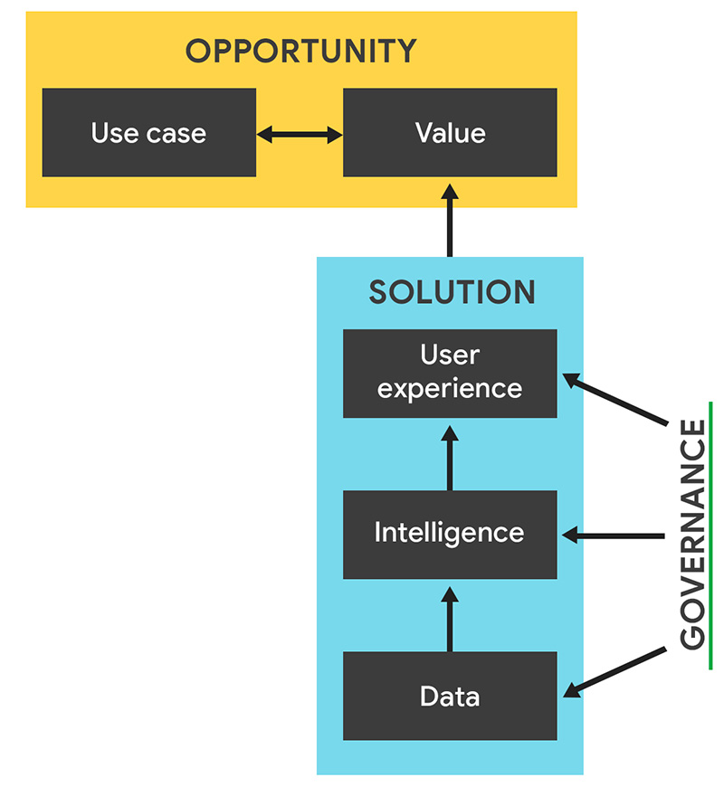

При разработке с ИИ легко увязнуть в выборе модели, инфраструктуре и коде. Из-за этого можно потерять из виду общую картину.

В этом модуле мы представим схему, с помощью которой можно описать любую новую ИИ-функцию или продукт:

- Зачем вы это создаете? Какую ценность ваш сценарий применения ИИ дает пользователям?
- Как будет работать ваше приложение?
- Как убедиться, что каждая часть системы разработана ответственно?

Чтобы понять, как работает эта схема, представьте, что вы работаете над сайтом электронной коммерции _Example Shoppe_. Конкуренты спешно прикручивают типовые чат-боты, но пользователи почти не вовлекаются. Вы хотите дать пользователям лучший опыт и решаете [улучшить поиск](https://web.dev/articles/ai-rag-search), не нарушая основные пользовательские сценарии.

После ИИ-улучшения покупатели смогут вводить фразы на естественном языке, например «красные трейловые кроссовки для зимы», и получать релевантные результаты, которые могли бы пропустить при поиске по ключевым словам.

!!!note "Примечание:"

    Эта схема будет встречаться на протяжении всего курса Learn AI для разных возможностей и решений. Некоторые примеры повторяются в нескольких модулях.

### Возможность

Каждый ИИ-проект должен начинаться с ясного сценария применения: пользовательской задачи или проблемы, которую действительно стоит решать с помощью ИИ. ИИ приносит в приложение неопределенность и другие риски, поэтому использовать его стоит только тогда, когда проблему нельзя решить обычным детерминированным способом.

#### Сценарий применения

Для _Example Shoppe_ поиск — ключевая функция, которая соединяет пользователей с нужными товарами. Пользователи часто бросают поиск, когда он не справляется с опечатками, синонимами или расплывчатыми запросами. Вы знаете это из собственной аналитики, а также из [внешних исследований](https://cloud.google.com/blog/topics/retail/search-abandonment-impacts-retail-sales-brand-loyalty). Более гибкий и интеллектуальный поиск может сделать путь пользователя эффективнее и приятнее.

Другие примеры сценариев применения ИИ:

- На новостном сайте можно снизить когнитивную нагрузку, структурированно суммируя новости.
- На издательской платформе можно улучшить доступность, автоматически предлагая alt-тексты и подписи.
- Как поставщик облачных сервисов, вы можете сократить обращения в поддержку благодаря более умному поиску по документации.

Поиск возможностей с высокой ценностью — ключ к успеху с ИИ. Согласно [отчету RAND Corporation](https://www.rand.org/pubs/research_reports/RRA2680-1.html), выбор неправильной возможности — одна из основных причин провала ИИ-проектов.

#### Ценность

У ценности две стороны: польза для пользователей и польза для продукта или бизнеса. В большинстве здоровых и ответственных продуктов они согласованы: когда пользователи успешны, бизнес тоже растет. Для Example Shoppe ИИ-улучшенный поиск создает ценность, помогая пользователям быстрее и с меньшим трением находить нужные товары. Это повышает обнаруживаемость товаров, конверсию и долгосрочную удовлетворенность клиентов.

Иногда ценность может быть нематериальной, например радость пользователя и доверие. Особенно в начале лучше найти способ количественно описать ценностное предложение. Это даст прочную основу для приоритизации, объяснения эффекта и убеждения заинтересованных сторон. Даже грубые оценки помогают принимать решения и делать успех измеримым.

!!!tip "Совет:"

    В разделе о поиске сценариев применения ИИ вы изучите структурированный подход к генерации, оформлению и приоритизации сценариев для вашего продукта.

### Решение

После того как вы прояснили, зачем добавляете ИИ в продукт, подумайте, _как_ вы это реализуете. Рассмотрим основные строительные блоки ИИ-решения.

#### Данные

Данные — топливо ИИ. В конечном счете возможности вашей ИИ-системы ограничены тем, насколько хорошо она может учиться на ваших данных. Плохие, неполные или несогласованные данные приводят к слабым результатам и разочарованным пользователям, какой бы впечатляющей ни была модель или инфраструктура. И наоборот, качественные данные и хорошо спроектированный маховик данных создают ценность и могут стать частью отличия вашего продукта.

Данные бывают разных форм и модальностей. В примере с ИИ-поиском полезные данные могут включать:

- **Структурированные данные**: названия товаров, цвета, размеры, категории и наличие.
- **Неструктурированные данные**: описания товаров, отзывы пользователей и FAQ.
- **Списки синонимов**: связи между терминами, например «кеды» = «кроссовки».
- **Пользовательские сигналы**: клики, время просмотра, добавления в корзину и покупки — все это сигналы, которые помогают моделям понять, что пользователи действительно считают релевантным.
- **Визуальные данные**: изображения товаров, которые можно встроить в индекс визуального сходства, чтобы пользователи могли искать по фото или находить визуально похожие товары даже без совпадающего текста.

Может показаться, что данных слишком много, но не переживайте. Начните с малого: выберите несколько источников данных с лучшим соотношением сигнала и шума, а затем расширяйте систему по мере ее зрелости.

В большинстве случаев сырые данные не готовы к передаче в модель. Их нужно очистить, предварительно обработать и организовать в формат, удобный для ИИ. Например, пользовательские сигналы можно преобразовать в последовательности действий, а неструктурированные описания товаров — закодировать как семантические эмбеддинги.

!!!tip "Совет:"

    Исторически для обучения ИИ-моделей было важно собирать относительно большие объемы данных. Сегодня многие ИИ-системы строятся вокруг предобученных моделей. Качество данных часто важнее их количества, и именно на качестве стоит сосредоточить работу с данными.

Данные можно использовать на разных этапах жизненного цикла ИИ:

- При обучении или дообучении они помогают модели изучать закономерности и связи.
- При оценке их можно использовать для проверки качества, точности и релевантности.
- В продакшене их можно использовать для отслеживания дрейфа и сбора обратной связи из реального использования.

Иными словами, данные — не просто входной материал, а живой актив. Умение хорошо управлять данными — один из самых ценных навыков веб-разработчика при работе с ИИ.

#### Интеллект

Слой интеллекта — место, где ИИ извлекает и создает ценность. Часто в его основе лежит модель, но большинство систем устроены сложнее. В Example Shoppe слой интеллекта понимает пользовательские запросы с помощью набора методов:

- **Распознавание именованных сущностей** и **извлечение информации**, чтобы выделять атрибуты вроде `color=red` или `season=winter`.
- Модель **sentence embedding**, чтобы создавать семантические представления пользовательских запросов и доступных товаров.
- **Семантический поиск**, чтобы получать релевантные результаты.
- Небольшая кастомизированная **модель повторного ранжирования**, чтобы точно сортировать результаты по релевантности.

Интеллект, пожалуй, самая захватывающая часть ИИ-системы, но вокруг нее больше всего шума. Новые модели появляются каждую неделю, часто в сопровождении громких маркетинговых заявлений.

Вот два ключевых фактора, которые стоит учитывать:

- ИИ не ограничивается генеративным ИИ и большими языковыми моделями (LLM). Для многих задач лучше подходят [меньшие специализированные модели](https://web.dev/articles/right-sized-ai), которые быстрее и дешевле разворачивать и поддерживать.
- Реальные ИИ-системы редко полагаются на одну монолитную модель. Вместо этого они используют _составные ИИ-архитектуры_: комбинации одной или нескольких моделей с дополнительными компонентами, такими как базы данных, API и защитные ограничения. Вместе они обеспечивают надежное поведение с учетом контекста.

Вместо того чтобы гнаться за последним лидером рейтингов, выберите слой интеллекта, который подходит вашей задаче и позволит адаптироваться по мере развития продукта и бизнеса. В следующих модулях вы получите базу по самым распространенным на сегодня техникам ИИ: предиктивному и генеративному ИИ. Вы также научитесь оценивать и выбирать правильный технический подход для своей системы.

#### Пользовательский опыт

Пользовательский интерфейс — канал, через который ценность ИИ доходит до пользователей. Интерфейсы детерминированного ПО определенны и предсказуемы: один и тот же ввод всегда дает один и тот же вывод. С ИИ вы добавляете неопределенность. Два почти одинаковых запроса могут дать совершенно разные результаты, а даже самые мощные ИИ-модели известны галлюцинациями и другими ошибками.

К этому сдвигу нужно относиться очень осознанно, особенно если вы добавляете ИИ в существующий продукт. Чат-боты с открытым вводом выглядят привлекательно, но на практике они сложны и рискованны.

В начале старайтесь минимизировать неопределенность и риск, с которыми сталкиваются пользователи. Например, в Example Shoppe ИИ-поиск можно незаметно встроить в существующий интерфейс. Пользователи продолжают вводить запросы на естественном языке и получают более качественные результаты поиска.

Даже если ИИ-функция работает в фоне, хорошей практикой будет усилить прозрачность. Например, можно добавить уведомление и короткое объяснение того, как система подбирает эти результаты.

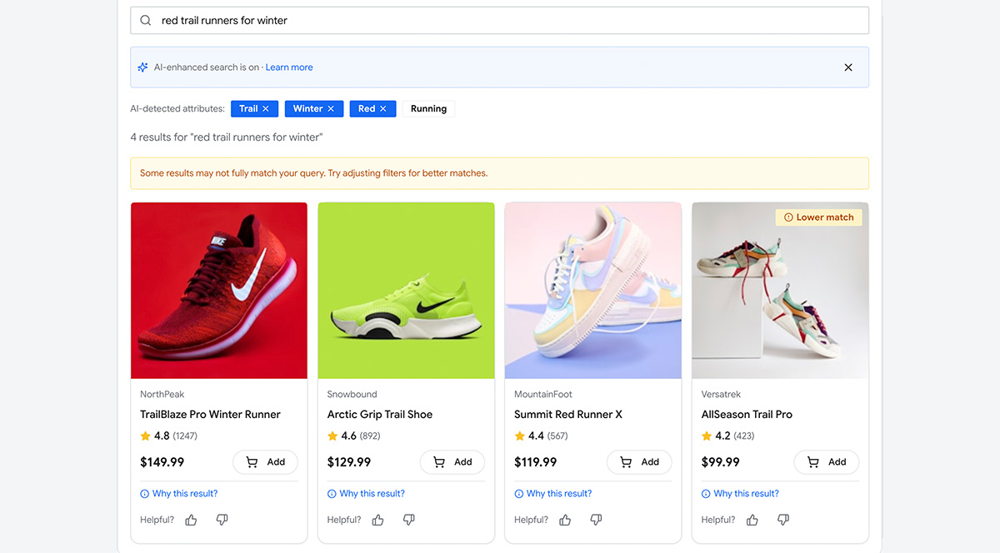

Рисунок 2. Example Shoppe сообщает пользователю: «ИИ-улучшенный поиск включен». Сайт показывает атрибуты, обнаруженные ИИ в поисковой строке, такие как «trail», «winter» и «Red», а затем отображает самые релевантные товары.

В разделе UX Patterns вы узнаете, как балансировать видимость ИИ, его возможности и риски в пользовательском опыте продукта.

### Управление

ИИ-системы нужно строить ответственно. Вы должны создать систему, которая защищает приватность пользователей, снижает предвзятость, обеспечивает прозрачность и соответствует применимым правовым стандартам. Хорошее управление нужно не только для соблюдения требований: это принцип проектирования, критически важный для доверия пользователей и принятия продукта.

В ИИ-поиске Example Shoppe управление начинается с защитных мер, встроенных в продукт:

- **Приватность**: данные персонализации остаются локальными, если пользователь явно не согласился передавать их. Это можно включить или отключить в любой момент.
- **Справедливость**: результаты поиска проверяются, чтобы обеспечить сбалансированную видимость продавцов.
- **Доверие и прозрачность**: Example Shoppe дает возможность узнать, почему тот или иной результат оказался наверху поисковой выдачи. Это помогает строить доверие пользователей.
- **Безопасность**: ограниченные или небезопасные запросы, например запрещенные товары, фильтруются или блокируются защитными ограничениями.
- **Возможность исправления**: пользователи могут быстро отклонять ИИ-предложения, сообщать о плохих ИИ-результатах или взаимодействиях и возвращаться к поиску только по ключевым словам, если ИИ-улучшения не помогают.

Чтобы строить ИИ ответственно, нужно взять на себя ответственность за процесс развертывания. Проектируйте продуманные защитные ограничения и петли обратной связи. Вы формируете безопасность и надежность опыта, одновременно задавая ожидания относительно применения и ограничений системы. Даже если вы не можете полностью контролировать вывод, вы должны быть готовы реагировать на возникающие проблемы.

Подробнее об основных аспектах управления ИИ вы узнаете в разделе о ответственной разработке с ИИ, где получите практические инструменты для создания устойчивых и заслуживающих доверия ИИ-приложений.

**Что стоит запомнить**

Схема ИИ-системы помогает добиться ясности и согласованности в любом ИИ-проекте, в котором вы участвуете. Мы на высоком уровне прошли каждый элемент схемы, а дальше вы подробнее изучите каждый шаг.

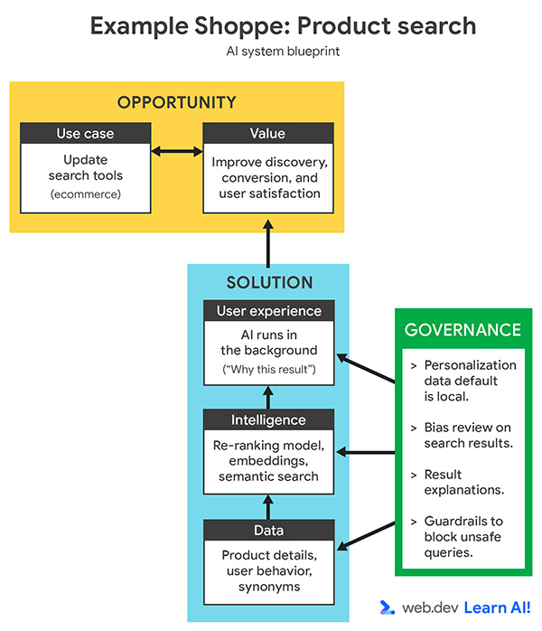

Эта схема еще будет встречаться в других примерах, где отдельные слои будут разобраны глубже.

---

## Исследуйте сценарии применения

Вы в отличной позиции, чтобы находить ценные возможности для ИИ. Вы можете оценить как техническую реализуемость идеи, так и ее влияние на пользовательский опыт — две перспективы, которые должны объединиться, чтобы ИИ-функция стала успешной. Не стоит создавать ИИ-функции потому, что они новые или впечатляющие. Их стоит создавать, если они действительно делают жизнь пользователей проще, быстрее или приятнее.

В этом модуле описан структурированный итеративный метод генерации, описания и прототипирования сценариев применения ИИ в вашем продукте.

### Поймите ценность ИИ

Следующее дерево возможностей ИИ определяет крупные категории ценности, которую может дать ИИ:

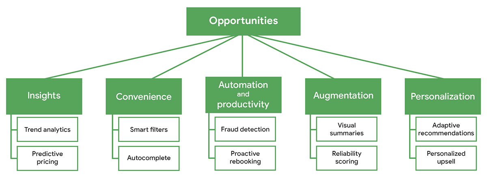

Рисунок 1. Для каждой категории ценности ИИ существует несколько сценариев применения. Например, в категории удобства можно создать умные фильтры на базе ИИ или автодополнение.

Мы перечислили категории ценности, чтобы задать рамку для ваших решений. По мере движения по списку сложность, риск и потенциальное влияние на пользователей обычно растут:

- **Инсайты**: улучшение принятия решений.
- **Удобство**: устранение трения.
- **Автоматизация**: замена повторяющейся работы.
- **Усиление возможностей**: помощь пользователям в сложных или творческих задачах.
- **Персонализация**: адаптация продукта к потребностям и предпочтениям конкретного человека.

Сначала пробуйте решать сценарии с меньшим воздействием. Например, соберите более качественные продуктовые инсайты с помощью внутренней ИИ-системы, чтобы улучшать продукт изнутри. Затем проведите аудит существующего UX-долга и используйте ИИ, чтобы снизить трение и когнитивную нагрузку для пользователей. По мере роста уверенности и опыта можно переходить к более сложным сценариям и повышать видимость ИИ.

При этом вы можете обнаружить возможности с высоким эффектом, например легкие элементы персонализации, которые окажутся неожиданно доступными, низкорисковыми и значимыми.

### Найдите возможности в вашем продукте

Чтобы выбрать правильную идею, нужно хорошо понимать, кто ваши пользователи. Поработайте с UX-командой или [освежите знания о персонажах](http://figma.com/community/file/1119057572478437366/user-persona-template-google-ux-themed), чтобы определить этих пользователей. Используйте [подход, ориентированный на пользователя или человека](https://pair.withgoogle.com/guidebook/chapters/user-needs-and-defining-success), и сопоставьте найденные ИИ-возможности с конкретными сценариями применения в продукте.

!!!note "Примечание:"

    Подробнее это рассматривается в разделе UX patterns.

Они могут быть:

- Основаны на явных потребностях или болевых точках пользователей.
- Предложены членами команды или вами. В этом случае важна быстрая проверка с пользователями, чтобы избежать ловушки «ИИ ради ИИ».
- Вдохновлены конкурентами, но здесь нужна осторожность. Аудитория и контекст конкурентов могут отличаться от ваших. Проверяйте идеи как можно раньше, чтобы понять, переносится ли успешная инициатива конкурента на ваш продукт.

На каждом шаге пользовательского пути можно найти разные возможности добавить ценность с помощью ИИ.

### Сформируйте решение

К этому моменту вы уже сопоставили несколько ИИ-идей с пользовательским путем. Следующий шаг — придать им форму и набрать достаточно уверенности, чтобы решить, какие развивать первыми. Это командная работа, которой обычно руководит продакт-менеджер. Как разработчик, вы в первую очередь отвечаете за оценку стоимости, усилий и рисков планируемого ИИ-решения.

#### Опишите идеи

Сначала зафиксируйте каждую идею в короткой целостной спецификации. Можно использовать схему ИИ-системы из введения. Обычно разработчики сосредоточены на части решения, а возможность описывает продакт-менеджер. Это упражнение дает всем общую основу для согласования и обсуждения перед движением дальше.

#### Оцените усилия и стоимость

Затем оцените, насколько сложно реализовать идею. Например, для добавления умных фильтров может хватить разбора на основе промпта через LLM API: это быстро прототипируется, запускается и проще настраивается. А персонализированному помощнику по бронированию понадобятся кастомные пайплайны данных, API бронирования и продуманные механизмы с участием человека, что значительно сложнее.

Оценивайте усилия и стоимость по нескольким измерениям:

- **Готовность данных**: есть ли у вас уже нужные данные? Сколько очистки, предварительной обработки или разметки нужно, чтобы подготовить их для ИИ?
- **Зрелость модели**: существует ли подходящая предобученная модель или нужно обучать модель с нуля?
- **Задержка**: насколько быстро модель должна отвечать, чтобы функция ощущалась бесшовной и полезной?
- **Сложность интеграции**: сколько систем нужно соединить? Есть ли backend, API, UI или сторонние инструменты? Чем больше точек соприкосновения, тем выше стоимость и риск.
- **Операционные расходы**: сколько стоит каждый вызов модели или inference? Оцените месячное использование и бюджет на масштабирование. Функция, которая «дешева» на этапе прототипа, может стать дорогой после запуска для тысяч пользователей.

Учитывайте скрытые издержки для пользователя. ИИ может привнести в продукт неопределенность и регулярные ошибки. При client-side AI функции запускаются на устройстве пользователя, расходуя трафик, хранилище и энергию. Функция должна быть достаточно ценной, чтобы пользователи были готовы к этим затратам.

Ранняя оценка усилий помогает сосредоточиться на ценных и малозатратных победах, а более сложные идеи отложить до тех пор, пока данные, инфраструктура и опыт не станут зрелее.

#### Оцените режимы отказа

Иногда модель ошибается, а функции работают не так, как ожидалось. Нужно объяснять пользователям, что происходит и где возник сбой, чтобы они понимали, могут ли изменить ввод и получить нужный результат.

Например, представьте, что вы управляете туристическим агентством. Компания хочет предлагать путешественникам персонализированное вдохновение. Пользователи просили инструмент, который позволит делать это самостоятельно, и продуктовая команда продвигает его реализацию. Но вы знаете, что персонализации нужно много сигналов об интересах пользователей, а базы данных для сбора таких сигналов у вас нет. В результате персонализация предлагает нерелевантные идеи, и пользователи забрасывают функцию. Ваше понимание доступности персональных данных должно было повлиять на оценку ценности командой.

Вот дополнительные критичные режимы отказа ИИ, которые стоит учитывать:

- **Галлюцинация**: модель генерирует правдоподобный, но нереальный вывод, например придумывает несуществующий рейс.
- **Предвзятость**: модель проявляет или усиливает несправедливые обобщения на основе обучающих данных, что приводит к дискриминационным или неравным результатам. Например, модель может предполагать, что одним пользователям нужны билеты первого класса, а другим эконом-класса, на основе воспринимаемого пола или расы.
- **Проблема холодного старта**: система не может дать ценность новым пользователям или объектам из-за нехватки начальных данных, как в примере с персонализированным инструментом для путешествий.
- **Деградация производительности**: точность модели со временем снижается, поскольку реальные данные меняются и уходят от исходного распределения. Это также называют дрейфом модели.

### Прототипируйте

Поначалу ваши оценки стоимости, усилий и режимов отказа будут приблизительными. Чтобы обрести уверенность, лучший способ проверить конкретную ИИ-функцию — прототипировать ее. Прототипирование позволяет быстро проверить ключевые технические предположения: готовность данных, задержку, точность — до полноценной разработки. Особенно с новой и не до конца изученной технологией вроде ИИ быстрее учиться через создание, чем через исследования и анализ.

С инструментами генерации кода на базе ИИ, такими как [Vertex AI](https://cloud.google.com/use-cases/ai-code-generation) и Replit, можно радикально ускорить прототипирование и снизить его риски.

Примите такой подход: выпустите что-то небольшое, наблюдайте, как оно ведет себя, и постоянно улучшайте.

!!!caution "Осторожно:"

    При добавлении новых ИИ-функций в существующий продукт прототипы помогают проверить ценность функции. Критически важно продумать, как функция интегрируется с кодовой базой, и протестировать ее для безопасности пользователей. Никогда не копируйте непроверенный vibe-coded прототип прямо в production-приложение.

Используйте следующие лучшие практики:

- **Рано собирайте end-to-end**. Тестируйте весь поток, заданный в схеме ИИ-системы: данные, интеллект, пользовательский опыт, а не только точность модели. Такая сборка должна отражать каждую часть опыта пользователя с ИИ, но не обязана включать все функции приложения.
- **Начинайте с коротких путей**. Используйте API и предобученные модели, чтобы быстро проверить ценность.
- **Логируйте все**. Отслеживайте вводы, выводы и правки пользователей, чтобы увидеть типичные режимы отказа и оценить потенциальные блокеры.
- **Тестируйте на реальных данных**. Ранние тесты должны отражать естественное, неряшливое поведение пользователей.
- **Добавьте механизмы обратной связи и контроля**. Упростите пользователям возможность отмечать ошибки или корректировать выводы, а также подтверждать или исправлять результаты.

В большинстве случаев прототипирование идет параллельно с оценкой и спецификацией.

**Что стоит запомнить**

Вы узнали, как превращать абстрактный потенциал ИИ в конкретные ценные продуктовые идеи. Как разработчик, вы сильны тем, что связываете техническую реализуемость с пользовательским опытом. Вы рассмотрели, как ИИ может создавать ценность в разных категориях, сопоставили эти возможности с пользовательским путем продукта и научились описывать, оценивать и приоритизировать их с помощью структурированных фреймворков.

Помните, что ИИ становится успешным благодаря постоянным итерациям. Выпускайте рано, слушайте пользователей, наблюдайте за ними и быстро улучшайте. Каждый прототип — шаг к пониманию того, как ИИ может повысить ценность продукта и радость пользователей.

**Ресурсы**

- [Getting AI Discovery Right](https://towardsdatascience.com/getting-ai-discovery-right/) — руководство по генерации, проверке и приоритизации сценариев применения ИИ.
- [AI Radar](https://ai-radar.app/) — инструмент исследования и поддержки решений для выявления и приоритизации сценариев применения в разных отраслях.

---

## Предиктивный ИИ: превращайте данные в инсайты

Предиктивный или аналитический ИИ — это набор алгоритмов, которые помогают понимать существующие данные и прогнозировать, что, вероятно, произойдет дальше. На основе исторических закономерностей предиктивные ИИ-модели учатся выполнять разные аналитические задачи, помогая пользователям осмыслять данные:

- **Классификация**: группировать объекты по заранее заданным категориям на основе закономерностей в данных. Например, интернет-магазин может классифицировать посетителей по намерению: исследование, покупка, возврат, — и адаптировать рекомендации.
- **Регрессия**: прогнозировать числовые значения, например уровень вовлеченности, длительность сессии или вероятность конверсии.
- **Рекомендации**: предлагать элементы, наиболее релевантные конкретному пользователю или контексту. Вспомните формулировки вроде _«пользователи, похожие на вас, также смотрели»_ или _«рекомендованные уроки на основе вашего прогресса»_.
- **Прогнозирование и обнаружение аномалий**: модель предсказывает будущие события, например всплеск трафика, или выявляет необычное поведение, например платежные аномалии или мошенничество.

Некоторые продукты полностью построены вокруг предиктивного ИИ, например инструменты музыкальных рекомендаций. В других продуктах предиктивный ИИ улучшает детерминированный опыт, например стриминговый сайт с персональными рекомендациями. Предиктивный ИИ также может быть мощным внутренним усилителем: его можно использовать для анализа продуктовых и пользовательских данных, поиска инсайтов и выбора более умных следующих действий.

!!!important "Важно:"

    В большинстве случаев задачи предиктивного ИИ требуют обучения кастомной модели. Этот модуль поможет понять, _почему_ стоит выбрать такой тип интеллекта и как он работает. Чтобы успешно реализовать предиктивную ИИ-функцию, вам нужно будет работать с дата-сайентистами или самому глубже освоить машинное обучение. Если хотите узнать больше, Google Cloud предлагает [Machine Learning Crash Course](https://developers.google.com/machine-learning/crash-course/prereqs-and-prework).

### Цикл предиктивного ИИ

Разработка предиктивной ИИ-системы идет по итеративному циклу: определить возможность, подготовить данные, обучить модель, оценить модель и развернуть модель.


Рисунок 1. Начальный цикл начинается с определения сценария применения; затем шаги идут по порядку и запускаются снова после развертывания модели.

Представьте, что вы работаете над приложением для продуктивности по подписке — _Do All The Things_. Вы уже собираете данные использования: просмотры страниц, длительность сессий, использование функций и продления подписки. Теперь вы хотите извлечь из данных больше практической ценности. Вот как можно пройти цикл предиктивного ИИ.

#### Определите сценарий применения

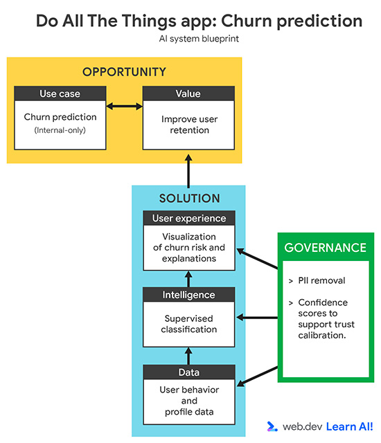

Рисунок 2. Схема системы для приложения _Do All the Things_.

За последние три месяца отток вырос. Вместо того чтобы реагировать уже после отмены подписки, вы хотите использовать предиктивный ИИ, чтобы заранее выявлять пользователей с высоким риском ухода. Цель — дать команде customer success ранние сигналы, чтобы она могла предпринимать целевые проактивные действия для удержания пользователей в группе риска.

Определяя сценарий применения предиктивного ИИ, сначала проверьте, можно ли ответить на вопрос с помощью данных. Это могут быть данные, которые вы уже собираете, или данные, которые реально сможете собирать дальше. На этом шаге часто нужно сотрудничать с экспертами предметной области: командами customer success, growth или marketing, — чтобы убедиться, что прогноз осмыслен и применим.

Хорошее определение проблемы должно указывать:

- **Цель**: на какой бизнес-результат вы хотите повлиять? Например, вы хотите снизить отток за счет проактивного контакта.
- **Входные данные**: на каких исторических сигналах учится модель? Например, вы передаете паттерны использования, типы тарифов и взаимодействия с поддержкой.
- **Выход**: что должна произвести модель? Например, вы хотите, чтобы модель рассчитала вероятность оттока для каждого пользователя.
- **Пользователь**: кто использует прогноз или действует на его основе? Например, эти данные предназначены для менеджеров customer success.
- **Критерии успеха**: как вы измеряете эффект? Например, вы измеряете retention rate, чтобы понять, снизили ли отток.

Определив эти детали в начале, вы избежите распространенной ловушки: создания технически корректной кастомной модели, которую никто не использует.

#### Подготовьте данные

Чтобы дать модели полезные обучающие сигналы, нужно разметить исторические данные идеальными прогнозами. Пометьте пользователей _Do All The Things_ как «ушли» или «не ушли».

!!!note "Примечание:"

    В нашем примере данные собираются автоматически. Это идеально для обучения: такие данные согласованы и содержат мало шума. В системах, которые полагаются на ручной ввод, например CRM-инструментах, в данных скорее всего будут пропущенные поля, несогласованные названия или опечатки. Перед началом обучения вложитесь в очистку и нормализацию данных.

Затем вместе с командой customer success определите, какие поведенческие признаки наиболее релевантны для прогноза оттока. Сузьте датасет до этих ключевых признаков и удалите лишние поля, чтобы модели не приходилось работать с шумом. Не забывайте о приватности данных. Удалите персональные данные (PII), такие как имена или email, и храните только агрегированные поведенческие данные.

Следующая таблица показывает фрагмент итогового датасета:

| `user_id` | `plan_type` | `avg_session_time (min)` | `logins_last_30d` | `features_used` | `support_tickets` | `churned` |
| --- | --- | --- | --- | --- | --- | --- |
| 00123 | premium | 12.4 | 22 | 5 | 0 | 0 |
| 00124 | trial | 5.8 | 3 | 1 | 2 | 1 |
| 00125 | free | 18.1 | 30 | 7 | 0 | 0 |
| 00126 | premium | 9.7 | 12 | 4 | 1 | 0 |
| 00127 | trial | 4.2 | 2 | 1 | 3 | 1 |

Так модель получает чистые числовые и категориальные входы, например `plan_type` или `avg_session_time`, и ясную целевую метку `churned`. Категории нужно преобразовать в уникальные числовые идентификаторы.

Наконец, разделите датасет на три подмножества:

- Обучающая выборка, обычно около 70-80%, чтобы обучать модель.
- Валидационная выборка, иногда ее называют development set, чтобы настраивать [гиперпараметры](https://developers.google.com/machine-learning/glossary#hyperparameter) и предотвращать переобучение.
- Тестовая выборка, чтобы оценить, как модель работает на полностью невиданных данных.

Это помогает модели обобщать решения, а не полагаться на запомненные исторические примеры.

#### Обучите модель

В отличие от генеративного ИИ, который часто строится на больших предобученных моделях, большинство предиктивных ИИ-систем опираются на самостоятельно обученные модели. Причина в том, что предиктивные задачи очень специфичны для вашего продукта и пользователей. Инструменты вроде [scikit-learn](https://scikit-learn.org/stable/) (Python), [AutoML](https://cloud.google.com/automl) (no-code или low-code) и TensorFlow.js (JavaScript) упрощают обучение и оценку предиктивных моделей без необходимости погружаться в математику.

В примере с оттоком мы подаем очищенную обучающую выборку в [алгоритм классификации](https://developers.google.com/machine-learning/crash-course/classification) с учителем, например [логистическую регрессию](https://developers.google.com/machine-learning/glossary#logistic_regression) или [нейронную сеть](https://developers.google.com/machine-learning/crash-course/neural-networks). Попробуйте несколько вариантов, чтобы понять, что лучше работает с вашими данными.

Модель изучает, какие паттерны поведения коррелируют с оттоком. В итоге она может назначать каждому пользователю вероятностную оценку. Например, есть риск 72%, что пользователь X отменит подписку в следующем месяце.

После каждой итерации обучения оценивайте получившуюся модель на валидационной выборке. Производительность модели можно улучшать настройкой [гиперпараметров](https://developers.google.com/machine-learning/glossary#hyperparameter), а также целевыми улучшениями датасета.

#### Оцените модель

Метки в датасете дают ground truth, с которым можно сравнивать выводы модели. Ключевые метрики для отслеживания:

- **Precision**: из всех пользователей, помеченных как `churned`, сколько действительно ушли?
- **Recall**: из всех ушедших пользователей сколько модель смогла найти?
- **F1 score**: одно число, балансирующее precision и recall. Полезно, когда нужна общая мера точности без чрезмерной оптимизации одной метрики в ущерб другой.

Слишком много ложноположительных результатов приводит к напрасным усилиям по удержанию, а слишком много ложноотрицательных — к потере клиентов. Правильный компромисс зависит от бизнес-приоритетов. Например, компания может предпочесть несколько ложных тревог, если это повышает шанс заметить больше пользователей до их ухода.

#### Разверните и поддерживайте модель

После валидации модель можно развернуть через API или как легкий client-side сервис, встроенный в аналитический дашборд. Каждый день она может оценивать пользователей и обновлять визуализацию риска оттока, помогая команде приоритизировать контакты. Чтобы модель оставалась точной и надежной, используйте практики команд эксплуатации машинного обучения (MLOps):

- **Отслеживайте дрейф данных**: выявляйте моменты, когда поведение пользователей меняется, а обучающие данные перестают отражать реальность.
    - Например, после крупного редизайна UI пользователи иначе взаимодействуют с функциями, и прогнозы оттока становятся менее точными.
- **Учитесь на ошибках**: находите общие паттерны неверных прогнозов и добавляйте целевые примеры для улучшения следующего цикла обучения.
    - Например, модель часто помечает power users как риск оттока, потому что они создают много тикетов в поддержку. После анализа вы добавляете новые признаки, которые отличают устранение проблем от потери вовлеченности.
- **Регулярно переобучайте**: даже если производительность выглядит стабильной, периодически обновляйте модель, чтобы учитывать сезонные паттерны, обновления продукта или изменения цен.
    - Например, вы переобучаете модель после введения годовых тарифов, потому что структура цен меняет поведение пользователей перед продлением.

Этот жизненный цикл — основа предиктивного ИИ. С инструментами вроде [MLflow](https://mlflow.org/) и [Weights & Biases](https://wandb.ai/site/) можно вести этот процесс без глубокой экспертизы в ML.

### Распространенные ошибки и способы снижения рисков

Хотя отдельные ошибки неизбежны, можно защититься от типичных первопричин, которые подрывают производительность и доверие пользователей:

- **Низкое качество данных**: если входные данные шумные или неполные, прогнозы тоже будут такими. Чтобы снизить риск, визуализируйте и валидируйте данные перед обучением. Убедитесь, что у вас есть нужные обучающие сигналы, и обработайте пропущенные значения. Следите за качеством данных в продакшене.
- **Переобучение**: модель очень хорошо работает на обучающих данных, но проваливается в новых случаях. Чтобы снизить риск, используйте [кросс-валидацию](https://developers.google.com/machine-learning/glossary#cross-validation), [регуляризацию](https://developers.google.com/machine-learning/glossary#regularization) и [holdout-наборы данных](https://developers.google.com/machine-learning/glossary#holdout-data). Это помогает модели обобщать за пределами обучающих примеров.

!!!note "Примечание:"

    Это продвинутые техники, требующие ML-экспертизы. Подробнее см. в [Machine Learning Crash Course](https://developers.google.com/machine-learning/crash-course/overfitting/model-complexity).

- **Дрейф данных**: поведение пользователей и окружение меняются, а модель — нет. Чтобы снизить риск, запланируйте переобучение и добавьте мониторинг, который заметит падение точности.

- **Плохие метрики**: общая accuracy не всегда отражает приоритеты пользователей. Например, иногда важнее «стоимость» конкретной ошибки. В обнаружении мошенничества пропустить мошеннический случай (false negative) гораздо хуже, чем пометить невиновный (false positive). Чтобы снизить риск, согласуйте метрики с реальными целями обнаружения мошенничества.

Большинство этих проблем не фатальны. Запускайте систему постепенно и решайте проблемы по мере появления.

Ключ к такому бережливому и гибкому подходу — наблюдаемость. Версионируйте модели, логируйте характеристики точности и инструменты, использованные для создания модели, отслеживайте производительность во времени и держите мониторинг включенным. Когда что-то начнет дрейфовать или ломаться, вы сможете поймать и исправить проблему до того, как ее заметят пользователи.

**Что стоит запомнить**

Предиктивный ИИ превращает существующие данные в предвидение: показывает, что вероятно произойдет дальше и где нужно действовать. Это самая конкретная и измеримая форма ИИ. Сосредоточьтесь на хорошо определенных проблемах, которые можно выразить в данных, продолжайте итерации по мере развития продукта и отслеживайте производительность во времени.

В следующем модуле вы узнаете о генеративном ИИ, который помогает создавать что-то новое на основе доступных данных.

**Ресурсы**

Если вам интересно понять математику за предиктивным ИИ, рекомендуем изучить эти ресурсы:

- Курсы Machine Learning Crash Course по [классификации](https://developers.google.com/machine-learning/crash-course/classification), [линейной регрессии](https://developers.google.com/machine-learning/crash-course/linear-regression) и [логистической регрессии](https://developers.google.com/machine-learning/crash-course/logistic-regression).
- Автор курса, Janna Lipenkova, подробнее пишет о предиктивном ИИ в главе 4 книги [_The Art of AI Product Development: Delivering Business Value_](https://www.google.com/books/edition/The_Art_of_AI_Product_Development/XHZmEQAAQBAJ).
- [Artificial Intelligence: A Modern Approach](https://www.google.com/books/edition/_/koFptAEACAAJ) Стюарта Рассела и Питера Норвига. Книга впервые опубликована в 1995 году, последнее издание вышло в 2021 году. Ее часто используют в программах по AI engineering.
- [Pattern Recognition and Machine Learning](https://www.google.com/books/edition/Pattern_Recognition_and_Machine_Learning/kOXDtAEACAAJ) Кристофера М. Бишопа — очень подробный академический подход к изучению предиктивного ИИ.

---

## Генеративный ИИ: создавайте новый контент

Если предиктивный ИИ извлекает инсайты из существующих данных, генеративный ИИ идет дальше и создает что-то новое. Он может писать текст, генерировать изображения, создавать код и даже проектировать полноценные пользовательские интерфейсы. Вот распространенные примеры сценариев применения генеративного ИИ:

- **Создание контента**: ИИ-помощники для письма могут создавать черновики и дорабатывать существующий текст.
- **Суммаризация**: инструменты вроде [Google AI Overviews](https://search.google/ways-to-search/ai-overviews/) сжимают длинные документы, встречи или веб-страницы в краткие полезные сводки.
- **Генерация кода**: инструменты разработчика используют генеративный ИИ для написания и рефакторинга кода, повышая продуктивность.
- **Создание изображений и ассетов**: с помощью vision-моделей пользователи могут создавать визуальные ассеты, например баннеры и миниатюры.

### Цикл генеративного ИИ

Большинство генеративных ИИ-моделей обучают с помощью [нейронных сетей](https://developers.google.com/machine-learning/glossary#neural_network) и [трансформерных архитектур](https://developers.google.com/machine-learning/glossary#Transformer). Модели учатся предлагать следующий элемент последовательности, например следующее слово, пиксель или ноту, на основе предыдущих элементов.

С математической точки зрения это недалеко от предиктивного ИИ. Оба типа изучают закономерности в данных. Разница в масштабе.

В предиктивном ИИ варианты вывода ограничены несколькими метками вроде «отток» или «нет оттока». В генеративном ИИ пространство вывода может включать сотни тысяч вариантов. Обученный на миллиардах примеров механизм предсказания превращается в мощный двигатель, способный генерировать новые, ранее не встречавшиеся выводы.

Разработка генеративной ИИ-системы идет итеративно.

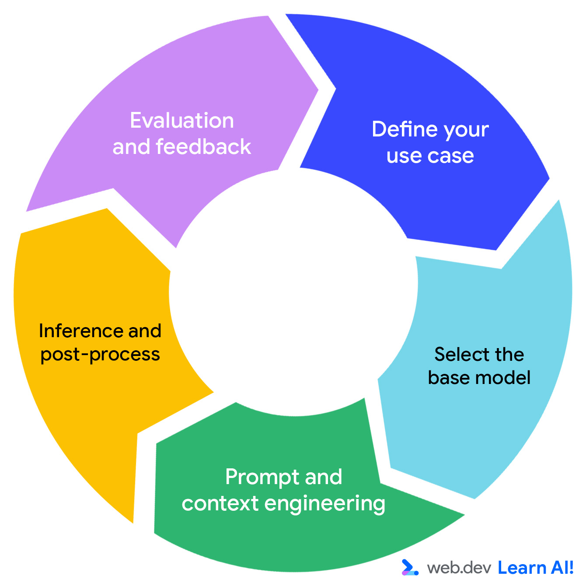

Рисунок 1. Как и в цикле предиктивного ИИ, вы начинаете с определения сценария применения. Цикл проходит по каждому шагу и запускается снова.

Разберем, как это работает, на примере приложения _BlogBuddy_ — помощника для системы управления контентом, который помогает пользователям генерировать цепляющие описания и SEO-дружественные заголовки статей.

**Определите сценарий применения**

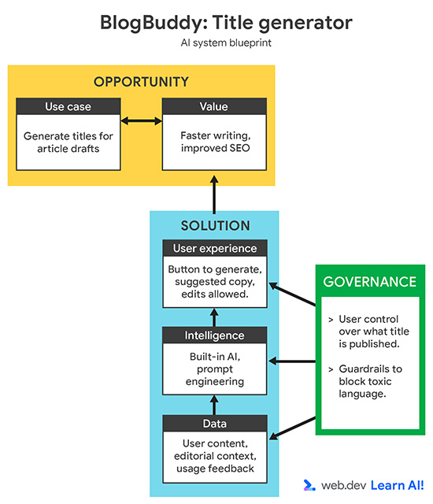

Рисунок 2. Схема системы для приложения _Blogbuddy_.

Формулировка проблемы должна включать:

- **Модальность входа и выхода**. Это может быть текст: проза или код, изображения или аудио.
- **Метод ввода**. Контент пришел из поля загрузки, свободного текста или других структурированных входов?
- **Аудитория**. Кто выполняет эту задачу? Им достаточно общих знаний или нужны специализированные?

Функции BlogBuddy построены вокруг генерации текста. Вход полуструктурированный: пользователи дают тему или короткий черновик, а модель возвращает варианты. Аудитория — маркетинг, со специализированными знаниями в редактуре.

Важно задать стандарт качества для выводов. В нашем случае мы хотим генерировать короткий, легко просматриваемый, насыщенный ключевыми словами текст, который соответствует тону публикации.

Ясные метрики успеха помогают направлять весь дальнейший процесс. Подробнее о сборе метрик успеха вы узнаете в разделе Evaluation-Driven Development.

#### Выберите базовую модель

Существует широкий набор доступных моделей, предобученных на больших универсальных датасетах. Их поведение можно адаптировать под конкретные нужды. Генеративные ИИ-модели обычно намного крупнее и сложнее предиктивных, поэтому лучше строить поверх существующей модели, а не создавать и обучать свою с нуля.

Ваш выбор определяет возможности продукта, стоимость, настраиваемость и границы приватности. Выбор модели тесно связан с платформой, на которой вы разворачиваете ИИ-систему.

Позже в курсе вы узнаете, как выбрать платформу.

#### Prompt engineering и context engineering

После выбора модели нужно дать ей правильные инструкции с помощью prompt. Для BlogBuddy можно сформулировать prompt так:

    Сгенерируй три коротких и увлекательных варианта заголовка для этой статьи

В prompt можно добавить несколько типов информации. Например:

- System prompt, который задает общее поведение.
- Контекст текущей задачи, специфичный для входных данных.
- Пользовательские инструкции в диалоговых приложениях, таких как чат-боты или агенты.

!!!note "Примечание:"

    Подробнее о структурах и техниках prompting мы расскажем в модуле Beginner prompt engineering.

#### Inference и постобработка

Когда prompt собран, он отправляется в модель для inference. Можно менять [параметры модели](https://developers.google.com/machine-learning/glossary#parameter), включая temperature для креативности и максимальное число токенов для длины и подробности, чтобы настраивать ответ модели. После генерации вывод часто обрабатывается дополнительными правилами и защитными ограничениями.

Например, можно переформулировать гендерно окрашенный текст, смягчить тон или отфильтровать запрещенные термины.

Чтобы поддержать прозрачность и калибровку доверия, можно добавить меньшую вспомогательную модель для классификации или суммаризации результата. Например: _«Вступление сгенерировано на основе 12 связанных статей. Уверенность: высокая.»_

#### Оценка и петля обратной связи

Поскольку пространство вывода генеративного ИИ практически бесконечно, у большинства prompts нет одного правильного ответа. Стандартизированные benchmarks, такие как [MMLU](https://wikipedia.org/wiki/MMLU) или [SQuAD](https://rajpurkar.github.io/SQuAD-explorer/), могут измерять общие возможности модели, но редко отражают конкретные потребности людей. В продуктовом контексте нужно определить собственное сочетание качественных и количественных метрик:

- **Точность**: фактически ли корректен вывод?
- **Полезность**: соответствует ли вывод ожиданиям, заданным prompt, или намерению пользователя?
- **Читаемость и тон**: ясен ли вывод и соответствует ли он стандартам бренда?
- **Человеческие усилия**: сколько ручного редактирования или кураторства требуется?
- **Понимание домена**: отражает ли вывод знания, специфичные для предметной области?

Чтобы оценивать эти метрики, можно сочетать человеческую проверку и автоматическую оценку. Например, можно просить пользователей оценивать реальные выводы, использовать вторую модель для автоматической оценки, также называемой [LLM-as-a-judge](https://web.dev/articles/test-llm-capabilities), и периодически проводить внутренние проверки на предвзятость или галлюцинации.

Реальные данные использования — один из главных активов при работе с генеративным ИИ. Если возможно, логируйте эти взаимодействия, чтобы со временем улучшать prompts и контексты, тестировать разные модели или настраивать параметры. Каждое взаимодействие пользователя, исправление или оценка становится обратной связью, которая помогает определить следующие шаги оптимизации:

- Неожиданные пользовательские вводы помогают понять, ту ли проблему вы решаете.
- Повторяющиеся доменно-специфичные запросы могут повлиять на выбор модели. Возможно, вы перейдете от большой общей LLM к небольшой дообученной модели.
- Частые галлюцинации могут указывать на нехватку конкретного контекста в prompts.
- Серьезные правки могут сигнализировать о недостатке общего контекста. Модель не знает информации, которую пользователь считает очевидной.

!!!tip "Совет:"

    Прочитайте раздел о ответственной разработке с ИИ, чтобы узнать, как работать с данными использования, уважая приватность пользователей.

Со временем эти петли обратной связи превращают генеративную ИИ-функцию из статичного вызова модели в живую систему, которая постоянно адаптируется к потребностям и предпочтениям пользователей.

**Распространенные ошибки и способы снижения рисков**

Поскольку генеративный ИИ работает в открытом пространстве входов и выходов, его поверхность риска гораздо шире, чем у предиктивных систем. Он может не только выдавать некорректные результаты, но и генерировать токсичный, предвзятый или вводящий в заблуждение контент, а также непреднамеренно манипулировать пользователями. Такие сбои подрывают доверие и могут привести компанию к финансовым или юридическим последствиям.

Поэтому генеративному ИИ нужен проактивный и постоянный подход к управлению рисками. Вот самые распространенные риски:

- **Галлюцинация**: модель выдумывает факты или искажает детали. Чтобы снизить риск, используйте RAG для фактического grounding.
- **Чрезмерное доверие**: пользователи предполагают, что выводы всегда корректны. Чтобы снизить риск, поощряйте поток проверки и редактирования, а не автопубликацию. В разделе об управлении ИИ и ответственной разработке вы узнаете, как помочь пользователям калибровать доверие.
- **Несогласованность**: выводы сильно различаются между запусками. Чтобы снизить риск, используйте шаблоны prompts, контроль temperature или few-shot examples для стабилизации тона и структуры.
- **Токсичный или вредный контент**: модель создает предвзятый, оскорбительный или манипулятивный текст. Чтобы снизить риск, применяйте фильтры модерации и [классификаторы токсичности](https://web.dev/articles/ai-detect-toxicity-context) перед отображением. Постоянно тестируйте выводы на реальных prompts и поддерживайте петлю обратной связи, чтобы помечать edge cases и дообучаться на них.
- **Задержка и стоимость**: большие модели могут быть медленными и дорогими. Особенно если вы стремитесь к масштабному внедрению, заранее оценить стоимость и потребление ресурсов моделями бывает сложно. Чтобы снизить риск, используйте кэширование, batching и меньшие модели для коротких задач.

### Что стоит запомнить

Кратко: генеративный ИИ превращает сырые идеи в осязаемый контент — тексты, изображения, код или диалоги. Он особенно полезен там, где креативность и адаптивность важнее точности.

Как веб-разработчик, вы будете успешны, если проектируете правильные prompts, grounding модели на правильных данных и постоянно согласуете систему с пользовательскими предпочтениями.

**Ресурсы**

Прочитайте о [выборе меньших и устойчивых моделей](https://web.dev/articles/right-sized-ai). Для более продвинутого изучения:

- Пройдите [Machine Learning Crash Course on Generative AI](https://developers.google.com/machine-learning/gan/generative).
- Изучите [Responsible Generative AI Toolkit](https://ai.google.dev/responsible/docs).
- Чтобы узнать больше о разных типах базовых моделей в генеративном ИИ, прочитайте главу 5 книги [The Art of AI Product Development](https://www.google.com/books/edition/The_Art_of_AI_Product_Development/XHZmEQAAQBAJ).

---

## Управление ИИ: создавайте ответственно

Ваши проектные решения напрямую формируют ответственность и безопасность ИИ-системы. Например, вы решаете, как выбирать источники данных, настраивать поведение модели или представлять выводы ИИ пользователям. Эти решения имеют реальные последствия для пользователей и компании.

В этом модуле мы рассмотрим три критически важных измерения управления ИИ:

- **Приватность**: ответственно обращайтесь с данными, объясняйте, что собирается, и минимизируйте то, что покидает браузер.
- **Справедливость**: проверяйте модели на дискриминационное поведение (bias) и создавайте петли, позволяющие пользователям сообщать о проблемах.
- **Доверие и прозрачность**: проектируйте систему для прозрачности и калиброванного доверия, чтобы пользователи продолжали получать пользу, несмотря на неопределенность и возможные ошибки.

Для каждой темы мы объясним, как она проявляется в разных ИИ-продуктах. Затем разберем ее по трем слоям ИИ-решения: данные, интеллект и пользовательский опыт. Вы узнаете, на что обращать внимание, как решать проблемы и как поддерживать эффективное легковесное управление.

!!!note "Примечание:"

    Безопасность — еще одно важное измерение управления ИИ, и мы планируем подробнее раскрыть эту тему в будущих модулях. Пока рекомендуем прочитать [Google Secure AI Framework (SAIF)](https://safety.google/cybersecurity-advancements/saif/) и [Google Security Blog](https://security.googleblog.com/search/label/AI%20Security).

### Приватность

Вы узнали, что реальные данные использования и взаимодействий — основа любой ИИ-системы. Данные питают обучение, оценку и постоянное улучшение. Хорошие практики приватности позволяют держать эти данные в безопасности и давать пользователям контроль над своей информацией.

!!!tip "Совет:"

    Пройдите курс [Learn Privacy](https://web.dev/learn/privacy), чтобы изучить практичные техники приватности, применимые к вашей ИИ-системе.

Ожидания приватности сильно различаются в зависимости от продукта и аудитории. В потребительских продуктах они обычно связаны с защитой персональных данных (PII), таких как имена, сообщения и поведение в браузере. В корпоративной среде фокус смещается к суверенитету данных, конфиденциальности и защите интеллектуальной собственности.

Сферы, влияющие на доходы или благополучие людей, например здравоохранение, финансы и образование, требуют более строгих мер приватности, чем области с меньшим риском, такие как развлечения.

Посмотрим, как управлять приватностью в разных компонентах ИИ-системы.

**Данные**

Чтобы постоянно улучшать ИИ-систему, можно собирать данные о взаимодействиях пользователей: входы, выводы, обратную связь и ошибки. Эту информацию можно повторно использовать для оценки, дообучения модели или few-shot examples в prompts. Она также может влиять на UX-дизайн.

Вот несколько правил ответственного сбора данных:

- **Собирайте только то, что нужно для обучения**. ИИ-поиску по товарам может не требоваться полный профиль пользователя для улучшения результатов. В большинстве случаев достаточно запроса, паттернов кликов и анонимизированных данных сессии.
- **Удаляйте чувствительную информацию**. Удаляйте все PII (Personally Identifiable Information) перед отправкой данных во внешние модели. Это можно делать через анонимизацию, псевдонимизацию или агрегацию.
- **Ограничивайте срок хранения**. Удаляйте логи и кэшированные данные, когда они выполнили свою задачу. Короткие циклы хранения снижают риск, не блокируя получение инсайтов.

Документируйте, какую информацию вы собираете, как долго храните и зачем она нужна. Если вы не можете понятно объяснить потоки данных нетехническому пользователю, вероятно, эти потоки слишком сложны, чтобы ими управлять или оправдывать их.

**Интеллект**

Когда пользователи взаимодействуют с ИИ-системой, они могут неосознанно или небрежно вводить приватную или чувствительную информацию. Этот риск особенно высок в открытых чатах или интерфейсах письма, где нельзя ограничить то, что вводят пользователи.

Даже если вы можете предотвратить отправку отдельных слов, информация может быть чувствительной по контексту. Если модель работает на сервере внешнего провайдера, он может повторно использовать пользовательский ввод как обучающие данные. В итоге модель может раскрыть фрагменты приватного текста, учетные данные или другие конфиденциальные детали другим пользователям.

Вот как можно защищаться от нарушений приватности во время inference:

- Тщательно проверяйте сторонние API. Нужно точно понимать, что происходит с отправляемыми данными. Логируются ли входы, сохраняются ли они, используются ли для обучения? Избегайте непрозрачных сервисов и предпочитайте провайдеров с прозрачными политиками и механизмами контроля.

!!!note "Примечание:"

    Некоторые провайдеры предлагают [model cards](https://modelcards.withgoogle.com/explore-a-model-card), объясняющие подход к оценке ответственности.

- Если вы сами обучаете или дообучаете модели, абстрагируйтесь от чувствительных деталей в обучающих данных. Остерегайтесь shortcut learning. Например, в приложении для кредитного скоринга ZIP-коды могут привести модель к предположениям о расе или социально-экономическом статусе. Это может дать несправедливые прогнозы и усилить существующее неравенство.

- В чувствительных доменах предпочитайте client-side inference. Это может быть [built-in AI](https://developer.chrome.com/docs/ai/built-in-ai), модель в браузере или кастомная client-side модель. Подробнее об этом выборе вы узнаете в следующем модуле о выборе платформы.

!!!tip "Совет:"

    Для сценариев, которым нужна персонализация модели с сохранением приватности данных, изучите [federated learning](https://en.wikipedia.org/wiki/Federated_learning). В такой схеме модели обучаются прямо на устройствах пользователей и отправляют на сервер только анонимизированные данные. Этот подход более продвинутый, но дает сильную защиту приватности.

**Пользовательский опыт**

Интерфейс приложения дает возможность показать пользователям, что происходит, заслужить их доверие и дать им контроль над данными:

- **Будьте прозрачны**. Короткие подписи в интерфейсе, например «Обрабатывается локально» или «Безопасно отправлено для анализа», помогают строить доверие. Рассмотрите progressive disclosure для дополнительных деталей, например tooltips, которые объясняют, когда анализ происходит на устройстве, а когда на сервере.
- **Спрашивайте в контексте**. Запрашивайте согласие тогда, когда оно релевантно. «Хотите поделиться предыдущими поисками, чтобы улучшить рекомендации?» гораздо осмысленнее, чем общий opt-in.
- **Предлагайте простые элементы управления**. Добавьте хорошо заметные переключатели для персонализации, облачных функций или обмена данными.
- **Давайте видимость**. Добавьте небольшой privacy dashboard, чтобы пользователи могли управлять данными, не покидая приложение.
- **Объясняйте, зачем собираете данные**. Пользователи охотнее делятся данными, если понимают, как они будут использованы. То же относится к политикам хранения и управления.

Приватность в веб-ИИ — не разовый шаг для compliance, а постоянный проектный подход:

- **Данные**: собирайте меньше и защищайте больше.
- **Интеллект:** снижайте риск запоминания потенциально чувствительных данных внешними моделями.
- **UX:** делайте приватность прозрачной и управляемой для пользователей.

### Справедливость

ИИ-системы могут нести bias, приводящий к несправедливой дискриминации. Это особенно важно в доменах вроде найма, права и финансов, где bias может исказить критически важные решения, напрямую влияющие на реальных людей.

Например, модель найма, обученная на исторических данных рекрутинга, может связать некоторые демографические признаки с более низким качеством кандидата и непреднамеренно штрафовать кандидатов из недостаточно представленных групп вместо оценки релевантных для работы навыков и опыта.

**Данные**

Обучающие данные — набор отдельных фрагментов информации, которые могут отражать bias из реального мира и даже привносить новый. Вот практические шаги, которые делают bias в данных прозрачным и управляемым:

- **Документируйте источники данных и покрытие**. Опубликуйте короткое заявление, которое поможет пользователям понять, где модель может быть слабее. Например: «Эта модель обучалась в основном на англоязычном контенте, с ограниченным представлением технического текста».
- **Проводите диагностические проверки**. Используйте A/B-тесты, чтобы выявлять систематические различия. Например, сравните, как система обрабатывает фразы «She is a great leader», «He is a great leader» и «They are a great leader». Небольшие расхождения в sentiment или тоне могут указывать на более глубокий bias.
- **Размечайте датасеты**. Добавляйте легковесные метаданные, такие как домен, регион и уровень формальности, чтобы упростить будущие аудиты, фильтрацию и ребалансировку.

Если вы обучаете или дообучаете кастомные модели, балансируйте датасеты. Более широкое представление снижает перекос эффективнее, чем исправление bias после создания модели.

**Интеллект**

В слое интеллекта bias превращается в выученное поведение. Можно добавить защитные меры, логику повторного ранжирования или гибридные правила, чтобы направлять выводы к справедливости и инклюзивности:

- **Регулярно тестируйте bias**. Используйте фильтры обнаружения bias, чтобы помечать проблемные формулировки, например гендерно окрашенные термины или исключающий тон. Отслеживайте дрейф со временем.
- **Для предиктивных моделей осторожно обращайтесь с чувствительными данными**. Атрибуты вроде ZIP-кода, образования или дохода могут косвенно кодировать чувствительные признаки, например расу или класс.
- **Генерируйте и сравнивайте несколько выводов**. Ранжируйте результаты по нейтральности, разнообразию и тону, прежде чем решать, какой вывод показать пользователю.
- **Добавляйте правила для соблюдения ограничений справедливости**. Например, блокируйте выводы, которые усиливают стереотипы или не представляют разнообразные примеры.

**Пользовательский опыт**

В пользовательском интерфейсе будьте прозрачны относительно рассуждений модели и поощряйте обратную связь:

- **Давайте обоснования для ИИ-выводов**. Например: «Рекомендовано для профессионального тона на основе ваших предыдущих вводов\*». Это помогает пользователям увидеть, что система следует заданной логике, а не скрытому суждению.
- **Дайте пользователям значимый контроль**. Позвольте им настраивать поведение модели через настройки или prompts, например выбирать тон, сложность или визуальный стиль.
- **Упростите сообщение о bias или неточности**. Чем проще отметить проблему, тем больше реальных данных вы получите для улучшения ИИ-системы.
- **Замыкайте петлю обратной связи**. Не позволяйте пользовательским сообщениям исчезать. Возвращайте эти данные в переобучение или логику правил и видимо сообщайте о прогрессе: «Мы обновили модерацию, чтобы снизить культурный bias в рекомендациях».

Bias рождается в данных, усиливается моделями и проявляется в пользовательском опыте. С ним можно работать на всех трех уровнях ИИ-системы:

- **Данные:** делайте источники данных прозрачными и сбалансированными.
- **Интеллект:** обнаруживайте, тестируйте и снижайте bias в выводах.
- **UX:** помогайте пользователям находить и исправлять bias через контроль и обратную связь.

### Доверие и прозрачность

Доверие определяет, будут ли люди пользоваться продуктом, принимать его и рекомендовать другим.

Большинство пользователей ожидают предсказуемых приложений. Например, нажатие кнопки всегда выполняет указанное действие и ведет в одно и то же место. ИИ ломает это ожидание, потому что его поведение сильно варьируется и часто непредсказуемо. Кроме того, ИИ-системам присущ потенциал отказа: [языковые модели галлюцинируют факты](https://cloud.google.com/discover/what-are-ai-hallucinations), [предиктивные модели неверно размечают данные](https://research.google/blog/can-you-trust-your-models-uncertainty/), а [агенты выходят из-под контроля](https://cloud.google.com/transform/ai-agent-security-how-to-protect-digital-sidekicks-and-your-business/).

Пользователи — последняя линия защиты от этих ошибок.

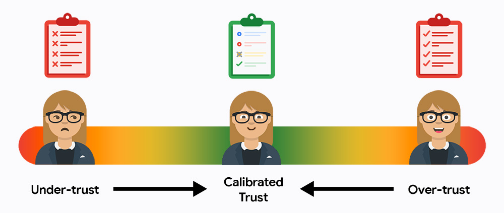

Ваша цель — привести пользователей к середине, к калиброванному доверию. Недоверие и чрезмерное доверие приводят к проблемам.

В начале пользователи, скорее всего, будут либо недоверять системе, либо доверять ей слишком сильно. Недоверие означает, что они не будут пользоваться системой, а чрезмерное доверие — что они полностью принимают выводы без проверки ошибок. Ваша задача — привести пользователей к золотой середине _калиброванного доверия_, где они полагаются на ИИ ради эффективности, но сохраняют ответственность за итоговые результаты.

**Данные**

В слое данных доверие строится через понятное объяснение покрытия и происхождения данных:

- Явно описывайте происхождение данных и их lineage.
- Документируйте свежесть и устаревание данных.
- Описывайте, какие типы контента видела модель и где ей может быть трудно, например с неанглоязычными данными.

По мере накопления взаимодействий и обратной связи поддерживайте версионированные снимки данных, чтобы объяснять, как менялись выводы.

**Интеллект**

В слое интеллекта доверие можно управлять через объяснимость, индикаторы уверенности и модульный дизайн:

- **Давайте контекстные just-in-time объяснения**. Согласно [парадоксу активного пользователя](https://lawsofux.com/paradox-of-the-active-user/), лучше встраивать микрообъяснения прямо в контекст взаимодействия, чтобы пользователи понимали, что делает ИИ-система во время использования.
- **Заранее сообщайте об ограничениях и режимах отказа**. Расскажите пользователям, где ИИ может споткнуться. Например: «Избегайте юмора или доменного жаргона, чтобы получить лучшие результаты». Короткие контекстные подсказки дают прозрачность, не ломая поток.
- **Индикаторы уверенности и fallback-логика** помогают ИИ оставаться надежным в условиях неопределенности. Уверенность можно оценивать через прокси, например вероятностные баллы или прошлые показатели успеха. Определите безопасные fallback для явно некорректных выводов.
- **Модульные архитектуры** делают ИИ прозрачнее. Например, если помощник для письма обрабатывает грамматику, стиль и тон отдельными шагами, показывайте, что изменилось на каждом этапе: «Тон: менее формальный; сложность: упрощена».

**Пользовательский опыт**

Пользовательский опыт дает большое пространство для построения и калибровки доверия. Вот техники и паттерны, которые стоит попробовать:

- **Адаптируйте образовательный контент**. Не предполагайте, что пользователи хорошо разбираются в ИИ. Давайте легкие подсказки опытным пользователям и подробные объяснения новичкам.
- **Применяйте progressive disclosure**. Начинайте с небольших сигналов. Добавьте текст, который сообщает об использовании ИИ, например «Это сгенерировано автоматически», и дайте пользователям открыть подробности.
- **Замыкайте петли обратной связи с видимым результатом**. Когда пользователи оценивают, исправляют или переопределяют ИИ-предложение, показывайте, как их ввод влияет на будущее поведение: «Вы предпочли краткие ответы. Тон скорректирован». Видимость превращает обратную связь в доверие.
- **Обрабатывайте ошибки мягко**. Когда система ошибается или дает результат с низкой уверенностью, признайте это и передайте проверку пользователю. Например: «Это предложение может не соответствовать вашему намерению. Проверьте перед публикацией». Дайте понятный путь вперед: повторить, отредактировать или вернуться к безопасному fallback.

Кратко: чтобы справиться с неопределенностью и присущим ИИ потенциалом ошибок, ведите пользователей от сомнения или чрезмерной зависимости к правильной калибровке доверия:

- **Данные**: будьте прозрачны относительно происхождения данных.
- **Интеллект**: делайте рассуждение модульным и объяснимым.
- **UX**: проектируйте постепенную ясность и обратную связь.

**Что стоит запомнить**

В этом модуле мы рассмотрели три ключевые опоры ответственного ИИ: приватность, справедливость и доверие. Это может казаться подавляющим, особенно если вы только начинаете или переходите от прототипа к production.

Сосредоточьте усилия на самых критичных областях и определите собственный подход к управлению ИИ. **Итерации — ключевой фактор**. Каждый релиз и каждый раунд пользовательской обратной связи будет уточнять ваше понимание того, где системе нужны дополнительные guardrails, прозрачность или гибкость.

**Ресурсы**

Вот более продвинутые ресурсы по темам этого модуля:

- [AI Assistant Privacy and Security Comparison](https://cybernews.com/ai-tools/ai-assistants-privacy-and-security-comparisons/) подробно разбирает политики приватности ИИ.
- Статья о [LLM memorization](https://arxiv.org/abs/2012.07805) — критическом режиме отказа приватности, при котором модель сохраняет и может воспроизвести конкретную чувствительную информацию из обучающих данных.
- Изучите ресурсы, напрямую связанные с выбранной моделью. Например, [Google Cloud предоставляет материалы по безопасности](https://cloud.google.com/security/resources).
- [Responsible AI Toolkit](https://ai.google.dev/responsible/) предлагает разработчикам ресурсы по всем темам, рассмотренным в этом модуле.

---

## Выберите платформу

Прежде чем строить с ИИ, нужно выбрать платформу, на которой он будет размещен. Этот выбор влияет на скорость, стоимость, масштабируемость и надежность вашей ИИ-системы. Можно выбрать между:

- **Client-side AI**: работает прямо в браузере. Это значит, что данные могут оставаться приватными на устройстве пользователя, а сетевой задержки нет. Но для хорошей работы client-side AI нужны очень конкретные и хорошо определенные сценарии применения.
- **Server-side AI**: работает в облаке. Он обладает большими возможностями и масштабируемостью, но дороже с точки зрения задержки и стоимости.

У каждого варианта есть компромиссы, а правильная настройка зависит от сценария применения, навыков команды и ресурсов. Например, можно предложить инструмент суммаризации, который работает локально, чтобы пользователи могли задавать личные вопросы без необходимости управлять персональными данными (PII). Однако агент поддержки может давать более полезные ответы, используя облачную модель с доступом к большой базе ресурсов.

В этом модуле вы узнаете, как:

- Сравнивать компромиссы между client-side и server-side AI.
- Соотносить платформу со сценарием применения и возможностями команды.
- Проектировать гибридные системы, которые используют ИИ на клиенте и сервере и растут вместе с продуктом.

### Рассмотрите варианты

Для развертывания рассматривайте ИИ-платформы по двум основным осям. Вы выбираете:

- **Где работает модель**: client-side или server-side?
- **Настраиваемость**: насколько вы контролируете знания и возможности модели? Если вы контролируете модель, то есть можете изменять _model weights_, вы можете настраивать ее поведение под конкретные требования.

!!!important "Ключевой термин:"

    [_Model weights_](https://developers.google.com/machine-learning/glossary#weight) — числовые значения, определяющие важность определенной информации. Во время обучения они постоянно обновляются, пока производительность модели не достигнет оптимума. Вы можете изменять веса открытых моделей, таких как [Gemma](https://ai.google.dev/gemma/docs/tune).

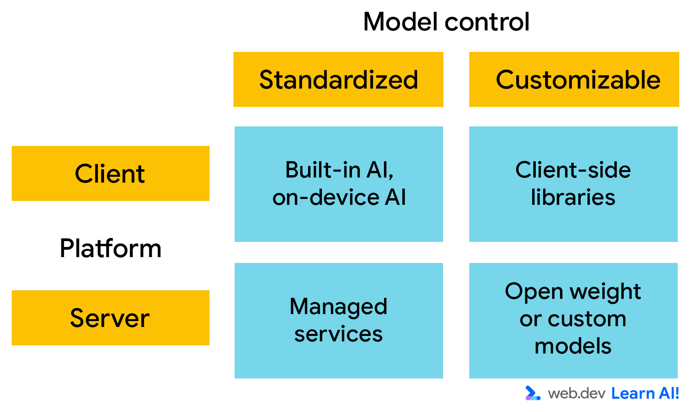

Рисунок 1: варианты ИИ-платформ, различающиеся платформой развертывания и уровнем контроля.

#### Client-side AI

Client-side AI работает в браузере, а вычисления происходят локально на устройстве пользователя. Вам не нужно обеспечивать вычисления для inference, а данные остаются на машине пользователя. Это делает подход быстрым, приватным и подходящим для легких интерактивных сценариев.

Однако client-side модели обычно довольно малы, что ограничивает их возможности и производительность. Они лучше всего подходят для узкоспециализированных задач, таких как обнаружение токсичности или анализ тональности. Часто это задачи предиктивного ИИ с ограниченным пространством вывода.

Есть два основных варианта:

- **Built-in AI**: браузеры, такие как [Google Chrome](https://developer.chrome.com/docs/ai/built-in) и [Microsoft Edge](https://learn.microsoft.com/microsoft-edge/web-platform/prompt-api), интегрируют ИИ-модели. Они доступны через JavaScript-вызовы без настройки или хостинга. После загрузки модели ее могут вызывать все сайты, которые ее используют.
- **Кастомные модели**: можно использовать client-side библиотеки, такие как [Transformers.js](https://web.dev/static/learn/ai/platform/Transformers.js) и [MediaPipe](https://ai.google.dev/edge/mediapipe/solutions/guide), чтобы интегрировать модели в приложение. Это значит, что вы можете контролировать веса модели. Но это также значит, что каждый пользователь сайта должен скачать вашу кастомную модель. Даже [самые маленькие ИИ-модели велики](https://web.dev/articles/llm-sizes) в контексте сайта.

#### Server-side AI

При server-side AI веб-приложение вызывает API, чтобы отправить входы в ИИ-модель и получить выводы. Такая схема поддерживает более крупные и сложные модели и не зависит от пользовательского оборудования.

Есть две категории server-side AI:

- **Managed services**: модели, размещенные в дата-центрах стороннего провайдера, например [Gemini 3](https://ai.google.dev/gemini-api/docs/gemini-3) и GPT-5. Владелец модели предоставляет API для доступа. Это позволяет использовать state-of-the-art модели с минимальной настройкой. Они хорошо подходят для быстрого прототипирования, открытого диалога и general-purpose reasoning. Но масштабирование managed service может быть дорогим.
- **Self-hosted models**: можно развернуть open-weight модели, такие как [Gemma](https://deepmind.google/models/gemma/) или Llama, на собственной инфраструктуре или в управляемом контейнере, например [Vertex AI](https://cloud.google.com/vertex-ai) или Hugging Face Inference. Этот подход позволяет получить выгоду от предобучения, выполненного создателем модели, но сохранить контроль над моделью, данными для fine-tuning и производительностью.

!!!tip "Совет:"

    Компании используют ряд новых идей и техник для решения вопросов приватности ИИ. Например, Google запустила [Private AI Compute](https://blog.google/technology/ai/google-private-ai-compute/), чтобы закрывать потребности приватности для server-side AI.

### Выберите начальную платформу

Изучите архитектурные характеристики ИИ-платформ и проанализируйте компромиссы, чтобы выбрать начальную конфигурацию.

#### Определите архитектурные требования

В каждом решении приходится идти на компромиссы. Рассмотрите ключевые характеристики, которые определяют стоимость и ценность ИИ-платформы:

- **Мощность модели**: насколько хорошо модель работает для широкого диапазона пользователей и задач без настройки. Часто это коррелирует с размером модели.
- **Настраиваемость**: насколько вы можете fine-tune, модифицировать или контролировать поведение и архитектуру модели.
- **Точность**: общее качество и надежность прогнозов или генераций модели.
- **Приватность**: степень, в которой пользовательские данные остаются локальными и под контролем пользователя.
- **Фиксированная стоимость**: регулярные расходы на работу ИИ-системы независимо от использования, включая подготовку инфраструктуры и поддержку.
- **Стоимость запроса**: дополнительная стоимость каждого входящего запроса.
- **Совместимость**: насколько широко подход работает в браузерах, устройствах и окружениях без fallback-логики.
- **Удобство пользователя**: нужно ли пользователям выполнять дополнительные действия для использования ИИ-системы, например скачивать модель.
- **Удобство разработчика**: насколько быстро и легко большинству разработчиков развернуть, интегрировать и поддерживать модель без специализированной AI-экспертизы.

Следующая таблица показывает пример оценок того, насколько хорошо каждая платформа соответствует каждому критерию, где 1 — минимальная оценка, а 5 — максимальная.

!!!note "Примечание:"

    Некоторые критерии, такие как мощность модели, настраиваемость и точность, относятся скорее к модели, чем к платформе. Но они переносятся и на платформу, поскольку модель ограничивает выбор платформы, так же как платформа ограничивает выбор модели.

| **Критерии** | **Клиент** | - | **Сервер** | - |
| --- | --- | --- | --- | --- |
| **Built-in AI или on-device** | **Кастомная модель** | **Managed service** | **Self-hosted model** | - |
| **Мощность модели** | Built-in и on-device AI используют небольшие предзагруженные браузерные модели, оптимизированные для узких task-specific функций, а не для открытого диалога или reasoning. | Кастомные client-side библиотеки дают больше гибкости, чем built-in AI, но вы все еще ограничены размером загрузки, лимитами памяти и пользовательским оборудованием. | С managed services и self-hosting у вас есть доступ к крупным state-of-the-art моделям, способным к сложному reasoning, работе с длинным контекстом и широкому покрытию задач. | - |
| **Настраиваемость** | Built-in модели не дают доступа к весам модели или обучающим данным. Основной способ настраивать их поведение — prompt engineering. | Этот вариант дает контроль над выбором модели и весами. Многие client-side библиотеки также позволяют fine-tuning и обучение модели. | Managed services предоставляют мощные модели, но дают минимальный контроль над их внутренним поведением. Кастомизация обычно ограничена prompting и входным контекстом. | Self-hosted модели дают полный контроль над весами модели, обучающими данными, fine-tuning и конфигурацией развертывания. |
| **Точность** | Точности built-in моделей достаточно для хорошо ограниченных задач, но малый размер модели и обобщение снижают надежность для сложных или нюансированных входов. | Точность кастомной client-side модели можно улучшить в процессе выбора модели. Но она остается ограниченной размером модели, quantization и вариативностью клиентского оборудования. | Managed services обычно дают относительно высокую точность благодаря крупным моделям, обширным обучающим данным и постоянным улучшениям провайдера. | Точность может быть высокой, но зависит от выбранной модели и усилий по настройке. Производительность может отставать от managed services. |
| **Сетевая задержка** | Обработка происходит прямо на устройстве пользователя. | - | Есть roundtrip к серверу. | - |
| **Приватность** | Пользовательские данные по умолчанию должны оставаться на устройстве, минимизируя раскрытие данных и упрощая compliance приватности. | - | Пользовательские входы нужно отправлять на внешние серверы, что повышает раскрытие данных и требования compliance. Но существуют специальные решения для снижения проблем приватности, например [Private AI Compute](https://blog.google/innovation-and-ai/products/google-private-ai-compute/). | Данные остаются под контролем вашей организации, но все равно покидают устройство пользователя и требуют безопасной обработки и соблюдения требований. |
| **Фиксированная стоимость** | Модели работают на существующих устройствах пользователей, поэтому дополнительных инфраструктурных расходов нет. | - | Большинство API тарифицируются по использованию, поэтому фиксированной стоимости нет. | Фиксированные расходы включают инфраструктуру, поддержку и операционные накладные расходы. |
| **Стоимость запроса** | Стоимости за запрос нет, потому что inference выполняется на устройстве пользователя. | - | Managed services обычно имеют тарификацию по запросам. Стоимость масштабирования может стать значительной, особенно при высоком трафике. | Прямой стоимости за запрос нет; эффективная стоимость запроса зависит от использования инфраструктуры. |
| **Совместимость** | Доступность зависит от браузера и устройства, поэтому для неподдерживаемых окружений нужны fallbacks. | Совместимость зависит от возможностей оборудования и поддержки runtime, ограничивая охват устройств. | Server-side платформы широко совместимы для всех пользователей, потому что inference происходит на сервере, а клиенты только используют API. | - |
| **Удобство пользователя** | Обычно это бесшовно после появления возможности, но built-in AI требует первичной загрузки модели и поддержки браузера. | Пользователи могут столкнуться с задержками из-за загрузок или неподдерживаемого оборудования. | Работает сразу, без загрузок и требований к устройству, обеспечивая плавный пользовательский опыт. Но при слабом соединении может быть задержка. | - |
| **Удобство разработчика** | Built-in AI требует минимальной настройки, не требует инфраструктуры и глубокой AI-экспертизы, поэтому его легко интегрировать и поддерживать. | Нужно управлять моделями, runtimes, оптимизацией производительности и совместимостью устройств. | Managed services упрощают развертывание и масштабирование. Но все равно требуют API-интеграции, управления стоимостью и prompt engineering. | Кастомное server-side развертывание требует серьезной экспертизы в инфраструктуре, управлении моделями, мониторинге и оптимизации. |
| **Усилия на поддержку** | Браузеры берут на себя обновления и оптимизацию моделей, но разработчики должны адаптироваться к меняющейся доступности. | Нужны постоянные обновления моделей, настройка производительности и совместимости по мере развития браузеров и устройств. | Поддержкой занимается провайдер. | Нужна постоянная поддержка, включая обновления моделей, управление инфраструктурой, масштабирование и безопасность. |

!!!note "Примечание:"

    Точные показатели каждой переменной могут меняться в зависимости от конкретного контекста: пользовательского оборудования, конкретной модели, частоты использования и других ситуационных факторов.

#### Проанализируйте компромиссы

Чтобы показать процесс принятия решений, добавим еще одну функцию в Example Shoppe, платформу электронной коммерции среднего размера. Вы хотите снизить расходы на поддержку в нерабочие часы, поэтому решаете создать ИИ-помощника, который отвечает на вопросы пользователей о заказах, возвратах и товарах.

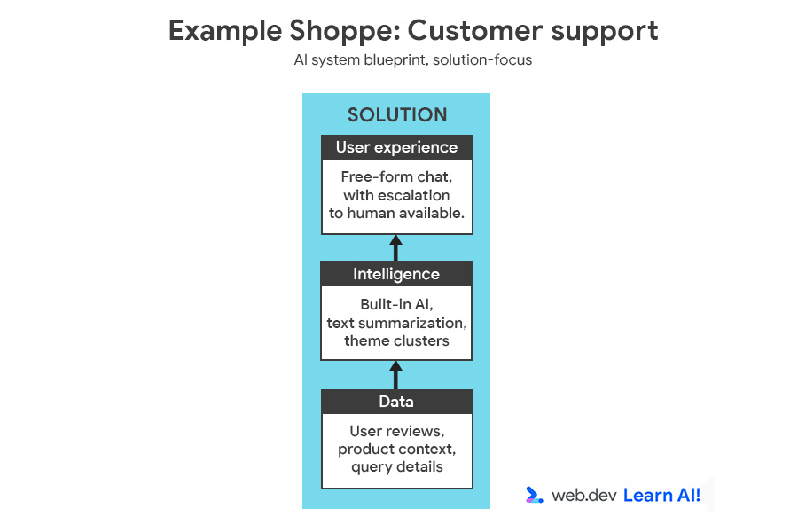

Рисунок 2. В этом модуле мы в основном фокусируемся на слое интеллекта и данных схемы ИИ-системы Example Shoppe.

Проанализируйте сценарий через две линзы: требования сценария применения и бизнес- или командные ограничения.

| **Требование** | **Анализ** | **Критерии** | **Следствие** |
| --- | --- | --- | --- |
| Высокая точность и универсальность | Пользователи задают разные сложные вопросы о заказах, товарах и возвратах. | Мощность модели, точность | Нужна большая языковая модель (LLM). |
| Специфичность данных | Нужно отвечать на вопросы, специфичные для данных, товаров и политик компании. | Настраиваемость | Нужна подача данных, например RAG, но не fine-tuning модели. |

| **Требование** | **Анализ** | **Критерии** | **Следствие** |
| --- | --- | --- | --- |
| Пользовательская база | Сотни тысяч пользователей. | Масштабируемость, совместимость | Нужна архитектура, которая надежно выдерживает высокий трафик. |
| Фокус после запуска | После запуска версии 1 команда перейдет к другим проектам. | Усилия на поддержку | Нужно решение с минимальной постоянной поддержкой. |
| Экспертиза команды | Сильные веб-разработчики, ограниченная AI/ML-экспертиза | Удобство разработчика | Решение должно легко разворачиваться и интегрироваться без специализированных AI-навыков. |

Теперь, когда критерии приоритизированы, можно обратиться к таблице оценки компромиссов и определить, какая платформа соответствует самым важным критериям:

| **Приоритетный критерий**        | **Платформа-победитель**       |
| -------------------------------- | ------------------------------ |
| Мощность модели                  | Server-side                    |
| Настраиваемость                  | Server-side: Self-hosted model |
| Удобство разработчика            | Server-side: Managed service   |
| Усилия на поддержку              | Server-side: Managed Service   |
| Совместимость и масштабируемость | Server-side                    |

Из этого разбора ясно, что стоит использовать server-side AI, вероятно managed service. Это дает универсальную модель для сложных клиентских вопросов. Такой подход минимизирует усилия на поддержку и разработку, передавая инфраструктуру, качество модели и uptime провайдеру.

Хотя настраиваемость ограничена, для веб-команды с небольшим опытом model engineering это оправданный компромисс.

Схема [retrieval-augmented generation (RAG)](https://web.dev/articles/ai-rag-search#scale_up_with_rag) поможет передавать модели релевантный контекст во время inference.

### Гибридный ИИ

Зрелые ИИ-системы редко работают на одной платформе или с одной моделью. Чаще они распределяют ИИ-нагрузки, чтобы оптимизировать компромиссы.

#### Найдите возможности для гибридного ИИ

После запуска нужно уточнять требования на основе реальных данных и обратной связи. В примере Example Shoppe вы ждете несколько месяцев, анализируете результаты и видите следующее:

- Около 80% запросов повторяются: «Где мой заказ?», «Как это вернуть?». Отправка таких запросов в managed service создает много накладных расходов и стоимости.
- Только 20% запросов требуют более глубокого reasoning и открытого интерактивного диалога.

Легкая локальная модель может классифицировать пользовательские вводы и отвечать на типовые вопросы, например «Какая у вас политика возвратов?». Сложные, редкие или неоднозначные вопросы можно направлять в server-side модель.

Реализовав и server-side, и client-side AI, можно снизить стоимость и задержку, сохранив доступ к мощному reasoning, когда он нужен.

#### Распределите нагрузку

Чтобы построить такую гибридную систему для Example Shoppe, начните с определения системы по умолчанию. В этом случае лучше начать с client-side. Приложение должно направлять запросы в server-side AI в двух случаях:

- **Fallback на основе совместимости**: если устройство или браузер пользователя не может обработать запрос, нужно переключиться на сервер.
- **Эскалация на основе возможностей**: если запрос слишком сложный или открытый для client-side модели по заранее определенным критериям, его нужно эскалировать в более крупную server-side модель. Можно использовать модель, которая классифицирует запрос как распространенный, и тогда выполнить задачу client-side, или как нераспространенный, и отправить запрос в server-side систему. Например, если client-side модель определит, что вопрос связан с редкой проблемой, например возвратом средств в другой валюте.

!!!note "Примечание:"

    В некоторых случаях достаточно fallback на основе совместимости. Тогда хорошая идея — использовать одну и ту же модель на обеих платформах. Это обеспечивает более согласованный пользовательский опыт и снижает усилия на поддержку.

#### Гибкость добавляет сложность

Распределение нагрузок между двумя платформами делает систему гибче, но добавляет сложность:

- **Оркестрация**: две среды выполнения означают больше движущихся частей. Нужна логика маршрутизации, повторов и fallbacks.
- **Версионирование**: если вы используете одну модель на разных платформах, она должна оставаться совместимой в обеих средах.
- **Prompt engineering и context engineering**: если на каждой платформе используются разные модели, prompt engineering нужно выполнять для каждой.
- **Мониторинг**: логи и метрики разделены и требуют дополнительных усилий по унификации.
- **Безопасность**: вы поддерживаете две поверхности атаки. И локальные, и облачные endpoints нужно укреплять.

Это еще один компромисс, который нужно учитывать. Если команда маленькая или вы строите неключевую функцию, возможно, не стоит добавлять такую сложность.

**Что стоит запомнить**

Ожидайте, что выбор платформы будет развиваться. Начинайте со сценария применения, согласуйте его с опытом и ресурсами команды и итерируйте по мере роста продукта и зрелости в ИИ. Ваша задача — найти правильное сочетание скорости, приватности и контроля для пользователей, а затем строить с некоторой гибкостью. Так вы сможете адаптироваться к меняющимся требованиям и получать выгоду от будущих обновлений платформ и моделей.

**Ресурсы**

- Поскольку выбор платформы и модели взаимозависимы, прочитайте подробнее о [выборе модели](https://web.dev/articles/right-sized-ai).
- Прочитайте, как [выйти за пределы облака с гибридным и client-side AI](https://www.linkedin.com/pulse/life-edge-web-ai-history-future-smarter-digital-agentic-jason-mayes-fbqbc/).

---

## Стек client-side AI

Для client-side AI есть два варианта. Можно использовать встроенные ИИ-возможности, поставляемые с браузером, или запускать кастомные модели через client-side библиотеки. Оба подхода помогают давать ИИ-функции без сервера, но заметно различаются по охвату, гибкости и операционной сложности.

Этот модуль поможет выбрать между подходами: мы объясним, как они работают, каких компромиссов ожидать и как учитывать ограничения конкретного приложения.

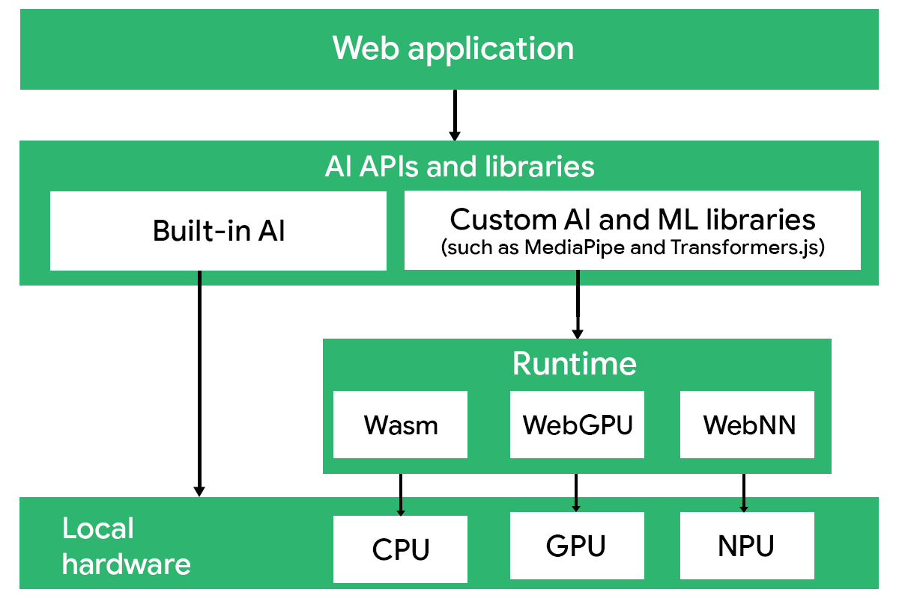

Рисунок 1: при client-side AI веб-приложение интегрирует встроенные ИИ-API или библиотеки. Они опираются на модели, работающие на оборудовании пользователя.

### Built-in AI

Все больше браузеров поставляются с компактными предзагруженными ИИ-моделями, которые можно вызывать напрямую из JavaScript. Например, [Google Chrome включает Gemini Nano](https://developer.chrome.com/docs/ai), а [Microsoft Edge предоставляет Phi-4 mini](https://learn.microsoft.com/microsoft-edge/web-platform/prompt-api). Браузеры открывают высокоуровневые API, чтобы разработчики могли обращаться к этим моделям. Chrome предлагает [несколько task-based API](https://developer.chrome.com/docs/ai/built-in-apis) на разных стадиях разработки, включая API для суммаризации, корректуры и перевода.

С точки зрения разработчика built-in модели ведут себя как любая другая возможность браузера: вы вызываете API, получаете результат и продолжаете строить интерфейс. Не нужно загружать модели, настраивать runtimes или поддерживать inference pipeline. Built-in AI может заметно снизить стоимость функции, потому что не нужно платить за каждый API-вызов. Вы можете быстро прототипировать, итерировать и отбрасывать идеи, фокусируясь на пользовательском опыте и поведении продукта, а не на инфраструктуре.

Built-in AI обменивает гибкость на простоту. Вот ограничения, которые стоит учитывать:

- **Ограниченное поведение вывода**: модели намеренно малы и ограничены в возможностях; они хуже подходят для сложного reasoning, длинных контекстов или открытого диалога.
- **Стоимость загрузки и хранения на стороне пользователя**: прежде чем ИИ-функции станут доступны, браузер пользователя должен скачать и закэшировать модель. Это требует трафика, времени и локального дискового пространства, что может мешать первому запуску.
- **Доступность, зависящая от браузера**: возможности различаются между браузерами, например Chrome и Gemini Nano, Edge и Phi-4-mini. Единая поддержка не гарантирована, поэтому нужно реализовать server-side fallbacks для неподдерживаемых окружений.
- **Нет гарантий постоянного наличия**: модели на устройствах могут быть удалены операционной системой или браузером в любой момент. Приложение должно быть готово к временным пробелам в доступности модели.

Как вы помните из раздела о выборе платформы, built-in AI лучше всего подходит для небольших task-specific функций. Если приложению нужны retrieval (RAG), агенты, структурированные выводы или кастомные workflows, потребуется client-side runtime или server inference.

!!!important "Важно:"

    Даже при стандартизированных API ответы могут сильно различаться, потому что модели в браузерах неодинаковы. Вы можете присоединиться к работе [W3C Web AI Community Group](https://www.w3.org/groups/ig/webai/) над общими интерфейсами для on-device inference. Стандартизация поможет добиться согласованной доступности API и поведения в разных браузерах.

### Кастомные развертывания с библиотеками

Когда вы упираетесь в ограничения built-in AI, можно попробовать кастомные ИИ-библиотеки. Они дают доступ к дополнительным моделям и возможностям pipelines, а некоторые даже предлагают кастомное обучение и fine-tuning.

!!!note "Примечание:"

    В этом разделе мы перечисляем несколько самых популярных client-side библиотек. Рекомендации в этой области будут меняться по мере появления новых библиотек, и мы стремимся поддерживать модуль актуальным. Есть библиотека, которую, по вашему мнению, стоит добавить? [Поделитесь с AI team](https://web.dev/articles/ai-team).

| **Библиотека** | **Что запускает** | **Обучение** | **Лучше всего подходит для** |
| --- | --- | --- | --- |
| **Transformers.js** | Модели из Huggingface, включая несколько модальностей | Нет полного обучения (есть частичная поддержка fine-tuning) | NLP pipelines, embeddings, небольшие мультимодальные задачи |
| **TensorFlow.js** | TF/Keras модели | В браузере | Vision-задачи, audio-задачи, кастомные классификаторы |
| **WebLLM** | Меньшие языковые модели, например Gemma, Mistral, Phi-3 или Qwen | Offline | Чат-боты, reasoning, агенты, offline AI |
| **MediaPipe** | Task-specific vision-модели | Нет | Приложения для лица/рук/позы, AR, gesture UI |
| **ONNX Runtime Web** | Произвольные ONNX-модели | Offline | Embeddings, safety filters, SEO scoring, кастомное машинное обучение |

#### Transformers.js

[Transformers.js](https://web.dev/static/learn/ai/client-side/Transformers.js) дает канал к [Huggingface](https://huggingface.co/), крупнейшему репозиторию открытых моделей. Можно загружать и запускать тысячи предобученных моделей из Huggingface Hub без настройки backend. Библиотека абстрагирует распространенные NLP и мультимодальные задачи через знакомые pipelines, например анализ тональности, распознавание именованных сущностей, суммаризацию и embeddings.

Это отличный выбор для разработчиков, которым нужны гибкие эксперименты, возможность заменять модели из HF Hub или строить насыщенные multi-model workflows в браузере без поддержки серверной инфраструктуры.

#### TensorFlow.js

[TensorFlow.js](https://www.tensorflow.org/js) позволяет запускать TensorFlow и Keras модели прямо в браузере или Node.js. Важное преимущество — [большая экосистема предобученных моделей](https://www.tensorflow.org/hub), покрывающая задачи вроде классификации изображений, обнаружения объектов и оценки позы без кастомной работы.

TensorFlow.js подходит, если вам нужен надежный in-browser inference для устоявшихся задач, не нужны крупные и мощные генеративные модели и вы предпочитаете стабильный API с хорошей документацией и долгосрочной поддержкой.

#### WebLLM

[WebLLM](https://webllm.mlc.ai/) выполняет языковые модели в браузере, позволяя создавать client-side LLM experiences. Он предлагает API, поддерживающий любые open-weight модели, что позволяет строить гибридную схему с минимальными изменениями. Разработчики также могут загружать кастомные MLC-скомпилированные модели, поэтому WebLLM подходит для доменно-специфичных помощников и offline-приложений.

WebLLM — правильный выбор, если вы хотите предложить диалоговые или agentic функции на клиенте.

!!!tip "Совет:"

    Мы написали пошаговое руководство о том, как [создать локальный chatbot с WebLLM](https://web.dev/articles/ai-chatbot-webllm).

#### MediaPipe

[MediaPipe](https://ai.google.dev/edge/mediapipe/solutions/guide) специализируется на задачах компьютерного зрения, включая обнаружение лиц, отслеживание рук и сегментацию. Библиотека берет на себя весь pipeline от предварительной обработки до inference и постобработки, обеспечивая стабильную real-time производительность даже на оборудовании среднего уровня. Ее стоит использовать для интерактивных визуальных функций, фитнес-приложений или любых сценариев, где нужно стабильное offline-восприятие.

MediaPipe также предоставляет модели для текста и позволяет выполнять продвинутый fine-tuning языковых моделей.

!!!note "Примечание:"

    MediaPipe использует собственный кастомный runtime [MLDrift](https://developers.googleblog.com/litert-maximum-performance-simplified/#:%7E:text=MLDrift%3A%20Best%20GPU%20Acceleration%20Yet), написанный на C++. Он оптимизирован для моделей, поддерживаемых библиотекой.

#### ONNX Runtime Web

[ONNX Runtime Web](https://onnxruntime.ai/docs/tutorials/web/) (ORT-Web) — гибкий высокопроизводительный движок для запуска в браузере моделей, определенных по [стандарту ONNX](https://onnx.ai/onnx/intro/concepts.html). Этот стандарт не зависит от фреймворка, поэтому можно экспортировать модели из PyTorch, TensorFlow, Keras, scikit-learn и многих других фреймворков и напрямую разворачивать их в веб-приложении.

ONNX-модели широко представлены на Huggingface, поэтому ORT-Web — хороший выбор, когда нужна кастомизированная client-side модель.

### Runtimes

Для запуска inference client-side AI библиотеки полагаются на браузерные _runtimes_ — низкоуровневые execution backends, которые сопоставляют операции с базовым оборудованием. Выбранный runtime влияет на производительность, использование памяти, числовую стабильность и совместимость ИИ-функций с устройствами.

Большинство библиотек скрывают эти детали, но понимание runtimes помогает принимать осознанные архитектурные решения и диагностировать узкие места. Следующая таблица показывает, какие основные runtimes поддерживают client-side AI библиотеки:

| **Библиотека**       | **Wasm** | **WebGPU** | **WebNN** |
| -------------------- | -------- | ---------- | --------- |
| **Transformers.js**  | +        | +          | +/-       |
| **TensorFlow.js**    | +        | +/-        | -         |
| **WebLLM**           | +/-      | +          | -         |
| **MediaPipe**        | +        | +/-        | -         |
| **ONNX Runtime Web** | +        | +/-        | +/-       |

#### WebAssembly

[WebAssembly (Wasm)](https://webassembly.org/) запускает оптимизированный CPU-bound код в браузере почти с нативной скоростью. Это самый универсально поддерживаемый runtime для машинного обучения, работающий во всех браузерах, платформах и на разном оборудовании.

Wasm поддерживает [SIMD](https://developer.chrome.com/blog/io24-webassembly-webgpu-1#faster_compute) (single instruction, multiple data) и многопоточность там, где она разрешена, поэтому хорошо подходит для меньших ML-нагрузок, таких как embeddings, классификаторы и модели ранжирования. Wasm не использует GPU, поэтому медленнее для больших матричных умножений, но остается отличным fallback.

Если WebGPU недоступен, Wasm сохраняет работоспособность функций.

#### WebGPU

[WebGPU](https://developer.chrome.com/docs/web-platform/webgpu/overview) — графический API, созданный для ML-нагрузок. Он дает значительный прирост скорости по сравнению с Wasm и может полностью на клиенте запускать более крупные генеративные модели, multi-head attention и высокоразмерные embeddings. Библиотеки вроде WebLLM, Transformers.js и ONNX Runtime Web полагаются на WebGPU, чтобы выполнять LLM inference в браузере.

[Поддержка браузерами быстро растет](https://web.dev/blog/webgpu-supported-major-browsers), но все равно стоит предусмотреть Wasm fallbacks для неподдерживаемых устройств.

#### WebNN

WebNN позволяет браузеру запускать нагрузки машинного обучения на доступном аппаратном ускорителе устройства: GPU, NPU или других специализированных чипах. ML-операции, такие как матричные умножения, свертки и активации, выполняются наиболее эффективным доступным путем.

**Что стоит запомнить**

Client-side AI позволяет веб-разработчикам добавлять интеллект без зависимости от серверов: через встроенные браузерные модели или кастомные библиотеки. Built-in AI идеален для быстрого прототипирования и легких, хорошо ограниченных функций, а кастомные библиотеки дают больше гибкости, выбора моделей и контроля ценой большей сложности.

Когда вы понимаете компромиссы между этими вариантами и runtimes, на которые они опираются, вам проще выбрать стек. Этот стек может меняться по мере развития потребностей приложения.

**Ресурсы**

- Прочитайте статью Jason Mayes [Life on the Edge with Web AI](https://linkedin.com/feed/update/urn:li:activity:7402010727076835328/).

---

## Prompt engineering

В модуле про генеративный ИИ вы узнали, что пространство входов генеративных моделей практически безгранично. Чтобы получать выводы, соответствующие ожиданиям пользователей, нужно конструировать prompts. _Prompt_ — это структурированный контракт между приложением и моделью.

Хорошо написанный prompt:

- Описывает, как LLM должна строить ответ.
- Состоит из нескольких компонентов, которые можно версионировать, тестировать и улучшать со временем.
- Может служить общим артефактом для совместной работы команд.

!!!note "Примечание:"

    Если вы уверенно владеете базовыми техниками prompting, можно перейти сразу к Evaluation-Driven Development.

В этом модуле вы научитесь писать эффективные prompts. Мы объясним, как устроен prompt и как его компоненты распределяются между системой и конечным пользователем. Вы также изучите базовые техники prompting и сценарии, в которых стоит применять каждую из них.

На протяжении модуля мы будем использовать общий пример: BlogBuddy, ИИ-помощник для письма, вдохновленный [использованием Prompt API в CyberAgent](https://developer.chrome.com/blog/prompt-api-blog-cyberagent).

Вернитесь к модулю про генеративный ИИ, чтобы посмотреть схему системы BlogBuddy.

### Компоненты prompt

У каждого компонента prompt есть своя роль в управлении поведением модели.

- **Контекст**: задает роль и домен модели, чтобы она понимала, как себя вести.
- **Инструкция**: назначает модели конкретную задачу.
- **Входные переменные**: контекст конкретной ситуации, который приложение передает в реальном времени.
- **Формат вывода**: определяет ожидаемую структуру вывода. Например, вам могут быть нужны JSON-ответы.
- **Примеры**: показывают, как задача должна выполняться для одного или нескольких других входов.
- **Ограничения**: задают четкие границы, чтобы вывод был согласованным, безопасным и соответствовал бренду.

Prompt может включать некоторые или все эти компоненты. Следующий пример показывает эти компоненты для функции письменного помощника BlogBuddy.

    ### Контекст

    Ты письменный помощник для авторов блогов.
    Твоя задача — генерировать полезный, краткий и увлекательный контент.

    ### Инструкция

    Сгенерируй 3 альтернативных заголовка для поста пользователя в заданном стиле.

    ### Входные переменные

    Вот содержимое поста:
    ${blogPostContent}

    Вот желаемый стиль:
    ${titleStyle}

    ### Формат вывода

    Верни ТОЛЬКО валидный JSON в следующей точной структуре:
    {
      "titles": ["Вариант заголовка 1", "Вариант заголовка 2", "Вариант заголовка 3"]
    }

    ### Примеры

    Пример входа:
    {
      "blogPostContent": "Я наконец-то заглянула в маленькое кафе по соседству, на которое смотрела уже несколько месяцев...",
      "titleStyle": "дружелюбный"
    }

    Пример вывода:
    {
      "titles": [
        "Первый визит в кафе по соседству",
        "Как я наконец-то попробовала кафе, куда давно хотела зайти",
        "Мой опыт в долгожданном локальном месте"
      ]
    }
    ### Ограничения

    - Каждый заголовок должен быть короче 128 символов.
    - Заголовки должны быть оригинальными, не скопированными дословно из черновика.
    - Сохраняй естественный человеческий тон. Избегай эмодзи, если их явно не попросили.
    - Избегай сенсационности и кликбейта.
    - Если в черновике несколько тем, выбери самую заметную.

Для первых prompts начните с главного: инструкции и формата вывода. Затем итеративно добавляйте компоненты, анализируя результаты и определяя, какие более тонкие элементы контроля нужны для успеха.

!!!tip "Совет:"

    Разрабатывая prompts, убедитесь, что у каждого фрагмента информации есть ясная цель, и избегайте чрезмерного раздувания prompt. Слишком много примеров или лишних деталей могут запутать модель, увеличить задержку и поднять стоимость, если вы используете server-side модели. Подробнее об эффективной итерации вы узнаете в Evaluation-Driven Prompt Development.

### System prompts и user prompts

Некоторые компоненты prompt жестко задаются в коде, а другие может предоставить конечный пользователь:

- _System prompt_ предоставляется разработчиками приложения и определяет общее поведение модели. Он может задавать роль модели, ожидаемый тон, формат вывода, например строгую JSON-схему, и любые глобальные ограничения. System prompt также используется для кодирования требований безопасности и ответственности. Он остается постоянным между запросами и дает стабильную основу для поведения модели.

    !!!tip "Совет:"

                                    Для вдохновения посмотрите [коллекцию system prompts](https://github.com/x1xhlol/system-prompts-and-models-of-ai-tools) из популярных моделей и приложений.

- _User prompt_ содержит непосредственный запрос, который приводит к выводу. Пользователь просит выполнить конкретную задачу, которая может включать конкретные переменные. Например: «Покажи три заголовка для этого поста», «Продолжи этот абзац» или «Сделай этот текст более формальным».

Большинство API генеративного ИИ позволяют структурировать prompt как массив сообщений, каждое из которых имеет роль (system или user) и содержимое. Так проще отделить стабильные глобальные инструкции от динамического ввода для конкретного запроса.

Как решить, какие компоненты должны быть в system prompt, а что оставить пользователю? Ответ зависит от гибкости пользовательского опыта и возможностей модели.

#### Ограниченные сценарии применения

Для очень конкретных сценариев большую часть prompt можно заранее определить в system prompt. Например, в BlogBuddy пользователи могут нажать **Show Titles**, чтобы увидеть список сгенерированных вариантов заголовков для черновика.

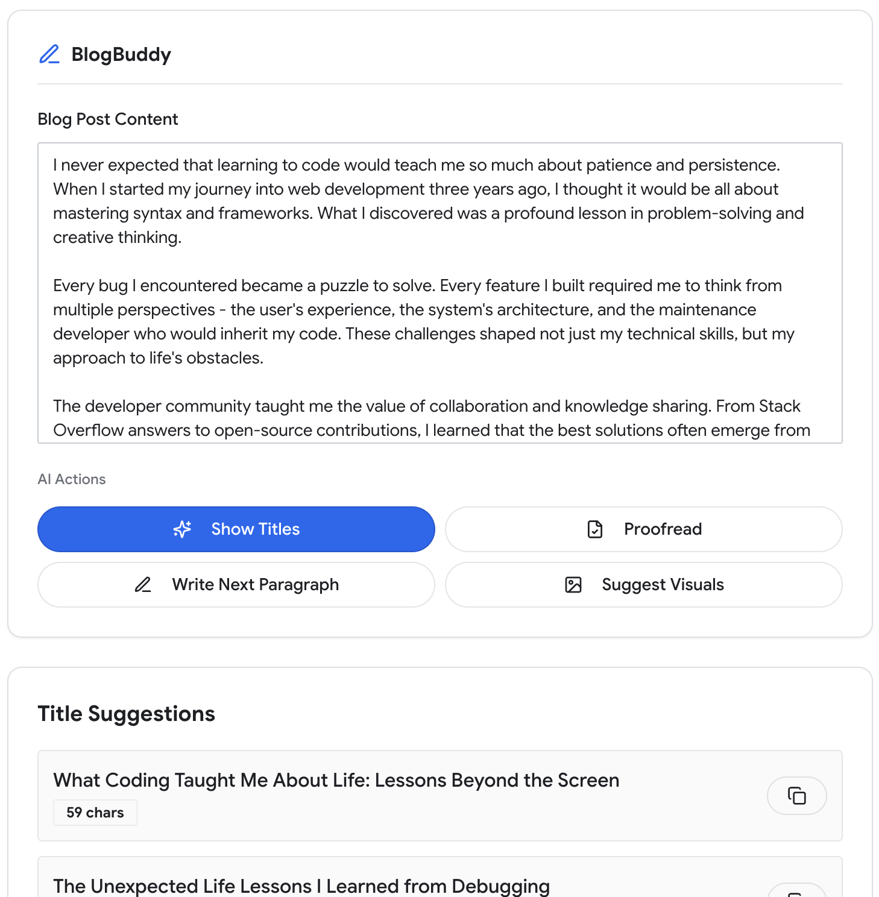

Задача фиксирована, формат вывода известен, и пользователю не нужно давать дополнительный контекст, чтобы получить ожидаемый результат. В этом случае все стабильные правила, рекомендации по тону, схемы вывода и примеры помещаются в system prompt.

Чтобы построить это с [Prompt API](https://developer.chrome.com/docs/ai/prompt-api), мы бы использовали `initialPrompts`, чтобы определить поведение уровня system для всей сессии:

```js
// Определяет стабильное поведение для всей сессии
const session = await LanguageModel.create({
    initialPrompts: [
        {
            role: 'system',
            content: `Ты помощник для написания блогов.
          Твоя задача — генерировать качественные заголовки для постов.
          Всегда отвечай кратко и дружелюбно.
          Верни ровно 3 альтернативных заголовка.
          Сформируй валидный JSON с массивом строк "titles".`,
        },
    ],
});
```

Когда пользователь нажимает **Show Titles**, prompt вызывается для текущего содержимого:

```js
// Единственный переменный вход — содержимое блога
const result = await session.prompt(blogContent);
```

!!!note "Примечание:"

    В модуле UX Patterns мы разберем, почему стоит использовать формулировку **Show Titles**, а не **Generate Titles**.

Со временем пользователи могут попросить больше гибкости и контроля. В этом случае можно перенести некоторые компоненты в user prompt через элементы интерфейса. Например, добавить выпадающее меню со стилем или тоном.

Но слишком много структурированных действий может перегрузить пользовательский опыт. Тогда можно перейти к более открытому дизайну, позволяющему пользователям самим задавать большую часть prompts. Подробнее об оптимизации такого дизайна вы узнаете в модуле UX patterns.

#### Гибкие задачи опираются на подробные user prompts

Открытый интерактивный опыт, который помогает пользователям писать посты с нуля, дает больше гибкости. Пользователи могут просить идеи, планы, переписывание, смену тона или brainstorming, а также уточнять, как именно выполнить задачу. Для такого приложения, скорее всего, нужна более мощная server-side модель.

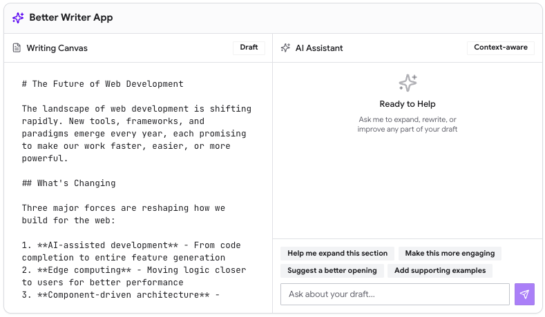

В гибких задачах пользователю нужно задавать больше информации, потому что возможный диапазон вариантов гораздо шире. System prompt все равно управляет общим поведением.

!!!note "Примечание:"

    На практике чат-боты часто проваливаются, особенно если их внедряют слишком рано. [Посмотрите презентацию](https://www.youtube.com/watch?v=Tq-pEVM8u7c), чтобы узнать о более органичном пути интеграции генеративного ИИ.

Лучшие практики:

- Помещайте стабильные правила, структуру и примеры в system prompt. Динамический контент и запросы, специфичные для задачи, помещайте в user prompt.
- Чем более открытый UX, тем больше гибкости нужно user prompt, чтобы обрабатывать непредсказуемые входы.
- Чем больше работы должен выполнять user prompt, тем способнее должна быть модель, потому что ей нужно справляться с большим разнообразием при меньшем количестве встроенной структуры.

Эти правила помогают постепенно оптимизировать компромисс между контролем и пользовательской гибкостью в контексте продукта. Внимательно наблюдайте за предпочтениями и поведением пользователей. Большая гибкость не всегда превращается в реальную ценность. Пользователям также нужны время, навыки и когнитивный ресурс, чтобы составлять более развернутые prompts.

### Распространенные техники prompting

Разработчики обычно пробуют несколько техник prompting, чтобы найти то, что лучше всего подходит их сценарию и модели.

#### Zero-shot prompting

Вы описываете задачу модели и надеетесь на лучшее. Например:

```
"Какая столица Франции?"
```

Zero-shot prompting — эффективный baseline для многих ИИ-задач. Для несложных запросов, например энциклопедических вопросов, чаще всего лучше оставаться с этой техникой. Но в большинстве реальных приложений prompt нужно расширять дополнительными условиями и логикой.

#### Few-shot prompting

При few-shot prompting вы даете примеры, чтобы показать правильное поведение, стиль, структуру и другие важные переменные. Вот пример prompt для классификации sentiment:

```
Ты классифицируешь сообщения пользователей по одной из следующих категорий:
- "positive"
- "negative"
- "neutral"
Вот примеры для классификации:
Input: "I love this product! It works perfectly."
Output: { "label": "positive" }

Input: "This is terrible. I want a refund."
Output: { "label": "negative" }
```

Few-shot prompting полезен для таких псевдопредиктивных задач. Его также можно применять к задачам с узнаваемой структурой, например генерации заголовков на рисунке 1.

Когда пространство вывода очень широкое, например открытый или длинный контент, few-shot prompting, скорее всего, не лучшая техника. Сложно или даже невозможно дать примеры, которые содержательно покрывают это пространство.

#### Chain-of-thought prompting

Вы побуждаете модель рассуждать пошагово перед тем, как дать ответ. Шаги можно описать явно или оставить модели. Например:

```
"Подумай пошагово, чтобы определить главную мысль этого абзаца. Затем создай
короткий заголовок до 60 символов."
```

Chain-of-thought отлично работает для задач, требующих многошагового reasoning и выполнения, например составления плана поста или поддержки сложных решений. Это основная техника за так называемыми reasoning models.

Это может быть дорого. Генерация пошаговых reasoning traces увеличивает вычисления, стоимость и задержку. Используйте это только тогда, когда сценарий требует сложного reasoning и планирования.

#### Self-reflection prompting

После начальной генерации вы просите модель раскритиковать и пересмотреть собственный вывод. Например:

```
"Проверь свой предыдущий вывод.
Найди неясные формулировки и перепиши их короче."
```

Self-reflection особенно полезен для задач, которым помогает итеративное улучшение, например инструментов редактирования или переписывания. Его быстро реализовать, и он может заметно повысить качество. Петля self-reflection полезна, когда prompt уже хорошо работает. Сначала улучшите вывод ради большей ясности или дополнительной пользовательской ценности.

**Что стоит запомнить**

В этом модуле вы узнали, как prompts строятся из структурированных компонентов. На практике prompt engineering очень экспериментален. Ясность и надежность появляются только после нескольких раундов доработки.

В следующем модуле мы рассмотрим Evaluation-driven prompt development. Эта практика помогает системно улучшать prompts и сходиться к тому, что лучше всего работает для продукта и пользователей.

**Ресурсы**

У каждой из этих техник есть варианты и лучшие практики. Существует много подробных внешних ресурсов, например:

- [Руководство Google Cloud по prompt engineering](https://cloud.google.com/discover/what-is-prompt-engineering).
- [Prompt Engineering Guide](https://promptingguide.ai) от DAIR.
- [Prompting made simple](https://medium.com/@janna.lipenkova_52659/prompting-made-simple-6c0112c31536) Janna Lipenkova.
- Прочитайте главу 6 в [_The Art of AI Product Development_](https://www.google.com/books/edition/The_Art_of_AI_Product_Development/XHZmEQAAQBAJ).

Проверьте документацию выбранной модели: там могут быть специфичные рекомендации для получения лучших результатов.

---

## Evaluation-driven development

Когда вы создаете prompts для реальных приложений, появляется ключевой компромисс: баланс краткости и эффективности. При прочих равных краткий prompt быстрее, дешевле и проще поддерживать, чем длинный. Это особенно важно в веб-средах, где имеют значение задержка и лимиты токенов. Но если prompt слишком минимален, модели может не хватить контекста, инструкций или примеров для качественного результата.

_Evaluation-driven development_ (EDD) позволяет системно отслеживать и оптимизировать этот компромисс. Он дает повторяемый и тестируемый процесс для улучшения выводов небольшими уверенными шагами, ловли регрессий и постепенного согласования поведения модели с ожиданиями пользователей и продукта.

Думайте об этом как о [test-driven development (TDD)](https://martinfowler.com/bliki/TestDrivenDevelopment.html), адаптированном к неопределенности ИИ. В отличие от детерминированных unit tests, AI evaluations нельзя жестко закодировать, потому что выводы — и корректные, и ошибочные — могут принимать неожиданные формы.

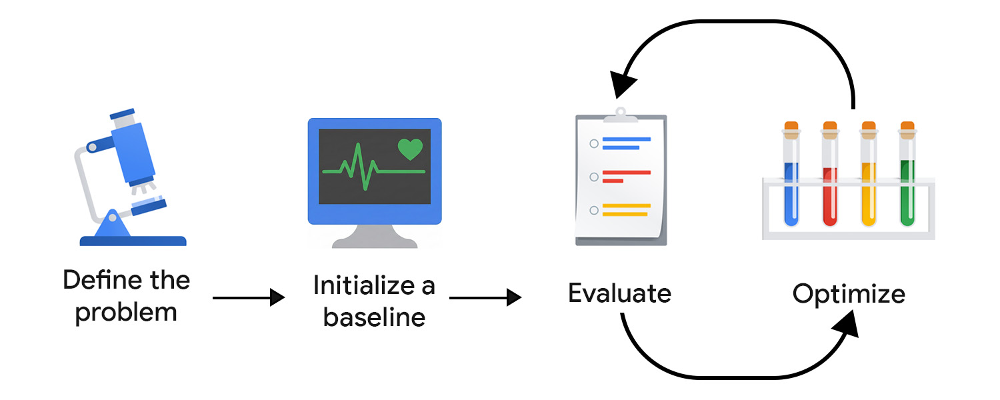

**Рисунок 1**: в EDD вы определяете проблему, инициализируете baseline, оцениваете и оптимизируете. Продолжайте оценивать и оптимизировать, пока процесс не будет завершен.

EDD также поддерживает discovery. Как написание тестов помогает прояснить поведение функции, так определение критериев оценки и просмотр выводов модели заставляет столкнуться с неясностью и постепенно добавлять больше деталей и структуры в открытые или незнакомые задачи.

!!!tip "Совет:"

    Возможно, вы привыкли к детерминированным и объективным тестам, но отличному ИИ-опыту также нужны soft skills. Эмпатия к пользователям, внимание к тону и ясности, готовность относиться к модели как к творческому соавтору важны для создания лучших prompts и функций, которые откликаются пользователям.

### Определите проблему

Можно описать проблему как API-контракт, включая тип входа, формат вывода и дополнительные ограничения. Например:

- **Тип входа**: черновик поста.
- **Формат вывода**: JSON-массив с 3 заголовками поста.
- **Ограничения**: меньше 128 символов, дружелюбный тон.

Затем соберите примеры входов. Чтобы обеспечить разнообразие данных, включите и идеальные примеры, и реальные неряшливые входы. Подумайте о вариациях и edge cases, например постах с эмодзи, вложенной структурой и большим количеством фрагментов кода.

### Инициализируйте baseline

Напишите первый prompt. Начните с zero-shot и включите четкие инструкции, формат вывода и placeholder переменной для входного контента.

Вы будете повышать сложность системы и работать с дополнительными компонентами или техниками prompting, чтобы оптимизировать ИИ-систему. Чтобы эффективно использовать время и оптимизировать правильные компоненты, нужно настроить систему оценки.

### Создайте систему оценки

В TDD вы начинаете писать тесты, когда знаете требования. В генеративном ИИ нет окончательных выводов, с которыми можно сравнивать результат, поэтому нужно вложить больше усилий в создание evaluation loop.

Скорее всего, для эффективной оценки понадобится несколько инструментов измерения.

#### Определите метрики оценки

Метрики оценки могут быть детерминированными, когда есть известный правильный ответ. Например, можно проверить, возвращает ли модель валидный JSON или правильное количество элементов.

Однако с ИИ большую часть времени вы будете выявлять и уточнять субъективные качественные измерения. Это включает качество вывода, полезность, тон и креативность. Можно начать с более широких целей успеха: как вывод должен соответствовать ожиданиям. Со временем вы столкнетесь с конкретными нюансированными проблемами, которые помогут лучше определить цели.

Например, если генератор заголовков злоупотребляет определенными фразами или паттернами, результаты становятся повторяющимися и роботизированными. В таком случае нужно определить новые метрики, которые поощряют разнообразие и не поощряют заезженные структуры или ключевые слова. Со временем основные метрики стабилизируются, и вы сможете отслеживать улучшения.

!!!caution "Осторожно:"

    Не полагайтесь чрезмерно на публичные benchmarks генеративного ИИ, такие как [MMLU-Pro](https://huggingface.co/spaces/TIGER-Lab/MMLU-Pro) и [SEED-Bench](https://huggingface.co/spaces/AILab-CVC/SEED-Bench_Leaderboard). Они могут быть начальными сигналами при выборе модели, но, скорее всего, не репрезентативны для вашей пользовательской базы.

Этому процессу помогают эксперты, которые понимают, как выглядит _хорошо_ в домене приложения, и могут заметить тонкие режимы отказа. Например, если вы разрабатываете помощника для письма, работайте в паре с контент-продюсером или редактором, чтобы оценка соответствовала их представлению о качестве.

#### Выберите судей

Разные критерии оценки требуют разных оценщиков:

- **Code-based checks** хорошо работают для детерминированных или rule-based выводов. Например, можно сканировать заголовки на нежелательные слова, проверять количество символов или валидировать JSON-структуру. Это быстро, повторяемо и идеально подходит для UI-элементов с фиксированным выводом, таких как кнопки или поля форм.
- **Human feedback** необходима для оценки более субъективных качеств, включая тон, ясность или полезность. Особенно на раннем этапе самостоятельный просмотр выводов модели или проверка с доменными экспертами позволяет быстро итерировать. Но этот подход плохо масштабируется. После запуска приложения можно также собирать in-app сигналы, например рейтинг звездами, но они часто шумные и лишены нюансов, нужных для точной оптимизации.
- **[LLM-as-judge](https://web.dev/articles/test-llm-capabilities)** дает масштабируемый способ оценивать субъективные критерии с помощью другой ИИ-модели, которая ставит оценку или критикует выводы. Это быстрее человеческой проверки, но не лишено ловушек: в наивной реализации такой подход может сохранять и даже усиливать bias и пробелы знаний модели.

Приоритизируйте качество, а не количество. В классическом машинном обучении и предиктивном ИИ краудсорсинговая разметка данных — распространенная практика. Для генеративного ИИ краудсорсинговым аннотаторам часто не хватает доменного контекста. Качественная, богатая контекстом оценка важнее масштаба.

### Оценивайте и оптимизируйте

Чем быстрее вы тестируете и улучшаете prompts, тем быстрее придете к результату, соответствующему ожиданиям пользователей. Нужно выработать привычку постоянной оптимизации: попробуйте улучшение, оцените, попробуйте другое.

После выхода в production продолжайте наблюдать и оценивать поведение пользователей и ИИ-системы. Затем анализируйте эти данные и превращайте их в шаги оптимизации.

#### Автоматизируйте evaluation pipeline

Чтобы снизить трение в оптимизации, нужна операционная инфраструктура, которая автоматизирует оценку, отслеживает изменения и связывает разработку с production. Обычно это называют LLMOps. Хотя существуют платформы, помогающие с автоматизацией, сначала стоит спроектировать идеальный workflow, а уже потом выбирать стороннее решение.

Ключевые компоненты, которые стоит учесть:

- **Версионирование**: храните prompts, метрики оценки и тестовые входы в системе контроля версий. Относитесь к ним как к коду, чтобы обеспечить воспроизводимость и ясную историю изменений.
- **Автоматические batch evaluations**: используйте workflows, например GitHub Actions, чтобы запускать оценки при каждом обновлении prompt и генерировать сравнительные отчеты.
- **CI/CD для prompts**: защищайте deployments автоматическими проверками, такими как детерминированные тесты, LLM-as-judge оценки или guardrails, и блокируйте merges при регрессии качества.
- **Production logging и observability**: фиксируйте входы, выводы, ошибки, задержку и использование токенов. Мониторьте дрейф, неожиданные паттерны и всплески отказов.
- **Прием обратной связи**: собирайте пользовательские сигналы (thumbs, переписывания, отказы) и превращайте повторяющиеся проблемы в новые test cases.
- **Отслеживание экспериментов**: отслеживайте версии prompts, конфигурации моделей и результаты оценки.

#### Итерируйте небольшими целевыми изменениями

Уточнение prompt обычно начинается с улучшения его языка. Это может означать более конкретные инструкции, прояснение намерения или удаление неоднозначностей.

Осторожно, не переобучайте prompt. Распространенная ошибка — добавлять слишком узкие правила, чтобы залатать проблемы модели. Например, если генератор заголовков постоянно выдает заголовки, начинающиеся с _The Definitive Guide_, может захотеться явно запретить эту фразу. Вместо этого обобщите проблему и измените инструкцию более высокого уровня. Например, подчеркните оригинальность, разнообразие или конкретный редакционный стиль, чтобы модель усвоила базовое предпочтение, а не единичное исключение.

!!!tip "Совет:"

    Можно использовать LLM, чтобы писать и улучшать prompts. Примеры автоматической оптимизации prompts см. в [Vertex AI Optimize prompts](https://docs.cloud.google.com/vertex-ai/generative-ai/docs/learn/prompts/prompt-optimizer).

Другой путь — экспериментировать с дополнительными техниками prompting и комбинировать их. Выбирая технику, спросите себя: эта задача лучше решается через аналогию (few-shot), пошаговое reasoning (chain-of-thought) или итеративное уточнение (self-reflection)?

Когда система выходит в production, маховик EDD не должен замедляться. Скорее наоборот, он должен ускориться. Если система обрабатывает и логирует пользовательский ввод, он должен стать самым ценным источником инсайтов. Добавляйте повторяющиеся паттерны в evaluation suite и постоянно находите и реализуйте следующие лучшие шаги оптимизации.

!!!tip "Совет:"

    Возможно, вы спроектировали систему, где пользовательский ввод недоступен. В таком случае ищите другие формы обратной связи, чтобы продолжать оценку.

**Что стоит запомнить**

Evaluation-driven prompt development дает структурированный способ двигаться в неопределенности ИИ. Четко определяя проблему, создавая адаптированную систему оценки и итерируя через небольшие целевые улучшения, вы создаете петлю обратной связи, которая стабильно улучшает выводы модели.

**Ресурсы**

Рекомендуемые материалы, если вы хотите реализовать LLM-as-judge:

- [Compare LLM capability with summarization](https://web.dev/articles/test-llm-capabilities).
- Руководство Hamel Husain по [использованию LLM-as-a-Judge](https://hamel.dev/blog/posts/llm-judge/).
- Статья [A Survey on LLM-as-a-Judge](https://arxiv.org/abs/2411.15594).

Если хотите дальше улучшать prompts, прочитайте подробнее о [context-aware development](https://developers.googleblog.com/architecting-efficient-context-aware-multi-agent-framework-for-production/). Этим лучше заниматься вместе с machine learning engineer.

---

## Проектируйте пользовательский опыт с ИИ

С точки зрения пользователя ИИ-системы по своей природе неопределенны. Они могут выдавать несогласованные результаты и регулярно ошибаться. Пользовательский интерфейс дает много возможностей смягчить, отфильтровать и уменьшить раздражение, вызванное ограничениями ИИ. Как разработчик, вы играете центральную роль в формировании пользовательского опыта с ИИ, потому что глубже понимаете, как и где ИИ-система может отказать.

Один из ключевых проектных вопросов — сколько контроля пользователи имеют над ИИ. Некоторые возможности невидимы для пользователей, другие требуют явного взаимодействия. Большая видимость дает больше гибкости, но также больше рисков и сложности, которыми нужно управлять.

В этом модуле мы изучим лучшие практики проектирования UX-паттернов для трех типов видимости: фоновой, ограниченной и открытой. Для каждого типа мы покажем, как технические и архитектурные решения влияют на пользовательский опыт ИИ-системы.

### Фоновый ИИ

ИИ можно использовать, чтобы незаметно усилить существующий опыт без добавления новых функций. Это минимизирует нарушение привычного потока и вероятность заметного отказа. В таком случае ответственность за полезность, надежность и graceful degradation полностью лежит на продукте. Пользователям не нужно изучать, как работает ИИ, и даже знать, что он задействован, чтобы получить пользу.

Фоновый ИИ наиболее уместен, когда:

- Задача низкорисковая.
- Пользовательский контроль не улучшит результат существенно.
- Продукт все еще может давать основную ценность, даже если ИИ-функция отказала или недоступна.

В вебе много примеров фонового ИИ: от спам-фильтров до развлекательных рекомендаций и более сложных примеров вроде [bullet-stream comments у BILIBILI](https://web.dev/case-studies/bilibili-web-ai-improvements). Некоторые из этих функций вы, возможно, даже не воспринимаете как «ИИ».

#### Пример: ИИ-сводки и подсветка отзывов

Помните Example Shoppe? Мы уже показали две схемы системы для разных ИИ-функций: поддержки клиентов и улучшенного поиска товаров. Теперь добавим третью функцию: сводки отзывов. Посмотрите [схему ИИ-системы](exampleshoppe-reviews.jpg).

Страницы товаров часто содержат сотни отзывов. Пользователям бывает трудно оценить характеристики, которые действительно важны именно им.

Можно использовать ИИ, чтобы находить повторяющиеся темы в поисках пользователя и давать персонализированную подсветку и сводки отзывов. В нашем интерфейсе пользователь ищет наушники, поэтому подсвечиваются темы качества звука и времени работы батареи. Это снижает когнитивную нагрузку и может ускорить решение о покупке.

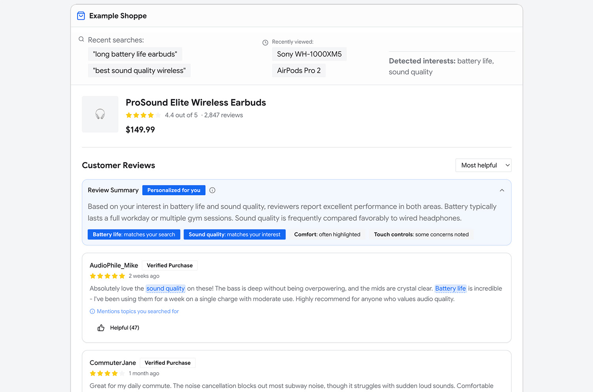

Рисунок 1. Пользователь искал в Example Shoppe беспроводные наушники. Страница товара также подсвечивает недавние поиски, интересы, обнаруженные ИИ, и отзывы клиентов. Сводка отзывов персонализирована с учетом этих интересов, а также других потенциально релевантных интересов. Она находится над проверенными отзывами клиентов и выглядит иначе, чтобы ее не спутали с отдельным отзывом.

Поскольку сводки уникальны для каждого человека, при выборе платформы стоит приоритизировать приватность и скорость. Возможно, стоит выбрать built-in AI и Summarizer API, чтобы вычисления происходили прямо на устройстве пользователя.

**Лучшие практики**

Следуйте этим рекомендациям, чтобы ИИ-функция органично вписывалась в существующий пользовательский опыт:

- **Давайте легкую прозрачность**: когда ИИ преобразует или агрегирует пользовательский контент, тонкие сигналы задают ожидания. Можно использовать нейтральные подписи вроде «Сводка» или «Ключевые инсайты» и добавить progressive disclosure через tooltips или другие UI-элементы.
- **Позвольте отказаться**: люди по-разному относятся к ИИ. Для некоторых он может казаться навязчивым, перегружающим или раздражающим. Дайте понятный способ отключить такие функции.
- **Следите за формулировками**: язык — важная часть любого пользовательского опыта, включая ИИ-сгенерированный текст. В нашем примере сводки должны отражать тренды, а не утверждения. Добавьте правила в system prompt, чтобы уменьшить или убрать чрезмерно уверенный язык в сводке.
- **Спроектируйте graceful fallback**: когда возможно, давайте ценность без ИИ. Если сводка недоступна по техническим причинам, например из-за недоступной модели, система все равно должна показывать несуммаризированные отзывы. После загрузки модели приложение может автоматически показать новую сводку.
- **Минимизируйте нарушение потока при настройке**: первичная загрузка client-side модели может создавать трение. Сначала продемонстрируйте ценность функции. Можно добавить ограниченный server-side fallback или перенести загрузку в конец пользовательского пути, чтобы прерывание было минимальным. Правильный момент и контекст помогают согласовать продукт с приоритетами пользователя.

### Ограниченный ИИ

В то время как фоновый ИИ работает автоматически, ограниченные ИИ-функции явно запускаются пользователем, часто через ссылку или кнопку. Вы определяете задачу, намерение, ограничения и формат вывода в system prompt. В отличие от открытого prompt-интерфейса, у пользователей почти нет вариантов действий, кроме запуска задачи и получения вывода. Система сохраняет предсказуемость, жестко ограничивая то, что ИИ может делать.

Как и фоновый ИИ, ограниченные ИИ-функции хорошо сочетаются с client-side моделями, настроенными под конкретную задачу.

#### Пример: генерация заголовков

Генерация заголовков может быть особенно сложной задачей. BlogBuddy использует ИИ, чтобы помогать авторам получать продуманные контекстные заголовки с минимальными усилиями. Посмотрите схему ИИ-системы для этой функции.

Пользователь может нажать **Show Titles**, чтобы получить несколько черновиков для оценки и доработки.

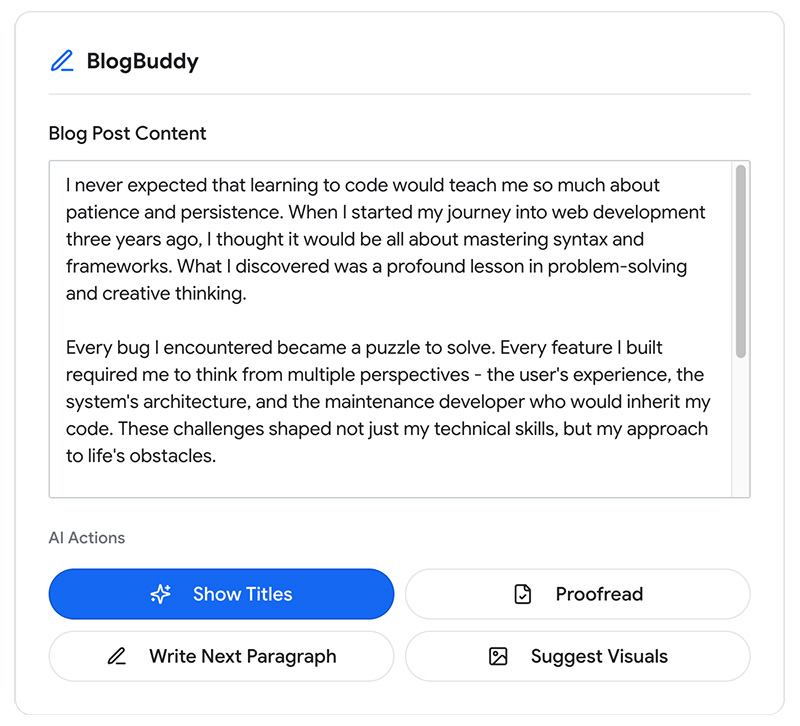

Рисунок 2. В BlogBuddy есть редактор контента с несколькими действиями на базе ИИ.

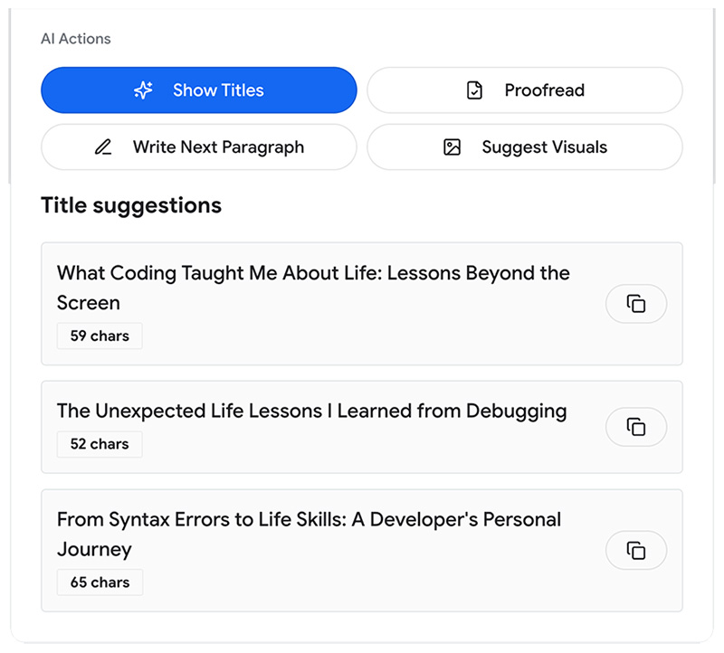

Рисунок 3. После выбора кнопка Show Titles предлагает релевантные заголовки на основе содержимого блога.

В разделе Prompt engineering мы разобрали, как это можно реализовать с Prompt API. Создайте system prompt, который кодирует задачу, стилистические ограничения и структуру вывода. Из UI динамически передается только содержимое поста. При client-side реализации функция оптимизирована для итераций без стоимости настройки.

!!!tip "Совет:"

    Рассмотрите server-side реализацию, если нужны более продвинутые возможности ИИ. Например, если пользователи генерируют заголовки для научных или медицинских журналов, им может понадобиться более глубокая доменная экспертиза.

**Лучшие практики**

Ваша цель — мягко подтолкнуть пользователей к новым функциям. Для этого покажите ценность и дайте контроль над результатом:

- **Сообщайте ясно и уверенно**: понятные названия действий всегда лучше общих формулировок вроде «Ask AI». Пользователь должен интуитивно понимать, что происходит, не только _как_ это происходит. Если задержка функции низкая, добавьте подписи, показывающие, что результат уже доступен. Например, **Show Titles** вместо **Generate Titles**.
- **Держите пользователя в процессе**: добавьте легкое когнитивное трение, чтобы пользователи оставались внимательными. Предлагая несколько вариантов, вы не даете пользователям застрять с результатом, который им не нравится. Пользователи должны явно принять или отредактировать результаты перед сохранением.
- **Если возможно, готовьте результат заранее**: особенно для client-side задач рассмотрите предварительное вычисление результата, чтобы он был доступен сразу.
- **Поддерживайте быстрые итерации**: повторная генерация должна быть простой, обратимой и дешевой. У пользователей должна быть возможность отменить действия. Собирайте эти сигналы обратной связи, чтобы донастраивать функцию для будущих запусков.
- **При необходимости давайте более детальный контроль**: дополнительные структурированные элементы, такие как теги тона, селекторы длины или предустановленные стили, можно использовать для уточнения результатов. Во многих случаях потребность в дополнительном контроле возникает со временем, по мере роста уверенности пользователей и требований. Настройте петли обратной связи, чтобы отслеживать эти изменения.

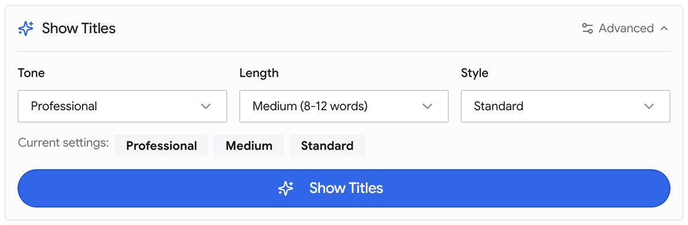 Рисунок 4. Можно добавить выпадающие списки для изменения тона, длины и стиля заголовков, сгенерированных BlogBuddy.

!!!note "Примечание:"

    Посмотрите [fashion-приложение Nykaa](https://www.nykaafashion.com/image-search), чтобы увидеть ограниченный ИИ для ввода изображений. Сделайте фото себя и получите персонализированные рекомендации из каталога товаров.

#### Как выбрать между фоновым и ограниченным ИИ

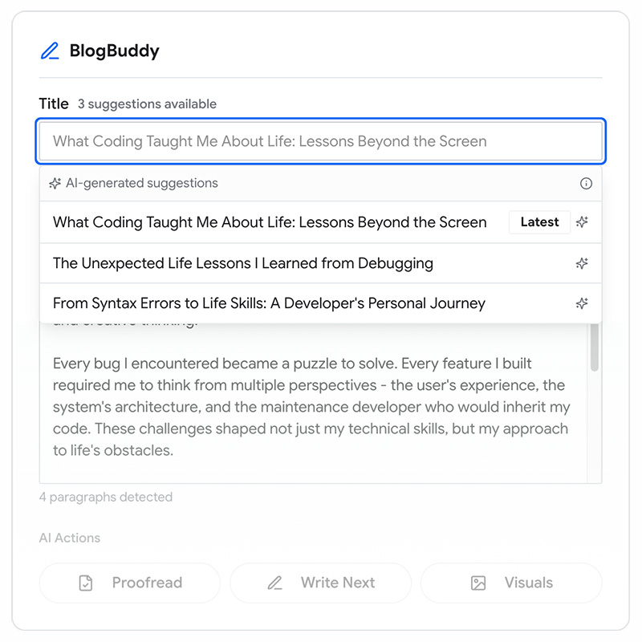

Рисунок 5. BlogBuddy мог бы показывать ИИ-сгенерированные заголовки, когда пользователь кликает в поле ввода заголовка.

Некоторые функции можно реализовать и как фоновый, и как ограниченный ИИ — в зависимости от того, как и когда вы их показываете. На это различие влияют видимость, когнитивная нагрузка и timing, а не доступные возможности. Например, вместо явного клика по кнопке заголовки можно проактивно готовить в фоне, пока пользователь пишет. Когда пользователь фокусирует поле заголовка, можно показать предложения.

Этот подход лучше всего работает, когда:

- Входы, нужные функции, доступны по умолчанию.
- Количество ИИ-функций невелико.
- Стоимость предварительного вычисления низкая.
- Предложения можно встроить, не отвлекая пользователя от задачи.

Напротив, ограниченный ИИ предпочтителен в продуктах с несколькими ИИ-функциями или действиями. Явные триггеры помогают избежать лишних вычислений и дают пользователям более сильное ощущение намерения и контроля.

### Открытый ИИ

Открытый ИИ дает пользователям прямой контроль над поведением ИИ-системы через свободный ввод. Вместо запуска заранее определенного действия пользователи могут дать контекст на естественном языке. После отправки ИИ-система интерпретирует намерение, добавляет недостающий контекст и делает лучший предположительный выбор следующего действия.

Входы очень индивидуальны и часто непредсказуемы, и ИИ-система должна справляться с этой вариативностью. Этот тип дает максимальную гибкость, но и максимальный риск для пользовательского опыта:

- Неоднозначный или неполный пользовательский ввод.
- Непредсказуемые выводы.
- Более высокая вероятность некорректных или вводящих в заблуждение ответов.
- Повышенный риск чрезмерного доверия.
- Попытки скомпрометировать систему, например заставить ее генерировать неприемлемый контент.

!!!tip "Совет:"

    Многие команды начинают с открытого пользовательского опыта. Если вы новичок в ИИ, рекомендуем начать с фоновых или ограниченных ИИ-функций. Возможности можно постепенно расширять по мере того, как пользователи запрашивают вариативность.

#### Пример: ИИ-агент поддержки клиентов

Для _Example Shoppe_ поддержка клиентов охватывает широкий набор вопросов: отслеживание заказов, возвраты, вопросы о товарах, проблемы доставки и edge cases, которые не укладываются в аккуратные workflows. Вспомните схему ИИ-системы из модуля о платформе.

После добавления ограниченных ИИ-функций для самых распространенных действий интерфейс может перегрузиться. Вместо этого открытый ИИ-агент поддержки может дать гибкость.

- Быстро решать распространенные проблемы.
- Снижать время ожидания и стоимость поддержки.
- Давать немедленную помощь по многим темам без сложных support flows.

Ценность агента поддержки — в обработке вариативности в масштабе. В итоге нужно построить систему, которая ответственно обрабатывает такие входы. Хотя вы надеетесь и ожидаете, что пользователи будут использовать здравый смысл и калибровать доверие, ответственность за некорректные ответы модели может лечь на вас.

Пользователи открывают чат с агентом и спрашивают: «Где мой заказ?» или «С меня списали дважды — можете помочь?» Агент интерпретирует намерение, задает уточняющие вопросы, получает релевантную информацию и предлагает следующие шаги или действия.

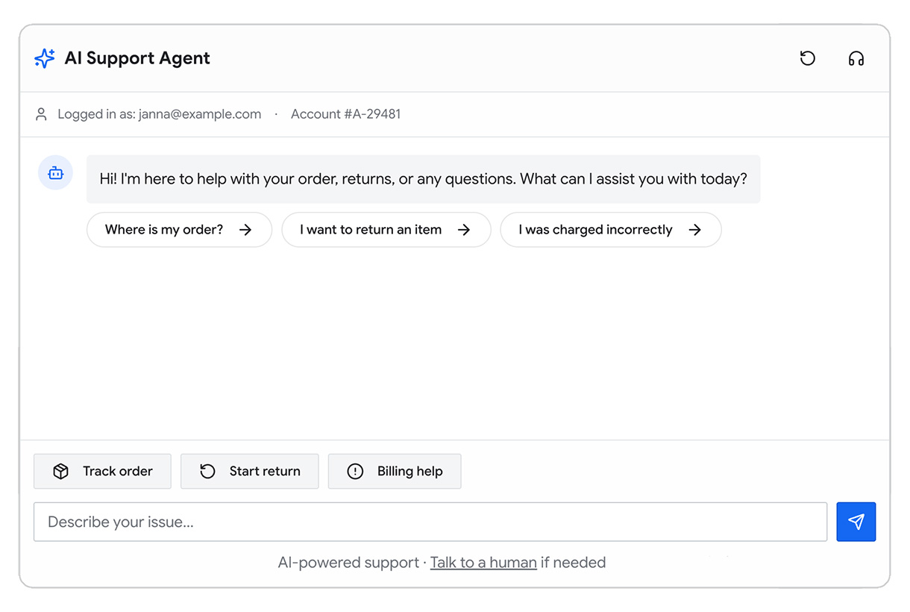

Рисунок 6. Открытый агент поддержки клиентов принимает любой пользовательский ввод. Он может направлять пользователей через заранее заданные prompt suggestions.

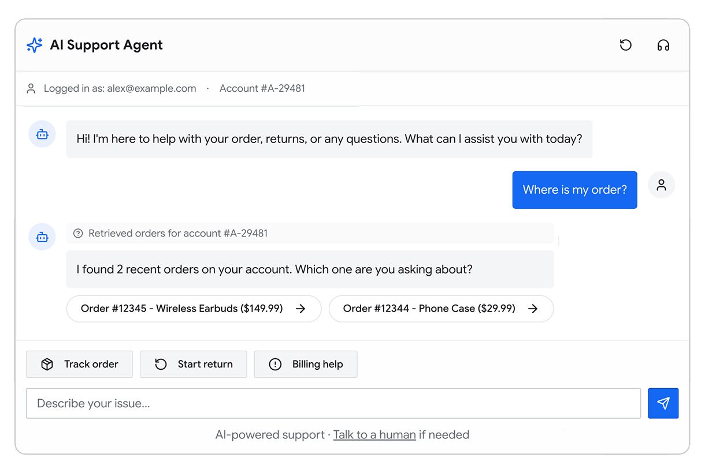

Рисунок 7. Даже в открытом UX структурированные элементы, например кликабельные ID заказов, могут снижать количество ошибок.

Большинство открытых ИИ-систем опираются на server-side модели. Их можно комбинировать с другими компонентами, такими как базы данных, внешние инструменты и бизнес-логика, формируя составную ИИ-систему. Нужно предусмотреть пути эскалации к людям-агентам поддержки.

**Лучшие практики**

Сосредоточьтесь на прозрачности, калибровке доверия и механизмах контроля:

- **Помогайте пользователям ясно выражать намерение**: предлагайте prompt suggestions, например «Я хочу вернуть заказ», и возможные follow-ups, чтобы снизить неоднозначность.
- **Делайте состояние системы и предположения видимыми**: агент должен ясно сообщать, что он понял, например «Похоже, вы спрашиваете о заказе 12345», и какую информацию использует.
- **Спрашивайте перед действием**: перед выполнением чувствительных действий, таких как возвраты, refunds или изменения адреса, агент должен суммировать действие и запросить подтверждение пользователя.
- **Проектируйте проверку и исправление**: пользователи должны иметь возможность исправлять недопонимания, переформулировать запросы или откатывать разговор без начала заново.
- **Комбинируйте с ограниченными ИИ-функциями**: слишком длинный диалог туда-сюда может отпугнуть пользователей. Добавляйте структурированные элементы как shortcuts. Например, выведенный номер заказа можно показать как кликабельный элемент, который позволяет пользователю найти, выбрать или заменить его, а не заставляет переформулировать запрос текстом.
- **Показывайте неопределенность и ограничения**: агент должен признавать неопределенность, сигнализировать о недостающей информации и мягко эскалировать к человеку при низкой уверенности.

Такой тип ИИ-опыта требует, чтобы пользователи критически оценивали ответы и понимали, когда нужна эскалация.

!!!tip "Совет:"

    Посмотрите [**Generative UI**](https://research.google/blog/generative-ui-a-rich-custom-visual-interactive-user-experience-for-any-prompt/) — видение будущего пользовательского опыта, где контент, функциональность и визуальный дизайн адаптируются к каждому новому взаимодействию пользователя. Например, [A2UI](https://a2ui.org/) позволяет агентам строить интерфейсы в реальном времени на основе контекста и взаимодействий пользователя.

**Ключевые выводы**

В этом модуле мы рассмотрели разные типы пользовательского опыта с ИИ:

- Фоновый ИИ позволяет добавить дополнительную ценность или радость в существующий пользовательский путь.
- Ограниченные ИИ-функции можно использовать для конкретных, хорошо определенных сценариев, которые лучше всего выполняются с ИИ.
- Открытый ИИ нужен для доменов с высокой вариативностью. Используйте открытый подход только если вы очень уверены в технической производительности системы.

!!!note "Примечание:"

    «Как только это начинает работать, никто больше не называет это ИИ». — [John McCarthy](https://cacm.acm.org/blogcacm/john-mccarthy/)

**Дополнительные материалы**

Чтобы продолжить изучение UX-паттернов, рекомендуем эти ресурсы:

- Прочитайте [People + AI Guidebook](https://pair.withgoogle.com/guidebook/) от Google.
- [HAX Toolkit](https://www.microsoft.com/en-us/haxtoolkit/) от Microsoft, особенно [рекомендации по взаимодействию человека и ИИ](https://www.microsoft.com/en-us/haxtoolkit/ai-guidelines/).
- [The Shape of AI](https://www.shapeof.ai/) Emily Campbell.
- Главу 10 книги [The Art of AI Product Development](https://www.google.com/books/edition/The_Art_of_AI_Product_Development/XHZmEQAAQBAJ).

---

## Глоссарий и концепции {#learn-ai-glossary}

Основной источник истины для многих терминов машинного обучения (ML) — [ML Glossary](https://developers.google.com/machine-learning/glossary). Вместо того чтобы дублировать его, мы включаем только часто упоминаемые слова и термины, которых нет в ML Glossary.

---

Создавая новые ИИ-функции или продукты, определите **схему ИИ-системы**: сопоставьте возможность для ИИ с тем, как вы будете строить решение. Нужно определить:

- Зачем вы это создаете? Какие сценарии применения ИИ доступны и какую ценность они дают пользователям?
- Как будет работать приложение?
- Как убедиться, что каждая часть системы разработана ответственно?

Подробнее о схеме читайте во введении в ИИ в вебе.

---

**Составные ИИ-архитектуры** — комбинации одной или нескольких моделей и других компонентов, таких как базы данных, API и guardrails, которые вместе обеспечивают надежное поведение с учетом контекста.

---

**Context engineering** — процесс динамического выбора наиболее релевантной информации (токенов) для конкретного запроса, чтобы максимизировать вероятность получения ценного результата.

---

**Дрейф данных** возникает, когда обучающие данные перестают быть репрезентативными для реальности. Поведение пользователей, сбор данных и окружение данных могут измениться в любой момент, что может снизить производительность модели.

---

Получив конкретный ввод, **детерминированное ПО** всегда выполняет одну и ту же последовательность шагов и приводит к идентичному выводу. Это самые надежные типы ПО, потому что они предсказуемы и эффективно работают.

Искусственный интеллект не детерминирован. Пути и результаты могут сильно различаться даже при идентичных prompts.

---

Фреймворк **Evaluation-driven development (EDD)** предлагает повторяемый и тестируемый процесс улучшения выводов небольшими уверенными шагами, ловли регрессий и постепенного согласования поведения модели с ожиданиями пользователей и продукта.

Думайте об этом как о [test-driven development (TDD)](https://martinfowler.com/bliki/TestDrivenDevelopment.html), адаптированном к неопределенности ИИ. В отличие от детерминированных unit tests, AI evaluations нельзя жестко закодировать, потому что выводы — и корректные, и ошибочные — могут принимать множество форм, которые невозможно предсказать.

---

**Генеративный ИИ** — система машинного обучения, способная создавать контент. Это значит, что модель может писать текст, генерировать изображения, создавать код или даже проектировать полноценные пользовательские интерфейсы.

---

Мы рассматриваем три измерения **управления ИИ**:

- _Приватность_: ответственно обращайтесь с данными, объясняйте, что собирается, и минимизируйте то, что покидает браузер.
- _Справедливость_: проверяйте модели на дискриминационное поведение (bias) и создавайте петли, позволяющие пользователям сообщать о проблемах.
- _Доверие и прозрачность_: проектируйте систему для прозрачности и калиброванного доверия, чтобы пользователи продолжали получать пользу, несмотря на неопределенность и возможные ошибки.

Последнее измерение, безопасность, также важно для управления ИИ. Мы планируем подробнее рассказать о безопасности в будущих модулях.

Пока рекомендуем прочитать [Google Secure AI Framework (SAIF)](https://safety.google/cybersecurity-advancements/saif/) и [Google Security Blog](https://security.googleblog.com/search/label/AI%20Security).

---

**Модели** — важнейшая основа ИИ-системы. В ядре модель — это набор параметров и структура, которые помогают системе делать прогнозы. Работа модели может различаться в зависимости от стиля обучения (supervised или unsupervised) и назначения модели (предиктивная или генеративная).

---

[**Model cards**](https://modelcards.withgoogle.com/explore-a-model-card) — структурированные обзоры того, как модель была спроектирована и оценена. Они служат ключевыми артефактами, поддерживающими [подход Google к ответственному ИИ](http://g.co/AI/ProgressUpdate).

---

[**Model weights**](https://developers.google.com/machine-learning/glossary#weight) — числовые значения, определяющие важность определенной информации. Эти значения постоянно обновляются при обучении модели, пока не будет найден оптимальный вес. Вы можете изменять веса открытых моделей, таких как [Gemma](https://ai.google.dev/gemma/docs/tune).

---

**Возможности для ИИ**. Есть несколько категорий, через которые можно описывать ИИ-решения:

- **Инсайты**: улучшение принятия решений.
- **Удобство**: устранение трения.
- **Автоматизация**: замена повторяющейся работы.
- **Усиление возможностей**: помощь пользователям в сложных или творческих задачах.
- **Персонализация**: адаптация продукта к потребностям и предпочтениям конкретного человека.

Подробнее это рассматривается в разделе о сценариях применения.

---

Платформы:

**Client-side AI** работает прямо в браузере. Это значит, что данные могут оставаться приватными на устройстве пользователя, а сетевой задержки нет. Но для хорошей работы client-side AI нужны очень конкретные и хорошо определенные сценарии применения.

**Server-side AI** включает модели, размещенные в облаке и выполняющие inference там же. Такой подход обладает большими возможностями и масштабируемостью, но может быть дороже и требует сетевого соединения.

---

**Предиктивный или аналитический ИИ** — набор алгоритмов, которые помогают понимать существующие данные и прогнозировать, что, вероятно, произойдет дальше. На основе исторических закономерностей предиктивные ИИ-модели учатся прогнозировать результаты, выявлять инсайты и поддерживать более умные решения.

---

**Prompt engineering** — процесс написания и переписывания prompts, чтобы получать выводы, соответствующие ожиданиям пользователей. Хорошо написанный prompt:

- Описывает, как LLM должна строить ответ.
- Состоит из нескольких компонентов, которые можно версионировать, тестировать и улучшать со временем.
- Может служить общим артефактом для совместной работы команд.

В prompt engineering есть ряд техник, о которых вы прочитали в соответствующем модуле.

---

Думайте о **типе prompt** как об аудитории prompt. Подробнее об этом можно прочитать в модуле Prompt engineering.

---

**System prompt** предоставляется разработчиками приложения и определяет общее поведение модели. Он может задавать роль модели («Ты письменный помощник»), ожидаемый тон, формат вывода, например строгую JSON-схему, и любые глобальные ограничения. Этот prompt остается стабильным между запросами.

---

**User prompt** содержит непосредственный запрос, который приводит к выводу. Пользователь предоставляет входные переменные в какой-либо форме, например выделение текста или ожидаемый стиль, и просит выполнить конкретную задачу. Например: «Сгенерируй три заголовка для этого поста», «Продолжи этот абзац» или «Сделай это более формальным».

<small>Источник — <https://web.dev/learn/ai></small>
