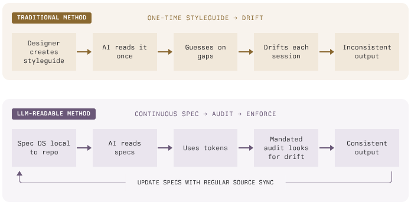

# Сделайте дизайн-систему доступной для LLM

LLM отклоняются от системы, выдумывают токены и начинают каждый сеанс с нуля. Вот как передать дизайн-систему ИИ-агентам, чтобы они перестали гадать.

<!-- more -->

## Кратко

Ваша дизайн-система уже существует в виде кода: библиотек компонентов, файлов токенов и переменных Figma. Проблема в том, что при вайб-кодинге LLM не умеют правильно её использовать. Они выдумывают имена токенов, отклоняются от значений в рамках одного сеанса, теряют контекст между сеансами и не замечают несовместимые изменения в вышестоящей библиотеке.

Описанный здесь метод перестраивает дизайн-систему в формат, который LLM могут надёжно использовать: структурированные файлы спецификаций, закрытый слой токенов и автоматический аудит, выявляющий каждое нарушение.

**Результат: десятый сеанс с ИИ даёт то же визуальное качество, что и первый.**

## LLM не мыслят дизайн-системами

Вы занимаетесь вайб-кодингом прототипа. Описываете компонент — ИИ его создаёт, и он выглядит хорошо. Описываете другой — он тоже выглядит хорошо. К концу сеанса у вас 15 компонентов и профессионально выглядящий макет. Отличный первый день.

Но вот что на самом деле происходило под капотом.

За этот сеанс ИИ принял от 200 до 300 мелких визуальных решений:

- Какой padding использовать для этой карточки
- Какой оттенок синего выбрать для этой ссылки
- Какой border radius задать этой кнопке
- Какой отступ сделать между заголовком и абзацем
- Какую насыщенность шрифта выбрать для этой подписи
- Использовать `12px` или `16px` для второстепенного текста

Каждое из этих решений по отдельности выглядело нормально:

- В одном компоненте padding карточки был `16px`, а в другом — `12px`
- Цвет ссылки в навигации был `#2563EB`, а в области содержимого — `#1D4ED8`
- У одной кнопки border radius равнялся `6px`, у другой — `8px`

Почему вы должны были это заметить? Каждый отдельный выбор был разумным.

Но 200 разумных догадок не складываются в единый дизайн. Они складываются в прототип, который кажется слегка «не таким», хотя вы не можете точно сказать почему.

### В нескольких сеансах вайб-кодинга всё становится ещё хуже

На следующий день вы возвращаетесь и начинаете новый сеанс с ИИ. У него **нулевая память** о вчерашних решениях. Он не знает, что выбрал `#2563EB` для ссылок, `16px` для padding карточки и `8px` для border radius. Он снова начинает гадать — на этот раз иначе.

Теперь у вас два слоя несогласованности: вчерашние 200 догадок и сегодняшние 200 других догадок, расположенные рядом в одном прототипе.

К пятому сеансу прототип кажется «не таким», но вы не можете понять почему. К десятому он выглядит как три разных продукта, созданных тремя командами, которые никогда не общались друг с другом.

### Три ограничения LLM, которые к этому приводят

1.  **Они выдумывают значения.** LLM не ищут токены вашей дизайн-системы. Они генерируют правдоподобные значения. Если система использует `--space-200` для `8px`, LLM может написать `padding: 12px`, потому что `12px` — разумное число. Это не обязательно неправильно. Просто это не ваше значение.
2.  **У них нет памяти между сеансами.** Каждый новый сеанс начинается с нулевого контекста. LLM не помнит, что вчера использовала `#2563EB` для ссылок. Сегодня она выбирает другой синий. К пятому сеансу в одном прототипе уже три разных синих, и все они «нормальные».
3.  **Они не могут прочитать замысел дизайна из исходного кода.** Если показать LLM библиотеку компонентов вроде [Atlaskit](https://atlassian.design/), она увидит API: импортировать `Button`, передать `appearance="primary"` — готово. Но из исходного кода она не извлечёт:
    - когда выбирать один компонент вместо другого;
    - какие отступы использовать между ними;
    - как составлять их в макеты согласно вашим соглашениям.

Эти знания хранятся в головах дизайнеров. Их нужно записать в формате, который LLM сможет использовать в начале каждого сеанса.

## Как сделать дизайн-систему понятной для LLM

Подход состоит из трёх слоёв: файлов спецификаций, которые читает LLM, слоя токенов, из которого она выбирает значения, и аудита, выявляющего ошибки.

Вместо того чтобы решать, «каким синим должна быть эта ссылка», LLM читает файл спецификации и находит `var(--color-link)`. Вместо выдумывания отступа она читает справочник токенов и находит `var(--space-200)`. Дизайнерское решение уже принято человеком — LLM лишь находит его.

Представьте это как **Infrastructure as Code**. До IaC каждый сервер настраивали вручную, и два сервера редко были одинаковыми. IaC сделал конфигурацию серверов воспроизводимой и проверяемой. Здесь происходит то же самое с дизайнерскими решениями: они становятся машиночитаемыми, и LLM перестают гадать.



Четыре части, каждая решает конкретное ограничение LLM:

1.  **Файлы спецификаций, которые LLM читает на каждом сеансе.** Решают проблему памяти. Правила отступов, выбор цветов и рекомендации по использованию компонентов записываются в структурированные Markdown-файлы. LLM читает их в начале сеанса. Нет спецификации — LLM гадает. Есть спецификация — ищет ответ.
2.  **Закрытый слой токенов, из которого LLM выбирает значения.** Решает проблему выдуманных значений. Вместо `padding: 16px`, разбросанного по 30 файлам, вы создаёте `var(--space-200)` и используете его везде. LLM выбирает из закрытого набора именованных переменных, а не изобретает правдоподобные значения.
3.  **Скрипт аудита, выявляющий ошибки LLM.** Решает проблему отклонений. Он сканирует CSS-файлы и для каждого «сырого» значения предлагает правильный токен. Если LLM пишет `color: #2563EB`, скрипт говорит: «используйте `var(--color-link)`». Скрипт запускается в CI; нарушений быть не должно.
4.  **Обнаружение отклонений при обновлении вышестоящей дизайн-системы.** Решает проблему устаревших предположений. Когда библиотека дизайн-системы обновляется, процедура синхронизации указывает, какие файлы спецификаций нужно обновить. LLM всегда читает актуальные спецификации, а не документы, написанные для версии трёхмесячной давности.

## Настройка {#the-setup}

Всё описанное выше (файлы спецификаций, слой токенов, скрипт аудита и обнаружение отклонений) можно реализовать одним промптом.

Вставьте этот промпт в Claude Code (или любого ИИ-агента для программирования) в корне проекта:

```
Audit this project and make the design system LLM-readable.

Step 1: Audit
Scan every CSS/SCSS file. List every hardcoded visual value:
hex colors, rgb/rgba colors, pixel spacing, raw font sizes,
font weights, border radii, z-index values, box shadows,
and transition durations. Group them by category. Count totals.
Report which files have the most hardcoded values.

Step 2: Token layer
Create a tokens.css file with three layers:
- Layer 1: upstream design system tokens (use existing ones
  if the project already uses a design system, otherwise
  derive sensible primitives from the audit)
- Layer 2: project aliases that reference Layer 1 with
  fallbacks, e.g. --color-text: var(--ds-text, #292A2E)
- Layer 3 is the components themselves — they only ever
  reference Layer 2 aliases, never raw values

Include tokens for: colors (text, background, link, border,
interactive states), spacing (at least 8 steps), typography
(font families, sizes, weights, line heights), border radius,
elevation/shadow, z-index, and motion/transitions.

Step 3: Spec files
Create a specs/ directory. Write structured markdown specs:
- specs/foundations/ — color.md, spacing.md, typography.md,
  radius.md, elevation.md, motion.md
- specs/tokens/ — token-reference.md (master map of every
  CSS variable, its value, and when to use it)
- specs/components/ — one file per major component in the
  project. Each spec follows this template:
  1. Metadata (name, category, status)
  2. Overview (when to use, when not to use)
  3. Anatomy (parts of the component)
  4. Tokens used (which CSS variables it references)
  5. Props/API (if applicable)
  6. States (default, hover, active, focus, disabled, error)
  7. Code example
  8. Cross-references (related components)

Only spec components that actually exist in this project.

Step 4: Audit script
Create scripts/token-audit.js (or .sh) that:
- Scans all CSS files for hardcoded values
- Suggests the correct token for each violation
- Prints file, line number, violation, and suggestion
- Returns exit code 1 if any errors found (CI-ready)
- Distinguishes errors (hardcoded colors, spacing) from
  warnings (raw durations, uncommon values)

Step 5: Replace hardcoded values
Go through every CSS file and replace hardcoded values with
the tokens from Step 2. Every color:, background:, padding:,
margin:, gap:, border-radius:, font-size:, font-weight:,
box-shadow:, z-index:, and transition: should reference a
var(--token). No raw values should remain.

Step 6: Project instructions
Add a section to the project's AI instruction file (CLAUDE.md,
.cursorrules, or equivalent) that says:
"Before writing or modifying any UI code, read the relevant
spec file in specs/. Use only tokens from tokens.css. Run the
token audit script before committing. Zero errors required."

Run the audit script at the end and confirm zero violations.
```

Проверь результат, подстрой значения токенов под свой вкус и создай коммит. В итоге ты получишь:

- файл `tokens.css` с трёхслойной косвенной адресацией;
- файлы спецификаций основ и компонентов для всего проекта;
- скрипт аудита токенов, выявляющий жёстко заданные значения в CI;
- замену каждого жёстко заданного CSS-значения правильным токеном;
- файл инструкций проекта для каждого будущего сеанса с ИИ.

### Что делает промпт

Шесть шагов, каждый из которых создаёт результат, требующий проверки.

**Шаг 1: Найти каждое жёстко заданное значение**

Промпт сканирует каждый CSS-файл и подсчитывает жёстко заданные значения: hex-цвета, отступы в пикселях, необработанные размеры шрифта и радиусы границ. Это количество становится исходной точкой. Если в десятках файлов обнаруживаются сотни нарушений, вы понимаете масштаб отклонений.

!!!tip "Обратите внимание"

    Обратите внимание на файлы с наибольшим количеством жёстко заданных значений. Именно там было больше всего догадок.

**Шаг 2: Создать именованные токены для каждого значения**

Промпт создаёт файл `tokens.css` с тремя слоями косвенной адресации.

Сначала токены вышестоящей дизайн-системы помещаются в переменные с префиксом:

```css
--ds-text: #292a2e;
--ds-space-100: 8px;
--ds-radius-200: 8px;
```

Затем проект создаёт для каждого токена псевдоним, используя исходное значение как резервное:

```css
--color-text: var(--ds-text, #292a2e);
--space-100: var(--ds-space-100, 8px);
--radius-200: var(--ds-radius-200, 8px);
```

Компоненты всегда ссылаются только на псевдоним, а не на вышестоящий токен:

```css
color: var(--color-text);
padding: var(--space-100);
border-radius: var(--radius-200);
```

Именно слой псевдонимов обеспечивает защиту. Если дизайн-система переименует токен, вы обновите один псевдоним. Тёмная тема, высокая контрастность и любые будущие темы будут автоматически разрешаться через эту цепочку.

**Шаг 3: Написать файлы спецификаций для каждого компонента**

Промпт создаёт структурированные спецификации в Markdown, организованные по уровням:

1.  **Основы:** цвет, отступы, типографика, радиус, возвышение, анимация
2.  **Справочник токенов:** полная карта всех CSS-переменных
3.  **Атомы:** button, input, icon-button — элементы с одной задачей
4.  **Молекулы и организмы:** составные компоненты, специфичные для вашего продукта
5.  **Паттерны:** правила макета, поток содержимого, отступы между элементами
6.  **Перекрёстные ссылки:** ссылки «Использует» и «Используется в» во всех файлах

Каждый файл следует единому шаблону из 8 разделов: метаданные, обзор, анатомия, токены, props/API, состояния, примеры кода и перекрёстные ссылки.

Сначала проверьте спецификации основ. Цвет и отступы определяют всё остальное; если они заданы правильно, спецификации компонентов выстроятся следом.

!!!info "Лучше меньше, да лучше"

    Убедитесь, что задокументированы только действительно используемые компоненты. Небольшой точный слой спецификаций лучше всеобъемлющего, но устаревшего.

**Шаг 4: Подключить скрипты аудита и инструкции для ИИ**

Промпт подключает три вещи:

**Файл инструкций проекта**, требующий обращаться к спецификациям перед любой работой над UI. Он читается в начале каждого сеанса с ИИ.

**Скрипт аудита токенов**, который сканирует CSS-файлы, находит жёстко заданные значения и предлагает правильный токен. При ошибках он возвращает код выхода 1, поэтому его можно добавить в CI.

Пример вывода:

```
Token Audit
Scanning 28 CSS file(s)...

src/components/Nav.css
  x L42: Hardcoded color #1868DB, use var(--color-link)
  x L78: Raw spacing 12px in padding, use var(--space-150)
  ! L96: Raw duration 0.2s, consider using --motion-* token

=== Summary ===
Files scanned:      28
Files with issues:  0
Errors:             0
Warnings:           0
```

**Чек-лист проверки дизайна**, охватывающий жёстко заданные значения, полноту состояний, анатомию компонентов, согласованность отступов, типографику, анимации, доступность и документирование отклонений.

**Шаг 5: Заменить каждое жёстко заданное значение токеном**

Промпт проходит по каждому CSS-файлу и заменяет жёстко заданные значения созданными токенами. Теперь каждый `color:`, `padding:`, `border-radius:` и `font-size:` проходит через `var(--token)`.

**Шаг 6: Обнаружить отклонения вышестоящей дизайн-системы**

Промпт настраивает процедуру синхронизации, фиксирующую версии пакетов дизайн-системы и обнаруживающую отклонения. Когда вышестоящая библиотека выпускает обновления, процедура указывает, какие файлы спецификаций могут потребовать обновления. Она не блокирует работу: сообщает о найденном, но не изменяет спецификации автоматически.

После первоначальной настройки обслуживание минимально:

- **Новый компонент?** Добавьте файл спецификации до начала разработки или в процессе.
- **Обновление дизайн-системы?** Процедура синхронизации укажет на него. Обновите затронутую документацию.
- **Новый паттерн?** Если дизайнер исправляет одно и то же в двух ревью PR, это паттерн. Запишите его.
- **Аудит токенов завершился ошибкой?** Исправьте жёстко заданное значение, а не скрипт аудита.

## Мы попробовали это с дизайн-системой Atlassian

Мы применили этот подход в проекте на React + TypeScript + Vite, использующем [Atlaskit](https://atlassian.design/) — публичную дизайн-систему Atlassian. Метод работает с любой библиотекой компонентов.

### 64 файла спецификаций на 3 уровнях

| Уровень | Файлы | Что покрывает |
| --- | --- | --- |
| Основы + токены | 19 | Цвет, типографика, отступы, радиус, возвышение, анимация, z-index, иконография, доступность и полная карта всех CSS-переменных |
| Компоненты (атомы, молекулы, организмы) | 38 | Button, input, avatar, tabs, dropdown-menu, modal-dialog, form, table, navigation, content-panel |
| Паттерны | 7 | Canvas-content-flow, three-column-layout, panel-expand-collapse, responsive-grid, form-layout |

### Иерархия файлов

Полный каталог `specs/`:

```
your-project/
├── specs/
│   ├── foundations/         # Уровень 1: Визуальные основы
│   │   ├── color.md
│   │   ├── typography.md
│   │   ├── spacing.md
│   │   ├── radius.md
│   │   ├── elevation.md
│   │   ├── motion.md
│   │   ├── z-index.md
│   │   ├── iconography.md
│   │   ├── accessibility.md
│   │   ├── breakpoints.md
│   │   ├── grid.md
│   │   ├── borders.md
│   │   └── opacity.md
│   │
│   ├── tokens/              # Уровень 1: Справочник CSS-переменных
│   │   ├── token-reference.md
│   │   ├── color-tokens.md
│   │   ├── spacing-tokens.md
│   │   ├── typography-tokens.md
│   │   ├── elevation-tokens.md
│   │   └── motion-tokens.md
│   │
│   ├── atoms/               # Уровень 2: Компоненты
│   │   ├── button.md
│   │   ├── icon-button.md
│   │   ├── input.md
│   │   ├── textarea.md
│   │   ├── checkbox.md
│   │   ├── radio.md
│   │   ├── toggle.md
│   │   ├── avatar.md
│   │   ├── badge.md
│   │   ├── lozenge.md
│   │   ├── tag.md
│   │   ├── spinner.md
│   │   └── link.md
│   │
│   ├── molecules/           # Уровень 2: Составные компоненты
│   │   ├── tabs.md
│   │   ├── breadcrumbs.md
│   │   ├── dropdown-menu.md
│   │   ├── modal-dialog.md
│   │   ├── banner.md
│   │   ├── flag.md
│   │   ├── inline-message.md
│   │   ├── tooltip.md
│   │   ├── form.md
│   │   ├── select.md
│   │   ├── date-picker.md
│   │   ├── pagination.md
│   │   ├── inline-edit.md
│   │   ├── search.md
│   │   ├── popup.md
│   │   ├── progress-bar.md
│   │   ├── side-navigation.md
│   │   └── empty-state.md
│   │
│   ├── organisms/           # Уровень 2: Сборки для конкретного продукта
│   │   ├── table.md
│   │   ├── navigation.md
│   │   ├── page-header.md
│   │   ├── content-panel.md
│   │   ├── chat-panel.md
│   │   ├── dashboard-card.md
│   │   └── work-item-header.md
│   │
│   └── patterns/            # Уровень 3: Правила макета и композиции
│       ├── canvas-content-flow.md
│       ├── three-column-layout.md
│       ├── responsive-grid.md
│       ├── panel-expand-collapse.md
│       ├── form-layout.md
│       ├── list-detail.md
│       └── error-handling.md
│
├── tokens.css               # ← Все CSS-переменные (трёхслойная адресация)
├── scripts/
│   └── token-audit.js       # ← Выявляет жёстко заданные значения в CI
└── CLAUDE.md                # ← ИИ читает этот файл в начале каждого сеанса
```

Каждый уровень ссылается только на уровень выше:

1.  **Основы + токены** определяют исходные значения и называют их CSS-переменными: какие синие цвета существуют, какие шаги отступов доступны и во что преобразуются `--color-link` или `--space-200`
2.  **Компоненты** (атомы, молекулы, организмы) используют эти токены для стилизации элементов. Кнопка знает свой токен padding, цвета и радиуса. Выпадающее меню объединяет кнопку, всплывающее окно и элементы списка. Панель навигации собирает выпадающее меню, хлебные крошки и аватар
3.  **Паттерны** описывают размещение компонентов на странице: правила трёхколоночного макета, отступы между секциями содержимого, поведение разворачивания и сворачивания панелей

Когда ИИ создаёт форму, он читает `patterns/form-layout.md` для правил отступов, `molecules/form.md` для структуры формы, `atoms/input.md` для компонента поля ввода и `tokens/spacing-tokens.md` для точных значений. Каждое решение — это поиск в справочнике.

### Каждое визуальное значение получает имя

После запуска промпта каждое жёстко заданное визуальное значение в проекте было заменено именованной CSS-переменной. Аудит обнаружил 418 необработанных значений в 28 файлах. Промпт сопоставил их с более чем 230 токенами в `tokens.css`:

- 69 цветов (фоны, текст, границы, ссылки, интерактивные состояния);
- 12 значений отступов (padding, margin, gap — все на базовой сетке 4px);
- 8 размеров шрифта (от подписи до display);
- 7 радиусов (от незаметного 2px до полностью скруглённого);
- 8 уровней z-index (выпадающие меню, модальные окна, подсказки, уведомления).

В файлах больше нет необработанных hex-цветов или значений в пикселях. ИИ не может выбрать неправильный синий, потому что существует только `var(--color-link)`.

### До и после

| Сценарий | Без понятной DS | С понятной DS |
| --- | --- | --- |
| Цвет ссылки | ИИ пишет `#2563EB` в одном компоненте и `#1D4ED8` в другом. Оба выглядят синими. Ни один не «неправильный». | `var(--color-link)`. Один синий. Каждый компонент. Каждый сеанс. |
| Padding карточки | ИИ пишет здесь `12px`, там `16px`, а где-то ещё `14px`. Всё «выглядит нормально». | `var(--space-200)`, иначе аудит завершится ошибкой с конкретной рекомендацией. |
| Тёмная тема | Жёстко заданный `#FFFFFF` ломается. Каждый компонент требует отдельного исправления. | Цепочка токенов автоматически разрешается для каждой темы. Компоненты менять не нужно. |
| Новый сеанс | ИИ начинает с нуля. Другие догадки. Несогласованность двух сеансов. | ИИ читает те же спецификации и токены. Качество результата одинаковое. |
| Проверка дизайна | Ручное визуальное сравнение: «Выглядит правильно?» «Кажется, да». | Автоматический аудит: 0 ошибок — можно выпускать. Ненулевой результат — конкретные номера строк и рекомендации. |

## Почему это важно для больших прототипов

Прототипы, созданные вайб-кодингом, разваливаются после нескольких сеансов, потому что LLM незаметно накапливают ошибки. Каждый сеанс добавляет новые выдуманные значения, новые несогласованности и новые отклонения от исходной дизайн-системы. К десятому сеансу прототип выглядит как три разных продукта.

Понятная дизайн-система ограничивает LLM в каждой точке, где иначе пришлось бы гадать. Спецификации дают ей память между сеансами. Слой токенов предоставляет закрытый набор значений вместо возможности выдумывать новые. Аудит выявляет всё, что проскользнуло, а обнаружение отклонений поддерживает актуальность относительно вышестоящей системы.

**Десятый сеанс даёт то же визуальное качество, что и первый.**

### Наши результаты

| Метрика | До | После |
| --- | --- | --- |
| Жёстко заданные CSS-значения | 418 в 28 файлах | 0 |
| Файлы спецификаций | 0 | 64 (3 уровня) |
| Сопоставленные токены дизайна | Разрозненные, несогласованные | Более 230 с трёхслойной адресацией |
| Отслеживаемые вышестоящие пакеты | Не отслеживались | 39 с обнаружением отклонений |
| Согласованность результата ИИ | Переменная, зависит от сеанса | Ограниченная: одна спецификация, одни токены, один аудит |

Числа менее важны, чем изменения в нашем рабочем процессе. Мы перестали проверять визуальную согласованность результата LLM, потому что ограничения делают это за нас. LLM читает спецификацию, использует токен, а аудит выявляет всё пропущенное. Человеческий вкус задаётся один раз. После этого LLM механически ему следует.

## Часто задаваемые вопросы

**«Разве это не просто документация?»**

Документация рассказывает, что существует. Этот подход также блокирует то, чего существовать не должно. Скрипт аудита возвращает код выхода 1, если в CSS появляется жёстко заданное значение. Файл инструкций проекта требует обращаться к спецификации перед каждым изменением UI. Код, нарушающий слой токенов, нельзя смержить.

**«Три-четыре дня на настройку — это слишком много».**

Это оценка ручной работы. [Промпт настройки](#the-setup) проводит ИИ-агента через все шесть шагов за один сеанс. Вы проверяете результат, подстраиваете значения токенов под свой вкус и создаёте коммит. Обычно это занимает несколько часов.

**«А спецификации не устареют?»**

Файлы спецификаций находятся в репозитории рядом с кодом, который они описывают, а не в wiki или комментарии Figma. Когда компонент меняется в PR, файл спецификации находится в том же diff. Процедура обнаружения отклонений отмечает обновления вышестоящей дизайн-системы, которые затрагивают ваши спецификации.

**«Разве ИИ не может просто прочитать исходный код?»**

Он может прочитать API компонентов. Но он не может прочитать ваши представления о том, когда использовать модальное окно вместо встроенного сообщения, какое соглашение об отступах применять между секциями и как трёхколоночный макет должен вести себя на планшетных брейкпоинтах. Исходный код показывает, что уже создано. Спецификации описывают, как создать следующее.

**«Наши дизайнеры и так всё это знают».**

Незаписанные знания не передаются ИИ-сеансам, новым сотрудникам или подрядчикам. Они также не сохраняются после ухода человека из команды. Файлы спецификаций помещают эти знания в систему контроля версий, где их читают в начале каждого сеанса с ИИ и при каждом онбординге.

<small>Источник: <https://hvpandya.com/llm-design-systems></small>
