# Основы больших языковых моделей {#llm-fundamentals}

ИИ уже умеет менять то, как вы работаете. Он же легко встает на пути, если не понимать его ограничения.

Технология одновременно сырая и развивается очень быстро, поэтому даже опытные разработчики теряются в ее странностях. Если вы не знаете, где у модели границы, вы не сможете их обойти и не выжмете из доступных инструментов максимум.

<!-- more -->

В этом тексте собраны пять уроков бесплатного курса [LLM Fundamentals](https://www.aihero.dev/llm-fundamentals) Мэтта Покока. После него должно стать понятно:

- что на самом деле делает системный промпт;
- почему LLM «думает» числами, а не текстом;
- почему раздутое контекстное окно вредит ответу;
- почему слишком много инструментов замедляет модель;
- что такое агент и когда он не нужен.

Это словарь, которым уже пользуются вокруг, и более ясный способ думать об ИИ. Когда ограничения видны, модель перестает быть магией и становится странным, но мощным инструментом, который лучше всего работает там, где вы знаете его пределы.

!!! note "Схемы"

    Рисунки скачаны из оригинального курса и оставлены с английскими подписями.

## Сообщения, системные промпты и токены рассуждения {#messages}

Чтобы понять LLM, сначала нужно понять протокол разговора: сообщения, из которых он состоит.

Что такое сообщение пользователя? Что такое системный промпт? Что такое вызов инструмента? Что такое токены рассуждения?

<small>Оригинал: <https://www.aihero.dev/messages-system-prompts-and-reasoning-tokens></small>

### Сообщения пользователя и ассистента {#user-and-assistant}

Простой диалог с моделью выглядит так. Сообщения от вас называются сообщениями пользователя. Сообщения модели называются сообщениями ассистента.

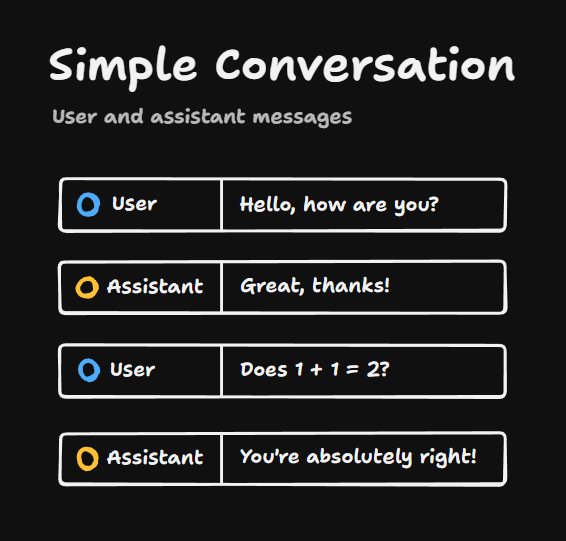

В таком виде вы говорите с «голой» моделью, которую отдает провайдер. Если поведение нужно настроить, в историю добавляют системный промпт.

### Системные промпты {#system-prompts}

Системный промпт стоит в самом начале истории. Его видит модель, а пользователь обычно нет.

Он сильнее пользовательских сообщений. Если между ними конфликт, модель чаще подчиняется системному промпту. Можно потребовать отвечать только азбукой Морзе, и даже прямая просьба «хватит Морзе» не сменит формат.

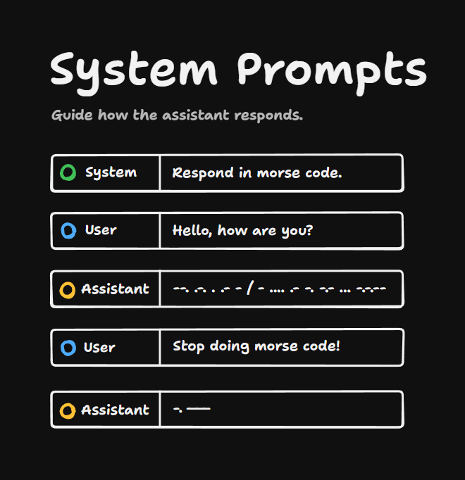

Это теория, а не гарантия. Системные промпты регулярно обходят, но по умолчанию модель считает их главной инструкцией.

### Токены рассуждения {#reasoning-tokens}

Многие модели возвращают токены рассуждения: перед ответом они как будто проговаривают ход мысли. Эти токены — еще одна часть сообщения ассистента, а не отдельный канал.

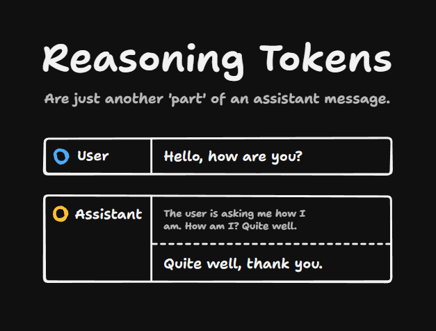

Отсюда важное следствие: одно сообщение может содержать несколько частей. Так же устроены файлы. Модели можно отправить файл или получить файл обратно, например при генерации изображений.

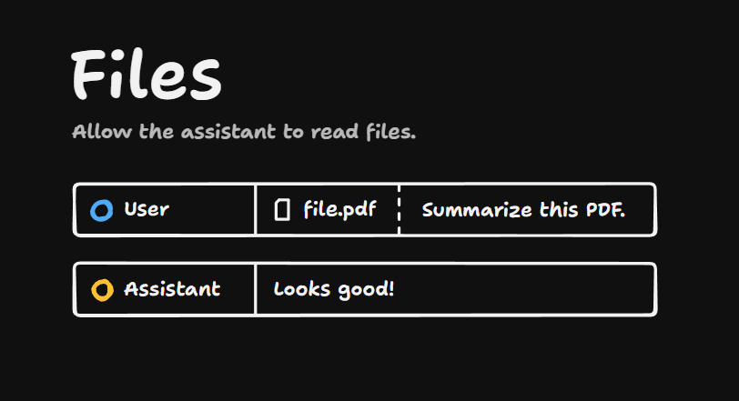

На схеме пользователь отправляет PDF с просьбой сделать краткое содержание, а модель возвращает пересказ.

### Инструменты как диалог {#tools-as-conversation}

Инструмент можно описать модели заранее. Например, сказать, что у нее есть `writeFile`, который пишет файл в файловую систему.

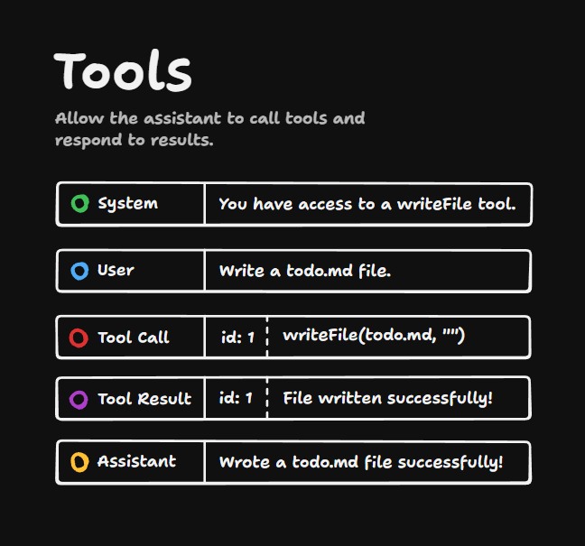

Дальше пользователь просит создать файл `todo.md`. Ассистент отвечает не текстом, а вызовом инструмента. У вызова есть `id` и инструкция: записать файл `todo.md` с пустым содержимым.

Приложение берет этот вызов, выполняет его и отправляет модели результат с тем же `id`. Обычно результат — строка. Ассистент уже после этого пишет человеку итог: файл `todo.md` создан.

Инструменты — это разговор между моделью и вашей системой:

1. Вызов инструмента — модель просит что-то сделать.
2. Результат инструмента — вы возвращаете ей то, что произошло.

Так устроены Claude Code, Cursor и другие приложения, которые действуют на вашей машине. Ниже тот же цикл разобран подробнее.

## Что такое токены {#tokens}

Токены — элементарные куски, которыми большая языковая модель обрабатывает текст. Их стоит понимать еще и потому, что счет за API выставляют по токенам.

<small>Оригинал: <https://www.aihero.dev/what-are-tokens></small>

### Кодирование и декодирование {#encoding-decoding}

Токены — это числа, в которых модель «думает» о вашем тексте. Преобразование текста в токены называется **кодированием**.

Оно идет в два шага:

1. Токенизатор режет текст на знакомые ему фрагменты.
2. Эти фрагменты превращаются в числа.

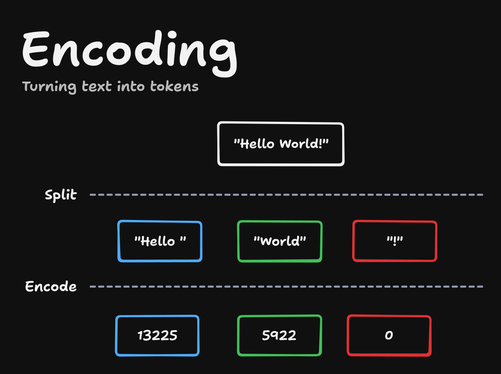

**Декодирование** — обратный путь:

1. Числа снова становятся текстовыми токенами.
2. Токены склеиваются в выходной текст.

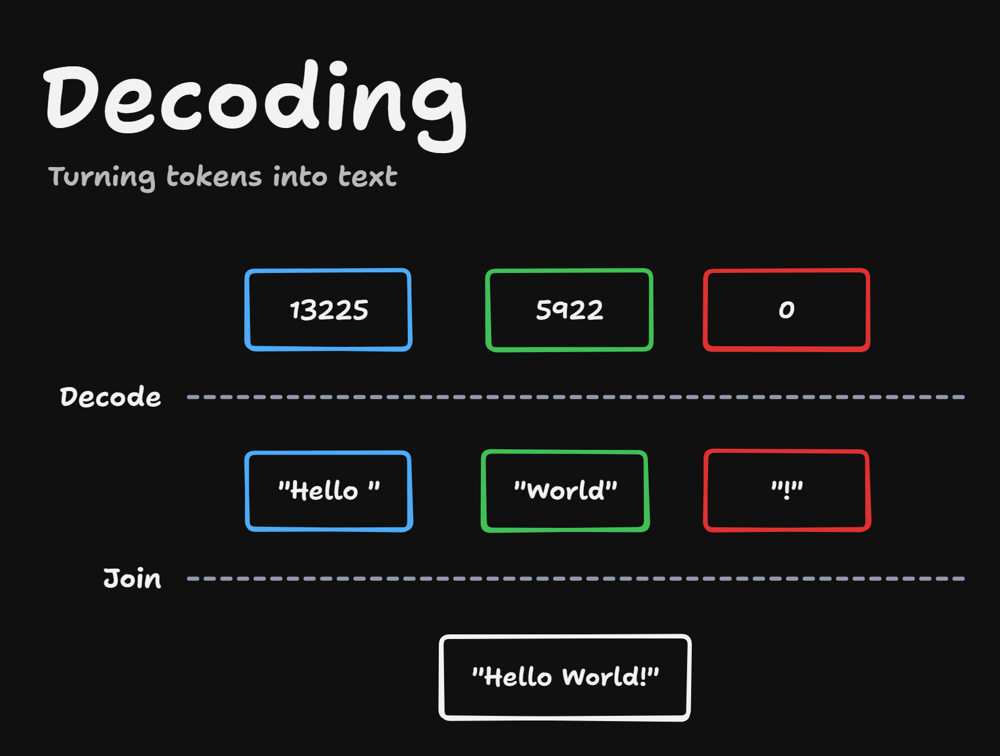

### Как проходит запрос {#llm-process}

Полный путь выглядит так:

1. Токенизатор кодирует входной текст.
2. Модель обрабатывает входные токены.
3. Модель порождает выходные токены.
4. Выходные токены декодируются в читаемый текст.

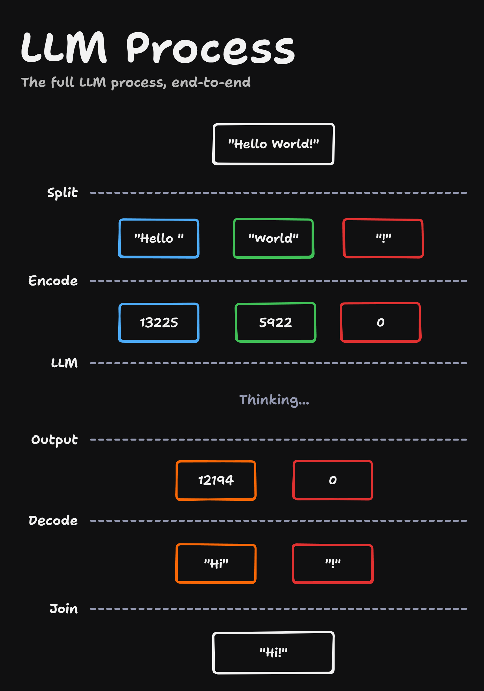

К входным токенам относятся:

- история диалога;
- системные промпты;
- описания инструментов.

Выходные токены — это то, что модель присылает в ответ.

Платят и за вход, и за выход, обычно по разным тарифам. Один из способов снизить счет — строить промпты так, чтобы ответ занимал меньше выходных токенов.

### Как собирают словарь {#how-tokens-are-created}

Токенизатор обучают на большом корпусе текста, похожем на тот, на котором учат саму модель. Для примера возьмем крошечный корпус из одной фразы: `the cat sat on the mat`.

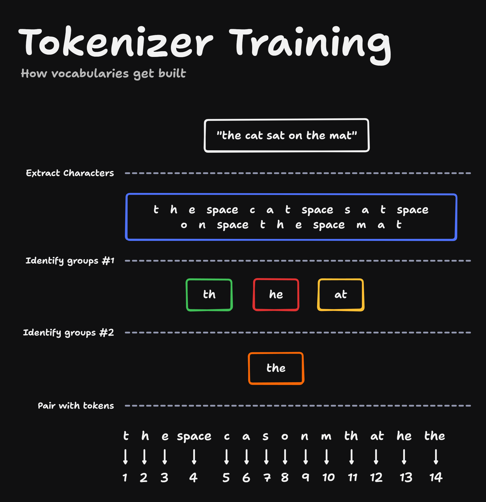

Сначала выделяют отдельные символы:

```text
T H E space C A T space S A T space O N space T H E space M A T
```

Каждый символ становится токеном словаря.

Потом находят частые сочетания:

- `TH` дважды встречается в `the`;
- `HE` дважды встречается в `the`;
- `AT` встречается в `cat`, `sat` и `mat`.

Каждая такая группа тоже получает свой токен.

Дальше группы склеивают в группы покрупнее. `TH` и `HE` дают `THE`, и у слова `the` появляется собственный токен.

### Размер словаря {#vocabulary-size}

Словарь стараются сделать большим: чем он шире, тем на меньшее число токенов распадается обычное слово, и обработка дешевле.

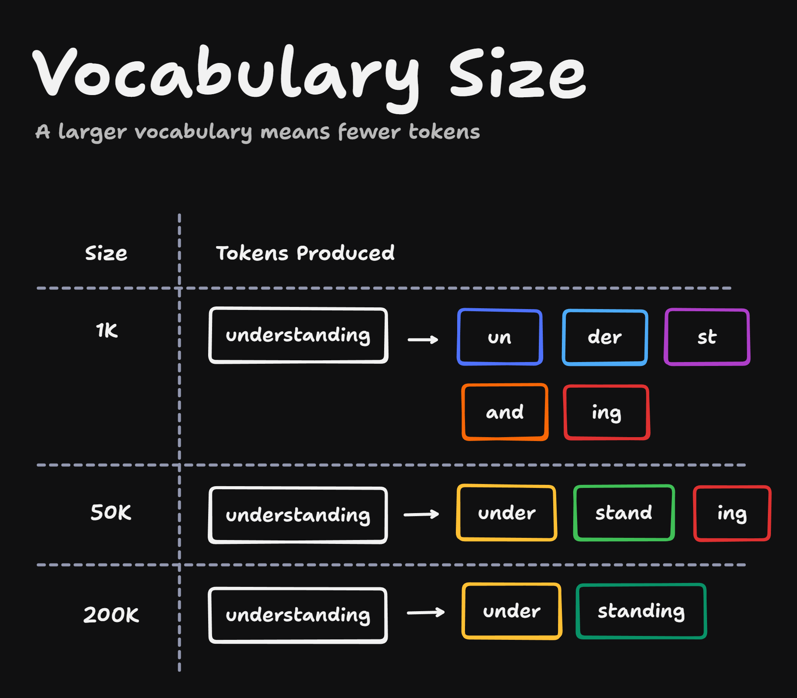

Например, при словаре в 1000 токенов слово `understanding` может занять 5 токенов. При 50 000 — уже 3, при 200 000 — 2.

Большой словарь режет слова короче, а короче значит быстрее и дешевле.

### Необычные слова {#unusual-words}

С редкими словами токенизатор справляется хуже. Строка `O Frabjous Day` из стихотворения Льюиса Кэрролла распадается на много токенов, потому что `Frabjous` — выдуманное слово и в обучающем корпусе почти не встречается.

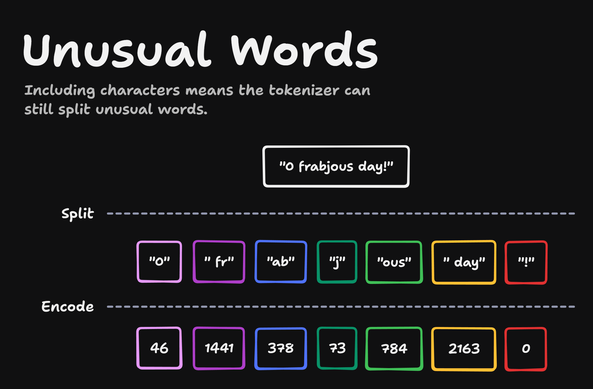

На схеме это 7 токенов, хотя в строке всего около 15 символов. Для обычного английского слова такой длины кусков было бы меньше.

Разобраться на своих примерах удобно в [tiktokenizer](https://tiktokenizer.vercel.app/).

## Что такое контекстное окно {#context-window}

Контекстное окно состоит из входных и выходных токенов. Во вход могут входить системный промпт и сообщение пользователя. Выход — это то, чем отвечает ассистент.

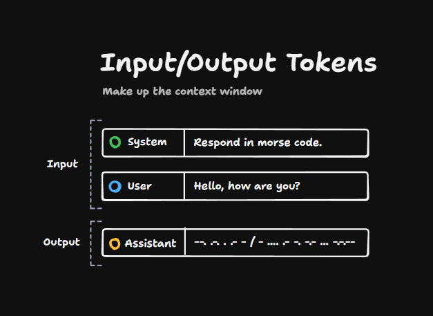

Окно — это вход и выход вместе.

Чем длиннее разговор и чем больше в него попадает сообщений, тем больше токенов он занимает.

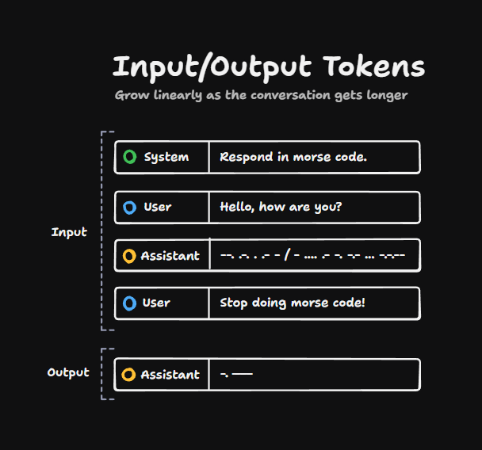

Бесконечно это продолжаться не может. У каждой модели есть жесткий предел: сколько токенов она видит за один раз.

<small>Оригинал: <https://www.aihero.dev/what-is-the-context-window></small>

### Предел окна {#context-limits}

В очень длинном разговоре предел когда-нибудь наступает. Если отправить такой диалог в API, в ответ обычно приходит ошибка.

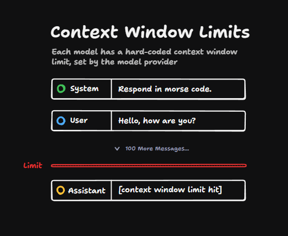

Предел можно задеть уже во время генерации. Сообщение начинается внутри окна, а продолжение вылезает за границу.

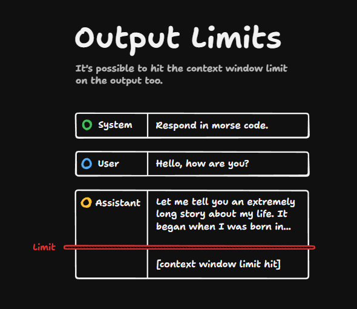

Сама модель не умеет надежно обойти собственный лимит, поэтому такие обрывы время от времени случаются.

### «Потерянные в середине» {#lost-in-the-middle}

Более коварная проблема в другом: чем окно больше, тем сильнее эффект «потерянных в середине».

Если представить длинный диалог как цепочку сообщений, сильнее всего на ответ влияют начало и конец истории. Середине модель уделяет меньше внимания.

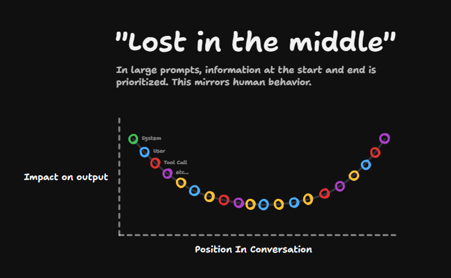

Это известный эффект, и он тем заметнее, чем больше контекстное окно.

Поэтому большой заявленный лимит сам по себе мало о чем говорит. В такое окно можно положить очень много текста, но модель все равно будет терять середину и может не достать факт, который уже лежит у нее в контексте.

Даже если модель формально принимает огромное окно, ответ почти всегда лучше, когда токенов в контексте меньше.

## Что такое инструменты {#tools}

Инструменты модель получает через системный промпт. Это обычное сообщение в начале истории: оно говорит, что делать, и в том числе какие инструменты можно вызвать.

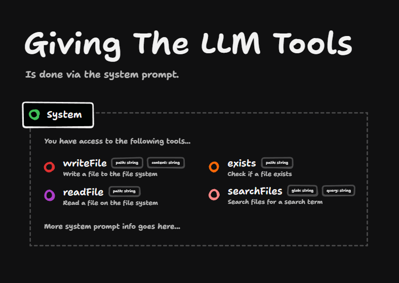

У каждого инструмента три части:

1. Имя, например `writeFile`.
2. Описание, например «записать файл в файловую систему».
3. Параметры и их типы, например `path` и `content`.

Параметры задают в JSON Schema, поэтому туда проходит все, что умеет схема: объекты, массивы и другие составные типы.

Описания попадают в системный промпт, а остальной текст промпта идет ниже. Отдельной магии нет: это просто определения инструментов внутри системного сообщения.

<small>Оригинал: <https://www.aihero.dev/what-are-tools></small>

### Модель выбирает инструмент {#choosing-a-tool}

Дальше модель сама решает, какой инструмент вызвать. В системном промпте написано «у тебя есть следующие инструменты», а пользователь говорит: «Создай файл `.gitignore`».

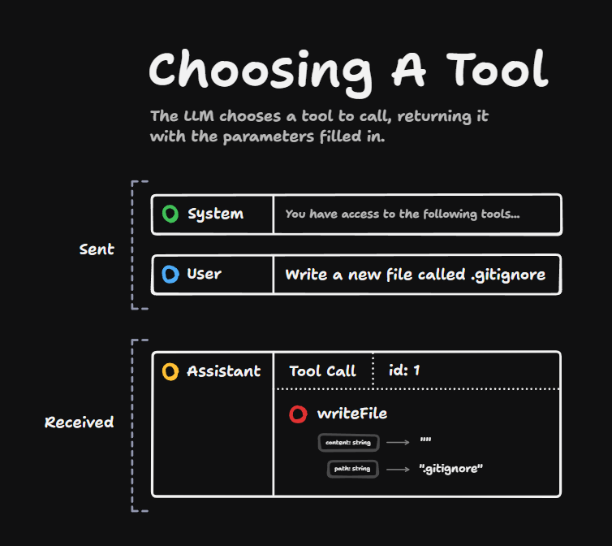

В ответ приходит сообщение ассистента с вызовом инструмента. Это инструкция, какой инструмент вызвать. У нее есть `id` и нужные параметры. В примере модель пишет пустой файл по пути `.gitignore`.

### Вызов и выполнение {#tool-execution}

Вызов — только инструкция. Пока ничего не произошло: ассистент просто произвел сообщение.

Дальше инструмент нужно выполнить на вашей машине. Модель создала текст вызова, а файл создаете вы.

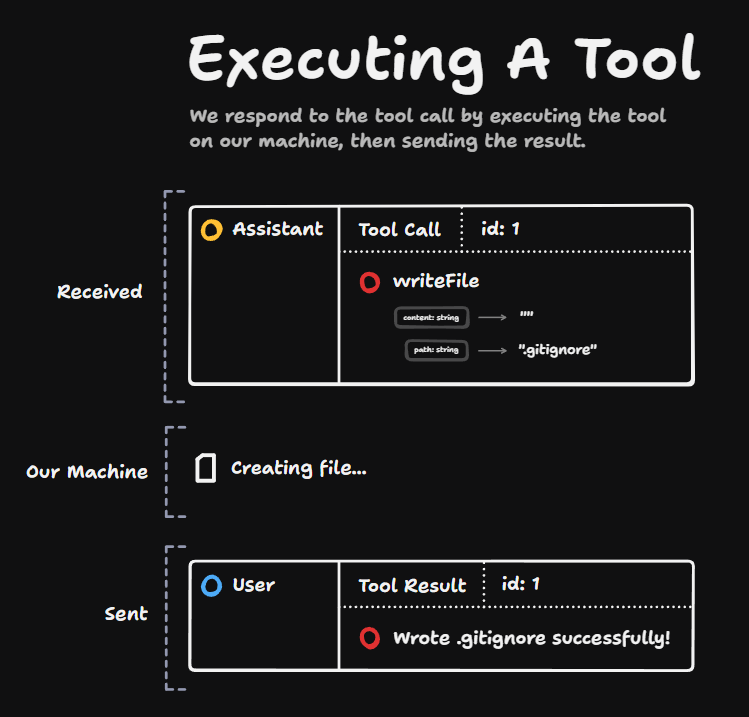

Значит, каждому инструменту из системного промпта в коде соответствует своя функция.

Если выполнение прошло успешно, модели отправляют сообщение с тем же `id`, что у вызова, и текстом о том, что получилось.

### Ошибки {#tool-errors}

Ошибки нужно показывать модели. Если инструмент упал, текст ошибки должен вернуться в историю, иначе модель не сможет попробовать другой путь.

Результат бывает и успехом, и неудачей.

### Весь цикл {#tool-flow}

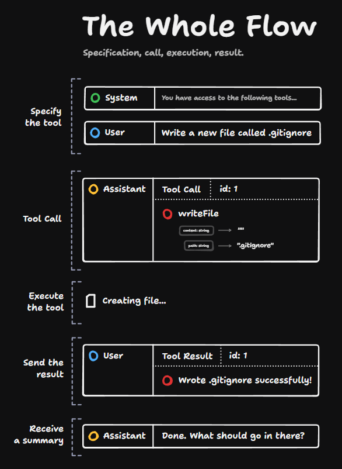

Еще раз по шагам:

1. Инструмент описывают в системном промпте: «у тебя есть следующие инструменты», и передают набор JSON Schema.
2. Пользователь пишет: «Создай файл `.gitignore`». Прямо говорить «вызови этот инструмент» не нужно: модель выбирает сама.
3. Модель возвращает вызов со всеми параметрами.
4. Приложение видит вызов и выполняет его на машине.
5. Результат уходит обратно сообщением о том, что произошло.
6. Модель видит всю историю и отвечает кратким итогом.

В примере на схеме она отвечает: «Готово. Что туда положить?»

Инструменты — способ заставить модель порождать сообщения особого вида. Эти сообщения перехватывают, выполняют на своей машине и возвращают результат в диалог.

На таком цикле уже можно собирать очень сильные приложения.

## Что такое агент {#agents}

После статьи Anthropic [«Создание эффективных агентов»](../building-effective-agents/index.md) все заговорили об агентах и рабочих процессах. И то и другое — способ собрать более сильную систему из нескольких вызовов LLM.

<small>Оригинал: <https://www.aihero.dev/what-is-an-agent></small>

### Рабочий процесс {#workflows}

Рабочий процесс идет по шагам, которые заранее задал разработчик. Один вызов LLM передает результат следующему, тот — еще одному. Порядок записан в коде.

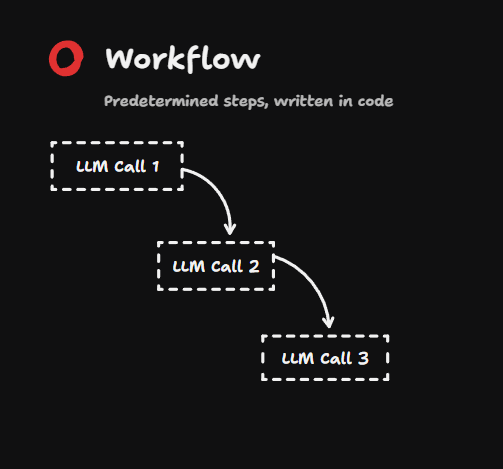

Код решает, когда остановиться и когда звать модель снова. Это решение не отдано модели.

### Агент {#agent-loop}

У агента заранее расписанных шагов нет. Модель вызывают и дают ей набор инструментов, то есть несколько возможных следующих действий. Она сама выбирает инструмент и реагирует на результат.

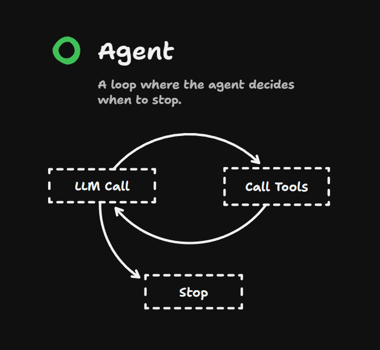

Остановку тоже выбирает модель, когда считает задачу законченной. По сути она импровизирует по ходу. Свободы больше, предсказуемости меньше.

### Агенты и рабочие процессы {#agents-vs-workflows}

И агент, и рабочий процесс состоят из нескольких вызовов LLM. Один вызов — ни то ни другое.

Решающая разница в том, кто останавливает работу.

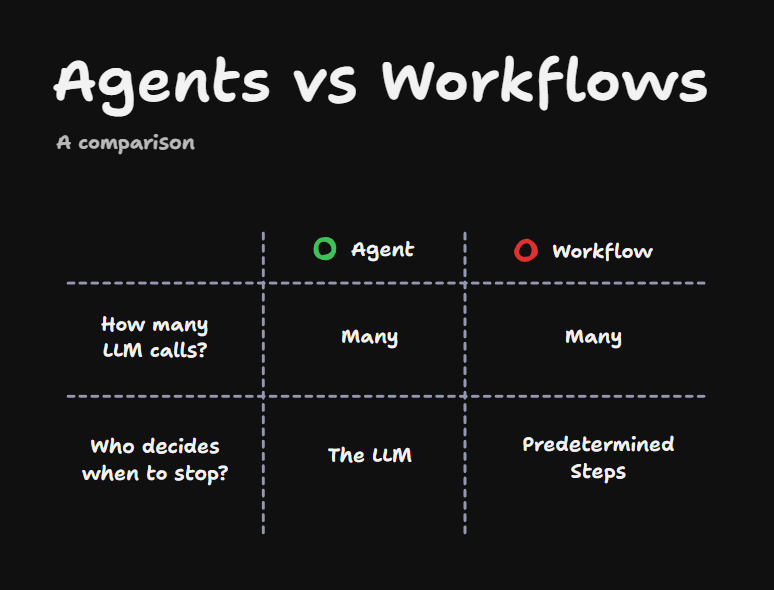

Агент хорош там, где шаги заранее неясны и нужно импровизировать, чтобы пробраться через трудную задачу.

Рабочий процесс хорош там, где одно и то же нужно делать снова и снова одним и тем же способом. Их часто недооценивают: агенты звучат интереснее. Если задача четко описана, рабочий процесс обычно дает более устойчивый результат.

### Параллельный рабочий процесс {#parallel-workflow}

Рабочим процессом можно распараллелить работу. Текст делят на две части, каждую кратко пересказывают отдельным вызовом, а потом пересказывают уже эти два пересказа.

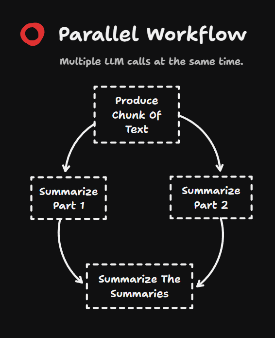

В этом и разница. Агент уместен, когда маршрут неизвестен. Рабочий процесс уместен, когда маршрут уже понятен и его можно закрепить в коде.

## Источники {#sources}

- <https://www.aihero.dev/llm-fundamentals>
- <https://www.aihero.dev/messages-system-prompts-and-reasoning-tokens>
- <https://www.aihero.dev/what-are-tokens>
- <https://www.aihero.dev/what-is-the-context-window>
- <https://www.aihero.dev/what-are-tools>
- <https://www.aihero.dev/what-is-an-agent>
