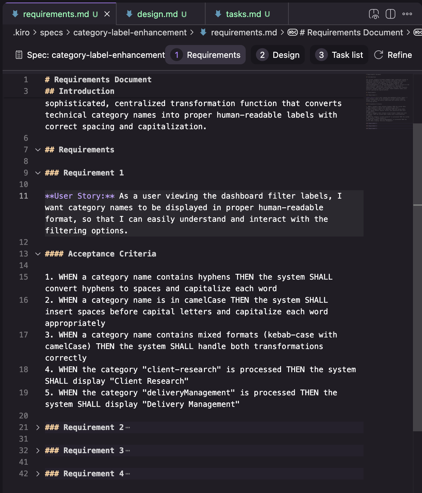
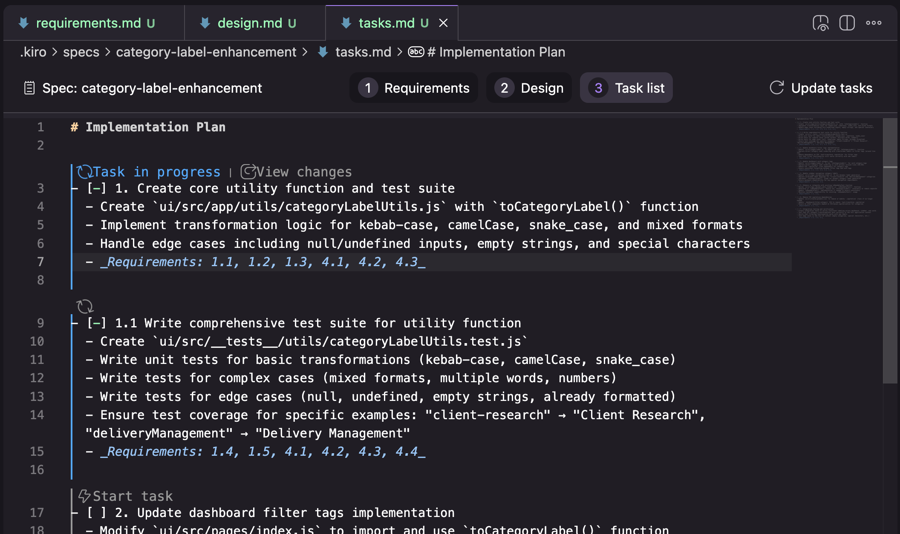
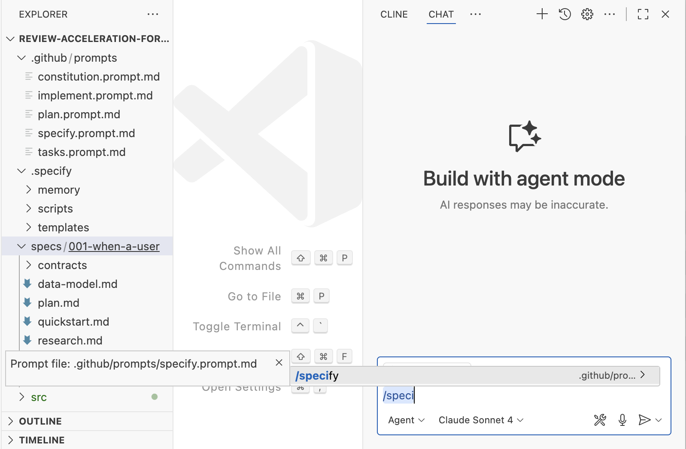
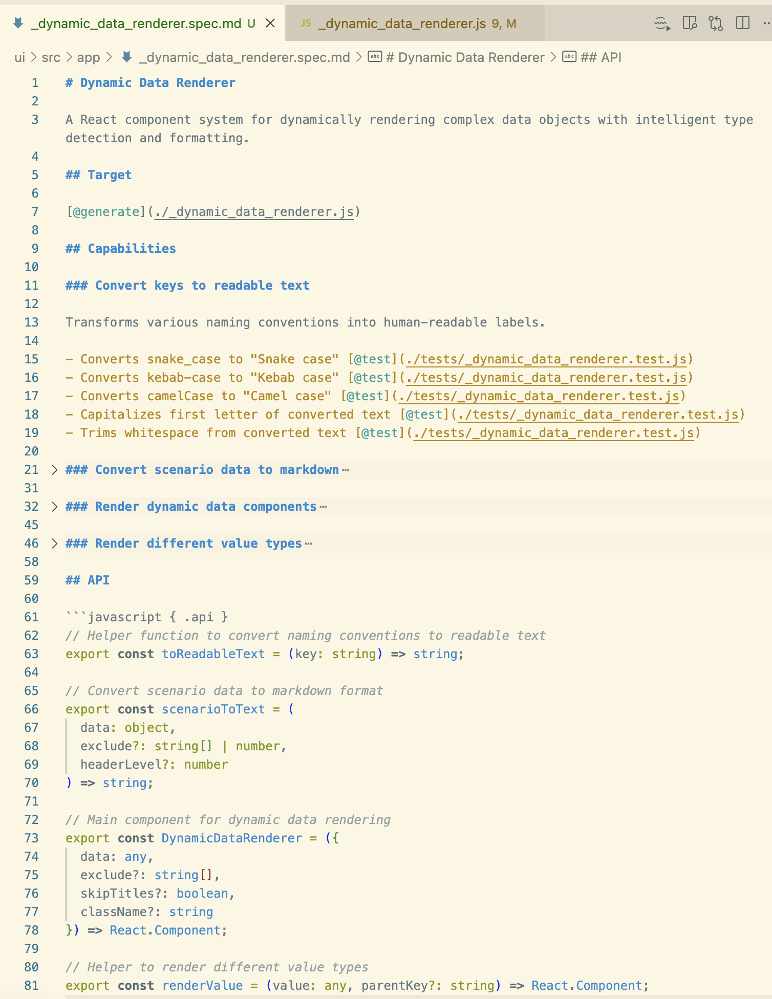

# Разбираемся в Spec-Driven Development: Kiro, spec-kit и Tessl

Я пытался разобраться в одном из свежих buzzword в AI-разработке: Spec-Driven Development (SDD). Я посмотрел на три инструмента, которые называют себя SDD-инструментами, и попытался понять, что это вообще означает на текущий момент.

<!-- more -->

## Определение

Как и со многими новыми терминами в этой быстро меняющейся области, определение «spec-driven development» (SDD) пока не устоялось. Вот что я понял по текущему употреблению: spec-driven development означает, что перед написанием кода с AI сначала пишется «спека» («documentation first»). Спека становится источником истины и для человека, и для AI.

[GitHub](https://github.com/github/spec-kit/blob/main/spec-driven.md): «В этом новом мире _поддержка ПО означает эволюцию спецификаций_. … Общий язык разработки поднимается на более высокий уровень, а код становится “последней милей”».

[Tessl](https://docs.tessl.io/introduction-to-tessl/concepts): «Подход к разработке, где _главный артефакт — это спеки, а не код_. Спеки описывают намерение на структурированном, проверяемом языке, а агенты генерируют код в соответствии с ними».

Изучив употребление термина и несколько инструментов, которые заявляют, что реализуют SDD, я пришел к выводу, что на практике есть несколько уровней реализации:

1.  **Spec-first**: сначала пишется продуманная спека, а затем она используется в AI-assisted workflow для конкретной задачи.
2.  **Spec-anchored**: спека сохраняется и после завершения задачи, чтобы использовать ее для эволюции и сопровождения соответствующей фичи.
3.  **Spec-as-source**: спека со временем становится основным исходником; человек редактирует только спеку и не трогает код.

Все подходы и определения SDD, которые я встречал, являются spec-first, но не все стремятся к spec-anchored или spec-as-source. И часто остается неясным или вовсе открытым вопрос, как именно должна выглядеть стратегия сопровождения спек во времени.

![Иллюстрация трех наблюдаемых уровней SDD в двух колонках: «Создание фичи» и «Эволюция и сопровождение фичи», каждый уровень — отдельной строкой. Spec-first: документы-спеки ведут к коду, и спеки, и код помечены иконками робота и человека, чтобы показать, что и AI, и люди редактируют и спеки, и код. После создания фичи спеки удаляются, а на этапе эволюции создается новая спека для описания изменения. Следующая строка — spec-anchored: как spec-first, но спека не удаляется после создания, а редактируется при эволюции. Последняя строка — spec-as-source: как spec-anchored, но у файлов кода иконка человека зачеркнута, потому что люди здесь код не редактируют. Все три концепции связаны стрелками наследования (контурная стрелка), потому что они наращиваются друг на друга.](./sdd-levels.png)

## Что такое спека?

Ключевой вопрос в контексте определений, конечно: что такое спека? Похоже, общего определения пока нет; самое близкое к последовательному, что я видел, — сравнение спеки с «Product Requirements Document».

Термин сейчас сильно перегружен, поэтому вот моя попытка определить, что такое спека:

Спека — это структурированный, ориентированный на поведение артефакт (или набор связанных артефактов), написанный на естественном языке, который описывает функциональность ПО и служит руководством для AI coding agents. Каждый вариант spec-driven development по-своему определяет структуру спеки, уровень детализации и организацию этих артефактов внутри проекта.

Мне кажется полезным различать спеки и более общие контекстные документы кодовой базы. Такой общий контекст — это, например, rules-файлы или высокоуровневые описания продукта и кодовой базы. Некоторые инструменты называют этот контекст [**memory bank**](https://docs.cline.bot/prompting/cline-memory-bank), и я буду использовать здесь этот термин. Эти файлы релевантны для всех AI coding сессий в кодовой базе, тогда как спеки относятся только к задачам, которые действительно создают или меняют конкретную функциональность.

## Сложность оценки SDD-инструментов

Оказалось, что оценивать SDD-инструменты и подходы «приближенно к реальности» довольно затратно по времени. Нужно пробовать их на задачах разного масштаба, в greenfield и brownfield, и по-настоящему уделять время ревью и правкам промежуточных артефактов, а не пробегать их по диагонали. Как сказано в [блоге GitHub о spec-kit](https://github.blog/ai-and-ml/generative-ai/spec-driven-development-with-ai-get-started-with-a-new-open-source-toolkit/): «Критично, что ваша роль — не только направлять. Ваша роль — проверять. На каждом этапе вы осмысляете и уточняете».

Для двух из трех инструментов, которые я пробовал, внедрение в существующую кодовую базу выглядит еще более трудоемким, что дополнительно усложняет оценку их полезности для brownfield-проектов. Пока я не услышу отчеты от людей, которые использовали их некоторое время на «реальной» кодовой базе, у меня остается много открытых вопросов о том, как это работает в жизни.

С учетом этого давайте разберем три таких инструмента. Сначала я опишу, как они работают (точнее, как я это понимаю), а наблюдения и вопросы оставлю на конец. Учитывайте, что инструменты быстро развиваются, так что с сентября, когда я их использовал, они могли уже измениться.

## Kiro

[Kiro](https://kiro.dev/) — самый простой (или легковесный) из трех, что я пробовал. Похоже, это в основном spec-first: все примеры, которые я видел, используют его для одной задачи или user story, без объяснений, как применять requirements-документ в режиме spec-anchored на длительном горизонте и через несколько задач.

**Workflow**: Requirements → Design → Tasks

Каждый шаг workflow представлен одним markdown-документом, и Kiro проводит вас через эти 3 шага внутри своей VS Code-базированной сборки.

**Requirements**: оформлены как список требований, где каждое требование представляет собой «User Story» (в формате «As a…») с критериями приемки (в формате «GIVEN… WHEN… THEN…»)

**Design**: в моей попытке design-документ состоял из разделов, показанных на скриншоте ниже. У меня сохранился результат только одной попытки, поэтому я не уверен, это стабильная структура или она меняется в зависимости от задачи.

**Tasks**: список задач с трассировкой к номерам требований и дополнительными UI-элементами, чтобы выполнять задачи по одной и ревьюить изменения по каждой задаче.

В Kiro также есть концепция memory bank, они называют ее «steering». Ее содержимое гибкое, и их workflow, похоже, не зависит от наличия каких-то конкретных файлов (я делал попытки использования еще до того, как вообще обнаружил раздел steering). Топология по умолчанию, которую Kiro создает при генерации steering-документов: `product.md`, `structure.md`, `tech.md`.

## Spec-kit

[Spec-kit](https://github.com/github/spec-kit) — это версия SDD от GitHub. Он распространяется как CLI, который умеет создавать структуру workspace для широкого спектра популярных coding assistants. После настройки этой структуры вы взаимодействуете со spec-kit через slash-команды в своем ассистенте. Поскольку все его артефакты размещаются прямо в workspace, это самый кастомизируемый из трех инструментов, о которых здесь идет речь.

**Workflow**: Constitution → 𝄆 Specify → Plan → Tasks 𝄇

Концепция memory bank в spec-kit является обязательной предпосылкой spec-driven подхода. Они называют это [**constitution**](https://github.com/github/spec-kit/blob/main/spec-driven.md#the-constitutional-foundation-enforcing-architectural-discipline). В constitution должны быть высокоуровневые «неизменяемые» принципы, которые применяются всегда, к каждому изменению. По сути это очень мощный rules-файл, который активно используется во workflow.

На каждом шаге workflow (specify, plan, tasks) spec-kit создает набор файлов и промптов с помощью bash-скрипта и шаблонов. Далее workflow активно опирается на чеклисты внутри файлов, чтобы отслеживать необходимые уточнения от пользователя, нарушения constitution, исследовательские задачи и т.д. Это похоже на «definition of done» для каждого шага workflow (хотя интерпретирует их AI, поэтому 100% гарантии соблюдения нет).

Ниже обзор, иллюстрирующий файловую топологию, которую я увидел в spec-kit. Обратите внимание, что одна спека состоит из множества файлов.

На первый взгляд кажется, что GitHub [стремится к подходу spec-anchored](https://github.blog/ai-and-ml/generative-ai/spec-driven-development-with-ai-get-started-with-a-new-open-source-toolkit/) («Поэтому мы переосмысливаем спецификации — не как статичные документы, а как живые, исполняемые артефакты, которые эволюционируют вместе с проектом. Спеки становятся общим источником истины. Когда что-то не сходится, вы возвращаетесь к спеке; когда проект усложняется, вы ее уточняете; когда задачи становятся слишком крупными, вы их декомпозируете.»). Однако spec-kit создает отдельную ветку для каждой созданной спеки, что скорее указывает на восприятие спеки как живого артефакта на время change request, а не на весь срок жизни фичи. Об этой путанице говорится и в [этом обсуждении сообщества](https://github.com/github/spec-kit/discussions/152). Из этого у меня складывается ощущение, что spec-kit пока остается тем, что я бы назвал только spec-first, а не spec-anchored во времени.

## Tessl Framework

_(Пока в private beta)_

Как и spec-kit, [Tessl Framework](https://docs.tessl.io/introduction-to-tessl/quick-start-guide-tessl-framework) распространяется как CLI, который может создать всю структуру workspace и конфигурации для разных coding assistants. CLI-команда также может работать как MCP-сервер.

Tessl — единственный из этих трех инструментов, который явно нацелен на spec-anchored подход и даже исследует уровень spec-as-source в SDD. Спека в Tessl может быть основным поддерживаемым и редактируемым артефактом, а в коде при этом может стоять комментарий `// GENERATED FROM SPEC - DO NOT EDIT`. Сейчас это соответствие 1:1 между файлами спеки и кода, то есть одна спека переводится в один файл кодовой базы. Но Tessl пока в бете и они экспериментируют с разными вариантами, поэтому я могу представить и подход, где одна спека соответствует компоненту с несколькими файлами. Что именно будет поддерживаться в alpha-продукте, еще предстоит увидеть. (Сама команда Tessl рассматривает свой framework как более «будущую» историю по сравнению с их текущим публичным продуктом, Tessl Registry.)

Вот пример спеки, которую Tessl CLI восстановил (`tessl document --code ...js`) из JavaScript-файла в существующей кодовой базе:

Теги вроде `@generate` или `@test`, похоже, подсказывают Tessl, что именно генерировать. Раздел API показывает идею явно описывать в спеке хотя бы интерфейсы, которые будут доступны другим частям кодовой базы, вероятно чтобы ключевые части сгенерированного компонента оставались полностью под контролем сопровождающего. Запуск `tessl build` для этой спеки генерирует соответствующий JavaScript-файл.

Размещение спек для spec-as-source на довольно низком уровне абстракции (по одной на файл кода), вероятно, сокращает количество шагов и интерпретаций, которые должен выполнить LLM, и тем самым снижает шанс ошибок. Но даже на этом уровне я видел недетерминизм в действии, когда генерировал код несколько раз из одной и той же спеки. Было интересно итеративно уточнять спеку, делая ее все более конкретной, чтобы повысить повторяемость генерации кода. Этот процесс напомнил мне о типичных сложностях написания однозначной и полной спецификации.

## Наблюдения и вопросы

Все три инструмента называют себя реализациями spec-driven development, но между ними большие различия. Поэтому первое, что стоит помнить при разговоре про SDD: это не что-то одно.

### Один workflow на все размеры задач?

Kiro и spec-kit дают по одному opinionated workflow, но я почти уверен, что ни один из них не подходит для большинства реальных задач разработки. В частности, мне неясно, как они покрывают достаточно широкий спектр размеров задач, чтобы быть универсальными.

Когда я попросил Kiro исправить небольшой баг ([тот же, который раньше использовал для теста Codex](https://martinfowler.com/articles/exploring-gen-ai/autonomous-agents-codex-example.html)), быстро стало ясно, что этот workflow — как бить кувалдой по ореху. Requirements-документ превратил маленький баг в 4 «user stories» с суммарно 16 критериями приемки, включая жемчужины вроде: «User story: As a developer, I want the transformation function to handle edge cases gracefully, so that the system remains robust when new category formats are introduced.»

Похожая проблема была у меня и со spec-kit: я не очень понимал, для задач какого масштаба его применять. Доступные туториалы обычно строятся вокруг создания приложения с нуля, потому что так проще обучать. Один из кейсов, который я пробовал, был фичей уровня 3-5 story points в одной из моих прошлых команд. Фича зависела от большого количества уже существующего кода: нужно было сделать обзорную модалку, агрегирующую данные из существующего дашборда. С учетом числа шагов в spec-kit и объема markdown-файлов на ревью, это снова ощущалось как избыточность для такого размера задачи. Проблема была больше, чем в примере с Kiro, но workflow — еще более тяжелый. Я даже не довел реализацию до конца, но думаю, что за то же время, которое ушло на запуск и ревью результатов spec-kit, я мог бы реализовать эту фичу с «обычным» AI-assisted coding и чувствовал бы гораздо больший контроль.

Эффективный SDD-инструмент как минимум должен давать гибкость — несколько базовых workflow для разных размеров и типов изменений.

### Ревью markdown вместо ревью кода?

Как уже упоминалось и как видно из описания выше, spec-kit создал ОЧЕНЬ много markdown-файлов для ревью. Они повторялись и между собой, и с уже существующим кодом. Некоторые уже содержали код. В целом все это было очень многословно и утомительно для ревью. В Kiro немного проще, потому что там всего 3 файла и ментальная модель «requirements > design > tasks» более интуитивна. Но, как уже сказано, даже Kiro оказался слишком многословным для маленького бага, который я просил исправить.

Если честно, я бы предпочел ревьюить код, а не весь этот массив markdown-файлов. Эффективный SDD-инструмент должен предлагать действительно хороший опыт ревью спек.

### Ложное чувство контроля?

Даже при наличии всех этих файлов, шаблонов, промптов, workflow и чеклистов я часто видел, что агент в итоге не следует всем инструкциям. Да, контекстные окна сейчас больше, и это часто называют одним из факторов, делающих spec-driven development возможным. Но то, что окно стало больше, не означает, что AI корректно учтет все, что в нем находится.

Например: в spec-kit на этапе планирования есть исследовательский шаг, и инструмент действительно хорошо исследовал существующий код, что было полезно, потому что я просил добавить фичу поверх уже имеющейся системы. Но в итоге агент проигнорировал пометки о том, что это описания существующих классов, воспринял их как новую спецификацию и сгенерировал их заново, создав дубликаты. При этом я видел не только игнорирование инструкций, но и обратные случаи, когда агент явно перегибал палку из-за слишком буквального следования инструкциям (например, одной из статей constitution).

Опыт прошлого показывает, что лучший способ сохранять контроль над разработкой — это небольшие итеративные шаги, поэтому я скептически отношусь к идее большого объема «фронт-лоадед» spec-дизайна, особенно если он чрезмерно многословен. Эффективный SDD-инструмент должен поддерживать итеративный подход, но маленькие пакеты работ как будто почти противоречат самой идее SDD.

### Как эффективно отделять функциональную спеку от технической?

В SDD распространена идея осознанно разделять функциональную спеку и техническую реализацию. Базовая амбиция, как мне кажется, в том, чтобы AI со временем заполнял все решение и детали, а мы могли переключаться между разными технологическими стеками, сохраняя одну и ту же спеку.

На практике, когда я пробовал spec-kit, я часто путался: где нужно оставаться на функциональном уровне, а где уже пора добавлять технические детали. Туториал и документация тоже были не совсем последовательны — похоже, есть разные трактовки того, что вообще значит «purely functional». А если вспомнить, сколько user stories за карьеру я видел с плохим разделением требований и реализации, то у нашей профессии, на мой взгляд, пока не лучший track record в этой области.

### Кто целевой пользователь?

Во многих демо и туториалах по spec-driven development есть шаги вроде формулирования целей продукта и фичи, используются даже термины вроде «user story». Возможно, идея в том, чтобы использовать AI как инструмент cross-skilling и сильнее вовлекать разработчиков в анализ требований? Или подразумевается, что разработчики будут работать в паре с продуктовой ролью в этом workflow? Но это нигде явно не проговаривается — подается как данность, что весь этот анализ делает разработчик.

И в таком случае я снова спрашиваю себя: для какого размера и типа задач вообще предназначен SDD? Вероятно, не для крупных фич с высокой неопределенностью, ведь там нужны более специализированные навыки в продукте и требованиях, а также множество других шагов — исследование, вовлечение стейкхолдеров и т.д.?

### Spec-anchored и spec-as-source: учимся ли мы на прошлом?

Хотя многие проводят аналогии между SDD и TDD или BDD, мне кажется, что для spec-as-source особенно важна еще одна параллель — MDD (model-driven development). В начале карьеры я работал на нескольких проектах, где MDD применялся очень активно, и во время тестирования Tessl Framework я постоянно об этом вспоминал. Модели в MDD по сути и были спеками — не на естественном языке, а, например, в кастомном UML или текстовом DSL. Мы строили собственные кодогенераторы, чтобы превращать эти спеки в код.

В итоге MDD так и не стал массовым для бизнес-приложений: у него неудачный уровень абстракции, слишком много накладных расходов и ограничений. Но LLM снимают часть этих ограничений и затрат, поэтому появилась новая надежда, что теперь мы сможем просто писать спеки и генерировать по ним код. С LLM мы больше не ограничены заранее заданным и парсируемым языком спецификаций и не обязаны строить сложные кодогенераторы. Цена за это — недетерминизм LLM. И у парсируемой структуры были плюсы, которые мы сейчас теряем: можно было дать автору спеки много инструментальной поддержки, чтобы писать валидные, полные и согласованные спецификации. Мне интересно, не окажется ли так, что spec-as-source и даже spec-anchoring соберут минусы и MDD, и LLM одновременно: негибкость и недетерминизм.

Чтобы было понятно: я не ностальгирую по своему прошлому опыту с MDD и не говорю «давайте просто вернем это обратно». Но, исследуя spec-driven сегодня, стоит смотреть на прошлые попытки «code-from-spec», чтобы извлекать из них уроки.

## Выводы

В своей практике AI-assisted coding я тоже часто трачу время на аккуратную подготовку той или иной формы спеки перед тем, как отдавать задачу coding-агенту. Поэтому общий принцип spec-first определенно полезен во многих ситуациях, и подходы к структуре спек сейчас очень востребованы. Это одни из самых частых вопросов, которые я слышу от практиков: «Как структурировать memory bank?», «Как написать хорошую спецификацию и дизайн-документ для AI?».

Но термин «spec-driven development» пока определен слабо, и уже произошла [semantic diffusion](https://martinfowler.com/bliki/SemanticDiffusion.html). Я даже недавно слышал, как «spec» использовали почти как синоним «детального промпта».

Что касается инструментов, которые я попробовал, здесь я перечислил много вопросов об их практической полезности в реальном мире. Мне кажется, некоторые из них слишком буквально пытаются «скормить» AI-агентам наши существующие workflow, в итоге усиливая уже знакомые проблемы — перегрузку ревью и галлюцинации. Особенно в более сложных подходах, которые создают много файлов, мне постоянно вспоминается немецкое сложное слово «Verschlimmbesserung»: не делаем ли мы хуже в попытке сделать лучше?

<small>Источник — <https://martinfowler.com/articles/exploring-gen-ai/sdd-3-tools.html></small>
