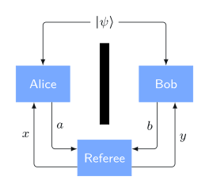

# Основы квантовой информации

Узнайте о квантовых состояниях, проективных измерениях и унитарных операциях; квантовых схемах; о том, как запутанность делает возможной квантовую телепортацию, и многом другом.

<!-- more -->


Добро пожаловать на курс _Основы квантовой информации_ — первый курс из серии _Понимание квантовой информации и вычислений_, в которую входят следующие курсы:

- Основы квантовой информации (этот курс)
- [Основы квантовых алгоритмов](../fundamentals-of-quantum-algorithms/index.md)
- [Общая формулировка квантовой информации](https://quantum.cloud.ibm.com/learning/courses/general-formulation-of-quantum-information)
- [Основы квантовой коррекции ошибок](https://quantum.cloud.ibm.com/learning/courses/foundations-of-quantum-error-correction)

Курс начинается со знакомства с математикой квантовой информации, включая описание квантовой информации как для одиночных, так и для составных систем. Затем рассматриваются квантовые схемы, которые дают стандартный способ описания квантовых вычислений. Наконец, объясняются три фундаментально важных примера, связанные с явлением квантовой запутанности: квантовая телепортация, сверхплотное кодирование и игра CHSH (также известная как неравенство CHSH).

Курс предназначен для студентов, специалистов и энтузиастов в таких областях, как информатика, физика, инженерия и математика, которые хотят познакомиться с теоретическими основами квантовой информации и вычислений.

**Рекомендуемая подготовка**

Чтобы получить от курса максимум пользы, рекомендуется знать основы линейной алгебры, комплексные числа и базовые математические понятия, включая множества и функции. Ниже приведены некоторые из множества источников, где рассматривается этот материал:

- [Khan Academy: линейная алгебра](https://www.khanacademy.org/math/linear-algebra)

    В этой серии видео Сал Хан знакомит с ключевыми понятиями линейной алгебры, на которые мы будем опираться.

- Stephen Friedberg, Arnold Insel, and Lawrence Spence. [Linear Algebra](https://www.pearson.com/en-us/subject-catalog/p/linear-algebra/P200000006185/9780137515424)

    Эта книга по линейной алгебре охватывает необходимый нам материал, а также содержит приложения о множествах, функциях и комплексных числах.

- Sheldon Axler. [Linear Algebra Done Right](https://link.springer.com/book/10.1007/978-3-319-11080-6)

    Классический учебник по линейной алгебре, подходящий для читателей уровня старших курсов бакалавриата и выше.

- Ricky Shadrach and Rod Pierce. [Введение в множества](https://www.mathsisfun.com/sets/sets-introduction.html)

    Вводная веб-страница о множествах, которая поможет некоторым читателям быстро освоить необходимые основы.

- John K. Hunter. [Введение в вещественный анализ: глава 1](https://www.math.ucdavis.edu/~hunter/intro_analysis_pdf/ch1.pdf)

    Первая глава этих лекционных заметок содержит более формальное и подробное введение в множества и функции.

**Экзамен**

Чтобы получить значок за курс «Основы квантовой информации», сдайте экзамен в IBM&reg; Training. Экзамен рассчитан на прохождение после изучения уроков этого курса. После успешной сдачи Credly уведомит вас о получении значка.

[Экзамен](https://quantum.cloud.ibm.com/learning/courses/basics-of-quantum-information/exam)

**Выдаваемый значок**


<small>Источник: <https://quantum.cloud.ibm.com/learning/en/courses/basics-of-quantum-information></small>

## Одиночные системы

В следующем видео Джон Уотрус последовательно разбирает материал этого урока об одиночных системах. Также вы можете открыть [видео на YouTube](https://youtu.be/3-c4xJa7Flk?list=PLOFEBzvs-VvqKKMXX4vbi4EB1uaErFMSO) для этого урока в отдельном окне. [Скачать слайды](https://ibm.box.com/public/static/95va6f5vqru3mpsv9p5ivwcyxino4rk7.pdf) к этому уроку.

<iframe width="560" height="315" src="https://www.youtube.com/embed/3-c4xJa7Flk?si=KucKfdDxEVYv3dQ5" title="YouTube video player" frameborder="0" allow="accelerometer; autoplay; clipboard-write; encrypted-media; gyroscope; picture-in-picture; web-share" referrerpolicy="strict-origin-when-cross-origin" allowfullscreen></iframe>

Этот урок вводит базовый аппарат <abbr title="Квантовая информация — это одновременно понятие и аппарат для моделирования и описания информации в квантовых системах. Хотя она основана на квантовой физике и мотивирована ею, от физических деталей во многом можно абстрагироваться, оставив математический аппарат, применимый к множеству конкретных физических систем.">квантовой информации</abbr>: описание квантовых состояний как векторов с комплексными элементами, измерения, позволяющие извлекать классическую информацию из квантовых состояний, и операции над квантовыми состояниями, описываемые унитарными матрицами.

В этом уроке мы ограничимся сравнительно простой ситуацией, где _одиночная система_ рассматривается изолированно. В следующем уроке мы расширим взгляд до _нескольких систем,_ которые могут взаимодействовать друг с другом и быть скоррелированы.

### Классическая информация

Чтобы описать квантовую информацию и то, как она работает, мы начнём с обзора <abbr title="Термин «классический» относится к понятиям, идеям и описаниям, основанным на физических теориях (например, ньютоновской физике), которые появились до открытия квантовой теории. В контексте информации его можно понимать как «не связанный специально с квантовой информацией».">классической</abbr> информации. Естественно задаться вопросом, почему в курсе по квантовой информации столько внимания уделяется классической информации, но для этого есть веские причины.

Во-первых, хотя квантовая и классическая информация в некоторых отношениях разительно отличаются, их математические описания на самом деле довольно похожи. Классическая информация также служит привычной точкой отсчёта при изучении квантовой информации и источником аналогий, которые оказываются удивительно полезными. Часто люди задают вопросы о квантовой информации, у которых есть естественные классические аналоги, и нередко у таких вопросов есть простые ответы, помогающие прояснить исходные вопросы о квантовой информации и лучше их понять. Действительно, вполне разумно утверждать, что нельзя по-настоящему понять квантовую информацию, не понимая классическую.

Некоторые читатели, возможно, уже знакомы с материалом, который будет обсуждаться в этом разделе, а некоторые — нет, но изложение рассчитано на обе группы. Помимо выделения тех аспектов классической информации, которые наиболее важны для введения в квантовую информацию, этот раздел вводит _нотацию Дирака_, часто используемую для описания векторов и матриц в квантовой информации и вычислениях. Как оказывается, нотация Дирака не является специфичной для квантовой информации; её с тем же успехом можно использовать в контексте классической информации, а также во многих других ситуациях, где возникают векторы и матрицы.

#### Классические состояния и вероятностные векторы

Предположим, что у нас есть <abbr title="В этом курсе система — это абстракция физического устройства или среды, хранящей информацию.">система</abbr>, которая хранит информацию. Точнее, будем предполагать, что в каждый момент эта система может находиться в одном из конечного числа _классических состояний_. Здесь термин _классическое состояние_ следует понимать интуитивно: как конфигурацию, которую можно однозначно распознать и описать.

Архетипический пример, к которому мы будем неоднократно возвращаться, — это _бит_, то есть система, классическими состояниями которой являются $0$ и $1$. Другие примеры включают обычный шестигранный кубик, чьи классические состояния — это $1$, $2$, $3$, $4$, $5$ и $6$ (представленные соответствующим числом точек на верхней грани); нуклеобазу в цепочке ДНК, классические состояния которой — _A_, _C_, _G_ и _T;_ а также переключатель электрического вентилятора, чьи классические состояния обычно — _high_, _medium_, _low_ и _off_. В математическом смысле задание классических состояний системы фактически является отправной точкой: мы _определяем_ бит как систему, имеющую классические состояния $0$ и $1$, и аналогично поступаем с системами, имеющими другие множества классических состояний.

Для этого обсуждения обозначим рассматриваемую систему через $\mathsf{X}$, а символ $\Sigma$ будем использовать для множества классических состояний $\mathsf{X}$. Помимо уже упомянутого предположения, что $\Sigma$ конечно, естественно предположить, что $\Sigma$ _непусто_, ведь бессмысленно говорить о физической системе, у которой вообще нет состояний. И хотя имеет смысл рассматривать физические системы с _бесконечным_ числом классических состояний, мы оставим эту возможность в стороне: она, безусловно, интересна, но не существенна для этого курса. По этим причинам, а также для удобства и краткости, далее под _множеством классических состояний_ мы будем понимать любое конечное и непустое множество.

Вот несколько примеров:

1.  Если $\mathsf{X}$ — бит, то $\Sigma = \{0,1\}$. Такое множество называют _двоичным алфавитом_.
2.  Если $\mathsf{X}$ — шестигранный кубик, то $\Sigma = \{1,2,3,4,5,6\}$.
3.  Если $\mathsf{X}$ — переключатель электрического вентилятора, то $\Sigma = \{\mathrm{high}, \mathrm{medium}, \mathrm{low}, \mathrm{off}\}$.

Если думать о $\mathsf{X}$ как о носителе информации, различным классическим состояниям $\mathsf{X}$ можно приписать определённые смыслы, приводящие к разным результатам или последствиям. В таких случаях может быть достаточно описать $\mathsf{X}$ как систему, просто находящуюся в одном из своих возможных классических состояний. Например, если $\mathsf{X}$ — переключатель вентилятора, мы можем точно знать, что он установлен в положение _high,_ и это может побудить нас переключить его в положение _medium._

Однако при обработке информации наши знания часто неопределённы. Один из способов представить наши знания о классическом состоянии системы $\mathsf{X}$ — сопоставить её различным возможным классическим состояниям _вероятности_, получив то, что мы будем называть _вероятностным состоянием_.

Например, предположим, что $\mathsf{X}$ — бит. На основании того, что мы знаем или предполагаем о прошлом $\mathsf{X}$, мы можем считать, что $\mathsf{X}$ находится в классическом состоянии $0$ с вероятностью $3/4$ и в состоянии $1$ с вероятностью $1/4$. Эти представления можно записать так:

$$
\operatorname{Pr}(\mathsf{X}=0) = \frac{3}{4}
\quad\text{и}\quad
\operatorname{Pr}(\mathsf{X}=1) = \frac{1}{4}.
$$

Более краткий способ представить это вероятностное состояние — использовать вектор-столбец.

$$
\begin{pmatrix}
  \frac{3}{4}\\[2mm]
  \frac{1}{4}
\end{pmatrix}
$$

Вероятность того, что бит равен $0$, помещается в верхнюю часть вектора, а вероятность того, что бит равен $1$, — в нижнюю, потому что именно так обычно упорядочивают множество $\{0,1\}$.

В общем случае вероятностное состояние системы с любым множеством классических состояний можно представить тем же способом — как вектор вероятностей. Вероятности можно упорядочить любым выбранным нами образом, но обычно существует естественный или принятый по умолчанию порядок. Точнее, любое вероятностное состояние можно представить вектором-столбцом, удовлетворяющим двум свойствам:

1.  Все элементы вектора являются _неотрицательными действительными числами_.
2.  Сумма элементов равна $1$.

И наоборот, любой вектор-столбец, удовлетворяющий этим двум свойствам, можно рассматривать как представление вероятностного состояния. Далее мы будем называть векторы такого вида _вероятностными векторами_.

Помимо краткости этой записи, отождествление вероятностных состояний с векторами-столбцами удобно тем, что операции над вероятностными состояниями представляются умножением матрицы на вектор, о чём вскоре пойдёт речь.

#### Измерение вероятностных состояний

Теперь рассмотрим, что происходит, если _измерить_ систему, находящуюся в вероятностном состоянии. В этом контексте измерить систему означает просто посмотреть на неё и без неоднозначности распознать её классическое состояние. Интуитивно говоря, мы не можем «увидеть» вероятностное состояние системы; когда мы смотрим на систему, мы видим одно из её возможных классических состояний.

Измеряя систему, мы также можем изменить наши знания о ней, а значит, может измениться и вероятностное состояние, которое мы с ней связываем. То есть если мы распознаём, что $\mathsf{X}$ находится в классическом состоянии $a\in\Sigma$, то новый вероятностный вектор, представляющий наши знания о состоянии $\mathsf{X}$, становится вектором, у которого в элементе, соответствующем $a$, стоит $1$, а во всех остальных элементах — $0$. Этот вектор показывает, что $\mathsf{X}$ с уверенностью находится в классическом состоянии $a$, что мы знаем, только что его распознав. Мы обозначаем этот вектор через $\vert a\rangle$, что читается как «кет $a$» по причине, которая вскоре будет объяснена. Векторы такого типа также называются векторами _стандартного базиса_.

Например, если рассматриваемая система — бит, то векторы стандартного базиса имеют вид

$$
  \vert 0\rangle = \begin{pmatrix}1\\[1mm] 0\end{pmatrix}
  \quad\text{и}\quad
  \vert 1\rangle = \begin{pmatrix}0\\[1mm] 1\end{pmatrix}.
$$

Заметьте, что любой двумерный вектор-столбец можно выразить как линейную комбинацию этих двух векторов. Например,

$$
\begin{pmatrix}
  \frac{3}{4}\\[2mm]
  \frac{1}{4}
\end{pmatrix}
:= \frac{3}{4}\,\vert 0\rangle + \frac{1}{4}\,\vert 1\rangle.
$$

Этот факт естественно обобщается на любое множество классических состояний: любой вектор-столбец можно записать как линейную комбинацию состояний стандартного базиса. Именно так мы очень часто и выражаем векторы.

Возвращаясь к изменению вероятностного состояния при измерении, отметим связь с повседневным опытом. Предположим, мы подбрасываем честную монету, но закрываем её, прежде чем посмотреть на результат. Тогда мы сказали бы, что её вероятностное состояние равно

$$
\begin{pmatrix}
  \frac{1}{2}\\[2mm]
  \frac{1}{2}
\end{pmatrix}
:= \frac{1}{2}\,\vert\text{орёл}\rangle + \frac{1}{2}\,\vert\text{решка}\rangle.
$$

Здесь множество классических состояний нашей монеты — $\{\text{орёл},\text{решка}\}$. Упорядочим эти состояния так: сначала орёл, затем решка.

$$
\vert\text{орёл}\rangle = \begin{pmatrix}1\\[1mm] 0\end{pmatrix}
\quad\text{и}\quad
\vert\text{решка}\rangle = \begin{pmatrix}0\\[1mm] 1\end{pmatrix}
$$

Если бы мы открыли монету и посмотрели на неё, мы увидели бы одно из двух классических состояний: орёл или решка. Предположим, что результат оказался решкой. Тогда мы естественным образом обновили бы описание вероятностного состояния монеты так, чтобы оно стало $|\text{решка}\rangle$. Конечно, если бы затем мы снова закрыли монету, а потом открыли её и посмотрели ещё раз, классическое состояние всё ещё было бы решкой, что согласуется с описанием вероятностного состояния вектором $|\text{решка}\rangle$.

Это может показаться тривиальным, и в некотором смысле так и есть. Однако квантовые системы ведут себя совершенно аналогичным образом, хотя их свойства измерения часто считают странными или необычными. Установив аналогичные свойства классических систем, можно сделать работу квантовой информации менее необычной на вид.

Последнее замечание об измерениях вероятностных состояний таково: вероятностные состояния описывают знание или убеждение, не обязательно нечто фактическое, а измерение всего лишь меняет наши знания, а не саму систему. Например, состояние монеты после подбрасывания, но до того, как мы посмотрели, — либо орёл, либо решка; мы просто не знаем, что именно, пока не посмотрим. Увидев, скажем, что классическое состояние — решка, мы естественным образом обновили бы вектор, описывающий наши знания, до $|\text{решка}\rangle$, но для другого человека, который не видел монету, когда её открывали, вероятностное состояние осталось бы неизменным. В этом нет причины для беспокойства: разные люди могут обладать разными знаниями или убеждениями о конкретной системе и потому описывать эту систему разными вероятностными векторами.

#### Классические операции

В последней части этого краткого обзора классической информации мы рассмотрим виды операций, которые можно выполнять над классической системой.

##### Детерминированные операции

Во-первых, существуют <abbr title="Операция является детерминированной, если результат полностью определяется входом без какого-либо элемента случайности или неопределённости.">детерминированные</abbr> операции, в которых каждое классическое состояние $a\in\Sigma$ преобразуется в $f(a)$ для некоторой функции $f$ вида $f:\Sigma\rightarrow\Sigma$.

Например, если $\Sigma = \{0,1\}$, существуют четыре функции такого вида: $f_1$, $f_2$, $f_3$ и $f_4$. Их можно представить таблицами значений следующим образом:

$$
\begin{array}{c|c}
  a & f_1(a)\\
  \hline
  0 & 0\\
  1 & 0
\end{array}
\qquad
\begin{array}{c|c}
  a & f_2(a)\\
  \hline
  0 & 0\\
  1 & 1
\end{array}
\qquad
\begin{array}{c|c}
  a & f_3(a)\\
  \hline
  0 & 1\\
  1 & 0
\end{array}
\qquad
\begin{array}{c|c}
  a & f_4(a)\\
  \hline
  0 & 1\\
  1 & 1
\end{array}
$$

Первая и последняя из этих функций являются _постоянными:_ $f_1(a) = 0$ и $f_4(a) = 1$ для каждого $a\in\Sigma$. Две средние функции не являются постоянными, они _сбалансированы_: каждое из двух выходных значений встречается одинаковое число раз (в данном случае по одному разу), когда мы перебираем возможные входы. Функция $f_2$ — это <abbr title="Тождественная функция возвращает свой вход без изменений.">тождественная функция</abbr>: $f_2(a) = a$ для каждого $a\in\Sigma$. А $f_3$ — это функция $f_3(0) = 1$ и $f_3(1) = 0$, более известная как функция NOT.

Действие детерминированных операций на вероятностные состояния можно представить умножением матрицы на вектор. В частности, матрица $M$, представляющая заданную функцию $f:\Sigma\rightarrow\Sigma$, — это матрица, удовлетворяющая условию

$$
M \vert a \rangle = \vert f(a)\rangle
$$

для каждого $a\in\Sigma$. Такая матрица всегда существует и однозначно определяется этим требованием. Матрицы, представляющие детерминированные операции, всегда имеют ровно одну $1$ в каждом столбце и $0$ во всех остальных элементах.

Например, матрицы $M_1,\ldots,M_4$, соответствующие приведённым выше функциям $f_1,\ldots,f_4$, имеют вид:

$$
  M_1 =
  \begin{pmatrix}
    1 & 1\\
    0 & 0
  \end{pmatrix},
  \hspace{4mm}
  M_2 =
  \begin{pmatrix}
    1 & 0\\
    0 & 1
  \end{pmatrix},
  \hspace{4mm}
  M_3 =
  \begin{pmatrix}
    0 & 1\\
    1 & 0
  \end{pmatrix},
  \hspace{4mm}
  M_4 =
  \begin{pmatrix}
    0 & 0\\
    1 & 1
  \end{pmatrix}.
$$

Вот быстрая проверка, показывающая, что первая матрица задана правильно. Остальные три можно проверить аналогично.

$$
\begin{aligned}
M_1 \vert 0\rangle
& =
\begin{pmatrix}
  1 & 1\\
  0 & 0
\end{pmatrix}
\begin{pmatrix}
  1\\
  0
\end{pmatrix}
:= \begin{pmatrix}
  1\\
  0
\end{pmatrix}
:= \vert 0\rangle = \vert f_1(0)\rangle \\[4mm]
M_1 \vert 1\rangle
& =
\begin{pmatrix}
  1 & 1\\
  0 & 0
\end{pmatrix}
\begin{pmatrix}
  0\\
  1
\end{pmatrix}
:= \begin{pmatrix}
  1\\
  0
\end{pmatrix}
:= \vert 0\rangle = \vert f_1(1)\rangle
\end{aligned}
$$

Удобный способ представлять матрицы такого и других видов использует обозначение для векторов-строк, аналогичное уже обсуждённому обозначению для векторов-столбцов: для каждого $a\in\Sigma$ через $\langle a \vert$ мы обозначаем _вектор-строку_, у которого в элементе, соответствующем $a$, стоит $1$, а во всех остальных элементах — нули. Этот вектор читается как «бра $a$».

Например, если $\Sigma = \{0,1\}$, то

$$
  \langle 0 \vert = \begin{pmatrix}
    1 & 0
  \end{pmatrix}
  \quad\text{и}\quad
  \langle 1 \vert = \begin{pmatrix}
    0 & 1
  \end{pmatrix}.
$$

Для любого множества классических состояний $\Sigma$ мы можем рассматривать векторы-строки и векторы-столбцы как матрицы и выполнять матричное умножение $\vert b\rangle \langle a\vert$. В результате получается квадратная матрица с $1$ в элементе, соответствующем паре $(b,a)$, то есть строка этого элемента соответствует классическому состоянию $b$, а столбец — классическому состоянию $a$; все остальные элементы равны $0$. Например,

$$
  \vert 0 \rangle \langle 1 \vert =
  \begin{pmatrix}
  1\\
  0
  \end{pmatrix}
  \begin{pmatrix}
  0 & 1
  \end{pmatrix} =
  \begin{pmatrix}
    0 & 1 \\
    0 & 0
  \end{pmatrix}.
$$

Используя эту нотацию, матрицу $M$, соответствующую любой заданной функции $f:\Sigma\rightarrow\Sigma$, можно выразить как

$$
  M = \sum_{a\in\Sigma} \vert f(a) \rangle \langle a \vert.
$$

Например, рассмотрим приведённую выше функцию $f_4$, для которой $\Sigma = \{0,1\}$. Получаем матрицу

$$
M_4 = \vert f_4(0) \rangle \langle 0 \vert + \vert f_4(1) \rangle \langle 1 \vert
:= \vert 1\rangle \langle 0\vert + \vert 1\rangle \langle 1\vert
:= \begin{pmatrix}
0 & 0\\
1 & 0
\end{pmatrix} +
\begin{pmatrix}
0 & 0\\
0 & 1
\end{pmatrix}
:= \begin{pmatrix}
0 & 0\\
1 & 1
\end{pmatrix}.
$$

Причина, по которой это работает, такова. Если снова думать о векторах как о матрицах и на этот раз рассмотреть произведение $\langle a \vert \vert b \rangle$, мы получим матрицу размера $1\times 1$, которую можно рассматривать как скаляр, то есть число. Для краткости мы записываем это произведение как $\langle a \vert b\rangle$, а не как $\langle a \vert \vert b \rangle$. Оно удовлетворяет простой формуле:

$$
  \langle a \vert b \rangle
  = \begin{cases}
    1 & a = b\\[1mm]
    0 & a \neq b.
  \end{cases}
$$

Используя это наблюдение, а также тот факт, что умножение матриц ассоциативно и линейно, получаем

$$
  M \vert b \rangle =
  \Biggl(
  \sum_{a\in\Sigma} \vert f(a) \rangle \langle a \vert
  \Biggr)
  \vert b\rangle
  = \sum_{a\in\Sigma} \vert f(a) \rangle \langle a \vert b \rangle
  = \vert f(b)\rangle,
$$

для каждого $b\in\Sigma$, что в точности и требуется от матрицы $M$.

Как мы подробнее обсудим позже в одном из следующих уроков, $\langle a \vert b \rangle$ также можно рассматривать как _скалярное произведение_ между векторами $\vert a\rangle$ и $\vert b\rangle$. Скалярные произведения чрезвычайно важны в квантовой информации, но мы отложим их обсуждение до того момента, когда они понадобятся.

Теперь происхождение названий «бра» и «кет» может быть очевидным: если соединить «бра» $\langle a\vert$ с «кетом» $\vert b\rangle$, получается «бра-кет» $\langle a \vert b\rangle$. Эта нотация и терминология принадлежат <abbr title="Поль Дирак был физиком, внёсшим ключевой вклад в развитие квантовой физики.">Полю Дираку</abbr>; по этой причине она известна как _нотация Дирака_.

##### Вероятностные операции и стохастические матрицы

Помимо детерминированных операций, существуют _вероятностные операции_.

Например, рассмотрим следующую операцию над битом. Если классическое состояние бита равно $0$, оно остаётся без изменений; а если классическое состояние бита равно $1$, бит «переворачивается» так, что становится $0$ с вероятностью $1/2$ и $1$ с вероятностью $1/2$. Эта операция представляется матрицей

$$
  \begin{pmatrix}
    1 & \frac{1}{2}\\[1mm]
    0 & \frac{1}{2}
  \end{pmatrix}.
$$

Можно проверить, что эта матрица делает именно то, что нужно, умножив на неё два вектора стандартного базиса.

Для произвольного выбора множества классических состояний множество всех вероятностных операций можно описать математически как операции, представляемые <abbr title="Слово «стохастический» приблизительно означает «случайный». Стохастическая матрица представляет случайный процесс.">стохастическими</abbr> матрицами, то есть матрицами, удовлетворяющими двум свойствам:

1.  Все элементы являются неотрицательными действительными числами.
2.  Сумма элементов в каждом столбце равна $1$.

Иными словами, стохастические матрицы — это матрицы, все столбцы которых являются вероятностными векторами.

На интуитивном уровне вероятностные операции можно понимать как операции, в которых во время выполнения каким-то образом используется или вводится случайность, как в примере выше. В описании вероятностной операции с помощью стохастической матрицы каждый столбец можно рассматривать как векторное представление вероятностного состояния, которое возникает при том классическом входном состоянии, которому соответствует этот столбец.

Стохастические матрицы также можно понимать как ровно те матрицы, которые всегда отображают вероятностные векторы в вероятностные векторы. То есть стохастические матрицы всегда переводят вероятностные векторы в вероятностные векторы, и любая матрица, которая всегда переводит вероятностные векторы в вероятностные векторы, обязана быть стохастической.

Наконец, вероятностные операции можно понимать иначе: как случайный выбор _среди_ детерминированных операций. Например, операцию из приведённого выше примера можно рассматривать как применение либо тождественной функции, либо постоянной функции 0, каждая с вероятностью $1/2$. Это согласуется с равенством

$$
  \begin{pmatrix}
    1 & \frac{1}{2}\\[1mm]
    0 & \frac{1}{2}
  \end{pmatrix}
  = \frac{1}{2}
  \begin{pmatrix}
    1 & 0\\[1mm]
    0 & 1
  \end{pmatrix}
  + \frac{1}{2}
  \begin{pmatrix}
    1 & 1\\[1mm]
    0 & 0
  \end{pmatrix}.
$$

Такое представление всегда возможно для произвольного множества классических состояний и любой стохастической матрицы, строки и столбцы которой отождествлены с этим множеством классических состояний.

##### Композиции вероятностных операций

Предположим, что $\mathsf{X}$ — система с множеством классических состояний $\Sigma$, а $M_1,\ldots,M_n$ — стохастические матрицы, представляющие вероятностные операции над системой $\mathsf{X}$.

Если первая операция $M_1$ применяется к вероятностному состоянию, представленному вероятностным вектором $u$, то результирующее вероятностное состояние представляется вектором $M_1 u$. Если затем применить вторую вероятностную операцию $M_2$ к этому новому вероятностному вектору, мы получим вероятностный вектор

$$
  M_2 (M_1 u) = (M_2 M_1) u.
$$

Это равенство следует из того, что умножение матриц (включая умножение матрицы на вектор как частный случай) является <abbr title="Операция является ассоциативной, если можно менять положение скобок и получать тот же результат.">ассоциативной</abbr> операцией. Следовательно, вероятностная операция, полученная <abbr title="Композиция означает применение одной функции или операции после другой.">композицией</abbr> первой и второй вероятностных операций, где сначала применяется $M_1$, а затем $M_2$, представляется матрицей $M_2 M_1$, которая обязательно является стохастической.

В более общем случае композиция вероятностных операций, представленных матрицами $M_1,\ldots,M_n$ в указанном порядке, то есть когда сначала применяется $M_1$, затем $M_2$ и так далее, а $M_n$ применяется последней, представляется матричным произведением

$$
  M_n \,\cdots\, M_1.
$$

Обратите внимание, что порядок здесь важен: хотя умножение матриц ассоциативно, оно не является <abbr title="Операция является коммутативной, если перестановка порядка входов не меняет результат.">коммутативной</abbr> операцией. Например, если

$$
  M_1 =
  \begin{pmatrix}
    1 & 1\\[1mm]
    0 & 0
  \end{pmatrix}
  \quad\text{и}\quad
  M_2 =
  \begin{pmatrix}
    0 & 1\\[1mm]
    1 & 0
  \end{pmatrix},
$$

то

$$
  M_2 M_1 =
  \begin{pmatrix}
    0 & 0 \\[1mm]
    1 & 1
  \end{pmatrix}
  \quad\text{и}\quad
  M_1 M_2 =
  \begin{pmatrix}
    1 & 1\\[1mm]
    0 & 0
  \end{pmatrix}.
$$

То есть порядок композиции вероятностных операций имеет значение: изменение порядка, в котором операции применяются в композиции, может изменить результирующую операцию.

### Квантовая информация

Теперь мы готовы перейти к квантовой информации, где выбирается другой тип вектора, представляющего состояние рассматриваемой системы — в этом случае _квантовое состояние_. Как и в предыдущем обсуждении классической информации, нас будут интересовать системы с конечными и непустыми множествами классических состояний, и мы будем использовать большую часть той же нотации.

#### Векторы квантовых состояний

_Квантовое состояние_ системы представляется вектором-столбцом, подобно вероятностному состоянию. Как и раньше, индексы вектора обозначают классические состояния системы. Векторы, представляющие квантовые состояния, характеризуются двумя свойствами:

1.  Компоненты вектора квантового состояния являются _комплексными числами_.
2.  Сумма _квадратов абсолютных значений_ компонент вектора квантового состояния равна $1$.

Таким образом, в отличие от вероятностных состояний, векторы, представляющие квантовые состояния, не обязаны иметь неотрицательные вещественные компоненты, а равной $1$ должна быть сумма квадратов абсолютных значений компонент (а не сумма самих компонент). Какими бы простыми ни были эти изменения, именно они порождают различия между квантовой и классической информацией; любое ускорение квантового компьютера или улучшение квантового протокола связи в конечном счете происходит из этих простых математических изменений.

_Евклидова норма_ вектора-столбца

$$
  v = \begin{pmatrix}
    \alpha_1\\
    \vdots\\
    \alpha_n
  \end{pmatrix}
$$

обозначается и определяется следующим образом:

$$
  \| v \| = \sqrt{\sum_{k=1}^n |\alpha_k|^2}.
$$

Следовательно, условие, что сумма квадратов абсолютных значений компонент вектора квантового состояния равна $1$, эквивалентно тому, что этот вектор имеет евклидову норму, равную $1$. Иными словами, векторы квантовых состояний — это _единичные векторы_ относительно евклидовой нормы.

##### Примеры состояний кубита

Термин _кубит_ относится к квантовой системе, множество классических состояний которой равно $\{0,1\}$. То есть кубит — это по сути просто бит, но, используя это название, мы явно подчеркиваем, что этот бит может находиться в квантовом состоянии.

Вот примеры квантовых состояний кубита:

$$
  \begin{pmatrix}
    1\\[2mm]
    0
  \end{pmatrix}
  = \vert 0\rangle
  \quad\text{и}\quad
  \begin{pmatrix}
    0\\[2mm]
    1
  \end{pmatrix}
  = \vert 1\rangle,
$$

$$
  \begin{pmatrix}
    \frac{1}{\sqrt{2}}\\[2mm]
    \frac{1}{\sqrt{2}}
  \end{pmatrix}
  = \frac{1}{\sqrt{2}}\,\vert 0\rangle + \frac{1}{\sqrt{2}}\,\vert 1\rangle,
  \tag{1}
$$

и

$$
  \begin{pmatrix}
    \frac{1+2i}{3}\\[2mm]
    -\frac{2}{3}
  \end{pmatrix}
  = \frac{1+2i}{3}\,\vert 0\rangle - \frac{2}{3}\,\vert 1\rangle.
$$

Первые два примера, $\vert 0\rangle$ и $\vert 1\rangle$, показывают, что элементы стандартного базиса являются допустимыми векторами квантовых состояний: их компоненты — комплексные числа, у которых мнимая часть просто равна $0$, а вычисление суммы квадратов абсолютных значений компонент дает

$$
  \vert 1\vert^2 + \vert 0\vert^2 = 1
  \quad\text{и}\quad
  \vert 0\vert^2 + \vert 1\vert^2 = 1,
$$

как и требуется. Подобно классическому случаю, мы связываем векторы квантовых состояний $\vert 0\rangle$ и $\vert 1\rangle$ с тем, что кубит находится в классическом состоянии $0$ и $1$ соответственно.

Для двух других примеров компоненты также являются комплексными числами, и вычисление суммы квадратов абсолютных значений компонент дает

$$
  \biggl\vert\frac{1}{\sqrt{2}}\biggr\vert^2 +
  \biggl\vert\frac{1}{\sqrt{2}}\biggr\vert^2 = \frac{1}{2} + \frac{1}{2} = 1
$$

и

$$
  \biggl\vert \frac{1+2i}{3} \biggr\vert^2 +
  \biggl\vert -\frac{2}{3} \biggr\vert^2 = \frac{5}{9} + \frac{4}{9} = 1.
$$

Следовательно, это допустимые векторы квантовых состояний. Обратите внимание, что они являются линейными комбинациями стандартных базисных состояний $\vert 0 \rangle$ и $\vert 1 \rangle$, поэтому мы часто говорим, что они являются _суперпозициями_ состояний $0$ и $1$. В контексте квантовых состояний _суперпозиция_ и _линейная комбинация_ по сути являются синонимами.

Пример $(1)$ вектора состояния кубита выше встречается очень часто — он называется _плюс-состоянием_ и обозначается так:

$$
  \vert {+} \rangle = \frac{1}{\sqrt{2}} \vert 0\rangle + \frac{1}{\sqrt{2}} \vert 1\rangle.
$$

Мы также используем обозначение

$$
  \vert {-} \rangle = \frac{1}{\sqrt{2}} \vert 0\rangle - \frac{1}{\sqrt{2}} \vert 1\rangle
$$

для связанного с ним вектора квантового состояния, у которого вторая компонента отрицательна, а не положительна; это состояние называется _минус-состоянием_.

Такая нотация, когда внутри кета появляется некоторый символ, не обозначающий классическое состояние, является обычной: внутри кета можно использовать любое имя для обозначения вектора. Довольно часто для произвольного вектора, который не обязательно является стандартным базисным вектором, используется обозначение $\vert\psi\rangle$ или другое имя вместо $\psi$.

Заметьте: если у нас есть вектор $\vert \psi \rangle$, индексы которого соответствуют некоторому множеству классических состояний $\Sigma$, и если $a\in\Sigma$ — элемент этого множества классических состояний, то матричное произведение $\langle a\vert \vert \psi\rangle$ равно той компоненте вектора $\vert \psi \rangle$, индекс которой соответствует $a$. Как и в случае, когда $\vert \psi \rangle$ был стандартным базисным вектором, ради удобочитаемости мы пишем $\langle a \vert \psi \rangle$ вместо $\langle a\vert \vert \psi\rangle$.

Например, если $\Sigma = \{0,1\}$ и

$$
\vert \psi \rangle =
\frac{1+2i}{3} \vert 0\rangle - \frac{2}{3} \vert 1\rangle
= \begin{pmatrix}
    \frac{1+2i}{3}\\[2mm]
    -\frac{2}{3}
  \end{pmatrix},
  \tag{2}
$$

то

$$
  \langle 0 \vert \psi \rangle = \frac{1+2i}{3}
  \quad\text{и}\quad
  \langle 1 \vert \psi \rangle = -\frac{2}{3}.
$$

В общем случае, когда нотация Дирака используется для произвольных векторов, обозначение $\langle \psi \vert$ означает вектор-строку, полученный взятием _эрмитова сопряжения_ вектора-столбца $\vert\psi\rangle$: вектор транспонируется из столбца в строку, а каждая компонента заменяется своим комплексным сопряженным. Например, если $\vert\psi\rangle$ — это вектор, определенный в $(2)$, то

$$
\langle\psi\vert = \frac{1-2i}{3} \langle 0\vert - \frac{2}{3} \langle 1\vert
:= \begin{pmatrix}
    \frac{1-2i}{3} &
    -\frac{2}{3}
  \end{pmatrix}.
$$

Причина, по которой вместе с транспонированием мы берем комплексное сопряжение, станет понятнее позже, когда мы будем обсуждать внутренние произведения.

##### Квантовые состояния других систем

Мы можем рассматривать квантовые состояния систем с произвольными множествами классических состояний. Например, вот вектор квантового состояния для переключателя электрического вентилятора:

$$
  \begin{pmatrix}
    \frac{1}{2}\\[1mm]
    0 \\[1mm]
    -\frac{i}{2}\\[1mm]
    \frac{1}{\sqrt{2}}
  \end{pmatrix}
  = \frac{1}{2} \vert\mathrm{high}\rangle
  - \frac{i}{2} \vert\mathrm{low}\rangle
  + \frac{1}{\sqrt{2}} \vert\mathrm{off}\rangle.
$$

Здесь предполагается, что классические состояния упорядочены как _high_, _medium_, _low_, _off_. Возможно, нет особой причины рассматривать квантовое состояние переключателя электрического вентилятора, но в принципе это возможно.

Вот еще один пример — на этот раз квантовая десятичная цифра, классические состояния которой равны $0, 1, \ldots, 9$:

$$
  \frac{1}{\sqrt{385}}
  \begin{pmatrix}
    1\\
    2\\
    3\\
    4\\
    5\\
    6\\
    7\\
    8\\
    9\\
    10
  \end{pmatrix}
  =
  \frac{1}{\sqrt{385}}\sum_{k = 0}^9 (k+1) \vert k \rangle.
$$

Этот пример показывает удобство записи векторов состояний с помощью нотации Дирака. Для данного конкретного примера представление в виде вектора-столбца лишь громоздко, но если бы классических состояний было значительно больше, оно стало бы непригодным. Нотация Дирака, напротив, позволяет компактно и точно описывать большие и сложные векторы.

Нотация Дирака также позволяет выражать векторы, разные аспекты которых являются _неопределенными_, то есть неизвестными или еще не установленными. Например, для произвольного множества классических состояний $\Sigma$ можно рассмотреть вектор квантового состояния

$$
  \frac{1}{\sqrt{|\Sigma|}} \sum_{a\in\Sigma} \vert a \rangle,
$$

где обозначение $\sqrt{|\Sigma|}$ относится к евклидовой норме $\Sigma$, а $\vert\Sigma\vert$ в данном случае — это просто число элементов в $\Sigma$. На словах это _равномерная суперпозиция_ по классическим состояниям из $\Sigma$.

В последующих уроках мы встретим гораздо более сложные выражения векторов квантовых состояний, для которых использование векторов-столбцов было бы непрактичным или невозможным. Фактически мы почти полностью откажемся от представления векторов состояний в виде столбцов, за исключением векторов с малым числом компонент (часто в примерах), где полезно явно показать и изучить компоненты.

Вот еще одна причина, по которой удобно выражать векторы состояний с помощью нотации Дирака: она избавляет от необходимости явно задавать порядок классических состояний (или, что то же самое, соответствие между классическими состояниями и индексами вектора).

Например, вектор квантового состояния для системы с множеством классических состояний $\{\clubsuit,\diamondsuit,\heartsuit,\spadesuit\}$, такой как

$$
    \frac{1}{2} \vert\clubsuit\rangle
  + \frac{i}{2} \vert\diamondsuit\rangle
  - \frac{1}{2} \vert\heartsuit\rangle
  - \frac{i}{2} \vert\spadesuit\rangle,
$$

однозначно описывается этим выражением, и для понимания выражения на самом деле не нужно выбирать или задавать порядок этого множества классических состояний. В данном случае порядок стандартных карточных мастей задать нетрудно: например, можно выбрать порядок $\clubsuit$, $\diamondsuit$, $\heartsuit$, $\spadesuit$. Если выбрать именно этот порядок, приведенный выше вектор квантового состояния будет представлен вектором-столбцом

$$
\begin{pmatrix}
 \frac{1}{2}\\[2mm]
 \frac{i}{2}\\[2mm]
 -\frac{1}{2}\\[2mm]
 -\frac{i}{2}
\end{pmatrix}.
$$

В общем случае, однако, удобно иметь возможность просто не думать о том, как упорядочены множества классических состояний.

#### Измерение квантовых состояний

Теперь рассмотрим, что происходит, когда квантовое состояние _измеряется_, сосредоточившись на простом типе измерения, известном как _измерение в стандартном базисе_. (Есть и более общие понятия измерения, которые мы обсудим позже.)

Подобно вероятностному случаю, когда система в квантовом состоянии измеряется, гипотетический наблюдатель, выполняющий измерение, увидит не вектор квантового состояния, а некоторое классическое состояние. В этом смысле измерения служат интерфейсом между квантовой и классической информацией, через который из квантовых состояний извлекается классическая информация.

Правило простое: если квантовое состояние измеряется, каждое классическое состояние системы появляется с вероятностью, равной _квадрату абсолютного значения_ компоненты вектора квантового состояния, соответствующей этому классическому состоянию. В квантовой механике это известно как _правило Борна_. Заметьте, что это правило согласуется с требованием, чтобы квадраты абсолютных значений компонент вектора квантового состояния в сумме давали $1$, поскольку из него следует, что вероятности различных классических результатов измерения суммируются к $1$.

Например, измерение плюс-состояния

$$
  \vert {+} \rangle =
  \frac{1}{\sqrt{2}} \vert 0 \rangle
  + \frac{1}{\sqrt{2}} \vert 1 \rangle
$$

дает два возможных результата, $0$ и $1$, со следующими вероятностями.

$$
  \operatorname{Pr}(\text{исход равен 0})
  = \bigl\vert \langle 0 \vert {+} \rangle \bigr\vert^2
  = \biggl\vert \frac{1}{\sqrt{2}} \biggr\vert^2
  = \frac{1}{2}
$$

$$
  \operatorname{Pr}(\text{исход равен 1})
  = \bigl\vert \langle 1 \vert {+} \rangle \bigr\vert^2
  = \biggl\vert \frac{1}{\sqrt{2}} \biggr\vert^2
  = \frac{1}{2}
$$

Интересно, что измерение минус-состояния

$$
  \vert {-} \rangle =
  \frac{1}{\sqrt{2}} \vert 0 \rangle
  - \frac{1}{\sqrt{2}} \vert 1 \rangle
$$

дает ровно те же вероятности для двух результатов.

$$
  \operatorname{Pr}(\text{исход равен 0})
  = \bigl\vert \langle 0 \vert {-} \rangle \bigr\vert^2
  = \biggl\vert \frac{1}{\sqrt{2}} \biggr\vert^2
  = \frac{1}{2}
$$

$$
  \operatorname{Pr}(\text{исход равен 1})
  = \bigl\vert \langle 1 \vert {-} \rangle \bigr\vert^2
  = \biggl\vert -\frac{1}{\sqrt{2}} \biggr\vert^2
  = \frac{1}{2}
$$

Это показывает, что с точки зрения измерений в стандартном базисе плюс- и минус-состояния ничем не отличаются. Зачем же тогда нам вообще различать их? Ответ в том, что эти два состояния ведут себя по-разному, когда над ними выполняются операции, как мы обсудим в следующем подразделе.

Разумеется, измерение квантового состояния $\vert 0\rangle$ с достоверностью дает классическое состояние $0$, и аналогично измерение квантового состояния $\vert 1\rangle$ с достоверностью дает классическое состояние $1$. Это согласуется с предложенным ранее отождествлением этих квантовых состояний с тем, что система _находится_ в соответствующем классическом состоянии.

В качестве последнего примера измерение состояния

$$
  \vert \psi \rangle = \frac{1+2i}{3} \vert 0\rangle - \frac{2}{3} \vert 1\rangle
$$

приводит к появлению двух возможных результатов со следующими вероятностями:

$$
  \operatorname{Pr}(\text{исход равен 0})
  = \bigl\vert \langle 0 \vert \psi \rangle \bigr\vert^2
  = \biggl\vert \frac{1+2i}{3} \biggr\vert^2
  = \frac{5}{9},
$$

и

$$
  \operatorname{Pr}(\text{исход равен 1})
  = \bigl\vert \langle 1 \vert \psi \rangle \bigr\vert^2
  = \biggl\vert -\frac{2}{3} \biggr\vert^2
  = \frac{4}{9}.
$$

#### Унитарные операции

До сих пор может быть не очевидно, почему квантовая информация фундаментально отличается от классической. В самом деле, когда квантовое состояние измеряется, вероятность получить каждое классическое состояние задается квадратом абсолютного значения соответствующей компоненты вектора — так почему бы просто не записать эти вероятности в вероятностный вектор?

Ответ, по крайней мере частично, состоит в том, что множество допустимых _операций_, которые можно выполнять над квантовым состоянием, отличается от случая классической информации. Подобно вероятностному случаю, операции над квантовыми состояниями являются линейными отображениями, но вместо стохастических матриц, как в классическом случае, операции над векторами квантовых состояний представляются _унитарными_ матрицами.

Квадратная матрица $U$ с комплексными компонентами называется _унитарной_, если она удовлетворяет уравнениям

$$
  \begin{aligned}
    U U^{\dagger} &= \mathbb{I} \\
    U^{\dagger} U &= \mathbb{I}.
  \end{aligned}
  \tag{3}
$$

Здесь $\mathbb{I}$ — единичная матрица, а $U^{\dagger}$ — _эрмитово сопряжение_ $U$, то есть матрица, полученная транспонированием $U$ и взятием комплексного сопряжения каждой компоненты.

$$
  U^{\dagger} = \overline{U^T}
$$

Если верно любое из двух равенств, пронумерованных выше как $(3)$, то верно и другое. Оба равенства эквивалентны тому, что $U^{\dagger}$ является обратной матрицей к $U$:

$$
  U^{-1} = U^{\dagger}.
$$

(Предупреждение: если $M$ не квадратная матрица, может случиться, что $M^{\dagger} M = \mathbb{I}$ и $M M^{\dagger} \neq \mathbb{I}$, например. Эквивалентность двух равенств в первом уравнении выше верна только для квадратных матриц.)

Условие унитарности $U$ эквивалентно условию, что умножение на $U$ не изменяет евклидову норму любого вектора. То есть матрица $U$ размера $n\times n$ унитарна тогда и только тогда, когда $\| U \vert \psi \rangle \| = \|\vert \psi \rangle \|$ для любого $n$-мерного вектора-столбца $\vert \psi \rangle$ с комплексными компонентами. Следовательно, поскольку множество всех векторов квантовых состояний совпадает с множеством векторов с евклидовой нормой $1$, умножение унитарной матрицы на вектор квантового состояния дает другой вектор квантового состояния.

На самом деле унитарные матрицы — это ровно множество линейных отображений, которые всегда переводят векторы квантовых состояний в другие векторы квантовых состояний. Обратите внимание на сходство с классическим вероятностным случаем, где операции связаны со стохастическими матрицами — именно теми, которые всегда переводят вероятностные векторы в вероятностные векторы.

##### Примеры унитарных операций над кубитами

Следующий список описывает некоторые часто встречающиеся унитарные операции над кубитами.

1.  _Операции Паули._ Четыре матрицы Паули имеют вид:

    $$
      \mathbb{I} =
      \begin{pmatrix}
        1 & 0\\
        0 & 1
      \end{pmatrix},
      \quad
      \sigma_x =
      \begin{pmatrix}
        0 & 1\\
        1 & 0
      \end{pmatrix},
      \quad
      \sigma_y =
      \begin{pmatrix}
        0 & -i\\
        i & 0
      \end{pmatrix},
      \quad
      \sigma_z =
      \begin{pmatrix}
        1 & 0\\
        0 & -1
      \end{pmatrix}.
    $$

    Распространенное альтернативное обозначение: $X = \sigma_x$, $Y = \sigma_y$ и $Z = \sigma_z$ (но имейте в виду, что буквы $X$, $Y$ и $Z$ также часто используются для других целей). Операция $X$ также называется _переворотом бита_ или _операцией NOT_, потому что она вызывает такое действие на битах:

    $$
      X \vert 0\rangle = \vert 1\rangle
      \quad \text{и} \quad
      X \vert 1\rangle = \vert 0\rangle.
    $$

    Операция $Z$ также называется _переворотом фазы_, и она действует так:

    $$
      Z \vert 0\rangle = \vert 0\rangle
      \quad \text{и} \quad
      Z \vert 1\rangle = - \vert 1\rangle.
    $$

2.  _Операция Адамара_. Операция Адамара описывается этой матрицей:

    $$
      H = \begin{pmatrix}
        \frac{1}{\sqrt{2}} & \frac{1}{\sqrt{2}} \\[2mm]
        \frac{1}{\sqrt{2}} & -\frac{1}{\sqrt{2}}
      \end{pmatrix}.
    $$

3.  _Фазовые операции._ Фазовая операция описывается матрицей

    $$
      P_{\theta} =
      \begin{pmatrix}
        1 & 0\\
        0 & e^{i\theta}
      \end{pmatrix}
    $$

    для любого выбора вещественного числа $\theta$. Операции

    $$
      S = P_{\pi/2} =
      \begin{pmatrix}
        1 & 0\\
        0 & i
      \end{pmatrix}
      \quad \text{и} \quad
      T = P_{\pi/4} =
      \begin{pmatrix}
        1 & 0\\
        0 & \frac{1 + i}{\sqrt{2}}
      \end{pmatrix}
    $$

    являются особенно важными примерами. Другие примеры включают $\mathbb{I} = P_0$ и $Z = P_{\pi}$.

Все только что определенные матрицы унитарны и поэтому представляют квантовые операции над одним кубитом. Например, вот вычисление, проверяющее, что $H$ унитарна:

$$
\begin{pmatrix}
  \frac{1}{\sqrt{2}} & \frac{1}{\sqrt{2}} \\[2mm]
  \frac{1}{\sqrt{2}} & -\frac{1}{\sqrt{2}}
\end{pmatrix}^{\dagger}
\begin{pmatrix}
  \frac{1}{\sqrt{2}} & \frac{1}{\sqrt{2}} \\[2mm]
  \frac{1}{\sqrt{2}} & -\frac{1}{\sqrt{2}}
\end{pmatrix}
:= \begin{pmatrix}
  \frac{1}{\sqrt{2}} & \frac{1}{\sqrt{2}} \\[2mm]
  \frac{1}{\sqrt{2}} & -\frac{1}{\sqrt{2}}
\end{pmatrix}
\begin{pmatrix}
  \frac{1}{\sqrt{2}} & \frac{1}{\sqrt{2}} \\[2mm]
  \frac{1}{\sqrt{2}} & -\frac{1}{\sqrt{2}}
\end{pmatrix}
:= \begin{pmatrix}
  \frac{1}{2} + \frac{1}{2} & \frac{1}{2} - \frac{1}{2}\\[2mm]
  \frac{1}{2} - \frac{1}{2} & \frac{1}{2} + \frac{1}{2}
\end{pmatrix}
:= \begin{pmatrix}
  1 & 0\\
  0 & 1
\end{pmatrix}.
$$

А вот действие операции Адамара на несколько часто встречающихся векторов состояний кубита.

$$
\begin{aligned}
  H \vert 0 \rangle & =
  \begin{pmatrix}
    \frac{1}{\sqrt{2}} & \frac{1}{\sqrt{2}} \\[2mm]
    \frac{1}{\sqrt{2}} & -\frac{1}{\sqrt{2}}
  \end{pmatrix}
  \begin{pmatrix}
    1\\[2mm]
    0
  \end{pmatrix}
  = \begin{pmatrix}
    \frac{1}{\sqrt{2}}\\[2mm]
    \frac{1}{\sqrt{2}}
  \end{pmatrix}
  = \vert + \rangle\\[6mm]
  H \vert 1 \rangle
  & =
  \begin{pmatrix}
    \frac{1}{\sqrt{2}} & \frac{1}{\sqrt{2}} \\[2mm]
    \frac{1}{\sqrt{2}} & -\frac{1}{\sqrt{2}}
  \end{pmatrix}
  \begin{pmatrix}
    0\\[2mm]
    1
  \end{pmatrix}
  = \begin{pmatrix}
    \frac{1}{\sqrt{2}}\\[2mm]
    -\frac{1}{\sqrt{2}}
  \end{pmatrix}
  = \vert - \rangle\\[6mm]
  H \vert + \rangle
  & =
  \begin{pmatrix}
    \frac{1}{\sqrt{2}} & \frac{1}{\sqrt{2}} \\[2mm]
    \frac{1}{\sqrt{2}} & -\frac{1}{\sqrt{2}}
  \end{pmatrix}
  \begin{pmatrix}
    \frac{1}{\sqrt{2}}\\[2mm]
    \frac{1}{\sqrt{2}}
  \end{pmatrix}
  = \begin{pmatrix}
    1\\[2mm]
    0
  \end{pmatrix}
  = \vert 0 \rangle\\[6mm]
  H \vert - \rangle
  & =
  \begin{pmatrix}
    \frac{1}{\sqrt{2}} & \frac{1}{\sqrt{2}} \\[2mm]
    \frac{1}{\sqrt{2}} & -\frac{1}{\sqrt{2}}
  \end{pmatrix}
  \begin{pmatrix}
    \frac{1}{\sqrt{2}}\\[2mm]
    -\frac{1}{\sqrt{2}}
  \end{pmatrix}
  = \begin{pmatrix}
    0\\[2mm]
    1
  \end{pmatrix}
  = \vert 1 \rangle
\end{aligned}
$$

Более кратко получаем четыре уравнения.

$$
  \begin{aligned}
    H \vert 0 \rangle = \vert {+} \rangle & \qquad H \vert {+} \rangle = \vert 0 \rangle \\[1mm]
    H \vert 1 \rangle = \vert {-} \rangle & \qquad H \vert {-} \rangle = \vert 1 \rangle
  \end{aligned}
$$

Стоит остановиться и осмыслить тот факт, что $H\vert {+} \rangle = \vert 0\rangle$ и $H\vert {-} \rangle = \vert 1\rangle$, в свете вопроса из предыдущего раздела о различии между состояниями $\vert {+} \rangle$ и $\vert {-} \rangle$.

Представьте ситуацию, в которой кубит подготовлен в одном из двух квантовых состояний $\vert {+} \rangle$ и $\vert {-} \rangle$, но нам неизвестно, в каком именно. Измерение любого из этих состояний дает то же распределение результатов, что и измерение другого, как мы уже наблюдали: $0$ и $1$ появляются с одинаковой вероятностью $1/2$, что не дает вообще никакой информации о том, какое из двух состояний было подготовлено.

Однако если сначала применить операцию Адамара, а затем измерить, мы получим результат $0$ с достоверностью, если исходным состоянием было $\vert {+} \rangle$, и результат $1$, снова с достоверностью, если исходным состоянием было $\vert {-} \rangle$. Следовательно, квантовые состояния $\vert {+} \rangle$ и $\vert {-} \rangle$ можно различить _идеально_. Это показывает, что изменения знака или, в более общем случае, изменения _фаз_ (которые также традиционно называются _аргументами_) комплексных компонент вектора квантового состояния могут существенно менять это состояние.

Вот еще один пример, показывающий, как операция Адамара действует на упомянутый ранее вектор состояния.

$$
  H \biggl(\frac{1+2i}{3} \vert 0\rangle - \frac{2}{3} \vert 1\rangle\biggr)
  = \begin{pmatrix}
    \frac{1}{\sqrt{2}} & \frac{1}{\sqrt{2}} \\[2mm]
    \frac{1}{\sqrt{2}} & -\frac{1}{\sqrt{2}}
  \end{pmatrix}
  \begin{pmatrix}
    \frac{1+2i}{3}\\[2mm]
    -\frac{2}{3}
  \end{pmatrix}
  = \begin{pmatrix}
    \frac{-1+2i}{3\sqrt{2}}\\[2mm]
    \frac{3+2i}{3\sqrt{2}}
  \end{pmatrix}
  = \frac{-1+2i}{3\sqrt{2}} | 0 \rangle
  + \frac{3+2i}{3\sqrt{2}} | 1 \rangle
$$

Теперь рассмотрим действие операции $T$ на плюс-состояние.

$$
  T \vert {+} \rangle
  = T \biggl(\frac{1}{\sqrt{2}} \vert 0\rangle + \frac{1}{\sqrt{2}} \vert 1\rangle\biggr)
  = \frac{1}{\sqrt{2}} T\vert 0\rangle + \frac{1}{\sqrt{2}} T\vert 1\rangle
  = \frac{1}{\sqrt{2}} \vert 0\rangle + \frac{1+i}{2} \vert 1\rangle
$$

Обратите внимание, что здесь мы не стали переходить к эквивалентным матрично-векторным формам, а вместо этого использовали линейность матричного умножения вместе с формулами

$$
T \vert 0\rangle = \vert 0\rangle
\quad\text{и}\quad
T \vert 1\rangle = \frac{1 + i}{\sqrt{2}} \vert 1\rangle.
$$

Аналогично можно вычислить результат применения операции Адамара к только что полученному вектору квантового состояния:

$$
\begin{aligned}
H\, \biggl(\frac{1}{\sqrt{2}} \vert 0\rangle + \frac{1+i}{2} \vert 1\rangle\biggr)
& = \frac{1}{\sqrt{2}} H \vert 0\rangle + \frac{1+i}{2} H \vert 1\rangle\\
& = \frac{1}{\sqrt{2}} \vert +\rangle + \frac{1+i}{2} \vert -\rangle \\
& = \biggl(\frac{1}{2} \vert 0\rangle + \frac{1}{2} \vert 1\rangle\biggr)
+ \biggl(\frac{1+i}{2\sqrt{2}} \vert 0\rangle - \frac{1+i}{2\sqrt{2}} \vert 1\rangle\biggr)\\
& = \biggl(\frac{1}{2} + \frac{1+i}{2\sqrt{2}}\biggr) \vert 0\rangle
+ \biggl(\frac{1}{2} - \frac{1+i}{2\sqrt{2}}\biggr) \vert 1\rangle.
\end{aligned}
$$

Два подхода — один, где мы явно переходим к матричным представлениям, и другой, где используем линейность и подставляем действие операции на стандартные базисные состояния, — эквивалентны. Можно пользоваться тем, который удобнее в конкретной ситуации.

##### Композиции унитарных операций над кубитами

Композиции унитарных операций представляются матричным умножением, как и в вероятностном случае.

Например, предположим, что сначала мы применяем операцию Адамара, затем операцию $S$, а затем еще одну операцию Адамара. Получающаяся операция, которую ради этого примера мы назовем $R$, имеет вид:

$$
  R = H S H =
  \begin{pmatrix}
    \frac{1}{\sqrt{2}} & \frac{1}{\sqrt{2}} \\[2mm]
    \frac{1}{\sqrt{2}} & -\frac{1}{\sqrt{2}}
  \end{pmatrix}
  \begin{pmatrix}
    1 & 0\\
    0 & i
  \end{pmatrix}
  \begin{pmatrix}
    \frac{1}{\sqrt{2}} & \frac{1}{\sqrt{2}} \\[2mm]
    \frac{1}{\sqrt{2}} & -\frac{1}{\sqrt{2}}
  \end{pmatrix}
  = \begin{pmatrix}
    \frac{1+i}{2} & \frac{1-i}{2} \\[2mm]
    \frac{1-i}{2} & \frac{1+i}{2}
  \end{pmatrix}.
$$

Эта унитарная операция $R$ является интересным примером. Применив эту операцию дважды, что эквивалентно возведению ее матричного представления в квадрат, мы получаем операцию NOT:

$$
  R^2 =
  \begin{pmatrix}
    \frac{1+i}{2} & \frac{1-i}{2} \\[2mm]
    \frac{1-i}{2} & \frac{1+i}{2}
  \end{pmatrix}^2
  = \begin{pmatrix}
    0 & 1 \\[2mm]
    1 & 0
  \end{pmatrix}.
$$

То есть $R$ — это операция _квадратного корня из NOT_. Такое поведение, когда одна и та же операция применяется дважды и дает операцию NOT, невозможно для классической операции над одним битом.

##### Унитарные операции над большими системами

В последующих уроках мы увидим много примеров унитарных операций над системами, имеющими более двух классических состояний. Пример унитарной операции над системой с тремя классическими состояниями задается следующей матрицей.

$$
  A =
  \begin{pmatrix}
    {0} & {0} & {1} \\
    {1} & {0} & {0} \\
    {0} & {1} & {0}
  \end{pmatrix}
$$

Предполагая, что классические состояния системы — это $0$, $1$ и $2$, мы можем описать эту операцию как сложение по модулю $3$.

$$
  A \vert 0\rangle = \vert 1\rangle,
  \quad
  A \vert 1\rangle = \vert 2\rangle,
  \quad\text{и}\quad
  A \vert 2\rangle = \vert 0\rangle
$$

Матрица $A$ является примером _матрицы перестановки_, то есть матрицы, в которой в каждой строке и каждом столбце ровно одна единица. Такие матрицы просто переупорядочивают, или переставляют, компоненты векторов, на которые они действуют. Единичная матрица, пожалуй, самый простой пример матрицы перестановки; другой пример — операция NOT над битом или кубитом. Любая матрица перестановки в любой положительной целой размерности унитарна. Это единственные примеры матриц, которые представляют и классические, и квантовые операции: матрица является одновременно стохастической и унитарной тогда и только тогда, когда она является матрицей перестановки.

Еще один пример унитарной матрицы, на этот раз размера $4\times 4$, — это

$$
  U =
  \frac{1}{2}
  \begin{pmatrix}
    1 & 1 & 1 & 1 \\[1mm]
    1 & i & -1 & -i \\[1mm]
    1 & -1 & 1 & -1 \\[1mm]
    1 & -i & -1 & i
  \end{pmatrix}.
$$

Эта матрица описывает операцию, известную как _квантовое преобразование Фурье_, конкретно в случае $4\times 4$. Квантовое преобразование Фурье можно определить более общо, для любой положительной целой размерности $n$, и оно играет ключевую роль в квантовых алгоритмах.

### Реализация в Qiskit

В этом разделе мы рассмотрим несколько реализаций в Qiskit для концепций, представленных в этом уроке. Если вы хотите самостоятельно запустить эти реализации, что настоятельно рекомендуется, обратитесь к странице [Install Qiskit](https://quantum.cloud.ibm.com/docs/guides/install-qiskit) в [документации IBM Quantum](https://docs.quantum.ibm.com), где описано, как настроить Qiskit.

Важно понимать, что Qiskit постоянно развивается и в первую очередь ориентирован на максимизацию производительности квантовых компьютеров, для управления которыми он используется; сами эти компьютеры тоже продолжают развиваться. Поэтому Qiskit может меняться, что иногда приводит к устареванию кода. Учитывая это, перед примерами кода Qiskit в этом курсе мы всегда будем выполнять следующие команды, чтобы было понятно, какая версия Qiskit использовалась. Начиная с Qiskit v1.0, это простой способ узнать, какая версия Qiskit установлена в данный момент.

```python
from qiskit import __version__

print(__version__)
```

Вывод:

```txt
2.3.0
```

Если вы запускаете этот код в облачной среде Python, вам может потребоваться установить некоторые из следующих пакетов:

```python
#!pip install qiskit
#!pip install jupyter
#!pip install sympy
#!pip install matplotlib
#!pip install pylatexenc
```

#### Векторы и матрицы в Python

Qiskit использует язык программирования Python, поэтому, прежде чем обсуждать непосредственно Qiskit, полезно очень кратко рассмотреть вычисления с матрицами и векторами в Python.

В Python вычисления с матрицами и векторами можно выполнять с помощью класса `array` из библиотеки `NumPy`, которая предоставляет функции для многих численных и научных вычислений. Следующий код загружает эту библиотеку, определяет два вектора-столбца, `ket0` и `ket1`, соответствующие векторам состояния кубита $\vert 0\rangle$ и $\vert 1\rangle$, а затем выводит их среднее.

```python
import numpy as np

ket0 = np.array([[1], [0]])
ket1 = np.array([[0], [1]])

print(ket0 / 2 + ket1 / 2)
```

Вывод:

```txt
[[0.5]
 [0.5]]
```

Мы также можем использовать `array` для создания матриц, которые могут представлять операции.

```python
M1 = np.array([[1, 1], [0, 0]])
M2 = np.array([[1, 0], [0, 1]])
M = M1 / 2 + M2 / 2
print(M)
```

Вывод:

```txt
[[1.  0.5]
 [0.  0.5]]
```

Обратите внимание, что весь код в рамках каждого урока этого курса предполагается запускать последовательно. Поэтому здесь нам не нужно снова импортировать `NumPy`, поскольку он уже был импортирован.

Умножение матриц, включая умножение матрицы на вектор как частный случай, можно выполнить с помощью функции `matmul` из `NumPy`.

```python
print(np.matmul(M1, ket1))
print(np.matmul(M1, M2))
print(np.matmul(M, M))
```

Вывод:

```txt
[[1]
 [0]]
[[1 1]
 [0 0]]
[[1.   0.75]
 [0.   0.25]]
```

С визуальной точки зрения такое форматирование вывода оставляет желать лучшего. Одно из решений для случаев, когда нужен более аккуратный вид, — использовать функцию `array_to_latex` из Qiskit, из модуля `qiskit.visualization`. Обратите внимание, что в следующем коде мы используем универсальную функцию Python `display`. В отличие от неё, конкретное поведение `print` может зависеть от того, что именно выводится, как это происходит, например, с массивами, определёнными в `NumPy`.

```python
from qiskit.visualization import array_to_latex

display(array_to_latex(np.matmul(M1, ket1)))
display(array_to_latex(np.matmul(M1, M2)))
display(array_to_latex(np.matmul(M, M)))
```

Вывод:

$$
\begin{bmatrix}
1  \\
 0  \\
 \end{bmatrix}
$$

$$
\begin{bmatrix}
1 & 1  \\
 0 & 0  \\
 \end{bmatrix}
$$

$$
\begin{bmatrix}
1 & \frac{3}{4}  \\
 0 & \frac{1}{4}  \\
 \end{bmatrix}
$$

#### Состояния, измерения и операции

Qiskit включает несколько классов, позволяющих создавать состояния, измерения и операции, а также работать с ними, так что нет необходимости самостоятельно программировать всё, что требуется для моделирования квантовых состояний, измерений и операций в Python. Ниже приведены несколько примеров, которые помогут начать работу.

##### Определение и отображение векторов состояния

Класс `Statevector` в Qiskit предоставляет возможности для определения квантовых векторов состояния и работы с ними. В следующем коде импортируется класс `Statevector` и определяется несколько векторов. (Мы также импортируем функцию `sqrt` из библиотеки `NumPy`, чтобы вычислять квадратный корень. В качестве альтернативы эту функцию можно было бы вызывать как `np.sqrt`, если `NumPy` уже импортирован, как выше; это просто другой способ импортировать и использовать только эту конкретную функцию.)

```python
from qiskit.quantum_info import Statevector
from numpy import sqrt

u = Statevector([1 / sqrt(2), 1 / sqrt(2)])
v = Statevector([(1 + 2.0j) / 3, -2 / 3])
w = Statevector([1 / 3, 2 / 3])
```

Класс `Statevector` включает метод `draw` для отображения векторов состояния разными способами, в том числе `text` для обычного текста, `latex` для отрисованного LaTeX и `latex_source` для кода LaTeX, что может быть удобно при копировании в документы. (Для наилучшего результата используйте `print`, а не `display`, чтобы показать код LaTeX.)

```python
display(u.draw("text"))
display(u.draw("latex"))
print(u.draw("latex_source"))
```

Вывод:

```txt
[0.70710678+0.j,0.70710678+0.j]
```

$$\frac{\sqrt{2}}{2} |0\rangle+\frac{\sqrt{2}}{2} |1\rangle$$

```txt
\frac{\sqrt{2}}{2} |0\rangle+\frac{\sqrt{2}}{2} |1\rangle
```

Класс `Statevector` также включает метод `is_valid`, который проверяет, является ли данный вектор допустимым квантовым вектором состояния (другими словами, равна ли его евклидова норма 1):

```python
display(u.is_valid())
display(w.is_valid())
```

Вывод:

```txt
True
False
```

##### Моделирование измерений с помощью `Statevector`

Далее мы рассмотрим один способ моделирования измерений квантовых состояний в Qiskit с помощью метода `measure` класса `Statevector`. Используем тот же вектор состояния кубита `v`, который был определён ранее.

```python
display(v.draw("latex"))
```

Вывод:

$$(\frac{1}{3} + \frac{2 i}{3}) |0\rangle- \frac{2}{3} |1\rangle$$

Выполнение метода `measure` моделирует измерение в стандартном базисе. Он возвращает результат этого измерения, а также новый квантовый вектор состояния системы после измерения. (Здесь мы используем функцию Python `print` с префиксом `f` для форматированного вывода со встроенными выражениями.)

```python
outcome, state = v.measure()
print(f"Измерено: {outcome}\nСостояние после измерения:")
display(state.draw("latex"))
```

Вывод:

```txt
Измерено: 1
Состояние после измерения:
```

$$- |1\rangle$$

Результаты измерений вероятностны, поэтому при многократном запуске этот метод может возвращать разные результаты. В конкретном примере вектора `v`, определённого выше, метод `measure` задаёт квантовый вектор состояния после измерения как

$$
\biggl(\frac{1 + 2i}{\sqrt{5}}\biggr) \vert 0\rangle
$$

(а не $\vert 0\rangle$) или

$$
- \vert 1\rangle
$$

(а не $\vert 1\rangle$), в зависимости от результата измерения. В обоих случаях альтернативы для $\vert 0\rangle$ и $\vert 1\rangle$ на самом деле эквивалентны этим векторам состояния; говорят, что они _эквивалентны с точностью до глобальной фазы_, потому что один равен другому, умноженному на комплексное число на единичной окружности. Этот вопрос подробнее обсуждается в уроке [Квантовые схемы](#квантовые-схемы), и пока его можно спокойно игнорировать.

`Statevector` выдаст ошибку, если метод `measure` применить к недопустимому квантовому вектору состояния.

В `Statevector` также есть метод `sample_counts`, который позволяет моделировать любое число измерений системы, каждый раз начиная со свежей копии состояния. Например, следующий код показывает результат измерения вектора `v` $1000$ раз, что (с высокой вероятностью) даёт результат $0$ примерно $5$ раз из каждых $9$ (или около $556$ из $1000$ испытаний) и результат $1$ примерно $4$ раза из каждых $9$ (или около $444$ из $1000$ испытаний). Следующий код также демонстрирует функцию `plot_histogram` из модуля `qiskit.visualization` для визуализации результатов.

```python
from qiskit.visualization import plot_histogram

statistics = v.sample_counts(1000)
plot_histogram(statistics)
```


Полезно самостоятельно несколько раз запустить этот код с разными числами выборок вместо $1000$, чтобы развить интуицию о том, как число испытаний влияет на количество появлений каждого результата. При всё большем числе выборок доля выборок для каждой возможности, скорее всего, будет всё ближе и ближе к соответствующей вероятности. В более общем смысле это явление в теории вероятностей известно как _закон больших чисел_.

##### Выполнение операций с `Operator` и `Statevector`

Унитарные операции можно определять в Qiskit с помощью класса `Operator`, как в следующем примере. Этот класс включает метод `draw` с аргументами, похожими на аргументы `Statevector`. Обратите внимание, что опция `latex` создаёт результаты, эквивалентные `array_to_latex`.

```python
from qiskit.quantum_info import Operator

Y = Operator([[0, -1.0j], [1.0j, 0]])
H = Operator([[1 / sqrt(2), 1 / sqrt(2)], [1 / sqrt(2), -1 / sqrt(2)]])
S = Operator([[1, 0], [0, 1.0j]])
T = Operator([[1, 0], [0, (1 + 1.0j) / sqrt(2)]])

display(T.draw("latex"))
```

Вывод:

$$
\begin{bmatrix}
1 & 0  \\
 0 & \frac{\sqrt{2}}{2} + \frac{\sqrt{2} i}{2}  \\
 \end{bmatrix}
$$

Мы можем применить унитарную операцию к вектору состояния с помощью метода `evolve`.

```python
v = Statevector([1, 0])

v = v.evolve(H)
v = v.evolve(T)
v = v.evolve(H)
v = v.evolve(S)
v = v.evolve(Y)

display(v.draw("latex"))
```

Вывод:

$$(0.1464466094 - 0.3535533906 i) |0\rangle+(-0.3535533906 + 0.8535533906 i) |1\rangle$$

##### Предварительный взгляд на квантовые схемы

Квантовые схемы будут формально представлены только в уроке [Квантовые схемы](#квантовые-схемы), третьем уроке этого курса, но мы всё же можем поэкспериментировать с композицией унитарных операций над кубитом с помощью класса `QuantumCircuit` в Qiskit. В частности, мы можем определить квантовую схему (которая в данном случае будет просто последовательностью унитарных операций, выполняемых над одним кубитом) следующим образом.

```python
from qiskit import QuantumCircuit

circuit = QuantumCircuit(1)

circuit.h(0)
circuit.t(0)
circuit.h(0)
circuit.s(0)
circuit.y(0)

display(circuit.draw(output="mpl"))
```

Вывод:


Здесь мы используем метод `draw` класса `QuantumCircuit` с рендерером `mpl` (сокращение от `Matplotlib`, библиотеки визуализации для Python). Это единственный рендерер, который мы будем использовать для квантовых схем в этом курсе, но существуют и другие варианты, включая текстовый рендерер и рендерер на основе LaTeX.

Операции применяются последовательно: на диаграмме слева направо. Удобный способ получить унитарную матрицу, соответствующую этой схеме, — использовать метод `from_circuit` класса `Operator`.

```python
display(Operator.from_circuit(circuit).draw("latex"))
```

Вывод:

$$
\begin{bmatrix}
0.1464466094 - 0.3535533906 i & 0.8535533906 + 0.3535533906 i  \\
 -0.3535533906 + 0.8535533906 i & 0.3535533906 + 0.1464466094 i  \\
 \end{bmatrix}
$$

Мы также можем инициализировать начальный квантовый вектор состояния, а затем эволюционировать это состояние в соответствии с последовательностью операций, описанной схемой.

```python
ket0 = Statevector([1, 0])
v = ket0.evolve(circuit)
display(v.draw("latex"))
```

Вывод:

$$(0.1464466094 - 0.3535533906 i) |0\rangle+(-0.3535533906 + 0.8535533906 i) |1\rangle$$

Следующий код моделирует эксперимент, в котором состояние, полученное из схемы выше, измеряется в стандартном базисе 4000 раз (каждый раз используется свежая копия состояния).

```python
statistics = v.sample_counts(4000)
display(plot_histogram(statistics))
```


## Множественные системы

В следующем видео Джон Уотрус знакомит вас с содержанием этого урока о составных системах. Также вы можете открыть [видео на YouTube](https://youtu.be/DfZZS8Spe7U?list=PLOFEBzvs-VvqKKMXX4vbi4EB1uaErFMSO) для этого урока в отдельном окне. [Скачайте слайды](https://ibm.box.com/public/static/86os1t6m7g4ajh36w5x3lo6jcp3j5rrp.pdf) к этому уроку.

<iframe width="560" height="315" src="https://www.youtube.com/embed/DfZZS8Spe7U?si=AA4sJFrCXUbyNf5Z" title="YouTube video player" frameborder="0" allow="accelerometer; autoplay; clipboard-write; encrypted-media; gyroscope; picture-in-picture; web-share" referrerpolicy="strict-origin-when-cross-origin" allowfullscreen></iframe>

Этот урок посвящен основам квантовой информации в контексте _составных_ систем. Такой контекст часто и естественно возникает при обработке информации, как классической, так и квантовой: системы, переносящие информацию, обычно строятся из наборов меньших систем, таких как биты или кубиты.

Простая, но исключительно важная идея, которую следует помнить, переходя к этому уроку, состоит в том, что мы всегда можем рассматривать несколько систем _совместно_, как если бы они образовывали одну составную систему, к которой применимо обсуждение из предыдущего урока. Именно эта идея напрямую приводит к описанию того, как квантовые состояния, измерения и операции работают для составных систем.

Однако понимание составных квантовых систем не сводится только к осознанию того, что их можно рассматривать коллективно как единые системы. Например, несколько квантовых систем могут совместно находиться в определенном квантовом состоянии, после чего мы можем выбрать для измерения некоторые, но не все отдельные системы. В общем случае это повлияет на состояние систем, которые не измерялись, и при анализе квантовых алгоритмов и протоколов важно точно понимать, каким образом это происходит. Для квантовой информации и вычислений также важно понимать виды _корреляций_ между составными системами, особенно тип корреляций, известный как _запутанность_.

### Классическая информация

Как и в предыдущем уроке, мы начнем этот урок с обсуждения классической информации. И снова вероятностное и квантовое описания математически похожи, а понимание того, как математика работает в привычной области классической информации, помогает понять, почему квантовая информация описывается именно таким образом.

#### Классические состояния через декартово произведение

Мы начнем с самого базового уровня, с классических состояний нескольких систем. Для простоты сначала обсудим всего две системы, а затем обобщим рассуждение на случай более чем двух систем.

Точнее, пусть $\mathsf{X}$ — система, множество классических состояний которой равно $\Sigma$, а $\mathsf{Y}$ — вторая система, множество классических состояний которой равно $\Gamma$. Заметьте: поскольку мы называем эти множества _множествами классических состояний_, предполагается, что $\Sigma$ и $\Gamma$ конечны и непусты. Может оказаться, что $\Sigma = \Gamma$, но это не обязательно; в любом случае для ясности полезно использовать разные названия для этих множеств.

Теперь представим, что две системы, $\mathsf{X}$ и $\mathsf{Y}$, расположены рядом: $\mathsf{X}$ слева, а $\mathsf{Y}$ справа. При желании мы можем рассматривать эти две системы так, будто они образуют одну систему, которую можно обозначить как $(\mathsf{X},\mathsf{Y})$ или $\mathsf{XY}$ в зависимости от предпочтений. Естественный вопрос об этой составной системе $(\mathsf{X},\mathsf{Y})$ таков: «Каковы ее классические состояния?»

Ответ состоит в том, что множество классических состояний $(\mathsf{X},\mathsf{Y})$ — это _декартово произведение_ $\Sigma$ и $\Gamma$, то есть множество, определяемое как

$$
  \Sigma\times\Gamma = \bigl\{(a,b)\,:\,a\in\Sigma\;\text{и}\;b\in\Gamma\bigr\}.
$$

Проще говоря, декартово произведение — это именно то математическое понятие, которое выражает идею совместного рассмотрения элемента одного множества и элемента второго множества так, будто они образуют один элемент одного множества. В рассматриваемом случае сказать, что $(\mathsf{X},\mathsf{Y})$ находится в классическом состоянии $(a,b)\in\Sigma\times\Gamma$, означает, что $\mathsf{X}$ находится в классическом состоянии $a\in\Sigma$, а $\mathsf{Y}$ — в классическом состоянии $b\in\Gamma$; и если классическое состояние $\mathsf{X}$ равно $a\in\Sigma$, а классическое состояние $\mathsf{Y}$ равно $b\in\Gamma$, то классическое состояние совместной системы $(\mathsf{X},\mathsf{Y})$ равно $(a,b)$.

Для более чем двух систем ситуация обобщается естественным образом. Если предположить, что $\mathsf{X}_1,\ldots,\mathsf{X}_n$ — системы с множествами классических состояний $\Sigma_1,\ldots,\Sigma_n$, соответственно, для любого положительного целого $n$, то множество классических состояний $n$-кортежа $(\mathsf{X}_1,\ldots,\mathsf{X}_n)$, рассматриваемого как одна совместная система, является декартовым произведением

$$
  \Sigma_1\times\cdots\times\Sigma_n
  = \bigl\{(a_1,\ldots,a_n)\,:\,
  a_1\in\Sigma_1,\:\ldots,\:a_n\in\Sigma_n\bigr\}.
$$

Конечно, мы свободны выбирать для систем любые имена и упорядочивать их так, как захотим. В частности, если у нас есть $n$ систем, как выше, мы могли бы назвать их $\mathsf{X}_{0},\ldots,\mathsf{X}_{n-1}$ и расположить справа налево, так что совместная система стала бы $(\mathsf{X}_{n-1},\ldots,\mathsf{X}_0)$. Следуя тому же шаблону для именования соответствующих классических состояний и множеств классических состояний, мы могли бы затем говорить о классическом состоянии

$$
(a_{n-1},\ldots,a_0) \in \Sigma_{n-1}\times \cdots \times \Sigma_0
$$

этой составной системы. Именно такое соглашение об упорядочивании используется в Qiskit при именовании нескольких кубитов. Мы вернемся к этому соглашению и к тому, как оно связано с квантовыми схемами, в следующем уроке, но начнем использовать его уже сейчас, чтобы к нему привыкнуть.

Часто удобно для краткости записывать классическое состояние вида $(a_{n-1},\ldots,a_0)$ как <abbr title="*Строка* — это конечная упорядоченная последовательность символов или знаков.">строку</abbr> $a_{n-1}\cdots a_0$, особенно в очень типичной ситуации, когда множества классических состояний $\Sigma_0,\ldots,\Sigma_{n-1}$ связаны с множествами _символов_ или _знаков_. В этом контексте термин _алфавит_ обычно используется для обозначения множеств символов, из которых составляются строки, но математическое определение алфавита в точности совпадает с определением множества классических состояний: это конечное и непустое множество.

Например, предположим, что $\mathsf{X}_0,\ldots,\mathsf{X}_9$ — биты, так что множества классических состояний всех этих систем одинаковы.

$$
  \Sigma_0 = \Sigma_1 = \cdots = \Sigma_9 = \{0,1\}
$$

Тогда существует $2^{10} = 1024$ классических состояния совместной системы $(\mathsf{X}_9,\ldots,\mathsf{X}_0)$, являющихся элементами множества

$$
  \Sigma_9\times\Sigma_8\times\cdots\times\Sigma_0 = \{0,1\}^{10}.
$$

В виде строк эти классические состояния выглядят так:

$$
  \begin{array}{c}
  0000000000\\
  0000000001\\
  0000000010\\
  0000000011\\
  0000000100\\
  \vdots\\[1mm]
  1111111111
  \end{array}
$$

Например, для классического состояния $0000000110$ мы видим, что $\mathsf{X}_1$ и $\mathsf{X}_2$ находятся в состоянии $1$, тогда как все остальные системы находятся в состоянии $0$.

#### Вероятностные состояния

Напомним из предыдущего урока, что _вероятностное состояние_ сопоставляет вероятность каждому классическому состоянию системы. Поэтому вероятностное состояние нескольких систем, рассматриваемых вместе как одна система, сопоставляет вероятность каждому элементу декартова произведения множеств классических состояний отдельных систем.

Например, предположим, что $\mathsf{X}$ и $\mathsf{Y}$ — биты, так что их соответствующие множества классических состояний равны $\Sigma = \{0,1\}$ и $\Gamma = \{0,1\}$, соответственно. Вот вероятностное состояние пары $(\mathsf{X},\mathsf{Y})$:

$$
  \begin{aligned}
    \operatorname{Pr}\bigl( (\mathsf{X},\mathsf{Y}) = (0,0)\bigr)
    & = 1/2 \\[2mm]
    \operatorname{Pr}\bigl( (\mathsf{X},\mathsf{Y}) = (0,1)\bigr)
    & = 0\\[2mm]
    \operatorname{Pr}\bigl( (\mathsf{X},\mathsf{Y}) = (1,0)\bigr)
    & = 0\\[2mm]
    \operatorname{Pr}\bigl( (\mathsf{X},\mathsf{Y}) = (1,1)\bigr)
    & = 1/2
  \end{aligned}
$$

В этом вероятностном состоянии и $\mathsf{X}$, и $\mathsf{Y}$ являются случайными битами: каждый равен $0$ с вероятностью $1/2$ и $1$ с вероятностью $1/2$, но классические состояния двух битов всегда совпадают. Это пример _корреляции_ между этими системами.

##### Упорядочивание множеств состояний декартова произведения

Вероятностные состояния систем можно представлять векторами вероятностей, как обсуждалось в предыдущем уроке. В частности, элементы вектора представляют вероятности того, что система находится в возможных классических состояниях, причем предполагается, что выбрано соответствие между элементами вектора и множеством классических состояний.

Выбор такого соответствия фактически означает выбор упорядочивания классических состояний, которое часто естественно или определяется стандартным соглашением. Например, бинарный алфавит $\{0,1\}$ естественно упорядочен так, что сначала идет $0$, а затем $1$, поэтому первый элемент вектора вероятностей, представляющего вероятностное состояние бита, — это вероятность состояния $0$, а второй элемент — вероятность состояния $1$.

В контексте нескольких систем все это остается верным, но нужно принять еще одно решение. Множество классических состояний нескольких систем вместе, рассматриваемых как одна система, является декартовым произведением множеств классических состояний отдельных систем; следовательно, нужно решить, как упорядочивать элементы декартовых произведений множеств классических состояний.

Для этого мы будем следовать простому соглашению: начинать с уже заданных порядков на отдельных множествах классических состояний, а затем упорядочивать элементы декартова произведения _лексикографически_. Иначе говоря, элементы каждой $n$-ки (или, что эквивалентно, символы каждой строки) рассматриваются так, будто их значимость _убывает слева направо_. Например, согласно этому соглашению декартово произведение $\{1,2,3\}\times\{0,1\}$ упорядочивается так:

$$
  (1,0),\;
  (1,1),\;
  (2,0),\;
  (2,1),\;
  (3,0),\;
  (3,1).
$$

Когда $n$-ки записываются как строки и упорядочиваются таким образом, мы видим знакомые шаблоны: например, $\{0,1\}\times\{0,1\}$ упорядочивается как $00, 01, 10, 11$, а множество $\{0,1\}^{10}$ — так, как оно было записано ранее в уроке. В качестве другого примера, рассматривая множество $\{0, 1, \dots, 9\} \times \{0, 1, \dots, 9\}$ как множество строк, мы получаем двузначные числа от $00$ до $99$, упорядоченные численно. Это, конечно, не совпадение: наша десятичная система счисления использует именно такой тип лексикографического упорядочивания, где слово _лексикографический_ следует понимать широко, включая цифры наряду с буквами.

Возвращаясь к приведенному выше примеру двух битов, ранее описанное вероятностное состояние поэтому представляется следующим вектором вероятностей, где для ясности элементы явно подписаны.

$$
  \begin{pmatrix}
    \frac{1}{2}\\[1mm]
    0\\[1mm]
    0\\[1mm]
    \frac{1}{2}
  \end{pmatrix}
  \begin{array}{l}
    \leftarrow \text{вероятность состояния 00}\\[1mm]
    \leftarrow \text{вероятность состояния 01}\\[1mm]
    \leftarrow \text{вероятность состояния 10}\\[1mm]
    \leftarrow \text{вероятность состояния 11}
  \end{array}
  \tag{1}
$$

##### Независимость двух систем

Особый тип вероятностного состояния двух систем — это состояние, в котором системы _независимы_. Интуитивно говоря, две системы независимы, если узнавание классического состояния любой из них не влияет на вероятности, связанные с другой системой. Иными словами, информация о том, в каком классическом состоянии находится одна система, не дает никакой информации о классическом состоянии другой.

Чтобы определить это понятие точно, снова предположим, что $\mathsf{X}$ и $\mathsf{Y}$ — системы с множествами классических состояний $\Sigma$ и $\Gamma$, соответственно. Относительно заданного вероятностного состояния этих систем говорят, что они _независимы_, если выполняется равенство

$$
  \operatorname{Pr}((\mathsf{X},\mathsf{Y}) = (a,b))
  = \operatorname{Pr}(\mathsf{X} = a) \operatorname{Pr}(\mathsf{Y} = b)
  \tag{2}
$$

для любого выбора $a\in\Sigma$ и $b\in\Gamma$.

Чтобы выразить это условие в терминах векторов вероятностей, предположим, что заданное вероятностное состояние $(\mathsf{X},\mathsf{Y})$ описывается вектором вероятностей, записанным в обозначениях Дирака как

$$
\sum_{(a,b) \in \Sigma\times\Gamma} p_{ab} \vert a b\rangle.
$$

Тогда условие независимости $(2)$ эквивалентно существованию двух векторов вероятностей

$$
\vert \phi \rangle = \sum_{a\in\Sigma} q_a \vert a \rangle
\quad\text{and}\quad
\vert \psi \rangle = \sum_{b\in\Gamma} r_b \vert b \rangle,
\tag{3}
$$

представляющих вероятности, связанные с классическими состояниями $\mathsf{X}$ и $\mathsf{Y}$, соответственно, таких что

$$
p_{ab} = q_a r_b
\tag{4}
$$

для всех $a\in\Sigma$ и $b\in\Gamma$.

Например, вероятностное состояние пары битов $(\mathsf{X},\mathsf{Y})$, представленное вектором

$$
  \frac{1}{6} \vert 00 \rangle
  + \frac{1}{12} \vert 01 \rangle
  + \frac{1}{2} \vert 10 \rangle
  + \frac{1}{4} \vert 11 \rangle
$$

является состоянием, в котором $\mathsf{X}$ и $\mathsf{Y}$ независимы. В частности, условие, необходимое для независимости, выполняется для векторов вероятностей

$$
  \vert \phi \rangle = \frac{1}{4} \vert 0 \rangle + \frac{3}{4} \vert 1 \rangle
  \quad\text{and}\quad
  \vert \psi \rangle = \frac{2}{3} \vert 0 \rangle + \frac{1}{3} \vert 1 \rangle.
$$

Например, чтобы вероятности для состояния $00$ совпали, нужно $\frac{1}{6} = \frac{1}{4} \times \frac{2}{3}$, и это действительно так. Остальные элементы можно проверить аналогичным образом.

С другой стороны, вероятностное состояние $(1)$, которое можно записать как

$$
  \frac{1}{2} \vert 00 \rangle + \frac{1}{2} \vert 11 \rangle,
  \tag{5}
$$

не представляет независимость между системами $\mathsf{X}$ и $\mathsf{Y}$. Простое рассуждение выглядит следующим образом.

Предположим, что действительно существуют векторы вероятностей $\vert \phi\rangle$ и $\vert \psi \rangle$, как в уравнении $(3)$ выше, для которых условие $(4)$ выполняется при любом выборе $a$ и $b$. Тогда обязательно было бы верно, что

$$
  q_0 r_1 = \operatorname{Pr}\bigl((\mathsf{X},\mathsf{Y}) = (0,1)\bigr) = 0.
$$

Отсюда следует, что либо $q_0 = 0$, либо $r_1 = 0$, потому что если бы оба числа были ненулевыми, произведение $q_0 r_1$ тоже было бы ненулевым. Это приводит к выводу, что либо $q_0 r_0 = 0$ (если $q_0 = 0$), либо $q_1 r_1 = 0$ (если $r_1 = 0$). Однако мы видим, что ни одно из этих равенств не может быть истинным, поскольку должно выполняться $q_0 r_0 = 1/2$ и $q_1 r_1 = 1/2$. Следовательно, не существует векторов $\vert\phi\rangle$ и $\vert\psi\rangle$, удовлетворяющих свойству, необходимому для независимости.

Определив независимость двух систем, мы теперь можем определить, что означает _корреляция_: это _отсутствие независимости_. Например, поскольку два бита в вероятностном состоянии, представленном вектором $(5)$, не независимы, они по определению коррелированы.

##### Тензорные произведения векторов

Только что описанное условие независимости можно кратко выразить с помощью понятия _тензорного произведения_. Хотя тензорные произведения — очень общее понятие, которое можно определять весьма абстрактно и применять к разнообразным математическим структурам, в рассматриваемом случае мы можем принять простое и конкретное определение.

Для двух векторов

$$
\vert \phi \rangle = \sum_{a\in\Sigma} \alpha_a \vert a \rangle
\quad\text{and}\quad
\vert \psi \rangle = \sum_{b\in\Gamma} \beta_b \vert b \rangle,
$$

тензорное произведение $\vert \phi \rangle \otimes \vert \psi \rangle$ — это вектор, определяемый как

$$
  \vert \phi \rangle \otimes \vert \psi \rangle
  = \sum_{(a,b)\in\Sigma\times\Gamma} \alpha_a \beta_b \vert ab\rangle.
$$

Элементы этого нового вектора соответствуют элементам декартова произведения $\Sigma\times\Gamma$, которые в предыдущем уравнении записаны как строки. Эквивалентно, вектор $\vert \pi \rangle = \vert \phi \rangle \otimes \vert \psi \rangle$ определяется уравнением

$$
\langle ab \vert \pi \rangle = \langle a \vert \phi \rangle \langle b \vert \psi \rangle
$$

которое верно для каждого $a\in\Sigma$ и $b\in\Gamma$.

Теперь можно переформулировать условие независимости: для совместной системы $(\mathsf{X}, \mathsf{Y})$ в вероятностном состоянии, представленном вектором вероятностей $\vert \pi \rangle$, системы $\mathsf{X}$ и $\mathsf{Y}$ независимы, если $\vert\pi\rangle$ получается как тензорное произведение

$$
  \vert \pi \rangle = \vert \phi \rangle \otimes \vert \psi \rangle
$$

векторов вероятностей $\vert \phi \rangle$ и $\vert \psi \rangle$ на подсистемах $\mathsf{X}$ и $\mathsf{Y}$. В этой ситуации говорят, что $\vert \pi \rangle$ является _произведенным состоянием_ или _произведенным вектором_.

При взятии тензорного произведения кетов мы часто опускаем символ $\otimes$, например пишем $\vert \phi \rangle \vert \psi \rangle$ вместо $\vert \phi \rangle \otimes \vert \psi \rangle$. Это соглашение отражает идею, что в данном контексте тензорное произведение является самым естественным или подразумеваемым способом перемножать два вектора. Хотя это встречается реже, иногда также используется запись $\vert \phi\otimes\psi\rangle$.

Когда мы используем лексикографическое соглашение для упорядочивания элементов декартовых произведений, получаем следующую явную запись тензорного произведения двух векторов-столбцов.

$$
  \begin{pmatrix}
  \alpha_1\\
  \vdots\\
  \alpha_m
  \end{pmatrix}
  \otimes
  \begin{pmatrix}
  \beta_1\\
  \vdots\\
  \beta_k
  \end{pmatrix}
  = \begin{pmatrix}
  \alpha_1 \beta_1\\
  \vdots\\
  \alpha_1 \beta_k\\
  \alpha_2 \beta_1\\
  \vdots\\
  \alpha_2 \beta_k\\
  \vdots\\
  \alpha_m \beta_1\\
  \vdots\\
  \alpha_m \beta_k
  \end{pmatrix}
$$

В качестве важного замечания обратите внимание на следующее выражение для тензорных произведений стандартных базисных векторов:

$$
\vert a \rangle \otimes \vert b \rangle = \vert ab \rangle.
$$

Вместо строки можно было бы записать $(a,b)$ как упорядоченную пару; в этом случае мы получили бы $\vert a \rangle \otimes \vert b \rangle = \vert (a,b) \rangle$. Однако в такой ситуации чаще опускают скобки и пишут $\vert a \rangle \otimes \vert b \rangle = \vert a,b \rangle$. Это типично для математики в целом: скобки, которые не добавляют ясности и не устраняют неоднозначность, часто просто опускаются.

Тензорное произведение двух векторов обладает важным свойством: оно _билинейно_, то есть линейно по каждому из двух аргументов отдельно при фиксированном другом аргументе. Это свойство можно выразить следующими уравнениями:

1.  Линейность по первому аргументу:

    $$
      \begin{aligned}
      \bigl(\vert\phi_1\rangle + \vert\phi_2\rangle\bigr)\otimes \vert\psi\rangle
      & = \vert\phi_1\rangle \otimes \vert\psi\rangle + \vert\phi_2\rangle \otimes \vert\psi\rangle \\[1mm]
      \bigl(\alpha \vert \phi \rangle\bigr) \otimes \vert \psi \rangle
      & = \alpha \bigl(\vert \phi \rangle \otimes \vert \psi \rangle \bigr)
      \end{aligned}
    $$

2.  Линейность по второму аргументу:

    $$
      \begin{aligned}
        \vert \phi \rangle \otimes
        \bigl(\vert \psi_1 \rangle + \vert \psi_2 \rangle \bigr)
        & =
        \vert \phi \rangle \otimes \vert \psi_1 \rangle +
        \vert \phi \rangle \otimes \vert \psi_2 \rangle\\[1mm]
        \vert \phi \rangle \otimes
        \bigl(\alpha \vert \psi \rangle \bigr)
        & = \alpha \bigl(\vert\phi\rangle\otimes\vert\psi\rangle\bigr)
      \end{aligned}
    $$

Рассматривая второе уравнение в каждой из этих пар, мы видим, что скаляры «свободно перемещаются» внутри тензорных произведений:

$$
\bigl(\alpha \vert \phi \rangle\bigr) \otimes \vert \psi \rangle
= \vert \phi \rangle \otimes \bigl(\alpha \vert \psi \rangle \bigr)
= \alpha \bigl(\vert \phi \rangle \otimes \vert \psi \rangle \bigr).
$$

Поэтому нет неоднозначности в простой записи $\alpha\vert\phi\rangle\otimes\vert\psi\rangle$, либо, альтернативно, $\alpha\vert\phi\rangle\vert\psi \rangle$ или $\alpha\vert\phi\otimes\psi\rangle$, для обозначения этого вектора.

**Независимость и тензорные произведения для трех и более систем**

Понятия независимости и тензорных произведений напрямую обобщаются на три и более системы. Если $\mathsf{X}_0,\ldots,\mathsf{X}_{n-1}$ — системы с множествами классических состояний $\Sigma_0,\ldots,\Sigma_{n-1}$, соответственно, то вероятностное состояние объединенной системы $(\mathsf{X}_{n-1},\ldots,\mathsf{X}_0)$ является _произведенным состоянием_, если соответствующий вектор вероятностей имеет вид

$$
  \vert \psi \rangle = \vert \phi_{n-1} \rangle \otimes \cdots \otimes \vert \phi_0 \rangle
$$

для векторов вероятностей $\vert \phi_0 \rangle,\ldots,\vert \phi_{n-1}\rangle$, описывающих вероятностные состояния $\mathsf{X}_0,\ldots,\mathsf{X}_{n-1}$. Здесь определение тензорного произведения обобщается естественным образом: вектор

$$
\vert \psi \rangle = \vert \phi_{n-1} \rangle \otimes \cdots \otimes \vert \phi_0 \rangle
$$

определяется уравнением

$$
  \langle a_{n-1} \cdots a_0 \vert \psi \rangle
  = \langle a_{n-1} \vert \phi_{n-1} \rangle \cdots \langle a_0 \vert \phi_0 \rangle
$$

которое верно для каждого $a_0\in\Sigma_0, \ldots a_{n-1}\in\Sigma_{n-1}$.

Другой, но эквивалентный способ определить тензорное произведение трех и более векторов — рекурсивно, через тензорные произведения двух векторов:

$$
  \vert \phi_{n-1} \rangle \otimes \cdots \otimes \vert \phi_0 \rangle
  = \vert \phi_{n-1} \rangle \otimes \bigl( \vert \phi_{n-2} \rangle \otimes \cdots \otimes \vert \phi_0 \rangle \bigr).
$$

Подобно тензорному произведению двух векторов, тензорное произведение трех и более векторов линейно по каждому аргументу отдельно при фиксированных остальных аргументах. В этом случае говорят, что тензорное произведение трех и более векторов _мультилинейно_.

Как и в случае двух систем, можно сказать, что системы $\mathsf{X}_0,\ldots,\mathsf{X}_{n-1}$ _независимы_, когда они находятся в произведенном состоянии, но термин _взаимно независимы_ точнее. Для трех и более систем существуют и другие понятия независимости, такие как _попарная независимость_, которые интересны и важны, но не в контексте этого курса.

Обобщая сделанное ранее наблюдение о тензорных произведениях стандартных базисных векторов, для любого положительного целого $n$ и любых классических состояний $a_0,\ldots,a_{n-1}$ имеем

$$
\vert a_{n-1} \rangle \otimes \cdots \otimes \vert a_0 \rangle
= \vert a_{n-1} \cdots a_0 \rangle.
$$

#### Измерения вероятностных состояний

Теперь перейдем к измерениям вероятностных состояний нескольких систем. Выбирая рассматривать несколько систем вместе как одну систему, мы сразу получаем описание того, как должны работать измерения для нескольких систем, при условии что измеряются _все_ системы.

Например, если вероятностное состояние двух битов $(\mathsf{X},\mathsf{Y})$ описывается вектором вероятностей

$$
  \frac{1}{2} \vert 00 \rangle + \frac{1}{2} \vert 11 \rangle,
$$

то результат $00$ — то есть $0$ при измерении $\mathsf{X}$ и $0$ при измерении $\mathsf{Y}$ — получается с вероятностью $1/2$, и результат $11$ также получается с вероятностью $1/2$. В каждом случае мы соответствующим образом обновляем векторное описание наших знаний, так что вероятностное состояние становится $|00\rangle$ или $|11\rangle$, соответственно.

Однако можно измерить не _каждую_ систему, а только некоторые из них. Это даст результат измерения для каждой измеренной системы и также (в общем случае) повлияет на наши знания об оставшихся системах, которые мы не измеряли.

Чтобы объяснить, как это работает, сосредоточимся на случае двух систем, одна из которых измеряется. Более общая ситуация, в которой измеряется некоторое собственное подмножество из трех и более систем, фактически сводится к случаю двух систем, если рассматривать измеряемые системы вместе как одну систему, а неизмеряемые системы — как вторую систему.

Точнее, предположим, что $\mathsf{X}$ и $\mathsf{Y}$ — системы, множества классических состояний которых равны $\Sigma$ и $\Gamma$, соответственно, и что две системы вместе находятся в некотором вероятностном состоянии. Мы рассмотрим, что происходит, когда измеряется только $\mathsf{X}$, а с $\mathsf{Y}$ ничего не делается. Ситуация, в которой измеряется только $\mathsf{Y}$, а с $\mathsf{X}$ ничего не происходит, рассматривается симметрично.

Во-первых, мы знаем, что вероятность наблюдать конкретное классическое состояние $a\in\Sigma$ при измерении только $\mathsf{X}$ должна быть согласована с вероятностями, которые мы получили бы при предположении, что $\mathsf{Y}$ тоже была измерена. То есть должно выполняться

$$
  \operatorname{Pr}(\mathsf{X} = a)
  = \sum_{b\in\Gamma} \operatorname{Pr}\bigl( (\mathsf{X},\mathsf{Y})
  = (a,b) \bigr).
$$

Это формула для так называемого редуцированного (или маргинального) вероятностного состояния одной только системы $\mathsf{X}$.

Эта формула полностью осмысленна на интуитивном уровне: чтобы она оказалась неверной, должно было бы происходить нечто очень странное. Если бы она была неверной, это означало бы, что измерение $\mathsf{Y}$ каким-то образом может влиять на вероятности различных результатов измерения $\mathsf{X}$, независимо от фактического результата измерения $\mathsf{Y}$. Если бы $\mathsf{Y}$ находилась далеко, например где-нибудь в другой галактике, это позволило бы передавать сигналы быстрее света, что мы отвергаем на основании нашего понимания физики. Другой способ понять это связан с интерпретацией вероятности как степени уверенности. Сам факт, что кто-то другой может решить посмотреть на $\mathsf{Y}$, не может изменить классическое состояние $\mathsf{X}$, поэтому без какой-либо информации о том, что этот человек увидел или не увидел, убеждения о состоянии $\mathsf{X}$ не должны из-за этого меняться.

Теперь, при предположении, что измеряется только $\mathsf{X}$, а $\mathsf{Y}$ не измеряется, все еще может сохраняться неопределенность относительно классического состояния $\mathsf{Y}$. По этой причине вместо того, чтобы обновлять описание вероятностного состояния $(\mathsf{X},\mathsf{Y})$ до $\vert ab\rangle$ для некоторого выбора $a\in\Sigma$ и $b\in\Gamma$, мы должны обновить описание так, чтобы эта неопределенность относительно $\mathsf{Y}$ была правильно отражена.

Следующая формула _условной вероятности_ отражает эту неопределенность.

$$
  \operatorname{Pr}(\mathsf{Y} = b \,\vert\, \mathsf{X} = a)
  = \frac{
    \operatorname{Pr}\bigl((\mathsf{X},\mathsf{Y}) = (a,b)\bigr)
  }{
    \operatorname{Pr}(\mathsf{X} = a)
  }
$$

Здесь выражение $\operatorname{Pr}(\mathsf{Y} = b \,\vert\, \mathsf{X} = a)$ обозначает вероятность того, что $\mathsf{Y} = b$, _при условии_ (или _при заданном условии_), что $\mathsf{X} = a$. Технически это выражение имеет смысл только если $\operatorname{Pr}(\mathsf{X}=a)$ ненулева, потому что если $\operatorname{Pr}(\mathsf{X}=a) = 0$, то мы делим на ноль и получаем неопределенность $\frac{0}{0}$. Однако это не проблема: если вероятность, связанная с $a$, равна нулю, то мы никогда не получим $a$ как результат измерения $\mathsf{X}$, поэтому эту возможность не нужно учитывать.

Чтобы выразить эти формулы в терминах векторов вероятностей, рассмотрим вектор вероятностей $\vert \pi \rangle$, описывающий совместное вероятностное состояние $(\mathsf{X},\mathsf{Y})$.

$$
  \vert\pi\rangle = \sum_{(a,b)\in\Sigma\times\Gamma} p_{ab} \vert ab\rangle
$$

Измерение только $\mathsf{X}$ дает каждый возможный результат $a\in\Sigma$ с вероятностью

$$
  \operatorname{Pr}(\mathsf{X} = a) = \sum_{c\in\Gamma} p_{ac}.
$$

Следовательно, вектор, представляющий вероятностное состояние одной только системы $\mathsf{X}$, задается выражением

$$
  \sum_{a\in\Sigma} \biggl(\sum_{c\in\Gamma} p_{ac}\biggr) \vert a\rangle.
$$

После получения конкретного результата $a\in\Sigma$ при измерении $\mathsf{X}$ вероятностное состояние $\mathsf{Y}$ обновляется согласно формуле условных вероятностей и представляется следующим вектором вероятностей:

$$
  \vert \psi_a \rangle
  = \frac{\sum_{b\in\Gamma}p_{ab}\vert b\rangle}{\sum_{c\in\Gamma} p_{ac}}.
$$

Следовательно, если измерение $\mathsf{X}$ дало классическое состояние $a$, мы обновляем описание вероятностного состояния совместной системы $(\mathsf{X},\mathsf{Y})$ до $\vert a\rangle \otimes \vert\psi_a\rangle$.

Один способ понять это определение $\vert\psi_a\rangle$ — рассматривать его как _нормировку_ вектора $\sum_{b\in\Gamma} p_{ab} \vert b\rangle$, где мы делим на сумму элементов этого вектора, чтобы получить вектор вероятностей. Такая нормировка фактически учитывает условие, что измерение $\mathsf{X}$ дало результат $a$.

В качестве конкретного примера предположим, что множество классических состояний $\mathsf{X}$ равно $\Sigma = \{0,1\}$, множество классических состояний $\mathsf{Y}$ равно $\Gamma = \{1,2,3\}$, а вероятностное состояние $(\mathsf{X},\mathsf{Y})$ равно

$$
  \vert \pi \rangle
  = \frac{1}{2}  \vert 0,1 \rangle
  + \frac{1}{12} \vert 0,3 \rangle
  + \frac{1}{12} \vert 1,1 \rangle
  + \frac{1}{6}  \vert 1,2 \rangle
  + \frac{1}{6}  \vert 1,3 \rangle.
$$

Наша цель — определить вероятности двух возможных результатов ($0$ и $1$) и вычислить, каким будет результирующее вероятностное состояние $\mathsf{Y}$ для каждого из этих двух результатов, предполагая, что измеряется система $\mathsf{X}$.

Используя билинейность тензорного произведения, а именно тот факт, что оно линейно по _второму_ аргументу, можно переписать вектор $\vert \pi \rangle$ следующим образом:

$$
  \vert \pi \rangle
  = \vert 0\rangle \otimes
  \biggl( \frac{1}{2} \vert 1 \rangle + \frac{1}{12} \vert 3 \rangle\biggr)
  + \vert 1\rangle \otimes
  \biggl( \frac{1}{12} \vert 1 \rangle + \frac{1}{6} \vert 2\rangle
  + \frac{1}{6} \vert 3 \rangle\biggr).
$$

Иными словами, мы выделили различные стандартные базисные векторы для первой системы (то есть той, которая измеряется), тензорно умножая каждый из них на линейную комбинацию стандартных базисных векторов второй системы, которую получаем, выбирая элементы исходного вектора, согласованные с соответствующим классическим состоянием первой системы. Небольшое размышление показывает, что это всегда возможно, независимо от того, с какого вектора мы начали.

После такой записи вектора вероятностей эффекты измерения первой системы легко проанализировать. Вероятности двух результатов можно получить, сложив вероятности в скобках.

$$
  \begin{aligned}
    \operatorname{Pr}(\mathsf{X} = 0)
    & = \frac{1}{2} + \frac{1}{12} = \frac{7}{12}\\[3mm]
    \operatorname{Pr}(\mathsf{X} = 1)
    & = \frac{1}{12} + \frac{1}{6} + \frac{1}{6} = \frac{5}{12}
  \end{aligned}
$$

Эти вероятности в сумме дают единицу, как и ожидалось, но это полезная проверка наших вычислений.

Теперь вероятностное состояние $\mathsf{Y}$, обусловленное каждым возможным результатом, можно получить нормировкой векторов в скобках. То есть мы делим эти векторы на соответствующие вероятности, которые только что вычислили, чтобы они стали векторами вероятностей.

Таким образом, при условии, что $\mathsf{X}$ равна $0$, вероятностное состояние $\mathsf{Y}$ становится

$$
 \frac{\frac{1}{2} \vert 1 \rangle + \frac{1}{12} \vert 3 \rangle}{\frac{7}{12}}
 = \frac{6}{7} \vert 1 \rangle + \frac{1}{7} \vert 3 \rangle,
$$

а при условии, что результат измерения $\mathsf{X}$ равен $1$, вероятностное состояние $\mathsf{Y}$ становится

$$
  \frac{\frac{1}{12} \vert 1 \rangle + \frac{1}{6} \vert 2\rangle
  + \frac{1}{6} \vert 3 \rangle}{\frac{5}{12}}
  = \frac{1}{5} \vert 1 \rangle + \frac{2}{5} \vert 2 \rangle + \frac{2}{5} \vert 3 \rangle.
$$

#### Операции над вероятностными состояниями

В завершение обсуждения классической информации для нескольких систем рассмотрим _операции_ над несколькими системами в вероятностных состояниях. Следуя той же идее, что и раньше, мы можем рассматривать несколько систем вместе как одну составную систему, а затем обратиться к предыдущему уроку, чтобы увидеть, как это работает.

Возвращаясь к типичной ситуации с двумя системами $\mathsf{X}$ и $\mathsf{Y}$, рассмотрим классические операции над составной системой $(\mathsf{X},\mathsf{Y})$. На основании предыдущего урока и приведенного выше обсуждения мы заключаем, что любая такая операция представляется стохастической матрицей, строки и столбцы которой индексируются декартовым произведением $\Sigma\times\Gamma$.

Например, предположим, что $\mathsf{X}$ и $\mathsf{Y}$ — биты, и рассмотрим операцию со следующим описанием.

!!!note "Операция"

    Если $\mathsf{X} = 1$, выполнить операцию NOT над $\mathsf{Y}$. В противном случае ничего не делать.

Это детерминированная операция, известная как операция _controlled-NOT_, где $\mathsf{X}$ — _управляющий_ бит, определяющий, следует ли применять операцию NOT к _целевому_ биту $\mathsf{Y}$. Вот матричное представление этой операции:

$$
\begin{pmatrix}
1 & 0 & 0 & 0\\[2mm]
0 & 1 & 0 & 0\\[2mm]
0 & 0 & 0 & 1\\[2mm]
0 & 0 & 1 & 0
\end{pmatrix}.
$$

Ее действие на стандартные базисные состояния выглядит следующим образом.

$$
\begin{aligned}
\vert 00 \rangle & \mapsto \vert 00 \rangle\\
\vert 01 \rangle & \mapsto \vert 01 \rangle\\
\vert 10 \rangle & \mapsto \vert 11 \rangle\\
\vert 11 \rangle & \mapsto \vert 10 \rangle
\end{aligned}
$$

Если поменять роли $\mathsf{X}$ и $\mathsf{Y}$, взяв $\mathsf{Y}$ в качестве управляющего бита, а $\mathsf{X}$ — в качестве целевого бита, то матричное представление операции станет

$$
\begin{pmatrix}
1 & 0 & 0 & 0\\[2mm]
0 & 0 & 0 & 1\\[2mm]
0 & 0 & 1 & 0\\[2mm]
0 & 1 & 0 & 0
\end{pmatrix}
$$

а ее действие на стандартные базисные состояния будет таким:

$$
\begin{aligned}
\vert 00 \rangle & \mapsto \vert 00 \rangle\\
\vert 01 \rangle & \mapsto \vert 11 \rangle\\
\vert 10 \rangle & \mapsto \vert 10 \rangle\\
\vert 11 \rangle & \mapsto \vert 01 \rangle
\end{aligned}
$$

Еще один пример — операция со следующим описанием:

!!!note "Операция"

    Выполнить одну из следующих двух операций, каждую с вероятностью $1/2$:

    1.  Установить $\mathsf{Y}$ равной $\mathsf{X}$.
    2.  Установить $\mathsf{X}$ равной $\mathsf{Y}$.

Матричное представление этой операции выглядит так:

$$
\begin{pmatrix}
1 & \frac{1}{2} & \frac{1}{2} & 0\\[2mm]
0 & 0 & 0 & 0\\[2mm]
0 & 0 & 0 & 0\\[2mm]
0 & \frac{1}{2} & \frac{1}{2} & 1
\end{pmatrix}
=
\frac{1}{2}
\begin{pmatrix}
1 & 1 & 0 & 0\\[2mm]
0 & 0 & 0 & 0\\[2mm]
0 & 0 & 0 & 0\\[2mm]
0 & 0 & 1 & 1
\end{pmatrix}
+
\frac{1}{2}
\begin{pmatrix}
1 & 0 & 1 & 0\\[2mm]
0 & 0 & 0 & 0\\[2mm]
0 & 0 & 0 & 0\\[2mm]
0 & 1 & 0 & 1
\end{pmatrix}.
$$

Действие этой операции на стандартные базисные векторы выглядит следующим образом:

$$
\begin{aligned}
\vert 00 \rangle & \mapsto \vert 00 \rangle\\[1mm]
\vert 01 \rangle & \mapsto \frac{1}{2} \vert 00 \rangle + \frac{1}{2}\vert 11\rangle\\[3mm]
\vert 10 \rangle & \mapsto \frac{1}{2} \vert 00 \rangle + \frac{1}{2}\vert 11\rangle\\[2mm]
\vert 11 \rangle & \mapsto \vert 11 \rangle
\end{aligned}
$$

В этих примерах мы просто рассматриваем две системы вместе как одну систему и действуем так же, как в предыдущем уроке.

То же самое можно сделать для любого числа систем. Например, представим, что у нас есть три бита, и мы увеличиваем эти три бита по модулю $8$ — то есть считаем, что три бита кодируют число от $0$ до $7$ в двоичной записи, прибавляем $1$, а затем берем остаток от деления на $8$. Один способ выразить эту операцию таков:

$$
\begin{aligned}
  & \vert 001 \rangle \langle 000 \vert
    + \vert 010 \rangle \langle 001 \vert
    + \vert 011 \rangle \langle 010 \vert
    + \vert 100 \rangle \langle 011 \vert\\[1mm]
  & \quad + \vert 101 \rangle \langle 100 \vert
    + \vert 110 \rangle \langle 101 \vert
    + \vert 111 \rangle \langle 110 \vert
    + \vert 000 \rangle \langle 111 \vert.
\end{aligned}
$$

Другой способ выразить ее:

$$
\sum_{k = 0}^{7} \vert (k+1) \bmod 8 \rangle \langle k \vert,
$$

при условии, что мы договорились: числа от $0$ до $7$ внутри кетов обозначают трехбитные двоичные кодировки этих чисел. Третий вариант — выразить эту операцию в виде матрицы.

$$
\begin{pmatrix}
  0 & 0 & 0 & 0 & 0 & 0 & 0 & 1\\
  1 & 0 & 0 & 0 & 0 & 0 & 0 & 0\\
  0 & 1 & 0 & 0 & 0 & 0 & 0 & 0\\
  0 & 0 & 1 & 0 & 0 & 0 & 0 & 0\\
  0 & 0 & 0 & 1 & 0 & 0 & 0 & 0\\
  0 & 0 & 0 & 0 & 1 & 0 & 0 & 0\\
  0 & 0 & 0 & 0 & 0 & 1 & 0 & 0\\
  0 & 0 & 0 & 0 & 0 & 0 & 1 & 0
\end{pmatrix}
$$

##### Независимые операции

Теперь предположим, что у нас есть несколько систем и мы _независимо_ выполняем разные операции над отдельными системами.

Например, возьмем нашу обычную ситуацию с двумя системами $\mathsf{X}$ и $\mathsf{Y}$, имеющими множества классических состояний $\Sigma$ и $\Gamma$, соответственно, и предположим, что мы выполняем одну операцию над $\mathsf{X}$ и, полностью независимо, другую операцию над $\mathsf{Y}$. Как мы знаем из предыдущего урока, эти операции представляются стохастическими матрицами; точнее, скажем, что операция над $\mathsf{X}$ представлена матрицей $M$, а операция над $\mathsf{Y}$ — матрицей $N$. Поэтому строки и столбцы $M$ имеют индексы, поставленные в соответствие элементам $\Sigma$, и аналогично строки и столбцы $N$ соответствуют элементам $\Gamma$.

Естественный вопрос таков: если рассматривать $\mathsf{X}$ и $\mathsf{Y}$ вместе как одну составную систему $(\mathsf{X},\mathsf{Y})$, какая матрица представляет совместное действие двух операций на эту составную систему? Чтобы ответить на этот вопрос, сначала нужно ввести тензорные произведения матриц, которые похожи на тензорные произведения векторов и определяются аналогично.

##### Тензорные произведения матриц

Тензорное произведение $M\otimes N$ матриц

$$
  M = \sum_{a,b\in\Sigma} \alpha_{ab} \vert a\rangle \langle b\vert
$$

и

$$
  N = \sum_{c,d\in\Gamma} \beta_{cd} \vert c\rangle \langle d\vert
$$

— это матрица

$$
  M \otimes N = \sum_{a,b\in\Sigma} \sum_{c,d\in\Gamma} \alpha_{ab} \beta_{cd} \vert ac \rangle \langle bd \vert
$$

Эквивалентно, тензорное произведение $M$ и $N$ определяется уравнением

$$
\langle ac \vert M \otimes N \vert bd\rangle
= \langle a \vert M \vert b\rangle \langle c \vert N \vert d\rangle
$$

которое верно для любого выбора $a,b\in\Sigma$ и $c,d\in\Gamma$.

Альтернативный, но эквивалентный способ описать $M\otimes N$ состоит в том, что это единственная матрица, удовлетворяющая уравнению

$$
  (M \otimes N)
  \bigl( \vert \phi \rangle \otimes \vert \psi \rangle \bigr)
  = \bigl(M \vert\phi\rangle\bigr) \otimes
  \bigl(N \vert\psi\rangle\bigr)
$$

для любого возможного выбора векторов $\vert\phi\rangle$ и $\vert\psi\rangle$, при условии что индексы $\vert\phi\rangle$ соответствуют элементам $\Sigma$, а индексы $\vert\psi\rangle$ соответствуют $\Gamma$.

Следуя ранее описанному соглашению об упорядочивании элементов декартовых произведений, можно также явно записать тензорное произведение двух матриц следующим образом:

$$
\begin{gathered}
  \begin{pmatrix}
    \alpha_{11} & \cdots & \alpha_{1m} \\
    \vdots & \ddots & \vdots \\
    \alpha_{m1} & \cdots & \alpha_{mm}
  \end{pmatrix}
  \otimes
  \begin{pmatrix}
    \beta_{11} & \cdots & \beta_{1k} \\
    \vdots & \ddots & \vdots\\
    \beta_{k1} & \cdots & \beta_{kk}
  \end{pmatrix}
  \hspace{6cm}\\[8mm]
  \hspace{1cm} =
  \begin{pmatrix}
    \alpha_{11}\beta_{11} & \cdots & \alpha_{11}\beta_{1k} & &
    \alpha_{1m}\beta_{11} & \cdots & \alpha_{1m}\beta_{1k} \\
    \vdots & \ddots & \vdots & \hspace{2mm}\cdots\hspace{2mm} & \vdots & \ddots & \vdots \\
    \alpha_{11}\beta_{k1} & \cdots & \alpha_{11}\beta_{kk} & &
    \alpha_{1m}\beta_{k1} & \cdots & \alpha_{1m}\beta_{kk} \\[2mm]
    & \vdots & & \ddots & & \vdots & \\[2mm]
    \alpha_{m1}\beta_{11} & \cdots & \alpha_{m1}\beta_{1k} & &
    \alpha_{mm}\beta_{11} & \cdots & \alpha_{mm}\beta_{1k} \\
    \vdots & \ddots & \vdots & \hspace{2mm}\cdots\hspace{2mm} & \vdots & \ddots & \vdots \\
    \alpha_{m1}\beta_{k1} & \cdots & \alpha_{m1}\beta_{kk} & &
    \alpha_{mm}\beta_{k1} & \cdots & \alpha_{mm}\beta_{kk}
  \end{pmatrix}
\end{gathered}
$$

Тензорные произведения трех и более матриц определяются аналогичным образом. Если $M_0, \ldots, M_{n-1}$ — матрицы, индексы которых соответствуют множествам классических состояний $\Sigma_0,\ldots,\Sigma_{n-1}$, то тензорное произведение $M_{n-1}\otimes\cdots\otimes M_0$ определяется условием

$$
\langle a_{n-1}\cdots a_0 \vert M_{n-1}\otimes\cdots\otimes M_0 \vert b_{n-1}\cdots b_0\rangle
= \langle a_{n-1} \vert M_{n-1} \vert b_{n-1} \rangle \cdots\langle a_0 \vert M_0 \vert b_0 \rangle
$$

для любого выбора классических состояний $a_0,b_0\in\Sigma_0,\ldots,a_{n-1},b_{n-1}\in\Sigma_{n-1}$. Альтернативно, тензорные произведения трех и более матриц можно определить рекурсивно, через тензорные произведения двух матриц, подобно тому, что мы наблюдали для векторов.

Иногда говорят, что тензорное произведение матриц _мультипликативно_, потому что уравнение

$$
  (M_{n-1}\otimes\cdots\otimes M_0)(N_{n-1}\otimes\cdots\otimes N_0)
  = (M_{n-1} N_{n-1})\otimes\cdots\otimes (M_0 N_0)
$$

всегда верно для любого выбора матриц $M_0,\ldots,M_{n-1}$ и $N_0\ldots,N_{n-1}$, при условии что произведения $M_0 N_0, \ldots, M_{n-1} N_{n-1}$ имеют смысл.

##### Независимые операции (продолжение)

Теперь можно ответить на поставленный ранее вопрос: если $M$ — вероятностная операция над $\mathsf{X}$, $N$ — вероятностная операция над $\mathsf{Y}$, и две операции выполняются независимо, то результирующая операция над составной системой $(\mathsf{X},\mathsf{Y})$ является тензорным произведением $M\otimes N$.

Итак, и для вероятностных состояний, и для вероятностных операций _тензорные произведения представляют независимость_. Если у нас есть две системы $\mathsf{X}$ и $\mathsf{Y}$, которые независимо находятся в вероятностных состояниях $\vert\phi\rangle$ и $\vert\psi\rangle$, то составная система $(\mathsf{X},\mathsf{Y})$ находится в вероятностном состоянии $\vert\phi\rangle\otimes\vert\psi\rangle$; а если мы независимо применяем вероятностные операции $M$ и $N$ к двум системам, то результирующее действие на составную систему $(\mathsf{X},\mathsf{Y})$ описывается операцией $M\otimes N$.

Рассмотрим пример, напоминающий вероятностную операцию над одним битом из предыдущего урока: если классическое состояние бита равно $0$, он остается без изменений; если классическое состояние бита равно $1$, он меняется на $0$ с вероятностью $1/2$. Мы видели, что эта операция представляется матрицей

$$
  \begin{pmatrix}
    1 & \frac{1}{2}\\[1mm]
    0 & \frac{1}{2}
  \end{pmatrix}.
$$

Если эта операция выполняется над битом $\mathsf{X}$, а операция NOT независимо выполняется над вторым битом $\mathsf{Y}$, то совместная операция над составной системой $(\mathsf{X},\mathsf{Y})$ имеет матричное представление

$$
  \begin{pmatrix}
    1 & \frac{1}{2}\\[1mm]
    0 & \frac{1}{2}
  \end{pmatrix}
  \otimes
  \begin{pmatrix}
    0 & 1\\[1mm]
    1 & 0
  \end{pmatrix}
  = \begin{pmatrix}
    0 & 1 & 0 & \frac{1}{2} \\[1mm]
    1 & 0 & \frac{1}{2} & 0 \\[1mm]
    0 & 0 & 0 & \frac{1}{2} \\[1mm]
    0 & 0 & \frac{1}{2} & 0
  \end{pmatrix}.
$$

Непосредственно видно, что это стохастическая матрица. Так будет всегда: тензорное произведение двух или более стохастических матриц всегда стохастично.

Часто встречается ситуация, в которой одна операция выполняется над одной системой, а с другой _ничего_ не делается. В таком случае используется ровно то же правило, если помнить, что _ничего не делать_ представляется единичной матрицей. Например, сброс бита $\mathsf{X}$ в состояние $0$ и отсутствие действий над $\mathsf{Y}$ дают вероятностную (а фактически детерминированную) операцию над $(\mathsf{X},\mathsf{Y})$, представленную матрицей

$$
  \begin{pmatrix}
    1 & 1\\[1mm]
    0 & 0
  \end{pmatrix}
  \otimes
  \begin{pmatrix}
    1 & 0\\[1mm]
    0 & 1
  \end{pmatrix}
  = \begin{pmatrix}
    1 & 0 & 1 & 0 \\[1mm]
    0 & 1 & 0 & 1 \\[1mm]
    0 & 0 & 0 & 0 \\[1mm]
    0 & 0 & 0 & 0
  \end{pmatrix}.
$$

### Квантовая информация

Теперь мы готовы перейти к квантовой информации в контексте составных систем. Как и в предыдущем уроке об одиночных системах, математическое описание квантовой информации для составных систем очень похоже на вероятностный случай и использует сходные понятия и методы.

#### Квантовые состояния

Несколько систем можно рассматривать совместно как одну составную систему. Мы уже видели это в вероятностном случае, и квантовый случай устроен аналогично. Поэтому квантовые состояния составных систем представляются векторами-столбцами с комплексными элементами и евклидовой нормой, равной $1$, как и квантовые состояния одиночных систем. В случае составной системы элементы этих векторов ставятся в соответствие _декартову произведению_ множеств классических состояний, связанных с каждой отдельной системой, поскольку именно оно является множеством классических состояний составной системы.

Например, если $\mathsf{X}$ и $\mathsf{Y}$ — кубиты, то множество классических состояний пары кубитов $(\mathsf{X},\mathsf{Y})$, рассматриваемой как единая система, является декартовым произведением $\{0,1\}\times\{0,1\}$. Представляя пары двоичных значений двоичными строками длины два, мы отождествляем это декартово произведение с множеством $\{00,01,10,11\}$. Поэтому следующие векторы являются примерами векторов квантовых состояний пары $(\mathsf{X},\mathsf{Y})$:

$$
  \frac{1}{\sqrt{2}} \vert 00 \rangle
  - \frac{1}{\sqrt{6}} \vert 01\rangle
  + \frac{i}{\sqrt{6}} \vert 10\rangle
  + \frac{1}{\sqrt{6}} \vert 11\rangle, \quad
  \frac{3}{5} \vert 00\rangle - \frac{4}{5} \vert 11\rangle,
  \quad \text{и} \quad
  \vert 01 \rangle.
$$

Существуют разные способы записи векторов квантовых состояний составных систем, и мы можем выбирать тот, который удобнее. Вот несколько вариантов для первого вектора квантового состояния выше.

1.  Можно воспользоваться тем, что $\vert ab\rangle = \vert a\rangle \vert b\rangle$ (для любых классических состояний $a$ и $b$), и вместо этого записать

    $$
      \frac{1}{\sqrt{2}} \vert 0\rangle\vert 0 \rangle
      - \frac{1}{\sqrt{6}} \vert 0\rangle\vert 1\rangle
      + \frac{i}{\sqrt{6}} \vert 1\rangle\vert 0\rangle
      + \frac{1}{\sqrt{6}} \vert 1\rangle\vert 1\rangle.
    $$

2.  Можно явно записать символ тензорного произведения следующим образом:

    $$
      \frac{1}{\sqrt{2}} \vert 0\rangle\otimes\vert 0 \rangle
      - \frac{1}{\sqrt{6}} \vert 0\rangle\otimes\vert 1\rangle
      + \frac{i}{\sqrt{6}} \vert 1\rangle\otimes\vert 0\rangle
      + \frac{1}{\sqrt{6}} \vert 1\rangle\otimes\vert 1\rangle.
    $$

3.  Можно добавить к кетам нижние индексы, чтобы указать, каким рассматриваемым системам они соответствуют:

    $$
     \frac{1}{\sqrt{2}} \vert 0\rangle_{\mathsf{X}}\vert 0 \rangle_{\mathsf{Y}}
     - \frac{1}{\sqrt{6}} \vert 0\rangle_{\mathsf{X}}\vert 1\rangle_{\mathsf{Y}}
     + \frac{i}{\sqrt{6}} \vert 1\rangle_{\mathsf{X}}\vert 0\rangle_{\mathsf{Y}}
     + \frac{1}{\sqrt{6}} \vert 1\rangle_{\mathsf{X}}\vert 1\rangle_{\mathsf{Y}}.
    $$

Конечно, векторы квантовых состояний можно также явно записывать как векторы-столбцы:

$$
  \begin{pmatrix}
  \frac{1}{\sqrt{2}}\\[2mm]
  - \frac{1}{\sqrt{6}}\\[2mm]
  \frac{i}{\sqrt{6}}\\[2mm]
  \frac{1}{\sqrt{6}}
  \end{pmatrix}.
$$

В зависимости от контекста один из этих вариантов может быть предпочтительнее, но все они эквивалентны в том смысле, что описывают один и тот же вектор.

##### Тензорные произведения векторов квантовых состояний

Как и в случае вероятностных векторов, тензорные произведения векторов квантовых состояний также являются векторами квантовых состояний, и снова они представляют _независимость_ между системами.

Рассмотрим это подробнее, начиная со случая двух систем. Пусть $\vert \phi \rangle$ — вектор квантового состояния системы $\mathsf{X}$, а $\vert \psi \rangle$ — вектор квантового состояния системы $\mathsf{Y}$. Тогда тензорное произведение $\vert \phi \rangle \otimes \vert \psi \rangle$, которое также можно записать как $\vert \phi \rangle \vert \psi \rangle$ или как $\vert \phi \otimes \psi \rangle$, является вектором квантового состояния совместной системы $(\mathsf{X},\mathsf{Y})$. Состояние такого вида снова называется _состоянием-произведением_.

Интуитивно, если пара систем $(\mathsf{X},\mathsf{Y})$ находится в состоянии-произведении $\vert \phi \rangle \otimes \vert \psi \rangle$, это можно понимать так: $\mathsf{X}$ находится в квантовом состоянии $\vert \phi \rangle$, $\mathsf{Y}$ находится в квантовом состоянии $\vert \psi \rangle$, и состояния двух систем никак не связаны друг с другом.

Тот факт, что вектор тензорного произведения $\vert \phi \rangle \otimes \vert \psi \rangle$ действительно является вектором квантового состояния, согласуется с тем, что евклидова норма _мультипликативна_ относительно тензорных произведений:

$$
\begin{aligned}
  \bigl\| \vert \phi \rangle \otimes \vert \psi \rangle \bigr\|
  & = \sqrt{
    \sum_{(a,b)\in\Sigma\times\Gamma}
    \bigl\vert\langle ab \vert \phi\otimes\psi \rangle \bigr\vert^2
  }\\[1mm]
  & = \sqrt{
    \sum_{a\in\Sigma} \sum_{b\in\Gamma}
    \bigl\vert\langle a \vert \phi \rangle
    \langle b \vert \psi \rangle \bigr\vert^2
  }\\[1mm]
  & = \sqrt{
    \biggl(\sum_{a\in\Sigma}
    \bigl\vert \langle a \vert \phi \rangle \bigr\vert^2
    \biggr)
    \biggl(\sum_{b\in\Gamma}
    \bigl\vert \langle b \vert \psi \rangle \bigr\vert^2
    \biggr)
  }\\[1mm]
  & = \bigl\|
    \vert \phi \rangle \bigr\| \bigl\| \vert \psi \rangle
  \bigr\|.
\end{aligned}
$$

Поскольку $\vert \phi \rangle$ и $\vert \psi \rangle$ являются векторами квантовых состояний, имеем $\|\vert \phi \rangle\| = 1$ и $\|\vert \psi \rangle\| = 1$, а значит, $\|\vert \phi \rangle \otimes \vert \psi \rangle\| = 1$. Следовательно, $\vert \phi \rangle \otimes \vert \psi \rangle$ также является вектором квантового состояния.

Это обобщается на более чем две системы. Если $\vert \psi_0 \rangle,\ldots,\vert \psi_{n-1} \rangle$ — векторы квантовых состояний систем $\mathsf{X}_0,\ldots,\mathsf{X}_{n-1}$, то $\vert \psi_{n-1} \rangle\otimes\cdots\otimes \vert \psi_0 \rangle$ является вектором квантового состояния, представляющим _состояние-произведение_ совместной системы $(\mathsf{X}_{n-1},\ldots,\mathsf{X}_0)$. И снова мы знаем, что это вектор квантового состояния, поскольку

$$
  \bigl\|
  \vert \psi_{n-1} \rangle\otimes\cdots\otimes \vert \psi_0 \rangle
  \bigr\|
  = \bigl\|\vert \psi_{n-1} \rangle\bigl\| \cdots
  \bigl\|\vert \psi_0 \rangle \bigr\| = 1^n = 1.
$$

##### Запутанные состояния

Не все векторы квантовых состояний составных систем являются состояниями-произведениями. Например, вектор квантового состояния

$$
  \frac{1}{\sqrt{2}} \vert 00\rangle + \frac{1}{\sqrt{2}} \vert 11\rangle
  \tag{1}
$$

двух кубитов не является состоянием-произведением. Чтобы это обосновать, можно воспользоваться тем же рассуждением, что и в предыдущем разделе для вероятностного состояния. Если бы $(1)$ было состоянием-произведением, существовали бы векторы квантовых состояний $\vert\phi\rangle$ и $\vert\psi\rangle$, для которых

$$
  \vert\phi\rangle\otimes\vert\psi\rangle
  = \frac{1}{\sqrt{2}} \vert 00\rangle
  + \frac{1}{\sqrt{2}} \vert 11\rangle.
$$

Но тогда обязательно выполнялось бы

$$
  \langle 0 \vert \phi\rangle
  \langle 1 \vert \psi\rangle
  = \langle 01 \vert \phi\otimes\psi\rangle
  = 0
$$

откуда следует, что $\langle 0 \vert \phi\rangle = 0$ или $\langle 1 \vert \psi\rangle = 0$ (или оба равны нулю). Это противоречит тому, что

$$
  \langle 0 \vert \phi\rangle \langle 0 \vert \psi\rangle
  = \langle 00 \vert \phi\otimes\psi\rangle
  = \frac{1}{\sqrt{2}}
$$

и

$$
  \langle 1 \vert \phi\rangle \langle 1 \vert \psi\rangle
  = \langle 11 \vert \phi\otimes\psi\rangle
  = \frac{1}{\sqrt{2}}
$$

оба значения ненулевые. Таким образом, вектор квантового состояния $(1)$ представляет _корреляцию_ между двумя системами; в частности, мы говорим, что эти системы _запутаны_.

Заметьте, что конкретное значение $1/\sqrt{2}$ для этого рассуждения не важно: важно лишь то, что оно ненулевое. Поэтому, например, квантовое состояние

$$
  \frac{3}{5} \vert 00\rangle + \frac{4}{5} \vert 11\rangle
$$

по тому же рассуждению также не является состоянием-произведением.

Запутанность — одна из ключевых особенностей квантовой информации, и она будет подробнее обсуждаться в одном из следующих уроков. Запутанность может быть сложной, особенно для шумных квантовых состояний, которые описываются матрицами плотности (они рассматриваются в курсе _Общая формулировка квантовой информации_, третьем курсе серии _Понимание квантовой информации и вычислений_). Однако для векторов квантовых состояний запутанность эквивалентна корреляции: любой вектор квантового состояния, который не является состоянием-произведением, представляет запутанное состояние.

Напротив, вектор квантового состояния

$$
   \frac{1}{2} \vert 00\rangle
 + \frac{i}{2} \vert 01\rangle
 - \frac{1}{2} \vert 10\rangle
 - \frac{i}{2} \vert 11\rangle
$$

является примером состояния-произведения.

$$
  \frac{1}{2} \vert 00\rangle
  + \frac{i}{2} \vert 01\rangle
  - \frac{1}{2} \vert 10\rangle
  - \frac{i}{2} \vert 11\rangle
  =
  \biggl(
    \frac{1}{\sqrt{2}}\vert 0\rangle - \frac{1}{\sqrt{2}}\vert 1\rangle
  \biggr)
  \otimes
  \biggl(
    \frac{1}{\sqrt{2}}\vert 0\rangle + \frac{i}{\sqrt{2}}\vert 1\rangle
  \biggr)
$$

Следовательно, это состояние не является запутанным.

##### Состояния Белла

Теперь рассмотрим несколько важных примеров многокубитных квантовых состояний, начав с _состояний Белла_. Это следующие четыре двухкубитных состояния:

$$
\begin{aligned}
  \vert \phi^+ \rangle & = \frac{1}{\sqrt{2}} \vert 00 \rangle + \frac{1}{\sqrt{2}} \vert 11 \rangle \\[3mm]
  \vert \phi^- \rangle & = \frac{1}{\sqrt{2}} \vert 00 \rangle - \frac{1}{\sqrt{2}} \vert 11 \rangle \\[3mm]
  \vert \psi^+ \rangle & = \frac{1}{\sqrt{2}} \vert 01 \rangle + \frac{1}{\sqrt{2}} \vert 10 \rangle \\[3mm]
  \vert \psi^- \rangle & = \frac{1}{\sqrt{2}} \vert 01 \rangle - \frac{1}{\sqrt{2}} \vert 10 \rangle
\end{aligned}
$$

Состояния Белла названы в честь <abbr title="Джон Стюарт Белл (1928—1990) был физиком, внесшим важный вклад в основания квантовой теории">Джона Белла</abbr>. Заметьте, что то же рассуждение, которое показывает, что $\vert\phi^+\rangle$ не является состоянием-произведением, показывает и то, что остальные состояния Белла тоже не являются состояниями-произведениями: все четыре состояния Белла представляют запутанность между двумя кубитами.

Совокупность всех четырех состояний Белла

$$
  \bigl\{\vert \phi^+ \rangle, \vert \phi^- \rangle, \vert \psi^+ \rangle, \vert \psi^- \rangle\bigr\}
$$

называется _базисом Белла_. Как следует из названия, это действительно базис: любой вектор квантового состояния двух кубитов, и вообще любой комплексный вектор с элементами, соответствующими четырем классическим состояниям двух битов, можно выразить как линейную комбинацию четырех состояний Белла. Например,

$$
  \vert 0 0 \rangle
  = \frac{1}{\sqrt{2}} \vert \phi^+\rangle
  + \frac{1}{\sqrt{2}} \vert \phi^-\rangle.
$$

##### Состояния GHZ и W

Далее рассмотрим два интересных примера состояний трех кубитов. Первый пример — _состояние GHZ_ (названное в честь Даниэля Гринбергера, Майкла Хорна и Антона Цайлингера, которые первыми изучали некоторые его свойства):

$$
  \frac{1}{\sqrt{2}} \vert 000\rangle +
  \frac{1}{\sqrt{2}} \vert 111\rangle.
$$

Второй пример — так называемое состояние W:

$$
  \frac{1}{\sqrt{3}} \vert 001\rangle +
  \frac{1}{\sqrt{3}} \vert 010\rangle +
  \frac{1}{\sqrt{3}} \vert 100\rangle.
$$

Ни одно из этих состояний не является состоянием-произведением, то есть их нельзя записать как тензорное произведение трех векторов квантовых состояний кубитов. Мы еще вернемся к обоим состояниям при обсуждении частичных измерений квантовых состояний составных систем.

##### Дополнительные примеры

До сих пор примеры квантовых состояний составных систем были состояниями двух или трех кубитов, но можно также рассматривать квантовые состояния составных систем с разными множествами классических состояний.

Например, вот квантовое состояние трех систем, $\mathsf{X}$, $\mathsf{Y}$ и $\mathsf{Z}$, где множество классических состояний $\mathsf{X}$ — двоичный алфавит (так что $\mathsf{X}$ является кубитом), а множество классических состояний $\mathsf{Y}$ и $\mathsf{Z}$ равно $\{\clubsuit,\diamondsuit,\heartsuit,\spadesuit\}$:

$$
  \frac{1}{2} \vert 0 \rangle \vert \heartsuit\rangle
  \vert \heartsuit \rangle
  + \frac{1}{2} \vert 1 \rangle \vert \spadesuit\rangle
  \vert \heartsuit \rangle
  - \frac{1}{\sqrt{2}} \vert 0 \rangle \vert \heartsuit\rangle
  \vert \diamondsuit \rangle.
$$

А вот пример квантового состояния трех систем, $\mathsf{X}$, $\mathsf{Y}$ и $\mathsf{Z}$, у которых одно и то же множество классических состояний $\{0,1,2\}$:

$$
  \frac{
    \vert 012 \rangle
    - \vert 021 \rangle
    + \vert 120 \rangle
    - \vert 102 \rangle
    + \vert 201 \rangle
    - \vert 210 \rangle
  }{\sqrt{6}}.
$$

Системы с множеством классических состояний $\{0,1,2\}$ часто называют _тритами_ или (если они могут находиться в квантовом состоянии) _кутритами_. Термин _кудит_ относится к системе с множеством классических состояний $\{0,\ldots,d-1\}$ для произвольного выбора $d$.

#### Измерения квантовых состояний

Измерения в стандартном базисе для квантовых состояний одиночных систем обсуждались в предыдущем уроке: если система с множеством классических состояний $\Sigma$ находится в квантовом состоянии, представленном вектором $\vert \psi \rangle$, и эта система измеряется (относительно стандартного базисного измерения), то каждое классическое состояние $a\in\Sigma$ появляется с вероятностью $\vert \langle a \vert \psi \rangle\vert^2$. Это говорит нам, что происходит, когда у нас есть квантовое состояние составной системы и мы измеряем всю составную систему, что эквивалентно измерению _всех_ систем.

Сформулируем это точно. Пусть $\mathsf{X}_0,\ldots,\mathsf{X}_{n-1}$ — системы с множествами классических состояний $\Sigma_0,\ldots,\Sigma_{n-1}$ соответственно. Тогда $(\mathsf{X}_{n-1},\ldots,\mathsf{X}_0)$ можно рассматривать совместно как одну систему, множество классических состояний которой равно декартову произведению $\Sigma_{n-1}\times\cdots\times\Sigma_0$. Если квантовое состояние этой системы представлено вектором квантового состояния $\vert\psi\rangle$, и все системы измеряются, то каждый возможный результат $(a_{n-1},\ldots,a_0)\in\Sigma_{n-1}\times\cdots\times\Sigma_0$ появляется с вероятностью $\vert\langle a_{n-1}\cdots a_0\vert \psi\rangle\vert^2$.

Например, если системы $\mathsf{X}$ и $\mathsf{Y}$ совместно находятся в квантовом состоянии

$$
\frac{3}{5} \vert 0\rangle \vert \heartsuit \rangle
- \frac{4i}{5} \vert 1\rangle \vert \spadesuit \rangle,
$$

то измерение обеих систем в стандартном базисе дает результат $(0,\heartsuit)$ с вероятностью $9/25$ и результат $(1,\spadesuit)$ с вероятностью $16/25$.

##### Частичные измерения

Теперь рассмотрим ситуацию, в которой несколько систем находятся в некотором квантовом состоянии, а мы измеряем собственное подмножество этих систем. Как и раньше, начнем с двух систем $\mathsf{X}$ и $\mathsf{Y}$ с множествами классических состояний $\Sigma$ и $\Gamma$ соответственно.

В общем случае вектор квантового состояния $(\mathsf{X},\mathsf{Y})$ имеет вид

$$
  \vert \psi \rangle
  = \sum_{(a,b)\in\Sigma\times\Gamma} \alpha_{ab} \vert ab\rangle,
$$

где $\{\alpha_{ab} : (a,b)\in\Sigma\times\Gamma\}$ — набор комплексных чисел, удовлетворяющих условию

$$
  \sum_{(a,b)\in\Sigma\times\Gamma} \vert \alpha_{ab} \vert^2 = 1,
$$

что эквивалентно тому, что $\vert \psi \rangle$ является единичным вектором.

Из обсуждения выше мы уже знаем: если измеряются обе системы $\mathsf{X}$ и $\mathsf{Y}$, то каждый возможный результат $(a,b)\in\Sigma\times\Gamma$ появляется с вероятностью

$$
  \bigl\vert \langle ab \vert \psi \rangle \bigr\vert^2 = \vert\alpha_{ab}\vert^2.
$$

Если же предположить, что измеряется только первая система $\mathsf{X}$, то вероятность появления каждого результата $a\in\Sigma$ должна быть равна

$$
  \sum_{b\in\Gamma} \bigl\vert \langle ab \vert \psi \rangle \bigr\vert^{2} = \sum_{b\in\Gamma} \vert\alpha_{ab}\vert^2.
$$

Это согласуется с тем, что мы уже видели в вероятностном случае, а также с нашим современным пониманием физики: вероятность появления каждого результата при измерении $\mathsf{X}$ не может зависеть от того, измерялась ли также $\mathsf{Y}$, иначе это позволило бы передавать информацию быстрее света.

Получив конкретный результат $a\in\Sigma$ при измерении $\mathsf{X}$ в стандартном базисе, мы естественно ожидаем, что квантовое состояние $\mathsf{X}$ изменится и станет равным $\vert a\rangle$, как это было для одиночных систем. Но что происходит с квантовым состоянием $\mathsf{Y}$?

Чтобы ответить на этот вопрос, сначала можно представить вектор $\vert\psi\rangle$ в виде

$$
  \vert\psi\rangle
  = \sum_{a\in\Sigma}
  \vert a \rangle
  \otimes \vert \phi_a \rangle,
$$

где

$$
  \vert \phi_a \rangle = \sum_{b\in\Gamma} \alpha_{ab} \vert b\rangle
$$

для каждого $a\in\Sigma$. Здесь мы следуем той же методологии, что и в вероятностном случае: выделяем стандартные базисные состояния измеряемой системы. Вероятность того, что измерение $\mathsf{X}$ в стандартном базисе даст каждый результат $a$, равна

$$
  \sum_{b\in\Gamma} \vert\alpha_{ab}\vert^2 = \bigl\| \vert \phi_a \rangle \bigr\|^2.
$$

И в результате того, что измерение $\mathsf{X}$ в стандартном базисе дало результат $a$, квантовое состояние пары $(\mathsf{X},\mathsf{Y})$ становится

$$
  \vert a \rangle \otimes \frac{\vert \phi_a \rangle}{\|\vert \phi_a \rangle\|}.
$$

Иными словами, состояние «коллапсирует», как и в случае одиночной системы, но только настолько, насколько требуется, чтобы состояние было согласовано с тем, что измерение $\mathsf{X}$ дало результат $a$.

Неформально, $\vert a \rangle \otimes \vert \phi_a\rangle$ представляет компоненту $\vert \psi\rangle$, согласованную с тем, что измерение $\mathsf{X}$ дало результат $a$. Затем мы _нормируем_ этот вектор, деля его на евклидову норму, равную $\|\vert\phi_a\rangle\|$, чтобы получить корректный вектор квантового состояния с евклидовой нормой $1$. Этот шаг нормировки аналогичен тому, что мы делали в вероятностном случае, когда делили векторы на сумму их элементов, чтобы получить вероятностный вектор.

В качестве примера рассмотрим состояние двух кубитов $(\mathsf{X},\mathsf{Y})$ из начала раздела:

$$
  \vert \psi \rangle
  = \frac{1}{\sqrt{2}} \vert 00 \rangle
  - \frac{1}{\sqrt{6}} \vert 01 \rangle
  + \frac{i}{\sqrt{6}} \vert 10 \rangle
  + \frac{1}{\sqrt{6}} \vert 11 \rangle.
$$

Чтобы понять, что происходит при измерении первой системы $\mathsf{X}$, начнем с записи

$$
  \vert \psi \rangle
  = \vert 0 \rangle \otimes \biggl(
    \frac{1}{\sqrt{2}}  \vert 0 \rangle
    - \frac{1}{\sqrt{6}} \vert 1 \rangle \biggr)
    + \vert 1 \rangle \otimes \biggl(
    \frac{i}{\sqrt{6}} \vert 0 \rangle
    + \frac{1}{\sqrt{6}} \vert 1 \rangle \biggr).
$$

Теперь из приведенного выше описания видно, что вероятность получить при измерении результат $0$ равна

$$
  \biggl\|\frac{1}{\sqrt{2}}  \vert 0 \rangle
  -\frac{1}{\sqrt{6}} \vert 1 \rangle\biggr\|^2
  = \frac{1}{2} + \frac{1}{6}
  = \frac{2}{3},
$$

и в этом случае состояние $(\mathsf{X},\mathsf{Y})$ становится

$$
  \vert 0\rangle \otimes
  \frac{\frac{1}{\sqrt{2}} \vert 0 \rangle
  -\frac{1}{\sqrt{6}} \vert 1 \rangle}{\sqrt{\frac{2}{3}}}
  = \vert 0\rangle \otimes
  \Biggl( \frac{\sqrt{3}}{2} \vert 0 \rangle - \frac{1}{2} \vert 1\rangle\Biggr);
$$

а вероятность того, что измерение даст результат $1$, равна

$$
  \biggl\|\frac{i}{\sqrt{6}}  \vert 0 \rangle
  + \frac{1}{\sqrt{6}} \vert 1 \rangle\biggr\|^2
  = \frac{1}{6} + \frac{1}{6}
  = \frac{1}{3},
$$

и в этом случае состояние $(\mathsf{X},\mathsf{Y})$ становится

$$
  \vert 1\rangle \otimes
  \frac{\frac{i}{\sqrt{6}} \vert 0 \rangle
  +\frac{1}{\sqrt{6}} \vert 1 \rangle}{\sqrt{\frac{1}{3}}}
  = \vert 1\rangle \otimes
  \Biggl( \frac{i}{\sqrt{2}} \vert 0 \rangle
  +\frac{1}{\sqrt{2}} \vert 1\rangle\Biggr).
$$

Та же техника, примененная симметрично, описывает, что происходит, если вместо первой системы измеряется вторая система $\mathsf{Y}$. На этот раз перепишем вектор $\vert \psi \rangle$ как

$$
  \vert \psi \rangle
  = \biggl(
    \frac{1}{\sqrt{2}} \vert 0 \rangle
    + \frac{i}{\sqrt{6}} \vert 1 \rangle
  \biggr) \otimes \vert 0\rangle
  + \biggl(
    -\frac{1}{\sqrt{6}} \vert 0 \rangle
    +\frac{1}{\sqrt{6}} \vert 1\rangle
  \biggr) \otimes \vert 1\rangle.
$$

Вероятность того, что измерение $\mathsf{Y}$ даст результат $0$, равна

$$
\biggl\| \frac{1}{\sqrt{2}} \vert 0 \rangle
    + \frac{i}{\sqrt{6}} \vert 1 \rangle \biggr\|^2
= \frac{1}{2} + \frac{1}{6} = \frac{2}{3},
$$

и в этом случае состояние $(\mathsf{X},\mathsf{Y})$ становится

$$
  \frac{\frac{1}{\sqrt{2}} \vert 0 \rangle
    + \frac{i}{\sqrt{6}} \vert 1 \rangle}{\sqrt{\frac{2}{3}}} \otimes \vert 0 \rangle
  = \biggl(\frac{\sqrt{3}}{2} \vert 0 \rangle + \frac{i}{2} \vert 1 \rangle\biggr) \otimes\vert 0 \rangle;
$$

а вероятность того, что результат измерения равен $1$, составляет

$$
  \biggl\|
    -\frac{1}{\sqrt{6}} \vert 0 \rangle
    +\frac{1}{\sqrt{6}} \vert 1\rangle
  \biggr\|^2
  = \frac{1}{6} + \frac{1}{6} = \frac{1}{3},
$$

и в этом случае состояние $(\mathsf{X},\mathsf{Y})$ становится

$$
\frac{
  -\frac{1}{\sqrt{6}} \vert 0 \rangle
    +\frac{1}{\sqrt{6}} \vert 1\rangle }{\frac{1}{\sqrt{3}}}
  \otimes \vert 1\rangle
  = \biggl(-\frac{1}{\sqrt{2}} \vert 0\rangle
  + \frac{1}{\sqrt{2}} \vert 1\rangle\biggr) \otimes \vert 1\rangle.
$$

##### Замечание о редуцированных квантовых состояниях

Предыдущий пример показывает ограничение упрощенного описания квантовой информации: оно не дает способа описать редуцированное (или маргинальное) квантовое состояние только одной из двух систем (или собственного подмножества любого числа систем), как это делается в вероятностном случае.

В частности, для вероятностного состояния двух систем $(\mathsf{X},\mathsf{Y})$, описываемого вероятностным вектором

$$
  \sum_{(a,b)\in\Sigma\times\Gamma} p_{ab} \vert ab\rangle,
$$

можно записать _редуцированное_ или _маргинальное_ вероятностное состояние одной только $\mathsf{X}$ как

$$
  \sum_{a\in\Sigma} \biggl( \sum_{b\in\Gamma} p_{ab}\biggr) \vert a\rangle =
  \sum_{(a,b)\in\Sigma\times\Gamma} p_{ab} \vert a\rangle.
$$

Для векторов квантовых состояний аналогичного способа сделать это нет. В частности, для вектора квантового состояния

$$
  \vert \psi \rangle = \sum_{(a,b)\in\Sigma\times\Gamma} \alpha_{ab} \vert ab\rangle,
$$

вектор

$$
  \sum_{(a,b)\in\Sigma\times\Gamma} \alpha_{ab} \vert a\rangle
$$

в общем случае не является вектором квантового состояния и не представляет корректно понятие редуцированного или маргинального состояния.

Вместо этого можно обратиться к понятию _матрицы плотности_, которое обсуждается в курсе _Общая формулировка квантовой информации_. Матрицы плотности дают содержательный способ определять редуцированные квантовые состояния, аналогичный вероятностному случаю.

##### Частичные измерения для трех и более систем

Частичные измерения для трех и более систем, когда измеряется некоторое собственное подмножество систем, можно свести к случаю двух систем, разделив системы на две группы: измеряемые и неизмеряемые. Ниже приведен конкретный пример, показывающий, как это сделать. Он также демонстрирует, почему бывает полезно снабжать кеты нижними индексами с именами систем, которые они представляют: в данном случае это дает простой способ описывать перестановки систем.

В этом примере рассмотрим квантовое состояние 5-кортежа систем $(\mathsf{X}_4,\ldots,\mathsf{X}_0)$, где все пять систем имеют одно и то же множество классических состояний $\{\clubsuit,\diamondsuit,\heartsuit,\spadesuit\}$:

$$
\begin{gathered}
\sqrt{\frac{1}{7}}
\vert\heartsuit\rangle \vert\clubsuit\rangle \vert\diamondsuit\rangle \vert\spadesuit\rangle \vert\spadesuit\rangle
+ \sqrt{\frac{2}{7}}
\vert\diamondsuit\rangle \vert\clubsuit\rangle \vert\diamondsuit\rangle \vert\spadesuit\rangle \vert\clubsuit\rangle
+ \sqrt{\frac{1}{7}}
\vert\spadesuit\rangle \vert\spadesuit\rangle \vert\clubsuit\rangle \vert\diamondsuit\rangle \vert\clubsuit\rangle \\
-i \sqrt{\frac{2}{7}}
\vert\heartsuit\rangle \vert\clubsuit\rangle \vert\diamondsuit\rangle \vert\heartsuit\rangle \vert\heartsuit\rangle
- \sqrt{\frac{1}{7}}
\vert\spadesuit\rangle \vert\heartsuit\rangle \vert\clubsuit\rangle \vert\spadesuit\rangle \vert\clubsuit\rangle.
\end{gathered}
$$

Рассмотрим ситуацию, в которой измеряются первая и третья системы, а остальные системы остаются нетронутыми.

С концептуальной точки зрения между этой ситуацией и ситуацией, где измеряется одна из двух систем, нет принципиального различия. Однако поскольку измеряемые системы перемежаются с неизмеряемыми, возникает трудность при записи выражений, необходимых для вычислений.

Один способ действовать, как уже было предложено выше, — добавить к кетам нижние индексы, указывающие, к каким системам они относятся. Это позволяет отслеживать системы при перестановке порядка кетов и тем самым упрощает математику.

Сначала указанный выше вектор квантового состояния можно переписать как

$$
\begin{gathered}
\sqrt{\frac{1}{7}}
\vert\heartsuit\rangle_4 \vert\clubsuit\rangle_3 \vert\diamondsuit\rangle_2 \vert\spadesuit\rangle_1 \vert\spadesuit\rangle_0
+ \sqrt{\frac{2}{7}}
\vert\diamondsuit\rangle_4 \vert\clubsuit\rangle_3 \vert\diamondsuit\rangle_2 \vert\spadesuit\rangle_1 \vert\clubsuit\rangle_0\\
+ \sqrt{\frac{1}{7}}
\vert\spadesuit\rangle_4 \vert\spadesuit\rangle_3 \vert\clubsuit\rangle_2 \vert\diamondsuit\rangle_1 \vert\clubsuit\rangle_0
-i \sqrt{\frac{2}{7}}
\vert\heartsuit\rangle_4 \vert\clubsuit\rangle_3 \vert\diamondsuit\rangle_2 \vert\heartsuit\rangle_1 \vert\heartsuit\rangle_0\\
- \sqrt{\frac{1}{7}}
\vert\spadesuit\rangle_4 \vert\heartsuit\rangle_3 \vert\clubsuit\rangle_2 \vert\spadesuit\rangle_1 \vert\clubsuit\rangle_0.
\end{gathered}
$$

Ничего не изменилось, кроме того, что теперь у каждого кета есть нижний индекс, показывающий, какой системе он соответствует. Здесь использованы индексы $0,\ldots,4$, но можно было бы использовать и сами имена систем (например, если системы называются $\mathsf{X}$, $\mathsf{Y}$ и $\mathsf{Z}$).

Теперь можно изменить порядок кетов и сгруппировать слагаемые следующим образом:

$$
\begin{aligned}
&
\sqrt{\frac{1}{7}}
\vert\heartsuit\rangle_4 \vert\diamondsuit\rangle_2 \vert\clubsuit\rangle_3 \vert\spadesuit\rangle_1 \vert\spadesuit\rangle_0
+
\sqrt{\frac{2}{7}}
\vert\diamondsuit\rangle_4 \vert\diamondsuit\rangle_2 \vert\clubsuit\rangle_3 \vert\spadesuit\rangle_1 \vert\clubsuit\rangle_0\\
& \quad +
\sqrt{\frac{1}{7}}
\vert\spadesuit\rangle_4 \vert\clubsuit\rangle_2 \vert\spadesuit\rangle_3 \vert\diamondsuit\rangle_1 \vert\clubsuit\rangle_0
-i
\sqrt{\frac{2}{7}}
\vert\heartsuit\rangle_4 \vert\diamondsuit\rangle_2 \vert\clubsuit\rangle_3 \vert\heartsuit\rangle_1 \vert\heartsuit\rangle_0\\
& \quad -\sqrt{\frac{1}{7}}
\vert\spadesuit\rangle_4 \vert\clubsuit\rangle_2 \vert\heartsuit\rangle_3 \vert\spadesuit\rangle_1 \vert\clubsuit\rangle_0\\[2mm]
& \hspace{1.5cm} = \vert\heartsuit\rangle_4 \vert\diamondsuit\rangle_2
\biggl(
\sqrt{\frac{1}{7}} \vert\clubsuit\rangle_3 \vert\spadesuit\rangle_1 \vert\spadesuit\rangle_0
-i \sqrt{\frac{2}{7}} \vert\clubsuit\rangle_3 \vert\heartsuit\rangle_1 \vert\heartsuit\rangle_0
\biggr)\\
& \hspace{1.5cm} \quad
+ \vert\diamondsuit\rangle_4 \vert\diamondsuit\rangle_2
\biggl(
\sqrt{\frac{2}{7}} \vert\clubsuit\rangle_3 \vert\spadesuit\rangle_1 \vert\clubsuit\rangle_0
\biggr)\\
& \hspace{1.5cm} \quad + \vert\spadesuit\rangle_4 \vert\clubsuit\rangle_2
\biggl(
\sqrt{\frac{1}{7}} \vert\spadesuit\rangle_3 \vert\diamondsuit\rangle_1 \vert\clubsuit\rangle_0
- \sqrt{\frac{1}{7}} \vert\heartsuit\rangle_3 \vert\spadesuit\rangle_1 \vert\clubsuit\rangle_0\biggr).
\end{aligned}
$$

Тензорные произведения по-прежнему подразумеваются, даже когда используются скобки, как в этом примере.

Чтобы не возникло недоразумения относительно перестановки кетов: тензорные произведения не коммутативны. Если $\vert \phi\rangle$ и $\vert \pi \rangle$ — векторы, то в общем случае $\vert \phi\rangle\otimes\vert \pi \rangle$ отличается от $\vert \pi\rangle\otimes\vert \phi \rangle$, и то же верно для тензорных произведений трех и более векторов. Например, $\vert\heartsuit\rangle \vert\clubsuit\rangle \vert\diamondsuit\rangle \vert\spadesuit\rangle \vert\spadesuit\rangle$ — это другой вектор, чем $\vert\heartsuit\rangle \vert\diamondsuit\rangle \vert\clubsuit\rangle \vert\spadesuit\rangle \vert\spadesuit\rangle$. Выполненную выше перестановку кетов не следует понимать как утверждение обратного.

Скорее, ради удобства вычислений мы просто решаем, что системы удобнее сгруппировать как $(\mathsf{X}_4,\mathsf{X}_2,\mathsf{X}_3,\mathsf{X}_1,\mathsf{X}_0)$, а не как $(\mathsf{X}_4,\mathsf{X}_3,\mathsf{X}_2,\mathsf{X}_1,\mathsf{X}_0)$. Нижние индексы у кетов помогают не запутаться, и при желании позже можно вернуться к исходному порядку.

Теперь видно, что если измеряются системы $\mathsf{X}_4$ и $\mathsf{X}_2$, то ненулевые вероятности разных результатов таковы:

- Результат измерения $(\heartsuit,\diamondsuit)$ возникает с вероятностью

$$
  \biggl\|
  \sqrt{\frac{1}{7}} \vert\clubsuit\rangle_3 \vert\spadesuit\rangle_1 \vert\spadesuit\rangle_0
  -i \sqrt{\frac{2}{7}} \vert\clubsuit\rangle_3 \vert\heartsuit\rangle_1 \vert\heartsuit\rangle_0
  \biggr\|^2 = \frac{1}{7} + \frac{2}{7} = \frac{3}{7}
$$

- Результат измерения $(\diamondsuit,\diamondsuit)$ возникает с вероятностью

$$
  \biggl\|
  \sqrt{\frac{2}{7}} \vert\clubsuit\rangle_3 \vert\spadesuit\rangle_1 \vert\clubsuit\rangle_0
  \biggr\|^2 = \frac{2}{7}
$$

- Результат измерения $(\spadesuit,\clubsuit)$ возникает с вероятностью

$$
  \biggl\|
  \sqrt{\frac{1}{7}} \vert\spadesuit\rangle_3 \vert\diamondsuit\rangle_1 \vert\clubsuit\rangle_0
  - \sqrt{\frac{1}{7}} \vert\heartsuit\rangle_3 \vert\spadesuit\rangle_1 \vert\clubsuit\rangle_0
  \biggr\|^2 = \frac{1}{7} + \frac{1}{7} = \frac{2}{7}.
$$

Если результат измерения равен $(\heartsuit,\diamondsuit)$, например, то итоговое состояние наших пяти систем становится

$$
\begin{aligned}
& \vert \heartsuit\rangle_4 \vert \diamondsuit \rangle_2
\otimes
\frac{
\sqrt{\frac{1}{7}}
\vert\clubsuit\rangle_3 \vert\spadesuit\rangle_1 \vert\spadesuit\rangle_0
- i
\sqrt{\frac{2}{7}}
\vert\clubsuit\rangle_3 \vert\heartsuit\rangle_1 \vert\heartsuit\rangle_0}
{\sqrt{\frac{3}{7}}}\\
& \qquad
=
\sqrt{\frac{1}{3}}
\vert \heartsuit\rangle_4 \vert\clubsuit\rangle_3 \vert \diamondsuit \rangle_2\vert\spadesuit\rangle_1 \vert\spadesuit\rangle_0
-i
\sqrt{\frac{2}{3}}
\vert \heartsuit\rangle_4 \vert\clubsuit\rangle_3 \vert \diamondsuit \rangle_2\vert\heartsuit\rangle_1 \vert\heartsuit\rangle_0.
\end{aligned}
$$

Здесь в окончательном ответе мы вернулись к исходному порядку систем, чтобы показать, что это можно сделать. Для других возможных результатов измерения состояние определяется аналогичным образом.

Наконец, приведем два обещанных ранее примера, начиная с состояния GHZ

$$
\frac{1}{\sqrt{2}} \vert 000\rangle + \frac{1}{\sqrt{2}} \vert 111\rangle.
$$

Если измеряется только первая система, мы получаем результат $0$ с вероятностью $1/2$, и тогда состояние трех кубитов становится $\vert 000\rangle$; также мы получаем результат $1$ с вероятностью $1/2$, и тогда состояние трех кубитов становится $\vert 111\rangle$.

Для состояния W, напротив, снова предполагая, что измеряется только первая система, начнем с такой записи этого состояния:

$$
\begin{aligned}
&
\frac{1}{\sqrt{3}} \vert 001\rangle +
\frac{1}{\sqrt{3}} \vert 010\rangle +
\frac{1}{\sqrt{3}} \vert 100\rangle \\
& \qquad
= \vert 0 \rangle \biggl(
\frac{1}{\sqrt{3}} \vert 01\rangle +
\frac{1}{\sqrt{3}} \vert 10\rangle\biggr)
+ \vert 1 \rangle \biggl(\frac{1}{\sqrt{3}}\vert 00\rangle\biggr).
\end{aligned}
$$

Следовательно, вероятность того, что измерение первого кубита даст результат 0, равна

$$
\biggl\|
\frac{1}{\sqrt{3}} \vert 01\rangle +
\frac{1}{\sqrt{3}} \vert 10\rangle
\biggr\|^2 = \frac{2}{3},
$$

и при условии, что измерение дало этот результат, квантовое состояние трех кубитов становится

$$
\vert 0\rangle\otimes
  \frac{
    \frac{1}{\sqrt{3}} \vert 01\rangle +
    \frac{1}{\sqrt{3}} \vert 10\rangle
  }{
    \sqrt{\frac{2}{3}}
  }
  = \vert 0\rangle \biggl(\frac{1}{\sqrt{2}} \vert 01\rangle
    + \frac{1}{\sqrt{2}} \vert 10\rangle \biggr)
  = \vert 0\rangle\vert \psi^+\rangle.
$$

Вероятность того, что результат измерения равен 1, составляет $1/3$, и в этом случае состояние трех кубитов становится $\vert 100\rangle$.

Состояние W симметрично в том смысле, что оно не меняется при перестановке кубитов. Поэтому для измерения второго или третьего кубита вместо первого получается аналогичное описание.

#### Унитарные операции

В принципе, любая унитарная матрица, строки и столбцы которой соответствуют классическим состояниям системы, представляет допустимую квантовую операцию над этой системой. Разумеется, это остается верным и для составных систем, множества классических состояний которых являются декартовыми произведениями множеств классических состояний отдельных систем.

Сосредоточимся на двух системах. Если $\mathsf{X}$ — система с множеством классических состояний $\Sigma$, а $\mathsf{Y}$ — система с множеством классических состояний $\Gamma$, то множество классических состояний совместной системы $(\mathsf{X},\mathsf{Y})$ равно $\Sigma\times\Gamma$. Поэтому квантовые операции над этой совместной системой представляются унитарными матрицами, строки и столбцы которых поставлены в соответствие множеству $\Sigma\times\Gamma$. Порядок строк и столбцов этих матриц совпадает с порядком, используемым для векторов квантовых состояний системы $(\mathsf{X},\mathsf{Y})$.

Например, предположим, что $\Sigma = \{1,2,3\}$ и $\Gamma = \{0,1\}$, и вспомним, что стандартное соглашение об упорядочивании элементов декартова произведения $\{1,2,3\}\times\{0,1\}$ выглядит так:

$$
(1,0),\;(1,1),\;(2,0),\;(2,1),\;(3,0),\; (3,1).
$$

Вот пример унитарной матрицы, представляющей операцию над $(\mathsf{X},\mathsf{Y})$:

$$
U =
\begin{pmatrix}
  \frac{1}{2} & \frac{1}{2} & \frac{1}{2} & 0 & 0 & \frac{1}{2} \\[2mm]
  \frac{1}{2} & \frac{i}{2} & -\frac{1}{2} & 0 & 0 & -\frac{i}{2} \\[2mm]
  \frac{1}{2} & -\frac{1}{2} & \frac{1}{2} & 0 & 0 & -\frac{1}{2} \\[2mm]
  0 & 0 & 0 & \frac{1}{\sqrt{2}} & \frac{1}{\sqrt{2}} & 0\\[2mm]
  \frac{1}{2} & -\frac{i}{2} & -\frac{1}{2} & 0 & 0 & \frac{i}{2} \\[2mm]
  0 & 0 & 0 &  -\frac{1}{\sqrt{2}} & \frac{1}{\sqrt{2}} & 0
\end{pmatrix}.
$$

Эта унитарная матрица не является чем-то особенным, это просто пример. Чтобы проверить, что $U$ унитарна, достаточно, например, вычислить и проверить, что $U^{\dagger} U = \mathbb{I}$. В качестве альтернативы можно проверить, что строки (или столбцы) ортонормированы; в данном случае это упрощается благодаря конкретному виду матрицы $U$.

Например, действие $U$ на стандартный базисный вектор $\vert 1, 1 \rangle$ равно

$$
U \vert 1, 1\rangle =
\frac{1}{2} \vert 1, 0 \rangle
+ \frac{i}{2} \vert 1, 1 \rangle
- \frac{1}{2} \vert 2, 0 \rangle
- \frac{i}{2} \vert 3, 0\rangle,
$$

что видно из второго столбца $U$, если учитывать наше упорядочивание множества $\{1,2,3\}\times\{0,1\}$.

Как и любую матрицу, $U$ можно выразить с помощью обозначений Дирака; для этого потребовалось бы 20 слагаемых для 20 ненулевых элементов $U$. Однако если бы мы выписали все эти слагаемые вместо матрицы $6\times 6$, запись получилась бы громоздкой, а закономерности, очевидные в матричном выражении, скорее всего, были бы менее ясны. Проще говоря, обозначения Дирака не всегда являются лучшим выбором.

Унитарные операции над тремя и более системами устроены аналогично: унитарные матрицы имеют строки и столбцы, соответствующие декартову произведению множеств классических состояний систем. Один пример в этом уроке мы уже видели: трехкубитную операцию

$$
\sum_{k = 0}^{7} \vert (k+1) \bmod 8 \rangle \langle k \vert,
$$

где числа в бра и кетах означают их $3$-битные двоичные кодировки. Помимо того что это детерминированная операция, она также является унитарной. Операции, которые одновременно детерминированы и унитарны, называются _обратимыми_ операциями. Сопряженно-транспонированную матрицу для этой операции можно записать так:

$$
\sum_{k = 0}^{7} \vert k \rangle \langle (k+1) \bmod 8 \vert
= \sum_{k = 0}^{7} \vert (k-1) \bmod 8 \rangle \langle k \vert.
$$

Это представляет _обратную_ в обычном смысле, или в математических терминах _инверсную_, операцию к исходной, чего мы и ожидаем от сопряженно-транспонированной унитарной матрицы. По ходу урока мы увидим и другие примеры унитарных операций над составными системами.

##### Унитарные операции, выполняемые независимо над отдельными системами

Когда унитарные операции выполняются независимо над набором отдельных систем, совместное действие этих независимых операций описывается тензорным произведением представляющих их унитарных матриц. То есть если $\mathsf{X}_{0},\ldots,\mathsf{X}_{n-1}$ — квантовые системы, $U_0,\ldots, U_{n-1}$ — унитарные матрицы, представляющие операции над этими системами, и операции выполняются над системами независимо, то совместное действие на $(\mathsf{X}_{n-1},\ldots,\mathsf{X}_0)$ представляется матрицей $U_{n-1}\otimes\cdots\otimes U_0$. И снова мы видим, что вероятностный и квантовый случаи в этом отношении аналогичны.

Из предыдущего абзаца естественно ожидать, что тензорное произведение любого набора унитарных матриц унитарно. Это действительно так, и это можно проверить следующим образом.

Сначала заметим, что операция сопряженного транспонирования удовлетворяет равенству

$$
  (M_{n-1} \otimes \cdots \otimes M_0)^{\dagger} = M_{n-1}^{\dagger} \otimes \cdots \otimes M_0^{\dagger}
$$

для любых выбранных матриц $M_0,\ldots,M_{n-1}$. Это можно проверить, вернувшись к определениям тензорного произведения и сопряженного транспонирования и убедившись, что каждый элемент в обеих частях равенства совпадает. Это означает, что

$$
 (U_{n-1} \otimes \cdots \otimes U_0)^{\dagger} (U_{n-1}\otimes\cdots\otimes U_0)
 = (U_{n-1}^{\dagger} \otimes \cdots \otimes U_0^{\dagger}) (U_{n-1}\otimes\cdots\otimes U_0).
$$

Поскольку тензорное произведение матриц мультипликативно, получаем

$$
  (U_{n-1}^{\dagger} \otimes \cdots \otimes U_0^{\dagger}) (U_{n-1}\otimes\cdots\otimes U_0)
  = (U_{n-1}^{\dagger} U_{n-1}) \otimes \cdots \otimes (U_0^{\dagger} U_0)
  = \mathbb{I}_{n-1} \otimes \cdots \otimes \mathbb{I}_0.
$$

Здесь $\mathbb{I}_0,\ldots,\mathbb{I}_{n-1}$ обозначают матрицы, представляющие тождественную операцию над системами $\mathsf{X}_0,\ldots,\mathsf{X}_{n-1}$, то есть это единичные матрицы, размеры которых соответствуют числу классических состояний $\mathsf{X}_0,\ldots,\mathsf{X}_{n-1}$.

Наконец, тензорное произведение $\mathbb{I}_{n-1} \otimes \cdots \otimes \mathbb{I}_0$ равно единичной матрице, число строк и столбцов которой соответствует произведению чисел строк и столбцов матриц $\mathbb{I}_{n-1},\ldots,\mathbb{I}_0$. Эта большая единичная матрица представляет тождественную операцию над совместной системой $(\mathsf{X}_{n-1},\ldots,\mathsf{X}_0)$.

Итак, имеем следующую цепочку равенств:

$$
\begin{aligned}
  & (U_{n-1} \otimes \cdots \otimes U_0)^{\dagger} (U_{n-1}\otimes\cdots\otimes U_0) \\
  & \quad = (U_{n-1}^{\dagger} \otimes \cdots \otimes U_0^{\dagger}) (U_{n-1}\otimes\cdots\otimes U_0) \\
  & \quad = (U_{n-1}^{\dagger} U_{n-1}) \otimes \cdots \otimes (U_0^{\dagger} U_0)\\
  & \quad = \mathbb{I}_{n-1} \otimes \cdots \otimes \mathbb{I}_0\\
  & \quad = \mathbb{I}.
\end{aligned}
$$

Следовательно, заключаем, что $U_{n-1} \otimes \cdots \otimes U_0$ унитарна.

Важная ситуация, которая часто возникает, состоит в том, что унитарная операция применяется только к одной системе или к собственному подмножеству систем внутри большей совместной системы. Например, пусть $\mathsf{X}$ и $\mathsf{Y}$ — системы, которые можно рассматривать вместе как одну составную систему $(\mathsf{X},\mathsf{Y})$, и мы выполняем операцию только над системой $\mathsf{X}$. Точнее, пусть $U$ — унитарная матрица, представляющая операцию над $\mathsf{X}$, так что ее строки и столбцы поставлены в соответствие классическим состояниям $\mathsf{X}$.

Сказать, что мы выполняем операцию, представленную $U$, только над системой $\mathsf{X}$, означает, что с $\mathsf{Y}$ мы ничего не делаем: независимо выполняем $U$ над $\mathsf{X}$ и _тождественную операцию_ над $\mathsf{Y}$. Иными словами, «ничего не делать» с $\mathsf{Y}$ эквивалентно выполнению тождественной операции над $\mathsf{Y}$, которая представляется единичной матрицей $\mathbb{I}_\mathsf{Y}$. (Здесь нижний индекс $\mathsf{Y}$ указывает, что $\mathbb{I}_\mathsf{Y}$ — это единичная матрица с числом строк и столбцов, соответствующим множеству классических состояний $\mathsf{Y}$.) Поэтому операция над $(\mathsf{X},\mathsf{Y})$, полученная при выполнении $U$ над $\mathsf{X}$ и бездействии над $\mathsf{Y}$, представляется унитарной матрицей

$$
  U \otimes \mathbb{I}_{\mathsf{Y}}.
$$

Например, если $\mathsf{X}$ и $\mathsf{Y}$ — кубиты, то выполнение операции Адамара над $\mathsf{X}$ и бездействие над $\mathsf{Y}$ эквивалентно выполнению операции

$$
  H \otimes \mathbb{I}_{\mathsf{Y}} =
  \begin{pmatrix}
    \frac{1}{\sqrt{2}} & \frac{1}{\sqrt{2}}\\[2mm]
    \frac{1}{\sqrt{2}} & -\frac{1}{\sqrt{2}}
  \end{pmatrix}
  \otimes
  \begin{pmatrix}
    1 & 0\\
    0 & 1
  \end{pmatrix}
  = \begin{pmatrix}
    \frac{1}{\sqrt{2}} & 0 & \frac{1}{\sqrt{2}} & 0\\[2mm]
    0 & \frac{1}{\sqrt{2}} & 0 & \frac{1}{\sqrt{2}}\\[2mm]
    \frac{1}{\sqrt{2}} & 0 & -\frac{1}{\sqrt{2}} & 0\\[2mm]
    0 & \frac{1}{\sqrt{2}} & 0 & -\frac{1}{\sqrt{2}}
  \end{pmatrix}
$$

над совместной системой $(\mathsf{X},\mathsf{Y})$.

Аналогично, если операция, представленная унитарной матрицей $U$, применяется к $\mathsf{Y}$, а с $\mathsf{X}$ ничего не делается, то результирующая операция над $(\mathsf{X},\mathsf{Y})$ представляется унитарной матрицей

$$
  \mathbb{I}_{\mathsf{X}} \otimes U.
$$

Например, если снова рассмотреть ситуацию, где $\mathsf{X}$ и $\mathsf{Y}$ — кубиты, а $U$ — операция Адамара, то результирующая операция над $(\mathsf{X},\mathsf{Y})$ представляется матрицей

$$
  \begin{pmatrix}
    1 & 0\\
    0 & 1
  \end{pmatrix}
  \otimes
  \begin{pmatrix}
    \frac{1}{\sqrt{2}} & \frac{1}{\sqrt{2}}\\[2mm]
    \frac{1}{\sqrt{2}} & -\frac{1}{\sqrt{2}}
  \end{pmatrix}
  = \begin{pmatrix}
    \frac{1}{\sqrt{2}} & \frac{1}{\sqrt{2}} & 0 & 0\\[2mm]
    \frac{1}{\sqrt{2}} & -\frac{1}{\sqrt{2}} & 0 & 0\\[2mm]
    0 & 0 & \frac{1}{\sqrt{2}} & \frac{1}{\sqrt{2}}\\[2mm]
    0 & 0 & \frac{1}{\sqrt{2}} & -\frac{1}{\sqrt{2}}
  \end{pmatrix}.
$$

Не всякую унитарную операцию над набором систем можно записать как такое тензорное произведение унитарных операций, подобно тому как не всякий вектор квантового состояния этих систем является состоянием-произведением. Например, ни операция перестановки, ни управляемая операция NOT над двумя кубитами, описанные ниже, не выражаются как тензорное произведение унитарных операций.

##### Операция перестановки

В завершение урока рассмотрим два класса примеров унитарных операций над составными системами, начав с _операции перестановки_.

Пусть $\mathsf{X}$ и $\mathsf{Y}$ — системы с одним и тем же множеством классических состояний $\Sigma$. Операция _swap_ над парой $(\mathsf{X},\mathsf{Y})$ обменивает содержимое двух систем, но в остальном оставляет системы на месте, так что $\mathsf{X}$ остается слева, а $\mathsf{Y}$ — справа. Будем обозначать эту операцию как $\operatorname{SWAP}$, и для любого выбора классических состояний $a,b\in\Sigma$ она действует так:

$$
\operatorname{SWAP} \vert a \rangle \vert b \rangle = \vert b \rangle \vert a \rangle.
$$

Один из способов записать матрицу, связанную с этой операцией, в обозначениях Дирака выглядит так:

$$
\mathrm{SWAP} = \sum_{c,d\in\Sigma} \vert c \rangle \langle d \vert \otimes \vert d \rangle \langle c \vert.
$$

Может быть не сразу очевидно, что эта матрица представляет $\operatorname{SWAP}$, но можно проверить, что она удовлетворяет условию $\operatorname{SWAP} \vert a \rangle \vert b \rangle = \vert b \rangle \vert a \rangle$ для любого выбора классических состояний $a,b\in\Sigma$. В качестве простого примера, когда $\mathsf{X}$ и $\mathsf{Y}$ — кубиты, получаем

$$
  \operatorname{SWAP} =
  \begin{pmatrix}
  1 & 0 & 0 & 0\\
  0 & 0 & 1 & 0\\
  0 & 1 & 0 & 0\\
  0 & 0 & 0 & 1
  \end{pmatrix}.
$$

##### Управляемые унитарные операции

Теперь предположим, что $\mathsf{Q}$ — кубит, а $\mathsf{R}$ — произвольная система с любым нужным нам множеством классических состояний. Для каждой унитарной операции $U$, действующей на систему $\mathsf{R}$, _управляемая_-$U$ операция — это унитарная операция над парой $(\mathsf{Q},\mathsf{R})$, определенная следующим образом:

$$
CU =
\vert 0\rangle \langle 0\vert \otimes \mathbb{I}_{\mathsf{R}} + \vert 1\rangle \langle 1\vert \otimes U.
$$

Например, если $\mathsf{R}$ также является кубитом и мы рассматриваем операцию Паули $X$ над $\mathrm{R}$, то управляемая-$X$ операция задается выражением

$$
  CX =
  \vert 0\rangle \langle 0\vert \otimes \mathbb{I}_{\mathsf{R}} + \vert 1\rangle \langle 1\vert \otimes X =
  \begin{pmatrix}
  1 & 0 & 0 & 0\\
  0 & 1 & 0 & 0\\
  0 & 0 & 0 & 1\\
  0 & 0 & 1 & 0
  \end{pmatrix}.
$$

Мы уже встречали эту операцию ранее в уроке в контексте классической информации и вероятностных операций. Замена операции Паули $X$ над $\mathsf{R}$ на операцию $Z$ дает такую операцию:

$$
  CZ =
  \vert 0\rangle \langle 0\vert \otimes \mathbb{I}_{\mathsf{R}} + \vert 1\rangle \langle 1\vert \otimes Z =
  \begin{pmatrix}
  1 & 0 & 0 & 0\\
  0 & 1 & 0 & 0\\
  0 & 0 & 1 & 0\\
  0 & 0 & 0 & -1
  \end{pmatrix}.
$$

Если же взять $\mathsf{R}$ равной двум кубитам, а в качестве $U$ взять _операцию перестановки_ между этими двумя кубитами, получим операцию

$$
  \operatorname{CSWAP} =
  \begin{pmatrix}
  1 & 0 & 0 & 0 & 0 & 0 & 0 & 0 \\
  0 & 1 & 0 & 0 & 0 & 0 & 0 & 0 \\
  0 & 0 & 1 & 0 & 0 & 0 & 0 & 0 \\
  0 & 0 & 0 & 1 & 0 & 0 & 0 & 0 \\
  0 & 0 & 0 & 0 & 1 & 0 & 0 & 0 \\
  0 & 0 & 0 & 0 & 0 & 0 & 1 & 0 \\
  0 & 0 & 0 & 0 & 0 & 1 & 0 & 0 \\
  0 & 0 & 0 & 0 & 0 & 0 & 0 & 1
  \end{pmatrix}.
$$

Эта операция также известна как _операция Фредкина_ или, чаще, _вентиль Фредкина_. Ее действие на стандартные базисные состояния можно описать так:

$$
  \begin{aligned}
    \operatorname{CSWAP} \vert 0 b c \rangle
    & = \vert 0 b c \rangle \\[1mm]
    \operatorname{CSWAP} \vert 1 b c \rangle
    & = \vert 1 c b \rangle
  \end{aligned}
$$

Наконец, _дважды управляемая операция NOT_, которую можно обозначить как $CCX$, называется _операцией Тоффоли_ или _вентилем Тоффоли_. Ее матричное представление выглядит так:

$$
  CCX =
  \begin{pmatrix}
    1 & 0 & 0 & 0 & 0 & 0 & 0 & 0\\
    0 & 1 & 0 & 0 & 0 & 0 & 0 & 0\\
    0 & 0 & 1 & 0 & 0 & 0 & 0 & 0\\
    0 & 0 & 0 & 1 & 0 & 0 & 0 & 0\\
    0 & 0 & 0 & 0 & 1 & 0 & 0 & 0\\
    0 & 0 & 0 & 0 & 0 & 1 & 0 & 0\\
    0 & 0 & 0 & 0 & 0 & 0 & 0 & 1\\
    0 & 0 & 0 & 0 & 0 & 0 & 1 & 0
  \end{pmatrix}.
$$

Также ее можно выразить в обозначениях Дирака следующим образом:

$$
  CCX = \bigl(
    \vert 00 \rangle \langle 00 \vert
    + \vert 01 \rangle \langle 01 \vert
    + \vert 10 \rangle \langle 10 \vert \bigr) \otimes \mathbb{I}
    + \vert 11 \rangle \langle 11 \vert \otimes X.
$$

### Реализация в Qiskit

В предыдущем уроке мы впервые познакомились с классами `Statevector` и `Operator` в Qiskit и использовали их для моделирования операций и измерений над отдельными кубитами. В этом разделе мы воспользуемся этими классами, чтобы исследовать поведение нескольких кубитов.

```python
from qiskit import __version__

print(__version__)
```

Вывод:

```txt
2.1.1
```

Начнем с импорта классов `Statevector` и `Operator`, а также функции квадратного корня из `NumPy`. Далее, как правило, в каждом уроке мы сначала будем выполнять все необходимые импорты.

```python
from qiskit.quantum_info import Statevector, Operator
from numpy import sqrt
```

#### Тензорные произведения

У класса `Statevector` есть метод `tensor`, который возвращает тензорное произведение этого `Statevector` с другим, переданным в качестве аргумента. Аргумент интерпретируется как тензорный множитель справа.

Например, ниже мы создаем два вектора состояний, представляющих $\vert 0\rangle$ и $\vert 1\rangle$, и используем метод `tensor`, чтобы создать новый вектор $\vert \psi\rangle = \vert 0\rangle \otimes \vert 1\rangle$. Обратите внимание, что здесь мы используем метод `from_label` для определения состояний $\vert 0\rangle$ и $\vert 1\rangle$, а не задаем их самостоятельно.

```python
zero = Statevector.from_label("0")
one = Statevector.from_label("1")
psi = zero.tensor(one)
display(psi.draw("latex"))
```

Вывод:

$$ |01\rangle$$

Среди других допустимых меток есть "+" и "-" для состояний «плюс» и «минус», а также "r" и "l" (сокращения от "right" и "left") для состояний

$$
\vert {+i} \rangle = \frac{1}{\sqrt{2}} \vert 0 \rangle + \frac{i}{\sqrt{2}} \vert 1 \rangle
\qquad\text{и}\qquad
\vert {-i} \rangle = \frac{1}{\sqrt{2}} \vert 0 \rangle - \frac{i}{\sqrt{2}} \vert 1 \rangle.
$$

Здесь "+", "-", а также "right" и "left" происходят из контекста квантовомеханического спина, в котором компонента спина в эксперименте может указывать влево или вправо; это не относится к самому правому или самому левому кубиту в системах из нескольких кубитов. Вот пример тензорного произведения $\vert {+} \rangle$ и $\vert {-i} \rangle$.

```python
plus = Statevector.from_label("+")
minus_i = Statevector.from_label("l")
phi = plus.tensor(minus_i)
display(phi.draw("latex"))
```

Вывод:

$$\frac{1}{2} |00\rangle- \frac{i}{2} |01\rangle+\frac{1}{2} |10\rangle- \frac{i}{2} |11\rangle$$

Альтернативный вариант — использовать операцию `^` для тензорных произведений; разумеется, она дает те же результаты.

```python
display((plus ^ minus_i).draw("latex"))
```

Вывод:

$$\frac{1}{2} |00\rangle- \frac{i}{2} |01\rangle+\frac{1}{2} |10\rangle- \frac{i}{2} |11\rangle$$

У класса `Operator` также есть метод `tensor` (как и метод `from_label`), что видно из следующих примеров.

```python
H = Operator.from_label("H")
Id = Operator.from_label("I")
X = Operator.from_label("X")
display(H.tensor(Id).draw("latex"))
display(H.tensor(Id).tensor(X).draw("latex"))
```

Вывод:

$$
 \begin{bmatrix}
 \frac{\sqrt{2}}{2} & 0 & \frac{\sqrt{2}}{2} & 0  \\
 0 & \frac{\sqrt{2}}{2} & 0 & \frac{\sqrt{2}}{2}  \\
 \frac{\sqrt{2}}{2} & 0 & - \frac{\sqrt{2}}{2} & 0  \\
 0 & \frac{\sqrt{2}}{2} & 0 & - \frac{\sqrt{2}}{2}  \\
 \end{bmatrix}
$$

$$
 \begin{bmatrix}
 0 & \frac{\sqrt{2}}{2} & 0 & 0 & 0 & \frac{\sqrt{2}}{2} & 0 & 0  \\
 \frac{\sqrt{2}}{2} & 0 & 0 & 0 & \frac{\sqrt{2}}{2} & 0 & 0 & 0  \\
 0 & 0 & 0 & \frac{\sqrt{2}}{2} & 0 & 0 & 0 & \frac{\sqrt{2}}{2}  \\
 0 & 0 & \frac{\sqrt{2}}{2} & 0 & 0 & 0 & \frac{\sqrt{2}}{2} & 0  \\
 0 & \frac{\sqrt{2}}{2} & 0 & 0 & 0 & - \frac{\sqrt{2}}{2} & 0 & 0  \\
 \frac{\sqrt{2}}{2} & 0 & 0 & 0 & - \frac{\sqrt{2}}{2} & 0 & 0 & 0  \\
 0 & 0 & 0 & \frac{\sqrt{2}}{2} & 0 & 0 & 0 & - \frac{\sqrt{2}}{2}  \\
 0 & 0 & \frac{\sqrt{2}}{2} & 0 & 0 & 0 & - \frac{\sqrt{2}}{2} & 0  \\
 \end{bmatrix}
$$

Как и в случае с векторами, операция `^` эквивалентна.

```python
display((H ^ Id ^ X).draw("latex"))
```

Вывод:

$$
 \begin{bmatrix}
 0 & \frac{\sqrt{2}}{2} & 0 & 0 & 0 & \frac{\sqrt{2}}{2} & 0 & 0  \\
 \frac{\sqrt{2}}{2} & 0 & 0 & 0 & \frac{\sqrt{2}}{2} & 0 & 0 & 0  \\
 0 & 0 & 0 & \frac{\sqrt{2}}{2} & 0 & 0 & 0 & \frac{\sqrt{2}}{2}  \\
 0 & 0 & \frac{\sqrt{2}}{2} & 0 & 0 & 0 & \frac{\sqrt{2}}{2} & 0  \\
 0 & \frac{\sqrt{2}}{2} & 0 & 0 & 0 & - \frac{\sqrt{2}}{2} & 0 & 0  \\
 \frac{\sqrt{2}}{2} & 0 & 0 & 0 & - \frac{\sqrt{2}}{2} & 0 & 0 & 0  \\
 0 & 0 & 0 & \frac{\sqrt{2}}{2} & 0 & 0 & 0 & - \frac{\sqrt{2}}{2}  \\
 0 & 0 & \frac{\sqrt{2}}{2} & 0 & 0 & 0 & - \frac{\sqrt{2}}{2} & 0  \\
 \end{bmatrix}
$$

Составные состояния можно эволюционировать с помощью составных операций так, как мы и ожидаем, аналогично тому, что мы видели для одиночных систем в предыдущем уроке. Например, следующий код вычисляет состояние $(H\otimes I)\vert\phi\rangle$ для $\vert\phi\rangle = \vert + \rangle \otimes \vert {-i}\rangle$ (которое уже было определено выше).

```python
display(phi.evolve(H ^ Id).draw("latex"))
```

Вывод:

$$\frac{\sqrt{2}}{2} |00\rangle- \frac{\sqrt{2} i}{2} |01\rangle$$

Ниже приведен код, который определяет операцию $CX$ и вычисляет $CX \vert\psi\rangle$ для $\vert\psi\rangle = \vert + \rangle \otimes \vert 0 \rangle$. Чтобы было ясно, это операция $CX$, в которой левый кубит является управляющим, а правый кубит — целевым. Результатом является состояние Белла $\vert\phi^{+}\rangle$.

```python
CX = Operator([[1, 0, 0, 0], [0, 1, 0, 0], [0, 0, 0, 1], [0, 0, 1, 0]])
psi = plus.tensor(zero)
display(psi.evolve(CX).draw("latex"))
```

Вывод:

$$\frac{\sqrt{2}}{2} |00\rangle+\frac{\sqrt{2}}{2} |11\rangle$$

#### Частичные измерения

В предыдущем уроке мы использовали метод `measure`, чтобы смоделировать измерение вектора квантового состояния. Этот метод возвращает два значения: смоделированный результат измерения и новый `Statevector`, полученный с учетом этого измерения.

По умолчанию `measure` измеряет все кубиты в векторе состояния. Вместо этого можно передать в качестве аргумента список целых чисел, и тогда будут измерены только кубиты с указанными индексами. Чтобы это продемонстрировать, приведенный ниже код создает состояние

$$
\vert w\rangle = \frac{\vert 001\rangle + \vert 010\rangle + \vert 100\rangle}{\sqrt{3}}
$$

и измеряет кубит с номером 0, то есть самый правый кубит. (Qiskit нумерует кубиты начиная с 0, справа налево. Мы вернемся к этому соглашению о нумерации в следующем уроке.)

```python
w = Statevector([0, 1, 1, 0, 1, 0, 0, 0] / sqrt(3))
display(w.draw("latex"))

result, state = w.measure([0])
print(f"Измерено: {result}\nСостояние после измерения:")
display(state.draw("latex"))

result, state = w.measure([0, 1])
print(f"Измерено: {result}\nСостояние после измерения:")
display(state.draw("latex"))
```

Вывод:

$$\frac{\sqrt{3}}{3} |001\rangle+\frac{\sqrt{3}}{3} |010\rangle+\frac{\sqrt{3}}{3} |100\rangle$$

```txt
Измерено: 0
Состояние после измерения:
```

$$\frac{\sqrt{2}}{2} |010\rangle+\frac{\sqrt{2}}{2} |100\rangle$$

```txt
Измерено: 00
Состояние после измерения:
```

$$ |100\rangle$$

## Квантовые схемы

В следующем видео Джон Уотрус проводит вас через материал этого урока о квантовых схемах. Также можно открыть [видео на YouTube](https://youtu.be/30U2DTfIrOU?list=PLOFEBzvs-VvqKKMXX4vbi4EB1uaErFMSO) для этого урока в отдельном окне. [Скачать слайды](https://ibm.box.com/public/static/zsd4694uko51kzcohdvbp6ncgl9u9ys3.pdf) к этому уроку.

<iframe width="560" height="315" src="https://www.youtube.com/embed/30U2DTfIrOU?si=-SdxaEyb4AmikG0a" title="YouTube video player" frameborder="0" allow="accelerometer; autoplay; clipboard-write; encrypted-media; gyroscope; picture-in-picture; web-share" referrerpolicy="strict-origin-when-cross-origin" allowfullscreen></iframe>

Этот урок вводит модель вычислений на основе _квантовых схем_, которая дает стандартный способ описывать квантовые вычисления.

В этом уроке также вводятся несколько важных математических понятий, включая _внутренние произведения_ векторов, понятия _ортогональности_ и _ортонормированности_, а также _проекции_ и _проективные измерения_, которые обобщают измерения в стандартном базисе. С помощью этих понятий мы выведем фундаментальные ограничения квантовой информации, включая _теорему о невозможности клонирования_ и невозможность идеально различать неортогональные квантовые состояния.

### Схемы

В информатике _схемы_ — это модели вычислений, в которых информация передается по проводам через сеть _вентилей_, представляющих операции над информацией, переносимой этими проводами. _Квантовые схемы_ — это конкретная модель вычислений, основанная на этой более общей идее.

Хотя слово «схема» часто ассоциируется с замкнутым контуром, в наиболее часто изучаемых схемных моделях вычислений замкнутые пути на самом деле не допускаются. Иными словами, когда мы рассматриваем схемы как вычислительные модели, обычно речь идет об _ациклических схемах_. Квантовые схемы следуют той же идее: квантовая схема представляет конечную последовательность операций, которая не может содержать циклов обратной связи.

#### Булевы схемы

Вот пример (классической) булевой схемы, в которой провода переносят двоичные значения, а вентили представляют булевы логические операции:


Поток информации по проводам идет слева направо: провода в левой части рисунка, помеченные $\mathsf{X}$ и $\mathsf{Y}$, — это входные биты, каждому из которых можно присвоить любое выбранное нами двоичное значение, а провод справа — это выход. Промежуточные провода принимают значения, определяемые вентилями, которые вычисляются слева направо.

Вентили в схеме — это вентили AND (обозначены $\wedge$), OR (обозначены $\vee$) и NOT (обозначены $\neg$). Функции, вычисляемые этими вентилями, вероятно, знакомы многим читателям, но здесь они представлены таблицами значений:

$$
\begin{array}{c}
\begin{array}{c|c}
  a & \neg a\\
  \hline
  0 & 1\\
  1 & 0\\
\end{array}\\
\\
\\
\end{array}
\qquad\quad
\begin{array}{c|c}
  ab & a \wedge b\\
  \hline
  00 & 0\\
  01 & 0\\
  10 & 0\\
  11 & 1
\end{array}
\qquad\quad
\begin{array}{c|c}
  ab & a \vee b\\
  \hline
  00 & 0\\
  01 & 1\\
  10 & 1\\
  11 & 1
\end{array}
$$

Два маленьких закрашенных кружка на проводах сразу справа от имен $\mathsf{X}$ и $\mathsf{Y}$ обозначают операции _разветвления_ (fan-out), которые просто создают копию значения, переносимого соответствующим проводом, позволяя подать это значение на вход нескольких вентилей. В классическом случае операции разветвления не всегда считаются вентилями; иногда их рассматривают как в некотором смысле «бесплатные». Однако при преобразовании булевых схем в эквивалентные квантовые схемы операции разветвления необходимо явно классифицировать как вентили, чтобы корректно с ними работать и учитывать их.

Вот та же схема, изображенная в стиле, более распространенном в электротехнике, где используются традиционные символы для вентилей AND, OR и NOT:


Далее мы не будем использовать этот стиль или именно эти символы вентилей, но будем применять другие символы для обозначения вентилей в квантовых схемах и объяснять их по мере появления.

Конкретная схема в этом примере вычисляет _исключающее ИЛИ_ (сокращенно XOR), которое обозначается символом $\oplus$:

$$
\begin{array}{c|c}
  ab & a \oplus b\\
  \hline
  00 & 0\\
  01 & 1\\
  10 & 1\\
  11 & 0
\end{array}
$$

На следующей диаграмме мы рассматриваем только один выбор входов: $\mathsf{X}=0$ и $\mathsf{Y}=1$. Каждый провод помечен переносимым им значением, чтобы можно было проследить операции. В этом случае выходное значение равно $1$, что является правильным значением для XOR: $0 \oplus 1 = 1$.


Остальные три возможные настройки входов можно проверить аналогично.

#### Другие типы схем

Как было сказано выше, понятие схемы в информатике очень общее. Например, иногда анализируют схемы, провода которых переносят значения, отличные от $0$ и $1$, а также вентили, представляющие различные варианты операций.

Например, в _арифметических схемах_ провода могут переносить целочисленные значения, а вентили — представлять арифметические операции, такие как сложение и умножение. На следующем рисунке показана арифметическая схема, принимающая два переменных входных значения ($x$ и $y$), а также третий вход, заданный равным $1$. Значения, переносимые проводами как функции от $x$ и $y$, показаны на рисунке.


Можно также рассматривать схемы, включающие случайность, например такие, где вентили представляют вероятностные операции.

#### Квантовые схемы

В модели квантовых схем провода представляют кубиты, а вентили — операции над этими кубитами. Пока мы сосредоточимся на операциях, с которыми уже встречались: _унитарных операциях_ и _измерениях в стандартном базисе_. По мере знакомства с другими типами квантовых операций и измерений мы сможем соответствующим образом расширять нашу модель.

Вот простой пример квантовой схемы:


В этой схеме есть один кубит с именем $\mathsf{X}$, представленный горизонтальной линией, и последовательность вентилей, представляющих унитарные операции над этим кубитом. Как и в примерах выше, поток информации идет слева направо: первая выполняемая операция — операция Адамара, вторая — операция $S$, третья — еще одна операция Адамара, а последняя — операция $T$. Поэтому применение всей схемы применяет к кубиту $\mathsf{X}$ композицию этих операций, $T H S H$.

Иногда бывает полезно явно указывать входные или выходные состояния схем. Например, если применить операцию $T H S H$ к состоянию $\vert 0\rangle$, мы получим состояние $\frac{1+i}{2}\vert 0\rangle + \frac{1}{\sqrt{2}} \vert 1 \rangle$. Это можно показать следующим образом:


Квантовые схемы часто начинают работу со всеми кубитами, инициализированными в состоянии $\vert 0\rangle$, как в данном случае, но бывают и ситуации, когда входные кубиты изначально заданы в других состояниях. Вот еще один пример квантовой схемы, на этот раз с двумя кубитами:


Как обычно, вентиль с меткой $H$ означает операцию Адамара, а второй вентиль — операцию _controlled-NOT_: закрашенный кружок представляет _управляющий кубит_, а кружок, похожий на символ $\oplus$, обозначает _целевой кубит_.

Прежде чем подробнее рассмотреть эту схему и объяснить, что она делает, необходимо сначала уточнить, как кубиты упорядочиваются в квантовых схемах. Это связано с соглашением, которое Qiskit использует для именования и упорядочивания систем и которое кратко упоминалось в предыдущем уроке.

!!!note "Соглашение Qiskit об упорядочивании кубитов в схемах"

    В Qiskit _самый верхний_ кубит на диаграмме схемы имеет индекс $0$ и соответствует _самой правой_ позиции в кортеже кубитов (или в строке, декартовом произведении либо тензорном произведении, соответствующем этому кортежу); _второй сверху_ кубит имеет индекс $1$ и соответствует позиции _второй справа_ в кортеже, и так далее. Следовательно, _самый нижний_ кубит, имеющий наибольший индекс, соответствует _самой левой_ позиции в кортеже. В частности, стандартные имена Qiskit для кубитов в $n$-кубитной схеме представлены $n$-кортежем $(\mathsf{q_{n-1}},\ldots,\mathsf{q_{0}})$, где $\mathsf{q_{0}}$ — верхний кубит, а $\mathsf{q_{n-1}}$ — нижний кубит на диаграммах квантовых схем.

    Обратите внимание, что это порядок, обратный более распространенному соглашению об упорядочивании кубитов в схемах, и он часто становится источником путаницы. Дополнительную информацию об этом соглашении можно найти на странице документации [Порядок битов в Qiskit](https://quantum.cloud.ibm.com/docs/en/guides/bit-ordering).

Хотя иногда мы отклоняемся от конкретных стандартных имен $\mathsf{q_{0}},\ldots,\mathsf{q_{n-1}}$, которые Qiskit использует для кубитов, при интерпретации диаграмм схем на протяжении всего курса мы всегда будем следовать описанному выше соглашению об упорядочивании. Поэтому мы интерпретируем приведенную выше схему как описывающую операцию над парой кубитов $(\mathsf{X},\mathsf{Y})$. Например, если входом схемы является квантовое состояние $\vert\psi\rangle \otimes \vert\phi\rangle$, это означает, что нижний кубит $\mathsf{X}$ начинается в состоянии $\vert\psi\rangle$, а верхний кубит $\mathsf{Y}$ — в состоянии $\vert\phi\rangle$.

Чтобы понять, что делает схема, можно пройти по ее операциям слева направо.

1.  Первая операция — операция Адамара над $\mathsf{Y}$:

    

    Когда вентиль применяется к одному кубиту таким образом, с другими кубитами ничего не происходит (в данном случае другой кубит всего один). Отсутствие изменений эквивалентно выполнению тождественной операции. Поэтому пунктирный прямоугольник на рисунке выше представляет следующую операцию:

    $$
      \mathbb{I}\otimes H
      = \begin{pmatrix}
      \frac{1}{\sqrt{2}} & \frac{1}{\sqrt{2}} & 0 & 0\\[2mm]
      \frac{1}{\sqrt{2}} & -\frac{1}{\sqrt{2}} & 0 & 0\\[2mm]
      0 & 0 & \frac{1}{\sqrt{2}} & \frac{1}{\sqrt{2}}\\[2mm]
      0 & 0 & \frac{1}{\sqrt{2}} & -\frac{1}{\sqrt{2}}
      \end{pmatrix}.
    $$

    Обратите внимание, что единичная матрица стоит слева в тензорном произведении, а $H$ — справа, что согласуется с соглашением Qiskit об упорядочивании.

2.  Вторая операция — controlled-NOT, где $\mathsf{Y}$ является управляющим кубитом, а $\mathsf{X}$ — целевым:

    

    Действие вентиля controlled-NOT на состояния стандартного базиса выглядит так:

    

    Поскольку мы упорядочиваем кубиты как $(\mathsf{X}, \mathsf{Y})$, где $\mathsf{X}$ находится внизу, а $\mathsf{Y}$ — наверху нашей схемы, матричное представление вентиля controlled-NOT имеет вид:

    $$
      \begin{pmatrix}
      1 & 0 & 0 & 0\\[2mm]
      0 & 0 & 0 & 1\\[2mm]
      0 & 0 & 1 & 0\\[2mm]
      0 & 1 & 0 & 0
      \end{pmatrix}.
    $$

Унитарная операция, реализуемая всей схемой, которую мы обозначим именем $U$, является композицией операций:

$$
U = \begin{pmatrix}
1 & 0 & 0 & 0\\[2mm]
0 & 0 & 0 & 1\\[2mm]
0 & 0 & 1 & 0\\[2mm]
0 & 1 & 0 & 0
\end{pmatrix}
\begin{pmatrix}
\frac{1}{\sqrt{2}} & \frac{1}{\sqrt{2}} & 0 & 0\\[2mm]
\frac{1}{\sqrt{2}} & -\frac{1}{\sqrt{2}} & 0 & 0\\[2mm]
0 & 0 & \frac{1}{\sqrt{2}} & \frac{1}{\sqrt{2}}\\[2mm]
0 & 0 & \frac{1}{\sqrt{2}} & -\frac{1}{\sqrt{2}}
\end{pmatrix}
:= \begin{pmatrix}
\frac{1}{\sqrt{2}} & \frac{1}{\sqrt{2}} & 0 & 0\\[2mm]
0 & 0 & \frac{1}{\sqrt{2}} & -\frac{1}{\sqrt{2}}\\[2mm]
0 & 0 & \frac{1}{\sqrt{2}} & \frac{1}{\sqrt{2}}\\[2mm]
\frac{1}{\sqrt{2}} & -\frac{1}{\sqrt{2}} & 0 & 0
\end{pmatrix}.
$$

В частности, вспоминая наши обозначения для состояний Белла,

$$
\begin{aligned}
  \vert \phi^+ \rangle & = \frac{1}{\sqrt{2}} \vert 0 0 \rangle
                         + \frac{1}{\sqrt{2}} \vert 1 1 \rangle \\[2mm]
  \vert \phi^- \rangle & = \frac{1}{\sqrt{2}} \vert 0 0 \rangle
                         - \frac{1}{\sqrt{2}} \vert 1 1 \rangle \\[2mm]
  \vert \psi^+ \rangle & = \frac{1}{\sqrt{2}} \vert 0 1 \rangle
                         + \frac{1}{\sqrt{2}} \vert 1 0 \rangle \\[2mm]
  \vert \psi^- \rangle & = \frac{1}{\sqrt{2}} \vert 0 1 \rangle
                         - \frac{1}{\sqrt{2}} \vert 1 0 \rangle,
\end{aligned}
$$

получаем

$$
\begin{aligned}
U \vert 00\rangle & = \vert \phi^+\rangle\\
U \vert 01\rangle & = \vert \phi^-\rangle\\
U \vert 10\rangle & = \vert \psi^+\rangle\\
U \vert 11\rangle & = -\vert \psi^-\rangle.
\end{aligned}
$$

Следовательно, эта схема дает способ создать состояние $\vert\phi^+\rangle$, если запустить ее на двух кубитах, инициализированных в $\vert 00\rangle$. В более общем смысле она дает способ преобразовать стандартный базис в базис Белла. (Обратите внимание: хотя для этого примера это не важно, фазовый множитель $-1$ у последнего состояния, $-\vert \psi^-\rangle$, при желании можно устранить небольшим дополнением к схеме. Например, можно добавить в начало controlled-$Z$ вентиль, который похож на controlled-NOT, но при управляющем значении $1$ к целевому кубиту применяется операция $Z$, а не NOT. Также можно добавить вентиль swap в конце. Любой из этих вариантов устраняет знак минус, не влияя на действие схемы на остальные три состояния стандартного базиса.)

В общем случае квантовые схемы могут содержать любое число кубитных проводов. Мы также можем включать провода _классических битов_, которые обозначаются двойными линиями, как в этом примере:


Здесь, как и в предыдущем примере, у нас есть вентиль Адамара и вентиль controlled-NOT на двух кубитах $\mathsf{X}$ и $\mathsf{Y}$. Также есть два _классических_ бита, $\mathsf{A}$ и $\mathsf{B}$, и два вентиля измерения. Вентили измерения представляют измерения в стандартном базисе: кубиты переходят в свои состояния после измерения, а результаты измерений _записываются поверх_ значений классических битов, на которые указывают стрелки.

Часто удобно изображать измерение как вентиль, который принимает кубит на вход и выдает классический бит на выходе (в отличие от представления, где на выходе остается кубит в состоянии после измерения, а результат записывается в отдельный классический бит). Это означает, что измеренный кубит отброшен и далее его можно не учитывать: его состояние изменилось на $\vert 0\rangle$ или $\vert 1\rangle$ в зависимости от результата измерения.

Например, следующая диаграмма схемы представляет тот же процесс, что и предыдущая диаграмма, но после измерения $\mathsf{X}$ и $\mathsf{Y}$ мы их не рассматриваем:


По мере продолжения курса мы увидим больше примеров квантовых схем, обычно более сложных, чем приведенные выше простые примеры. Вот несколько примеров символов, используемых для обозначения вентилей, часто встречающихся на диаграммах схем:

- Однокубитные вентили обычно изображаются квадратами с буквой, указывающей, какая это операция, например:

    

    Вентили Not (или, что эквивалентно, вентили $X$) иногда также обозначаются кружком вокруг знака плюс:

    

- Вентили Swap обозначаются следующим образом:

    

- Управляемые вентили, то есть вентили, описывающие управляемые унитарные операции, обозначаются закрашенным кружком (он указывает управляющий кубит), соединенным вертикальной линией с операцией, которой управляют. Например, вентили controlled-NOT, controlled-controlled-NOT (или Toffoli) и controlled-swap (Fredkin) обозначаются так:

    

- Произвольные унитарные операции над несколькими кубитами можно рассматривать как вентили. Они изображаются прямоугольниками с меткой, соответствующей имени унитарной операции. Например, ниже показана (неуказанная) унитарная операция $U$ как вентиль, а также управляемая версия этого вентиля:

    

### Внутренние произведения и проекции

Чтобы лучше подготовиться к изучению возможностей и ограничений квантовых схем, мы введем несколько дополнительных математических понятий: _внутреннее произведение_ векторов (и его связь с евклидовой нормой), понятия _ортогональности_ и _ортонормированности_ для наборов векторов, а также матрицы _проекций_, которые позволят нам ввести удобное обобщение измерений в стандартном базисе.

#### Внутренние произведения

Вспомним, что когда в обозначениях Дирака мы записываем произвольный вектор-столбец как кет, например

$$
\vert \psi \rangle =
\begin{pmatrix}
\alpha_1\\
\alpha_2\\
\vdots\\
\alpha_n
\end{pmatrix},
$$

соответствующий бра-вектор является _сопряженно транспонированным_ к этому вектору:

$$
\langle \psi \vert = \bigl(\vert \psi \rangle \bigr)^{\dagger}
=
\begin{pmatrix}
\overline{\alpha_1} & \overline{\alpha_2} & \cdots & \overline{\alpha_n}
\end{pmatrix}.
\tag{1}
$$

Иначе, если мы имеем в виду некоторое множество классических состояний $\Sigma$ и записываем вектор-столбец как кет, например

$$
\vert \psi \rangle = \sum_{a\in\Sigma} \alpha_a \vert a \rangle,
$$

то соответствующий вектор-строка (или бра-вектор) — это сопряженно транспонированный вектор

$$
\langle \psi \vert = \sum_{a\in\Sigma} \overline{\alpha_a} \langle a \vert.
\tag{2}
$$

Кроме того, произведение бра-вектора и кет-вектора, рассматриваемых как матрицы с одной строкой или одним столбцом, дает скаляр. В частности, если у нас есть два вектора-столбца

$$
\vert \psi \rangle =
\begin{pmatrix}
\alpha_1\\
\alpha_2\\
\vdots\\
\alpha_n
\end{pmatrix}
\quad\text{и}\quad
\vert \phi \rangle =
\begin{pmatrix}
\beta_1\\
\beta_2\\
\vdots\\
\beta_n
\end{pmatrix},
$$

так что вектор-строка $\langle \psi \vert$ имеет вид, указанный в уравнении $(1)$, то

$$
\langle \psi \vert \phi \rangle = \langle \psi \vert \vert \phi \rangle
:= \begin{pmatrix}
\overline{\alpha_1} & \overline{\alpha_2} & \cdots & \overline{\alpha_n}
\end{pmatrix}
\begin{pmatrix}
\beta_1\\
\beta_2\\
\vdots\\
\beta_n
\end{pmatrix}
:= \overline{\alpha_1} \beta_1 + \cdots + \overline{\alpha_n}\beta_n.
$$

Иначе, если у нас есть два вектора-столбца, записанные как

$$
\vert \psi \rangle = \sum_{a\in\Sigma} \alpha_a \vert a \rangle
\quad\text{и}\quad
\vert \phi \rangle = \sum_{b\in\Sigma} \beta_b \vert b \rangle,
$$

так что $\langle \psi \vert$ является вектором-строкой $(2)$, мы получаем

$$
\begin{aligned}
  \langle \psi \vert \phi \rangle & = \langle \psi \vert \vert \phi \rangle\\
  & =
  \Biggl(\sum_{a\in\Sigma} \overline{\alpha_a} \langle a \vert\Biggr)
  \Biggl(\sum_{b\in\Sigma} \beta_b \vert b\rangle\Biggr)\\
  & =
  \sum_{a\in\Sigma}\sum_{b\in\Sigma} \overline{\alpha_a} \beta_b \langle a \vert b \rangle\\
  & = \sum_{a\in\Sigma} \overline{\alpha_a} \beta_a,
\end{aligned}
$$

где последнее равенство следует из наблюдения, что $\langle a \vert a \rangle = 1$ и $\langle a \vert b \rangle = 0$ для классических состояний $a$ и $b$, удовлетворяющих $a\neq b$.

Значение $\langle \psi \vert \phi \rangle$ называется _внутренним произведением_ векторов $\vert \psi\rangle$ и $\vert \phi \rangle$. Внутренние произведения чрезвычайно важны в квантовой информации и вычислениях; без них мы далеко не продвинемся в математическом понимании квантовой информации.

Соберем теперь несколько базовых фактов о внутренних произведениях векторов.

1.  **Связь с евклидовой нормой.** Внутреннее произведение любого вектора

    $$
    \vert \psi \rangle = \sum_{a\in\Sigma} \alpha_a \vert a \rangle
    $$

    с самим собой равно

    $$
    \langle \psi \vert \psi \rangle
    = \sum_{a\in\Sigma} \overline{\alpha_a} \alpha_a
    = \sum_{a\in\Sigma} \vert\alpha_a\vert^2
    = \bigl\| \vert \psi \rangle \bigr\|^2.
    $$

    Поэтому евклидову норму вектора можно также выразить как

    $$
    \bigl\| \vert \psi \rangle \bigr\| = \sqrt{ \langle \psi \vert \psi \rangle }.
    $$

    Заметьте, что евклидова норма вектора всегда должна быть неотрицательным действительным числом. Более того, евклидова норма вектора может быть равна нулю только тогда, когда каждая его координата равна нулю, то есть когда этот вектор является нулевым.

    Эти наблюдения можно кратко сформулировать так: для любого вектора $\vert \psi \rangle$ имеем

    $$
    \langle \psi \vert \psi \rangle \geq 0,
    $$

    причем $\langle \psi \vert \psi \rangle = 0$ тогда и только тогда, когда $\vert \psi \rangle = 0$. Это свойство внутреннего произведения иногда называют _положительной определенностью_.

2.  **Сопряженная симметрия.** Для любых двух векторов

    $$
    \vert \psi \rangle = \sum_{a\in\Sigma} \alpha_a \vert a \rangle
    \quad\text{и}\quad
    \vert \phi \rangle = \sum_{b\in\Sigma} \beta_b \vert b \rangle,
    $$

    имеем

    $$
    \langle \psi \vert \phi \rangle = \sum_{a\in\Sigma} \overline{\alpha_a} \beta_a
    \quad\text{и}\quad
    \langle \phi \vert \psi \rangle = \sum_{a\in\Sigma} \overline{\beta_a} \alpha_a,
    $$

    и следовательно

    $$
    \overline{\langle \psi \vert \phi \rangle} = \langle \phi \vert \psi \rangle.
    $$

3.  **Линейность по второму аргументу (и сопряженная линейность по первому).** Предположим, что $\vert \psi \rangle$, $\vert \phi_1 \rangle$, и $\vert \phi_2 \rangle$ — векторы, а $\alpha_1$ и $\alpha_2$ — комплексные числа. Если определить новый вектор

    $$
    \vert \phi\rangle = \alpha_1 \vert \phi_1\rangle + \alpha_2 \vert \phi_2\rangle,
    $$

    то

    $$
    \langle \psi \vert \phi \rangle
    = \langle \psi \vert \bigl( \alpha_1\vert \phi_1 \rangle + \alpha_2\vert \phi_2 \rangle\bigr)
    = \alpha_1 \langle \psi \vert \phi_1 \rangle + \alpha_2 \langle \psi \vert \phi_2 \rangle.
    $$

    Иными словами, внутреннее произведение _линейно_ по второму аргументу. Это можно проверить либо по формулам выше, либо просто заметив, что матричное умножение линейно по каждому аргументу (и в частности по второму аргументу).

    Объединяя этот факт с сопряженной симметрией, получаем, что внутреннее произведение _сопряженно линейно_ по первому аргументу. То есть если $\vert \psi_1 \rangle$, $\vert \psi_2 \rangle$, и $\vert \phi \rangle$ — векторы, а $\alpha_1$ и $\alpha_2$ — комплексные числа, и мы определяем

    $$
    \vert \psi \rangle = \alpha_1 \vert \psi_1\rangle + \alpha_2 \vert \psi_2 \rangle,
    $$

    то

    $$
    \langle \psi \vert \phi \rangle
    =
    \bigl( \overline{\alpha_1} \langle \psi_1 \vert + \overline{\alpha_2} \langle \psi_2 \vert \bigr)
    \vert\phi\rangle
    = \overline{\alpha_1} \langle \psi_1 \vert \phi \rangle + \overline{\alpha_2} \langle \psi_2 \vert \phi \rangle.
    $$

4.  **Неравенство Коши-Шварца.** Для любого выбора векторов $\vert \phi \rangle$ и $\vert \psi \rangle$ с одинаковым числом координат имеем

    $$
    \bigl\vert \langle \psi \vert \phi \rangle\bigr| \leq \bigl\| \vert\psi \rangle \bigr\| \bigl\| \vert \phi \rangle
    \bigr\|.
    $$

    Это невероятно полезное неравенство, которое очень широко используется в квантовой информации (и во многих других областях).

#### Ортогональные и ортонормированные наборы

Два вектора $\vert \phi \rangle$ и $\vert \psi \rangle$ называются _ортогональными_, если их внутреннее произведение равно нулю:

$$
\langle \psi \vert \phi \rangle = 0.
$$

Геометрически ортогональные векторы можно представлять как векторы, расположенные под прямым углом друг к другу.

Набор векторов $\{ \vert \psi_1\rangle,\ldots,\vert\psi_m\rangle\}$ называется _ортогональным набором_, если каждый вектор в наборе ортогонален каждому другому вектору в наборе. То есть этот набор ортогонален, если

$$
\langle \psi_j \vert \psi_k\rangle = 0
$$

для всех вариантов $j,k\in\{1,\ldots,m\}$, для которых $j\neq k$.

Набор векторов $\{ \vert \psi_1\rangle,\ldots,\vert\psi_m\rangle\}$ называется _ортонормированным_ набором, если он ортогонален и, кроме того, каждый его вектор является единичным. Иначе говоря, этот набор ортонормирован, если

$$
\langle \psi_j \vert \psi_k\rangle =
\begin{cases}
1 & j = k\\[1mm]
0 & j\neq k
\end{cases}
\tag{3}
$$

для всех вариантов $j,k\in\{1,\ldots,m\}$.

Наконец, набор $\{ \vert \psi_1\rangle,\ldots,\vert\psi_m\rangle\}$ является _ортонормированным базисом_, если он, помимо ортонормированности, образует базис. Это эквивалентно тому, что $\{ \vert \psi_1\rangle,\ldots,\vert\psi_m\rangle\}$ является ортонормированным набором, а $m$ равно размерности пространства, из которого взяты $\vert \psi_1\rangle,\ldots,\vert\psi_m\rangle$.

Например, для любого множества классических состояний $\Sigma$, набор всех векторов стандартного базиса

$$
\big\{ \vert a \rangle \,:\, a\in\Sigma\bigr\}
$$

является ортонормированным базисом. Набор $\{\vert+\rangle,\vert-\rangle\}$ является ортонормированным базисом для $2$-мерного пространства, соответствующего одному кубиту, а базис Белла $\{\vert\phi^+\rangle, \vert\phi^-\rangle, \vert\psi^+\rangle, \vert\psi^-\rangle\}$ является ортонормированным базисом для $4$-мерного пространства, соответствующего двум кубитам.

##### Дополнение ортонормированных наборов до ортонормированных базисов

Предположим, что $\vert\psi_1\rangle,\ldots,\vert\psi_m\rangle$ — векторы в $n$-мерном пространстве, и дополнительно предположим, что $\{\vert\psi_1\rangle,\ldots,\vert\psi_m\rangle\}$ является ортонормированным набором. Ортонормированные наборы всегда линейно независимы, поэтому эти векторы обязательно порождают подпространство размерности $m$. Отсюда следует, что $m\leq n$, поскольку размерность подпространства, порожденного этими векторами, не может быть больше размерности всего пространства, из которого они взяты.

Если $m<n$, то всегда можно выбрать дополнительные $n-m$ векторов $\vert \psi_{m+1}\rangle,\ldots,\vert\psi_n\rangle$ так, чтобы $\{\vert\psi_1\rangle,\ldots,\vert\psi_n\rangle\}$ образовывал ортонормированный базис. Для построения этих векторов можно использовать процедуру, известную как _процесс ортогонализации Грама--Шмидта_.

##### Ортонормированные наборы и унитарные матрицы

Ортонормированные наборы векторов тесно связаны с унитарными матрицами. Один из способов выразить эту связь — сказать, что следующие три утверждения логически эквивалентны (то есть все они истинны или все ложны) для любой квадратной матрицы $U$:

1.  Матрица $U$ унитарна (то есть $U^{\dagger} U = \mathbb{I} = U U^{\dagger}$).
2.  Строки $U$ образуют ортонормированный набор.
3.  Столбцы $U$ образуют ортонормированный набор.

Эта эквивалентность на самом деле довольно прозрачна, если подумать о том, как работают матричное умножение и сопряженное транспонирование. Предположим, например, что у нас есть матрица $3\times 3$ такого вида:

$$
U = \begin{pmatrix}
\alpha_{1,1} & \alpha_{1,2} & \alpha_{1,3} \\[1mm]
\alpha_{2,1} & \alpha_{2,2} & \alpha_{2,3} \\[1mm]
\alpha_{3,1} & \alpha_{3,2} & \alpha_{3,3}
\end{pmatrix}
$$

Сопряженно транспонированная матрица $U$ выглядит так:

$$
U^{\dagger} = \begin{pmatrix}
\overline{\alpha_{1,1}} & \overline{\alpha_{2,1}} & \overline{\alpha_{3,1}} \\[1mm]
\overline{\alpha_{1,2}} & \overline{\alpha_{2,2}} & \overline{\alpha_{3,2}} \\[1mm]
\overline{\alpha_{1,3}} & \overline{\alpha_{2,3}} & \overline{\alpha_{3,3}}
\end{pmatrix}
$$

Перемножая две матрицы, где сопряженно транспонированная стоит слева, получаем такую матрицу:

$$
\begin{aligned}
&\begin{pmatrix}
\overline{\alpha_{1,1}} & \overline{\alpha_{2,1}} & \overline{\alpha_{3,1}} \\[1mm]
\overline{\alpha_{1,2}} & \overline{\alpha_{2,2}} & \overline{\alpha_{3,2}} \\[1mm]
\overline{\alpha_{1,3}} & \overline{\alpha_{2,3}} & \overline{\alpha_{3,3}}
\end{pmatrix}
\begin{pmatrix}
\alpha_{1,1} & \alpha_{1,2} & \alpha_{1,3} \\[1mm]
\alpha_{2,1} & \alpha_{2,2} & \alpha_{2,3} \\[1mm]
\alpha_{3,1} & \alpha_{3,2} & \alpha_{3,3}
\end{pmatrix}\\[4mm]
\quad &=
\begin{pmatrix}
\overline{\alpha_{1,1}}\alpha_{1,1} + \overline{\alpha_{2,1}}\alpha_{2,1} + \overline{\alpha_{3,1}}\alpha_{3,1} &
\overline{\alpha_{1,1}}\alpha_{1,2} + \overline{\alpha_{2,1}}\alpha_{2,2} + \overline{\alpha_{3,1}}\alpha_{3,2} &
\overline{\alpha_{1,1}}\alpha_{1,3} + \overline{\alpha_{2,1}}\alpha_{2,3} + \overline{\alpha_{3,1}}\alpha_{3,3} \\[2mm]
\overline{\alpha_{1,2}}\alpha_{1,1} + \overline{\alpha_{2,2}}\alpha_{2,1} + \overline{\alpha_{3,2}}\alpha_{3,1} &
\overline{\alpha_{1,2}}\alpha_{1,2} + \overline{\alpha_{2,2}}\alpha_{2,2} + \overline{\alpha_{3,2}}\alpha_{3,2} &
\overline{\alpha_{1,2}}\alpha_{1,3} + \overline{\alpha_{2,2}}\alpha_{2,3} + \overline{\alpha_{3,2}}\alpha_{3,3} \\[2mm]
\overline{\alpha_{1,3}}\alpha_{1,1} + \overline{\alpha_{2,3}}\alpha_{2,1} + \overline{\alpha_{3,3}}\alpha_{3,1} &
\overline{\alpha_{1,3}}\alpha_{1,2} + \overline{\alpha_{2,3}}\alpha_{2,2} + \overline{\alpha_{3,3}}\alpha_{3,2} &
\overline{\alpha_{1,3}}\alpha_{1,3} + \overline{\alpha_{2,3}}\alpha_{2,3} + \overline{\alpha_{3,3}}\alpha_{3,3}
\end{pmatrix}
\end{aligned}
$$

Если сформировать три вектора из столбцов $U$,

$$
\vert \psi_1\rangle = \begin{pmatrix}
\alpha_{1,1}\\
\alpha_{2,1}\\
\alpha_{3,1}
\end{pmatrix},
\quad
\vert \psi_2\rangle = \begin{pmatrix}
\alpha_{1,2}\\
\alpha_{2,2}\\
\alpha_{3,2}
\end{pmatrix},
\quad
\vert \psi_3\rangle =
\begin{pmatrix}
\alpha_{1,3}\\
\alpha_{2,3}\\
\alpha_{3,3}
\end{pmatrix},
$$

то произведение выше можно записать иначе:

$$
U^{\dagger} U =
\begin{pmatrix}
\langle \psi_1\vert \psi_1 \rangle & \langle \psi_1\vert \psi_2 \rangle & \langle \psi_1\vert \psi_3 \rangle \\
\langle \psi_2\vert \psi_1 \rangle & \langle \psi_2\vert \psi_2 \rangle & \langle \psi_2\vert \psi_3 \rangle \\
\langle \psi_3\vert \psi_1 \rangle & \langle \psi_3\vert \psi_2 \rangle & \langle \psi_3\vert \psi_3 \rangle
\end{pmatrix}
$$

Обращаясь к уравнению $(3)$, мы теперь видим, что условие равенства этой матрицы единичной матрице эквивалентно ортонормированности набора $\{\vert\psi_1\rangle,\vert\psi_2\rangle,\vert\psi_3\rangle\}$.

Этот аргумент обобщается на унитарные матрицы любого размера. То, что строки матрицы образуют ортонормированный базис тогда и только тогда, когда матрица унитарна, затем следует из того факта, что матрица унитарна тогда и только тогда, когда ее транспонированная матрица унитарна.

Учитывая описанную выше эквивалентность вместе с тем фактом, что любой ортонормированный набор можно дополнить до ортонормированного базиса, получаем следующий полезный факт: для любого ортонормированного набора векторов $\{\vert\psi_1\rangle,\ldots,\vert\psi_m\rangle\}$, взятого из $n$-мерного пространства, существует унитарная матрица $U$, первые $m$ столбцов которой являются векторами $\vert\psi_1\rangle,\ldots,\vert\psi_m\rangle$. Наглядно, всегда можно найти унитарную матрицу такого вида:

$$
U =
\left(
  \begin{array}{ccccccc}
    \rule{0.4pt}{10pt} & \rule{0.4pt}{10pt} & & \rule{0.4pt}{10pt} & \rule{0.4pt}{10pt} & & \rule{0.4pt}{10pt}\\
    \vert\psi_1\rangle & \vert\psi_2\rangle & \cdots & \vert\psi_m\rangle & \vert\psi_{m+1}\rangle &
    \cdots & \vert\psi_n\rangle\\[2mm]
    \rule{0.4pt}{10pt} & \rule{0.4pt}{10pt} & & \rule{0.4pt}{10pt} & \rule{0.4pt}{10pt} & & \rule{0.4pt}{10pt}
  \end{array}
\right).
$$

Здесь последние $n-m$ столбцов заполняются любым выбором векторов $\vert\psi_{m+1}\rangle,\ldots,\vert\psi_n\rangle$, который делает $\{\vert\psi_1\rangle,\ldots,\vert\psi_n\rangle\}$ ортонормированным базисом.

#### Проекции и проективные измерения

##### Матрицы проекций

Квадратная матрица $\Pi$ называется _проекцией_, если она удовлетворяет двум свойствам:

1.  $\Pi = \Pi^{\dagger}$.
2.  $\Pi^2 = \Pi$.

Матрицы, удовлетворяющие первому условию — то есть равные своим сопряженно транспонированным матрицам, — называются _эрмитовыми матрицами_, а матрицы, удовлетворяющие второму условию — то есть не меняющиеся при возведении в квадрат, — называются _идемпотентными_ матрицами.

В качестве предостережения: слово _проекция_ иногда используют для любой матрицы, которая удовлетворяет только второму условию, но не обязательно первому; в таком случае термин _ортогональная проекция_ обычно используется для матриц, удовлетворяющих обоим свойствам. Однако в контексте квантовой информации и вычислений термины _проекция_ и _матрица проекции_ чаще относятся к матрицам, удовлетворяющим обоим условиям.

Примером проекции является матрица

$$
\Pi = \vert \psi \rangle \langle \psi \vert
\tag{4}
$$

для любого единичного вектора $\vert \psi\rangle$. Можно увидеть, что эта матрица эрмитова, следующим образом:

$$
\Pi^{\dagger} = \bigl( \vert \psi \rangle \langle \psi \vert \bigr)^{\dagger}
:= \bigl( \langle \psi \vert \bigr)^{\dagger}\bigl( \vert \psi \rangle \bigr)^{\dagger}
:= \vert \psi \rangle \langle \psi \vert = \Pi.
$$

Здесь для получения второго равенства мы использовали формулу

$$
(A B)^{\dagger} = B^{\dagger} A^{\dagger},
$$

которая всегда верна для любых двух матриц $A$ и $B$, для которых произведение $AB$ имеет смысл.

Чтобы увидеть, что матрица $\Pi$ в $(4)$ идемпотентна, можно использовать предположение, что $\vert\psi\rangle$ — единичный вектор, так что он удовлетворяет $\langle \psi \vert \psi\rangle = 1$. Поэтому имеем

$$
\Pi^2
:= \bigl( \vert\psi\rangle\langle \psi\vert \bigr)^2
:= \vert\psi\rangle\langle \psi\vert\psi\rangle\langle\psi\vert
:= \vert\psi\rangle\langle\psi\vert = \Pi.
$$

В более общем случае, если $\{\vert \psi_1\rangle,\ldots,\vert \psi_m\rangle\}$ — любой ортонормированный набор векторов, то матрица

$$
\Pi = \sum_{k = 1}^m \vert \psi_k\rangle \langle \psi_k \vert
\tag{5}
$$

является проекцией. В частности, имеем

$$
\begin{aligned}
\Pi^{\dagger}
&= \biggl(\sum_{k = 1}^m \vert \psi_k\rangle \langle \psi_k \vert\biggr)^{\dagger} \\
&= \sum_{k = 1}^m \bigl(\vert\psi_k\rangle\langle\psi_k\vert\bigr)^{\dagger} \\
&= \sum_{k = 1}^m \vert \psi_k\rangle \langle \psi_k \vert\\
&= \Pi,
\end{aligned}
$$

и

$$
\begin{aligned}
\Pi^2
& = \biggl( \sum_{j = 1}^m \vert \psi_j\rangle \langle \psi_j \vert\Bigr)\Bigl(\sum_{k = 1}^m \vert \psi_k\rangle \langle \psi_k \vert\biggr) \\
& = \sum_{j = 1}^m\sum_{k = 1}^m \vert \psi_j\rangle \langle \psi_j \vert  \psi_k\rangle \langle \psi_k \vert \\
& = \sum_{k = 1}^m \vert \psi_k\rangle \langle \psi_k \vert\\
& = \Pi,
\end{aligned}
$$

где ортонормированность $\{\vert \psi_1\rangle,\ldots,\vert \psi_m\rangle\}$ дает предпоследнее равенство.

На самом деле этим исчерпываются все возможности: _любая_ проекция $\Pi$ может быть записана в форме $(5)$ для некоторого выбора ортонормированного набора $\{\vert \psi_1\rangle,\ldots,\vert \psi_m\rangle\}$. (Строго говоря, нулевая матрица $\Pi=0$, которая является проекцией, представляет собой особый случай. Чтобы включить ее в общую форму $(5)$, нужно допустить возможность пустой суммы, результатом которой является нулевая матрица.)

##### Проективные измерения

Понятие измерения квантовой системы более общее, чем просто измерения в стандартном базисе. _Проективные измерения_ — это измерения, описываемые набором проекций, сумма которых равна единичной матрице. В символах набор $\{\Pi_0,\ldots,\Pi_{m-1}\}$ матриц проекций описывает проективное измерение, если

$$
\Pi_0 + \cdots + \Pi_{m-1} = \mathbb{I}.
$$

Когда такое измерение выполняется над системой $\mathsf{X}$, находящейся в некотором состоянии $\vert\psi\rangle$, происходят две вещи:

1.  Для каждого $k\in\{0,\ldots,m-1\}$ результат измерения равен $k$ с вероятностью

    $$
    \operatorname{Pr}\bigl(\text{результат равен $k$}\bigr) = \bigl\| \Pi_k \vert \psi \rangle \bigr\|^2.
    $$

2.  Для того результата $k$, который дает измерение, состояние $\mathsf{X}$ становится

    $$
    \frac{\Pi_k \vert\psi\rangle}{\bigl\|\Pi_k \vert\psi\rangle\bigr\|}.
    $$

При желании для проективных измерений можно выбирать результаты, отличные от $\{0,\ldots,m-1\}$. В более общем виде, для любого конечного непустого множества $\Sigma$, если есть набор матриц проекций

$$
\{\Pi_a:a\in\Sigma\}
$$

удовлетворяющий условию

$$
\sum_{a\in\Sigma} \Pi_a = \mathbb{I},
$$

то этот набор описывает проективное измерение, возможные результаты которого совпадают с множеством $\Sigma$, а правила остаются теми же:

1.  Для каждого $a\in\Sigma$, результат измерения равен $a$ с вероятностью

    $$
    \operatorname{Pr}\bigl(\text{результат равен $a$}\bigr) = \bigl\| \Pi_a \vert \psi \rangle \bigr\|^2.
    $$

2.  Для того результата $a$, который дает измерение, состояние $\mathsf{X}$ становится

    $$
    \frac{\Pi_a \vert\psi\rangle}{\bigl\|\Pi_a \vert\psi\rangle\bigr\|}.
    $$

Например, измерения в стандартном базисе эквивалентны проективным измерениям, где $\Sigma$ — множество классических состояний той системы $\mathsf{X}$, о которой идет речь, а наш набор матриц проекций равен $\{\vert a\rangle\langle a\vert:a\in\Sigma\}$.

Другой пример проективного измерения, на этот раз для двух кубитов $(\mathsf{X},\mathsf{Y})$, задается набором $\{\Pi_0,\Pi_1\}$, где

$$
\Pi_0 = \vert \phi^+\rangle\langle \phi^+ \vert + \vert \phi^-\rangle\langle \phi^- \vert + \vert \psi^+\rangle\langle \psi^+ \vert
\quad\text{и}\quad
\Pi_1 = \vert\psi^-\rangle\langle\psi^-\vert.
$$

Если несколько систем совместно находятся в некотором квантовом состоянии и проективное измерение выполняется только над одной из систем, действие похоже на то, что было для измерений в стандартном базисе, и фактически теперь мы можем описать это действие гораздо проще, чем раньше.

Точнее, предположим, что у нас есть две системы $(\mathsf{X},\mathsf{Y})$ в квантовом состоянии $\vert\psi\rangle$, и над системой $\mathsf{X}$ выполняется проективное измерение, описываемое набором $\{\Pi_a : a\in\Sigma\}$, тогда как с $\mathsf{Y}$ ничего не делается. Это эквивалентно выполнению проективного измерения, описываемого набором

$$
\bigl\{ \Pi_a \otimes \mathbb{I} \,:\, a\in\Sigma\bigr\}
$$

над совместной системой $(\mathsf{X},\mathsf{Y})$. Каждый результат измерения $a$ появляется с вероятностью

$$
\bigl\| (\Pi_a \otimes \mathbb{I})\vert \psi\rangle \bigr\|^2,
$$

а при условии появления результата $a$ состояние совместной системы $(\mathsf{X},\mathsf{Y})$ становится

$$
\frac{(\Pi_a \otimes \mathbb{I})\vert \psi\rangle}{\bigl\| (\Pi_a \otimes \mathbb{I})\vert \psi\rangle \bigr\|}.
$$

##### Реализация проективных измерений

Произвольные проективные измерения можно реализовать с помощью унитарных операций, измерений в стандартном базисе и дополнительной рабочей системы, как сейчас будет объяснено.

Предположим, что $\mathsf{X}$ — система, а $\{\Pi_0,\ldots,\Pi_{m-1}\}$ — проективное измерение над $\mathsf{X}$. Это обсуждение легко обобщить на проективные измерения с другими наборами результатов, но для удобства и простоты будем считать, что множество возможных результатов нашего измерения равно $\{0,\ldots,m-1\}$.

Отметим явно, что $m$ не обязательно равно числу классических состояний $\mathsf{X}$: пусть $n$ будет числом классических состояний $\mathsf{X}$, а значит каждая матрица $\Pi_k$ является матрицей проекции размера $n\times n$.

Поскольку мы предполагаем, что $\{\Pi_0\ldots,\Pi_{m-1}\}$ представляет проективное измерение, обязательно выполняется

$$
\sum_{k = 0}^{m-1} \Pi_k = \mathbb{I}_n.
$$

Наша цель — выполнить процесс, имеющий тот же эффект, что и выполнение этого проективного измерения над $\mathsf{X}$, но сделать это, используя только унитарные операции и измерения в стандартном базисе.

Для этого мы воспользуемся дополнительной рабочей системой $\mathsf{Y}$; в частности, возьмем множество классических состояний $\mathsf{Y}$ равным $\{0,\ldots,m-1\}$, то есть тем же, что и множество результатов проективного измерения. Идея состоит в том, что мы выполним измерение в стандартном базисе над $\mathsf{Y}$ и будем интерпретировать результат этого измерения как эквивалентный результату проективного измерения над $\mathsf{X}$. Нужно будет предположить, что $\mathsf{Y}$ инициализирована в некотором фиксированном состоянии, которое мы выберем равным $\vert 0\rangle$. (Можно заставить работать и любой другой фиксированный квантовый вектор состояния, но выбор $\vert 0\rangle$ делает последующее объяснение намного проще.)

Конечно, чтобы измерение $\mathsf{Y}$ в стандартном базисе сообщило нам что-либо о $\mathsf{X}$, необходимо позволить $\mathsf{X}$ и $\mathsf{Y}$ некоторым образом взаимодействовать перед измерением $\mathsf{Y}$, выполнив унитарную операцию над системой $(\mathsf{Y},\mathsf{X})$. Сначала рассмотрим такую матрицу:

$$
M = \sum_{k = 0}^{m-1} \vert k \rangle \langle 0 \vert \otimes \Pi_k.
$$

В явном виде, как так называемая _блочная матрица_ — по сути матрица из матриц, которую мы интерпретируем как одну большую матрицу, — $M$ выглядит так:

$$
M =
\begin{pmatrix}
\Pi_0 & 0 & \cdots & 0\\[1mm]
\Pi_1 & 0 & \cdots & 0\\[1mm]
\vdots & \vdots & \ddots & \vdots\\[1mm]
\Pi_{m-1} & 0 & \cdots & 0
\end{pmatrix}.
$$

Здесь каждый $0$ представляет матрицу размера $n\times n$, полностью заполненную нулями, так что вся матрица $M$ имеет размер $nm\times nm$.

Разумеется, $M$ не является унитарной матрицей (если только $m=1$, и тогда $\Pi_0 = \mathbb{I}$, что дает $M = \mathbb{I}$ в этом тривиальном случае), потому что унитарные матрицы не могут иметь столбцы (или строки), полностью состоящие из $0$; унитарные матрицы имеют столбцы, образующие ортонормированные базисы, а нулевой вектор не является единичным.

Однако первые $n$ столбцов $M$ ортонормированы, и это следует из предположения, что $\{\Pi_0,\ldots,\Pi_{m-1}\}$ является измерением. Чтобы проверить это утверждение, заметим, что для каждого $j\in\{0,\ldots,n-1\}$ вектор, образованный столбцом номер $j$ матрицы $M$, имеет вид:

$$
\vert \psi_j\rangle = M \vert 0, j\rangle = \sum_{k = 0}^{m-1} \vert k \rangle \otimes \Pi_k \vert j\rangle.
$$

Обратите внимание, что здесь мы нумеруем столбцы начиная со столбца $0$. Взяв внутреннее произведение столбца $i$ со столбцом $j$ при $i,j\in\{0,\ldots,n-1\}$, получаем

$$
\begin{aligned}
\langle \psi_i \vert \psi_j \rangle
& =
\biggl(\sum_{k = 0}^{m-1} \vert k \rangle \otimes \Pi_k \vert i\rangle\biggr)^{\dagger}
\biggl(\sum_{l = 0}^{m-1} \vert l \rangle \otimes \Pi_l \vert j\rangle\biggr) \\
& =
\sum_{k = 0}^{m-1} \sum_{l = 0}^{m-1}
\langle k \vert l \rangle \langle i \vert \Pi_k \Pi_l \vert j\rangle\\
& =
\sum_{k = 0}^{m-1}
\langle i \vert \Pi_k \Pi_k \vert j\rangle\\
& =
\sum_{k = 0}^{m-1}
\langle i \vert \Pi_k \vert j\rangle\\
& = \langle i \vert \mathbb{I} \vert j \rangle\\
& = \begin{cases}
1 & i = j\\
0 & i\neq j,
\end{cases}
\end{aligned}
$$

что и требовалось показать.

Таким образом, поскольку первые $n$ столбцов матрицы $M$ ортонормированы, можно заменить все оставшиеся нулевые элементы некоторым другим выбором комплексных чисел так, чтобы вся матрица стала унитарной.

$$
U = \begin{pmatrix}
\Pi_0 & \fbox{?} & \cdots & \fbox{?}\\[1mm]
\Pi_1 & \fbox{?} & \cdots & \fbox{?}\\[1mm]
\vdots & \vdots & \ddots & \vdots\\[1mm]
\Pi_{m-1} & \fbox{?} & \cdots & \fbox{?}
\end{pmatrix}
$$

Если даны матрицы $\Pi_0,\ldots,\Pi_{m-1}$, можно вычислить подходящие матрицы для заполнения блоков, отмеченных $\fbox{?}$ в уравнении, используя процесс Грама--Шмидта, но для данного обсуждения не важно, какими именно будут эти матрицы.

Наконец, можно описать процесс измерения: сначала мы выполняем $U$ над совместной системой $(\mathsf{Y},\mathsf{X})$, а затем измеряем $\mathsf{Y}$ относительно стандартного базиса. Для произвольного состояния $\vert \phi \rangle$ системы $\mathsf{X}$ получаем состояние

$$
U \bigl( \vert 0\rangle \vert \phi\rangle\bigr)
:= M \bigl( \vert 0\rangle \vert \phi\rangle\bigr)
:= \sum_{k = 0}^{m-1} \vert k\rangle \otimes \Pi_k \vert\phi\rangle,
$$

где первое равенство следует из того, что $U$ и $M$ совпадают на своих первых $n$ столбцах. Когда мы выполняем проективное измерение над $\mathsf{Y}$, каждый результат $k$ получается с вероятностью

$$
\bigl\| \Pi_k \vert \phi\rangle \bigr\|^2,
$$

и в этом случае состояние $(\mathsf{Y},\mathsf{X})$ становится

$$
\vert k\rangle \otimes \frac{\Pi_k \vert \phi\rangle}{\bigl\| \Pi_k \vert \phi\rangle \bigr\|}.
$$

Таким образом, $\mathsf{Y}$ хранит копию результата измерения, а $\mathsf{X}$ изменяется ровно так, как изменилась бы, если бы проективное измерение, описанное $\{\Pi_0,\ldots,\Pi_{m-1}\}$, было выполнено непосредственно над $\mathsf{X}$.

### Ограничения квантовой информации

Несмотря на общую базовую математическую структуру, квантовая и классическая информация имеют ключевые различия. В результате существует множество примеров задач, которые допускает квантовая информация, но не допускает классическая.

Однако прежде чем рассматривать некоторые из этих примеров, отметим несколько важных ограничений квантовой информации. Понимание того, чего квантовая информация делать не может, помогает нам определить, что она делать может.

#### Неважность глобальных фаз

Первое ограничение, которое мы рассмотрим, на самом деле скорее является небольшой неоднозначностью в представлении квантовых состояний векторами состояния, чем настоящим ограничением. Оно связано с понятием _глобальной фазы_.

Под глобальной фазой мы понимаем следующее. Пусть $\vert \psi \rangle$ и $\vert \phi \rangle$ — единичные векторы, представляющие квантовые состояния некоторой системы, и предположим, что существует комплексное число $\alpha$ на единичной окружности, то есть $\vert \alpha \vert = 1$, или, что то же самое, $\alpha = e^{i\theta}$ для некоторого действительного числа $\theta$, такое что

$$
\vert \phi \rangle = \alpha \vert \psi \rangle.
$$

Тогда говорят, что векторы $\vert \psi \rangle$ и $\vert \phi \rangle$ _отличаются глобальной фазой_. Иногда мы также называем $\alpha$ _глобальной фазой_, хотя это зависит от контекста: любое число на единичной окружности можно рассматривать как глобальную фазу, когда оно умножается на единичный вектор.

Рассмотрим, что происходит, когда система находится в одном из двух квантовых состояний $\vert\psi\rangle$ и $\vert\phi\rangle$, и над системой выполняется измерение в стандартном базисе. В первом случае, когда система находится в состоянии $\vert\psi\rangle$, вероятность измерить любое заданное классическое состояние $a$ равна

$$
\bigl\vert \langle a \vert \psi \rangle \bigr\vert^2.
$$

Во втором случае, когда система находится в состоянии $\vert\phi\rangle$, вероятность измерить любое классическое состояние $a$ равна

$$
\bigl\vert \langle a \vert \phi \rangle \bigr\vert^2
:= \bigl\vert \alpha \langle a \vert \psi \rangle \bigr\vert^2
:= \vert \alpha \vert^2 \bigl\vert \langle a \vert \psi \rangle \bigr\vert^2
:= \bigl\vert \langle a \vert \psi \rangle \bigr\vert^2,
$$

поскольку $\vert\alpha\vert = 1$. То есть вероятность появления результата одинакова для обоих состояний.

Теперь рассмотрим, что происходит, когда мы применяем произвольную унитарную операцию $U$ к обоим состояниям. В первом случае, когда начальное состояние равно $\vert \psi \rangle$, состояние становится

$$
U \vert \psi \rangle,
$$

а во втором случае, когда начальное состояние равно $\vert \phi\rangle$, оно становится

$$
U \vert \phi \rangle = \alpha U \vert \psi \rangle.
$$

То есть два получившихся состояния по-прежнему отличаются одной и той же глобальной фазой $\alpha$.

Следовательно, два квантовых состояния $\vert\psi\rangle$ и $\vert\phi\rangle$, отличающиеся глобальной фазой, полностью неразличимы: какую бы операцию или последовательность операций мы ни применяли к двум состояниям, они всегда будут отличаться глобальной фазой, а измерение в стандартном базисе будет давать результаты с точно такими же вероятностями. По этой причине два вектора квантового состояния, отличающиеся глобальной фазой, считаются эквивалентными и фактически рассматриваются как одно и то же состояние.

Например, квантовые состояния

$$
\vert - \rangle = \frac{1}{\sqrt{2}} \vert 0 \rangle - \frac{1}{\sqrt{2}} \vert 1 \rangle
\quad\text{и}\quad
-\vert - \rangle = -\frac{1}{\sqrt{2}} \vert 0 \rangle + \frac{1}{\sqrt{2}} \vert 1 \rangle
$$

отличаются глобальной фазой (в этом примере это $-1$) и поэтому считаются одним и тем же состоянием.

С другой стороны, квантовые состояния

$$
\vert + \rangle = \frac{1}{\sqrt{2}} \vert 0 \rangle + \frac{1}{\sqrt{2}} \vert 1 \rangle
\quad\text{и}\quad
\vert - \rangle = \frac{1}{\sqrt{2}} \vert 0 \rangle - \frac{1}{\sqrt{2}} \vert 1 \rangle
$$

не отличаются глобальной фазой. Хотя единственное различие между двумя состояниями состоит в том, что знак плюс заменяется знаком минус, это не _глобальная_ разность фаз, а _относительная_ разность фаз, потому что она влияет не на все координаты вектора, а только на собственное подмножество координат. Это согласуется с тем, что мы уже наблюдали ранее: состояния $\vert{+} \rangle$ и $\vert{-}\rangle$ можно различить идеально. В частности, применение операции Адамара с последующим измерением дает такие вероятности результатов:

$$
\begin{aligned}
\bigl\vert \langle 0 \vert H \vert {+} \rangle \bigr\vert^2 = 1 & \hspace{1cm}
\bigl\vert \langle 0 \vert H \vert {-} \rangle \bigr\vert^2 = 0 \\[1mm]
\bigl\vert \langle 1 \vert H \vert {+} \rangle \bigr\vert^2 = 0 & \hspace{1cm}
\bigl\vert \langle 1 \vert H \vert {-} \rangle \bigr\vert^2 = 1.
\end{aligned}
$$

#### Теорема о невозможности клонирования

_Теорема о невозможности клонирования_ показывает, что невозможно создать идеальную копию неизвестного квантового состояния.

!!!note "Теорема"

    Теорема о невозможности клонирования: пусть $\Sigma$ — множество классических состояний, содержащее по крайней мере два элемента, а $\mathsf{X}$ и $\mathsf{Y}$ — системы с одним и тем же множеством классических состояний $\Sigma$. Не существует квантового состояния $\vert \phi\rangle$ системы $\mathsf{Y}$ и унитарной операции $U$ над парой $(\mathsf{X},\mathsf{Y})$ таких, что

    $$
    U \bigl( \vert \psi \rangle \otimes \vert\phi\rangle\bigr) = \vert \psi \rangle \otimes \vert\psi\rangle
    $$

    для каждого состояния $\vert \psi \rangle$ системы $\mathsf{X}$.

Иными словами, нет способа инициализировать систему $\mathsf{Y}$ (каким бы то ни было состоянием $\vert\phi\rangle$) и выполнить унитарную операцию $U$ над совместной системой $(\mathsf{X},\mathsf{Y})$ так, чтобы состояние $\vert\psi\rangle$ системы $\mathsf{X}$ было _клонировано_, в результате чего $(\mathsf{X},\mathsf{Y})$ оказалась бы в состоянии $\vert \psi \rangle \otimes \vert\psi\rangle$.

Доказательство этой теоремы на самом деле довольно простое: оно сводится к наблюдению, что отображение

$$
\vert\psi\rangle \otimes \vert \phi\rangle\mapsto\vert\psi\rangle \otimes \vert \psi\rangle
$$

не является линейным по $\vert\psi\rangle$.

В частности, поскольку $\Sigma$ содержит по крайней мере два элемента, можно выбрать $a,b\in\Sigma$ с $a\neq b$. Если бы существовали квантовое состояние $\vert \phi\rangle$ системы $\mathsf{Y}$ и унитарная операция $U$ над парой $(\mathsf{X},\mathsf{Y})$, для которых \$ U \\bigl( \\vert \\psi \\rangle \\otimes \\vert\\phi\\rangle\\bigr) = \\vert \\psi \\rangle \\otimes \\vert\\psi\\rangle \$ для каждого квантового состояния $\vert\psi\rangle$ системы $\mathsf{X}$, то выполнялось бы

$$
U \bigl( \vert a \rangle \otimes \vert\phi\rangle\bigr)
:= \vert a \rangle \otimes \vert a\rangle
\quad\text{и}\quad
U \bigl( \vert b \rangle \otimes \vert\phi\rangle\bigr)
:= \vert b \rangle \otimes \vert b\rangle.
$$

По линейности, а именно по линейности тензорного произведения по первому аргументу и линейности умножения матрицы на вектор по второму (векторному) аргументу, тогда должно быть

$$
U \biggl(\biggl( \frac{1}{\sqrt{2}}\vert a \rangle + \frac{1}{\sqrt{2}} \vert b\rangle \biggr) \otimes \vert\phi\rangle\biggr)
:= \frac{1}{\sqrt{2}} \vert a \rangle \otimes \vert a\rangle
+ \frac{1}{\sqrt{2}} \vert b \rangle \otimes \vert b\rangle.
$$

Однако требование, что $U \bigl( \vert \psi \rangle \otimes \vert\phi\rangle\bigr) = \vert \psi \rangle \otimes \vert\psi\rangle$ для каждого квантового состояния $\vert\psi\rangle$, требует, чтобы

$$
\begin{aligned}
  & U \biggl(\biggl( \frac{1}{\sqrt{2}}\vert a \rangle + \frac{1}{\sqrt{2}} \vert b\rangle \biggr)
  \otimes \vert\phi\rangle\biggr)\\
  & \qquad = \biggl(\frac{1}{\sqrt{2}} \vert a \rangle + \frac{1}{\sqrt{2}} \vert b \rangle\biggr)
  \otimes \biggl(\frac{1}{\sqrt{2}} \vert a \rangle + \frac{1}{\sqrt{2}} \vert b \rangle\biggr)\\
  & \qquad = \frac{1}{2} \vert a \rangle \otimes \vert a\rangle
  + \frac{1}{2} \vert a \rangle \otimes \vert b\rangle
  + \frac{1}{2} \vert b \rangle \otimes \vert a\rangle
  + \frac{1}{2} \vert b \rangle \otimes \vert b\rangle\\
  & \qquad \neq \frac{1}{\sqrt{2}} \vert a \rangle \otimes \vert a\rangle
  + \frac{1}{\sqrt{2}} \vert b \rangle \otimes \vert b\rangle
\end{aligned}
$$

Следовательно, не может существовать состояния $\vert \phi\rangle$ и унитарной операции $U$, для которых \$ U \\bigl( \\vert \\psi \\rangle \\otimes \\vert\\phi\\rangle\\bigr) = \\vert \\psi \\rangle \\otimes \\vert\\psi\\rangle \$ для каждого вектора квантового состояния $\vert \psi\rangle$.

Уместно сделать несколько замечаний о теореме о невозможности клонирования. Первое состоит в том, что приведенная выше формулировка абсолютна: она утверждает, что _идеальное_ клонирование невозможно, но ничего не говорит о возможном клонировании с ограниченной точностью, когда можно получить приближенную копию (относительно некоторого способа измерять сходство двух квантовых состояний). На самом деле существуют версии теоремы о невозможности клонирования, которые накладывают ограничения на приближенное клонирование, а также методы достижения приближенного клонирования с ограниченной точностью.

Второе замечание состоит в том, что теорема о невозможности клонирования говорит о невозможности клонировать _произвольное_ состояние $\vert\psi\rangle$. В отличие от этого, например, мы легко можем создать копию любого состояния стандартного базиса. Так, состояние кубита из стандартного базиса можно клонировать с помощью операции controlled-NOT:


Здесь $|a\rangle$ — это $|0\rangle$ или $|1\rangle$, то есть состояния, которые могут быть реализованы классически. Хотя создать копию состояния стандартного базиса несложно, это не противоречит теореме о невозможности клонирования. Например, такой подход с использованием вентиля controlled-NOT не смог бы создать копию состояния $\vert + \rangle$.

Последнее замечание о теореме о невозможности клонирования состоит в том, что она на самом деле не уникальна для квантовой информации: произвольное вероятностное состояние также невозможно клонировать с помощью классического (детерминированного или вероятностного) процесса. Представьте, что кто-то передает вам систему в некотором вероятностном состоянии, но вы не знаете, что это за вероятностное состояние. Например, возможно, он случайно сгенерировал число от $1$ до $10$, но не сказал вам, как именно он это сделал. Конечно, не существует физического процесса, с помощью которого вы могли бы получить две _независимые_ копии того же вероятностного состояния: у вас в руках есть только число от $1$ до $10$, и в нем просто недостаточно информации, чтобы каким-то образом восстановить вероятности появления всех остальных исходов.

Математически говоря, версию теоремы о невозможности клонирования для вероятностных состояний можно доказать ровно так же, как обычную теорему о невозможности клонирования (для квантовых состояний). То есть клонирование произвольного вероятностного состояния — нелинейный процесс, поэтому он не может быть представлен стохастической матрицей.

#### Неортогональные состояния нельзя идеально различить

В качестве последнего ограничения в этом уроке мы покажем, что если у нас есть два квантовых состояния $\vert\psi\rangle$ и $\vert\phi\rangle$, которые не ортогональны, то есть $\langle \phi\vert\psi\rangle \neq 0$, то идеально различить их (или, другими словами, отличить одно от другого) невозможно. На самом деле мы покажем логически эквивалентное утверждение: если у нас есть способ идеально различать два состояния без какой-либо ошибки, то они должны быть ортогональны.

Мы ограничим внимание квантовыми схемами, состоящими из любого числа унитарных вентилей, за которыми следует одно измерение верхнего кубита в стандартном базисе. Чтобы сказать, что квантовая схема идеально различает состояния $\vert\psi\rangle$ и $\vert\phi\rangle$, мы требуем, чтобы измерение всегда давало значение $0$ для одного из двух состояний и всегда давало $1$ для другого. Точнее, предположим, что у нас есть квантовая схема, работающая так, как показано на следующих диаграммах:


Блок с меткой $U$ обозначает унитарную операцию, представляющую совместное действие всех унитарных вентилей нашей схемы, но не включающую финальное измерение. Без потери общности можно считать, что измерение выдает $0$ для $\vert\psi\rangle$ и $1$ для $\vert\phi\rangle$; если бы эти выходные значения поменялись местами, анализ принципиально не изменился бы.

Заметьте, что помимо кубитов, которые изначально хранят либо $\vert\psi\rangle$, либо $\vert\phi\rangle$, схема может использовать любое число дополнительных _рабочих_ кубитов. Каждый из этих кубитов изначально находится в состоянии $\vert 0\rangle$, поэтому их совместное состояние на рисунках обозначается $\vert 0\cdots 0\rangle$, и схема может использовать эти кубиты любым полезным способом. Использование рабочих кубитов очень распространено в таких квантовых схемах.

Теперь рассмотрим, что происходит, когда мы запускаем схему на состоянии $\vert\psi\rangle$ (вместе с инициализированными рабочими кубитами). Получившееся состояние непосредственно перед выполнением измерения можно записать как

$$
U \bigl(  \vert 0\cdots 0 \rangle \vert \psi \rangle\bigr)
:= \vert \gamma_0\rangle\vert 0 \rangle + \vert \gamma_1 \rangle\vert 1 \rangle
$$

для двух векторов $\vert \gamma_0\rangle$ и $\vert \gamma_1\rangle$, соответствующих всем кубитам, кроме верхнего. В общем случае для такого состояния вероятности того, что измерение верхнего кубита даст результаты $0$ и $1$, равны

$$
\operatorname{Pr}(\text{результат равен $0$}) = \bigl\| \vert\gamma_0\rangle \bigr\|^2
\qquad\text{и}\qquad
\operatorname{Pr}(\text{результат равен $1$}) = \bigl\| \vert\gamma_1\rangle \bigr\|^2.
$$

Поскольку наша схема всегда выдает $0$ для состояния $\vert\psi\rangle$, должно быть $\vert\gamma_1\rangle = 0$, и поэтому

$$
U \bigl( \vert 0\cdots 0\rangle\vert \psi \rangle  \bigr)
:= \vert\gamma_0\rangle\vert 0 \rangle.
$$

Умножая обе стороны этого уравнения на $U^{\dagger}$, получаем

$$
\vert 0\cdots 0\rangle\vert \psi \rangle
:= U^{\dagger} \bigl( \vert \gamma_0\rangle\vert 0 \rangle \bigr).
\tag{1}
$$

Рассуждая аналогично для $\vert\phi\rangle$ вместо $\vert\psi\rangle$, заключаем, что

$$
U \bigl( \vert 0\cdots 0\rangle\vert \phi \rangle  \bigr)
:=  \vert \delta_1\rangle\vert 1 \rangle
$$

для некоторого вектора $\vert\delta_1\rangle$, и следовательно

$$
\vert 0\cdots 0\rangle\vert \phi \rangle
:= U^{\dagger} \bigl(  \vert \delta_1\rangle\vert 1 \rangle\bigr).
\tag{2}
$$

Теперь возьмем внутреннее произведение векторов, представленных уравнениями $(1)$ и $(2)$, начиная с представлений в правых частях каждого уравнения. Имеем

$$
\bigl(U^{\dagger} \bigl( \vert \gamma_0\rangle\vert 0 \rangle \bigr)\bigr)^{\dagger}
:= \bigl( \langle\gamma_0\vert\langle 0\vert \bigr)U,
$$

поэтому внутреннее произведение вектора $(1)$ с вектором $(2)$ равно

$$
\bigl( \langle\gamma_0\vert\langle 0\vert \bigr)U U^{\dagger} \bigl(  \vert \delta_1\rangle\vert 1 \rangle\bigr)
:= \bigl( \langle\gamma_0\vert\langle 0\vert \bigr) \bigl(  \vert \delta_1\rangle\vert 1 \rangle\bigr)
:=  \langle \gamma_0 \vert \delta_1\rangle \langle 0 \vert 1 \rangle = 0.
$$

Здесь мы использовали факт $U U^{\dagger} = \mathbb{I}$, а также то, что внутреннее произведение тензорных произведений равно произведению внутренних произведений:

$$
\langle u \otimes v \vert w \otimes x\rangle = \langle u \vert w\rangle \langle v \vert x\rangle
$$

для любых таких векторов (при условии, что $\vert u\rangle$ и $\vert w\rangle$ имеют одинаковое число координат, а $\vert v\rangle$ и $\vert x\rangle$ имеют одинаковое число координат, так что внутренние произведения $\langle u\vert w\rangle$ и $\langle v\vert x \rangle$ имеют смысл). Заметьте, что значение внутреннего произведения $\langle \gamma_0 \vert \delta_1\rangle$ несущественно, потому что оно умножается на $\langle 0 \vert 1 \rangle = 0$.

Наконец, внутреннее произведение векторов в левых частях уравнений $(1)$ и $(2)$ должно дать то же нулевое значение, которое мы уже вычислили, поэтому

$$
0 = \bigl(  \vert 0\cdots 0\rangle \vert \psi\rangle\bigr)^{\dagger}
\bigl(\vert 0\cdots 0\rangle\vert \phi\rangle\bigr)
:=  \langle 0\cdots 0 \vert 0\cdots 0 \rangle \langle \psi \vert \phi \rangle = \langle \psi \vert \phi \rangle.
$$

Тем самым мы получили то, что хотели: $\vert \psi\rangle$ и $\vert\phi\rangle$ ортогональны, то есть $\langle \psi \vert \phi \rangle = 0$.

Кстати, любые два ортогональных состояния можно идеально различить; это обратное утверждение к тому, которое мы только что доказали. Предположим, что два состояния, которые нужно различить, — это $\vert \phi\rangle$ и $\vert \psi\rangle$, где $\langle \phi\vert\psi\rangle = 0$. Тогда эти состояния можно идеально различить, например выполнив проективное измерение, описываемое такими матрицами:

$$
\bigl\{
\vert\phi\rangle\langle\phi\vert,\,\mathbb{I} - \vert\phi\rangle\langle\phi\vert
\bigr\}.
$$

Для состояния $\vert\phi\rangle$ всегда получается первый результат:

$$
\begin{aligned}
& \bigl\| \vert\phi\rangle\langle\phi\vert \vert\phi\rangle \bigr\|^2 =
\bigl\| \vert\phi\rangle\langle\phi\vert\phi\rangle \bigr\|^2 =
\bigl\| \vert\phi\rangle \bigr\|^2 = 1,\\[1mm]
& \bigl\| (\mathbb{I} - \vert\phi\rangle\langle\phi\vert) \vert\phi\rangle \bigr\|^2 =
\bigl\| \vert\phi\rangle - \vert\phi\rangle\langle\phi\vert\phi\rangle \bigr\|^2 =
\bigl\| \vert\phi\rangle - \vert\phi\rangle \bigr\|^2 = 0.
\end{aligned}
$$

А для состояния $\vert\psi\rangle$ всегда получается второй результат:

$$
\begin{aligned}
& \bigl\| \vert\phi\rangle\langle\phi\vert \vert\psi\rangle \bigr\|^2 =
\bigl\| \vert\phi\rangle\langle\phi\vert\psi\rangle \bigr\|^2 =
\bigl\| 0 \bigr\|^2 = 0,\\[1mm]
& \bigl\| (\mathbb{I} - \vert\phi\rangle\langle\phi\vert) \vert\psi\rangle \bigr\|^2 =
\bigl\| \vert\psi\rangle - \vert\phi\rangle\langle\phi\vert\psi\rangle \bigr\|^2 =
\bigl\| \vert\psi\rangle \bigr\|^2 = 1.
\end{aligned}
$$

## Запутанность в действии

В следующем видео Джон Уотроус знакомит вас с материалом этого урока о запутанности в действии. Вы также можете открыть [видео на YouTube](https://youtu.be/GSsElSQgMbU?list=PLOFEBzvs-VvqKKMXX4vbi4EB1uaErFMSO) для этого урока в отдельном окне. [Скачать слайды](https://ibm.box.com/public/static/9a7pjqxfa2d5uucdlhgid625reuw0b2n.pdf) к этому уроку.

<iframe width="560" height="315" src="https://www.youtube.com/embed/GSsElSQgMbU?si=_CNpI_hTuWZItlAl" title="YouTube video player" frameborder="0" allow="accelerometer; autoplay; clipboard-write; encrypted-media; gyroscope; picture-in-picture; web-share" referrerpolicy="strict-origin-when-cross-origin" allowfullscreen></iframe>

В этом уроке мы рассмотрим три фундаментально важных примера. Первые два — это протоколы _квантовой телепортации_ и _сверхплотного кодирования_, которые главным образом связаны с передачей информации от отправителя к получателю. Третий пример — абстрактная игра, называемая _игрой CHSH_, которая иллюстрирует явление в квантовой информации, иногда называемое _нелокальностью_. (Игру CHSH не всегда описывают как игру. Часто ее вместо этого описывают как эксперимент — точнее, как пример _теста Белла_ — и называют _неравенством CHSH_.)

Квантовая телепортация, сверхплотное кодирование и игра CHSH — это не просто примеры, призванные показать, как работает квантовая информация, хотя они хорошо выполняют и эту роль. Скорее, это камни в основании квантовой информации. Запутанность играет ключевую роль во всех трех примерах, поэтому этот урок дает первую в этом курсе возможность увидеть запутанность в действии и начать разбираться, что делает ее настолько интересным и важным понятием.

Прежде чем перейти к самим примерам, стоит сделать несколько предварительных замечаний, относящихся ко всем трем примерам.

**Алиса и Боб**

_Алиса_ и _Боб_ — это имена, которые традиционно дают гипотетическим сущностям или агентам в системах, протоколах, играх и других взаимодействиях, связанных с обменом информацией. Хотя это человеческие имена, важно понимать, что они обозначают абстракции, а не обязательно реальных людей: например, от Алисы и Боба может ожидаться выполнение сложных вычислений.

Эти имена впервые стали использоваться таким образом в 1970-х годах в контексте криптографии, но с тех пор это соглашение распространилось гораздо шире. Идея проста: это распространенные имена (по крайней мере в некоторых частях света), начинающиеся с букв A и B. Кроме того, для краткости удобно говорить об Алисе в женском роде, а о Бобе — в мужском.

По умолчанию мы представляем, что Алиса и Боб находятся в разных местах. Их цели и поведение могут различаться в зависимости от контекста, в котором они появляются. Например, в _коммуникации_, то есть при передаче информации, мы можем решить называть Алису отправителем, а Боба — получателем передаваемой информации. В целом Алиса и Боб могут сотрудничать, что типично для широкого круга ситуаций, но в других случаях они могут конкурировать или иметь разные цели, которые могут быть как согласованными и гармоничными, так и нет. Все это должно быть ясно из конкретной ситуации.

При необходимости можно вводить и дополнительных персонажей, например _Чарли_ и _Диану_. Иногда также используются другие имена, обозначающие разные роли: например, _Ева_ для подслушивающего участника или _Мэллори_ для того, кто действует злонамеренно.

**Запутанность как ресурс**

Вспомним следующий пример запутанного квантового состояния двух кубитов:

$$
\vert \phi^+ \rangle =
\frac{1}{\sqrt{2}} \vert 00\rangle + \frac{1}{\sqrt{2}} \vert 11\rangle.
\tag{1}
$$

Это одно из четырех состояний Белла, и его часто рассматривают как архетипический пример запутанного квантового состояния.

Ранее мы также встречали следующий пример вероятностного состояния двух битов:

$$
\frac{1}{2} \vert 00 \rangle + \frac{1}{2} \vert 11 \rangle.
\tag{2}
$$

В некотором смысле оно аналогично запутанному квантовому состоянию $(1)$. Оно представляет вероятностное состояние, в котором два бита коррелированы, но не запутаны. Запутанность — это, по сути по определению, исключительно квантовое явление: упрощенно говоря, запутанность означает _неклассические_ квантовые корреляции.

К сожалению, определение запутанности как неклассической квантовой корреляции на интуитивном уровне не вполне удовлетворительно, потому что оно описывает запутанность через то, чем она не является. Возможно, именно поэтому довольно трудно интуитивно объяснить, что именно представляет собой запутанность и что делает ее особенной.

Типичные объяснения запутанности часто не позволяют содержательно различить состояния $(1)$ и $(2)$. Например, иногда говорят, что если измерить один из двух запутанных кубитов, то состояние другого кубита каким-то образом мгновенно изменится; или что состояние двух кубитов вместе нельзя описать по отдельности; или что два кубита каким-то образом хранят память друг о друге. Эти утверждения не ложны, но почему они не должны быть верны и для приведенного выше (незапутанного) вероятностного состояния $(2)$? Два бита, представленные этим состоянием, тесно связаны: каждый из них в буквальном смысле идеально «помнит» другой. Тем не менее это состояние не является запутанным.

Один из способов объяснить, что делает запутанность особенной и почему квантовое состояние $(1)$ сильно отличается от вероятностного состояния $(2)$, состоит в том, чтобы показать, что можно сделать с помощью запутанности или какие явления мы можем наблюдать благодаря ей, выходящие за рамки наших решений о том, как представлять знание о состояниях с помощью векторов. Все три примера, которые будут обсуждаться в этом уроке, имеют именно такой характер: они иллюстрируют вещи, которые можно сделать с состоянием $(1)$, но нельзя сделать с _каким бы то ни было_ классически коррелированным состоянием, включая состояние $(2)$.

Действительно, в изучении квантовой информации и вычислений запутанность обычно рассматривают как ресурс, с помощью которого можно выполнять различные задачи. При таком подходе состояние $(1)$ рассматривается как представляющее одну _единицу_ запутанности, которую мы называем _э-битом_. Буква «э» указывает на «запутанный» или «запутанность» (по-английски _entangled_ или _entanglement_). Хотя состояние $(1)$ действительно является состоянием двух кубитов, количество запутанности, которое оно представляет, равно одному э-биту.

Кстати, вероятностное состояние $(2)$ также можно рассматривать как ресурс: это один бит _общей случайности_. В криптографии, например, может быть очень полезно разделить с кем-то случайный бит (при условии, что никто другой не знает, чему он равен), чтобы использовать его как закрытый ключ или часть закрытого ключа для шифрования. Но в этом уроке основное внимание уделяется запутанности и нескольким вещам, которые можно сделать с ее помощью.

Уточним терминологию: когда мы говорим, что Алиса и Боб _разделяют э-бит_, мы имеем в виду, что у Алисы есть кубит с именем $\mathsf{A}$, у Боба есть кубит с именем $\mathsf{B}$, и вместе пара $(\mathsf{A},\mathsf{B})$ находится в квантовом состоянии $(1)$. Конечно, для кубитов можно было бы выбрать и другие имена, но на протяжении этого урока ради ясности мы будем придерживаться этих обозначений.

### Квантовая телепортация

Квантовая телепортация, или просто телепортация, — это протокол, в котором отправитель (Алиса) передаёт кубит получателю (Бобу), используя общее запутанное квантовое состояние (точнее, один e-бит) и два бита классической коммуникации. Название _телепортация_ отсылает к научно-фантастической идее переноса материи из одного места в другое с помощью некого футуристического процесса, но важно понимать, что в квантовой телепортации материя не телепортируется — телепортируется именно квантовая информация.

Схема телепортации выглядит следующим образом.

Предположим, что Алиса и Боб совместно используют e-бит: у Алисы есть кубит $\mathsf{A}$, у Боба — кубит $\mathsf{B}$, и вместе пара $(\mathsf{A},\mathsf{B})$ находится в состоянии $\vert\phi^+\rangle$. Например, Алиса и Боб могли раньше находиться в одном месте, подготовить кубиты $\mathsf{A}$ и $\mathsf{B}$ в состоянии $\vert \phi^+ \rangle$, а затем каждый ушёл со своим кубитом. Или же этот общий e-бит мог быть создан другим процессом, например с участием третьей стороны или с помощью сложного распределённого протокола. Эти детали не являются частью самого протокола телепортации.

Затем у Алисы появляется третий кубит $\mathsf{Q}$, который она хочет передать Бобу. Состояние кубита $\mathsf{Q}$ считается _неизвестным_ Алисе и Бобу, и о нём не делается никаких предположений. Например, кубит $\mathsf{Q}$ может быть запутан с одной или несколькими другими системами, к которым ни Алиса, ни Боб не имеют доступа. Сказать, что Алиса хочет передать кубит $\mathsf{Q}$ Бобу, означает, что Алиса хотела бы, чтобы у Боба оказался кубит в том же состоянии, в котором $\mathsf{Q}$ находился в начале протокола, со всеми корреляциями $\mathsf{Q}$ с другими системами, как если бы Алиса физически передала $\mathsf{Q}$ Бобу.

Можно представить, что Алиса физически отправляет кубит $\mathsf{Q}$ Бобу, и если он достигает Боба без изменений и возмущений в пути, то задача Алисы и Боба выполнена. Однако в контексте телепортации мы предполагаем, что это невозможно: Алиса не может напрямую отправлять кубиты Бобу. Зато она может отправлять Бобу классическую информацию.

Такие предположения разумны во многих ситуациях. Например, если Алиса не знает точного местоположения Боба или расстояние между ними велико, физически отправить кубит с использованием нынешних технологий или технологий обозримого будущего было бы, мягко говоря, сложно. Однако, как мы знаем из повседневного опыта, передача классической информации в таких условиях вполне проста.

В этот момент можно спросить, могут ли Алиса и Боб выполнить свою задачу вообще без использования общего e-бита. Иными словами, существует ли способ передать кубит, используя только классическую коммуникацию?

Ответ — нет: передать квантовую информацию только с помощью классической коммуникации невозможно. Это не слишком трудно доказать математически с помощью базовой теории квантовой информации, но можно также исключить возможность передачи кубитов только классической коммуникацией, если вспомнить теорему о запрете клонирования.

Представим, что существовал бы способ отправлять квантовую информацию, используя только классическую коммуникацию. Классическую информацию легко копировать и транслировать, а значит, любую классическую передачу от Алисы к Бобу мог бы получить и второй получатель (скажем, Чарли). Но если Чарли получает ту же классическую информацию, что и Боб, разве он не смог бы также получить копию кубита $\mathsf{Q}?$ Это означало бы, что $\mathsf{Q}$ был склонирован, а мы уже знаем, что это невозможно по теореме о запрете клонирования. Поэтому мы заключаем, что отправить квантовую информацию только с помощью классической коммуникации нельзя.

Однако если Алиса и Боб совместно используют e-бит, они могут выполнить свою задачу. Именно это и делает протокол квантовой телепортации.

#### Протокол

Вот диаграмма квантовой схемы, описывающая протокол телепортации:


Диаграмма слегка стилизована: она показывает разделение между Алисой и Бобом, а две диагональные линии обозначают классические биты, отправляемые от Алисы к Бобу. В остальном это обычная диаграмма квантовой схемы. Имена кубитов показаны над линиями, а не слева, чтобы можно было также указать начальные состояния (мы часто будем так делать, когда это удобно). Также стоит отметить, что вентили $X$ и $Z$ имеют _классическое_ управление: это просто означает, что вентили применяются или не применяются в зависимости от того, равны ли соответствующие классические управляющие биты $0$ или $1$.

В словах протокол телепортации таков:

1.  Алиса выполняет операцию controlled-NOT над парой $(\mathsf{A},\mathsf{Q})$, где $\mathsf{Q}$ является управляющим кубитом, а $\mathsf{A}$ — целевым, а затем применяет операцию Адамара к $\mathsf{Q}$.

2.  Затем Алиса измеряет оба кубита, $\mathsf{A}$ и $\mathsf{Q}$, в стандартном базисе и передаёт классические результаты Бобу. Обозначим результат измерения $\mathsf{A}$ через $a$, а результат измерения $\mathsf{Q}$ — через $b$.

3.  Боб получает от Алисы $a$ и $b$ и в зависимости от значений этих битов выполняет следующие операции:
    - Если $a = 1$, Боб выполняет битовый переворот (или вентиль $X$) над своим кубитом $\mathsf{B}$.
    - Если $b = 1$, Боб выполняет фазовый переворот (или вентиль $Z$) над своим кубитом $\mathsf{B}$.

    То есть при условии, что $ab$ равно $00$, $01$, $10$, или $11$, Боб выполняет над кубитом $\mathsf{B}$ одну из операций $\mathbb{I}$, $Z$, $X$, или $ZX$.

Это полное описание протокола телепортации. Анализ ниже показывает, что после выполнения протокола кубит $\mathsf{B}$ окажется в том состоянии, в котором $\mathsf{Q}$ находился до запуска протокола, включая все корреляции с любыми другими системами. Иными словами, протокол фактически реализует идеальный канал квантовой связи для одного кубита, в котором состояние $\mathsf{Q}$ было «телепортировано» в $\mathsf{B}$.

Прежде чем перейти к анализу, заметим, что этот протокол не клонирует состояние $\mathsf{Q}$, что, как мы уже знаем, невозможно по теореме о запрете клонирования. Напротив, когда протокол завершается, состояние кубита $\mathsf{Q}$ в результате измерения меняется со своего исходного значения на $\vert b\rangle$. Также заметим, что e-бит в процессе фактически «расходуется»: состояние $\mathsf{A}$ меняется на $\vert a\rangle$, и он больше не запутан с $\mathsf{B}$ (или с какой-либо другой системой). Такова цена телепортации.

#### Анализ

Чтобы проанализировать протокол телепортации, рассмотрим поведение описанной выше схемы шаг за шагом, начав с ситуации, в которой $\mathsf{Q}$ изначально находится в состоянии $\alpha\vert 0\rangle + \beta\vert 1\rangle$. Это не самый общий случай, поскольку он не учитывает возможность того, что $\mathsf{Q}$ запутан с другими системами, но начать с этого более простого случая полезно для ясности. Более общий случай рассматривается ниже, после анализа простого случая.

А именно, мы будем рассматривать состояния кубитов $(\mathsf{B},\mathsf{A},\mathsf{Q})$ в моменты времени, показанные на этом рисунке:


Если предположить, что кубит $\mathsf{Q}$ начинает протокол в состоянии $\alpha\vert 0\rangle + \beta\vert 1\rangle$, то совместное состояние трёх кубитов $(\mathsf{B},\mathsf{A},\mathsf{Q})$ в начале протокола равно

$$
\vert \pi_0 \rangle
:= \vert \phi^+\rangle \otimes
\bigl(\alpha\vert 0\rangle + \beta\vert 1\rangle \bigr)
:= \frac{\alpha \vert 000 \rangle + \alpha \vert 110\rangle + \beta \vert 001\rangle + \beta \vert 111\rangle}{\sqrt{2}}.
$$

Первым применяется вентиль controlled-NOT, который преобразует состояние $\vert\pi_0\rangle$ в

$$
\vert \pi_1 \rangle  = \frac{\alpha \vert 000 \rangle + \alpha \vert 110\rangle + \beta \vert 011\rangle + \beta \vert 101\rangle}{\sqrt{2}}.
$$

Затем применяется вентиль Адамара, который преобразует состояние $\vert\pi_1\rangle$ в

$$
\begin{aligned}
\vert\pi_2\rangle
& =
\frac{\alpha \vert 00\rangle \vert + \rangle + \alpha \vert 11\rangle\vert +\rangle + \beta \vert 01\rangle\vert -\rangle + \beta \vert 10\rangle\vert -\rangle}{\sqrt{2}}\\[2mm]
& = \frac{\alpha \vert 000 \rangle
+ \alpha \vert 001 \rangle
+ \alpha \vert 110 \rangle
+ \alpha \vert 111 \rangle
+ \beta \vert 010 \rangle
- \beta \vert 011 \rangle
+ \beta \vert 100 \rangle
- \beta \vert 101 \rangle}{2}.
\end{aligned}
$$

Используя полилинейность тензорного произведения, можно также записать это состояние следующим образом:

$$
\begin{aligned}
\vert\pi_2\rangle = \quad
& \frac{1}{2} \bigl(\alpha\vert 0 \rangle + \beta \vert 1\rangle \bigr)\vert 00\rangle \\[2mm]
+ & \frac{1}{2} \bigl(\alpha\vert 0 \rangle - \beta \vert 1\rangle \bigr)\vert 01\rangle \\[2mm]
+ & \frac{1}{2} \bigl(\alpha\vert 1 \rangle + \beta \vert 0\rangle \bigr)\vert 10\rangle \\[2mm]
+ & \frac{1}{2} \bigl(\alpha\vert 1 \rangle - \beta \vert 0\rangle \bigr)\vert 11\rangle.
\end{aligned}
$$

На первый взгляд может показаться, что произошло нечто волшебное: левый кубит $\mathsf{B}$ теперь будто бы зависит от чисел $\alpha$ и $\beta$, хотя коммуникации от Алисы к Бобу ещё не было. Это иллюзия. Скаляры свободно проходят через тензорные произведения, поэтому $\alpha$ и $\beta$ связаны с левым кубитом не в большей и не в меньшей степени, чем с другими кубитами; мы лишь использовали алгебру, чтобы выразить состояние в форме, удобной для анализа измерений.

Теперь рассмотрим четыре возможных результата измерений Алисы в стандартном базисе вместе с действиями, которые Боб выполняет в ответ.

##### Возможные результаты

- Результат измерения Алисы равен $aq = 00$ с вероятностью

    $$
    \Biggl\| \frac{1}{2}\bigl(\alpha \vert 0\rangle + \beta\vert 1\rangle\bigr) \Biggr\|^2
    = \frac{\vert\alpha\vert^2 + \vert\beta\vert^2}{4} = \frac{1}{4},
    $$

    и в этом случае состояние $(\mathsf{B},\mathsf{A},\mathsf{Q})$ становится

    $$
    \bigl( \alpha \vert 0 \rangle + \beta \vert 1 \rangle \bigr) \vert 00 \rangle.
    $$

    В этом случае Боб ничего не делает, так что это и есть итоговое состояние трёх кубитов.

- Результат измерения Алисы равен $aq = 01$ с вероятностью

    $$
    \Biggl\| \frac{1}{2}\bigl(\alpha \vert 0\rangle - \beta\vert 1\rangle\bigr) \Biggr\|^2
    = \frac{\vert\alpha\vert^2 + \vert{-\beta}\vert^2}{4} = \frac{1}{4},
    $$

    и в этом случае состояние $(\mathsf{B},\mathsf{A},\mathsf{Q})$ становится

    $$
    \bigl( \alpha \vert 0 \rangle - \beta \vert 1 \rangle \bigr) \vert 01 \rangle.
    $$

    В этом случае Боб применяет вентиль $Z$ к $\mathsf{B}$, оставляя $(\mathsf{B},\mathsf{A},\mathsf{Q})$ в состоянии

    $$
    \bigl( \alpha \vert 0 \rangle + \beta \vert 1 \rangle \bigr) \vert 01 \rangle.
    $$

- Результат измерения Алисы равен $aq = 10$ с вероятностью

    $$
    \Biggl\| \frac{1}{2}\bigl(\alpha \vert 1\rangle + \beta\vert 0\rangle\bigr) \Biggr\|^2
    = \frac{\vert\alpha\vert^2 + \vert\beta\vert^2}{4} = \frac{1}{4},
    $$

    и в этом случае состояние $(\mathsf{B},\mathsf{A},\mathsf{Q})$ становится

    $$
    \bigl( \alpha \vert 1 \rangle + \beta \vert 0 \rangle \bigr) \vert 10 \rangle.
    $$

    В этом случае Боб применяет вентиль $X$ к кубиту $\mathsf{B}$, оставляя $(\mathsf{B},\mathsf{A},\mathsf{Q})$ в состоянии

    $$
    \bigl( \alpha \vert 0 \rangle + \beta \vert 1 \rangle \bigr) \vert 10 \rangle.
    $$

- Результат измерения Алисы равен $aq = 11$ с вероятностью

    $$
    \Biggl\| \frac{1}{2}\bigl(\alpha \vert 1\rangle - \beta\vert 0\rangle\bigr) \Biggr\|^2
    = \frac{\vert\alpha\vert^2 + \vert{-\beta}\vert^2}{4} = \frac{1}{4},
    $$

    и в этом случае состояние $(\mathsf{B},\mathsf{A},\mathsf{Q})$ становится

    $$
    \bigl( \alpha \vert 1 \rangle - \beta \vert 0 \rangle \bigr) \vert 11 \rangle.
    $$

    В этом случае Боб выполняет операцию $ZX$ над кубитом $\mathsf{B}$, оставляя $(\mathsf{B},\mathsf{A},\mathsf{Q})$ в состоянии

    $$
    \bigl( \alpha \vert 0 \rangle + \beta \vert 1 \rangle \bigr) \vert 11 \rangle.
    $$

Теперь мы видим, что во всех четырёх случаях кубит Боба $\mathsf{B}$ в конце протокола оказывается в состоянии $\alpha\vert 0\rangle + \beta\vert 1\rangle$, то есть в начальном состоянии кубита $\mathsf{Q}$. Именно это и требовалось показать: протокол телепортации работает корректно.

Мы также видим, что кубиты $\mathsf{A}$ и $\mathsf{Q}$ остаются в одном из четырёх состояний $\vert 00\rangle$, $\vert 01\rangle$, $\vert 10\rangle$, или $\vert 11\rangle$, каждое с вероятностью $1/4$, в зависимости от результатов измерений, полученных Алисой. Поэтому, как уже отмечалось выше, в конце протокола у Алисы больше нет состояния $\alpha \vert 0\rangle + \beta \vert 1\rangle$, что согласуется с теоремой о запрете клонирования.

Заметим, что измерения Алисы не дают абсолютно никакой информации о состоянии $\alpha \vert 0\rangle + \beta \vert 1\rangle$. То есть вероятность каждого из четырёх возможных результатов измерения равна $1/4$, независимо от $\alpha$ и $\beta$. Это также существенно для корректной работы телепортации. Извлечение информации из неизвестного квантового состояния в общем случае неизбежно его возмущает, но здесь Боб получает состояние без такого возмущения.

Теперь рассмотрим более общую ситуацию, в которой кубит $\mathsf{Q}$ изначально запутан с другой системой, которую мы назовём $\mathsf{R}$. Анализ, аналогичный приведённому выше, показывает, что протокол телепортации корректно работает и в этом более общем случае: в конце протокола кубит $\mathsf{B}$, находящийся у Боба, запутан с $\mathsf{R}$ так же, как $\mathsf{Q}$ был запутан с ней в начале протокола, как если бы Алиса просто передала $\mathsf{Q}$ Бобу.

Чтобы доказать это, предположим, что состояние пары $(\mathsf{Q},\mathsf{R})$ изначально задаётся вектором квантового состояния вида

$$
\alpha \vert 0 \rangle_{\mathsf{Q}} \vert \gamma_0\rangle_{\mathsf{R}}
+ \beta \vert 1 \rangle_{\mathsf{Q}} \vert \gamma_1\rangle_{\mathsf{R}},
$$

где $\vert\gamma_0\rangle$ и $\vert\gamma_1\rangle$ — векторы квантовых состояний системы $\mathsf{R}$, а $\alpha$ и $\beta$ — комплексные числа, удовлетворяющие условию $\vert \alpha \vert^2 + \vert\beta\vert^2 = 1$. Любой вектор квантового состояния пары $(\mathsf{Q},\mathsf{R})$ можно выразить таким образом.

Следующий рисунок показывает ту же схему, что и раньше, но с добавлением системы $\mathsf{R}$ (она представлена набором кубитов в верхней части диаграммы, с которыми ничего не происходит).


Чтобы проанализировать, что происходит при запуске протокола телепортации, полезно переставить системы, как было описано в предыдущем уроке. А именно, мы будем рассматривать состояние систем в порядке $(\mathsf{B},\mathsf{R},\mathsf{A},\mathsf{Q})$, а не $(\mathsf{B},\mathsf{A},\mathsf{Q},\mathsf{R})$. Для ясности имена различных систем указаны в последующих выражениях в виде нижних индексов.

В начале протокола состояние этих систем таково:

$$
\begin{aligned}
\vert \pi_0\rangle
& = \vert \phi^+\rangle_{\mathsf{BA}} \otimes \bigl(
  \alpha \vert 0\rangle_{\mathsf{Q}} \vert\gamma_0\rangle_{\mathsf{R}}
+ \beta \vert 1\rangle_{\mathsf{Q}}\vert\gamma_1\rangle_{\mathsf{R}}\bigr)\\[1mm]
& = \frac{
  \alpha \vert 0\rangle_{\mathsf{B}} \vert \gamma_0 \rangle_{\mathsf{R}} \vert 00 \rangle_{\mathsf{AQ}}
+ \alpha \vert 1\rangle_{\mathsf{B}} \vert \gamma_0 \rangle_{\mathsf{R}} \vert 10 \rangle_{\mathsf{AQ}}
+ \beta \vert 0\rangle_{\mathsf{B}} \vert \gamma_1 \rangle_{\mathsf{R}} \vert 01 \rangle_{\mathsf{AQ}}
+ \beta \vert 1\rangle_{\mathsf{B}} \vert \gamma_1 \rangle_{\mathsf{R}} \vert 11 \rangle_{\mathsf{AQ}}}{\sqrt{2}}.
\end{aligned}
$$

Сначала применяется вентиль controlled-NOT, который преобразует это состояние в

$$
\vert\pi_1\rangle =
\frac{
  \alpha \vert 0\rangle_{\mathsf{B}} \vert\gamma_0 \rangle_{\mathsf{R}} \vert 00\rangle_{\mathsf{AQ}}
+ \alpha \vert 1\rangle_{\mathsf{B}} \vert\gamma_0 \rangle_{\mathsf{R}} \vert 10\rangle_{\mathsf{AQ}}
+ \beta \vert 0\rangle_{\mathsf{B}} \vert\gamma_1 \rangle_{\mathsf{R}} \vert 11\rangle_{\mathsf{AQ}}
+ \beta \vert 1\rangle_{\mathsf{B}} \vert\gamma_1 \rangle_{\mathsf{R}} \vert 01\rangle_{\mathsf{AQ}}}{\sqrt{2}}.
$$

Затем применяется вентиль Адамара. Раскрывая и упрощая полученное состояние по аналогии с анализом более простого случая выше, получаем следующее выражение для результата:

$$
\begin{aligned}
\vert \pi_2 \rangle = \quad
  & \frac{1}{2} \bigl(
   \alpha \vert 0\rangle_{\mathsf{B}} \vert\gamma_0\rangle_{\mathsf{R}}
  + \beta \vert 1\rangle_{\mathsf{B}} \vert\gamma_1\rangle_{\mathsf{R}}
  \bigr) \vert 00\rangle_{\mathsf{AQ}}\\[2mm]
  + & \frac{1}{2} \bigl(
   \alpha \vert 0\rangle_{\mathsf{B}} \vert\gamma_0\rangle_{\mathsf{R}}
  - \beta \vert 1\rangle_{\mathsf{B}} \vert\gamma_1\rangle_{\mathsf{R}}
  \bigr) \vert 01\rangle_{\mathsf{AQ}}\\[2mm]
  + & \frac{1}{2} \bigl(
   \alpha \vert 1\rangle_{\mathsf{B}} \vert\gamma_0\rangle_{\mathsf{R}}
  + \beta \vert 0\rangle_{\mathsf{B}} \vert\gamma_1\rangle_{\mathsf{R}}
  \bigr) \vert 10\rangle_{\mathsf{AQ}}\\[2mm]
  + & \frac{1}{2} \bigl(
   \alpha \vert 1\rangle_{\mathsf{B}} \vert\gamma_0\rangle_{\mathsf{R}}
  - \beta \vert 0\rangle_{\mathsf{B}} \vert\gamma_1\rangle_{\mathsf{R}}
  \bigr) \vert 11\rangle_{\mathsf{AQ}}.
\end{aligned}
$$

Действуя точно так же, как раньше, то есть рассматривая четыре возможных результата измерений Алисы вместе с соответствующими действиями Боба, мы обнаруживаем, что в конце протокола состояние $(\mathsf{B},\mathsf{R})$ всегда равно

$$
\alpha \vert 0 \rangle \vert \gamma_0\rangle + \beta \vert 1 \rangle \vert \gamma_1\rangle.
$$

Неформально говоря, по сравнению с более простым случаем выше анализ существенно не меняется: $\vert\gamma_0\rangle$ и $\vert\gamma_1\rangle$ по сути просто «следуют вместе» с остальным состоянием. Поэтому телепортация действительно создаёт идеальный канал квантовой связи, фактически передавая содержимое кубита $\mathsf{Q}$ в $\mathsf{B}$ и сохраняя все корреляции с другими системами.

На самом деле это вовсе не удивительно, если учитывать анализ простого случая выше. Как он показал, у нас есть физический процесс, который действует как тождественная операция на кубите в произвольном квантовом состоянии, а это возможно только одним способом: операция, реализуемая протоколом, должна _быть_ тождественной операцией. То есть, как только мы знаем, что телепортация корректно работает для отдельного кубита в изоляции, мы можем заключить, что протокол фактически реализует идеальный бесшумный квантовый канал, а значит, он должен корректно работать и тогда, когда входной кубит запутан с другой системой.

#### Дальнейшее обсуждение

Завершим несколькими краткими замечаниями о телепортации.

Во-первых, телепортация — это не _приложение_ квантовой информации, а _протокол_ для выполнения квантовой коммуникации. Поэтому она полезна ровно настолько, насколько полезна квантовая коммуникация.

Действительно, разумно предположить, что телепортация однажды может стать стандартным способом передачи квантовой информации, возможно через процесс, известный как _дистилляция запутанности_. Это процесс, который преобразует большее число зашумлённых (или несовершенных) e-битов в меньшее число e-битов высокого качества, которые затем можно использовать для бесшумной или почти бесшумной телепортации. Идея в том, что процесс дистилляции запутанности не так хрупок, как прямая квантовая коммуникация. Например, можно допустить потери, а если процесс не сработал, просто попробовать снова. Напротив, сами кубиты, которые мы хотим передать, могут быть гораздо ценнее.

Наконец, важно понимать, что идея телепортации и механизм её работы являются фундаментальными для квантовой информации и квантовых вычислений. Это действительно один из краеугольных камней теории квантовой информации, и существуют различные её вариации. Например, квантовые вентили можно реализовывать с помощью тесно связанного процесса, известного как _телепортация квантовых вентилей_, где телепортация используется для применения _операций_ к кубитам, а не для их передачи.

### Сверхплотное кодирование

Сверхплотное кодирование — это протокол, который в некотором смысле достигает цели, дополняющей телепортацию. Вместо того чтобы позволять передавать один кубит с помощью двух классических битов связи (ценой одного e-бита запутанности), он позволяет передать два классических бита с помощью одного кубита квантовой связи (также ценой одного e-бита запутанности).

Подробно: есть отправитель (Алиса) и получатель (Боб), которые совместно используют один e-бит запутанности. В обозначениях этого урока это означает, что Алиса владеет кубитом $\mathsf{A}$, Боб владеет кубитом $\mathsf{B}$, а вместе пара $(\mathsf{A},\mathsf{B})$ находится в состоянии $\vert\phi^+\rangle$. Алиса хочет передать Бобу два классических бита, которые мы обозначим как $c$ и $d$, и сделает это, отправив ему один кубит.

Можно считать это достижение менее впечатляющим, чем то, что дает телепортация. В обозримом будущем отправка кубитов, вероятно, будет намного сложнее отправки классических битов, поэтому обмен одного кубита квантовой связи на два бита классической связи, да еще и ценой e-бита, едва ли кажется выгодным. Однако это не означает, что сверхплотное кодирование не представляет интереса: оно, безусловно, интересно.

В соответствии с темой урока, одна из причин, по которой сверхплотное кодирование интересно, состоит в том, что оно демонстрирует конкретное и, в контексте теории информации, довольно впечатляющее применение запутанности. Известная теорема квантовой теории информации, называемая _теоремой Холево_, означает, что без общего запутанного состояния невозможно передать больше одного бита классической информации, отправив один кубит. (Теорема Холево более общая. Ее точная формулировка техническая и требует пояснений, но это одно из ее следствий.) Поэтому благодаря сверхплотному кодированию общая запутанность фактически позволяет _удвоить_ классическую информационную емкость передачи кубитов.

#### Протокол

Следующая схема квантовой цепи описывает протокол сверхплотного кодирования:


Словами, Алиса делает следующее:

1.  Если $d=1$, Алиса применяет вентиль $Z$ к своему кубиту $\mathsf{A}$ (а если $d=0$, не применяет).

2.  Если $c=1$, Алиса применяет вентиль $X$ к своему кубиту $\mathsf{A}$ (а если $c=0$, не применяет).

Затем Алиса отправляет свой кубит $\mathsf{A}$ Бобу.

Когда Боб получает кубит $\mathsf{A}$, он сначала применяет управляемый вентиль NOT, где $\mathsf{A}$ является управляющим кубитом, а $\mathsf{B}$ — целевым, а затем применяет вентиль Адамара к $\mathsf{A}$. После этого он измеряет $\mathsf{B}$, чтобы получить $c$, и $\mathsf{A}$, чтобы получить $d$, в обоих случаях выполняя измерения в стандартном базисе.

#### Анализ

Идея этого протокола довольно проста: Алиса фактически выбирает, какое состояние Белла она хочет разделить с Бобом, отправляет Бобу свой кубит, а Боб выполняет измерение, чтобы определить, какое состояние Белла выбрала Алиса.

Иными словами, изначально они разделяют состояние $\vert\phi^+\rangle$, и в зависимости от битов $c$ и $d$, Алиса либо оставляет это состояние без изменений, либо переводит его в одно из других состояний Белла, применяя $\mathbb{I}$, $X$, $Z$, или $XZ$ к своему кубиту $\mathsf{A}$.

$$
\begin{aligned}
(\mathbb{I} \otimes \mathbb{I}) \vert \phi^+ \rangle & = \vert \phi^+\rangle \\
(\mathbb{I} \otimes Z) \vert \phi^+ \rangle & = \vert \phi^-\rangle \\
(\mathbb{I} \otimes X) \vert \phi^+ \rangle & = \vert \psi^+\rangle \\
(\mathbb{I} \otimes XZ) \vert \phi^+ \rangle & = \vert \psi^-\rangle
\end{aligned}
$$

Действия Боба оказывают следующее влияние на четыре состояния Белла:

$$
\begin{aligned}
\vert \phi^+\rangle & \mapsto \vert 00\rangle\\
\vert \phi^-\rangle & \mapsto \vert 01\rangle\\
\vert \psi^+\rangle & \mapsto \vert 10\rangle\\
\vert \psi^-\rangle & \mapsto -\vert 11\rangle\\
\end{aligned}
$$

Это можно проверить напрямую, по очереди вычислив результаты операций Боба для этих состояний.

Поэтому, когда Боб выполняет измерения, он может определить, какое состояние Белла выбрала Алиса. Чтобы убедиться, что протокол работает корректно, достаточно проверить каждый случай:

- Если $cd = 00$, то состояние $(\mathsf{B},\mathsf{A})$ в момент, когда Боб получает $\mathsf{A}$, равно $\vert \phi^+\rangle$. Он преобразует это состояние в $\vert 00\rangle$ и получает $cd = 00$.

- Если $cd = 01$, то состояние $(\mathsf{B},\mathsf{A})$ в момент, когда Боб получает $\mathsf{A}$, равно $\vert \phi^-\rangle$. Он преобразует это состояние в $\vert 01\rangle$ и получает $cd = 01$.

- Если $cd = 10$, то состояние $(\mathsf{B},\mathsf{A})$ в момент, когда Боб получает $\mathsf{A}$, равно $\vert \psi^+\rangle$. Он преобразует это состояние в $\vert 10\rangle$ и получает $cd = 10$.

- Если $cd = 11$, то состояние $(\mathsf{B},\mathsf{A})$ в момент, когда Боб получает $\mathsf{A}$, равно $\vert \psi^-\rangle$. Он преобразует это состояние в $-\vert 11\rangle$ и получает $cd = 11$. (Фазовый множитель минус один здесь не оказывает влияния.)

### Игра CHSH

Последний пример, который мы обсудим в этом уроке, это не протокол, а _игра_, известная как _игра CHSH_.

Когда мы говорим об игре в этом контексте, речь идет не о развлечении или спортивном состязании, а о математической абстракции в смысле _теории игр_. Математические абстракции игр изучаются, например, в экономике и информатике, и они одновременно увлекательны и полезны.

Буквы CHSH относятся к авторам статьи 1969 года, где этот пример был впервые описан: Джону Клаузеру, Майклу Хорну, Абнеру Шимони и Ричарду Холту. Они описывали этот пример не как игру, а как эксперимент. Однако его описание как игры вполне естественно и интуитивно понятно.

Игра CHSH относится к классу игр, известных как _нелокальные игры_. Нелокальные игры чрезвычайно интересны и имеют глубокие связи с физикой, информатикой и математикой, а также содержат загадки, которые до сих пор остаются нерешенными. Мы начнем этот раздел с объяснения того, что такое нелокальные игры, а затем сосредоточимся на игре CHSH и на том, чем она интересна.

#### Нелокальные игры

Нелокальная игра — это _кооперативная игра_, в которой два игрока, Алиса и Боб, вместе стремятся достичь определенного результата. Игру проводит _судья_, который действует согласно строгим правилам, известным Алисе и Бобу.

Алиса и Боб могут подготовиться к игре как угодно, но после начала игры им _запрещено общаться_. Можно представить, что игра проходит в некотором защищенном помещении, как если бы судья играл роль детектива, а Алиса и Боб были подозреваемыми, которых допрашивают в разных комнатах. Но есть и другой способ представить эту ситуацию: Алиса и Боб разделены огромным расстоянием, и общение запрещено потому, что скорость света не позволяет передать сообщение за время игры. Иначе говоря, если Алиса попытается отправить сообщение Бобу, игра закончится к тому моменту, когда он его получит, и наоборот.

Нелокальная игра устроена так: сначала судья задает Алисе и Бобу по вопросу. Мы будем обозначать вопрос Алисы буквой $x$, а вопрос Боба буквой $y$. Здесь мы рассматриваем $x$ и $y$ как классические состояния, а в игре CHSH $x$ и $y$ являются битами.

Судья использует _случайность_ для выбора этих вопросов. Точнее, с каждой возможной парой вопросов $(x,y)$ связана некоторая вероятность $p(x,y)$, и судья обязуется выбирать вопросы случайно, во время игры, именно таким образом. Все, включая Алису и Боба, знают эти вероятности, но никто не знает заранее, какая именно пара $(x,y)$ будет выбрана, пока игра не начнется.

После того как Алиса и Боб получают свои вопросы, они должны дать ответы: ответ Алисы обозначается $a$, а ответ Боба — $b$. И снова в общем случае это классические состояния, а в игре CHSH — биты.

В этот момент судья принимает решение: Алиса и Боб либо _выигрывают_, либо _проигрывают_ в зависимости от того, считается ли пара ответов $(a,b)$ правильной для пары вопросов $(x,y)$ согласно некоторому фиксированному набору правил. Разные правила задают разные игры, а правила конкретно для игры CHSH описаны в следующем разделе. Как уже было сказано, правила известны всем.

Следующая диаграмма графически изображает эти взаимодействия.


Именно неопределенность относительно того, какие вопросы будут заданы, и особенно тот факт, что каждый игрок не знает вопрос другого игрока, делает нелокальные игры сложными для Алисы и Боба, подобно тому как сообщникам в разных комнатах трудно придерживаться согласованной версии событий.

Точное описание судьи определяет конкретный экземпляр нелокальной игры. Оно включает задание вероятностей $p(x,y)$ для каждой пары вопросов, а также правил, определяющих, выигрывает или проигрывает каждая пара ответов $(a,b)$ для каждой возможной пары вопросов $(x,y)$.

Скоро мы рассмотрим игру CHSH, но перед этим кратко отметим, что другие нелокальные игры тоже представляют интерес. На самом деле это чрезвычайно интересная тема: существуют нелокальные игры, для которых сейчас неизвестно, насколько хорошо Алиса и Боб могут играть, используя запутанность. Постановка проста, но внутри работает сложность, и для некоторых игр вычислить лучшие или почти лучшие стратегии для Алисы и Боба может быть практически невозможно. В этом и состоит поразительная природа модели нелокальных игр.

#### Описание игры CHSH

Вот точное описание игры CHSH, где, как и выше, $x$ — вопрос Алисы, $y$ — вопрос Боба, $a$ — ответ Алисы, а $b$ — ответ Боба:

- Все вопросы и ответы являются битами: $x,y,a,b\in\{0,1\}$.

- Судья выбирает вопросы $(x,y)$ _равномерно случайно_. То есть каждая из четырех возможностей, $(0,0)$, $(0,1)$, $(1,0)$ и $(1,1)$, выбирается с вероятностью $1/4$.

- Ответы $(a,b)$ _выигрывают_ для вопросов $(x,y)$, если $a\oplus b = x\wedge y$, и _проигрывают_ в противном случае. Следующая таблица выражает это правило, перечисляя условия выигрыша и проигрыша для ответов $(a,b)$ при каждой паре вопросов $(x,y)$.

$$
\begin{array}{ccc}
(x,y) & \text{выигрыш} & \text{проигрыш} \\[1mm]\hline
\rule{0mm}{4mm}(0,0) & a = b & a \neq b \\[1mm]
(0,1) & a = b & a \neq b \\[1mm]
(1,0) & a = b & a \neq b \\[1mm]
(1,1) & a \neq b & a = b
\end{array}
$$

#### Ограничение классических стратегий

Теперь рассмотрим стратегии Алисы и Боба в игре CHSH, начиная с _классических_ стратегий.

##### Детерминированные стратегии

Начнем с _детерминированных_ стратегий, в которых ответ Алисы $a$ является функцией полученного ею вопроса $x$, и аналогично ответ Боба $b$ является функцией полученного им вопроса $y$. Так, например, можно писать $a(0)$ для обозначения ответа Алисы, когда ее вопрос равен $0$, и $a(1)$ для обозначения ответа Алисы, когда ее вопрос равен $1$.

Ни одна детерминированная стратегия не может выигрывать в игре CHSH каждый раз. Один способ убедиться в этом — просто перебрать все возможные детерминированные стратегии и проверить, что каждая из них проигрывает хотя бы для одной из четырех возможных пар вопросов. Алиса и Боб каждый могут выбрать одну из четырех возможных функций из одного бита в один бит, с которыми мы уже встречались в первом уроке курса, поэтому всего нужно проверить $16$ различных детерминированных стратегий.

Можно рассуждать и аналитически. Если стратегия Алисы и Боба выигрывает при $(x,y) = (0,0)$, то должно выполняться $a(0) = b(0)$; если их стратегия выигрывает при $(x,y) = (0,1)$, то $a(0) = b(1)$; и аналогично, если стратегия выигрывает при $(x,y)=(1,0)$, то $a(1) = b(0)$. Значит, если их стратегия выигрывает во всех трех этих случаях, то

$$
b(1) = a(0) = b(0) = a(1).
$$

Из этого следует, что стратегия проигрывает в последнем случае $(x,y) = (1,1)$, поскольку здесь для выигрыша требуется $a(1) \neq b(1)$. Следовательно, детерминированной стратегии, выигрывающей каждый раз, не существует.

С другой стороны, легко найти детерминированные стратегии, которые выигрывают в трех случаях из четырех, например $a(0)=a(1)=b(0)=b(1)=0$. Отсюда мы заключаем, что максимальная вероятность выигрыша Алисы и Боба при использовании детерминированной стратегии равна $3/4$.

##### Вероятностные стратегии

Как мы только что установили, с помощью детерминированной стратегии Алиса и Боб не могут выигрывать в игре CHSH чаще чем в 75% случаев. А что насчет вероятностной стратегии? Может ли им помочь использование случайности, включая возможность _общей случайности_, когда их случайные выборы коррелированы?

Оказывается, вероятностные стратегии вообще не помогают увеличить вероятность выигрыша Алисы и Боба. Причина в том, что любую вероятностную стратегию можно рассматривать как случайный выбор детерминированной стратегии, подобно тому как вероятностные операции можно рассматривать как случайный выбор детерминированных операций. Среднее никогда не больше максимума, поэтому вероятностные стратегии не дают преимущества с точки зрения общей вероятности выигрыша.

Таким образом, выигрыш с вероятностью $3/4$ — лучшее, чего Алиса и Боб могут добиться при любой классической стратегии, детерминированной или вероятностной.

#### Стратегия для игры CHSH

Естественный вопрос на этом этапе: могут ли Алиса и Боб добиться лучшего результата, используя _квантовую_ стратегию? В частности, если они разделяют запутанное квантовое состояние, как показано на следующем рисунке, и могли подготовить его до начала игры, смогут ли они увеличить вероятность выигрыша?



Ответ — да, и именно в этом главный смысл примера и причина, по которой он так интересен. Посмотрим точно, как Алиса и Боб могут играть лучше, используя запутанность.

##### Необходимые векторы и матрицы

Первое, что нам нужно сделать, — определить вектор состояния кубита $\vert \psi_{\theta}\rangle$, для каждого вещественного числа $\theta$ (которое мы будем рассматривать как угол, измеренный в радианах):

$$
\vert\psi_{\theta}\rangle = \cos(\theta)\vert 0\rangle + \sin(\theta) \vert 1\rangle
$$

Вот несколько простых примеров:

$$
\begin{aligned}
  \vert\psi_{0}\rangle & = \vert 0\rangle \\
  \vert\psi_{\pi/2}\rangle & = \vert 1\rangle \\
  \vert\psi_{\pi/4}\rangle & = \vert + \rangle \\
  \vert\psi_{-\pi/4}\rangle & = \vert - \rangle
\end{aligned}
$$

Также нам понадобятся следующие примеры, возникающие в анализе ниже:

$$
\begin{aligned}
  \vert\psi_{-\pi/8}\rangle & = \frac{\sqrt{2 + \sqrt{2}}}{2}\vert 0\rangle -\frac{\sqrt{2 - \sqrt{2}}}{2}\vert 1\rangle \\[1mm]
  \vert\psi_{\pi/8}\rangle & = \frac{\sqrt{2 + \sqrt{2}}}{2}\vert 0\rangle + \frac{\sqrt{2 - \sqrt{2}}}{2}\vert 1\rangle \\[1mm]
  \vert\psi_{3\pi/8}\rangle & = \frac{\sqrt{2 - \sqrt{2}}}{2}\vert 0\rangle + \frac{\sqrt{2 + \sqrt{2}}}{2}\vert 1\rangle \\[1mm]
  \vert\psi_{5\pi/8}\rangle & = -\frac{\sqrt{2 - \sqrt{2}}}{2}\vert 0\rangle + \frac{\sqrt{2 + \sqrt{2}}}{2}\vert 1\rangle
\end{aligned}
$$

Глядя на общий вид, мы видим, что внутреннее произведение любых двух таких векторов задается формулой:

$$
\langle \psi_{\alpha} \vert \psi_{\beta} \rangle
= \cos(\alpha)\cos(\beta) + \sin(\alpha)\sin(\beta)
= \cos(\alpha-\beta).
\tag{1}
$$

Подробно: в этих векторах есть только вещественные элементы, поэтому о комплексном сопряжении беспокоиться не нужно; внутреннее произведение равно произведению косинусов плюс произведение синусов. Использование одной из тригонометрических _формул сложения углов_ приводит к указанному выше упрощению. Эта формула раскрывает геометрическую интерпретацию внутреннего произведения вещественных единичных векторов как косинуса угла между ними.

Если вычислить внутреннее произведение _тензорного произведения_ любых двух таких векторов с состоянием $\vert \phi^+\rangle$, мы получим похожее выражение, только со $\sqrt{2}$ в знаменателе:

$$
\langle \psi_{\alpha} \otimes \psi_{\beta} \vert \phi^+ \rangle
= \frac{\cos(\alpha)\cos(\beta) + \sin(\alpha)\sin(\beta)}{\sqrt{2}}
= \frac{\cos(\alpha-\beta)}{\sqrt{2}}.
\tag{2}
$$

Зачем нас интересует именно это внутреннее произведение, станет ясно чуть позже; пока мы просто фиксируем его как формулу.

Далее определим унитарную матрицу $U_{\theta}$ для каждого угла $\theta$ следующим образом.

$$
U_{\theta} = \vert 0 \rangle \langle \psi_{\theta} \vert + \vert 1\rangle\langle \psi_{\theta+\pi/2} \vert
$$

Интуитивно эта матрица преобразует $\vert\psi_{\theta}\rangle$ в $\vert 0\rangle$, а $\vert \psi_{\theta + \pi/2}\rangle$ в $\vert 1\rangle$. Чтобы проверить, что эта матрица унитарна, важно заметить, что векторы $\vert\psi_{\theta}\rangle$ и $\vert\psi_{\theta + \pi/2}\rangle$ ортогональны для любого угла $\theta$:

$$
\langle \psi_{\theta} \vert \psi_{\theta + \pi/2} \rangle = \cos(\pi/2) = 0.
$$

Следовательно, получаем

$$
\begin{aligned}
U_{\theta} U_{\theta}^{\dagger}
& = \bigl(\vert 0 \rangle \langle \psi_{\theta} \vert + \vert 1\rangle\langle \psi_{\theta+\pi/2} \vert\bigr)
\bigl(\vert \psi_{\theta} \rangle \langle 0 \vert + \vert \psi_{\theta+\pi/2}\rangle\langle 1 \vert\bigr) \\[1mm]
& =
\vert 0 \rangle \langle \psi_{\theta} \vert \psi_{\theta} \rangle \langle 0 \vert
+ \vert 0 \rangle \langle \psi_{\theta} \vert \psi_{\theta+\pi/2} \rangle \langle 1 \vert
+ \vert 1 \rangle \langle \psi_{\theta+\pi/2} \vert \psi_{\theta} \rangle \langle 0 \vert
+ \vert 1 \rangle \langle \psi_{\theta+\pi/2} \vert \psi_{\theta+\pi/2} \rangle \langle 1 \vert \\[1mm]
& =
\vert 0 \rangle \langle 0 \vert + \vert 1 \rangle \langle 1 \vert\\[1mm]
& = \mathbb{I}.
\end{aligned}
$$

Или можно записать эту матрицу явно:

$$
U_{\theta}
= \begin{pmatrix}
\cos(\theta) & \sin(\theta)\\[1mm]
\cos(\theta+ \pi/2) & \sin(\theta + \pi/2)
\end{pmatrix}
= \begin{pmatrix}
\cos(\theta) & \sin(\theta)\\[1mm]
-\sin(\theta) & \cos(\theta)
\end{pmatrix}.
$$

Это пример _матрицы поворота_; точнее, она поворачивает двумерные векторы с вещественными компонентами на угол $-\theta$ вокруг начала координат. Если следовать стандартному соглашению для обозначения и параметризации поворотов разных видов, то $U_{\theta} = R_y(-2\theta)$, где

$$
R_y(\theta) = \begin{pmatrix}
\cos(\theta/2) & -\sin(\theta/2)\\[1mm]
\sin(\theta/2) & \cos(\theta/2)
\end{pmatrix}.
$$

##### Описание стратегии

Теперь мы можем описать квантовую стратегию.

- **Подготовка:** Алиса и Боб начинают игру, разделяя e-бит: у Алисы есть кубит $\mathsf{A}$, у Боба — кубит $\mathsf{B}$, и вместе два кубита $(\mathsf{A},\mathsf{B})$ находятся в состоянии $\vert\phi^+\rangle$.

- **Действия Алисы:**
    - Если Алиса получает вопрос $x=0$, она применяет $U_{0}$ к своему кубиту $\mathsf{A}$.
    - Если Алиса получает вопрос $x=1$, она применяет $U_{\pi/4}$ к своему кубиту $\mathsf{A}$.

    Операцию, которую Алиса выполняет над $\mathsf{A}$, можно также описать так:

    $$
    \begin{cases}
    U_0 & \text{если $x = 0$}\\ U_{\pi/4} & \text{если $x = 1$} \end{cases}
    $$

    После применения этой операции Алиса измеряет $\mathsf{A}$ в стандартном базисе и устанавливает свой ответ $a$ равным результату измерения.

- **Действия Боба:**
    - Если Боб получает вопрос $y=0$, он применяет $U_{\pi/8}$ к своему кубиту $\mathsf{B}$.
    - Если Боб получает вопрос $y=1$, он применяет $U_{-\pi/8}$ к своему кубиту $\mathsf{B}$.

    Как и для Алисы, операцию Боба над $\mathsf{B}$ можно выразить так:

    $$
    \begin{cases}
    U_{\pi/8} & \text{если $y = 0$}\\ U_{-\pi/8} & \text{если $y = 1$} \end{cases}
    $$

    После применения этой операции Боб измеряет $\mathsf{B}$ в стандартном базисе и устанавливает свой ответ $b$ равным результату измерения.

Вот диаграмма квантовой схемы, описывающая эту стратегию:


На этой диаграмме мы видим два обычных управляемых вентиля: один для $U_{-\pi/8}$ сверху и один для $U_{\pi/4}$ снизу. Также есть два вентиля, похожих на управляемые, один для $U_{\pi/8}$ сверху и один для $U_{0}$ снизу, но круг, обозначающий управление, не закрашен. Это означает другой тип управляемого вентиля, в котором вентиль выполняется, если управляющий бит равен $0$ (а не $1$, как в обычном управляемом вентиле). Поэтому фактически Боб выполняет $U_{\pi/8}$ над своим кубитом, если $y=0$, и $U_{-\pi/8}$, если $y=1$; а Алиса выполняет $U_0$ над своим кубитом, если $x=0$, и $U_{\pi/4}$, если $x=1$, что согласуется с приведенным выше словесным описанием протокола.

Остается выяснить, насколько хорошо эта стратегия работает для Алисы и Боба. Мы сделаем это, отдельно рассмотрев четыре возможные пары вопросов.

##### Анализ по случаям

- Случай 1: $(x,y) = (0,0)$.

    В этом случае Алиса выполняет $U_{0}$ над своим кубитом, а Боб выполняет $U_{\pi/8}$ над своим, поэтому состояние двух кубитов $(\mathsf{A},\mathsf{B})$ после выполнения их операций равно

    $$
    \begin{aligned}
    \bigl(U_0 \otimes U_{\pi/8}\bigr) \vert \phi^+\rangle
    & =
    \vert 00 \rangle \langle \psi_0 \otimes \psi_{\pi/8}\vert \phi^+\rangle
    + \vert 01 \rangle \langle \psi_0 \otimes\psi_{5\pi/8}\vert \phi^+\rangle \\
    & \qquad + \vert 10 \rangle \langle \psi_{\pi/2} \otimes \psi_{\pi/8}\vert \phi^+\rangle
    + \vert 11 \rangle \langle \psi_{\pi/2} \otimes \psi_{5\pi/8}\vert \phi^+\rangle\\[2mm]
    & = \frac{
        \cos\bigl(-\frac{\pi}{8}\bigr) \vert 00\rangle
      + \cos\bigl(-\frac{5\pi}{8}\bigr) \vert 01\rangle
      + \cos\bigl(\frac{3\pi}{8}\bigr) \vert 10\rangle
      + \cos\bigl(-\frac{\pi}{8}\bigr) \vert 11\rangle}{\sqrt{2}}.
    \end{aligned}
    $$

    Поэтому вероятности для четырех возможных пар ответов $(a,b)$ таковы.

    $$
    \begin{aligned}
    \operatorname{Pr}\bigl((a,b)=(0,0)\bigr) & = \frac{1}{2}\cos^2\Bigl(-\frac{\pi}{8}\Bigr) = \frac{2+\sqrt{2}}{8} \\[2mm]
    \operatorname{Pr}\bigl((a,b)=(0,1)\bigr) & = \frac{1}{2}\cos^2\Bigl(-\frac{5\pi}{8}\Bigr) = \frac{2-\sqrt{2}}{8}\\[2mm]
    \operatorname{Pr}\bigl((a,b)=(1,0)\bigr) & = \frac{1}{2}\cos^2\Bigl(\frac{3\pi}{8}\Bigr) = \frac{2-\sqrt{2}}{8}\\[2mm]
    \operatorname{Pr}\bigl((a,b)=(1,1)\bigr) & = \frac{1}{2}\cos^2\Bigl(-\frac{\pi}{8}\Bigr) = \frac{2+\sqrt{2}}{8}
    \end{aligned}
    $$

    Затем, суммируя, можно получить вероятности того, что $a=b$ и $a\neq b$.

    $$
    \begin{aligned}
    \operatorname{Pr}(a = b) & = \frac{2 + \sqrt{2}}{4}\\[2mm]
    \operatorname{Pr}(a \neq b) & = \frac{2 - \sqrt{2}}{4}
    \end{aligned}
    $$

    Для пары вопросов $(0,0)$ Алиса и Боб выигрывают, если $a=b$, и поэтому в этом случае они выигрывают с вероятностью

    $$
    \frac{2 + \sqrt{2}}{4}.
    $$

- Случай 2: $(x,y) = (0,1)$.

    В этом случае Алиса выполняет $U_{0}$ над своим кубитом, а Боб выполняет $U_{-\pi/8}$ над своим, поэтому состояние двух кубитов $(\mathsf{A},\mathsf{B})$ после выполнения их операций равно

    $$
    \begin{aligned}
    \bigl(U_0 \otimes U_{-\pi/8}\bigr) \vert \phi^+\rangle
    & =
    \vert 00 \rangle \langle \psi_0 \otimes \psi_{-\pi/8}\vert \phi^+\rangle
    + \vert 01 \rangle \langle \psi_0 \otimes\psi_{3\pi/8}\vert \phi^+\rangle \\
    & \qquad + \vert 10 \rangle \langle \psi_{\pi/2} \otimes \psi_{-\pi/8}\vert \phi^+\rangle
    + \vert 11 \rangle \langle \psi_{\pi/2} \otimes \psi_{3\pi/8}\vert \phi^+\rangle\\[2mm]
    & = \frac{
        \cos\bigl(\frac{\pi}{8}\bigr) \vert 00\rangle
      + \cos\bigl(-\frac{3\pi}{8}\bigr) \vert 01\rangle
      + \cos\bigl(\frac{5\pi}{8}\bigr) \vert 10\rangle
      + \cos\bigl(\frac{\pi}{8}\bigr) \vert 11\rangle}{\sqrt{2}}.
    \end{aligned}
    $$

    Поэтому вероятности для четырех возможных пар ответов $(a,b)$ таковы.

    $$
    \begin{aligned}
    \operatorname{Pr}\bigl((a,b)=(0,0)\bigr) & = \frac{1}{2}\cos^2\Bigl(\frac{\pi}{8}\Bigr) = \frac{2+\sqrt{2}}{8} \\[2mm]
    \operatorname{Pr}\bigl((a,b)=(0,1)\bigr) & = \frac{1}{2}\cos^2\Bigl(-\frac{3\pi}{8}\Bigr) = \frac{2-\sqrt{2}}{8}\\[2mm]
    \operatorname{Pr}\bigl((a,b)=(1,0)\bigr) & = \frac{1}{2}\cos^2\Bigl(\frac{5\pi}{8}\Bigr) = \frac{2-\sqrt{2}}{8}\\[2mm]
    \operatorname{Pr}\bigl((a,b)=(1,1)\bigr) & = \frac{1}{2}\cos^2\Bigl(\frac{\pi}{8}\Bigr) = \frac{2+\sqrt{2}}{8}
    \end{aligned}
    $$

    Снова, суммируя, можно получить вероятности того, что $a=b$ и $a\neq b$.

    $$
    \begin{aligned}
    \operatorname{Pr}(a = b) & = \frac{2 + \sqrt{2}}{4}\\[2mm]
    \operatorname{Pr}(a \neq b) & = \frac{2 - \sqrt{2}}{4}
    \end{aligned}
    $$

    Для пары вопросов $(0,1)$ Алиса и Боб выигрывают, если $a=b$, и поэтому в этом случае они выигрывают с вероятностью

    $$
    \frac{2 + \sqrt{2}}{4}.
    $$

- Случай 3: $(x,y) = (1,0)$.

    В этом случае Алиса выполняет $U_{\pi/4}$ над своим кубитом, а Боб выполняет $U_{\pi/8}$ над своим, поэтому состояние двух кубитов $(\mathsf{A},\mathsf{B})$ после выполнения их операций равно

    $$
    \begin{aligned}
    \bigl(U_{\pi/4} \otimes U_{\pi/8}\bigr) \vert \phi^+\rangle
    & =
    \vert 00 \rangle \langle \psi_{\pi/4} \otimes \psi_{\pi/8}\vert \phi^+\rangle
    + \vert 01 \rangle \langle \psi_{\pi/4} \otimes\psi_{5\pi/8}\vert \phi^+\rangle \\
    & \qquad + \vert 10 \rangle \langle \psi_{3\pi/4} \otimes \psi_{\pi/8}\vert \phi^+\rangle
    + \vert 11 \rangle \langle \psi_{3\pi/4} \otimes \psi_{5\pi/8}\vert \phi^+\rangle\\[2mm]
    & = \frac{
        \cos\bigl(\frac{\pi}{8}\bigr) \vert 00\rangle
      + \cos\bigl(-\frac{3\pi}{8}\bigr) \vert 01\rangle
      + \cos\bigl(\frac{5\pi}{8}\bigr) \vert 10\rangle
      + \cos\bigl(\frac{\pi}{8}\bigr) \vert 11\rangle}{\sqrt{2}}.
    \end{aligned}
    $$

    Поэтому вероятности для четырех возможных пар ответов $(a,b)$ таковы.

    $$
    \begin{aligned}
    \operatorname{Pr}\bigl((a,b)=(0,0)\bigr) & = \frac{1}{2}\cos^2\Bigl(\frac{\pi}{8}\Bigr) = \frac{2+\sqrt{2}}{8} \\[2mm]
    \operatorname{Pr}\bigl((a,b)=(0,1)\bigr) & = \frac{1}{2}\cos^2\Bigl(-\frac{3\pi}{8}\Bigr) = \frac{2-\sqrt{2}}{8}\\[2mm]
    \operatorname{Pr}\bigl((a,b)=(1,0)\bigr) & = \frac{1}{2}\cos^2\Bigl(\frac{5\pi}{8}\Bigr) = \frac{2-\sqrt{2}}{8}\\[2mm]
    \operatorname{Pr}\bigl((a,b)=(1,1)\bigr) & = \frac{1}{2}\cos^2\Bigl(\frac{\pi}{8}\Bigr) = \frac{2+\sqrt{2}}{8}
    \end{aligned}
    $$

    Мы снова получаем, что вероятности для $a=b$ и $a\neq b$ имеют следующий вид.

    $$
    \begin{aligned}
    \operatorname{Pr}(a = b) & = \frac{2 + \sqrt{2}}{4}\\[2mm]
    \operatorname{Pr}(a \neq b) & = \frac{2 - \sqrt{2}}{4}
    \end{aligned}
    $$

    Для пары вопросов $(1,0)$ Алиса и Боб выигрывают, если $a=b$, поэтому в этом случае они выигрывают с вероятностью

    $$
    \frac{2 + \sqrt{2}}{4}.
    $$

- Случай 4: $(x,y) = (1,1)$.

    Последний случай немного отличается, как и можно ожидать, поскольку условие выигрыша здесь другое. Когда $x$ и $y$ оба равны $1$, Алиса и Боб выигрывают, если $a$ и $b$ _различны_. В этом случае Алиса выполняет $U_{\pi/4}$ над своим кубитом, а Боб выполняет $U_{-\pi/8}$ над своим, поэтому состояние двух кубитов $(\mathsf{A},\mathsf{B})$ после выполнения их операций равно

    $$
    \begin{aligned}
    \bigl(U_{\pi/4} \otimes U_{-\pi/8}\bigr) \vert \phi^+\rangle
    & =
    \vert 00 \rangle \langle \psi_{\pi/4} \otimes \psi_{-\pi/8}\vert \phi^+\rangle
    + \vert 01 \rangle \langle \psi_{\pi/4} \otimes\psi_{3\pi/8}\vert \phi^+\rangle \\
    & \qquad + \vert 10 \rangle \langle \psi_{3\pi/4} \otimes \psi_{-\pi/8}\vert \phi^+\rangle
    + \vert 11 \rangle \langle \psi_{3\pi/4} \otimes \psi_{3\pi/8}\vert \phi^+\rangle\\[2mm]
    & = \frac{
        \cos\bigl(\frac{3\pi}{8}\bigr) \vert 00\rangle
      + \cos\bigl(-\frac{\pi}{8}\bigr) \vert 01\rangle
      + \cos\bigl(\frac{7\pi}{8}\bigr) \vert 10\rangle
      + \cos\bigl(\frac{3\pi}{8}\bigr) \vert 11\rangle}{\sqrt{2}}.
    \end{aligned}
    $$

    Поэтому вероятности для четырех возможных пар ответов $(a,b)$ таковы.

    $$
    \begin{aligned}
    \operatorname{Pr}\bigl((a,b)=(0,0)\bigr) & = \frac{1}{2}\cos^2\Bigl(\frac{3\pi}{8}\Bigr) = \frac{2-\sqrt{2}}{8} \\[2mm]
    \operatorname{Pr}\bigl((a,b)=(0,1)\bigr) & = \frac{1}{2}\cos^2\Bigl(-\frac{\pi}{8}\Bigr) = \frac{2+\sqrt{2}}{8}\\[2mm]
    \operatorname{Pr}\bigl((a,b)=(1,0)\bigr) & = \frac{1}{2}\cos^2\Bigl(\frac{7\pi}{8}\Bigr) = \frac{2+\sqrt{2}}{8}\\[2mm]
    \operatorname{Pr}\bigl((a,b)=(1,1)\bigr) & = \frac{1}{2}\cos^2\Bigl(\frac{3\pi}{8}\Bigr) = \frac{2-\sqrt{2}}{8}
    \end{aligned}
    $$

    По сравнению с тремя другими случаями вероятности фактически поменялись местами. Суммируя, получаем вероятности того, что $a=b$ и $a\neq b$.

    $$
    \begin{aligned}
    \operatorname{Pr}(a = b) & = \frac{2 - \sqrt{2}}{4}\\[2mm]
    \operatorname{Pr}(a \neq b) & = \frac{2 + \sqrt{2}}{4}
    \end{aligned}
    $$

    Для пары вопросов $(1,1)$ Алиса и Боб выигрывают, если $a\neq b$, и поэтому в этом случае они выигрывают с вероятностью

    $$
    \frac{2 + \sqrt{2}}{4}.
    $$

Во всех случаях они выигрывают с одной и той же вероятностью:

$$
  \frac{2 + \sqrt{2}}{4} \approx 0.85.
$$

Следовательно, это и есть их общая вероятность выигрыша. Она существенно выше, чем может дать любая классическая стратегия для этой игры: вероятность выигрыша классических стратегий ограничена $3/4$. Именно это делает пример особенно интересным.

Оказывается, это _оптимальная_ вероятность выигрыша для квантовых стратегий. То есть нельзя добиться большего результата, какое бы запутанное состояние или измерения мы ни выбрали. Этот факт известен как _неравенство Цирельсона_, названное в честь Бориса Цирельсона, который впервые его доказал и первым описал эксперимент CHSH как игру.

##### Геометрическая картина

Описанную выше стратегию можно понимать геометрически, что может помочь увидеть связи между различными углами, выбранными для операций Алисы и Боба.

Фактически Алиса выбирает угол $\alpha$, зависящий от ее вопроса $x$, а затем применяет $U_{\alpha}$ к своему кубиту и измеряет его. Аналогично Боб выбирает угол $\beta$, зависящий от $y$, затем применяет $U_{\beta}$ к своему кубиту и измеряет его. Мы выбрали $\alpha$ и $\beta$ следующим образом.

$$
\begin{aligned}
\alpha & = \begin{cases}
0 & x=0\\
\pi/4 & x=1
\end{cases}\\[4mm]
\beta & = \begin{cases}
\pi/8 & y = 0\\
-\pi/8 & y = 1
\end{cases}
\end{aligned}
$$

Однако на данный момент будем считать $\alpha$ и $\beta$ произвольными. Выбирая $\alpha$, Алиса фактически задает ортонормированный базис векторов, который выглядит так:


Боб делает то же самое, только его угол равен $\beta$:


Цвета векторов соответствуют ответам Алисы и Боба: синий означает $0$, а красный — $1$.

Теперь, если объединить $(1)$ и $(2)$, мы получаем формулу

$$
\langle \psi_{\alpha} \otimes\psi_{\beta} \vert \phi^+ \rangle
= \frac{1}{\sqrt{2}} \langle \psi_{\alpha} \vert \psi_{\beta} \rangle,
$$

которая работает для всех вещественных чисел $\alpha$ и $\beta$.

Проводя тот же анализ, что и выше, но считая $\alpha$ и $\beta$ переменными, получаем:

$$
  \begin{aligned}
  & \bigl(U_{\alpha} \otimes U_{\beta}\bigr) \vert \phi^+\rangle\\[1mm]
  & \qquad =
    \vert 00 \rangle \langle \psi_{\alpha} \otimes \psi_{\beta}\vert \phi^+\rangle
    + \vert 01 \rangle \langle \psi_{\alpha} \otimes\psi_{\beta + \pi/2}\vert \phi^+\rangle \\
  & \qquad \qquad + \vert 10 \rangle \langle \psi_{\alpha+\pi/2} \otimes \psi_{\beta}\vert \phi^+\rangle
    + \vert 11 \rangle \langle \psi_{\alpha+\pi/2} \otimes \psi_{\beta+\pi/2}\vert \phi^+\rangle\\[2mm]
  & \qquad = \frac{
        \langle \psi_\alpha \vert \psi_\beta \rangle \vert 00\rangle
      + \langle \psi_\alpha \vert \psi_{\beta+\pi/2} \rangle \vert 01\rangle
      + \langle \psi_{\alpha+\pi/2} \vert \psi_\beta \rangle \vert 10\rangle
      + \langle \psi_{\alpha+\pi/2} \vert \psi_{\beta+\pi/2} \rangle \vert 11\rangle
      }{\sqrt{2}}.
  \end{aligned}
$$

Отсюда следуют две формулы:

$$
\begin{aligned}
\operatorname{Pr}(a = b)  & = \frac{1}{2} \vert \langle \psi_\alpha \vert \psi_\beta \rangle \vert^2
+ \frac{1}{2} \vert \langle \psi_{\alpha+\pi/2} \vert \psi_{\beta+\pi/2} \rangle \vert^2
= \cos^2(\alpha - \beta)\\[2mm]
\operatorname{Pr}(a \neq b) & = \frac{1}{2} \vert \langle \psi_\alpha \vert \psi_{\beta+\pi/2} \rangle \vert^2
+ \frac{1}{2} \vert \langle \psi_{\alpha+\pi/2} \vert \psi_\beta \rangle \vert^2
= \sin^2(\alpha - \beta).
\end{aligned}
$$

Эти уравнения можно связать с рисунками выше, если представить, что мы накладываем друг на друга базисы, выбранные Алисой и Бобом. В частности, когда $(x,y) = (0,0)$, Алиса и Боб выбирают $\alpha = 0$ и $\beta = \pi/8$, и при наложении их базисов мы получаем такой рисунок:


Угол между красными векторами равен $\pi/8$, как и угол между двумя синими векторами. Вероятность того, что результаты Алисы и Боба совпадут, равна квадрату косинуса этого угла:

$$
\cos^2\Bigl(\frac{\pi}{8}\Bigr) = \frac{2 + \sqrt{2}}{4},
$$

а вероятность того, что они различаются, равна квадрату синуса этого угла:

$$
\sin^2\Bigl(\frac{\pi}{8}\Bigr) = \frac{2 - \sqrt{2}}{4}.
$$

Когда $(x,y) = (0,1)$, Алиса и Боб выбирают $\alpha = 0$ и $\beta = -\pi/8$, и при наложении их базисов мы получаем такой рисунок:


Угол между красными векторами снова равен $\pi/8$, как и угол между синими векторами. Вероятность того, что результаты Алисы и Боба совпадут, снова равна квадрату косинуса этого угла:

$$
\cos^2\Bigl(\frac{\pi}{8}\Bigr) = \frac{2 + \sqrt{2}}{4},
$$

а вероятность того, что они различаются, равна квадрату синуса этого угла:

$$
\sin^2\Bigl(\frac{\pi}{8}\Bigr) = \frac{2 - \sqrt{2}}{4}.
$$

Когда $(x,y) = (1,0)$, Алиса и Боб выбирают $\alpha = \pi/4$ и $\beta = \pi/8$, и при наложении их базисов мы получаем такой рисунок:


Базисы изменились, но углы — нет: снова угол между векторами одного цвета равен $\pi/8$. Вероятность того, что результаты Алисы и Боба совпадут, равна

$$
\cos^2\Bigl(\frac{\pi}{8}\Bigr) = \frac{2 + \sqrt{2}}{4},
$$

а вероятность того, что они различаются, равна

$$
\sin^2\Bigl(\frac{\pi}{8}\Bigr) = \frac{2 - \sqrt{2}}{4}.
$$

Когда $(x,y) = (1,1)$, Алиса и Боб выбирают $\alpha = \pi/4$ и $\beta = -\pi/8$. При наложении их базисов мы видим, что произошло нечто другое:


Из-за выбранных углов на этот раз угол между векторами одного цвета равен $3\pi/8$, а не $\pi/8$. Вероятность того, что результаты Алисы и Боба совпадут, по-прежнему равна квадрату косинуса этого угла, но теперь это значение равно

$$
\cos^2\Bigl(\frac{3\pi}{8}\Bigr) = \frac{2 - \sqrt{2}}{4}.
$$

Вероятность того, что результаты различаются, равна квадрату синуса этого угла, что в данном случае дает:

$$
\sin^2\Bigl(\frac{3\pi}{8}\Bigr) = \frac{2 + \sqrt{2}}{4}.
$$

#### Замечания

Основная идея эксперимента вроде игры CHSH, где запутанность приводит к статистическим результатам, несовместимым с чисто классическим рассуждением, принадлежит Джону Беллу, в честь которого названы состояния Белла. Поэтому эксперименты такого рода часто называют _тестами Белла_. Иногда также говорят о _теореме Белла_, которую можно формулировать разными способами, но ее суть состоит в том, что квантовая механика несовместима с так называемыми _локальными теориями скрытых переменных_. Игра CHSH — особенно чистый и простой пример теста Белла, и ее можно рассматривать как доказательство или демонстрацию теоремы Белла.

Игра CHSH дает способ экспериментально проверять теорию квантовой информации. Можно проводить эксперименты, реализующие игру CHSH, и проверять описанные выше стратегии, основанные на запутанности. Это дает нам высокую степень уверенности в том, что запутанность реальна; и в отличие от порой расплывчатых или поэтических объяснений запутанности, которые мы придумываем, игра CHSH дает конкретный и проверяемый способ _наблюдать_ запутанность. Нобелевская премия по физике 2022 года признает важность этого направления: премия была присуждена Алену Аспе, Джону Клаузеру (буква C в CHSH) и Антону Цайлингеру за наблюдение запутанности с помощью тестов Белла на запутанных фотонах.

### Реализация в Qiskit

В этом уроке мы реализуем некоторые идеи из урока о запутанности в действии с помощью Qiskit.

```python
from qiskit import __version__

print(__version__)
```

Вывод:

```txt
2.1.1
```

```python
from qiskit import QuantumCircuit, QuantumRegister, ClassicalRegister
from qiskit_aer import AerSimulator
from qiskit.visualization import plot_histogram, array_to_latex
from qiskit.result import marginal_distribution
from qiskit.circuit.library import UGate
from math import pi
import random
```

Вот реализация протокола телепортации в виде квантовой схемы.

```python
qubit = QuantumRegister(1, "Q")
ebit0 = QuantumRegister(1, "A")
ebit1 = QuantumRegister(1, "B")
a = ClassicalRegister(1, "a")
b = ClassicalRegister(1, "b")

protocol = QuantumCircuit(qubit, ebit0, ebit1, a, b)

# Подготовить э-бит, используемый для телепортации
protocol.h(ebit0)
protocol.cx(ebit0, ebit1)
protocol.barrier()

# Операции Алисы
protocol.cx(qubit, ebit0)
protocol.h(qubit)
protocol.barrier()

# Алиса измеряет и отправляет классические биты Бобу
protocol.measure(ebit0, a)
protocol.measure(qubit, b)
protocol.barrier()

# Боб использует классические биты, чтобы условно применять вентили
with protocol.if_test((a, 1)):
    protocol.x(ebit1)
with protocol.if_test((b, 1)):
    protocol.z(ebit1)

display(protocol.draw(output="mpl"))
```

Вывод:


В этой схеме используются несколько возможностей Qiskit, которые мы еще не видели в предыдущих уроках, включая функции `barrier` и `if_test`. Функция `barrier` создает визуальное разделение, делая диаграмму схемы более читаемой, а также не дает Qiskit выполнять различные упрощения и оптимизации через этот барьер во время компиляции при запуске схем на реальном оборудовании. Функция `if_test` условно применяет операцию в зависимости от классического бита или регистра.

Сначала схема инициализирует $(\mathsf{A},\mathsf{B})$ в состоянии $\vert \phi^+\rangle$ (это не часть самого протокола), затем выполняются операции Алисы, далее ее измерения и, наконец, операции Боба. Чтобы проверить, что протокол работает корректно, мы применим случайно сгенерированный однокубитный вентиль к начальному состоянию $\vert 0\rangle$ системы $\mathsf{Q}$ и получим случайный вектор квантового состояния, который нужно телепортировать. Применив обратный вентиль (то есть эрмитово-сопряженный) к $\mathsf{B}$ после выполнения протокола, мы можем проверить, что состояние было телепортировано: при измерении оно должно вернуться в состояние $\vert 0\rangle$.

Сначала случайно выберем унитарный кубитный вентиль.

```python
random_gate = UGate(
    theta=random.random() * 2 * pi,
    phi=random.random() * 2 * pi,
    lam=random.random() * 2 * pi,
)

display(array_to_latex(random_gate.to_matrix()))
```

Вывод:

$$
\begin{bmatrix}
0.9897212158 & -0.0195080103 - 0.141673401 i  \\
 0.0603319186 + 0.1296609988 i & -0.8319925233 + 0.5360378028 i  \\
 \end{bmatrix}
$$

Теперь создадим новую тестовую схему: сначала она применяет наш случайный вентиль к $\mathsf{Q}$, затем выполняет схему телепортации и, наконец, применяет обратный к случайному вентиль к кубиту $\mathsf{B}$ и измеряет его. Результат должен быть равен $0$ с вероятностью $1$.

```python
# Создать новую схему с теми же битами и кубитами, что используются
# в протоколе телепортации.

test = QuantumCircuit(qubit, ebit0, ebit1, a, b)

# Начать со случайно выбранного вентиля на Q

test.append(random_gate, qubit)
test.barrier()

# Добавить весь протокол телепортации, определенный выше.

test = test.compose(protocol)
test.barrier()

# Наконец, применить обратную случайную унитарную операцию к B и измерить.

test.append(random_gate.inverse(), ebit1)
result = ClassicalRegister(1, "Result")
test.add_register(result)
test.measure(ebit1, result)

display(test.draw(output="mpl"))
```

Вывод:


Наконец, запустим симулятор Aer для этой схемы и построим гистограмму результатов. Мы увидим статистику по всем трем классическим битам: нижний/самый левый бит всегда должен быть $0$, что указывает на успешную телепортацию кубита $\mathsf{Q}$ в $\mathsf{B}$, а два других бита должны быть примерно равномерно распределены.

```python
result = AerSimulator().run(test).result()
statistics = result.get_counts()
display(plot_histogram(statistics))
```

Вывод:


При желании можно также отфильтровать статистику и сосредоточиться только на кубите тестового результата, например так:

```python
filtered_statistics = marginal_distribution(statistics, [2])
display(plot_histogram(filtered_statistics))
```

Вывод:


#### Сверхплотное кодирование

Сверхплотное кодирование — это протокол, который в некотором смысле достигает цели, дополнительной к телепортации. Вместо того чтобы позволять передавать один кубит с помощью двух классических битов связи (ценой одного э-бита запутанности), он позволяет передавать два классических бита с помощью одного кубита квантовой связи (снова ценой одного э-бита запутанности).

Более подробно: у нас есть отправитель (Алиса) и получатель (Боб), которые разделяют один э-бит запутанности. Согласно принятым в уроке соглашениям, это означает, что у Алисы есть кубит $\mathsf{A}$, у Боба есть кубит $\mathsf{B}$, а вместе пара $(\mathsf{A},\mathsf{B})$ находится в состоянии $\vert\phi^+\rangle$. Алиса хочет передать Бобу два классических бита, которые мы обозначим $c$ и $d$, и сделает это, отправив ему один кубит.

Можно считать это достижение менее интересным, чем то, что дает телепортация. В обозримом будущем отправлять кубиты, вероятно, будет намного сложнее, чем отправлять классические биты, так что обмен одного кубита квантовой связи на два бита классической связи, да еще и ценой э-бита, едва ли кажется выгодным. Однако это не означает, что сверхплотное кодирование неинтересно: оно, безусловно, интересно.

В духе темы урока одна из причин интереса к сверхплотному кодированию состоит в том, что оно демонстрирует конкретное и, в контексте теории информации, довольно поразительное применение запутанности. Известная теорема квантовой теории информации, называемая _теоремой Холево_, подразумевает, что без использования общего запутанного состояния невозможно передать больше одного бита классической информации, отправив один кубит. (Теорема Холево более общая. Ее точная формулировка техническая и требует пояснений, но это одно из ее следствий.) Поэтому благодаря сверхплотному кодированию общая запутанность фактически позволяет _удвоить_ способность кубитов переносить классическую информацию. :::

##### Протокол

Следующая диаграмма квантовой схемы описывает протокол сверхплотного кодирования:


Словесно действия Алисы выглядят так:

1.  Если $d=1$, Алиса выполняет вентиль $Z$ над своим кубитом $\mathsf{A}$ (а если $d=0$, не выполняет).

2.  Если $c=1$, Алиса выполняет вентиль $X$ над своим кубитом $\mathsf{A}$ (а если $c=0$, не выполняет).

Затем Алиса отправляет свой кубит $\mathsf{A}$ Бобу.

Когда Боб получает кубит $\mathsf{A}$, он сначала выполняет управляемый NOT-вентиль, где $\mathsf{A}$ является управляющим кубитом, а $\mathsf{B}$ — целевым, а затем применяет вентиль Адамара к $\mathsf{A}$. После этого он измеряет $\mathsf{B}$, чтобы получить $c$, и $\mathsf{A}$, чтобы получить $d$, в обоих случаях используя измерения в стандартном базисе.

##### Анализ

Идея этого протокола проста: Алиса фактически выбирает, какое состояние Белла она хочет разделять с Бобом, отправляет Бобу свой кубит, а Боб измеряет, чтобы определить, какое состояние Белла выбрала Алиса.

То есть изначально они разделяют $\vert\phi^+\rangle$, и в зависимости от битов $c$ и $d$, Алиса либо оставляет это состояние без изменений, либо переводит его в одно из других состояний Белла, применяя $\mathbb{I}$, $X$, $Z$ или $XZ$ к своему кубиту $\mathsf{A}$.

$$
\begin{aligned}
(\mathbb{I} \otimes \mathbb{I}) \vert \phi^+ \rangle & = \vert \phi^+\rangle \\
(\mathbb{I} \otimes Z) \vert \phi^+ \rangle & = \vert \phi^-\rangle \\
(\mathbb{I} \otimes X) \vert \phi^+ \rangle & = \vert \psi^+\rangle \\
(\mathbb{I} \otimes XZ) \vert \phi^+ \rangle & = \vert \psi^-\rangle
\end{aligned}
$$

Действия Боба оказывают на четыре состояния Белла следующий эффект:

$$
\begin{aligned}
\vert \phi^+\rangle & \mapsto \vert 00\rangle\\
\vert \phi^-\rangle & \mapsto \vert 01\rangle\\
\vert \psi^+\rangle & \mapsto \vert 10\rangle\\
\vert \psi^-\rangle & \mapsto -\vert 11\rangle\\
\end{aligned}
$$

Это можно проверить напрямую, по очереди вычисляя результаты операций Боба над этими состояниями.

Поэтому, выполняя измерения, Боб может определить, какое состояние Белла выбрала Алиса. Чтобы убедиться, что протокол работает корректно, достаточно проверить каждый случай:

- Если $cd = 00$, то состояние $(\mathsf{B},\mathsf{A})$ в момент, когда Боб получает $\mathsf{A}$, равно $\vert \phi^+\rangle$. Он преобразует это состояние в $\vert 00\rangle$ и получает $cd = 00$.

- Если $cd = 01$, то состояние $(\mathsf{B},\mathsf{A})$ в момент, когда Боб получает $\mathsf{A}$, равно $\vert \phi^-\rangle$. Он преобразует это состояние в $\vert 01\rangle$ и получает $cd = 01$.

- Если $cd = 10$, то состояние $(\mathsf{B},\mathsf{A})$ в момент, когда Боб получает $\mathsf{A}$, равно $\vert \psi^+\rangle$. Он преобразует это состояние в $\vert 10\rangle$ и получает $cd = 10$.

- Если $cd = 11$, то состояние $(\mathsf{B},\mathsf{A})$ в момент, когда Боб получает $\mathsf{A}$, равно $\vert \psi^-\rangle$. Он преобразует это состояние в $-\vert 11\rangle$ и получает $cd = 11$. (Фазовый множитель минус один здесь ни на что не влияет.)

##### Реализация сверхплотного кодирования

Вот простая реализация сверхплотного кодирования, в которой мы задаем саму схему в зависимости от передаваемых битов. Сначала выберем два бита для передачи. Позже мы будем выбирать их случайно, а пока просто сделаем произвольный выбор.

```python
c = "1"
d = "0"
```

Теперь построим соответствующую схему. Здесь мы позволим Qiskit использовать имена кубитов по умолчанию: $\mathsf{q}_0$ для верхнего кубита и $\mathsf{q}_1$ для нижнего.

```python
protocol = QuantumCircuit(2)

# Подготовить э-бит, используемый для сверхплотного кодирования
protocol.h(0)
protocol.cx(0, 1)
protocol.barrier()

# Операции Алисы
if d == "1":
    protocol.z(0)
if c == "1":
    protocol.x(0)
protocol.barrier()

# Действия Боба
protocol.cx(0, 1)
protocol.h(0)
protocol.measure_all()

display(protocol.draw(output="mpl"))
```

Вывод:


Здесь почти ничего нового, кроме функции `measure_all`, которая измеряет все кубиты и помещает результаты в один классический регистр (в данном случае содержащий два бита).

Запуск симулятора Aer дает ожидаемый результат.

```python
result = AerSimulator().run(protocol).result()
statistics = result.get_counts()

for outcome, frequency in statistics.items():
    print(f"Измерено {outcome} с частотой {frequency}")

display(plot_histogram(statistics))
```

Вывод:

```txt
Измерено 10 с частотой 1024
```


Теперь используем дополнительный кубит как генератор случайных битов — по сути, для подбрасывания честных монет. С его помощью мы случайно выберем $c$ и $d$, а затем запустим протокол сверхплотного кодирования.

```python
rbg = QuantumRegister(1, "coin")
ebit0 = QuantumRegister(1, "A")
ebit1 = QuantumRegister(1, "B")

Alice_c = ClassicalRegister(1, "Alice c")
Alice_d = ClassicalRegister(1, "Alice d")

test = QuantumCircuit(rbg, ebit0, ebit1, Alice_d, Alice_c)

# Инициализировать э-бит
test.h(ebit0)
test.cx(ebit0, ebit1)
test.barrier()

# Дважды использовать кубит 'coin', чтобы сгенерировать биты Алисы c и d.
test.h(rbg)
test.measure(rbg, Alice_c)
test.h(rbg)
test.measure(rbg, Alice_d)
test.barrier()

# Теперь запускается протокол, начиная с действий Алисы, которые зависят
# от ее битов.
with test.if_test((Alice_d, 1), label="Z"):
    test.z(ebit0)
with test.if_test((Alice_c, 1), label="X"):
    test.x(ebit0)
test.barrier()

# Действия Боба
test.cx(ebit0, ebit1)
test.h(ebit0)
test.barrier()

Bob_c = ClassicalRegister(1, "Bob c")
Bob_d = ClassicalRegister(1, "Bob d")
test.add_register(Bob_d)
test.add_register(Bob_c)
test.measure(ebit0, Bob_d)
test.measure(ebit1, Bob_c)

display(test.draw(output="mpl"))
```

Вывод:


Запуск симулятора Aer показывает результаты: классические биты Алисы и Боба всегда совпадают.

```python
result = AerSimulator().run(test).result()
statistics = result.get_counts()
display(plot_histogram(statistics))
```

Вывод:


#### Игра CHSH

Последний пример, который мы обсудим в этом уроке, это не протокол, а _игра_, известная как _игра CHSH_.

Когда мы говорим об игре в этом контексте, речь идет не о развлечении или спортивном состязании, а о математической абстракции в смысле _теории игр_. Математические абстракции игр изучаются, например, в экономике и информатике, и они одновременно увлекательны и полезны.

Буквы CHSH относятся к авторам статьи 1969 года, где этот пример был впервые описан: Джону Клаузеру, Майклу Хорну, Абнеру Шимони и Ричарду Холту. Они описывали этот пример не как игру, а как эксперимент. Однако его описание как игры вполне естественно и интуитивно понятно.

Игра CHSH относится к классу игр, известных как _нелокальные игры_. Нелокальные игры чрезвычайно интересны и имеют глубокие связи с физикой, информатикой и математикой, а также содержат загадки, которые до сих пор остаются нерешенными. Мы начнем этот раздел с объяснения того, что такое нелокальные игры, а затем сосредоточимся на игре CHSH и на том, чем она интересна.

##### Нелокальные игры

Нелокальная игра — это _кооперативная игра_, в которой два игрока, Алиса и Боб, вместе стремятся достичь определенного результата. Игру проводит _судья_, который действует согласно строгим правилам, известным Алисе и Бобу.

Алиса и Боб могут подготовиться к игре как угодно, но после начала игры им _запрещено общаться_. Можно представить, что игра проходит в некотором защищенном помещении, как если бы судья играл роль детектива, а Алиса и Боб были подозреваемыми, которых допрашивают в разных комнатах. Но есть и другой способ представить эту ситуацию: Алиса и Боб разделены огромным расстоянием, и общение запрещено потому, что скорость света не позволяет передать сообщение за время игры. Иначе говоря, если Алиса попытается отправить сообщение Бобу, игра закончится к тому моменту, когда он его получит, и наоборот.

Нелокальная игра устроена так: сначала судья задает Алисе и Бобу по вопросу. Мы будем обозначать вопрос Алисы буквой $x$, а вопрос Боба буквой $y$. Здесь мы рассматриваем $x$ и $y$ как классические состояния, а в игре CHSH $x$ и $y$ являются битами.

Судья использует _случайность_ для выбора этих вопросов. Точнее, с каждой возможной парой вопросов $(x,y)$ связана некоторая вероятность $p(x,y)$, и судья обязуется выбирать вопросы случайно, во время игры, именно таким образом. Все, включая Алису и Боба, знают эти вероятности, но никто не знает заранее, какая именно пара $(x,y)$ будет выбрана, пока игра не начнется.

После того как Алиса и Боб получают свои вопросы, они должны дать ответы: ответ Алисы обозначается $a$, а ответ Боба — $b$. И снова в общем случае это классические состояния, а в игре CHSH — биты.

В этот момент судья принимает решение: Алиса и Боб либо _выигрывают_, либо _проигрывают_ в зависимости от того, считается ли пара ответов $(a,b)$ правильной для пары вопросов $(x,y)$ согласно некоторому фиксированному набору правил. Разные правила задают разные игры, а правила конкретно для игры CHSH описаны в следующем разделе. Как уже было сказано, правила известны всем.

Следующая диаграмма графически изображает эти взаимодействия.


Именно неопределенность относительно того, какие вопросы будут заданы, и особенно тот факт, что каждый игрок не знает вопрос другого игрока, делает нелокальные игры сложными для Алисы и Боба, подобно тому как сообщникам в разных комнатах трудно придерживаться согласованной версии событий.

Точное описание судьи определяет конкретный экземпляр нелокальной игры. Оно включает задание вероятностей $p(x,y)$ для каждой пары вопросов, а также правил, определяющих, выигрывает или проигрывает каждая пара ответов $(a,b)$ для каждой возможной пары вопросов $(x,y)$.

Скоро мы рассмотрим игру CHSH, но перед этим кратко отметим, что другие нелокальные игры тоже представляют интерес. На самом деле это чрезвычайно интересная тема: существуют нелокальные игры, для которых сейчас неизвестно, насколько хорошо Алиса и Боб могут играть, используя запутанность. Постановка проста, но внутри работает сложность, и для некоторых игр вычислить лучшие или почти лучшие стратегии для Алисы и Боба может быть практически невозможно. В этом и состоит поразительная природа модели нелокальных игр.

##### Описание игры CHSH

Вот точное описание игры CHSH, где, как и выше, $x$ — вопрос Алисы, $y$ — вопрос Боба, $a$ — ответ Алисы, а $b$ — ответ Боба:

- Все вопросы и ответы являются битами: $x,y,a,b\in\{0,1\}$.

- Судья выбирает вопросы $(x,y)$ _равномерно случайно_. То есть каждая из четырех возможностей, $(0,0)$, $(0,1)$, $(1,0)$ и $(1,1)$, выбирается с вероятностью $1/4$.

- Ответы $(a,b)$ _выигрывают_ для вопросов $(x,y)$, если $a\oplus b = x\wedge y$, и _проигрывают_ в противном случае. Следующая таблица выражает это правило, перечисляя условия выигрыша и проигрыша для ответов $(a,b)$ при каждой паре вопросов $(x,y)$.

$$
\begin{array}{ccc}
(x,y) & \text{выигрыш} & \text{проигрыш} \\[1mm]\hline
\rule{0mm}{4mm}(0,0) & a = b & a \neq b \\[1mm]
(0,1) & a = b & a \neq b \\[1mm]
(1,0) & a = b & a \neq b \\[1mm]
(1,1) & a \neq b & a = b
\end{array}
$$

##### Ограничение классических стратегий

Теперь рассмотрим стратегии Алисы и Боба в игре CHSH, начиная с _классических_ стратегий.

**Детерминированные стратегии**

Начнем с _детерминированных_ стратегий, в которых ответ Алисы $a$ является функцией полученного ею вопроса $x$, и аналогично ответ Боба $b$ является функцией полученного им вопроса $y$. Так, например, можно писать $a(0)$ для обозначения ответа Алисы, когда ее вопрос равен $0$, и $a(1)$ для обозначения ответа Алисы, когда ее вопрос равен $1$.

Ни одна детерминированная стратегия не может выигрывать в игре CHSH каждый раз. Один способ убедиться в этом — просто перебрать все возможные детерминированные стратегии и проверить, что каждая из них проигрывает хотя бы для одной из четырех возможных пар вопросов. Алиса и Боб каждый могут выбрать одну из четырех возможных функций из одного бита в один бит, с которыми мы уже встречались в первом уроке курса, поэтому всего нужно проверить $16$ различных детерминированных стратегий.

Можно рассуждать и аналитически. Если стратегия Алисы и Боба выигрывает при $(x,y) = (0,0)$, то должно выполняться $a(0) = b(0)$; если их стратегия выигрывает при $(x,y) = (0,1)$, то $a(0) = b(1)$; и аналогично, если стратегия выигрывает при $(x,y)=(1,0)$, то $a(1) = b(0)$. Значит, если их стратегия выигрывает во всех трех этих случаях, то

$$
b(1) = a(0) = b(0) = a(1).
$$

Из этого следует, что стратегия проигрывает в последнем случае $(x,y) = (1,1)$, поскольку здесь для выигрыша требуется $a(1) \neq b(1)$. Следовательно, детерминированной стратегии, выигрывающей каждый раз, не существует.

С другой стороны, легко найти детерминированные стратегии, которые выигрывают в трех случаях из четырех, например $a(0)=a(1)=b(0)=b(1)=0$. Отсюда мы заключаем, что максимальная вероятность выигрыша Алисы и Боба при использовании детерминированной стратегии равна $3/4$.

**Вероятностные стратегии**

Как мы только что установили, с помощью детерминированной стратегии Алиса и Боб не могут выигрывать в игре CHSH чаще чем в 75% случаев. А что насчет вероятностной стратегии? Может ли им помочь использование случайности, включая возможность _общей случайности_, когда их случайные выборы коррелированы?

Оказывается, вероятностные стратегии вообще не помогают увеличить вероятность выигрыша Алисы и Боба. Причина в том, что любую вероятностную стратегию можно рассматривать как случайный выбор детерминированной стратегии, подобно тому как вероятностные операции можно рассматривать как случайный выбор детерминированных операций. Среднее никогда не больше максимума, поэтому вероятностные стратегии не дают преимущества с точки зрения общей вероятности выигрыша.

Таким образом, выигрыш с вероятностью $3/4$ — лучшее, чего Алиса и Боб могут добиться при любой классической стратегии, детерминированной или вероятностной.

##### Стратегия для игры CHSH

Естественный вопрос на этом этапе: могут ли Алиса и Боб добиться лучшего результата, используя _квантовую_ стратегию? В частности, если они разделяют запутанное квантовое состояние, как показано на следующем рисунке, и могли подготовить его до начала игры, смогут ли они увеличить вероятность выигрыша?


Ответ — да, и именно в этом главный смысл примера и причина, по которой он так интересен. Посмотрим точно, как Алиса и Боб могут играть лучше, используя запутанность.

**Необходимые векторы и матрицы**

Первое, что нам нужно сделать, — определить вектор состояния кубита $\vert \psi_{\theta}\rangle$, для каждого вещественного числа $\theta$ (которое мы будем рассматривать как угол, измеренный в радианах):

$$
\vert\psi_{\theta}\rangle = \cos(\theta)\vert 0\rangle + \sin(\theta) \vert 1\rangle
$$

Вот несколько простых примеров:

$$
\begin{aligned}
  \vert\psi_{0}\rangle & = \vert 0\rangle \\
  \vert\psi_{\pi/2}\rangle & = \vert 1\rangle \\
  \vert\psi_{\pi/4}\rangle & = \vert + \rangle \\
  \vert\psi_{-\pi/4}\rangle & = \vert - \rangle
\end{aligned}
$$

Также нам понадобятся следующие примеры, возникающие в анализе ниже:

$$
\begin{aligned}
  \vert\psi_{-\pi/8}\rangle & = \frac{\sqrt{2 + \sqrt{2}}}{2}\vert 0\rangle -\frac{\sqrt{2 - \sqrt{2}}}{2}\vert 1\rangle \\[1mm]
  \vert\psi_{\pi/8}\rangle & = \frac{\sqrt{2 + \sqrt{2}}}{2}\vert 0\rangle + \frac{\sqrt{2 - \sqrt{2}}}{2}\vert 1\rangle \\[1mm]
  \vert\psi_{3\pi/8}\rangle & = \frac{\sqrt{2 - \sqrt{2}}}{2}\vert 0\rangle + \frac{\sqrt{2 + \sqrt{2}}}{2}\vert 1\rangle \\[1mm]
  \vert\psi_{5\pi/8}\rangle & = -\frac{\sqrt{2 - \sqrt{2}}}{2}\vert 0\rangle + \frac{\sqrt{2 + \sqrt{2}}}{2}\vert 1\rangle
\end{aligned}
$$

Глядя на общий вид, мы видим, что внутреннее произведение любых двух таких векторов задается формулой:

$$
\langle \psi_{\alpha} \vert \psi_{\beta} \rangle
= \cos(\alpha)\cos(\beta) + \sin(\alpha)\sin(\beta)
= \cos(\alpha-\beta).
\tag{3}
$$

Подробно: в этих векторах есть только вещественные элементы, поэтому о комплексном сопряжении беспокоиться не нужно; внутреннее произведение равно произведению косинусов плюс произведение синусов. Использование одной из тригонометрических _формул сложения углов_ приводит к указанному выше упрощению. Эта формула раскрывает геометрическую интерпретацию внутреннего произведения вещественных единичных векторов как косинуса угла между ними.

Если вычислить внутреннее произведение _тензорного произведения_ любых двух таких векторов с состоянием $\vert \phi^+\rangle$, мы получим похожее выражение, только со $\sqrt{2}$ в знаменателе:

$$
\langle \psi_{\alpha} \otimes \psi_{\beta} \vert \phi^+ \rangle
= \frac{\cos(\alpha)\cos(\beta) + \sin(\alpha)\sin(\beta)}{\sqrt{2}}
= \frac{\cos(\alpha-\beta)}{\sqrt{2}}.
\tag{4}
$$

Зачем нас интересует именно это внутреннее произведение, станет ясно чуть позже; пока мы просто фиксируем его как формулу.

Далее определим унитарную матрицу $U_{\theta}$ для каждого угла $\theta$ следующим образом.

$$
U_{\theta} = \vert 0 \rangle \langle \psi_{\theta} \vert + \vert 1\rangle\langle \psi_{\theta+\pi/2} \vert
$$

Интуитивно эта матрица преобразует $\vert\psi_{\theta}\rangle$ в $\vert 0\rangle$, а $\vert \psi_{\theta + \pi/2}\rangle$ в $\vert 1\rangle$. Чтобы проверить, что эта матрица унитарна, важно заметить, что векторы $\vert\psi_{\theta}\rangle$ и $\vert\psi_{\theta + \pi/2}\rangle$ ортогональны для любого угла $\theta$:

$$
\langle \psi_{\theta} \vert \psi_{\theta + \pi/2} \rangle = \cos(\pi/2) = 0.
$$

Следовательно, получаем

$$
\begin{aligned}
U_{\theta} U_{\theta}^{\dagger}
& = \bigl(\vert 0 \rangle \langle \psi_{\theta} \vert + \vert 1\rangle\langle \psi_{\theta+\pi/2} \vert\bigr)
\bigl(\vert \psi_{\theta} \rangle \langle 0 \vert + \vert \psi_{\theta+\pi/2}\rangle\langle 1 \vert\bigr) \\[1mm]
& =
\vert 0 \rangle \langle \psi_{\theta} \vert \psi_{\theta} \rangle \langle 0 \vert
+ \vert 0 \rangle \langle \psi_{\theta} \vert \psi_{\theta+\pi/2} \rangle \langle 1 \vert
+ \vert 1 \rangle \langle \psi_{\theta+\pi/2} \vert \psi_{\theta} \rangle \langle 0 \vert
+ \vert 1 \rangle \langle \psi_{\theta+\pi/2} \vert \psi_{\theta+\pi/2} \rangle \langle 1 \vert \\[1mm]
& =
\vert 0 \rangle \langle 0 \vert + \vert 1 \rangle \langle 1 \vert\\[1mm]
& = \mathbb{I}.
\end{aligned}
$$

Или можно записать эту матрицу явно:

$$
U_{\theta}
= \begin{pmatrix}
\cos(\theta) & \sin(\theta)\\[1mm]
\cos(\theta+ \pi/2) & \sin(\theta + \pi/2)
\end{pmatrix}
= \begin{pmatrix}
\cos(\theta) & \sin(\theta)\\[1mm]
-\sin(\theta) & \cos(\theta)
\end{pmatrix}.
$$

Это пример _матрицы поворота_; точнее, она поворачивает двумерные векторы с вещественными компонентами на угол $-\theta$ вокруг начала координат. Если следовать стандартному соглашению для обозначения и параметризации поворотов разных видов, то $U_{\theta} = R_y(-2\theta)$, где

$$
R_y(\theta) = \begin{pmatrix}
\cos(\theta/2) & -\sin(\theta/2)\\[1mm]
\sin(\theta/2) & \cos(\theta/2)
\end{pmatrix}.
$$

**Описание стратегии**

Теперь мы можем описать квантовую стратегию.

- **Подготовка:** Алиса и Боб начинают игру, разделяя e-бит: у Алисы есть кубит $\mathsf{A}$, у Боба — кубит $\mathsf{B}$, и вместе два кубита $(\mathsf{A},\mathsf{B})$ находятся в состоянии $\vert\phi^+\rangle$.

- **Действия Алисы:**
    - Если Алиса получает вопрос $x=0$, она применяет $U_{0}$ к своему кубиту $\mathsf{A}$.
    - Если Алиса получает вопрос $x=1$, она применяет $U_{\pi/4}$ к своему кубиту $\mathsf{A}$.

    Операцию, которую Алиса выполняет над $\mathsf{A}$, можно также описать так:

    $$
    \begin{cases}
    U_0 & \text{если $x = 0$}\\ U_{\pi/4} & \text{если $x = 1$} \end{cases}
    $$

    После применения этой операции Алиса измеряет $\mathsf{A}$ в стандартном базисе и устанавливает свой ответ $a$ равным результату измерения.

- **Действия Боба:**
    - Если Боб получает вопрос $y=0$, он применяет $U_{\pi/8}$ к своему кубиту $\mathsf{B}$.
    - Если Боб получает вопрос $y=1$, он применяет $U_{-\pi/8}$ к своему кубиту $\mathsf{B}$.

    Как и для Алисы, операцию Боба над $\mathsf{B}$ можно выразить так:

    $$
    \begin{cases}
    U_{\pi/8} & \text{если $y = 0$}\\ U_{-\pi/8} & \text{если $y = 1$} \end{cases}
    $$

    После применения этой операции Боб измеряет $\mathsf{B}$ в стандартном базисе и устанавливает свой ответ $b$ равным результату измерения.

Вот диаграмма квантовой схемы, описывающая эту стратегию:


На этой диаграмме мы видим два обычных управляемых вентиля: один для $U_{-\pi/8}$ сверху и один для $U_{\pi/4}$ снизу. Также есть два вентиля, похожих на управляемые, один для $U_{\pi/8}$ сверху и один для $U_{0}$ снизу, но круг, обозначающий управление, не закрашен. Это означает другой тип управляемого вентиля, в котором вентиль выполняется, если управляющий бит равен $0$ (а не $1$, как в обычном управляемом вентиле). Поэтому фактически Боб выполняет $U_{\pi/8}$ над своим кубитом, если $y=0$, и $U_{-\pi/8}$, если $y=1$; а Алиса выполняет $U_0$ над своим кубитом, если $x=0$, и $U_{\pi/4}$, если $x=1$, что согласуется с приведенным выше словесным описанием протокола.

Остается выяснить, насколько хорошо эта стратегия работает для Алисы и Боба. Мы сделаем это, отдельно рассмотрев четыре возможные пары вопросов.

**Анализ по случаям**

- Случай 1: $(x,y) = (0,0)$.

    В этом случае Алиса выполняет $U_{0}$ над своим кубитом, а Боб выполняет $U_{\pi/8}$ над своим, поэтому состояние двух кубитов $(\mathsf{A},\mathsf{B})$ после выполнения их операций равно

    $$
    \begin{aligned}
    \bigl(U_0 \otimes U_{\pi/8}\bigr) \vert \phi^+\rangle
    & =
    \vert 00 \rangle \langle \psi_0 \otimes \psi_{\pi/8}\vert \phi^+\rangle
    + \vert 01 \rangle \langle \psi_0 \otimes\psi_{5\pi/8}\vert \phi^+\rangle \\
    & \qquad + \vert 10 \rangle \langle \psi_{\pi/2} \otimes \psi_{\pi/8}\vert \phi^+\rangle
    + \vert 11 \rangle \langle \psi_{\pi/2} \otimes \psi_{5\pi/8}\vert \phi^+\rangle\\[2mm]
    & = \frac{
        \cos\bigl(-\frac{\pi}{8}\bigr) \vert 00\rangle
      + \cos\bigl(-\frac{5\pi}{8}\bigr) \vert 01\rangle
      + \cos\bigl(\frac{3\pi}{8}\bigr) \vert 10\rangle
      + \cos\bigl(-\frac{\pi}{8}\bigr) \vert 11\rangle}{\sqrt{2}}.
    \end{aligned}
    $$

    Поэтому вероятности для четырех возможных пар ответов $(a,b)$ таковы.

    $$
    \begin{aligned}
    \operatorname{Pr}\bigl((a,b)=(0,0)\bigr) & = \frac{1}{2}\cos^2\Bigl(-\frac{\pi}{8}\Bigr) = \frac{2+\sqrt{2}}{8} \\[2mm]
    \operatorname{Pr}\bigl((a,b)=(0,1)\bigr) & = \frac{1}{2}\cos^2\Bigl(-\frac{5\pi}{8}\Bigr) = \frac{2-\sqrt{2}}{8}\\[2mm]
    \operatorname{Pr}\bigl((a,b)=(1,0)\bigr) & = \frac{1}{2}\cos^2\Bigl(\frac{3\pi}{8}\Bigr) = \frac{2-\sqrt{2}}{8}\\[2mm]
    \operatorname{Pr}\bigl((a,b)=(1,1)\bigr) & = \frac{1}{2}\cos^2\Bigl(-\frac{\pi}{8}\Bigr) = \frac{2+\sqrt{2}}{8}
    \end{aligned}
    $$

    Затем, суммируя, можно получить вероятности того, что $a=b$ и $a\neq b$.

    $$
    \begin{aligned}
    \operatorname{Pr}(a = b) & = \frac{2 + \sqrt{2}}{4}\\[2mm]
    \operatorname{Pr}(a \neq b) & = \frac{2 - \sqrt{2}}{4}
    \end{aligned}
    $$

    Для пары вопросов $(0,0)$ Алиса и Боб выигрывают, если $a=b$, и поэтому в этом случае они выигрывают с вероятностью

    $$
    \frac{2 + \sqrt{2}}{4}.
    $$

- Случай 2: $(x,y) = (0,1)$.

    В этом случае Алиса выполняет $U_{0}$ над своим кубитом, а Боб выполняет $U_{-\pi/8}$ над своим, поэтому состояние двух кубитов $(\mathsf{A},\mathsf{B})$ после выполнения их операций равно

    $$
    \begin{aligned}
    \bigl(U_0 \otimes U_{-\pi/8}\bigr) \vert \phi^+\rangle
    & =
    \vert 00 \rangle \langle \psi_0 \otimes \psi_{-\pi/8}\vert \phi^+\rangle
    + \vert 01 \rangle \langle \psi_0 \otimes\psi_{3\pi/8}\vert \phi^+\rangle \\
    & \qquad + \vert 10 \rangle \langle \psi_{\pi/2} \otimes \psi_{-\pi/8}\vert \phi^+\rangle
    + \vert 11 \rangle \langle \psi_{\pi/2} \otimes \psi_{3\pi/8}\vert \phi^+\rangle\\[2mm]
    & = \frac{
        \cos\bigl(\frac{\pi}{8}\bigr) \vert 00\rangle
      + \cos\bigl(-\frac{3\pi}{8}\bigr) \vert 01\rangle
      + \cos\bigl(\frac{5\pi}{8}\bigr) \vert 10\rangle
      + \cos\bigl(\frac{\pi}{8}\bigr) \vert 11\rangle}{\sqrt{2}}.
    \end{aligned}
    $$

    Поэтому вероятности для четырех возможных пар ответов $(a,b)$ таковы.

    $$
    \begin{aligned}
    \operatorname{Pr}\bigl((a,b)=(0,0)\bigr) & = \frac{1}{2}\cos^2\Bigl(\frac{\pi}{8}\Bigr) = \frac{2+\sqrt{2}}{8} \\[2mm]
    \operatorname{Pr}\bigl((a,b)=(0,1)\bigr) & = \frac{1}{2}\cos^2\Bigl(-\frac{3\pi}{8}\Bigr) = \frac{2-\sqrt{2}}{8}\\[2mm]
    \operatorname{Pr}\bigl((a,b)=(1,0)\bigr) & = \frac{1}{2}\cos^2\Bigl(\frac{5\pi}{8}\Bigr) = \frac{2-\sqrt{2}}{8}\\[2mm]
    \operatorname{Pr}\bigl((a,b)=(1,1)\bigr) & = \frac{1}{2}\cos^2\Bigl(\frac{\pi}{8}\Bigr) = \frac{2+\sqrt{2}}{8}
    \end{aligned}
    $$

    Снова, суммируя, можно получить вероятности того, что $a=b$ и $a\neq b$.

    $$
    \begin{aligned}
    \operatorname{Pr}(a = b) & = \frac{2 + \sqrt{2}}{4}\\[2mm]
    \operatorname{Pr}(a \neq b) & = \frac{2 - \sqrt{2}}{4}
    \end{aligned}
    $$

    Для пары вопросов $(0,1)$ Алиса и Боб выигрывают, если $a=b$, и поэтому в этом случае они выигрывают с вероятностью

    $$
    \frac{2 + \sqrt{2}}{4}.
    $$

- Случай 3: $(x,y) = (1,0)$.

    В этом случае Алиса выполняет $U_{\pi/4}$ над своим кубитом, а Боб выполняет $U_{\pi/8}$ над своим, поэтому состояние двух кубитов $(\mathsf{A},\mathsf{B})$ после выполнения их операций равно

    $$
    \begin{aligned}
    \bigl(U_{\pi/4} \otimes U_{\pi/8}\bigr) \vert \phi^+\rangle
    & =
    \vert 00 \rangle \langle \psi_{\pi/4} \otimes \psi_{\pi/8}\vert \phi^+\rangle
    + \vert 01 \rangle \langle \psi_{\pi/4} \otimes\psi_{5\pi/8}\vert \phi^+\rangle \\
    & \qquad + \vert 10 \rangle \langle \psi_{3\pi/4} \otimes \psi_{\pi/8}\vert \phi^+\rangle
    + \vert 11 \rangle \langle \psi_{3\pi/4} \otimes \psi_{5\pi/8}\vert \phi^+\rangle\\[2mm]
    & = \frac{
        \cos\bigl(\frac{\pi}{8}\bigr) \vert 00\rangle
      + \cos\bigl(-\frac{3\pi}{8}\bigr) \vert 01\rangle
      + \cos\bigl(\frac{5\pi}{8}\bigr) \vert 10\rangle
      + \cos\bigl(\frac{\pi}{8}\bigr) \vert 11\rangle}{\sqrt{2}}.
    \end{aligned}
    $$

    Поэтому вероятности для четырех возможных пар ответов $(a,b)$ таковы.

    $$
    \begin{aligned}
    \operatorname{Pr}\bigl((a,b)=(0,0)\bigr) & = \frac{1}{2}\cos^2\Bigl(\frac{\pi}{8}\Bigr) = \frac{2+\sqrt{2}}{8} \\[2mm]
    \operatorname{Pr}\bigl((a,b)=(0,1)\bigr) & = \frac{1}{2}\cos^2\Bigl(-\frac{3\pi}{8}\Bigr) = \frac{2-\sqrt{2}}{8}\\[2mm]
    \operatorname{Pr}\bigl((a,b)=(1,0)\bigr) & = \frac{1}{2}\cos^2\Bigl(\frac{5\pi}{8}\Bigr) = \frac{2-\sqrt{2}}{8}\\[2mm]
    \operatorname{Pr}\bigl((a,b)=(1,1)\bigr) & = \frac{1}{2}\cos^2\Bigl(\frac{\pi}{8}\Bigr) = \frac{2+\sqrt{2}}{8}
    \end{aligned}
    $$

    Мы снова получаем, что вероятности для $a=b$ и $a\neq b$ имеют следующий вид.

    $$
    \begin{aligned}
    \operatorname{Pr}(a = b) & = \frac{2 + \sqrt{2}}{4}\\[2mm]
    \operatorname{Pr}(a \neq b) & = \frac{2 - \sqrt{2}}{4}
    \end{aligned}
    $$

    Для пары вопросов $(1,0)$ Алиса и Боб выигрывают, если $a=b$, поэтому в этом случае они выигрывают с вероятностью

    $$
    \frac{2 + \sqrt{2}}{4}.
    $$

- Случай 4: $(x,y) = (1,1)$.

    Последний случай немного отличается, как и можно ожидать, поскольку условие выигрыша здесь другое. Когда $x$ и $y$ оба равны $1$, Алиса и Боб выигрывают, если $a$ и $b$ _различны_. В этом случае Алиса выполняет $U_{\pi/4}$ над своим кубитом, а Боб выполняет $U_{-\pi/8}$ над своим, поэтому состояние двух кубитов $(\mathsf{A},\mathsf{B})$ после выполнения их операций равно

    $$
    \begin{aligned}
    \bigl(U_{\pi/4} \otimes U_{-\pi/8}\bigr) \vert \phi^+\rangle
    & =
    \vert 00 \rangle \langle \psi_{\pi/4} \otimes \psi_{-\pi/8}\vert \phi^+\rangle
    + \vert 01 \rangle \langle \psi_{\pi/4} \otimes\psi_{3\pi/8}\vert \phi^+\rangle \\
    & \qquad + \vert 10 \rangle \langle \psi_{3\pi/4} \otimes \psi_{-\pi/8}\vert \phi^+\rangle
    + \vert 11 \rangle \langle \psi_{3\pi/4} \otimes \psi_{3\pi/8}\vert \phi^+\rangle\\[2mm]
    & = \frac{
        \cos\bigl(\frac{3\pi}{8}\bigr) \vert 00\rangle
      + \cos\bigl(-\frac{\pi}{8}\bigr) \vert 01\rangle
      + \cos\bigl(\frac{7\pi}{8}\bigr) \vert 10\rangle
      + \cos\bigl(\frac{3\pi}{8}\bigr) \vert 11\rangle}{\sqrt{2}}.
    \end{aligned}
    $$

    Поэтому вероятности для четырех возможных пар ответов $(a,b)$ таковы.

    $$
    \begin{aligned}
    \operatorname{Pr}\bigl((a,b)=(0,0)\bigr) & = \frac{1}{2}\cos^2\Bigl(\frac{3\pi}{8}\Bigr) = \frac{2-\sqrt{2}}{8} \\[2mm]
    \operatorname{Pr}\bigl((a,b)=(0,1)\bigr) & = \frac{1}{2}\cos^2\Bigl(-\frac{\pi}{8}\Bigr) = \frac{2+\sqrt{2}}{8}\\[2mm]
    \operatorname{Pr}\bigl((a,b)=(1,0)\bigr) & = \frac{1}{2}\cos^2\Bigl(\frac{7\pi}{8}\Bigr) = \frac{2+\sqrt{2}}{8}\\[2mm]
    \operatorname{Pr}\bigl((a,b)=(1,1)\bigr) & = \frac{1}{2}\cos^2\Bigl(\frac{3\pi}{8}\Bigr) = \frac{2-\sqrt{2}}{8}
    \end{aligned}
    $$

    По сравнению с тремя другими случаями вероятности фактически поменялись местами. Суммируя, получаем вероятности того, что $a=b$ и $a\neq b$.

    $$
    \begin{aligned}
    \operatorname{Pr}(a = b) & = \frac{2 - \sqrt{2}}{4}\\[2mm]
    \operatorname{Pr}(a \neq b) & = \frac{2 + \sqrt{2}}{4}
    \end{aligned}
    $$

    Для пары вопросов $(1,1)$ Алиса и Боб выигрывают, если $a\neq b$, и поэтому в этом случае они выигрывают с вероятностью

    $$
    \frac{2 + \sqrt{2}}{4}.
    $$

Во всех случаях они выигрывают с одной и той же вероятностью:

$$
  \frac{2 + \sqrt{2}}{4} \approx 0.85.
$$

Следовательно, это и есть их общая вероятность выигрыша. Она существенно выше, чем может дать любая классическая стратегия для этой игры: вероятность выигрыша классических стратегий ограничена $3/4$. Именно это делает пример особенно интересным.

Оказывается, это _оптимальная_ вероятность выигрыша для квантовых стратегий. То есть нельзя добиться большего результата, какое бы запутанное состояние или измерения мы ни выбрали. Этот факт известен как _неравенство Цирельсона_, названное в честь Бориса Цирельсона, который впервые его доказал и первым описал эксперимент CHSH как игру.

**Геометрическая картина**

Описанную выше стратегию можно понимать геометрически, что может помочь увидеть связи между различными углами, выбранными для операций Алисы и Боба.

Фактически Алиса выбирает угол $\alpha$, зависящий от ее вопроса $x$, а затем применяет $U_{\alpha}$ к своему кубиту и измеряет его. Аналогично Боб выбирает угол $\beta$, зависящий от $y$, затем применяет $U_{\beta}$ к своему кубиту и измеряет его. Мы выбрали $\alpha$ и $\beta$ следующим образом.

$$
\begin{aligned}
\alpha & = \begin{cases}
0 & x=0\\
\pi/4 & x=1
\end{cases}\\[4mm]
\beta & = \begin{cases}
\pi/8 & y = 0\\
-\pi/8 & y = 1
\end{cases}
\end{aligned}
$$

Однако на данный момент будем считать $\alpha$ и $\beta$ произвольными. Выбирая $\alpha$, Алиса фактически задает ортонормированный базис векторов, который выглядит так:


Боб делает то же самое, только его угол равен $\beta$:


Цвета векторов соответствуют ответам Алисы и Боба: синий означает $0$, а красный — $1$.

Теперь, если объединить $(1)$ и $(2)$, мы получаем формулу

$$
\langle \psi_{\alpha} \otimes\psi_{\beta} \vert \phi^+ \rangle
= \frac{1}{\sqrt{2}} \langle \psi_{\alpha} \vert \psi_{\beta} \rangle,
$$

которая работает для всех вещественных чисел $\alpha$ и $\beta$.

Проводя тот же анализ, что и выше, но считая $\alpha$ и $\beta$ переменными, получаем:

$$
  \begin{aligned}
  & \bigl(U_{\alpha} \otimes U_{\beta}\bigr) \vert \phi^+\rangle\\[1mm]
  & \qquad =
    \vert 00 \rangle \langle \psi_{\alpha} \otimes \psi_{\beta}\vert \phi^+\rangle
    + \vert 01 \rangle \langle \psi_{\alpha} \otimes\psi_{\beta + \pi/2}\vert \phi^+\rangle \\
  & \qquad \qquad + \vert 10 \rangle \langle \psi_{\alpha+\pi/2} \otimes \psi_{\beta}\vert \phi^+\rangle
    + \vert 11 \rangle \langle \psi_{\alpha+\pi/2} \otimes \psi_{\beta+\pi/2}\vert \phi^+\rangle\\[2mm]
  & \qquad = \frac{
        \langle \psi_\alpha \vert \psi_\beta \rangle \vert 00\rangle
      + \langle \psi_\alpha \vert \psi_{\beta+\pi/2} \rangle \vert 01\rangle
      + \langle \psi_{\alpha+\pi/2} \vert \psi_\beta \rangle \vert 10\rangle
      + \langle \psi_{\alpha+\pi/2} \vert \psi_{\beta+\pi/2} \rangle \vert 11\rangle
      }{\sqrt{2}}.
  \end{aligned}
$$

Отсюда следуют две формулы:

$$
\begin{aligned}
\operatorname{Pr}(a = b)  & = \frac{1}{2} \vert \langle \psi_\alpha \vert \psi_\beta \rangle \vert^2
+ \frac{1}{2} \vert \langle \psi_{\alpha+\pi/2} \vert \psi_{\beta+\pi/2} \rangle \vert^2
= \cos^2(\alpha - \beta)\\[2mm]
\operatorname{Pr}(a \neq b) & = \frac{1}{2} \vert \langle \psi_\alpha \vert \psi_{\beta+\pi/2} \rangle \vert^2
+ \frac{1}{2} \vert \langle \psi_{\alpha+\pi/2} \vert \psi_\beta \rangle \vert^2
= \sin^2(\alpha - \beta).
\end{aligned}
$$

Эти уравнения можно связать с рисунками выше, если представить, что мы накладываем друг на друга базисы, выбранные Алисой и Бобом. В частности, когда $(x,y) = (0,0)$, Алиса и Боб выбирают $\alpha = 0$ и $\beta = \pi/8$, и при наложении их базисов мы получаем такой рисунок:


Угол между красными векторами равен $\pi/8$, как и угол между двумя синими векторами. Вероятность того, что результаты Алисы и Боба совпадут, равна квадрату косинуса этого угла:

$$
\cos^2\Bigl(\frac{\pi}{8}\Bigr) = \frac{2 + \sqrt{2}}{4},
$$

а вероятность того, что они различаются, равна квадрату синуса этого угла:

$$
\sin^2\Bigl(\frac{\pi}{8}\Bigr) = \frac{2 - \sqrt{2}}{4}.
$$

Когда $(x,y) = (0,1)$, Алиса и Боб выбирают $\alpha = 0$ и $\beta = -\pi/8$, и при наложении их базисов мы получаем такой рисунок:


Угол между красными векторами снова равен $\pi/8$, как и угол между синими векторами. Вероятность того, что результаты Алисы и Боба совпадут, снова равна квадрату косинуса этого угла:

$$
\cos^2\Bigl(\frac{\pi}{8}\Bigr) = \frac{2 + \sqrt{2}}{4},
$$

а вероятность того, что они различаются, равна квадрату синуса этого угла:

$$
\sin^2\Bigl(\frac{\pi}{8}\Bigr) = \frac{2 - \sqrt{2}}{4}.
$$

Когда $(x,y) = (1,0)$, Алиса и Боб выбирают $\alpha = \pi/4$ и $\beta = \pi/8$, и при наложении их базисов мы получаем такой рисунок:


Базисы изменились, но углы — нет: снова угол между векторами одного цвета равен $\pi/8$. Вероятность того, что результаты Алисы и Боба совпадут, равна

$$
\cos^2\Bigl(\frac{\pi}{8}\Bigr) = \frac{2 + \sqrt{2}}{4},
$$

а вероятность того, что они различаются, равна

$$
\sin^2\Bigl(\frac{\pi}{8}\Bigr) = \frac{2 - \sqrt{2}}{4}.
$$

Когда $(x,y) = (1,1)$, Алиса и Боб выбирают $\alpha = \pi/4$ и $\beta = -\pi/8$. При наложении их базисов мы видим, что произошло нечто другое:


Из-за выбранных углов на этот раз угол между векторами одного цвета равен $3\pi/8$, а не $\pi/8$. Вероятность того, что результаты Алисы и Боба совпадут, по-прежнему равна квадрату косинуса этого угла, но теперь это значение равно

$$
\cos^2\Bigl(\frac{3\pi}{8}\Bigr) = \frac{2 - \sqrt{2}}{4}.
$$

Вероятность того, что результаты различаются, равна квадрату синуса этого угла, что в данном случае дает:

$$
\sin^2\Bigl(\frac{3\pi}{8}\Bigr) = \frac{2 + \sqrt{2}}{4}.
$$

##### Замечания

Основная идея эксперимента вроде игры CHSH, где запутанность приводит к статистическим результатам, несовместимым с чисто классическим рассуждением, принадлежит Джону Беллу, в честь которого названы состояния Белла. Поэтому эксперименты такого рода часто называют _тестами Белла_. Иногда также говорят о _теореме Белла_, которую можно формулировать разными способами, но ее суть состоит в том, что квантовая механика несовместима с так называемыми _локальными теориями скрытых переменных_. Игра CHSH — особенно чистый и простой пример теста Белла, и ее можно рассматривать как доказательство или демонстрацию теоремы Белла.

Игра CHSH дает способ экспериментально проверять теорию квантовой информации. Можно проводить эксперименты, реализующие игру CHSH, и проверять описанные выше стратегии, основанные на запутанности. Это дает нам высокую степень уверенности в том, что запутанность реальна; и в отличие от порой расплывчатых или поэтических объяснений запутанности, которые мы придумываем, игра CHSH дает конкретный и проверяемый способ _наблюдать_ запутанность. Нобелевская премия по физике 2022 года признает важность этого направления: премия была присуждена Алену Аспе, Джону Клаузеру (буква C в CHSH) и Антону Цайлингеру за наблюдение запутанности с помощью тестов Белла на запутанных фотонах.

##### Реализация в Qiskit {#qiskit-implementation}

Мы можем реализовать игру CHSH вместе с определенной выше квантовой стратегией в Qiskit следующим образом.

Сначала зададим саму игру, позволяя передавать произвольную стратегию в качестве аргумента.

```python
def chsh_game(strategy):
    # Эта функция запускает игру CHSH, используя стратегию (функцию
    # из двух битов в два бита), и возвращает 1 при выигрыше и 0 при проигрыше.

    # Случайно выбрать x и y
    x, y = random.randint(0, 1), random.randint(0, 1)

    # Использовать стратегию, чтобы определить a и b
    a, b = strategy(x, y)

    # Определить, выигрывает стратегия или проигрывает
    if (a != b) == (x & y):
        return 1  # Выигрыш
    return 0  # Проигрыш
```

Теперь создадим функцию, которая выдает схему в зависимости от вопросов Алисы и Боба. Для простоты оставим кубитам имена по умолчанию и используем встроенный вентиль $R_y(\theta)$ для действий Алисы и Боба.

```python
def chsh_circuit(x, y):
    # Эта функция создает `QuantumCircuit`, реализующую описанную выше
    # квантовую стратегию (включая подготовку э-бита).

    qc = QuantumCircuit(2, 2)

    # Подготовить э-бит
    qc.h(0)
    qc.cx(0, 1)
    qc.barrier()

    # Действия Алисы
    if x == 0:
        qc.ry(0, 0)
    else:
        qc.ry(-pi / 2, 0)
    qc.measure(0, 0)

    # Действия Боба
    if y == 0:
        qc.ry(-pi / 4, 1)
    else:
        qc.ry(pi / 4, 1)
    qc.measure(1, 1)

    return qc
```

Вот четыре возможные схемы в зависимости от заданных вопросов.

```python
# Нарисовать четыре возможные схемы

print("(x,y) = (0,0)")
display(chsh_circuit(0, 0).draw(output="mpl"))

print("(x,y) = (0,1)")
display(chsh_circuit(0, 1).draw(output="mpl"))

print("(x,y) = (1,0)")
display(chsh_circuit(1, 0).draw(output="mpl"))

print("(x,y) = (1,1)")
display(chsh_circuit(1, 1).draw(output="mpl"))
```

Вывод:

```txt
(x,y) = (0,0)
```


```txt
(x,y) = (0,1)
```


```txt
(x,y) = (1,0)
```


```txt
(x,y) = (1,1)
```


Теперь создадим задачу с использованием симулятора Aer, которая один раз запускает схему для заданной входной пары $(x,y)$.

```python
def quantum_strategy(x, y):
    # Эта функция один раз запускает соответствующую квантовую схему,
    # определенную выше, и возвращает результаты измерения

    # Устанавливаем `shots=1`, чтобы запустить схему один раз
    result = AerSimulator().run(chsh_circuit(x, y), shots=1).result()
    statistics = result.get_counts()

    # Определить выходные биты и вернуть их
    bits = list(statistics.keys())[0]
    a, b = bits[0], bits[1]
    return a, b
```

Наконец, сыграем в игру 1000 раз и вычислим долю побед этой стратегии.

```python
NUM_GAMES = 1000
TOTAL_SCORE = 0

for _ in range(NUM_GAMES):
    TOTAL_SCORE += chsh_game(quantum_strategy)

print("Доля выигранных игр:", TOTAL_SCORE / NUM_GAMES)
```

Вывод:

```txt
Доля выигранных игр: 0.867
```

Мы также можем определить классическую стратегию и посмотреть, насколько хорошо она работает. Это лишь одна стратегия — другие можно проверить, изменив код, но она относится к оптимальным классическим стратегиям.

```python
def classical_strategy(x, y):
    # Эта функция реализует один пример оптимальной классической
    # стратегии для игры CHSH. Другие классические стратегии можно
    # реализовать, изменяя значения битов, присваиваемые a и b.

    # Ответ Алисы
    if x == 0:
        a = 0
    elif x == 1:
        a = 1

    # Ответ Боба
    if y == 0:
        b = 1
    elif y == 1:
        b = 0

    return a, b
```

Снова сыграем в игру 1000 раз, чтобы увидеть, насколько хорошо она работает.

```python
NUM_GAMES = 1000
TOTAL_SCORE = 0

for _ in range(NUM_GAMES):
    TOTAL_SCORE += chsh_game(classical_strategy)

print("Доля выигранных игр:", TOTAL_SCORE / NUM_GAMES)
```

Вывод:

```txt
Доля выигранных игр: 0.747
```

Хотя здесь присутствует случайность, после 1000 запусков статистика вряд ли будет сильно отклоняться. Квантовая стратегия выигрывает примерно в 85% случаев, тогда как классическая стратегия не может выигрывать более чем примерно в 75% случаев.
