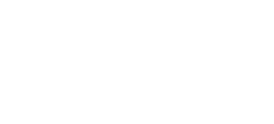

# Основы квантовых алгоритмов

Узнайте, как квантовые компьютеры могут эффективно решать задачи, включая поиск и факторизацию, быстрее классических компьютеров.

<!-- more -->


Добро пожаловать в _Основы квантовых алгоритмов_ — второй курс серии _Understanding Quantum Information and Computation_, в которую входят следующие курсы:

- [Основы квантовой информации](../basics-of-quantum-information/index.md)
- Основы квантовых алгоритмов (этот курс)
- [Общая формулировка квантовой информации](https://quantum.cloud.ibm.com/learning/courses/general-formulation-of-quantum-information)
- [Основы квантовой коррекции ошибок](https://quantum.cloud.ibm.com/learning/courses/foundations-of-quantum-error-correction)

В этом курсе рассматриваются вычислительные преимущества квантовой информации: что можно делать с помощью квантовых компьютеров и в чем их преимущества перед классическими компьютерами. Курс начинается с квантовых алгоритмов запросов, которые дают простые демонстрации принципов работы квантовых алгоритмов, а затем переходит к квантовым алгоритмам для задач, включая факторизацию целых чисел и неструктурированный поиск.

Курс предназначен для студентов, специалистов и энтузиастов в таких областях, как информатика, физика, инженерия и математика, которые хотят изучить теоретические основы квантовой информации и вычислений.

## Квантовые алгоритмы запросов

В первом уроке курса мы сформулируем простую алгоритмическую рамку — _модель запросов_ — и рассмотрим преимущества, которые квантовые компьютеры дают в этой модели.

Модель запросов в вычислениях похожа на чашку Петри для идей квантовых алгоритмов. Она жесткая и искусственная в том смысле, что не вполне точно отражает те вычислительные задачи, которые обычно важны на практике, но при этом оказалась чрезвычайно полезным инструментом для разработки квантовых алгоритмических методов. В их число входят и методы, лежащие в основе самых известных квантовых алгоритмов, например алгоритма Шора для факторизации целых чисел. Кроме того, модель запросов очень удобна для _объяснения_ квантовых алгоритмических приемов.

После введения самой модели запросов мы обсудим первый открытый квантовый алгоритм — _алгоритм Дойча_, а также его обобщение, известное как _алгоритм Дойча — Йожи_. Эти алгоритмы демонстрируют количественно измеримые преимущества квантовых вычислений над классическими в рамках модели запросов. Затем мы обсудим квантовый алгоритм, известный как _алгоритм Саймона_; он дает более устойчивое и убедительное преимущество квантовых вычислений над классическими по причинам, которые станут ясны позже.

**Видео урока**

В следующем видео Джон Уотрус последовательно разбирает материал этого урока о квантовых алгоритмах запросов. Также можно открыть [видео на YouTube](https://youtu.be/2wticzHE1vs?list=PLOFEBzvs-VvqKKMXX4vbi4EB1uaErFMSO) для этого урока в отдельном окне. [Скачать слайды](https://ibm.box.com/public/static/keh3p0vnrptftpk6o5kabvjewj8psube.pdf) к уроку.

<iframe width="560" height="315" src="https://www.youtube.com/embed/2wticzHE1vs?si=qNRSrOqPzZafIrlL" title="YouTube video player" frameborder="0" allow="accelerometer; autoplay; clipboard-write; encrypted-media; gyroscope; picture-in-picture; web-share" referrerpolicy="strict-origin-when-cross-origin" allowfullscreen></iframe>

### Модель запросов в вычислениях

Когда мы описываем вычисления математически, обычно имеется в виду процесс вроде показанного на следующем рисунке: информация подается на вход, затем выполняется вычисление, после чего получается выход.


Хотя компьютеры, которыми мы пользуемся сегодня, действительно непрерывно получают входные данные и выдают результаты, фактически взаимодействуя и с нами, и с другими компьютерами способом, не отраженным на рисунке, цель здесь не в том, чтобы изобразить непрерывную работу компьютеров. Скорее, мы хотим построить простую абстракцию вычисления, сосредоточившись на отдельных вычислительных задачах. Например, вход может кодировать число, вектор, матрицу, граф, описание молекулы или что-то более сложное, а выход кодирует решение интересующей нас вычислительной задачи.

Ключевой момент состоит в том, что вход предоставляется вычислению целиком, обычно в виде двоичной строки, и никакая его часть не скрыта.

#### Описание модели

В _модели запросов_ вход не передается вычислению целиком, как в более стандартной модели выше. Вместо этого вход доступен в виде _функции_, к которой вычисление обращается с помощью _запросов_. Иначе говоря, вычисления в модели запросов можно рассматривать как имеющие <abbr title="Произвольный доступ, также называемый прямым доступом, означает возможность напрямую обращаться к элементам в выбранных позициях последовательности, не просматривая всю последовательность для их поиска (это называется последовательным доступом).">произвольный доступ</abbr> к битам (или сегментам битов) входа.


В контексте модели запросов часто говорят, что вход предоставляется _оракулом_ или _черным ящиком_. Оба термина подчеркивают, что полное описание входа скрыто от вычисления, а единственный способ получить к нему доступ — задавать вопросы. Это похоже на обращение к Дельфийскому оракулу по поводу входа: он не рассказывает всего, что знает, а отвечает только на конкретные вопросы. Термин _черный ящик_ особенно уместен, когда мы думаем о входе как о функции: мы не можем заглянуть внутрь функции и понять, как она работает, а можем только вычислять ее значения на выбранных нами аргументах.

В этом уроке мы будем работать исключительно с двоичными строками, а не со строками из различных символов, поэтому далее для удобства будем писать $\Sigma = \{0,1\}$, обозначая двоичный алфавит. Мы будем рассматривать разные вычислительные задачи, несколько простых примеров которых вскоре появятся, но во всех них вход будет представлен функцией вида

$$
f:\Sigma^n \rightarrow \Sigma^m
$$

для двух положительных целых чисел $n$ и $m$. Разумеется, вместо $f$ можно было бы выбрать другое имя, но на протяжении урока мы будем использовать именно $f$.

Сказать, что вычисление делает _запрос_, означает выбрать некоторую строку $x \in \Sigma^n$, после чего оракул предоставляет вычислению строку $f(x)\in\Sigma^m$. Точный способ, которым это работает для квантовых алгоритмов, мы вскоре обсудим: нужно убедиться, что это можно реализовать унитарной квантовой операцией, допускающей запросы в суперпозиции. Пока же можно мыслить об этом интуитивно, на высоком уровне.

Наконец, эффективность алгоритмов запросов мы будем измерять очень просто: считать _число запросов_, которое им требуется. Это связано со временем, необходимым для выполнения вычисления, но не совпадает с ним в точности, потому что мы игнорируем время операций помимо запросов, а сами запросы считаем имеющими единичную стоимость. При желании можно учитывать и операции помимо запросов (иногда так и делают), но сосредоточение только на числе запросов помогает упростить картину.

#### Примеры задач запросов

Вот несколько простых примеров задач запросов.

- **OR.** Входная функция имеет вид $f:\Sigma^n \rightarrow \Sigma$ (то есть для этой задачи $m=1$). Требуется вывести $1$, если существует строка $x\in\Sigma^n$, для которой $f(x) = 1$, и вывести $0$, если такой строки нет. Если думать о функции $f$ как о последовательности из $2^n$ битов с произвольным доступом, то задача состоит в вычислении OR этих битов.

- **Четность.** Входная функция снова имеет вид $f:\Sigma^n \rightarrow \Sigma$. Требуется определить, является ли число строк $x\in\Sigma^n$, для которых $f(x) = 1$, _четным_ или _нечетным_. Точнее, требуемый выход равен $0$, если множество $\{x\in\Sigma^n : f(x) = 1\}$ содержит четное число элементов, и $1$, если оно содержит нечетное число элементов. Если думать о функции $f$ как о последовательности из $2^n$ битов с произвольным доступом, то задача состоит в вычислении четности (или исключающего ИЛИ) этих битов.

- **Минимум.** Входная функция имеет вид $f:\Sigma^n \rightarrow \Sigma^m$ для любых положительных целых $n$ и $m$. Требуемый выход — строка $y \in \{f(x) : x\in\Sigma^n\}$, которая идет первой в лексикографическом (то есть словарном) порядке на $\Sigma^m$. Если думать о функции $f$ как о последовательности из $2^n$ целых чисел, закодированных двоичными строками длины $m$, к которым есть произвольный доступ, то задача состоит в вычислении минимума этих чисел.

Мы также будем рассматривать задачи запросов, где на вход наложено _обещание_. Это означает, что нам дана некоторая гарантия относительно входа, и мы не отвечаем за то, что произойдет, если гарантия не выполнена. Иначе говоря, некоторые входные функции (те, для которых обещание не выполняется) считаются входами типа «не важно». На алгоритмы вообще не накладывается требований, когда им подаются такие входы «не важно».

Вот один пример задачи с обещанием:

- **Уникальный поиск.** Входная функция имеет вид $f:\Sigma^n \rightarrow \Sigma$, и нам _обещано_, что существует ровно одна строка $z\in\Sigma^n$, для которой $f(z) = 1$, причем $f(x) = 0$ для всех строк $x\neq z$. Задача состоит в том, чтобы найти эту единственную строку $z$.

Все четыре только что описанных примера естественны в том смысле, что их легко описать и можно представить множество ситуаций или контекстов, в которых они могут возникнуть.

Напротив, некоторые задачи запросов вовсе не являются «естественными» в таком смысле. В исследовании модели запросов иногда придумывают очень сложные и сильно искусственные задачи, для которых трудно представить, что кто-то действительно захотел бы решать их на практике. Но это не значит, что такие задачи неинтересны. То, что сначала кажется искусственным или неестественным, может дать неожиданные подсказки или вдохновить новые идеи. Квантовый алгоритм Шора для факторизации, вдохновленный алгоритмом Саймона, — отличный пример. Важная часть изучения модели запросов также состоит в поиске крайних случаев, которые помогают понять как потенциальные преимущества, так и ограничения квантовых вычислений.

#### Вентили запросов

Когда мы описываем вычисления с помощью схем, запросы выполняются специальными вентилями, называемыми _вентилями запросов_.

Самый простой способ определить вентили запросов для классических булевых схем — просто разрешить им напрямую вычислять входную функцию $f$, как показано на следующем рисунке.


Когда для задачи запросов строится булева схема, доступ к входной функции $f$ осуществляется через такие вентили, а число запросов, которые делает схема, — это просто число вентилей запросов в схеме. Входные провода самой булевой схемы инициализируются фиксированными значениями; их следует считать частью алгоритма, а не входами задачи.

Например, вот булева схема с классическими вентилями запросов, которая решает описанную выше задачу четности для функции вида $f:\Sigma\rightarrow\Sigma$:


Этот алгоритм делает два запроса, потому что в нем два вентиля запросов. Он работает так: функция $f$ запрашивается на двух возможных входах, $0$ и $1$, а результаты подаются в булеву схему, вычисляющую XOR. (Именно эта схема появлялась как пример булевой схемы в уроке _Квантовые схемы_ курса _Основы квантовой информации_.)

Для квантовых схем такое определение вентилей запросов не подходит, потому что для некоторых вариантов функции $f$ эти вентили будут неунитарными. Поэтому вместо этого мы определяем _унитарные вентили запросов_, которые действуют на состояния стандартного базиса так, как показано на рисунке:


Здесь предполагается, что $x\in\Sigma^n$ и $y\in\Sigma^m$ — произвольные строки. Обозначение $y\oplus f(x)$ означает _побитовое исключающее ИЛИ_ двух строк, которые в данном случае имеют длину $m$. Например, $001 \oplus 101 = 100$.

Интуитивно вентиль $U_f$ (для любой выбранной функции $f$) копирует верхнюю входную строку $x$ без изменений и добавляет значение функции $f(x)$ к нижней входной строке $y$ по XOR. Это унитарная операция для любого выбора функции $f$. На самом деле это детерминированная операция, причем она является собственной обратной. Отсюда следует, что как матрица $U_f$ всегда является _матрицей перестановки_: в каждой ее строке и каждом столбце стоит ровно одна $1$, а все остальные элементы равны $0$. Применение матрицы перестановки к вектору просто переставляет компоненты этого вектора (отсюда и термин _матрица перестановки_) и поэтому не меняет его евклидову норму; это показывает, что матрицы перестановки всегда унитарны.

Стоит подчеркнуть: когда мы анализируем алгоритмы запросов, просто считая число запросов, мы полностью игнорируем сложность физического построения вентилей запросов — как для классической, так и для квантовой версии, описанных выше. Интуитивно построение вентилей запросов является частью подготовки входа, а не частью поиска решения.

Это может показаться необоснованным, но нужно помнить, что мы не пытаемся описать практические вычисления или полностью учесть требуемые ресурсы. Вместо этого мы определяем теоретическую модель, которая помогает прояснить потенциальные преимущества квантовых вычислений. Мы еще вернемся к этому вопросу в следующем уроке, когда перейдем к более стандартной модели вычислений, где входы явно подаются на схемы в виде двоичных строк.

### Алгоритм Дойча

Алгоритм Дойча решает задачу четности для частного случая $n = 1$. В контексте квантовых вычислений эту задачу иногда называют _задачей Дойча_, и в этом уроке мы будем придерживаться этой терминологии.

Точнее, вход представлен функцией $f:\Sigma \rightarrow \Sigma$ из одного бита в один бит. Существует четыре такие функции:

$$
\rule[-10mm]{0mm}{10mm}
\begin{array}{c|c}
  a & f_1(a)\\
  \hline
  0 & 0\\
  1 & 0
\end{array}
\qquad
\begin{array}{c|c}
  a & f_2(a)\\
  \hline
  0 & 0\\
  1 & 1
\end{array}
\qquad
\begin{array}{c|c}
  a & f_3(a)\\
  \hline
  0 & 1\\
  1 & 0
\end{array}
\qquad
\begin{array}{c|c}
  a & f_4(a)\\
  \hline
  0 & 1\\
  1 & 1
\end{array}
$$

Первая и последняя из этих функций являются _постоянными_, а две средние — _сбалансированными_, то есть два возможных выходных значения функции встречаются одинаковое число раз при переборе входов. Задача Дойча состоит в том, чтобы определить, к какой из двух категорий относится входная функция: постоянная она или сбалансированная.

!!!note "Задача Дойча"

    Вход: функция $f:\{0,1\}\rightarrow\{0,1\}$ \
    Выход: $0$, если $f$ постоянна, и $1$, если $f$ сбалансирована

Если рассматривать входную функцию $f$ в задаче Дойча как представление произвольного доступа к строке, то речь идет о двухбитовой строке: $f(0)f(1)$.

$$
\begin{array}{cc}
\mathsf{function} & \mathsf{string}\\
\hline
f_1 & 00 \\
f_2 & 01 \\
f_3 & 10 \\
f_4 & 11
\end{array}
$$

При таком взгляде задача Дойча состоит в вычислении четности (или, что то же самое, исключающего ИЛИ) двух битов.

Любой классический алгоритм запросов, корректно решающий эту задачу, должен запросить оба бита: $f(0)$ и $f(1)$. Например, если мы узнали, что $f(1) = 1$, ответ все еще может быть $0$ или $1$ в зависимости от того, равно ли $f(0)$ значению $1$ или $0$ соответственно. Все остальные случаи аналогичны: знание только одного из двух битов вообще не дает информации об их четности. Поэтому булева схема, описанная в предыдущем разделе, является лучшим, что можно сделать с точки зрения числа запросов, необходимых для решения этой задачи.

#### Описание квантовой схемы

Алгоритм Дойча решает задачу Дойча с помощью одного запроса и тем самым дает количественно измеримое преимущество квантовых вычислений над классическими. Это преимущество может быть скромным — один запрос вместо двух, — но с чего-то нужно начинать. Научные достижения иногда имеют на вид очень скромное происхождение.

Вот квантовая схема, описывающая алгоритм Дойча:


#### Анализ

Чтобы проанализировать алгоритм Дойча, мы проследим действие схемы выше и определим состояния кубитов в моменты, указанные на этом рисунке:



Начальное состояние равно $\vert 1\rangle \vert 0 \rangle$, а две операции Адамара в левой части схемы преобразуют это состояние в

$$
\vert \pi_1 \rangle = \vert - \rangle \vert + \rangle
= \frac{1}{2} \bigl( \vert 0\rangle - \vert 1\rangle \bigr) \vert 0\rangle
+ \frac{1}{2} \bigl( \vert 0\rangle - \vert 1\rangle \bigr) \vert 1\rangle.
$$

(Как всегда, мы следуем соглашению Qiskit о порядке кубитов: верхний кубит записывается справа, а нижний — слева.) Может показаться неинтуитивным записывать это произведение состояний в частично раскрытом виде, оставляя состояния кубита 1 вынесенными за скобки, но так последующие выражения будут компактнее.

Затем выполняется вентиль $U_f$. Согласно определению вентиля $U_f$, значение функции $f$ для классического состояния верхнего, то есть самого правого, кубита добавляется по XOR к нижнему, то есть самому левому, кубиту. Это преобразует $\vert \pi_1\rangle$ в состояние

$$
\vert \pi_2 \rangle
= \frac{1}{2} \bigl( \vert 0 \oplus f(0) \rangle - \vert 1 \oplus f(0) \rangle \bigr) \vert 0 \rangle
+ \frac{1}{2} \bigl( \vert 0 \oplus f(1) \rangle - \vert 1 \oplus f(1) \rangle \bigr) \vert 1 \rangle.
$$

Это выражение можно упростить, заметив, что формула

$$
\vert 0 \oplus a\rangle - \vert 1 \oplus a\rangle = (-1)^a \bigl( \vert 0\rangle - \vert 1\rangle \bigr)
$$

работает для обоих возможных значений $a\in\Sigma$. Более явно два случая выглядят так.

$$
\begin{aligned}
\vert 0 \oplus 0\rangle - \vert 1 \oplus 0\rangle
& = \vert 0 \rangle - \vert 1 \rangle
= (-1)^0 \bigl( \vert 0\rangle - \vert 1\rangle \bigr)\\
\vert 0 \oplus 1\rangle - \vert 1 \oplus 1\rangle & = \vert 1 \rangle - \vert 0\rangle
= (-1)^1 \bigl( \vert 0\rangle - \vert 1\rangle \bigr)
\end{aligned}
$$

Таким образом, $\vert\pi_2\rangle$ можно также выразить так:

$$
\begin{aligned}
  \vert\pi_2\rangle
  & = \frac{1}{2} (-1)^{f(0)} \bigl( \vert 0 \rangle - \vert 1 \rangle \bigr) \vert 0 \rangle
  + \frac{1}{2} (-1)^{f(1)} \bigl( \vert 0 \rangle - \vert 1 \rangle \bigr) \vert 1 \rangle \\
  & = \vert - \rangle \biggl( \frac{(-1)^{f(0)} \vert 0\rangle + (-1)^{f(1)} \vert 1\rangle}{\sqrt{2}}\biggr).
\end{aligned}
$$

Только что произошло нечто интересное. Хотя действие вентиля $U_f$ на состояния стандартного базиса оставляет верхний, то есть самый правый, кубит без изменений и добавляет значение функции по XOR к нижнему, то есть самому левому, кубиту, здесь мы видим, что состояние верхнего/самого правого кубита в общем случае изменилось, тогда как состояние нижнего/самого левого кубита осталось тем же: он был в состоянии $\vert - \rangle$ и до, и после применения вентиля $U_f$. Это явление называется _фазовой отдачей_, и вскоре мы скажем о нем подробнее.

Сделав последнее упрощение — вынеся множитель $(-1)^{f(0)}$ за сумму, — получаем такое выражение для состояния $\vert\pi_2\rangle$:

$$
\begin{aligned}
  \vert\pi_2\rangle
  & = (-1)^{f(0)} \vert - \rangle
      \biggl( \frac{\vert 0\rangle + (-1)^{f(0) \oplus f(1)} \vert 1\rangle}{\sqrt{2}}\biggr) \\
  & = \begin{cases}
        (-1)^{f(0)} \vert - \rangle \vert + \rangle & \text{if $f(0) \oplus f(1) = 0$}\\[1mm]
        (-1)^{f(0)} \vert - \rangle \vert - \rangle & \text{if $f(0) \oplus f(1) = 1$}.
      \end{cases}
\end{aligned}
$$

Обратите внимание, что в этом выражении в показателе степени у $-1$ стоит $f(0) \oplus f(1)$, а не $f(1) - f(0)$, как можно было бы ожидать с чисто алгебраической точки зрения; однако результат в любом случае получается тем же. Причина в том, что значение $(-1)^k$ для любого целого $k$ зависит только от того, четно $k$ или нечетно.

Применение последнего вентиля Адамара к верхнему кубиту дает состояние

$$
\vert \pi_3 \rangle =
\begin{cases}
  (-1)^{f(0)} \vert - \rangle \vert 0 \rangle & \text{if $f(0) \oplus f(1) = 0$}\\[1mm]
  (-1)^{f(0)} \vert - \rangle \vert 1 \rangle & \text{if $f(0) \oplus f(1) = 1$},
\end{cases}
$$

что приводит к правильному результату с вероятностью $1$ при измерении правого, то есть верхнего, кубита.

#### Дополнительные замечания о фазовой отдаче

Прежде чем двигаться дальше, посмотрим на приведенный выше анализ под немного другим углом; это может прояснить явление фазовой отдачи.

Сначала заметим, что следующая формула верна для любых битов $b,c\in\Sigma$.

$$
\vert b \oplus c\rangle = X^c \vert b \rangle
$$

Это можно проверить для двух возможных значений $c = 0$ и $c = 1$:

$$
\begin{aligned}
\vert b \oplus 0 \rangle & = \vert b\rangle = \mathbb{I} \vert b \rangle = X^0 \vert b \rangle\\
\vert b \oplus 1 \rangle & = \vert \neg b\rangle = X \vert b \rangle = X^1 \vert b \rangle.
\end{aligned}
$$

Используя эту формулу, получаем

$$
U_f \bigl(\vert b\rangle \vert a \rangle\bigr)
= \vert b \oplus f(a) \rangle \vert a \rangle
= \bigl(X^{f(a)}\vert b \rangle\bigr) \vert a \rangle
$$

для любого выбора битов $a,b\in\Sigma$. Поскольку эта формула верна при $b=0$ и $b=1$, из линейности следует, что

$$
U_f \bigl( \vert \psi \rangle \vert a \rangle \bigr) = \bigl(X^{f(a)}\vert \psi \rangle\bigr) \vert a \rangle
$$

для всех векторов состояния кубита $\vert \psi\rangle$, и поэтому

$$
U_f \bigl( \vert - \rangle \vert a \rangle \bigr) = \bigl(X^{f(a)} \vert - \rangle \bigr) \vert a \rangle
= (-1)^{f(a)} \vert - \rangle \vert a \rangle.
$$

Ключ к этому рассуждению — равенство $X\vert - \rangle = - \vert - \rangle$. В математических терминах вектор $\vert - \rangle$ является _собственным вектором_ матрицы $X$ с _собственным значением_ $-1$.

Мы подробнее обсудим собственные векторы и собственные значения в следующем уроке, _Оценивание фазы и факторизация_, где явление фазовой отдачи обобщается на другие унитарные операции.

Помня, что скаляры свободно проходят через тензорные произведения, получаем альтернативный способ рассуждать о том, как операция $U_f$ преобразует $\vert \pi_1\rangle$ в $\vert \pi_2\rangle$ в приведенном выше анализе:

$$
\begin{aligned}
  \vert \pi_2 \rangle
  & = U_f \bigl( \vert - \rangle \vert + \rangle \bigr)\\
  & = \frac{1}{\sqrt{2}} U_f \bigl(\vert - \rangle \vert 0\rangle \bigr)
    + \frac{1}{\sqrt{2}} U_f \bigl(\vert - \rangle \vert 1\rangle \bigr)\\
  & = \vert - \rangle \biggl( \frac{(-1)^{f(0)} \vert 0\rangle + (-1)^{f(1)} \vert 1\rangle}{\sqrt{2}}\biggr).
\end{aligned}
$$

#### Реализация в Qiskit

Теперь посмотрим, как реализовать алгоритм Дойча в Qiskit. Начнем с проверки версии, а затем выполним импорты, необходимые только для этой реализации. Для реализаций следующих алгоритмов мы будем выполнять нужные импорты отдельно, чтобы сохранить большую модульность.

```python
from qiskit import __version__

print(__version__)
```

Вывод:

```txt
2.1.1
```

```python
from qiskit import QuantumCircuit
from qiskit_aer import AerSimulator
```

Сначала определим квантовую схему, реализующую вентиль запроса для одной из четырех описанных ранее функций $f_1$, $f_2$, $f_3$ или $f_4$ из одного бита в один бит. Как уже упоминалось, реализация вентилей запросов на самом деле не является частью самого алгоритма Дойча; здесь мы по сути показываем один способ подготовить вход в виде схемной реализации вентиля запроса.

```python
def deutsch_function(case: int):
    # This function generates a quantum circuit for one of the 4 functions
    # from one bit to one bit

    if case not in [1, 2, 3, 4]:
        raise ValueError("`case` must be 1, 2, 3, or 4.")

    f = QuantumCircuit(2)
    if case in [2, 3]:
        f.cx(0, 1)
    if case in [3, 4]:
        f.x(1)
    return f
```

Можно посмотреть, как выглядит каждая схема, с помощью метода `draw`. Вот схема для функции $f_3$.

```python
display(deutsch_function(3).draw(output="mpl"))
```


Затем создадим собственно квантовую схему для алгоритма Дойча, подставляя вместо вентиля запроса реализацию квантовой схемы, переданную как аргумент. Чуть ниже мы подставим одну из четырех схем, определенных ранее функцией `deutsch_function`. Барьеры добавлены, чтобы визуально отделить реализацию вентиля запроса от остальной части схемы.

```python
def compile_circuit(function: QuantumCircuit):
    # Compiles a circuit for use in Deutsch's algorithm.

    n = function.num_qubits - 1
    qc = QuantumCircuit(n + 1, n)

    qc.x(n)
    qc.h(range(n + 1))

    qc.barrier()
    qc.compose(function, inplace=True)
    qc.barrier()

    qc.h(range(n))
    qc.measure(range(n), range(n))

    return qc
```

Снова посмотрим, как выглядит схема, с помощью метода `draw`.

```python
display(compile_circuit(deutsch_function(3)).draw(output="mpl"))
```


Наконец, создадим функцию, которая один раз запускает определенную ранее схему и выдает соответствующий результат: \"constant\" или \"balanced.\"

```python
def deutsch_algorithm(function: QuantumCircuit):
    # Determine if a one-bit function is constant or balanced.

    qc = compile_circuit(function)

    result = AerSimulator().run(qc, shots=1, memory=True).result()
    measurements = result.get_memory()
    if measurements[0] == "0":
        return "constant"
    return "balanced"
```

Теперь можно запустить алгоритм Дойча на любой из четырех функций, определенных выше.

```python
f = deutsch_function(3)
display(deutsch_algorithm(f))
```

Вывод:

```txt
'balanced'
```

### Алгоритм Дойча — Йожи

Алгоритм Дойча превосходит все классические алгоритмы для одной задачи запросов, но преимущество довольно скромное: один запрос против двух. Алгоритм Дойча — Йожи усиливает это преимущество и, более того, может использоваться для решения нескольких разных задач запросов.

Вот описание алгоритма Дойча — Йожи в виде квантовой схемы. В зависимости от конкретной решаемой задачи может также потребоваться дополнительный классический шаг постобработки, не показанный на рисунке.


Конечно, мы еще не обсудили, какие именно задачи решает этот алгоритм; это будет сделано в двух следующих разделах.

#### Задача Дойча — Йожи

Начнем с задачи запросов, для решения которой изначально был предназначен алгоритм Дойча — Йожи; она известна как _задача Дойча — Йожи_.

Входная функция в этой задаче имеет вид $f:\Sigma^n \rightarrow \Sigma$ для произвольного положительного целого $n$. Как и в задаче Дойча, нужно вывести $0$, если $f$ постоянна, и $1$, если $f$ сбалансирована; последнее снова означает, что число входных строк, на которых функция принимает значение $0$, равно числу входных строк, на которых она принимает значение $1$.

Заметим, что при $n$ больше $1$ существуют функции вида $f:\Sigma^n \rightarrow \Sigma$, которые не являются ни постоянными, ни сбалансированными. Например, функция $f:\Sigma^2\rightarrow\Sigma$, заданная как

$$
\begin{aligned}
f(00) & = 0 \\
f(01) & = 0 \\
f(10) & = 0 \\
f(11) & = 1
\end{aligned}
$$

не попадает ни в одну из этих двух категорий. В задаче Дойча — Йожи о таких функциях просто не беспокоятся: они считаются входами типа «не важно». Иначе говоря, в этой задаче есть _обещание_, что $f$ либо постоянна, либо сбалансирована.

!!!note "Задача Дойча — Йожи"

    Вход: функция $f:\{0,1\}^n\rightarrow\{0,1\}$ \
    Обещание: $f$ либо постоянна, либо сбалансирована \
    Выход: $0$, если $f$ постоянна, и $1$, если $f$ сбалансирована

Алгоритм Дойча — Йожи с одним запросом решает эту задачу в следующем смысле: если все $n$ результатов измерений равны $0$, то функция $f$ постоянна; иначе, если хотя бы один из результатов измерений равен $1$, функция $f$ сбалансирована. Иначе говоря, за описанной выше схемой следует классический шаг постобработки, на котором вычисляется OR результатов измерений и получается выход.

##### Анализ алгоритма

Чтобы проанализировать работу алгоритма Дойча — Йожи для задачи Дойча — Йожи, полезно начать с действия одного слоя вентилей Адамара. Операцию Адамара можно обычным образом выразить матрицей,

$$
H = \begin{pmatrix}
\frac{1}{\sqrt{2}} & \frac{1}{\sqrt{2}} \\[2mm]
\frac{1}{\sqrt{2}} & -\frac{1}{\sqrt{2}}
\end{pmatrix},
$$

но можно также выразить эту операцию через ее действие на состояния стандартного базиса:

$$
\begin{aligned}
H \vert 0\rangle & = \frac{1}{\sqrt{2}} \vert 0 \rangle + \frac{1}{\sqrt{2}} \vert 1 \rangle\\[3mm]
H \vert 1\rangle & = \frac{1}{\sqrt{2}} \vert 0 \rangle - \frac{1}{\sqrt{2}} \vert 1 \rangle.
\end{aligned}
$$

Эти два уравнения можно объединить в одну формулу,

$$
H \vert a \rangle = \frac{1}{\sqrt{2}} \vert 0 \rangle + \frac{1}{\sqrt{2}} (-1)^a \vert 1 \rangle
= \frac{1}{\sqrt{2}} \sum_{b\in\{0,1\}} (-1)^{ab} \vert b\rangle,
$$

которая верна для обоих вариантов $a\in\Sigma$.

Теперь предположим, что вместо одного кубита у нас есть $n$ кубитов, и к каждому применяется операция Адамара. Совместная операция на $n$ кубитах описывается тензорным произведением $H\otimes \cdots \otimes H$ ($n$ раз), которое для краткости и ясности записывается как $H^{\otimes n}$. Используя формулу выше, затем раскрывая и упрощая выражение, можно записать действие этой совместной операции на состояния стандартного базиса $n$ кубитов так:

$$
\begin{aligned}
  & H^{\otimes n} \vert x_{n-1} \cdots x_1 x_0 \rangle \\
  & \qquad = \bigl(H \vert x_{n-1} \rangle \bigr) \otimes \cdots \otimes \bigl(H \vert x_{0} \rangle \bigr) \\
  & \qquad = \Biggl( \frac{1}{\sqrt{2}} \sum_{y_{n-1}\in\Sigma} (-1)^{x_{n-1} y_{n-1}} \vert y_{n-1} \rangle \Biggr)
  \otimes \cdots \otimes
  \Biggl( \frac{1}{\sqrt{2}} \sum_{y_{0}\in\Sigma} (-1)^{x_{0} y_{0}} \vert y_{0} \rangle \Biggr) \\
  & \qquad = \frac{1}{\sqrt{2^n}} \sum_{y_{n-1}\cdots y_0 \in \Sigma^n}
  (-1)^{x_{n-1}y_{n-1} + \cdots + x_0 y_0} \vert y_{n-1} \cdots y_0 \rangle.
\end{aligned}
$$

Здесь, кстати, мы записываем двоичные строки длины $n$ как $x_{n-1}\cdots x_0$ и $y_{n-1}\cdots y_0$, следуя соглашению Qiskit об индексировании.

Эта формула дает полезный инструмент для анализа квантовой схемы выше. После выполнения первого слоя вентилей Адамара состояние $n+1$ кубитов (включая самый левый/нижний кубит, который рассматривается отдельно от остальных) равно

$$
\bigl( H \vert 1 \rangle \bigr) \bigl( H^{\otimes n} \vert 0 \cdots 0 \rangle \bigr)
= \vert - \rangle \otimes \frac{1}{\sqrt{2^n}} \sum_{x_{n-1}\cdots x_0 \in \Sigma^n} \vert x_{n-1} \cdots x_0 \rangle.
$$

Когда выполняется операция $U_f$, это состояние преобразуется в

$$
\vert - \rangle \otimes \frac{1}{\sqrt{2^n}}
\sum_{x_{n-1}\cdots x_0 \in \Sigma^n} (-1)^{f(x_{n-1}\cdots x_0)} \vert x_{n-1} \cdots x_0 \rangle
$$

ровно за счет того же явления фазовой отдачи, которое мы видели в анализе алгоритма Дойча.

Затем выполняется второй слой вентилей Адамара, который (по формуле выше) преобразует это состояние в

$$
\vert - \rangle \otimes \frac{1}{2^n}
\sum_{x_{n-1}\cdots x_0 \in \Sigma^n}
\sum_{y_{n-1}\cdots y_0 \in \Sigma^n}
(-1)^{f(x_{n-1}\cdots x_0) + x_{n-1}y_{n-1} + \cdots + x_0 y_0}
\vert y_{n-1} \cdots y_0 \rangle.
$$

Это выражение выглядит довольно сложным, и без дополнительной информации о функции $f$ из него трудно сделать много выводов о вероятностях разных результатов измерения.

К счастью, нам нужно знать только вероятность того, что все результаты измерений равны $0$, потому что это вероятность того, что алгоритм определит $f$ как постоянную. Для этой вероятности есть простая формула.

$$
\Biggl\vert
\frac{1}{2^n}
\sum_{x_{n-1}\cdots x_0 \in \Sigma^n}
(-1)^{f(x_{n-1}\cdots x_0)}
\Biggr\vert^2
= \begin{cases}
1 & \text{if $f$ is constant}\\[1mm]
0 & \text{if $f$ is balanced}
\end{cases}
$$

Подробнее: если $f$ постоянна, то либо $f(x_{n-1}\cdots x_0) = 0$ для каждой строки $x_{n-1}\cdots x_0$, и тогда сумма равна $2^n$, либо $f(x_{n-1}\cdots x_0) = 1$ для каждой строки $x_{n-1}\cdots x_0$, и тогда сумма равна $-2^n$. Деление на $2^n$ и возведение абсолютного значения в квадрат дает $1$.

Если же $f$ сбалансирована, то она принимает значение $0$ на половине строк $x_{n-1}\cdots x_0$ и значение $1$ на другой половине, поэтому слагаемые $+1$ и $-1$ в сумме сокращаются, и остается значение $0$.

Следовательно, алгоритм работает корректно при условии, что обещание выполнено.

##### Классическая сложность

Алгоритм Дойча — Йожи работает каждый раз, всегда дает правильный ответ при выполнении обещания и требует одного запроса. Как это соотносится с классическими алгоритмами запросов для задачи Дойча — Йожи?

Во-первых, любой _детерминированный_ классический алгоритм, корректно решающий задачу Дойча — Йожи, должен делать экспоненциально много запросов: в худшем случае требуется $2^{n-1} + 1$ запросов. Рассуждение такое: если детерминированный алгоритм запрашивает $f$ на $2^{n-1}$ или меньшем числе различных строк и каждый раз получает одно и то же значение функции, то оба ответа все еще возможны. Функция может быть постоянной, а может быть сбалансированной, но из-за неудачного выбора запросов все они случайно возвращают одно и то же значение.

Второй вариант может казаться маловероятным, но в детерминированных алгоритмах нет случайности или неопределенности, поэтому на некоторых функциях они будут систематически ошибаться. В этом отношении мы получаем существенное преимущество квантовых алгоритмов над классическими.

Однако есть нюанс: _вероятностные_ классические алгоритмы могут решать задачу Дойча — Йожи с очень высокой вероятностью, используя всего несколько запросов. В частности, если просто случайно выбрать несколько разных строк длины $n$ и запросить $f$ на этих строках, то при сбалансированной $f$ маловероятно, что для всех них мы получим одно и то же значение функции.

Точнее, если выбрать $k$ входных строк $x^1,\ldots,x^k \in \Sigma^n$ равномерно случайно, вычислить $f(x^1),\ldots,f(x^k)$, и ответить $0$, если все значения функции одинаковы, и $1$ в противном случае, то при постоянной $f$ мы всегда будем правы, а при сбалансированной $f$ ошибемся лишь с вероятностью $2^{-k + 1}$. Например, при $k = 11$ этот алгоритм даст правильный ответ с вероятностью больше $99.9$%.

По этой причине преимущество квантовых алгоритмов над классическими все еще остается довольно скромным, но это все же количественно измеримое преимущество, улучшающее результат алгоритма Дойча.

#### Дойч — Йожа в Qiskit

```python
from qiskit import QuantumCircuit
from qiskit_aer import AerSimulator
import numpy as np
```

Чтобы реализовать алгоритм Дойча — Йожи в Qiskit, начнем с определения функции `dj_query`, которая генерирует квантовую схему, реализующую вентиль запроса для случайно выбранной функции, удовлетворяющей обещанию задачи Дойча — Йожи. С вероятностью 50% функция постоянна, а с вероятностью 50% сбалансирована. В каждом из этих двух случаев функция выбирается равномерно из функций соответствующего типа. Аргументом является число входных битов функции.

```python
def dj_query(num_qubits):
    # Create a circuit implementing for a query gate for a random function
    # satisfying the promise for the Deutsch-Jozsa problem.

    qc = QuantumCircuit(num_qubits + 1)

    if np.random.randint(0, 2):
        # Flip output qubit with 50% chance
        qc.x(num_qubits)
    if np.random.randint(0, 2):
        # return constant circuit with 50% chance
        return qc

    # Choose half the possible input strings
    on_states = np.random.choice(
        range(2**num_qubits),  # numbers to sample from
        2**num_qubits // 2,  # number of samples
        replace=False,  # makes sure states are only sampled once
    )

    def add_cx(qc, bit_string):
        for qubit, bit in enumerate(reversed(bit_string)):
            if bit == "1":
                qc.x(qubit)
        return qc

    for state in on_states:
        qc.barrier()  # Barriers are added to help visualize how the functions are created.
        qc = add_cx(qc, f"{state:0b}")
        qc.mcx(list(range(num_qubits)), num_qubits)
        qc = add_cx(qc, f"{state:0b}")

    qc.barrier()

    return qc
```

Как обычно, можно показать квантовую схемную реализацию вентиля запроса с помощью метода `draw`.

```python
display(dj_query(3).draw(output="mpl"))
```


Затем определим функцию, которая создает схему Дойча — Йожи, принимая в качестве аргумента квантовую схемную реализацию вентиля запроса.

```python
def compile_circuit(function: QuantumCircuit):
    # Compiles a circuit for use in the Deutsch-Jozsa algorithm.

    n = function.num_qubits - 1
    qc = QuantumCircuit(n + 1, n)
    qc.x(n)
    qc.h(range(n + 1))
    qc.compose(function, inplace=True)
    qc.h(range(n))
    qc.measure(range(n), range(n))
    return qc
```

Наконец, определим функцию, которая один раз запускает схему Дойча — Йожи.

```python
def dj_algorithm(function: QuantumCircuit):
    # Determine if a function is constant or balanced.

    qc = compile_circuit(function)

    result = AerSimulator().run(qc, shots=1, memory=True).result()
    measurements = result.get_memory()
    if "1" in measurements[0]:
        return "balanced"
    return "constant"
```

Можно проверить реализацию, случайно выбрав функцию, показав квантовую схемную реализацию вентиля запроса для этой функции, а затем запустив на ней алгоритм Дойча — Йожи.

```python
f = dj_query(3)
display(f.draw("mpl"))
display(dj_algorithm(f))
```


Вывод:

```txt
'balanced'
```

#### Задача Бернштейна — Вазирани

Далее обсудим задачу, известную как _задача Бернштейна — Вазирани_. Ее также называют _задачей выборки Фурье_, хотя существуют и более общие формулировки этой задачи, которые носят то же название.

Сначала введем обозначения. Для любых двух двоичных строк $x = x_{n-1} \cdots x_0$ и $y = y_{n-1}\cdots y_0$ длины $n$ определим

$$
x \cdot y = x_{n-1} y_{n-1} \oplus \cdots \oplus x_0 y_0.
$$

Эту операцию будем называть _двоичным скалярным произведением_. Ее можно определить и так:

$$
x \cdot y =
\begin{cases}
1 & x_{{n-1}} y_{n-1} + \cdots + x_0 y_0 \text{ is odd}\\[0.5mm]
0 & x_{{n-1}} y_{n-1} + \cdots + x_0 y_0 \text{ is even}
\end{cases}
$$

Заметим, что это симметричная операция: результат не меняется, если поменять $x$ и $y$ местами, поэтому мы можем делать это, когда удобно. Иногда полезно думать о двоичном скалярном произведении $x \cdot y$ как о четности битов строки $x$ в тех позициях, где строка $y$ имеет $1$, или, что эквивалентно, как о четности битов строки $y$ в тех позициях, где строка $x$ имеет $1$.

Теперь, имея это обозначение, можно определить задачу Бернштейна — Вазирани.

!!!note "Задача Бернштейна — Вазирани"

    Вход: функция $f:\{0,1\}^n\rightarrow\{0,1\}$ \
    Обещание: существует двоичная строка $s = s_{n-1} \cdots s_0$, для которой $f(x) = s\cdot x$ для всех $x\in\Sigma^n$ \
    Выход: строка $s$

На самом деле для этой задачи не нужен новый квантовый алгоритм: ее решает алгоритм Дойча — Йожи. Для ясности будем называть квантовую схему выше, не включающую классический шаг постобработки с вычислением OR, _схемой Дойча — Йожи_.

##### Анализ алгоритма {#algorithm-analysis}

Чтобы проанализировать, как схема Дойча — Йожи работает для функции, удовлетворяющей обещанию задачи Бернштейна — Вазирани, начнем с простого наблюдения. Используя двоичное скалярное произведение, можно иначе описать действие $n$ вентилей Адамара на состояния стандартного базиса $n$ кубитов:

$$
H^{\otimes n} \vert x \rangle = \frac{1}{\sqrt{2^n}} \sum_{y\in\Sigma^n} (-1)^{x\cdot y} \vert y\rangle
$$

Как и в анализе алгоритма Дойча, причина в том, что значение $(-1)^k$ для любого целого $k$ зависит только от четности $k$.

Переходя к схеме Дойча — Йожи: после выполнения первого слоя вентилей Адамара состояние $n+1$ кубитов равно

$$
\vert - \rangle \otimes \frac{1}{\sqrt{2^n}} \sum_{x \in \Sigma^n} \vert x \rangle.
$$

Затем выполняется вентиль запроса, который (через явление фазовой отдачи) преобразует состояние в

$$
\vert - \rangle \otimes \frac{1}{\sqrt{2^n}} \sum_{x \in \Sigma^n} (-1)^{f(x)} \vert x \rangle.
$$

Используя формулу для действия слоя вентилей Адамара, видим, что второй слой вентилей Адамара преобразует это состояние в

$$
\vert - \rangle \otimes \frac{1}{2^n}
\sum_{x \in \Sigma^n} \sum_{y \in \Sigma^n} (-1)^{f(x) + x \cdot y} \vert y \rangle.
$$

Теперь можно упростить показатель степени у $-1$ внутри суммы. Нам обещано, что $f(x) = s\cdot x$ для некоторой строки $s = s_{n-1} \cdots s_0$, поэтому состояние можно записать как

$$
\vert - \rangle \otimes \frac{1}{2^n}
\sum_{x \in \Sigma^n} \sum_{y \in \Sigma^n} (-1)^{s\cdot x + x \cdot y} \vert y \rangle.
$$

Поскольку $s\cdot x$ и $x\cdot y$ являются двоичными значениями, сложение можно заменить исключающим ИЛИ — опять же потому, что для целого числа в показателе степени у $-1$ важна только его четность. Используя симметрию двоичного скалярного произведения, получаем такое выражение для состояния:

$$
\vert - \rangle \otimes \frac{1}{2^n}
\sum_{x \in \Sigma^n} \sum_{y \in \Sigma^n} (-1)^{(s\cdot x) \oplus (y \cdot x)} \vert y \rangle.
$$

(Скобки добавлены для ясности, хотя на самом деле они не обязательны: двоичное скалярное произведение обычно считается имеющим более высокий приоритет, чем исключающее ИЛИ.)

Теперь воспользуемся следующей формулой.

$$
(s\cdot x) \oplus (y \cdot x) = (s \oplus y) \cdot x
$$

Эту формулу можно получить из аналогичной формулы для битов,

$$
(a c) \oplus (b c) = (a \oplus b) c,
$$

вместе с раскрытием двоичного скалярного произведения и побитового исключающего ИЛИ:

$$
\begin{aligned}
(s\cdot x) \oplus (y \cdot x)
& = (s_{n-1} x_{n-1}) \oplus \cdots \oplus (s_{0} x_{0}) \oplus
(y_{n-1} x_{n-1})  \oplus \cdots \oplus (y_{0} x_{0}) \\
& = (s_{n-1} \oplus y_{n-1}) x_{n-1}  \oplus \cdots \oplus (s_{0} \oplus y_{0}) x_{0} \\
& = (s \oplus y) \cdot x
\end{aligned}
$$

Это позволяет выразить состояние схемы непосредственно перед измерениями так:

$$
\vert - \rangle \otimes \frac{1}{2^n}
\sum_{x \in \Sigma^n} \sum_{y \in \Sigma^n} (-1)^{(s\oplus y)\cdot x} \vert y \rangle.
$$

Последний шаг — воспользоваться еще одной формулой, которая работает для каждой двоичной строки $z = z_{n-1}\cdots z_0$.

$$
\frac{1}{2^n}
\sum_{x \in \Sigma^n} (-1)^{z \cdot x}
= \begin{cases}
1 & \text{if $z = 0^n$}\\
0 & \text{if $z\neq 0^n$}
\end{cases}
$$

Здесь мы используем простое обозначение для строк, которое еще несколько раз встретится в уроке: $0^n$ — это строка из одних нулей длины $n$.

Простой способ обосновать эту формулу — рассмотреть два случая отдельно. Если $z = 0^n$, то $z\cdot x = 0$ для каждой строки $x\in\Sigma^n$, так что каждое слагаемое в сумме равно $1$, и после суммирования и деления на $2^n$ получается $1$. С другой стороны, если хотя бы один бит строки $z$ равен $1$, то двоичное скалярное произведение $z\cdot x$ равно $0$ ровно для половины возможных вариантов $x\in\Sigma^n$ и $1$ для другой половины, потому что значение $z\cdot x$ меняется (с $0$ на $1$ или с $1$ на $0$), если изменить любой бит $x$ в позиции, где у $z$ стоит $1$.

Если теперь применить эту формулу для упрощения состояния схемы перед измерениями, получаем

$$
\vert - \rangle \otimes \frac{1}{2^n}
\sum_{x \in \Sigma^n} \sum_{y \in \Sigma^n} (-1)^{(s\oplus y)\cdot x} \vert y \rangle
= \vert - \rangle \otimes \vert s \rangle,
$$

поскольку $s\oplus y = 0^n$ тогда и только тогда, когда $y = s$. Значит, измерения выявляют ровно ту строку $s$, которую мы ищем.

##### Классическая сложность {#classical-difficulty}

В то время как схема Дойча — Йожи решает задачу Бернштейна — Вазирани одним запросом, любой классический алгоритм запросов должен сделать по крайней мере $n$ запросов.

Это можно объяснить так называемым _информационно-теоретическим_ аргументом, который в данном случае очень прост. Каждый классический запрос раскрывает один бит информации о решении, а всего нужно узнать $n$ битов информации, поэтому требуется не меньше $n$ запросов.

Фактически задачу Бернштейна — Вазирани можно решить классически, запросив функцию на каждой из $n$ строк, где ровно одна $1$ стоит в одной из возможных позиций, а все остальные биты равны $0$; это раскрывает биты $s$ по одному. Следовательно, преимущество квантового алгоритма над классическим для этой задачи — $1$ запрос против $n$ запросов.

#### Бернштейн — Вазирани в Qiskit

Мы уже реализовали выше схему Дойча — Йожи, и теперь воспользуемся ею для решения задачи Бернштейна — Вазирани. Сначала определим функцию, реализующую вентиль запроса для задачи Бернштейна — Вазирани при заданной двоичной строке $s$.

```python
def bv_query(s):
    # Create a quantum circuit implementing a query gate for the
    # Bernstein-Vazirani problem.

    qc = QuantumCircuit(len(s) + 1)
    for index, bit in enumerate(reversed(s)):
        if bit == "1":
            qc.cx(index, len(s))
    return qc


display(bv_query("1011").draw(output="mpl"))
```


Теперь можно создать функцию, которая запускает схему Дойча — Йожи на этой функции, используя ранее определенную функцию `compile_circuit`.

```python
def bv_algorithm(function: QuantumCircuit):
    qc = compile_circuit(function)
    result = AerSimulator().run(qc, shots=1, memory=True).result()
    return result.get_memory()[0]


display(bv_algorithm(bv_query("1011")))
```

Вывод:

```txt
'1011'
```

##### Замечание о терминологии

В контексте задачи Бернштейна — Вазирани алгоритм Дойча — Йожи часто называют «алгоритмом Бернштейна — Вазирани». Это немного вводит в заблуждение, потому что этот алгоритм _является_ алгоритмом Дойча — Йожи, что Бернштейн и Вазирани ясно указали в своей работе.

После того как Бернштейн и Вазирани показали, что алгоритм Дойча — Йожи решает задачу Бернштейна — Вазирани (в сформулированном выше виде), они определили намного более сложную задачу, известную как _рекурсивная задача выборки Фурье_. Это весьма искусственная задача, где решения разных экземпляров фактически открывают новые уровни задачи, организованные в древовидную структуру. Задача Бернштейна — Вазирани по сути является лишь базовым случаем этой более сложной задачи.

Рекурсивная задача выборки Фурье стала первым известным примером задачи запросов, где квантовые алгоритмы имеют так называемое _сверхполиномиальное_ преимущество над вероятностными алгоритмами, тем самым превосходя квантовое преимущество над классическими алгоритмами, которое дает алгоритм Дойча — Йожи. Интуитивно рекурсивная версия задачи усиливает преимущество квантовых алгоритмов $1$ против $n$ до гораздо большего.

Самая сложная часть математического анализа, устанавливающего это преимущество, — показать, что классические алгоритмы запросов не могут решить задачу без большого числа запросов. Это довольно типично: для многих задач бывает очень трудно исключить изобретательные классические подходы, которые решают их эффективно.

Задача Саймона и алгоритм для нее, описанный в следующем разделе, дают намного более простой пример сверхполиномиального (и фактически экспоненциального) преимущества квантовых алгоритмов над классическими, поэтому рекурсивную задачу выборки Фурье обсуждают реже. Тем не менее это интересная вычислительная задача сама по себе.

### Алгоритм Саймона

Алгоритм Саймона — это квантовый алгоритм запросов для задачи, известной как _задача Саймона_. Это задача с обещанием, похожая по духу на задачи Дойча — Йожи и Бернштейна — Вазирани, но отличающаяся деталями.

Алгоритм Саймона важен потому, что дает _экспоненциальное_ преимущество квантовых алгоритмов над классическими, включая вероятностные, а использованная в нем техника вдохновила Питера Шора на открытие эффективного квантового алгоритма факторизации целых чисел.

#### Задача Саймона

Входная функция в задаче Саймона имеет вид

$$
f:\Sigma^n \rightarrow \Sigma^m
$$

для положительных целых чисел $n$ и $m$. Ради простоты можно было бы ограничиться случаем $m = n$, но пользы от такого предположения мало: алгоритм Саймона и его анализ по сути одинаковы в обоих вариантах.

!!!note "Задача Саймона"

    Вход: функция $f:\Sigma^n \rightarrow \Sigma^m$ \
    Обещание: существует строка $s\in\Sigma^n$ такая, что $[f(x) = f(y)] \Leftrightarrow
    [(x = y) \vee (x \oplus s = y)]$ для всех $x,y\in\Sigma^n$ \
    Выход: строка $s$

Сейчас мы разберем обещание подробнее, чтобы лучше понять его смысл, но сначала отметим, что оно требует от $f$ очень специальной структуры, поэтому большинство функций этому обещанию не удовлетворяют. Также стоит признать, что эта задача не задумывалась как практически важная. Скорее, это несколько искусственная задача, специально устроенная так, чтобы быть простой для квантовых компьютеров и трудной для классических.

Есть два основных случая: в первом $s$ является строкой из одних нулей $0^n$, а во втором $s$ не является такой строкой.

- Случай 1: $s=0^n$. Если $s$ — строка из одних нулей, то условие «тогда и только тогда» в обещании упрощается до $[f(x) = f(y)] \Leftrightarrow [x = y]$. Это эквивалентно тому, что $f$ является взаимно однозначной функцией.

- Случай 2: $s\neq 0^n$. Если $s$ не является строкой из одних нулей, то выполнение обещания для этой строки означает, что $f$ является функцией _два-к-одному_: для каждой возможной выходной строки $f$ существует ровно две входные строки, на которых $f$ выдает эту строку. Более того, эти две входные строки должны иметь вид $w$ и $w \oplus s$ для некоторой строки $w$.

Важно понимать, что если обещание выполнено, то существует только одна подходящая строка $s$, поэтому для функций, удовлетворяющих обещанию, всегда есть единственный правильный ответ.

Вот пример функции вида $f:\Sigma^3 \rightarrow \Sigma^5$, удовлетворяющей обещанию для строки $s = 011$.

$$
\begin{aligned}
f(000) & = 10011 \\
f(001) & = 00101 \\
f(010) & = 00101 \\
f(011) & = 10011 \\
f(100) & = 11010 \\
f(101) & = 00001 \\
f(110) & = 00001 \\
f(111) & = 11010
\end{aligned}
$$

Есть $8$ различных входных строк и $4$ различных выходных строки, каждая из которых встречается дважды, поэтому это функция два-к-одному. Более того, для любых двух разных входных строк, дающих одну и ту же выходную строку, побитовое XOR этих двух входных строк равно $011$, что эквивалентно утверждению, что каждая из них равна другой, взятой по XOR с $s$.

Заметим, что в самих выходных строках важно только то, совпадают они или различаются для разных входных строк. Например, в примере выше в качестве выходов $f$ появляются четыре строки $(10011$, $00101$, $00001$, и $11010)$. Мы могли бы заменить эти четыре строки другими, если бы все они оставались различными, и правильное решение $s = 011$ не изменилось бы.

#### Описание алгоритма Саймона

Вот схема квантовой цепи, представляющая алгоритм Саймона.


Для ясности: сверху находятся $n$ кубитов, на которые действуют вентили Адамара, а снизу — $m$ кубитов, которые напрямую входят в вентиль запроса. Это очень похоже на алгоритмы, уже обсуждавшиеся в уроке, но на этот раз фазовой отдачи нет: все нижние $m$ кубитов входят в вентиль запроса в состоянии $\vert 0\rangle$.

Чтобы решить задачу Саймона с помощью этой схемы, на самом деле потребуется несколько независимых запусков схемы, а затем классический шаг постобработки; он будет описан позже, после анализа поведения схемы.

#### Анализ алгоритма Саймона

Анализ алгоритма Саймона начинается примерно так же, как анализ алгоритма Дойча — Йожи. После выполнения первого слоя вентилей Адамара на верхних $n$ кубитах состояние становится

$$
\frac{1}{\sqrt{2^n}} \sum_{x\in\Sigma^n} \vert 0^m \rangle \vert x\rangle.
$$

Когда выполняется $U_f$, выход функции $f$ добавляется по XOR к нулевому состоянию нижних $m$ кубитов, поэтому состояние становится

$$
\frac{1}{\sqrt{2^n}} \sum_{x\in\Sigma^n} \vert f(x) \rangle \vert x\rangle.
$$

Когда выполняется второй слой вентилей Адамара, с помощью той же формулы для действия слоя вентилей Адамара, что и раньше, получаем следующее состояние.

$$
\frac{1}{2^n} \sum_{x\in\Sigma^n} \sum_{y\in\Sigma^n} (-1)^{x\cdot y} \vert f(x) \rangle \vert y\rangle
$$

На этом этапе анализ расходится с анализом предыдущих алгоритмов этого урока.

Нас интересует вероятность того, что измерения дадут каждую возможную строку $y\in\Sigma^n$. По правилам анализа измерений, описанным в уроке _Составные системы_ курса _Основы квантовой информации_, вероятность $p(y)$ получить строку $y$ равна

$$
p(y) = \left\|\frac{1}{2^n} \sum_{x\in\Sigma^n} (-1)^{x\cdot y} \vert f(x) \rangle \right\|^2.
$$

Чтобы лучше разобраться с этими вероятностями, понадобится еще немного обозначений и терминологии. Во-первых, _область значений_ функции $f$ — это множество всех ее выходных строк.

$$
\operatorname{range}(f) = \{ f(x) : x\in \Sigma^n \}
$$

Во-вторых, для каждой строки $z\in\operatorname{range}(f)$ множество всех входных строк, на которых функция принимает выходное значение $z$, можно записать как $f^{-1}(\{z\})$.

$$
f^{-1}(\{z\}) = \{ x\in\Sigma^n : f(x) = z \}
$$

Множество $f^{-1}(\{z\})$ называется _прообразом_ $\{z\}$ относительно $f$. Аналогично можно определить прообраз относительно $f$ любого множества вместо $\{z\}$: это множество всех элементов, которые $f$ отображает в это множество. (Это обозначение не следует путать с _обратной_ функцией к $f$, которая может не существовать. Подсказка, позволяющая избежать путаницы, состоит в том, что аргумент слева — множество $\{z\}$, а не элемент $z$.)

Используя это обозначение, можно разбить сумму в выражении для вероятностей выше и получить

$$
p(y) =
\left\|
\frac{1}{2^n}
\sum_{z\in\operatorname{range}(f)}
\Biggl(\sum_{x\in f^{-1}(\{z\})}  (-1)^{x\cdot y}\Biggr)
\vert z \rangle
\right\|^2.
$$

Каждая строка $x\in\Sigma^n$ представлена в этих двух суммах ровно один раз: по сути, мы раскладываем строки по отдельным «корзинам» в зависимости от того, какую выходную строку $z = f(x)$ они дают при вычислении функции $f$, а затем суммируем отдельно по всем корзинам.

Теперь можно вычислить квадрат евклидовой нормы и получить

$$
p(y) = \frac{1}{2^{2n}}
\sum_{z\in\operatorname{range}(f)}
\left\vert \sum_{x\in f^{-1}(\{z\})}  (-1)^{x\cdot y} \right\vert^2.
$$

Чтобы упростить эти вероятности дальше, рассмотрим значение

$$
\left\vert \sum_{x\in f^{-1}(\{z\})}  (-1)^{x\cdot y} \right\vert^2
\tag{1}
$$

для произвольно выбранного $z\in\operatorname{range}(f)$.

Если оказывается, что $s = 0^n$, то $f$ является взаимно однозначной функцией, и для каждого $z\in\operatorname{range}(f)$ в $f^{-1}(\{z\})$ всегда есть ровно один элемент $x$. В этом случае значение выражения $(1)$ равно $1$.

Если же $s\neq 0^n$, то в множестве $f^{-1}(\{z\})$ ровно две строки. Точнее, если выбрать $w\in f^{-1}(\{z\})$ как любую из этих двух строк, то другая строка по обещанию задачи Саймона должна быть $w \oplus s$. Используя это наблюдение, можно упростить $(1)$ следующим образом.

$$
\begin{aligned}
\left\vert \sum_{x\in f^{-1}(\{z\})}  (-1)^{x\cdot y} \right\vert^2
& = \Bigl\vert (-1)^{w\cdot y} + (-1)^{(w\oplus s)\cdot y} \Bigr\vert^2 \\
& = \Bigl\vert (-1)^{w\cdot y} \Bigl(1 + (-1)^{s\cdot y}\Bigr) \Bigr\vert^2 \\
& = \Bigl\vert 1 + (-1)^{y\cdot s} \Bigr\vert^2 \\
& = \begin{cases}
4 & y \cdot s = 0\\[1mm]
0 & y \cdot s = 1
\end{cases}
\end{aligned}
$$

Итак, в обоих случаях значение $(1)$ не зависит от конкретного выбора $z\in\operatorname{range}(f)$.

Теперь можно завершить анализ, отдельно рассмотрев те же два случая, что и раньше.

- Случай 1: $s = 0^n$. В этом случае функция $f$ взаимно однозначна, поэтому существует $2^n$ строк $z\in\operatorname{range}(f)$, и мы получаем

    $$
    p(y) = \frac{1}{2^{2n}} \cdot 2^n = \frac{1}{2^n}.
    $$

    Иными словами, результатом измерений становится строка $y\in\Sigma^n$, выбранная равномерно случайно.

- Случай 2: $s \neq 0^n$. В этом случае $f$ является функцией два-к-одному, поэтому в $\operatorname{range}(f)$ есть $2^{n-1}$ элементов. Используя формулу выше, заключаем, что вероятность измерить каждое $y\in\Sigma^n$ равна

    $$
    p(y)
    = \frac{1}{2^{2n}} \sum_{z\in\operatorname{range}(f)}
    \Biggl\vert \sum_{x\in f^{-1}(\{z\})} (-1)^{x\cdot y} \Biggr\vert^2
    =
    \begin{cases}
    \frac{1}{2^{n-1}} & y \cdot s = 0\\[1mm]
    0 & y \cdot s = 1
    \end{cases}
    $$

    Иными словами, мы получаем строку, выбранную равномерно случайно из множества $\{y\in\Sigma^n : y \cdot s = 0\}$, которое содержит $2^{n-1}$ строк. (Поскольку $s\neq 0^n$, ровно половина двоичных строк длины $n$ имеет двоичное скалярное произведение $1$ с $s$, а другая половина — двоичное скалярное произведение $0$ с $s$, как мы уже наблюдали в анализе алгоритма Дойча — Йожи для задачи Бернштейна — Вазирани.)

##### Классическая постобработка

Теперь мы знаем вероятности возможных результатов измерений при запуске квантовой схемы алгоритма Саймона. Достаточно ли этой информации, чтобы определить $s$?

Ответ — да, если мы готовы повторить процесс несколько раз и принять, что он может завершиться неудачей с некоторой вероятностью, которую можно сделать очень малой, запуская схему достаточно много раз. Основная идея в том, что каждый запуск схемы дает статистическое свидетельство о $s$, и, если запусков достаточно, это свидетельство позволяет найти $s$ с очень высокой вероятностью.

Предположим, что мы независимо запускаем схему $k$ раз, где $k = n + 10$. В этом конкретном числе запусков нет ничего особенного: можно взять $k$ больше (или меньше) в зависимости от допустимой вероятности неудачи, как мы увидим ниже. Выбор $k = n + 10$ гарантирует, что вероятность восстановить $s$ будет больше $99.9$%.

Запустив схему $k$ раз, мы получаем строки $y^1,...,y^{k} \in \Sigma^n$. Для ясности: верхние индексы здесь являются частью имен этих строк, а не степенями и не индексами их битов, так что

$$
\begin{aligned}
y^1 & = y^1_{n-1} \cdots y^1_{0}\\[1mm]
y^2 & = y^2_{n-1} \cdots y^2_{0}\\[1mm]
& \;\; \vdots\\[1mm]
y^{k} & = y^{k}_{n-1} \cdots y^{k}_{0}
\end{aligned}
$$

Теперь составим матрицу $M$ с $k$ строками и $n$ столбцами, взяв биты этих строк в качестве двоичных элементов.

$$
M = \begin{pmatrix}
 y^1_{n-1} & \cdots & y^1_{0}\\[1mm]
 y^2_{n-1} & \cdots & y^2_{0}\\[1mm]
 \vdots & \ddots & \vdots \\[1mm]
 y^{k}_{n-1} & \cdots & y^{k}_{0}
 \end{pmatrix}
$$

На этом этапе мы еще не знаем, чему равно $s$: наша цель как раз найти эту строку. Но на мгновение представим, что строка $s$ нам известна, и составим из битов строки $s = s_{n-1} \cdots s_0$ вектор-столбец $v$ следующим образом.

$$
v = \begin{pmatrix}
s_{n-1}\\
\vdots\\
s_0
\end{pmatrix}
$$

Если выполнить умножение матрицы на вектор $M v$ по модулю $2$ — то есть выполнить умножение как обычно, а затем взять остатки элементов результата при делении на $2$, — мы получим нулевой вектор.

$$
M v = \begin{pmatrix}
y^1 \cdot s\\
y^2 \cdot s\\
\vdots\\[1mm]
y^{k} \cdot s
\end{pmatrix}
= \begin{pmatrix}
0\\
0\\
\vdots\\[1mm]
0
\end{pmatrix}
$$

Иначе говоря, если рассматривать строку $s$ как вектор-столбец $v$, описанный выше, то $s$ всегда будет элементом _ядра_ матрицы $M$, при условии что арифметика выполняется по модулю $2$. Это верно как в случае $s = 0^n$, так и в случае $s\neq 0^n$. Точнее, нулевой вектор всегда находится в ядре $M$, а при $s\neq 0^n$ к нему добавляется вектор, элементы которого являются битами $s$.

Остается вопрос, будут ли в ядре $M$ другие векторы помимо соответствующих $0^n$ и $s$. Ответ: это становится все менее вероятным по мере роста $k$; если выбрать $k = n + 10$, то с вероятностью больше $99.9$% ядро $M$ не будет содержать никаких других векторов, кроме соответствующих $0^n$ и $s$. В более общем случае, если заменить $k = n + 10$ на $k = n + r$ для произвольного положительного целого $r$, вероятность того, что векторы, соответствующие $0^n$ и $s$, будут единственными в ядре $M$, не меньше $1 - 2^{-r}$.

С помощью линейной алгебры можно эффективно вычислить описание ядра $M$ по модулю $2$. В частности, это можно сделать методом _исключения Гаусса_, который при арифметике по модулю $2$ работает так же, как над действительными или комплексными числами. Если векторы, соответствующие $0^n$ и $s$, являются единственными в ядре $M$, что происходит с высокой вероятностью, то из результата этого вычисления можно вывести $s$.

##### Классическая сложность задачи Саймона

Сколько запросов нужно _классическому_ алгоритму запросов, чтобы решить задачу Саймона? В общем случае ответ: много.

О классической сложности этой задачи можно сформулировать разные точные утверждения; вот одно из них. Если взять любой вероятностный алгоритм запросов, который делает меньше $2^{n/2 - 1} - 1$ запросов, то есть _экспоненциальное_ по $n$ число запросов, то этот алгоритм не решит задачу Саймона с вероятностью по крайней мере $1/2$.

Иногда доказывать подобные результаты о невозможности очень трудно, но этот результат не слишком сложно доказать с помощью элементарного вероятностного анализа. Здесь, однако, мы лишь кратко рассмотрим основную интуицию.

Мы пытаемся найти скрытую строку $s$, но пока не запросим функцию на двух строках с одинаковым выходным значением, получим очень мало информации о $s$. Интуитивно все, что мы узнаем, — скрытая строка $s$ _не является_ исключающим ИЛИ каких-либо двух различных строк, которые мы запросили. Если же запросить меньше $2^{n/2 - 1} - 1$ строк, то останется много вариантов для $s$, которые мы не исключили, потому что пар строк недостаточно. Это не формальное доказательство, а лишь основная идея.

Итак, алгоритм Саймона дает впечатляющее преимущество квантовых алгоритмов над классическими в модели запросов. В частности, алгоритм Саймона решает задачу Саймона с числом запросов, _линейным_ по числу входных битов $n$ функции, тогда как любому классическому алгоритму, даже вероятностному, для решения задачи Саймона с разумной вероятностью успеха требуется число запросов, _экспоненциальное_ по $n$.

## Алгоритмические основы квантовых вычислений

Квантовые алгоритмы дают доказуемые преимущества перед классическими алгоритмами в модели вычислений с запросами. Но что насчет более стандартной модели вычислений, где входные данные задачи задаются явно, а не в виде оракула или черного ящика? Ответить на этот вопрос оказывается гораздо сложнее, и для этого сначала нужно заложить прочную основу, на которую будет опираться наше исследование. Это и есть главная цель этого урока.

Мы начнем с обсуждения _вычислительной стоимости_ для классических и квантовых вычислений, а также способов ее измерения. Это общее понятие, применимое к широкому кругу вычислительных задач, но ради простоты мы будем в основном рассматривать его через призму _вычислительной теории чисел_. Она изучает вычислительные задачи, которые, скорее всего, знакомы большинству читателей: базовую арифметику, вычисление наибольших общих делителей и факторизацию целых чисел. Хотя вычислительная теория чисел — узкая область применения, эти задачи хорошо иллюстрируют основные вопросы (и к тому же окажутся очень важны для следующего урока).

Наше внимание сосредоточено на _алгоритмах_, а не на постоянно улучшающемся оборудовании, на котором они выполняются. Соответственно, нас будет больше интересовать, как стоимость выполнения алгоритма масштабируется при росте конкретных экземпляров задачи, а не сколько секунд, минут или часов занимает какое-то отдельное вычисление. Мы выделяем именно этот аспект вычислительной стоимости, потому что алгоритмы имеют фундаментальное значение и по мере развития технологий естественным образом будут применяться ко все более крупным экземплярам задач на более быстрых и надежных устройствах.

Наконец, мы перейдем к чрезвычайно важной задаче: выполнению _классических_ вычислений на квантовых компьютерах. Эта задача важна не потому, что мы надеемся заменить классические компьютеры квантовыми — это кажется крайне маловероятным в ближайшее время, если вообще когда-либо произойдет, — а потому, что она открывает множество интересных возможностей для квантовых алгоритмов. В частности, классические вычисления, выполняемые на квантовых компьютерах, становятся доступны как _подпрограммы_, фактически позволяя использовать десятилетия исследований и разработок классических алгоритмов в поиске квантовых вычислительных преимуществ.

**Видео урока**

В следующем видео Джон Уотрус проведет вас по материалу этого урока об основах квантовых алгоритмов. Также можно открыть [видео на YouTube](https://youtu.be/2wxxvwRGANQ?list=PLOFEBzvs-VvqKKMXX4vbi4EB1uaErFMSO) для этого урока в отдельном окне. [Скачать слайды](https://ibm.box.com/public/static/yic6g33o4xn103oaay8xqbbwyc64d0jz.pdf) к этому уроку.

`<IBMVideo id="134056222" title="В этом видео Джон Уотрус разбирает две примерные процедуры с использованием квантовых алгоритмов: факторизацию и вычисление наибольших общих делителей. Он также обсуждает измерение вычислительной стоимости."/>`

### Два примера: факторизация и НОД

Современные классические компьютеры невероятно быстры, и их скорость, похоже, продолжает расти. Поэтому кто-то может склониться к мысли, что компьютеры настолько быстры, что нет вычислительных задач, которые были бы им недоступны.

Это убеждение неверно. Некоторые вычислительные задачи настолько сложны по своей природе, что, хотя алгоритмы для их решения существуют, ни один компьютер на планете Земля сегодня не способен выполнить эти алгоритмы до конца даже на входах умеренного размера за время человеческой жизни — или даже за время существования самой Земли.

Чтобы объяснить это подробнее, введем задачу _факторизации целых чисел_.

!!!note "Факторизация целых чисел"

    Вход: целое число $N\geq 2$\
    Выход: разложение $N$ на простые множители

Под _разложением на простые множители_ числа $N$ мы понимаем список простых множителей $N$ и степеней, в которые их нужно возвести, чтобы получить $N$ умножением. Например, простые множители числа $12$ — это $2$ и $3$, а чтобы получить $12$, нужно взять произведение $2$ в степени $2$ и $3$ в степени $1$.

$$
12 = 2^2 \cdot 3
$$

С точностью до порядка простых множителей у каждого положительного целого числа $N\geq 2$ есть только одно разложение на простые множители. Этот факт известен как _основная теорема арифметики_.

Несколько простых демонстраций кода на Python помогут подробнее объяснить факторизацию целых чисел и другие понятия, связанные с этим обсуждением. Для этих демонстраций нужны следующие импорты.

```python
import math
from sympy.ntheory import factorint
```

Функция `factorint` из пакета символьной математики `SymPy` для Python решает задачу факторизации целых чисел для любого выбранного нами входа $N$. Например, мы можем получить разложение на простые множители для 12, которое, естественно, совпадает с разложением выше.

```python
N = 12
print(factorint(N))
```

Вывод:

```txt
{2: 2, 3: 1}
```

Факторизовать небольшие числа вроде $12$ легко, но когда число $N$, которое нужно разложить на множители, становится больше, задача усложняется. Например, запуск `factorint` на значительно большем числе вызывает небольшую, но заметную задержку на обычном персональном компьютере.

```python
N = 3402823669209384634633740743176823109843098343
print(factorint(N))
```

Вывод:

```txt
{3: 2, 74519450661011221: 1, 5073729280707932631243580787: 1}
```

Для еще больших значений $N$ задача становится практически невозможной, по крайней мере насколько нам известно. Например, в рамках _RSA Factoring Challenge_, который проводился RSA Laboratories с 1991 по 2007 год, предлагалась денежная награда в \$100,000 за факторизацию следующего числа, имеющего 309 десятичных цифр (или 1024 бита в двоичной записи). Награду за это число так и не получили, а его простые множители остаются неизвестными.

```python
RSA1024 = 135066410865995223349603216278805969938881475605667027524485143851526510604859533833940287150571909441798207282164471551373680419703964191743046496589274256239341020864383202110372958725762358509643110564073501508187510676594629205563685529475213500852879416377328533906109750544334999811150056977236890927563
print(RSA1024)
```

Вывод:

```txt
135066410865995223349603216278805969938881475605667027524485143851526510604859533833940287150571909441798207282164471551373680419703964191743046496589274256239341020864383202110372958725762358509643110564073501508187510676594629205563685529475213500852879416377328533906109750544334999811150056977236890927563
```

Не стоит даже пытаться запускать `factorint` на RSA1024: он не завершится при нашей жизни.

Самый быстрый известный алгоритм факторизации больших целых чисел называется _решетом числового поля_. В качестве примера его применения: число RSA250 из RSA challenge, имеющее 250 десятичных цифр (или 829 бит в двоичной записи), было факторизовано с помощью решета числового поля в 2020 году. Вычисление потребовало тысяч процессорных лет, распределенных между десятками тысяч машин по всему миру. Здесь мы можем оценить этот результат, проверив решение.

```python
RSA250 = 2140324650240744961264423072839333563008614715144755017797754920881418023447140136643345519095804679610992851872470914587687396261921557363047454770520805119056493106687691590019759405693457452230589325976697471681738069364894699871578494975937497937

p = 64135289477071580278790190170577389084825014742943447208116859632024532344630238623598752668347708737661925585694639798853367
q = 33372027594978156556226010605355114227940760344767554666784520987023841729210037080257448673296881877565718986258036932062711

print(RSA250 == p * q)
```

Вывод:

```txt
True
```

Безопасность криптосистемы RSA с открытым ключом основана на вычислительной трудности факторизации целых чисел: эффективный алгоритм факторизации целых чисел ее взломал бы.

Теперь рассмотрим связанную, но совсем другую задачу: вычисление наибольшего общего делителя (или НОД) двух целых чисел.

!!!note "Наибольший общий делитель (НОД)"

    Вход: неотрицательные целые числа $N$ и $M$, хотя бы одно из которых положительно\
    Выход: наибольший общий делитель $N$ и $M$

Наибольший общий делитель двух чисел — это наибольшее целое число, которое делит их оба без остатка.

Эту задачу легко решить на компьютере: ее вычислительная стоимость примерно такая же, как у умножения двух входных чисел. Функция `gcd` из модуля Python `math` вычисляет наибольший общий делитель чисел, значительно больших RSA1024, в мгновение ока. (На самом деле RSA1024 — это НОД двух чисел в этом примере.)

```python
N = 4636759690183918349682239573236686632636353319755818421393667064929987310592347460711767784882455889983961546491666129915628431549982893638464243493812487979530329460863532041588297885958272943021122033997933550246447236884738870576045537199814804920281890355275625050796526864093092006894744790739778376848205654332434378295899591539239698896074
M = 5056714874804877864225164843977749374751021379176083540426461360945653967249306494545888621353613218518084414930846655066495767441010526886803458300440345782982127522212209489410315422285463057656809702949608368597012967321172325810519806487247195259818074918082416290513738155834341957254558278151385588990304622183174568167973121179585331770773

print(math.gcd(N, M))
```

Вывод:

```txt
135066410865995223349603216278805969938881475605667027524485143851526510604859533833940287150571909441798207282164471551373680419703964191743046496589274256239341020864383202110372958725762358509643110564073501508187510676594629205563685529475213500852879416377328533906109750544334999811150056977236890927563
```

Это возможно потому, что у нас есть очень эффективные алгоритмы вычисления НОД, самый известный из которых — _алгоритм Евклида_, открытый более 2000 лет назад.

Может ли существовать быстрый алгоритм факторизации целых чисел, который мы просто пока не открыли и который позволил бы факторизовать большие числа вроде RSA1024 в мгновение ока? Ответ — да. Хотя можно было бы ожидать, что эффективный алгоритм факторизации, такой же простой и элегантный, как алгоритм Евклида для вычисления НОД, уже был бы найден, ничто не исключает существования очень быстрого классического алгоритма факторизации целых чисел, кроме того факта, что до сих пор мы его не нашли. Его могут открыть завтра, но не стоит на это рассчитывать. Поколения математиков и специалистов по информатике искали такой алгоритм, и факторизация чисел вроде RSA1024 все еще остается за пределами наших возможностей.

### Измерение вычислительной стоимости

Теперь обсудим математическую основу, с помощью которой можно измерять вычислительную стоимость, в узком виде, нужном для этого курса. _Анализ алгоритмов_ и _вычислительная сложность_ — самостоятельные области, и они могут сказать об этих понятиях гораздо больше.

Для начала рассмотрим следующую иллюстрацию из предыдущего урока, которая представляет очень высокоуровневую абстракцию вычисления.


Само вычисление можно моделировать или описывать разными способами: например, компьютерной программой на Python, машиной Тьюринга, булевой схемой или квантовой схемой. Мы сосредоточимся на схемах (как булевых, так и квантовых).

#### Кодировки и длина входа

Начнем со входа и выхода вычислительной задачи; будем считать, что это _двоичные строки_. Можно было бы использовать и другие символы, но ради простоты в этом обсуждении мы ограничимся входными и выходными данными в виде двоичных строк. С помощью двоичных строк можно _кодировать_ разные интересные объекты, с которыми могут быть связаны решаемые нами задачи: числа, векторы, матрицы и графы, а также списки этих и других объектов.

Например, для кодирования неотрицательных целых чисел можно использовать _двоичную запись_. В следующей таблице перечислены двоичные кодировки первых девяти неотрицательных целых чисел вместе с _длиной_ каждой кодировки (то есть общим числом битов).

Число Двоичная кодировка Длина

---

0 0 1 1 1 1 2 10 2 3 11 2 4 100 3 5 101 3 6 110 3 7 111 3 8 1000 4

Мы можем легко расширить эту кодировку на положительные и отрицательные целые числа, если добавим к представлениям _знаковый бит_. Иногда также удобно разрешать двоичным представлениям неотрицательных целых чисел иметь ведущие нули: они не меняют кодируемое значение, но позволяют представлениям заполнять строку или машинное слово фиксированного размера.

Использовать двоичную запись для представления неотрицательных целых чисел одновременно привычно и эффективно, но при желании мы могли бы выбрать другой способ представления неотрицательных целых чисел двоичными строками, например один из предложенных в следующей таблице. Подробности этих альтернатив не важны для нашего обсуждения; смысл лишь в том, чтобы подчеркнуть: у нас есть выбор кодировок.

Число Унарная кодировка Лексикографическая кодировка

---

0 $\varepsilon$ $\varepsilon$ 1 0 0 2 00 1 3 000 00 4 0000 01 5 00000 10 6 000000 11 7 0000000 000 8 00000000 001

(В этой таблице символ $\varepsilon$ обозначает _пустую строку_, в которой нет символов и длина которой равна нулю. Естественно, чтобы избежать очевидного источника путаницы, мы используем специальный символ вроде $\varepsilon$ для обозначения пустой строки, а не буквально ничего не пишем.)

Другие типы входов, такие как векторы и матрицы, или более сложные объекты вроде описаний молекул, также можно кодировать двоичными строками. Как и для неотрицательных целых чисел, можно выбрать или придумать множество разных схем кодирования. Какую бы схему кодирования входов для данной задачи мы ни выбрали, _длину_ входной строки мы интерпретируем как размер решаемого экземпляра задачи.

Например, число битов, необходимых для записи неотрицательного целого числа $N$ в двоичной системе, иногда обозначаемое $\operatorname{lg}(N)$, задается следующей формулой.

$$
\operatorname{lg}(N) =
\begin{cases}
1 & N = 0\\
1 + \lfloor \log_2 (N) \rfloor & N \geq 1
\end{cases}
$$

Если считать, что для кодирования входа задачи факторизации целых чисел мы используем двоичную запись, то _длина входа_ для числа $N$ равна $\operatorname{lg}(N)$. В частности, обратите внимание: длина (или размер) входа $N$ — это не само $N$; когда $N$ велико, для его записи в двоичной системе нужно намного меньше битов.

Со строго формальной точки зрения, когда мы рассматриваем вычислительную задачу, следует понимать, что выбрана конкретная схема кодирования объектов, которые подаются на вход или выдаются на выход. Это позволяет абстрактно рассматривать вычисления, решающие интересные задачи, как преобразования двоичных входных строк в двоичные выходные строки.

Подробности того, как объекты кодируются двоичными строками, неизбежно важны для этих вычислений на некотором уровне. Но обычно при анализе вычислительной стоимости мы не слишком беспокоимся об этих деталях, чтобы не углубляться во второстепенные вопросы. Основная причина в том, что мы ожидаем: вычислительная стоимость преобразования между «разумными» схемами кодирования туда и обратно будет незначительной по сравнению со стоимостью решения самой задачи. В тех ситуациях, где это не так, детали можно (и нужно) уточнять.

Например, очень простое вычисление преобразует двоичное представление неотрицательного целого числа в его лексикографическую кодировку и обратно (мы не объясняли ее подробно, но ее можно вывести из таблицы выше). Поэтому вычислительная стоимость факторизации целых чисел существенно не изменилась бы, если бы мы решили перейти от одной из этих кодировок к другой для входа $N$. С другой стороны, кодирование неотрицательных целых чисел в унарной записи приводит к экспоненциальному росту общего числа требуемых символов, и по этой причине мы не стали бы считать такую схему кодирования «разумной».

#### Элементарные операции

Теперь рассмотрим само вычисление, представленное синим прямоугольником на рисунке выше. Мы будем измерять вычислительную стоимость, подсчитывая число _элементарных операций_, необходимых каждому вычислению. Интуитивно элементарная операция — это операция с небольшим фиксированным числом битов или кубитов, которую можно выполнить быстро и легко, например вычисление AND двух битов. Напротив, запуск функции `factorint` разумно не считать элементарной операцией.

Формально говоря, в зависимости от используемой модели вычислений есть разные варианты того, что считать элементарной операцией. Мы сосредоточимся на схемных моделях, а именно на квантовых и булевых схемах.

##### Универсальные наборы вентилей

В схемных моделях вычислений обычно каждый _вентиль_ рассматривается как элементарная операция. Отсюда возникает вопрос, какие именно вентили мы разрешаем в наших схемах. Если пока сосредоточиться на квантовых схемах, в этой серии мы уже видели несколько вентилей: $X$, $Y$, $Z$, $H$, $S$, и $T$, вентили _swap_, управляемые версии вентилей (включая _controlled-NOT_, вентили _Тоффоли_ и _Фредкина_), а также вентили, представляющие измерения в стандартном базисе. В контексте игры CHSH мы также видели несколько дополнительных вентилей _поворота_.

Мы также обсуждали _вентили запросов_ в контексте модели запросов и видели, что любую унитарную операцию $U$, действующую на любое число кубитов, при желании можно рассматривать как вентиль, но в этом обсуждении мы отбросим обе эти возможности. Мы не будем работать в модели запросов (хотя реализация вентилей запросов с помощью элементарных операций обсуждается далее в уроке), а рассмотрение произвольных унитарных вентилей, потенциально действующих на миллионы кубитов, как элементарных операций не приводит к содержательным или реалистичным понятиям вычислительной стоимости.

Если ограничиться квантовыми вентилями, действующими на небольшое число кубитов, один подход к решению, какие из них считать элементарными, состоит в том, чтобы выделить точный критерий. Но это не стандартный подход и не тот, которому мы будем следовать. Вместо этого мы просто сделаем выбор.

Вот один стандартный выбор, который мы примем как _базовый_ набор вентилей для квантовых схем:

- Однокубитные унитарные вентили из этого списка: $X$, $Y$, $Z$, $H$, $S$, $S^{\dagger}$, $T$, и $T^{\dagger}$
- Вентили controlled-NOT
- Однокубитные измерения в стандартном базисе

Распространенная альтернатива — считать элементарными вентили Тоффоли, Адамара и $S$ вместе с измерениями в стандартном базисе. Иногда все однокубитные вентили рассматривают как элементарные, хотя это приводит к нереалистично мощной модели, если не учитывать должным образом точность выполнения вентилей.

Унитарные вентили из нашего базового набора образуют так называемый _универсальный_ набор вентилей. Это означает, что мы можем с любой желаемой точностью приближать любую унитарную операцию на любом числе кубитов, используя схемы, составленные только из этих вентилей. Для ясности: определение универсальности не накладывает требований на стоимость таких приближений, то есть на число нужных нам вентилей из набора. В самом деле, довольно простой аргумент, основанный на математическом понятии меры, показывает, что большинство унитарных операций должны иметь чрезвычайно высокую стоимость. Доказательство универсальности квантовых наборов вентилей — непростая тема, и в этом курсе она рассматриваться не будет.

Для булевых схем мы будем считать AND, OR, NOT и FANOUT вентилями, представляющими элементарные операции. На самом деле нам не нужны одновременно и AND, и OR: можно использовать _законы де Моргана_, чтобы преобразовывать один в другой, помещая NOT на все три входных/выходных провода. Тем не менее обычно и удобно разрешать и AND, и OR. Вентили AND, OR, NOT и FANOUT образуют универсальный набор для детерминированных вычислений: любую функцию из фиксированного числа входных битов в фиксированное число выходных битов можно реализовать с помощью этих вентилей.

##### Принцип отложенного измерения

Вентили измерения в стандартном базисе могут появляться внутри квантовых схем, но иногда удобно откладывать их до конца. Это позволяет рассматривать квантовые вычисления как состоящие из унитарной части (представляющей само вычисление), за которой следует простая фаза считывания, где кубиты измеряются, а результаты выводятся. Так можно делать всегда, если мы готовы добавить по одному дополнительному кубиту для каждого измерения в стандартном базисе. На следующем рисунке схема справа показывает, как это можно сделать для вентиля слева.


Конкретно, классический бит в схеме слева заменяется кубитом справа (инициализированным в состоянии $\vert 0\rangle$), а измерение в стандартном базисе заменяется вентилем controlled-NOT, за которым следует измерение в стандартном базисе нижнего кубита. Смысл в том, что измерение в стандартном базисе в правой схеме можно протолкнуть в самый конец схемы. Если классический бит в схеме слева позже используется как управляющий бит, вместо него можно использовать нижний кубит в схеме справа, и общий эффект будет тем же. (Мы предполагаем, что классический бит в схеме слева после измерения не перезаписывается другим измерением, но если бы это происходило, мы всегда могли бы просто использовать новый классический бит вместо перезаписи бита, использованного для предыдущего измерения.)

#### Размер и глубина схемы

##### Размер схемы

Общее число вентилей в схеме называется ее _размером_. Поэтому, если считать, что вентили в наших схемах представляют элементарные операции, размер схемы представляет число элементарных операций, которые ей требуются, или, другими словами, ее _вычислительную стоимость_. Мы пишем $\operatorname{size}(C)$ для обозначения размера заданной схемы $C$.

Например, рассмотрим следующую булеву схему для вычисления XOR двух битов.


Размер этой схемы равен 7, потому что всего в ней 7 вентилей. (Операции fanout не всегда считают вентилями, но для целей этого урока мы будем считать их вентилями.)

##### Время, стоимость и глубина схемы

_Время_ — критически важный ресурс или ограничивающее условие для вычислений. Примеры выше, такие как задача факторизации RSA1024, подкрепляют эту точку зрения. Функция `factorint` не то чтобы не способна факторизовать RSA1024; просто у нас недостаточно времени, чтобы дождаться ее завершения.

Понятие вычислительной стоимости как числа элементарных операций, необходимых для выполнения вычисления, задумано как абстрактная замена времени, требуемого для реализации вычисления. Каждая элементарная операция требует некоторого времени, и чем больше таких операций нужно вычислению, тем дольше оно, вообще говоря, будет выполняться. Ради простоты мы продолжим связывать вычислительную стоимость со временем, необходимым для выполнения алгоритмов.

Но заметьте, что размер схемы не обязательно напрямую соответствует времени ее выполнения. Например, в нашей булевой схеме для вычисления XOR двух битов два вентиля FANOUT можно было бы выполнить одновременно, как и два вентиля NOT, а также два вентиля AND. Другой способ измерять эффективность схем, учитывающий возможность _параллелизации_, — это их _глубина_. Это минимальное число _слоев_ вентилей, необходимых в схеме, где вентили внутри каждого слоя действуют на разных проводах. Эквивалентно, глубина схемы — это максимальное число вентилей, встречающихся на любом пути от входного провода к выходному. Например, для схемы выше глубина равна 4.

Глубина схемы — один из способов формализовать время выполнения параллельных вычислений. Это продвинутая тема, и существуют очень сложные схемные конструкции, минимизирующие глубину, необходимую для некоторых вычислений. Есть также увлекательные открытые вопросы о глубине схем. (Например, многое остается неизвестным о глубине схем, необходимой для вычисления НОД.) В этой серии мы не будем много говорить о глубине схем, за исключением нескольких интересных фактов по ходу дела, но важно ясно признать, что параллелизация является потенциальным источником вычислительных преимуществ.

##### Назначение разной стоимости разным вентилям

Последнее замечание о размере схемы и вычислительной стоимости: вентилям можно назначать разные стоимости, вместо того чтобы считать, что каждый вентиль вносит одинаковый вклад в общую стоимость.

Например, как уже упоминалось, вентили FANOUT для булевых схем часто считают бесплатными, то есть мы могли бы выбрать для них нулевую стоимость. Другой пример: когда мы работаем в модели запросов и считаем число запросов, которые схема делает к входной функции (в форме черного ящика), мы фактически назначаем единичную стоимость вентилям запросов и нулевую стоимость другим вентилям, таким как вентили Адамара. Наконец, иногда мы назначаем вентилям разные стоимости в зависимости от того, насколько трудно их реализовать; это может зависеть от рассматриваемого оборудования.

Хотя все эти варианты разумны в разных контекстах, в этом уроке мы ради простоты будем придерживаться размера схемы как представления вычислительной стоимости.

#### Стоимость как функция длины входа

Нас прежде всего интересует, как вычислительная стоимость масштабируется по мере роста входов. Поэтому мы представляем стоимость алгоритмов как _функции_ длины входа.

##### Семейства схем

Входы данной вычислительной задачи могут иметь разную длину и потенциально становиться сколь угодно большими. С другой стороны, каждая схема имеет фиксированное число вентилей и проводов. Поэтому, когда мы думаем об алгоритмах в терминах схем, для представления алгоритмов обычно нужны бесконечно большие _семейства_ схем. Под семейством схем мы понимаем последовательность схем, которые растут в размере и позволяют обрабатывать все более крупные входы.

Например, представим, что у нас есть классический алгоритм факторизации целых чисел, такой как тот, который используется `factorint`. Как и все классические алгоритмы, этот алгоритм можно реализовать с помощью булевых схем, но для этого понадобится отдельная схема для каждой возможной длины входа. Если бы мы посмотрели на получающиеся схемы для разных длин входа, то увидели бы, что их размеры естественным образом растут вместе с длиной входа: это отражает тот факт, что факторизовать 4-битные целые числа намного проще и требует гораздо меньше элементарных операций, чем, например, факторизовать 1024-битные целые числа.

Это приводит нас к представлению вычислительной стоимости алгоритма функцией $t$, определенной так, что $t(n)$ — это число вентилей в схеме, реализующей алгоритм для $n$-битных входов. Более формально, алгоритм в модели булевых схем описывается последовательностью схем $\{C_1, C_2, C_3,\ldots\}$, где $C_n$ решает рассматриваемую задачу для $n$-битных входов (или, в более общем случае, для входов, размер которых некоторым образом параметризован $n$), а функция $t$, представляющая стоимость этого алгоритма, определяется как

$$
t(n) = \operatorname{size}(C_n).
$$

Для квантовых схем ситуация аналогична: для обработки все более длинных входных строк нужны все более крупные схемы.

##### Пример: сложение целых чисел

Чтобы объяснить это подробнее, на минуту рассмотрим задачу сложения целых чисел, которая намного проще факторизации целых чисел и даже вычисления НОД.

!!!note "Сложение целых чисел"

    Вход: целые числа $N$ и $M$\
    Выход: $N+M$

Как можно спроектировать булевы схемы для решения этой задачи?

Ради простоты ограничимся случаем, когда $N$ и $M$ — неотрицательные целые числа, представленные $n$-битными строками в двоичной записи. Мы разрешим любое число ведущих нулей в этих кодировках, так что

$$
0\leq N,M\leq 2^n - 1.
$$

Выходом будет $(n+1)$-битная двоичная строка, представляющая сумму; это максимальное число битов, необходимое для записи результата.

Начнем с алгоритма — _стандартного_ алгоритма сложения двоичных представлений, то есть аналога в системе счисления с основанием $2$ того способа сложения, которому учат в начальной школе по всему миру. Этот алгоритм можно реализовать булевыми схемами следующим образом.

Начиная с младших битов, можно вычислить их XOR, чтобы определить младший бит суммы. Затем вычисляется бит переноса, то есть AND двух младших битов $N$ и $M$. Иногда эти две операции вместе называют _полусумматором_.


Используя схему XOR, которую мы уже несколько раз видели, вместе с вентилем AND и двумя вентилями FANOUT, можно построить полусумматор из 10 вентилей. Если бы по какой-то причине мы передумали и решили включить вентили XOR в наш набор элементарных операций, для построения полусумматора понадобились бы 1 вентиль AND, 1 вентиль XOR и 2 вентиля FANOUT.

Переходя к более старшим битам, можно использовать похожую процедуру, но теперь включая в вычисление бит переноса из предыдущей позиции. Соединив каскадом два полусумматора и взяв OR от создаваемых ими битов переноса, можно получить так называемый _полный сумматор_.


Всего для этого требуется 21 вентиль: 2 вентиля AND, 2 вентиля XOR (каждый из которых требует 7 вентилей для реализации), один вентиль OR и 4 вентиля FANOUT.

Наконец, соединив полные сумматоры каскадом, мы получаем булеву схему для сложения неотрицательных целых чисел. Например, следующая схема вычисляет сумму двух 4-битных целых чисел.


В общем случае для этого требуется

$$
21 (n-1) + 10 = 21 n - 11
$$

вентилей. Если бы мы решили включить вентили XOR в наш набор элементарных операций, нам понадобились бы $2n-1$ вентилей AND, $2n-1$ вентилей XOR, $n-1$ вентилей OR и $4n-2$ вентилей FANOUT, всего $9n-5$ вентилей. Если дополнительно решить не учитывать вентили FANOUT, получится $5n-3$ вентилей.

##### Асимптотическая нотация

С одной стороны, полезно точно знать, сколько вентилей нужно для выполнения разных вычислений, как в примере сложения целых чисел выше. Эти детали важны для реального построения схем.

С другой стороны, если выполнять анализ с такой степенью детализации для всех интересующих нас вычислений, включая задачи гораздо сложнее сложения, мы очень быстро утонем в деталях. Чтобы сохранять управляемость и намеренно подавлять второстепенные детали, при анализе алгоритмов обычно используют нотацию _Big-O_. С ее помощью можно выражать _порядок_, с которым растут функции.

Формально говоря, если у нас есть две функции $g(n)$ и $h(n)$, мы пишем $g(n) = O(h(n))$, если существуют положительное действительное число $c > 0$ и положительное целое число $n_0$ такие, что

$$
g(n) \leq c\cdot h(n)
$$

для всех $n \geq n_0$. Обычно $h(n)$ выбирают как можно более простым выражением, чтобы эта нотация позволяла просто описать предельное поведение функции. Например, $17 n^3 - 257 n^2 + 65537 = O(n^3)$.

Эту нотацию можно довольно прямолинейно расширить на функции с несколькими аргументами. Например, если у нас есть две функции $g(n,m)$ и $h(n,m)$, определенные на положительных целых $n$ и $m$, мы пишем $g(n,m) = O(h(n,m))$, если существуют положительное действительное число $c > 0$ и положительное целое число $k_0$ такие, что

$$
g(n,m) \leq c\cdot h(n,m)
$$

всякий раз, когда $n+m \geq k_0$.

Связав эту нотацию с примером сложения неотрицательных целых чисел, мы заключаем, что существует семейство булевых схем $\{C_1, C_2,\ldots,\}$, где $C_n$ складывает два $n$-битных неотрицательных целых числа, такое что $\operatorname{size}(C_n) = O(n)$. Это выявляет самую существенную черту того, как стоимость сложения масштабируется с размером входа: она масштабируется _линейно_.

Также обратите внимание, что это не зависит от такой конкретной детали, считаем ли мы вентили XOR имеющими единичную стоимость или стоимость $7$. В целом использование нотации Big-O позволяет делать утверждения о вычислительных стоимостях, не чувствительные к таким низкоуровневым деталям.

##### Еще примеры

Вот еще несколько примеров задач из вычислительной теории чисел, начиная с _умножения_.

!!!note "Умножение целых чисел"

    Вход: целые числа $N$ и $M$\
    Выход: $NM$

Создавать булевы схемы для этой задачи труднее, чем для сложения, но, рассуждая о стандартном алгоритме умножения, можно получить схемы размера $O(n^2)$ для этой задачи (если $N$ и $M$ оба представлены $n$-битными двоичными представлениями). В более общем случае, если $N$ имеет $n$ битов, а $M$ имеет $m$ битов, существуют булевы схемы размера $O(nm)$ для умножения $N$ и $M$.

На самом деле есть и другие способы умножения, которые лучше масштабируются. Например, алгоритм умножения Шенхаге — Штрассена можно использовать для создания булевых схем, умножающих два $n$-битных целых числа со стоимостью $O(n \operatorname{lg}(n) \operatorname{lg}(\operatorname{lg}(n)))$. Однако сложность этого метода приводит к большим накладным расходам, поэтому на практике он полезен только для чисел с десятками тысяч битов.

Другая базовая задача — _деление_, под которым мы понимаем вычисление и частного, и остатка по заданным целочисленным делимому и делителю.

!!!note "Деление целых чисел"

    Вход: целые числа $N$ и $M\neq0$\
    Выход: целые числа $q$ и $r$, удовлетворяющие $0\leq r < |M|$ и $N = q M + r$

Стоимость деления целых чисел похожа на стоимость умножения: если $N$ имеет $n$ битов, а $M$ имеет $m$ битов, существуют булевы схемы размера $O(nm)$ для решения этой задачи. И, как и для умножения, известны асимптотически более эффективные методы.

Теперь можно сравнить известные алгоритмы вычисления НОД с алгоритмами сложения и умножения. Алгоритм Евклида для вычисления НОД $n$-битного числа $N$ и $m$-битного числа $M$ требует булевых схем размера $O(nm)$, подобно стандартным алгоритмам умножения и деления. Также, как и для умножения и деления, существуют асимптотически более быстрые алгоритмы вычисления НОД, включая такие, которым требуется $O(n(\operatorname{lg}(n))^2 \operatorname{lg}(\operatorname{lg}(n)))$ элементарных операций для вычисления НОД двух $n$-битных чисел.

Несколько более дорогое вычисление, возникающее в теории чисел, — это _модульное возведение в степень_.

!!!note "Модульное возведение целых чисел в степень"

    Вход: целые числа $N$, $K$, и $M$ при $K\geq 0$ и $M\geq 1$\
    Выход: $N^K \hspace{1mm} (\text{mod }M)$

Под $N^K\hspace{1mm} (\text{mod }M)$ мы понимаем остаток от деления $N^K$ на $M$, то есть единственное целое число $r$, удовлетворяющее $0\leq r < M$ и $N^K = q M + r$ для некоторого целого $q$.

Если $N$ имеет $n$ битов, $M$ имеет $m$ битов, а $K$ имеет $k$ битов, эту задачу можно решить булевыми схемами размера $O(k m^2 + nm)$. Это совсем не очевидно. Решение состоит не в том, чтобы сначала вычислить $N^K$, а затем взять остаток: для этого пришлось бы использовать экспоненциально много битов только для хранения числа $N^K$. Вместо этого можно использовать _алгоритм степеней_ (также известный как _двоичный метод_ и _повторное возведение в квадрат_), который использует двоичное представление $K$ для выполнения всего вычисления по модулю $M$. Если $N$, $M$, и $K$ — все $n$-битные числа, мы получаем алгоритм $O(n^3)$, то есть алгоритм с _кубическим_ временем. И снова известны более сложные, но асимптотически более быстрые алгоритмы.

##### Стоимость факторизации целых чисел

В отличие от только что обсуждавшихся алгоритмов, известные алгоритмы факторизации целых чисел гораздо дороже — как и можно было ожидать из обсуждения ранее в уроке.

Один простой подход к факторизации — _пробное деление_, где алгоритм перебирает список $2,\ldots,\sqrt{N}$ в поисках простого множителя входного числа $N$. В худшем случае, когда $N$ — $n$-битное число, это требует $O(2^{n/2})$ итераций. Каждая итерация требует пробного деления, то есть $O(n^2)$ элементарных операций на итерацию (при использовании стандартного алгоритма деления целых чисел). В итоге получаются схемы размера $O(n^2 2^{n/2})$, что _экспоненциально_ по размеру входа $n$.

Существуют алгоритмы факторизации целых чисел с лучшим масштабированием. Например, упомянутое ранее решето числового поля, алгоритм, использующий случайность, как обычно полагают (но строго не доказано), требует

$$
2^{O(n^{1/3} (\operatorname{lg}(n))^{2/3})}
$$

элементарных операций для факторизации $n$-битных целых чисел с высокой вероятностью. Хотя очень существенно, что $n$ возводится в степень $1/3$ в показателе этого выражения, сам факт появления $n$ в показателе все еще остается проблемой, вызывающей плохое масштабирование, и отчасти объясняет, почему RSA1024 остается вне области применимости этого метода.

##### Полиномиальная и экспоненциальная стоимость

Классические алгоритмы сложения, умножения, деления целых чисел и вычисления наибольших общих делителей позволяют решать эти задачи в мгновение ока для входов с тысячами битов. Сложение имеет _линейную_ стоимость, тогда как три другие задачи имеют _квадратичную_ стоимость (или _субквадратичную_ стоимость при использовании асимптотически быстрых алгоритмов). Модульное возведение в степень дороже, но все еще может выполняться довольно эффективно, с _кубической_ стоимостью (или субкубической стоимостью при использовании асимптотически быстрых алгоритмов).

Все это примеры алгоритмов с _полиномиальной_ стоимостью, то есть со стоимостью $O(n^c)$ для некоторой фиксированной константы $c > 0$. В грубом приближении первого порядка алгоритмы с полиномиальной стоимостью абстрактно рассматриваются как _эффективные_ алгоритмы.

Напротив, известные классические алгоритмы факторизации целых чисел имеют _экспоненциальную_ стоимость. Иногда стоимость решета числового поля называют _субэкспоненциальной_, потому что $n$ возводится в степень $1/3$ в показателе, но в теории сложности этот термин чаще оставляют для алгоритмов, стоимость которых равна

$$
O\bigl(2^{n^{\varepsilon}}\bigr)
$$

для _любого_ $\varepsilon > 0$. Так называемые _NP-полные_ задачи — это класс задач, для которых неизвестны алгоритмы полиномиальной стоимости (и широко предполагается, что их нет). Схемная формулировка _гипотезы экспоненциального времени_ утверждает нечто еще более сильное: ни одна NP-полная задача не может иметь алгоритм субэкспоненциальной стоимости.

Связь алгоритмов полиномиальной стоимости с эффективными алгоритмами следует понимать как грубую абстракцию. Конечно, если стоимость алгоритма масштабируется как $n^{1000}$ или $n^{1000000}$ для входов размера $n$, то назвать такой алгоритм эффективным было бы натяжкой. Однако даже алгоритм со стоимостью, масштабируемой как $n^{1000000}$, должен делать что-то умное, чтобы избежать _экспоненциальной_ стоимости, которую мы обычно ожидаем от алгоритмов, так или иначе основанных на «грубой силе» или «полном переборе». Даже сложные усовершенствования решета числового поля, например, не избегают этого экспоненциального масштабирования стоимости. Алгоритмы полиномиальной стоимости, напротив, каким-то образом используют структуру задачи и избегают экспоненциального масштабирования.

На практике нахождение алгоритма полиномиальной стоимости для задачи — лишь первый шаг к настоящей эффективности. С помощью алгоритмических улучшений алгоритмы полиномиальной стоимости с большими показателями иногда можно радикально улучшить, снизив стоимость до более «разумного» полиномиального масштабирования. Иногда задача становится проще, когда известно, что она в принципе решаема, поэтому нахождение алгоритма полиномиальной стоимости для задачи также может вдохновить на создание новых, еще более эффективных алгоритмов.

Когда мы рассматриваем преимущества квантовых вычислений перед классическими, наше внимание обычно в первую очередь обращено к _экспоненциальным_ преимуществам или хотя бы к _сверхполиномиальным_ преимуществам: в идеале к поиску квантовых алгоритмов полиномиальной стоимости для задач, для которых не известны классические алгоритмы полиномиальной стоимости. Теоретические преимущества такого порядка имеют наибольшие шансы привести к реальным практическим преимуществам, но выявить такие преимущества чрезвычайно трудно. Сейчас известно лишь несколько примеров, но поиск продолжается.

Полиномиальные (но не сверхполиномиальные) преимущества квантовых вычислений над классическими по вычислительной стоимости также интересны, и их не следует отвергать, но с учетом нынешнего разрыва между квантовыми и классическими вычислительными технологиями в настоящий момент они кажутся менее убедительными. Впрочем, однажды они могут стать значимыми. Например, _алгоритм Гровера_, рассматриваемый в одном из следующих уроков, дает _квадратичное_ преимущество квантовых вычислений над классическими для так называемого _неструктурированного поиска_ и потенциально имеет широкие приложения.

##### Скрытая стоимость схемных вычислений

Есть последний вопрос, который стоит упомянуть, хотя дальше в этом курсе мы не будем им заниматься. При работе со схемами существует «скрытая» вычислительная стоимость, связанная со спецификациями самих схем. По мере роста входов требуются все более крупные схемы, но если мы собираемся их реализовывать, нам нужно каким-то образом получать описания этих схем.

Для всех примеров, которые мы обсуждали или будем обсуждать в последующих уроках, существует лежащий в основе алгоритм, из которого выводятся схемы. Обычно схемы в семействе следуют некоторому базовому шаблону, который легко экстраполировать на все более крупные входы: например, каскадировать полные сумматоры для создания булевых схем сложения или выполнять слои вентилей Адамара и других вентилей по некоторому просто описываемому шаблону.

Но что произойдет, если с самими шаблонами схем связаны запретительно большие вычислительные стоимости? Например, описание каждого элемента $C_n$ семейства схем в принципе могло бы определяться некоторой чрезвычайно трудной для вычисления функцией от $n$.

Ответ таков: это действительно проблема. Поэтому, чтобы семейства схем действительно представляли эффективные алгоритмы, помимо полиномиальной стоимости на них нужно накладывать дополнительные ограничения. Свойство _равномерности_ схем делает это, требуя в разных точных формулировках, чтобы описание каждой схемы в семействе было вычислительно легко получить. Все семейства схем, которые мы будем обсуждать, обладают этим свойством, но в целом это важный вопрос, о котором следует помнить при формальном изучении схемных моделей вычислений.

### Классические вычисления на квантовых компьютерах

Теперь обратимся к реализации классических алгоритмов на квантовых компьютерах. Мы увидим, что любое вычисление, которое можно выполнить классической булевой схемой, можно также выполнить квантовой схемой с похожей асимптотической вычислительной стоимостью. Более того, это можно сделать «чистым» способом, который будет вскоре описан и который является важным требованием для использования таких вычислений как подпрограмм внутри более крупных квантовых вычислений.

#### Симуляция булевых схем квантовыми схемами

Булевы схемы состоят из вентилей AND, OR, NOT и FANOUT. Чтобы симулировать булевы схемы квантовыми схемами, мы начнем с того, что покажем, как каждый из этих четырех вентилей можно симулировать квантовыми вентилями. После этого преобразование заданной булевой схемы в квантовую сводится к простой симуляции одного вентиля за раз. Для этого нам понадобятся только вентили NOT, controlled-NOT и Тоффоли, которые являются детерминированными операциями, а также унитарными.

##### Вентили Тоффоли

Вентили Тоффоли можно также описывать как controlled-controlled-NOT вентили; их действие на состояния стандартного базиса показано на следующем рисунке.


Учитывая, что мы используем соглашение Qiskit о порядке, где кубиты упорядочены по возрастанию значимости сверху вниз, матричное представление этого вентиля выглядит следующим образом.

$$
\begin{pmatrix}
1 & 0 & 0 & 0 & 0 & 0 & 0 & 0 \\
0 & 1 & 0 & 0 & 0 & 0 & 0 & 0 \\
0 & 0 & 1 & 0 & 0 & 0 & 0 & 0 \\
0 & 0 & 0 & 0 & 0 & 0 & 0 & 1 \\
0 & 0 & 0 & 0 & 1 & 0 & 0 & 0 \\
0 & 0 & 0 & 0 & 0 & 1 & 0 & 0 \\
0 & 0 & 0 & 0 & 0 & 0 & 1 & 0 \\
0 & 0 & 0 & 1 & 0 & 0 & 0 & 0
\end{pmatrix}
$$

Еще один способ думать о вентилях Тоффоли: по сути это вентили запросов для функции AND, в том смысле, что они следуют шаблону, который мы видели в предыдущем уроке для унитарных реализаций вентилей запросов произвольных функций с входами и выходами в виде двоичных строк.

Вентили Тоффоли не входят в базовый набор вентилей, обсуждавшийся ранее в уроке, но вентиль Тоффоли можно построить из вентилей $H$, $T$, $T^{\dagger}$, и CNOT следующим образом.


##### Симуляция булевых вентилей с помощью вентилей Тоффоли, controlled-NOT и NOT

Один вентиль Тоффоли, используемый вместе с несколькими вентилями NOT, может реализовать вентиль AND и вентиль OR, а вентили FANOUT легко реализуются с помощью вентилей controlled-NOT, как показывают следующие диаграммы.


Во всех трех случаях кубиты, на которые действуют вентили AND, OR и FANOUT, поступают слева как входы, и для каждого из них также требуется один _рабочий_ кубит, инициализированный в нулевом состоянии. Эти рабочие кубиты показаны внутри прямоугольников, представляющих реализации вентилей, чтобы подчеркнуть, что они новые и поэтому входят в стоимость этих реализаций.

Для вентилей AND и OR, помимо выходного кубита, также остаются два лишних кубита. Например, внутри прямоугольника на диаграмме, представляющей симуляцию вентиля AND, два верхних кубита остаются в состояниях $\vert a\rangle$ и $\vert b\rangle$. Эти кубиты изображены как остающиеся внутри прямоугольников, потому что они больше не нужны и не являются частью выхода. Пока их можно игнорировать, хотя вскоре мы к ним вернемся.

Оставшийся булев вентиль, NOT, входит в наш базовый набор квантовых вентилей, поэтому для него симуляция не требуется.

##### Повентильная симуляция булевых схем

Теперь предположим, что у нас есть обычная булева схема с именем $C$, составленная из вентилей AND, OR, NOT и FANOUT и имеющая $n$ входных битов и $m$ выходных битов. Пусть $t = \operatorname{size}(C)$ — число вентилей в $C$, а функцию, которую вычисляет $C$, обозначим $f$; она имеет вид

$$
f:\Sigma^n\rightarrow\Sigma^m
$$

для $\Sigma = \{0,1\}$.

Теперь рассмотрим, что произойдет, если пройти по вентилям AND, OR и FANOUT схемы $C$ один за другим, заменяя каждый соответствующей симуляцией, описанной выше, включая добавление необходимых рабочих кубитов. Назовем получившуюся схему $R$ и упорядочим кубиты $R$ так, чтобы $n$ входных битов $C$ соответствовали верхним $n$ кубитам $R$, а рабочие кубиты находились снизу.


Здесь $k$ — число требуемых рабочих кубитов, по одному для каждого вентиля AND, OR и FANOUT схемы $C$, а $g$ — функция вида $g:\Sigma^n \rightarrow \Sigma^{n+k-m}$, описывающая состояния оставшихся кубитов, созданных симуляциями вентилей после выполнения $R$. На рисунке кубиты, соответствующие выходу $f(x)$, расположены сверху, а остальные оставшиеся кубиты, хранящие $g(x)$, — снизу. При желании мы можем добиться именно такого расположения, переставив кубиты с помощью вентилей SWAP, которые можно реализовать тремя вентилями controlled-NOT так:


Как мы увидим в следующем разделе, переставлять выходные кубиты таким образом на самом деле не обязательно, но это достаточно легко сделать, если мы захотим.

Функция $g$, описывающая классические состояния оставшихся кубитов, определяется схемой $C$, но на самом деле нам не нужно сильно о ней беспокоиться: нам не важно, в каком именно состоянии окажутся эти кубиты после завершения вычисления. Буква $g$ идет после $f$, так что уже поэтому это разумное имя для функции, но есть и более веская причина выбрать имя $g$: это сокращение от _garbage_, «мусор».

#### Уборка мусора

Если нас интересует только вычисление функции $f$, которую заданная булева схема $C$ вычисляет с помощью квантовой схемы, нам не нужно идти дальше только что описанной повентильной симуляции. Это означает, что, помимо выхода функции, у нас останется куча мусора.

Однако этого недостаточно, если мы хотим выполнять классические вычисления как подпрограммы внутри более крупных квантовых вычислений, потому что эти мусорные кубиты будут создавать проблемы. Явление _интерференции_ критически важно для квантовых алгоритмов, и мусорные кубиты могут разрушить интерференционные картины, необходимые для работы квантовых алгоритмов.

К счастью, убрать мусор, так сказать, нетрудно. Ключ в том, чтобы использовать тот факт, что поскольку $R$ — квантовая схема, мы можем запустить ее в обратном направлении, просто заменив каждый вентиль его обратным и применив их в обратном порядке, тем самым получив квантовую схему для операции $R^{\dagger}$. Вентили Тоффоли, CNOT и NOT на самом деле являются собственными обратными, поэтому запуск $R$ в обратном направлении сводится к применению вентилей в обратном порядке. Но в более общем случае любую квантовую схему можно обратить только что описанным способом.

Конкретно, мы можем добавить еще $m$ кубитов (вспоминая, что функция $f$ имеет $m$ выходных битов), использовать вентили CNOT, чтобы скопировать выход $R$ на эти кубиты, и обратить $R$, чтобы убрать мусор. Следующий рисунок иллюстрирует получившуюся схему и описывает ее действие на состояния стандартного базиса.


Если обвести всю схему рамкой и назвать ее $Q$, она выглядит так:


Поскольку $C$ имеет $t$ вентилей, схема $Q$ будет иметь $O(t)$ вентилей.

Если не учитывать $k$ дополнительных рабочих кубитов, то у нас есть схема $Q$, которая работает точно как вентиль запроса для функции $f$. Если мы просто хотим вычислить функцию $f$ на некоторой строке $x$, можно положить $y = 0^m$, и полученное значение $f(x)$ появится на нижних $m$ кубитах. Или, если захотим, можно подать другое состояние на нижние $m$ кубитов (например, чтобы использовать фазовый отклик, как в алгоритме Дойча или Дойча — Йожи).

Это означает, что для любого алгоритма запросов, если у нас есть булева схема, вычисляющая входную функцию, мы можем заменить каждый вентиль запроса его схемной реализацией, и алгоритм запросов будет работать корректно.

Обратите внимание, что рабочие кубиты нужны, чтобы этот процесс работал, но после выполнения объединенной схемы они возвращаются в свои начальные состояния. Это позволяет снова использовать эти кубиты как рабочие для других целей. Также известны стратегии уменьшения числа необходимых рабочих кубитов (ценой увеличения размера схем), но здесь мы не будем их обсуждать.

##### Реализация обратимых функций

Только что описанная конструкция позволяет симулировать любую булеву схему квантовой схемой без мусора. Если $C$ — булева схема, реализующая функцию $f:\Sigma^n \rightarrow \Sigma^m$, то мы получаем квантовую схему $Q$, которая действует на состояния стандартного базиса следующим образом.

$$
Q \bigl( \vert y \rangle \vert 0^k \rangle \vert x\rangle\bigr)
= \vert y \oplus f(x) \rangle \vert 0^k \rangle \vert x\rangle
$$

Число $k$ показывает, сколько рабочих кубитов требуется всего. Для целей этого курса этого достаточно, но эту методологию можно продвинуть еще на шаг, когда сама функция $f$ обратима.

Точнее, предположим, что функция $f$ имеет вид $f:\Sigma^n \rightarrow \Sigma^n$, и также предположим, что существует функция $f^{-1}$ такая, что $f^{-1}(f(x)) = x$ для каждого $x\in\Sigma^n$ (она неизбежно единственна, если существует). Это означает, что операция, преобразующая $\vert x \rangle$ в $\vert f(x) \rangle$ для каждого $x\in\Sigma^n$, унитарна, так что можно надеяться построить квантовую схему, реализующую унитарную операцию, определенную как

$$
U \vert x \rangle = \vert f(x) \rangle
$$

для каждого $x\in\Sigma^n$.

Для ясности: тот факт, что это унитарная операция, опирается на обратимость $f$; если $f$ не обратима, операция не будет унитарной. Если не учитывать рабочие кубиты, $U$ отличается от операции, реализуемой схемой $Q$, потому что мы не сохраняем копию входа и не применяем XOR к произвольной строке, а _заменяем_ $x$ на $f(x)$.

Вопрос таков: если $f$ обратима, можем ли мы это сделать?

Ответ — да, при условии что нам разрешено использовать рабочие кубиты и что, помимо булевой схемы, вычисляющей $f$, у нас есть также схема, вычисляющая $f^{-1}$. Так что это не способ быстро обратить функции вычислительно, если мы уже не знаем, как это делать! Следующая диаграмма показывает, как это можно сделать, композиционно соединив две квантовые схемы, $Q_f$ и $Q_{f^{-1}}$, которые по отдельности получаются для функций $f$ и $f^{-1}$ описанным выше методом, вместе с $n$ вентилями swap, где $k$ берется равным максимуму из чисел рабочих кубитов, требуемых $Q_f$ и $Q_{f^{-1}}$.


## Оценка фазы и факторизация

В этом уроке мы обсудим задачу оценки фазы и то, как решить ее с помощью квантового компьютера. Затем мы используем это решение, чтобы получить <abbr title="Помимо своего алгоритма факторизации целых чисел, Питер Шор также открыл эффективный квантовый алгоритм для другой, но связанной задачи вычисления дискретных логарифмов. Оба алгоритма появились в одной статье, впервые опубликованной как доклад на конференции в 1994 году, а затем как журнальная статья в 1997 году.">алгоритм Шора`</abbr> --- эффективный квантовый алгоритм для задачи факторизации целых чисел. По пути мы встретим квантовое преобразование Фурье и увидим, как его можно эффективно реализовать квантовой схемой.

**Видео урока**

В следующем видео Джон Уотрус последовательно разбирает содержание этого урока об оценке квантовой фазы. Также можно открыть [видео на YouTube](https://youtu.be/4nT0BTUxhJY?list=PLOFEBzvs-VvqKKMXX4vbi4EB1uaErFMSO) для этого урока в отдельном окне. [Скачать слайды](https://ibm.box.com/public/static/jxase3mly99ui1n1fg8pvp6bzymbdgrh.pdf) к этому уроку.

`<IBMVideo id="134056217" title="В этом видео Джон Уотрус рассматривает задачу оценки фазы и пошагово проходит процедуру оценки фазы. После этого Джон переходит к алгоритму Шора."/>`

### Задача оценки фазы

В этом разделе урока объясняется _задача оценки фазы_. Мы начнем с краткого обсуждения _спектральной теоремы_ из линейной алгебры, а затем перейдем к формулировке самой задачи оценки фазы.

#### Спектральная теорема

_Спектральная теорема_ — важный факт из линейной алгебры, утверждающий, что матрицы определенного типа, называемые _нормальными матрицами_, можно выразить простым и полезным способом. В этом уроке нам понадобится эта теорема только для унитарных матриц, но далее в этой серии мы применим ее и к эрмитовым матрицам.

##### Нормальные матрицы

Квадратная матрица $M$ с комплексными элементами называется _нормальной_, если она коммутирует со своей сопряженно-транспонированной матрицей: $M M^{\dagger} = M^{\dagger} M$.

Любая унитарная матрица $U$ нормальна, потому что

$$
U U^{\dagger} = \mathbb{I} = U^{\dagger} U.
$$

Эрмитовы матрицы, то есть матрицы, равные своим сопряженно-транспонированным, образуют еще один важный класс нормальных матриц. Если $H$ — эрмитова матрица, то

$$
H H^{\dagger} = H^2 = H^{\dagger} H,
$$

поэтому $H$ нормальна.

Не всякая квадратная матрица нормальна. Например, эта матрица не является нормальной:

$$
\begin{pmatrix}
0 & 1\\
0 & 0
\end{pmatrix}
$$

(Это простой, но отличный пример матрицы, который часто очень полезно рассматривать.) Она не нормальна, потому что

$$
\begin{pmatrix}
0 & 1\\
0 & 0
\end{pmatrix}
\begin{pmatrix}
0 & 1\\
0 & 0
\end{pmatrix}^{\dagger}
=
\begin{pmatrix}
0 & 1\\
0 & 0
\end{pmatrix}
\begin{pmatrix}
0 & 0\\
1 & 0
\end{pmatrix}
=
\begin{pmatrix}
1 & 0\\
0 & 0
\end{pmatrix}
$$

тогда как

$$
\begin{pmatrix}
0 & 1\\
0 & 0
\end{pmatrix}^{\dagger}
\begin{pmatrix}
0 & 1\\
0 & 0
\end{pmatrix}
=
\begin{pmatrix}
0 & 0\\
1 & 0
\end{pmatrix}
\begin{pmatrix}
0 & 1\\
0 & 0
\end{pmatrix}
=
\begin{pmatrix}
0 & 0\\
0 & 1
\end{pmatrix}.
$$

##### Формулировка теоремы

Теперь сформулируем спектральную теорему.

!!!note "Теорема"

    Спектральная теорема: пусть $M$ — нормальная комплексная матрица размера $N\times N$.
    Существует ортонормированный базис из $N$-мерных комплексных векторов $\bigl\{ \vert\psi_1\rangle,\ldots,\vert\psi_N\rangle \bigr\}$ вместе с комплексными числами $\lambda_1,\ldots,\lambda_N$ такими, что

    $$
    M = \lambda_1 \vert \psi_1\rangle\langle \psi_1\vert + \cdots + \lambda_N \vert \psi_N\rangle\langle \psi_N\vert.
    $$

Представление матрицы в виде

$$
M = \sum_{k = 1}^N \lambda_k \vert \psi_k\rangle\langle \psi_k\vert \tag{1}
$$

обычно называется _спектральным разложением_. Заметьте, что если $M$ — нормальная матрица, выраженная в виде $(1)$, то уравнение

$$
M \vert \psi_j \rangle = \lambda_j \vert \psi_j \rangle
$$

должно выполняться для каждого $j = 1,\ldots,N$. Это следует из того, что $\bigl\{ \vert\psi_1\rangle,\ldots,\vert\psi_N\rangle \bigr\}$ ортонормирован:

$$
M \vert \psi_j \rangle
= \left(\sum_{k = 1}^N \lambda_k \vert \psi_k\rangle\langle \psi_k\vert\right)\vert \psi_j\rangle
= \sum_{k = 1}^N \lambda_k \vert \psi_k\rangle\langle \psi_k\vert\psi_j \rangle
= \lambda_j \vert\psi_j \rangle
$$

То есть каждое число $\lambda_j$ является _собственным значением_ матрицы $M$, а $\vert\psi_j\rangle$ — _собственным вектором_, соответствующим этому собственному значению.

- **Пример 1**. Пусть

    $$
    \mathbb{I} = \begin{pmatrix}1 & 0\\0 & 1\end{pmatrix},
    $$

    эта матрица нормальна. Теорема означает, что $\mathbb{I}$ можно записать в виде $(1)$ при некотором выборе $\lambda_1$, $\lambda_2$, $\vert\psi_1\rangle$, и $\vert\psi_2\rangle$. Подходящих выборов несколько, включая

    $$
    \lambda_1 = 1, \hspace{5pt}
    \lambda_2 = 1, \hspace{5pt}
    \vert\psi_1\rangle = \vert 0\rangle, \hspace{5pt}
    \vert\psi_2\rangle = \vert 1\rangle.
    $$

    Заметьте, что теорема не говорит, будто комплексные числа $\lambda_1,\ldots,\lambda_N$ различны --- одно и то же комплексное число может повторяться, что и необходимо в этом примере. Эти выборы работают, потому что

    $$
    \mathbb{I} = \vert 0\rangle\langle 0\vert + \vert 1\rangle\langle 1\vert.
    $$

    Более того, мы могли бы выбрать $\{\vert\psi_1\rangle,\vert\psi_2\rangle\}$ как _любой_ ортонормированный базис, и уравнение было бы верным. Например,

    $$
    \mathbb{I} = \vert +\rangle\langle +\vert + \vert -\rangle\langle -\vert.
    $$

- **Пример 2**. Рассмотрим операцию Адамара.

    $$
    H = \frac{1}{\sqrt{2}}
    \begin{pmatrix}
    1 & 1\\[1mm]
    1 & -1
    \end{pmatrix}
    $$

    Это унитарная матрица, поэтому она нормальна. Спектральная теорема означает, что $H$ можно записать в виде $(1)$, и, в частности, имеем

    $$
    H =
    \vert\psi_{\pi/8}\rangle \langle \psi_{\pi/8}\vert
    - \vert\psi_{5\pi/8}\rangle \langle \psi_{5\pi/8}\vert
    $$

    где

    $$
    \vert\psi_{\theta}\rangle
    = \cos(\theta)\vert 0\rangle + \sin(\theta) \vert 1\rangle.
    $$

    Более явно,

    $$
    \begin{aligned}
    \vert\psi_{\pi/8}\rangle & = \frac{\sqrt{2 + \sqrt{2}}}{2}\vert 0\rangle
    + \frac{\sqrt{2 - \sqrt{2}}}{2}\vert 1\rangle, \\[3mm]
    \vert\psi_{5\pi/8}\rangle & = -\frac{\sqrt{2 - \sqrt{2}}}{2}\vert 0\rangle
    + \frac{\sqrt{2 + \sqrt{2}}}{2}\vert 1\rangle.
    \end{aligned}
    $$

    Можно проверить, что это разложение верно, выполнив необходимые вычисления:

    $$
    \vert\psi_{\pi/8}\rangle \langle \psi_{\pi/8}\vert
    - \vert\psi_{5\pi/8}\rangle \langle \psi_{5\pi/8}\vert
    = \begin{pmatrix}
    \frac{2 + \sqrt{2}}{4} & \frac{\sqrt{2}}{4}\\[2mm]
    \frac{\sqrt{2}}{4} & \frac{2 - \sqrt{2}}{4}
    \end{pmatrix}
    -
    \begin{pmatrix}
    \frac{2 - \sqrt{2}}{4} & -\frac{\sqrt{2}}{4}\\[2mm]
    -\frac{\sqrt{2}}{4} & \frac{2 + \sqrt{2}}{4}
    \end{pmatrix}
    = H.
    $$

Как показывает первый пример выше, при выборе собственных векторов может быть некоторая свобода. Однако в выборе собственных значений свободы нет вовсе, кроме их порядка: одни и те же $N$ комплексных чисел $\lambda_1,\ldots,\lambda_N$, возможно с повторениями одного и того же комплексного числа, всегда будут появляться в уравнении $(1)$ для заданной матрицы $M$.

Теперь сосредоточимся на унитарных матрицах. Предположим, у нас есть комплексное число $\lambda$ и ненулевой вектор $\vert\psi\rangle$, удовлетворяющие уравнению

$$
U\vert\psi\rangle = \lambda\vert\psi\rangle.
\tag{2}
$$

То есть $\lambda$ — собственное значение $U$, а $\vert\psi\rangle$ — собственный вектор, соответствующий этому собственному значению.

Унитарные матрицы сохраняют евклидову норму, поэтому из $(2)$ получаем следующее.

$$
\bigl\| \vert\psi\rangle \bigr\|
= \bigl\| U \vert\psi\rangle \bigr\|
= \bigl\| \lambda \vert\psi\rangle \bigr\|
= \vert \lambda \vert \bigl\| \vert\psi\rangle \bigr\|
$$

Условие, что $\vert\psi\rangle$ ненулевой, означает $\bigl\| \vert\psi\rangle \bigr\|\neq 0$, поэтому мы можем сократить эту величину в обеих частях и получить

$$
\vert \lambda \vert = 1.
$$

Это показывает, что собственные значения унитарных матриц всегда имеют модуль, равный единице, поэтому они лежат на _единичной окружности_.

$$
\mathbb{T} = \{\alpha\in\mathbb{C} : \vert\alpha\vert = 1\}
$$

(Символ $\mathbb{T}$ — распространенное обозначение комплексной единичной окружности. Также часто используется обозначение $S^1$.)

#### Формулировка задачи оценки фазы

В _задаче оценки фазы_ нам дано квантовое состояние $\vert \psi\rangle$ из $n$ кубитов вместе с унитарной квантовой схемой, действующей на $n$ кубитов. Нам _обещано_, что $\vert \psi\rangle$ является собственным вектором унитарной матрицы $U$, описывающей действие схемы, и наша цель — вычислить или приблизить собственное значение $\lambda$, которому соответствует $\vert \psi\rangle$. Точнее, поскольку $\lambda$ лежит на комплексной единичной окружности, мы можем записать

$$
\lambda = e^{2\pi i \theta}
$$

для единственного действительного числа $\theta$, удовлетворяющего $0\leq\theta<1$. Цель задачи — вычислить или приблизить это действительное число $\theta$.

!!!note "Задача оценки фазы"

    Вход: унитарная квантовая схема для $n$-кубитной операции $U$ вместе с $n$-кубитным квантовым состоянием $\vert\psi\rangle$ \
    Обещание: $\vert\psi\rangle$ является собственным вектором $U$ \
    Выход: приближение к числу $\theta\in[0,1)$, удовлетворяющему $U\vert\psi\rangle = e^{2\pi i \theta}\vert\psi\rangle$

Вот несколько замечаний об этой формулировке задачи:

1.  Задача оценки фазы отличается от других задач, которые мы до сих пор видели в курсе, тем, что вход включает квантовое состояние. Обычно мы сосредоточены на задачах с классическими входами и выходами, но ничто не мешает рассматривать и такие входы в виде квантовых состояний. С точки зрения практической значимости задача оценки фазы обычно встречается как _подзадача_ внутри более крупного вычисления, как мы увидим позже в этом уроке в контексте факторизации целых чисел.

2.  Приведенная выше формулировка задачи оценки фазы не уточняет, что именно считается приближением к $\theta$, но можно формулировать более точные варианты задачи в зависимости от наших потребностей и интересов. В контексте факторизации целых чисел нам понадобится очень точное приближение к $\theta$, но в других случаях может хватить и весьма грубого приближения. Скоро мы обсудим, как требуемая точность влияет на вычислительную стоимость решения.

3.  Заметьте, что когда в задаче оценки фазы мы движемся от $\theta = 0$ к $\theta = 1$, мы совершаем полный обход единичной окружности, начиная с $e^{2\pi i \cdot 0} = 1$ и двигаясь против часовой стрелки к $e^{2\pi i \cdot 1} = 1$. То есть при достижении $\theta = 1$ мы возвращаемся туда, где начали при $\theta = 0$. Поэтому, когда мы рассматриваем точность приближений, значения $\theta$ около $1$ следует считать близкими к $0$. Например, приближение $\theta = 0.999$ следует считать находящимся на расстоянии $1/1000$ от $\theta = 0$.

### Процедура оценки фазы

Далее мы обсудим _процедуру оценки фазы_ — квантовый алгоритм для решения задачи оценки фазы.

Мы начнем с разогрева с низкой точностью, который объясняет базовую интуицию метода. Затем поговорим о _квантовом преобразовании Фурье_, важной квантовой операции, используемой в процедуре оценки фазы, а также о ее реализации квантовой схемой. После того как квантовое преобразование Фурье будет у нас под рукой, мы опишем процедуру оценки фазы в полной общности и проанализируем ее производительность.

#### Разогрев: приближение фаз с низкой точностью

Начнем с пары простых версий процедуры оценки фазы, которые дают низкоточные решения задачи оценки фазы. Это полезно для объяснения интуиции общей процедуры, которую мы увидим чуть позже в уроке.

##### Использование фазовой отдачи

Простой подход к задаче оценки фазы, позволяющий узнать кое-что о искомом значении $\theta$, основан на явлении _фазовой отдачи_. Как мы увидим, это по сути однокубитная версия общей процедуры оценки фазы, которая будет обсуждаться позже в уроке.

В составе входа задачи оценки фазы у нас есть унитарная квантовая схема для операции $U$. Мы можем использовать описание этой схемы, чтобы создать схему для _контролируемой_ операции $U$, которую можно изобразить так, как подсказывает следующий рисунок (операция $U$, рассматриваемая как квантовый вентиль, слева и контролируемая операция $U$ справа).


Мы можем создать квантовую схему для контролируемой операции $U$, сначала добавив управляющий кубит к схеме для $U$, а затем заменив каждый вентиль в схеме для $U$ на контролируемую версию этого вентиля --- так что один новый управляющий кубит фактически управляет каждым вентилем в схеме для $U$. Для этого нужно иметь контролируемую версию каждого вентиля нашей схемы, но мы всегда можем построить схемы для таких контролируемых операций, если они не включены в наш набор вентилей.

Теперь рассмотрим следующую схему, где входное состояние $\vert\psi\rangle$ всех кубитов, кроме верхнего, является квантовым состоянием — собственным вектором $U$.


Вероятности исходов измерения для этой схемы зависят от собственного значения $U$, соответствующего собственному вектору $\vert\psi\rangle$. Давайте подробно проанализируем схему, чтобы точно понять как.


Начальное состояние схемы равно

$$
\vert\pi_0\rangle = \vert\psi\rangle \vert 0\rangle
$$

и первый вентиль Адамара преобразует это состояние в

$$
\vert\pi_1\rangle = \vert\psi\rangle \vert +\rangle
= \frac{1}{\sqrt{2}} \vert\psi\rangle \vert 0\rangle + \frac{1}{\sqrt{2}} \vert\psi\rangle \vert 1\rangle.
$$

Затем выполняется контролируемая операция $U$, что приводит к состоянию

$$
\vert\pi_2\rangle
= \frac{1}{\sqrt{2}} \vert\psi\rangle \vert 0\rangle + \frac{1}{\sqrt{2}} \bigl(U \vert\psi\rangle\bigr) \vert 1\rangle.
$$

Используя предположение, что $\vert\psi\rangle$ является собственным вектором $U$ с собственным значением $\lambda = e^{2\pi i\theta}$, мы можем иначе выразить это состояние следующим образом.

$$
\vert\pi_2\rangle
= \frac{1}{\sqrt{2}} \vert\psi\rangle \vert 0\rangle + \frac{e^{2\pi i \theta}}{\sqrt{2}} \vert\psi\rangle \vert 1\rangle = \vert\psi\rangle \otimes \left( \frac{1}{\sqrt{2}} \vert 0\rangle + \frac{e^{2\pi i \theta}}{\sqrt{2}} \vert 1\rangle\right)
$$

Здесь мы наблюдаем явление фазовой отдачи. На этот раз оно немного отличается от того, что было в алгоритме Дойча и алгоритме Дойча — Йожи, потому что мы не работаем с вентилем запроса, но идея похожа.

Наконец, выполняется второй вентиль Адамара. После небольшого упрощения получаем следующее выражение для состояния.

$$
\vert\pi_3\rangle
= \vert\psi\rangle \otimes \left( \frac{1+ e^{2\pi i \theta}}{2} \vert 0\rangle + \frac{1 - e^{2\pi i \theta}}{2} \vert 1\rangle\right)
$$

Следовательно, измерение дает исходы $0$ и $1$ с такими вероятностями:

$$
\begin{aligned}
p_0 &= \left\vert \frac{1+ e^{2\pi i \theta}}{2} \right\vert^2 = \cos^2(\pi\theta)\\[1mm]
p_1 &= \left\vert \frac{1- e^{2\pi i \theta}}{2} \right\vert^2 = \sin^2(\pi\theta).
\end{aligned}
$$

Вот график вероятностей двух возможных исходов, $0$ и $1$, как функций от $\theta$.


Естественно, две вероятности всегда в сумме дают $1$. Заметьте, что при $\theta = 0$ исход измерения всегда равен $0$, а при $\theta = 1/2$ исход измерения всегда равен $1$. Поэтому, хотя результат измерения не раскрывает точное значение $\theta$, он все же дает нам некоторую информацию о нем --- и если бы нам было обещано, что либо $\theta = 0$, либо $\theta = 1/2$, мы могли бы без ошибки узнать по схеме, какой вариант верен.

Интуитивно можно считать исход измерения схемы догадкой о $\theta$ с «точностью до одного бита». Другими словами, если записать $\theta$ в двоичной записи и округлить до одного бита, мы получим число такого вида:

$$
0.a = \begin{cases}
0 & a = 0\\
\frac{1}{2} & a = 1.
\end{cases}
$$

Исход измерения можно рассматривать как догадку о бите $a$. Когда $\theta$ не равно ни $0$, ни $1/2$, существует ненулевая вероятность, что догадка окажется неправильной, но вероятность ошибки становится все меньше по мере приближения к $0$ или $1/2$.

Естественно спросить, какую роль в этой процедуре играют два вентиля Адамара:

- Первый вентиль Адамара переводит управляющий кубит в равномерную суперпозицию $\vert 0\rangle$ и $\vert 1\rangle$, так что при фазовой отдаче она происходит для состояния $\vert 1\rangle$, но не для состояния $\vert 0\rangle$, создавая _относительную_ фазовую разность, влияющую на исходы измерения. Если бы мы этого не сделали и фазовая отдача создала бы _глобальную_ фазу, это никак не повлияло бы на вероятности получения разных исходов измерения.

- Второй вентиль Адамара позволяет узнать кое-что о числе $\theta$ благодаря явлению _интерференции_. До второго вентиля Адамара состояние верхнего кубита равно

    $$
    \frac{1}{\sqrt{2}} \vert 0\rangle + \frac{e^{2\pi i \theta}}{\sqrt{2}} \vert 1\rangle,
    $$

    и если бы мы измерили это состояние, то получили бы $0$ и $1$ каждый с вероятностью $1/2$, что ничего не сказало бы нам о $\theta$. Однако, выполняя второй вентиль Адамара, мы заставляем число $\theta$ влиять на выходные вероятности.

##### Удвоение фазы

Приведенная выше схема использует явление фазовой отдачи, чтобы приблизить $\theta$ с точностью до одного бита. В некоторых ситуациях одного бита точности может быть достаточно, но для факторизации нам понадобится гораздо большая точность. Естественный вопрос: как узнать больше о $\theta?$

Очень простая вещь, которую можно сделать, — заменить контролируемую операцию $U$ в нашей схеме _двумя копиями_ этой операции, как в следующей схеме:


Две копии контролируемой операции $U$ эквивалентны контролируемой операции $U^2$. Если $\vert\psi\rangle$ — собственный вектор $U$ с собственным значением $\lambda = e^{2\pi i \theta}$, то это состояние также является собственным вектором $U^2$, теперь с собственным значением $\lambda^2 = e^{2\pi i (2\theta)}$.

Поэтому, запуская эту версию схемы, мы фактически выполняем то же вычисление, что и раньше, только число $\theta$ заменяется на $2\theta$. Вот график, иллюстрирующий выходные вероятности при изменении $\theta$ от $0$ до $1$.


Это действительно может дать нам дополнительную информацию о $\theta$. Если двоичное представление $\theta$ равно

$$
\theta = 0.a_1 a_2 a_3\cdots
$$

то удвоение $\theta$ фактически сдвигает двоичную точку на одну позицию вправо:

$$
2\theta = a_1. a_2 a_3\cdots
$$

И поскольку при движении по единичной окружности мы отождествляем $\theta = 1$ с $\theta = 0$, бит $a_1$ не влияет на вероятности, и мы фактически получаем догадку о _втором_ бите после двоичной точки, если округляем $\theta$ до двух битов. Например, если бы мы заранее знали, что $\theta$ равно либо $0$, либо $1/4$, то могли бы полностью доверять исходу измерения при определении правильного варианта.

Однако не сразу понятно, как совместить эту оценку с тем, что мы узнали из исходной (неудвоенной) схемы фазовой отдачи, чтобы получить максимально точную информацию о $\theta$. Поэтому сделаем шаг назад и подумаем, как действовать дальше.

##### Двухкубитная оценка фазы

Вместо того чтобы рассматривать два описанных выше варианта отдельно, объединим их в одну схему следующим образом.


Вентили Адамара после контролируемых операций удалены, и измерений здесь пока нет. Мы добавим в схему дополнительные элементы по мере того, как будем рассматривать варианты извлечения как можно большего объема информации о $\theta$.

Если запустить эту схему, когда $\vert\psi\rangle$ является собственным вектором $U$, состояние нижних кубитов останется $\vert\psi\rangle$ на протяжении всей схемы, а фазы будут «выброшены» в состояние двух верхних кубитов. Давайте аккуратно проанализируем схему с помощью следующего рисунка.


Состояние $\vert\pi_1\rangle$ можно записать так:

$$
\vert\pi_1\rangle = \vert \psi\rangle \otimes \frac{1}{2} \sum_{a_0 = 0}^1 \sum_{a_1 = 0}^1 \vert a_1 a_0 \rangle.
$$

Когда выполняется первая контролируемая операция $U$, собственное значение $\lambda = e^{2\pi i\theta}$ попадает в фазу при $a_0$ (верхнем кубите), равном $1$, но не при $0$. Поэтому результирующее состояние можно выразить так:

$$
\vert\pi_2\rangle
= \vert\psi\rangle \otimes \frac{1}{2} \sum_{a_0=0}^1 \sum_{a_1=0}^1 e^{2 \pi i a_0 \theta} \vert a_1 a_0 \rangle.
$$

Второй и третий контролируемые вентили $U$ делают нечто похожее, но для $a_1$, а не $a_0$, и с заменой $\theta$ на $2\theta$. Результирующее состояние можно выразить так:

$$
\vert\pi_3\rangle
= \vert\psi\rangle\otimes\frac{1}{2}\sum_{a_0 = 0}^1 \sum_{a_1 = 0}^1
e^{2\pi i (2 a_1 + a_0)\theta} \vert a_1 a_0 \rangle.
$$

Если рассматривать двоичную строку $a_1 a_0$ как представление целого числа $x \in \{0,1,2,3\}$ в двоичной записи, то есть $x = 2 a_1 + a_0$, это состояние можно также выразить следующим образом.

$$
\vert\pi_3\rangle = \vert \psi\rangle \otimes \frac{1}{2} \sum_{x = 0}^3 e^{2\pi i x \theta} \vert x \rangle
$$

Наша цель — извлечь из этого состояния как можно больше информации о $\theta$.

Теперь рассмотрим специальный случай, когда нам обещано, что $\theta = \frac{y}{4}$ для некоторого целого $y\in\{0,1,2,3\}$. Другими словами, $\theta\in \{0, 1/4, 1/2, 3/4\}$, так что это число можно точно выразить двоичной записью с двумя битами: $.00$, $.01$, $.10$, или $.11$. В общем случае $\theta$ может не быть одним из этих четырех значений, но анализ этого специального случая поможет понять, как наиболее эффективно извлекать информацию о $\theta$ в общем случае.

Сначала определим двухкубитный вектор состояния для каждого возможного значения $y \in \{0, 1, 2, 3\}$.

$$
\vert \phi_y\rangle = \frac{1}{2} \sum_{x = 0}^3 e^{2\pi i x (\frac{y}{4})} \vert x \rangle
= \frac{1}{2} \sum_{x = 0}^3 e^{2\pi i \frac{x y}{4}} \vert x \rangle
$$

После упрощения экспонент эти векторы можно записать следующим образом.

$$
\begin{aligned}
\vert\phi_0\rangle & = \frac{1}{2} \vert 0 \rangle + \frac{1}{2} \vert 1 \rangle + \frac{1}{2} \vert 2 \rangle + \frac{1}{2} \vert 3 \rangle \\[3mm]
\vert\phi_1\rangle & = \frac{1}{2} \vert 0 \rangle + \frac{i}{2} \vert 1 \rangle - \frac{1}{2} \vert 2 \rangle - \frac{i}{2} \vert 3 \rangle \\[3mm]
\vert\phi_2\rangle & = \frac{1}{2} \vert 0 \rangle - \frac{1}{2} \vert 1 \rangle + \frac{1}{2} \vert 2 \rangle - \frac{1}{2} \vert 3 \rangle \\[3mm]
\vert\phi_3\rangle & = \frac{1}{2} \vert 0 \rangle - \frac{i}{2} \vert 1 \rangle - \frac{1}{2} \vert 2 \rangle + \frac{i}{2} \vert 3 \rangle
\end{aligned}
$$

Эти векторы ортогональны: если выбрать любую их пару и вычислить скалярное произведение, получится $0$. Каждый из них также является единичным вектором, поэтому $\{\vert\phi_0\rangle, \vert\phi_1\rangle, \vert\phi_2\rangle, \vert\phi_3\rangle\}$ — ортонормированный базис. Поэтому мы сразу знаем, что существует измерение, способное идеально их различать: если нам дан один из них, но неизвестно какой, мы можем без ошибки выяснить, какой именно.

Чтобы выполнить такое различение квантовой схемой, можно сначала определить унитарную операцию $V$, которая преобразует состояния стандартного базиса в четыре перечисленных выше состояния.

$$
\begin{aligned}
V \vert 00 \rangle & = \vert\phi_0\rangle \\
V \vert 01 \rangle & = \vert\phi_1\rangle \\
V \vert 10 \rangle & = \vert\phi_2\rangle \\
V \vert 11 \rangle & = \vert\phi_3\rangle
\end{aligned}
$$

Чтобы записать $V$ как матрицу $4\times 4$, достаточно взять столбцами $V$ состояния $\vert\phi_0\rangle,\ldots,\vert\phi_3\rangle$.

$$
V =
\frac{1}{2}
\begin{pmatrix}
1 & 1 & 1 & 1\\[1mm]
1 & i & -1 & -i\\[1mm]
1 & -1 & 1 & -1\\[1mm]
1 & -i & -1 & i
\end{pmatrix}
$$

Это особая матрица, и, вероятно, некоторые читатели уже встречали ее раньше: это матрица, связанная с $4$-мерным _дискретным преобразованием Фурье_. Учитывая это, будем называть ее $\mathrm{QFT}_4$, а не $V$. Название $\mathrm{QFT}$ — сокращение от _квантовое преобразование Фурье_, которое по сути является дискретным преобразованием Фурье, рассматриваемым как унитарная операция. Скоро мы обсудим квантовое преобразование Фурье подробнее и в большей общности.

$$
\mathrm{QFT}_4 =
\frac{1}{2}
\begin{pmatrix}
1 & 1 & 1 & 1\\[1mm]
1 & i & -1 & -i\\[1mm]
1 & -1 & 1 & -1\\[1mm]
1 & -i & -1 & i
\end{pmatrix}
$$

Мы можем выполнить обратную к этой операцию, чтобы перейти в другую сторону: преобразовать состояния $\vert\phi_0\rangle,\ldots,\vert\phi_3\rangle$ в состояния стандартного базиса $\vert 0\rangle,\ldots,\vert 3\rangle$. Если мы это сделаем, то сможем измерить и узнать, какое значение $y\in\{0,1,2,3\}$ описывает $\theta$ как $\theta = y/4$. Вот диаграмма квантовой схемы, которая это делает.


Итак, если мы запустим эту схему при $\theta = y/4$ для $y\in\{0,1,2,3\}$, то состояние непосредственно перед измерениями будет $\vert \psi\rangle \vert y\rangle$ (где $y$ закодировано двухбитной двоичной строкой), поэтому измерения без ошибки выявят значение $y$.

Эта схема мотивирована специальным случаем $\theta \in \{0,1/4,1/2,3/4\}$, но мы можем запускать ее для любого выбора $U$ и $\vert \psi\rangle$, а значит, и для любого значения $\theta$. Вот график выходных вероятностей, которые схема дает при произвольных значениях $\theta$.


Это явное улучшение по сравнению с однокубитным вариантом, описанным ранее в уроке. Оно не идеально --- схема может дать неправильный ответ, но ответ сильно смещен к тем значениям $y$, для которых $y/4$ близко к $\theta$. В частности, наиболее вероятный исход всегда соответствует ближайшему к $\theta$ значению $y/4$ (как и раньше, отождествляя $\theta = 0$ и $\theta = 1$), и из графика видно, что это ближайшее значение для $x$ всегда появляется с вероятностью чуть выше $40\%$. Когда $\theta$ находится ровно посередине между двумя такими значениями, например при $\theta = 0.375$, два одинаково близких значения $y$ одинаково вероятны.

##### Подготовка к обобщению на много кубитов

Учитывая улучшение, которое мы только что получили, используя два управляющих кубита вместо одного вместе с обратным $4$-мерным квантовым преобразованием Фурье, естественно рассмотреть дальнейшее обобщение — добавление большего числа управляющих кубитов. Так мы получаем общую _процедуру оценки фазы_. Скоро мы увидим, как она работает, но чтобы описать ее точно, нам нужно обсудить квантовое преобразование Фурье в большей общности: как оно определяется для других размерностей и как его (или обратное к нему) можно реализовать квантовой схемой.

#### Квантовое преобразование Фурье

Квантовое преобразование Фурье — унитарная операция, которую можно определить для любой положительной целой размерности $N$. В этом разделе мы увидим, как определяется эта операция и как ее можно реализовать квантовой схемой на $m$ кубитах со стоимостью $O(m^2)$, когда $N = 2^m$.

Матрицы, описывающие квантовое преобразование Фурье, выводятся из аналогичной операции над $N$-мерными векторами, известной как _дискретное преобразование Фурье_. Об этой операции можно думать по-разному. Например, можно рассматривать дискретное преобразование Фурье в чисто абстрактных математических терминах как линейное отображение. Или можно думать о нем вычислительно: нам дан $N$-мерный вектор комплексных чисел (предположим, действительные и мнимые части его элементов закодированы двоичной записью), и цель — вычислить $N$-мерный вектор, получаемый применением дискретного преобразования Фурье. Наш фокус будет на третьем подходе: рассматривать это преобразование как унитарную операцию, которую можно выполнить над квантовой системой.

Существует эффективный алгоритм вычисления дискретного преобразования Фурье для заданного входного вектора, известный как _быстрое преобразование Фурье_. Он применяется в обработке сигналов и многих других областях, и многие считают его одним из важнейших алгоритмов из когда-либо открытых. Как оказывается, реализация квантового преобразования Фурье для $N$, являющегося степенью 2, которую мы изучим, основана ровно на той же базовой структуре, которая делает возможным быстрое преобразование Фурье.

##### Определение квантового преобразования Фурье

Чтобы определить квантовое преобразование Фурье, сначала зададим комплексное число $\omega_N$ для каждого положительного целого $N$ следующим образом:

$$
\omega_N = e^{\frac{2\pi i}{N}} = \cos\left(\frac{2\pi}{N}\right) + i \sin\left(\frac{2\pi}{N}\right).
$$

Это число на комплексной единичной окружности, которое получается, если начать в точке $1$ и сдвинуться против часовой стрелки на угол $2\pi/N$ радиан, или на долю $1/N$ длины окружности. Вот несколько примеров:

$$
\begin{gathered}
\omega_1 = 1\\[1mm]
\omega_2 = -1\\[1mm]
\omega_3 = -\frac{1}{2} + \frac{\sqrt{3}}{2} i\\[2mm]
\omega_4 = i\\[1mm]
\omega_8 = \frac{1+i}{\sqrt{2}}\\[3mm]
\omega_{16} = \frac{\sqrt{2 + \sqrt{2}}}{2} + \frac{\sqrt{2 - \sqrt{2}}}{2} i\\[2mm]
\omega_{100} \approx 0.998 + 0.063 i
\end{gathered}
$$

Теперь можно определить $N$-мерное квантовое преобразование Фурье, которое описывается матрицей $N\times N$, строки и столбцы которой связаны со состояниями стандартного базиса $\vert 0\rangle,\ldots,\vert N-1\rangle$. Для оценки фазы нам понадобится эта операция только в случае, когда $N = 2^m$ — степень $2$, но сама операция определяется для любого положительного целого $N$.

$$
\mathrm{QFT}_N = \frac{1}{\sqrt{N}} \sum_{x = 0}^{N-1} \sum_{y = 0}^{N-1} \omega_N^{xy} \vert x \rangle\langle y\vert
$$

Как уже было сказано, это матрица, связанная с $N$-мерным _дискретным преобразованием Фурье_. Часто ведущий множитель $1/\sqrt{N}$ не включают в определение этой матрицы, но нам нужно включить его, чтобы получить унитарную матрицу.

Вот квантовое преобразование Фурье, записанное как матрица, для нескольких малых значений $N$.

$$
\mathrm{QFT}_1 = \begin{pmatrix} 1 \end{pmatrix}
$$

$$
\mathrm{QFT}_2 =
\frac{1}{\sqrt{2}} \begin{pmatrix} 1 & 1\\[1mm] 1 & -1 \end{pmatrix}
$$

$$
\mathrm{QFT}_3 =
\frac{1}{\sqrt{3}}
\begin{pmatrix}
   1 & 1 & 1\\[2mm]
   1 & \frac{-1 + i\sqrt{3}}{2} & \frac{-1 - i\sqrt{3}}{2}\\[2mm]
   1 & \frac{-1 - i\sqrt{3}}{2} & \frac{-1 + i\sqrt{3}}{2}
\end{pmatrix}
$$

$$
\mathrm{QFT}_4 =
\frac{1}{2}
\begin{pmatrix}
1 & 1 & 1 & 1\\[1mm]
1 & i & -1 & -i\\[1mm]
1 & -1 & 1 & -1\\[1mm]
1 & -i & -1 & i
\end{pmatrix}
$$

$$
\mathrm{QFT}_8 =
\frac{1}{2\sqrt{2}}
\begin{pmatrix}
  1 & 1 & 1 & 1 & 1 & 1 & 1 & 1\\[2mm]
  1 & \frac{1+i}{\sqrt{2}} & i & \frac{-1+i}{\sqrt{2}} & -1 & \frac{-1-i}{\sqrt{2}} & -i & \frac{1-i}{\sqrt{2}}\\[2mm]
  1 & i & -1 & -i & 1 & i & -1 & -i\\[2mm]
  1 & \frac{-1+i}{\sqrt{2}} & -i & \frac{1+i}{\sqrt{2}} & -1 & \frac{1-i}{\sqrt{2}} & i & \frac{-1-i}{\sqrt{2}}\\[2mm]
  1 & -1 & 1 & -1 & 1 & -1 & 1 & -1\\[2mm]
  1 & \frac{-1-i}{\sqrt{2}} & i & \frac{1-i}{\sqrt{2}} & -1 & \frac{1+i}{\sqrt{2}} & -i & \frac{-1+i}{\sqrt{2}}\\[2mm]
  1 & -i & -1 & i & 1 & -i & -1 & i\\[2mm]
  1 & \frac{1-i}{\sqrt{2}} & -i & \frac{-1-i}{\sqrt{2}} & -1 & \frac{-1+i}{\sqrt{2}} & i & \frac{1+i}{\sqrt{2}}\\[2mm]
\end{pmatrix}
$$

В частности, заметьте, что $\mathrm{QFT}_2$ — еще одно название операции Адамара.

##### Унитарность

Проверим, что $\mathrm{QFT}_N$ унитарно при любом выборе $N$. Один способ сделать это — показать, что его столбцы образуют ортонормированный базис. Определим вектор, соответствующий столбцу с номером $y$, начиная с $y = 0$ и до $y = N-1$, так:

$$
\vert\phi_y\rangle = \frac{1}{\sqrt{N}} \sum_{x = 0}^{N-1} \omega_N^{xy} \vert x \rangle.
$$

Скалярное произведение любых двух таких векторов дает выражение:

$$
\langle \phi_z \vert \phi_y \rangle = \frac{1}{N} \sum_{x = 0}^{N-1} \omega_N^{x (y - z)}
$$

Суммы такого вида можно вычислять с помощью следующей формулы для суммы первых $N$ членов геометрической прогрессии.

$$
1 + \alpha + \alpha^2 + \cdots + \alpha^{N-1} =
\begin{cases}
\frac{\alpha^N - 1}{\alpha - 1} & \text{если } \alpha\neq 1\\[2mm]
N & \text{если } \alpha=1
\end{cases}
$$

В частности, мы можем использовать эту формулу при $\alpha = \omega_N^{y-z}$. Когда $y = z$, имеем $\alpha = 1$, поэтому применение формулы и деление на $N$ дает

$$
\langle \phi_y \vert \phi_y \rangle = 1.
$$

Когда $y\neq z$, имеем $\alpha \neq 1$, и формула дает следующее:

$$
\langle \phi_z \vert \phi_y \rangle = \frac{1}{N} \frac{\omega_N^{N(y-z)} - 1}{\omega_N^{y-z} - 1}
= \frac{1}{N} \frac{1 - 1}{\omega_N^{y-z} - 1} = 0.
$$

Это происходит потому, что $\omega_N^N = e^{2\pi i} = 1$, поэтому $\omega_N^{N(y-z)} = 1^{y-z} = 1$, что делает числитель нулевым, тогда как знаменатель ненулевой, потому что $\omega_N^{y-z} \neq 1$. Интуитивно мы суммируем множество точек, распределенных по единичной окружности, и при суммировании они взаимно компенсируются, оставляя $0$.

Итак, мы установили, что $\{\vert\phi_0\rangle,\ldots,\vert\phi_{N-1}\rangle\}$ — ортонормированный набор,

$$
\langle \phi_z \vert \phi_y \rangle =
\begin{cases}
1 & y=z\\
0 & y\neq z,
\end{cases}
$$

что показывает унитарность $\mathrm{QFT}_N$.

### Контролируемые фазовые вентили

Чтобы реализовать квантовое преобразование Фурье квантовой схемой, нам понадобятся _контролируемые фазовые_ вентили. Напомним, что _фазовая операция_ — это однокубитная унитарная операция вида

$$
P_{\alpha} =
\begin{pmatrix}
1 & 0\\[1mm]
0 & e^{i\alpha}
\end{pmatrix}
$$

для любого действительного числа $\alpha$. Контролируемая версия этого вентиля имеет следующую матрицу:

$$
CP_{\alpha} =
\begin{pmatrix}
1 & 0 & 0 & 0\\[1mm]
0 & 1 & 0 & 0\\[1mm]
0 & 0 & 1 & 0\\[1mm]
0 & 0 & 0 & e^{i\alpha}
\end{pmatrix}
$$

Для этого контролируемого вентиля на самом деле не важно, какой кубит является управляющим, а какой целевым, потому что две возможности эквивалентны. В диаграммах квантовых схем для обозначения этого вентиля можно использовать любой из следующих символов.


В третьей форме метку $\alpha$ иногда также помещают сбоку от управляющей линии или под нижним управляющим элементом, когда так удобнее.

Чтобы выполнить квантовое преобразование Фурье при $N = 2^m$ и $m\geq 2$, нам нужно выполнить операцию на $m$ кубитах, действие которой на состояния стандартного базиса описывается как

$$
\vert y \rangle \vert a \rangle \mapsto \omega_{2^m}^{ay} \vert y \rangle \vert a \rangle,
$$

где $a$ — бит, а $y \in \{0,\ldots,2^{m-1} - 1\}$ — число, закодированное в двоичной записи строкой из $m-1$ битов. Это можно сделать с помощью контролируемых фазовых вентилей, обобщая следующий пример для $m=5$.


В общем случае, при произвольном выборе $m\geq 2$, верхний кубит, соответствующий биту $a$, можно рассматривать как управляющий, а фазовые вентили $P_{\alpha}$ имеют значения от $\alpha = \pi/2^{m-1}$ на кубите, соответствующем младшему биту $y$, до $\alpha = \frac{\pi}{2}$ на кубите, соответствующем старшему биту $y$. Все эти контролируемые фазовые вентили коммутируют друг с другом и могут выполняться в любом порядке.

#### Схемная реализация QFT

Теперь мы увидим, как реализовать квантовое преобразование Фурье схемой, когда размерность $N = 2^m$ является степенью $2$. На самом деле существует несколько способов реализовать квантовое преобразование Фурье, но этот, вероятно, самый простой из известных. Когда мы знаем, как реализовать квантовое преобразование Фурье квантовой схемой, реализовать обратное к нему просто: можно заменить каждый вентиль на его обратный (или, что эквивалентно, сопряженно-транспонированный) и применить вентили в обратном порядке. Любую квантовую схему, состоящую только из унитарных вентилей, можно обратить таким образом.

Реализация по своей природе рекурсивна, поэтому так ее естественнее всего описывать. Базовый случай — $m=1$, когда квантовое преобразование Фурье является операцией Адамара.

Чтобы выполнить квантовое преобразование Фурье на $m$ кубитах при $m \geq 2$, можно выполнить следующие шаги; их действие мы опишем для состояний стандартного базиса вида $\vert x \rangle \vert a\rangle$, где $x\in\{0,\ldots,2^{m-1} - 1\}$ — целое число, закодированное $m-1$ битами в двоичной записи, а $a$ — один бит.

1.  Сначала применим $2^{m-1}$-мерное квантовое преобразование Фурье к нижним/левым $m-1$ кубитам, чтобы получить состояние:

    $$
    \Bigl(\mathrm{QFT}_{2^{m-1}} \vert x \rangle\Bigr) \vert a\rangle
    = \frac{1}{\sqrt{2^{m-1}}} \sum_{y = 0}^{2^{m-1} - 1} \omega_{2^{m-1}}^{xy} \vert y \rangle \vert a \rangle.
    $$

    Это делается рекурсивным применением описываемого метода для на один кубит меньшего случая, используя операцию Адамара на одном кубите как базовый случай.

2.  Используем верхний/правый кубит как управляющий, чтобы внести фазу $\omega_{2^m}^y$ для каждого состояния стандартного базиса $\vert y\rangle$ оставшихся $m-1$ кубитов (как описано выше), получая состояние:

    $$
    \frac{1}{\sqrt{2^{m-1}}} \sum_{y = 0}^{2^{m-1} - 1} \omega_{2^{m-1}}^{xy}
    \omega_{2^m}^{ay} \vert y \rangle \vert a \rangle.
    $$

3.  Выполняем вентиль Адамара на верхнем/правом кубите, чтобы получить состояние:

    $$
    \frac{1}{\sqrt{2^{m}}} \sum_{y = 0}^{2^{m-1} - 1} \sum_{b=0}^1
    (-1)^{ab} \omega_{2^{m-1}}^{xy} \omega_{2^m}^{ay}
    \vert y \rangle \vert b \rangle.
    $$

4.  Переставляем порядок кубитов так, чтобы младший бит стал старшим, а все остальные сдвинулись вверх/вправо:

    $$
    \frac{1}{\sqrt{2^{m}}} \sum_{y = 0}^{2^{m-1} - 1} \sum_{b=0}^1
    (-1)^{ab} \omega_{2^{m-1}}^{xy} \omega_{2^m}^{ay}
    \vert b \rangle \vert y \rangle.
    $$

Например, вот схема, которую мы получаем для $N = 32 = 2^5$. На этой диаграмме кубитам даны имена, соответствующие векторам стандартного базиса $\vert x\rangle \vert a\rangle$ (для входа) и $\vert b\rangle \vert y\rangle$ (для выхода), для ясности.


##### Анализ схемы QFT

Ключевая формула, которую нужно проверить, чтобы убедиться, что только что описанная схема реализует $2^m$-мерное квантовое преобразование Фурье, такова:

$$
(-1)^{ab}
\omega_{2^{m-1}}^{xy}
\omega_{2^m}^{ay}
=
\omega_{2^m}^{(2x+ a)(2^{m-1}b + y)}.
$$

Эта формула работает для любого выбора целых $a$, $b$, $x$, и $y$, но нам она понадобится только для $a,b\in\{0,1\}$ и $x,y\in\{0,\ldots,2^{m-1}-1\}$. Ее можно проверить, раскрыв произведение в показателе в правой части:

$$
  \omega_{2^m}^{(2x+ a)(2^{m-1}b + y)}
  = \omega_{2^m}^{2^m xb} \omega_{2^m}^{2xy} \omega_{2^m}^{2^{m-1}ab} \omega_{2^m}^{ay}
  = (-1)^{ab} \omega_{2^{m-1}}^{xy} \omega_{2^m}^{ay},
$$

где второе равенство использует наблюдение, что

$$
\omega_{2^m}^{2^m xb} = \bigl(\omega_{2^m}^{2^m}\bigr)^{xb} = 1^{xb} = 1.
$$

$2^m$-мерное квантовое преобразование Фурье определяется следующим образом для каждого $u\in\{0,\ldots,2^m - 1\}$.

$$
\mathrm{QFT}_{2^m} \vert u\rangle = \frac{1}{\sqrt{2^m}}
\sum_{v = 0}^{2^m - 1} \omega_{2^m}^{uv} \vert v\rangle
$$

Если записать $u$ и $v$ как

$$
\begin{aligned}
u & = 2x + a\\
v & = 2^{m-1}b + y
\end{aligned}
$$

для $a,b\in\{0,1\}$ и $x,y\in\{0,\ldots,2^{m-1} - 1\}$, получаем

$$
\begin{aligned}
\mathrm{QFT}_{2^m} \vert 2x + a\rangle
& =
\frac{1}{\sqrt{2^m}}
\sum_{y = 0}^{2^{m-1} - 1}
\sum_{b=0}^1
\omega_{2^m}^{(2x+ a)(2^{m-1}b + y)} \vert b 2^{m-1} + y\rangle\\[2mm]
& =
\frac{1}{\sqrt{2^m}}
\sum_{y = 0}^{2^{m-1} - 1}
\sum_{b=0}^1
(-1)^{ab}
\omega_{2^{m-1}}^{xy}
\omega_{2^m}^{ay}
\vert b 2^{m-1} + y\rangle.
\end{aligned}
$$

Наконец, рассматривая состояния стандартного базиса $\vert x \rangle \vert a\rangle$ и $\vert b \rangle \vert y \rangle$ как двоичные кодировки целых чисел из диапазона $\{0,\ldots,2^m-1\}$,

$$
\begin{aligned}
\vert x \rangle \vert a\rangle & = \vert 2x + a \rangle\\
\vert b \rangle \vert y \rangle & = \vert 2^{m-1}b + y\rangle,
\end{aligned}
$$

мы видим, что приведенная выше схема реализует требуемую операцию. Если этот метод выполнения квантового преобразования Фурье кажется удивительным, то потому, что он действительно удивителен: по сути это быстрое преобразование Фурье в форме квантовой схемы.

Наконец, посчитаем, сколько вентилей используется в только что описанной схеме. Контролируемые фазовые вентили не входят в стандартный набор вентилей, который мы обсуждали в предыдущем уроке, но для начала проигнорируем это и будем считать каждый из них одним вентилем.

Пусть $s_m$ обозначает число вентилей, нужных для каждого возможного выбора $m$. Если $m=1$, квантовое преобразование Фурье — это просто операция Адамара, поэтому

$$
s_1 = 1.
$$

Если $m\geq 2$, то в приведенной выше схеме нам нужны $s_{m-1}$ вентилей для квантового преобразования Фурье на $m-1$ кубитах, плюс $m-1$ контролируемых фазовых вентилей, плюс вентиль Адамара, плюс $m-1$ вентилей обмена, поэтому

$$
s_m = s_{m-1} + (2m - 1).
$$

Можно получить замкнутое выражение суммированием:

$$
s_m = \sum_{k = 1}^m (2k - 1) = m^2.
$$

На самом деле нам не нужно столько вентилей обмена, сколько описывает метод. Если немного переставить вентили, можно вытолкнуть все вентили обмена вправо и уменьшить необходимое число вентилей обмена до $\lfloor m/2\rfloor$. Асимптотически это не является большим улучшением: мы все равно получаем схемы размера $O(m^2)$ для выполнения $\mathrm{QFT}_{2^m}$.

Если мы хотим реализовать квантовое преобразование Фурье, используя только вентили из нашего стандартного набора, нужно либо построить, либо аппроксимировать каждый из контролируемых фазовых вентилей вентилями из набора. Требуемое число зависит от нужной точности, но как функция от $m$ общая стоимость остается квадратичной.

На самом деле возможно довольно точно аппроксимировать квантовое преобразование Фурье субквадратичным числом вентилей, используя тот факт, что $P_{\alpha}$ очень близка к тождественной операции при очень малом $\alpha$ --- а значит, можно просто опустить большинство контролируемых фазовых вентилей, не потеряв слишком много в точности.

#### Общая процедура и анализ

Теперь рассмотрим процедуру оценки фазы в общем виде. Идея состоит в том, чтобы естественным образом расширить двухкубитную версию оценки фазы, рассмотренную выше, как показано на следующей диаграмме.


Заметьте, что для каждого нового управляющего кубита, добавленного сверху, мы _удваиваем_ число раз, которое выполняется унитарная операция $U$. На диаграмме это показано степенями над $U$ для каждой контролируемой унитарной операции.

Самый прямолинейный способ реализовать контролируемую операцию $U^k$ для некоторого $k$ — просто повторить контролируемую операцию $U$ ровно $k$ раз. Если используется именно такая методика, нужно понимать, что добавление управляющих кубитов существенно увеличивает размер схемы: если у нас $m$ управляющих кубитов, как на диаграмме, требуется всего $2^m - 1$ копий контролируемой операции $U$. Это означает, что при росте $m$ возникает значительная вычислительная стоимость, но, как мы увидим, это также приводит к значительно более точному приближению $\theta$.

Однако важно отметить, что для _некоторых_ вариантов $U$ может быть возможно создать схему, реализующую операцию $U^k$ для больших $k$ эффективнее, чем простое повторение схемы для $U$ $k$ раз. Позже в уроке мы увидим конкретный пример этого в контексте факторизации целых чисел, где на помощь приходит эффективный алгоритм _модульного возведения в степень_, обсуждавшийся в предыдущем уроке.

Теперь проанализируем только что описанную схему. Состояние непосредственно перед обратным квантовым преобразованием Фурье выглядит так:

$$
\frac{1}{\sqrt{2^m}} \sum_{x = 0}^{2^m - 1} \bigl( U^x \vert\psi\rangle \bigr) \vert x\rangle
= \vert\psi\rangle \otimes \frac{1}{\sqrt{2^m}} \sum_{x = 0}^{2^m - 1} e^{2\pi i x\theta}  \vert x\rangle.
$$

##### Специальный случай

Подобно тому, что мы делали в случае $m=2$, сначала рассмотрим специальный случай $\theta = y/2^m$ для $y\in\{0,\ldots,2^m-1\}$. В этом случае состояние перед обратным квантовым преобразованием Фурье можно также записать так:

$$
\vert\psi\rangle \otimes \frac{1}{\sqrt{2^m}} \sum_{x = 0}^{2^m - 1} e^{2\pi i \frac{xy}{2^m}}  \vert x\rangle
= \vert\psi\rangle \otimes \frac{1}{\sqrt{2^m}} \sum_{x = 0}^{2^m - 1} \omega_{2^m}^{xy}  \vert x\rangle
= \vert\psi\rangle \otimes \mathrm{QFT}_{2^m} \vert y\rangle.
$$

Поэтому при применении обратного квантового преобразования Фурье состояние становится

$$
\vert\psi\rangle \vert y\rangle
$$

и измерения выявляют $y$ (закодированное в двоичной записи).

##### Оценка вероятностей

Для других значений $\theta$, то есть тех, которые не имеют вида $y/2^m$ для целого $y$, исходы измерений не будут определенными, но мы можем доказать границы для вероятностей разных исходов. Далее рассмотрим произвольное $\theta$, удовлетворяющее $0\leq \theta < 1$.

После выполнения обратного квантового преобразования Фурье состояние схемы таково:

$$
\vert \psi \rangle \otimes
\frac{1}{2^m} \sum_{y=0}^{2^m - 1} \sum_{x=0}^{2^m-1} e^{2\pi i x (\theta - y/2^m)} \vert y\rangle.
$$

Поэтому при измерении верхних $m$ кубитов каждый исход $y$ появляется с вероятностью

$$
p_y =
\left\vert \frac{1}{2^m} \sum_{x=0}^{2^m - 1} e^{2\pi i x (\theta - y/2^m)} \right\vert^2.
$$

Чтобы лучше понять эти вероятности, используем ту же формулу, что видели ранее, для суммы начального отрезка геометрической прогрессии.

$$
1 + \alpha + \alpha^2 + \cdots + \alpha^{N-1} =
\begin{cases}
\frac{\alpha^N - 1}{\alpha - 1} & \text{если } \alpha\neq 1\\[2mm]
N & \text{если } \alpha=1
\end{cases}
$$

Сумму в формуле для $p_y$ можно упростить, взяв $\alpha = e^{2\pi i (\theta - y/2^m)}$. Получаем следующее.

$$
\sum_{x=0}^{2^m - 1} e^{2\pi i x (\theta - y/2^m)}
=
\begin{cases}
2^m & \theta = y/2^m\\[2mm]
\frac{e^{2\pi i (2^m \theta - y)} - 1}{e^{2\pi i (\theta - y/2^m)} - 1}
& \theta\neq y/2^m
\end{cases}
$$

Итак, в случае $\theta = y/2^m$ получаем $p_y = 1$ (как мы уже знали из рассмотрения специального случая), а в случае $\theta \neq y/2^m$ получаем

$$
p_y = \frac{1}{2^{2m}} \left\vert \frac{e^{2\pi i (2^m \theta - y)} - 1}{e^{2\pi i (\theta - y/2^m)} - 1}\right\vert^2.
$$

Можно узнать больше об этих вероятностях, рассматривая связь между длинами дуг и длинами хорд на единичной окружности. Вот рисунок, иллюстрирующий нужные нам соотношения для любого действительного числа $\delta\in \bigl[ -\frac{1}{2},\frac{1}{2}\bigr]$.


Во-первых, длина хорды (показана синим) никак не может быть больше длины дуги (показана фиолетовым):

$$
\bigl\vert e^{2\pi i \delta} - 1\bigr\vert \leq 2\pi\vert\delta\vert.
$$

Связывая эти длины в обратном направлении, видим, что отношение длины дуги к длине хорды максимально при $\delta = \pm 1/2$, и в этом случае оно равно половине длины окружности, деленной на диаметр, то есть $\pi/2$. Следовательно,

$$
\frac{2\pi\vert\delta\vert}{\bigl\vert e^{2\pi i \delta} - 1\bigr\vert} \leq \frac{\pi}{2},
$$

и поэтому

$$
\bigl\vert e^{2\pi i \delta} - 1\bigr\vert \geq 4\vert\delta\vert.
$$

Анализ, основанный на этих соотношениях, дает следующие два факта.

1.  Предположим, что $\theta$ — действительное число, а $y\in \{0,\ldots,2^m-1\}$ удовлетворяет

    $$
    \Bigl\vert \theta - \frac{y}{2^m}\Bigr\vert \leq 2^{-(m+1)}.
    $$

    Это означает, что $y/2^m$ либо является лучшим $m$-битным приближением к $\theta$, либо находится ровно посередине между $y/2^m$ и одним из $(y-1)/2^m$ или $(y+1)/2^m$, так что это одно из двух лучших приближений к $\theta$.

    Мы докажем, что в этом случае $p_y$ должно быть довольно большим. Из рассматриваемого предположения следует, что $\vert 2^m \theta - y \vert \leq 1/2$, поэтому можно использовать второе наблюдение выше о связи дуг и хорд и заключить, что

    $$
    \left\vert e^{2\pi i (2^m \theta - y)} - 1\right\vert
    \geq 4 \vert 2^m \theta - y \vert = 4 \cdot 2^m \cdot \Bigl\vert \theta - \frac{y}{2^m}\Bigr\vert.
    $$

    Мы также можем использовать первое наблюдение о длинах дуг и хорд, чтобы получить

    $$
    \left\vert e^{2\pi i (\theta - y/2^m)} - 1\right\vert \leq 2\pi \Bigl\vert \theta - \frac{y}{2^m}\Bigr\vert.
    $$

    Подставляя эти два неравенства в $p_y$, получаем

    $$
    p_y \geq \frac{1}{2^{2m}} \frac{16 \cdot 2^{2m}}{4 \pi^2} = \frac{4}{\pi^2} \approx 0.405.
    $$

    Это объясняет наше наблюдение, что лучший исход возникает с вероятностью больше $40\%$ в версии оценки фазы с $m=2$, обсуждавшейся ранее. На самом деле это не 40%, а $4/\pi^2$, и эта граница выполняется для любого $m$.

2.  Теперь предположим, что $y\in \{0,\ldots,2^m-1\}$ удовлетворяет

    $$
    2^{-m} \leq \Bigl\vert \theta - \frac{y}{2^m}\Bigr\vert \leq \frac{1}{2}.
    $$

    Это означает, что между $\theta$ и $y/2^m$ есть лучшее приближение $z/2^m$ к $\theta$.

    На этот раз докажем, что $p_y$ не может быть слишком большим. Начнем с простого наблюдения:

    $$
    \left\vert e^{2\pi i (2^m \theta - y)} - 1\right\vert \leq 2,
    $$

    которое следует из того, что любые две точки на единичной окружности могут отличаться по модулю не более чем на $2$.

    Мы также можем использовать второе наблюдение о длинах дуг и хорд выше, на этот раз работая со знаменателем $p_y$, а не с числителем, и заключить

    $$
    \left\vert e^{2\pi i (\theta - y/2^m)} - 1\right\vert \geq  4\Bigl\vert \theta - \frac{y}{2^m}\Bigr\vert
    \geq 4 \cdot 2^{-m}.
    $$

    Объединяя два неравенства, получаем

    $$
    p_y \leq \frac{1}{2^{2m}} \frac{4}{16 \cdot 2^{-2m}} = \frac{1}{4}.
    $$

    Заметьте, что хотя эта граница достаточна для наших целей, она довольно грубая --- обычно вероятность намного ниже $1/4$.

Главный вывод из этого анализа состоит в том, что очень близкие приближения к $\theta$ вероятны: мы получим лучшее $m$-битное приближение с вероятностью больше $40\%$, тогда как приближения с ошибкой больше $2^{-m}$ менее вероятны, и их вероятность сверху ограничена $25\%$.

Имея такие гарантии, можно повысить уверенность, повторив процедуру оценки фазы несколько раз, чтобы собрать статистические свидетельства о $\theta$. Важно отметить, что состояние $\vert\psi\rangle$ нижнего набора кубитов не меняется процедурой оценки фазы, поэтому его можно использовать для запуска процедуры сколько угодно раз. В частности, при каждом запуске схемы мы получаем лучшее $m$-битное приближение к $\theta$ с вероятностью больше $40\%$, а вероятность ошибки больше $2^{-m}$ ограничена $25\%$. Поэтому если запустить схему несколько раз и взять наиболее часто встречающийся исход запусков, будет чрезвычайно вероятно, что наиболее часто встречающийся исход не окажется тем, который возникает максимум в $25\%$ случаев. В результате мы с высокой вероятностью получим приближение $y/2^m$, находящееся в пределах $1/2^m$ от значения $\theta$. Более того, малая вероятность ошибиться больше чем на $1/2^m$ убывает экспоненциально с числом запусков процедуры.

Вот два графика, показывающие вероятности для трех последовательных значений $y$ при $m = 3$ и $m=4$ как функции от $\theta$. (Для ясности показаны только три исхода. Вероятности для других исходов получаются циклическим сдвигом той же базовой функции.)


### Алгоритм Шора

Теперь обратим внимание на задачу факторизации целых чисел и увидим, как ее можно эффективно решить на квантовом компьютере с помощью оценки фазы. Полученный алгоритм — это _алгоритм Шора для факторизации целых чисел_. Шор не описывал свой алгоритм специально в терминах оценки фазы, но это естественный и интуитивный способ объяснить, как он работает.

Мы начнем с обсуждения промежуточной задачи, известной как _задача нахождения порядка_, и увидим, как оценка фазы дает ее решение. Затем мы увидим, как эффективное решение задачи нахождения порядка дает эффективное решение задачи факторизации целых чисел. (Когда решение одной задачи дает решение другой таким образом, мы говорим, что вторая задача _сводится_ к первой --- так что в данном случае мы сводим факторизацию целых чисел к нахождению порядка.) Эта вторая часть алгоритма Шора вообще не использует квантовые вычисления; она полностью классическая. Квантовые вычисления нужны только для решения задачи нахождения порядка.

#### Задача нахождения порядка

##### Немного базовой теории чисел

Чтобы объяснить задачу нахождения порядка и то, как ее можно решить с помощью оценки фазы, полезно начать с пары базовых понятий теории чисел и заодно ввести удобные обозначения.

Для начала, для любого заданного положительного целого $N$ определим множество $\mathbb{Z}_N$ так:

$$
\mathbb{Z}_N = \{0,1,\ldots,N-1\}
$$

Например, $\mathbb{Z}\_1 = \{0\},\$; $\mathbb{Z}\_2 = \{0,1\},\$; $\mathbb{Z}\_3 = \{0,1,2\},\$; и так далее.

Это множества чисел, но о них можно думать как о чем-то большем, чем просто множества. В частности, можно рассматривать _арифметические операции_ на $\mathbb{Z}_N$, такие как сложение и умножение, и если мы договоримся всегда брать ответы по модулю $N$ (то есть делить на $N$ и брать остаток как результат), то при выполнении этих операций всегда будем оставаться внутри этого множества. Две конкретные операции — сложение и умножение, обе по модулю $N$, — превращают $\mathbb{Z}_N$ в _кольцо_, фундаментально важный тип объекта в алгебре.

Например, $3$ и $5$ — элементы $\mathbb{Z}_7$, и если умножить их, получим $3\cdot 5 = 15$, что дает остаток $1$ при делении на $7$. Иногда мы записываем это так.

$$
3 \cdot 5 \equiv 1 \; (\textrm{mod } 7)
$$

Но можно также просто написать $3 \cdot 5 = 1$, если ясно, что мы работаем в $\mathbb{Z}_7$, чтобы обозначения были как можно проще.

В качестве примера приведем таблицы сложения и умножения для $\mathbb{Z}_6$.

$$
\begin{array}{c|cccccc}
    + & 0 & 1 & 2 & 3 & 4 & 5 \\\hline
    0 & 0 & 1 & 2 & 3 & 4 & 5 \\
    1 & 1 & 2 & 3 & 4 & 5 & 0 \\
    2 & 2 & 3 & 4 & 5 & 0 & 1 \\
    3 & 3 & 4 & 5 & 0 & 1 & 2 \\
    4 & 4 & 5 & 0 & 1 & 2 & 3 \\
    5 & 5 & 0 & 1 & 2 & 3 & 4 \\
\end{array}
\qquad
\begin{array}{c|cccccc}
\cdot & 0 & 1 & 2 & 3 & 4 & 5 \\\hline
    0 & 0 & 0 & 0 & 0 & 0 & 0 \\
    1 & 0 & 1 & 2 & 3 & 4 & 5 \\
    2 & 0 & 2 & 4 & 0 & 2 & 4 \\
    3 & 0 & 3 & 0 & 3 & 0 & 3 \\
    4 & 0 & 4 & 2 & 0 & 4 & 2 \\
    5 & 0 & 5 & 4 & 3 & 2 & 1 \\
\end{array}
$$

Среди $N$ элементов $\mathbb{Z}_N$ особенными являются элементы $a\in\mathbb{Z}_N$, удовлетворяющие $\gcd(a,N) = 1$. Часто множество, содержащее эти элементы, обозначают звездочкой так:

$$
\mathbb{Z}_N^{\ast} = \{a\in \mathbb{Z}_N : \gcd(a,N) = 1\}
$$

Если сосредоточиться на операции умножения, множество $\mathbb{Z}_N^{\ast}$ образует _группу_ --- конкретно _абелеву группу_, еще один важный тип объекта в алгебре. Базовый факт об этих множествах (и о конечных группах вообще) состоит в том, что если выбрать любой элемент $a\in\mathbb{Z}_N^{\ast}$ и многократно умножать $a$ на себя, мы в конце концов всегда получим число $1$.

Для первого примера возьмем $N=6$. Имеем $5\in\mathbb{Z}_6^{\ast}$, потому что $\gcd(5,6) = 1$, и если умножить $5$ на себя, получим $1$, как подтверждает таблица выше.

$$
5^2 = 1 \quad \text{(работаем внутри $\mathbb{Z}_6$)}
$$

Во втором примере возьмем $N = 21$. Если пройти по числам от $0$ до $20$, числа с НОД, равным $1$ с $21$, будут следующими.

$$
\mathbb{Z}_{21}^{\ast} = \{1,2,4,5,8,10,11,13,16,17,19,20\}
$$

Для каждого из этих элементов можно возвести это число в некоторую положительную целую степень и получить $1$. Вот наименьшие степени, для которых это работает:

$$
\begin{array}{ccc}
1^{1} = 1 \quad &
8^{2} = 1 \quad &
16^{3} = 1 \\[1mm]
2^{6} = 1 \quad &
10^{6} = 1 \quad &
17^{6} = 1 \\[1mm]
4^{3} = 1 \quad &
11^{6} = 1 \quad &
19^{6} = 1 \\[1mm]
5^{6} = 1 \quad &
13^{2} = 1 \quad &
20^{2} = 1
\end{array}
$$

Естественно, во всех этих уравнениях мы работаем внутри $\mathbb{Z}_{21}$, но не стали это явно записывать — считаем это подразумеваемым, чтобы не загромождать запись. Мы продолжим так делать до конца урока.

##### Формулировка задачи и связь с оценкой фазы

Теперь можно сформулировать задачу нахождения порядка.

!!!note "Нахождение порядка"

    Вход: положительные целые числа $N$ и $a$, удовлетворяющие $\gcd(N,a) = 1$\
    Выход: наименьшее положительное целое $r$ такое, что $a^r \equiv 1$ $(\textrm{mod } N)$

Иначе, в терминах только что введенных обозначений, нам дано $a \in \mathbb{Z}_N^{\ast}$, и мы ищем наименьшее положительное целое $r$ такое, что $a^r = 1$. Это число $r$ называется _порядком_ $a$ по модулю $N$.

Чтобы связать задачу нахождения порядка с оценкой фазы, рассмотрим операцию, заданную на системе, классические состояния которой соответствуют $\mathbb{Z}_N$, где мы умножаем на фиксированный элемент $a\in\mathbb{Z}_N^{\ast}$.

$$
M_a \vert x\rangle = \vert ax \rangle \qquad \text{(для каждого $x\in\mathbb{Z}_N$)}
$$

Для ясности: умножение выполняется в $\mathbb{Z}_N$, поэтому подразумевается, что внутри кета в правой части уравнения мы берем произведение по модулю $N$.

Например, если взять $N = 15$ и $a=2$, то действие $M_2$ на стандартный базис $\{\vert 0\rangle,\ldots,\vert 14\rangle\}$ таково.

$$
\begin{array}{ccc}
M_{2} \vert 0 \rangle = \vert 0\rangle \quad &
M_{2} \vert 5 \rangle = \vert 10\rangle \quad &
M_{2} \vert 10 \rangle = \vert 5\rangle \\[1mm]
M_{2} \vert 1 \rangle = \vert 2\rangle \quad &
M_{2} \vert 6 \rangle = \vert 12\rangle \quad &
M_{2} \vert 11 \rangle = \vert 7\rangle \\[1mm]
M_{2} \vert 2 \rangle = \vert 4\rangle \quad &
M_{2} \vert 7 \rangle = \vert 14\rangle \quad &
M_{2} \vert 12 \rangle = \vert 9\rangle \\[1mm]
M_{2} \vert 3 \rangle = \vert 6\rangle \quad &
M_{2} \vert 8 \rangle = \vert 1\rangle \quad &
M_{2} \vert 13 \rangle = \vert 11\rangle \\[1mm]
M_{2} \vert 4 \rangle = \vert 8\rangle \quad &
M_{2} \vert 9 \rangle = \vert 3\rangle \quad &
M_{2} \vert 14 \rangle = \vert 13\rangle
\end{array}
$$

Это унитарная операция при условии $\gcd(a,N)=1$; она переставляет элементы стандартного базиса $\{\vert 0\rangle,\ldots,\vert N-1\rangle\}$, так что как матрица она является матрицей перестановки. Из определения видно, что эта операция детерминирована, а простой способ увидеть, что она обратима, — подумать о порядке $r$ элемента $a$ по модулю $N$ и заметить, что обратной к $M_a$ является $M_a^{r-1}$.

$$
M_a^{r-1} M_a = M_a^r = M_{a^r} = M_1 = \mathbb{I}
$$

Есть и другой способ думать об обратной операции, не требующий знания $r$ (которое, в конце концов, мы и пытаемся вычислить). Для каждого элемента $a\in\mathbb{Z}_N^{\ast}$ всегда существует единственный элемент $b\in\mathbb{Z}_N^{\ast}$, удовлетворяющий $ab=1$. Мы обозначаем этот элемент $b$ как $a^{-1}$, и его можно эффективно вычислить; расширенная версия алгоритма Евклида для НОД делает это со стоимостью, квадратичной по $\operatorname{lg}(N)$. Поэтому

$$
M_{a^{-1}} M_a = M_{a^{-1}a} = M_1 = \mathbb{I}.
$$

Итак, операция $M_a$ одновременно детерминирована и обратима. Это означает, что она описывается матрицей перестановки и поэтому унитарна.

Теперь подумаем о собственных векторах и собственных значениях операции $M_a$, предполагая $a\in\mathbb{Z}_N^{\ast}$. Как только что было показано, это предположение говорит нам, что $M_a$ унитарна.

У $M_a$ есть $N$ собственных значений, возможно с многократными повторениями одного и того же собственного значения, и в общем случае есть некоторая свобода в выборе соответствующих собственных векторов, но нам не нужно заботиться обо всех возможностях. Начнем просто и выделим один собственный вектор $M_a$.

$$
\vert \psi_0 \rangle = \frac{\vert 1 \rangle + \vert a \rangle + \cdots + \vert a^{r-1} \rangle}{\sqrt{r}}
$$

Число $r$ здесь и далее до конца урока — порядок $a$ по модулю $N$. Собственное значение, связанное с этим собственным вектором, равно $1$, потому что при умножении на $a$ он не меняется.

$$
M_a \vert \psi_0 \rangle
= \frac{\vert a \rangle + \cdots + \vert a^{r-1} \rangle + \vert a^r \rangle}{\sqrt{r}}
= \frac{\vert a \rangle + \cdots + \vert a^{r-1} \rangle + \vert 1 \rangle}{\sqrt{r}}
= \vert \psi_0 \rangle
$$

Это происходит потому, что $a^r = 1$, так что каждое состояние стандартного базиса $\vert a^k \rangle$ сдвигается в $\vert a^{k+1} \rangle$ для $k\leq r-1$, а $\vert a^{r-1} \rangle$ сдвигается обратно в $\vert 1\rangle$. Неформально это похоже на то, как будто мы медленно перемешиваем $\vert \psi_0 \rangle$, но он уже полностью перемешан, поэтому ничего не меняется.

Вот еще один пример собственного вектора $M_a$. Он оказывается более интересным в контексте нахождения порядка и оценки фазы.

$$
\vert \psi_1 \rangle = \frac{\vert 1 \rangle + \omega_r^{-1} \vert a \rangle + \cdots + \omega_r^{-(r-1)}\vert a^{r-1} \rangle}{\sqrt{r}}
$$

Иначе этот вектор можно записать через сумму следующим образом.

$$
\vert \psi_1 \rangle = \frac{1}{\sqrt{r}}
\sum_{k = 0}^{r-1} \omega_r^{-k} \vert a^k \rangle
$$

Здесь естественно появляется комплексное число $\omega_r = e^{2\pi i/r}$ из-за того, как работает умножение на $a$ по модулю $N$. На этот раз соответствующее собственное значение равно $\omega_r$. Чтобы увидеть это, сначала вычислим:

$$
M_a \vert \psi_1 \rangle
= \frac{1}{\sqrt{r}}\sum_{k = 0}^{r-1} \omega_r^{-k} M_a\vert a^k \rangle
= \frac{1}{\sqrt{r}}\sum_{k = 0}^{r-1} \omega_r^{-k} \vert a^{k+1} \rangle
= \frac{1}{\sqrt{r}}\sum_{k = 1}^{r} \omega_r^{-(k - 1)} \vert a^{k} \rangle
= \frac{1}{\sqrt{r}}\omega_r \sum_{k = 1}^{r} \omega_r^{-k} \vert a^{k} \rangle
$$

Затем, поскольку $\omega_r^{-r} = 1 = \omega_r^0$ и $\vert a^r \rangle = \vert 1\rangle = \vert a^0\rangle$, видим, что

$$
\frac{1}{\sqrt{r}}\sum_{k = 1}^{r} \omega_r^{-k} \vert a^{k} \rangle = \frac{1}{\sqrt{r}}\sum_{k = 0}^{r-1} \omega_r^{-k} \vert a^k \rangle
= \vert\psi_1\rangle,
$$

так что $M_a \vert\psi_1\rangle = \omega_r \vert\psi_1\rangle$.

Используя те же рассуждения, можно определить дополнительные пары собственный вектор/собственное значение для $M_a$. Для любого выбора $j\in\{0,\ldots,r-1\}$ имеем, что

$$
\vert \psi_j \rangle = \frac{1}{\sqrt{r}}
\sum_{k = 0}^{r-1} \omega_r^{-jk} \vert a^k \rangle
$$

является собственным вектором $M_a$, соответствующее собственное значение которого равно $\omega_r^j$.

$$
M_a \vert \psi_j \rangle = \omega_r^j \vert \psi_j \rangle
$$

У $M_a$ есть и другие собственные векторы, но нам не нужно о них беспокоиться --- мы сосредоточимся только на собственных векторах $\vert\psi_0\rangle,\ldots,\vert\psi_{r-1}\rangle$, которые только что определили.

#### Нахождение порядка через оценку фазы

Чтобы решить задачу нахождения порядка для заданного $a\in\mathbb{Z}_N^{\ast}$, можно применить процедуру оценки фазы к операции $M_a$.

Для этого нужно эффективно реализовать квантовой схемой не только $M_a$, но и $M_a^2$, $M_a^4$, $M_a^8$, и так далее, настолько далеко, насколько нужно для получения достаточно точной оценки из процедуры оценки фазы. Сейчас мы объясним, как это сделать, а позже выясним, какая именно точность нужна.

Начнем с самой операции $M_a$. Естественно, поскольку мы работаем в модели квантовых схем, будем использовать двоичную запись для кодирования чисел от $0$ до $N-1$. Самое большое число, которое нужно закодировать, — $N-1$, поэтому число нужных битов равно

$$
n = \operatorname{lg}(N-1) = \lfloor \log(N-1) \rfloor + 1.
$$

Например, если $N = 21$, то $n = \operatorname{lg}(N-1) = 5$. Вот как выглядит кодирование элементов $\mathbb{Z}_{21}$ двоичными строками длины $5$.

$$
\begin{gathered}
0  \mapsto 00000\\[1mm]
1  \mapsto 00001\\[1mm]
\vdots\\[1mm]
20 \mapsto 10100
\end{gathered}
$$

А теперь точное определение того, как $M_a$ задается как $n$-кубитная операция.

$$
M_a \vert x\rangle =
\begin{cases}
\vert ax \; (\textrm{mod}\;N)\rangle & 0\leq x < N\\[1mm]
\vert x\rangle & N\leq x < 2^n
\end{cases}
$$

Смысл в том, что хотя нас интересует только действие $M_a$ на $\vert 0\rangle,\ldots,\vert N-1\rangle$, мы все же должны указать, как она действует на оставшиеся $2^n - N$ состояния стандартного базиса, и сделать это так, чтобы операция оставалась унитарной. Определение $M_a$ так, что она ничего не делает с оставшимися состояниями стандартного базиса, обеспечивает это.

Используя алгоритмы умножения и деления целых чисел, обсуждавшиеся в предыдущем уроке, вместе с методикой их обратимых реализаций без мусора, можно построить квантовую схему, выполняющую $M_a$, для любого выбора $a\in\mathbb{Z}_N^{\ast}$, со стоимостью $O(n^2)$. Вот один способ сделать это.

1.  Построить схему для выполнения операции

    $$
    \vert x \rangle \vert y \rangle \mapsto \vert x \rangle \vert y \oplus f_a(x)\rangle
    $$

    где

    $$
    f_a(x) =
    \begin{cases}
    ax \; (\textrm{mod}\;N) & 0\leq x < N\\[1mm]
    x & N\leq x < 2^n
    \end{cases}
    $$

    используя метод, описанный в предыдущем уроке. Это дает схему размера $O(n^2)$.

2.  Поменять местами две $n$-кубитные системы, используя $n$ вентилей обмена для индивидуального обмена кубитов.

3.  Аналогично первому шагу построить схему для операции

    $$
    \vert x \rangle \vert y \rangle \mapsto \vert x \rangle \bigl\vert y \oplus f_{a^{-1}}(x)\bigr\rangle
    $$

    где $a^{-1}$ — обратный к $a$ элемент в $\mathbb{Z}_N^{\ast}$.

Инициализируя нижние $n$ кубитов и составляя эти три шага, получаем преобразование:

$$
\vert x \rangle \vert 0^n \rangle
\stackrel{\text{step 1}}{\mapsto}
\vert x \rangle \vert f_a(x)\rangle
\stackrel{\text{step 2}}{\mapsto}
\vert f_a(x)\rangle \vert x \rangle
\stackrel{\text{step 3}}{\mapsto}
\vert f_a(x)\rangle \bigl\vert x \oplus f_{a^{-1}}(f_a(x)) \bigr\rangle
= \vert f_a(x)\rangle\vert 0^n \rangle
$$

Метод требует рабочих кубитов, но в конце они возвращаются в инициализированное состояние, что позволяет использовать эти схемы для оценки фазы. Общая стоимость полученной схемы равна $O(n^2)$.

Чтобы выполнить $M_a^2$, $M_a^4$, $M_a^8$, и так далее, можно использовать ровно тот же метод, только заменить $a$ на $a^2$, $a^4$, $a^8$, и так далее как элементы $\mathbb{Z}_N^{\ast}$. То есть для любой выбранной степени $k$ можно создать схему для $M_a^k$ не итерацией схемы для $M_a$ $k$ раз, а вычислив $b = a^k \in \mathbb{Z}_N^{\ast}$ и затем использовав схему для $M_b$.

Вычисление степеней $a^k \in \mathbb{Z}_N$ — это задача _модульного возведения в степень_, упомянутая в предыдущем уроке. Это вычисление можно выполнить _классически_, используя алгоритм модульного возведения в степень, упомянутый в предыдущем уроке (в вычислительной теории чисел его часто называют _алгоритмом степеней_). На самом деле нам нужны только степени $a$ со степенями двойки, в частности $a^2, a^4, \ldots a^{2^{m-1}} \in \mathbb{Z}_N^{\ast}$, и их можно получить последовательным возведением в квадрат $m-1$ раз. Каждое возведение в квадрат можно выполнить булевой схемой размера $O(n^2)$.

По сути, здесь мы перекладываем задачу итерации $M_a$ до $2^{m-1}$ раз на эффективное классическое вычисление. И нам повезло, что это возможно! Для произвольного выбора квантовой схемы в задаче оценки фазы это вряд ли будет возможно, и тогда итоговая стоимость оценки фазы растет _экспоненциально_ по числу управляющих кубитов $m$.

##### Решение при наличии удобного собственного вектора

Чтобы понять, как можно решить задачу нахождения порядка с помощью оценки фазы, начнем с предположения, что мы запускаем процедуру оценки фазы для операции $M_a$, используя собственный вектор $\vert\psi_1\rangle$. Как оказывается, получить в руки этот собственный вектор непросто, так что это еще не конец истории, но начать отсюда полезно.

Собственное значение $M_a$, соответствующее собственному вектору $\vert \psi_1\rangle$, равно

$$
\omega_r = e^{2\pi i \frac{1}{r}}.
$$

То есть $\omega_r = e^{2\pi i \theta}$ для $\theta = 1/r$. Поэтому если запустить процедуру оценки фазы для $M_a$, используя собственный вектор $\vert\psi_1\rangle$, мы получим приближение к $1/r$. Вычислив обратную величину, мы сможем узнать $r$ — при условии, что приближение достаточно хорошее.

Подробнее: когда мы запускаем процедуру оценки фазы с $m$ управляющими кубитами, получаем число $y\in\{0,\ldots,2^m-1\}$. Затем берем $y/2^m$ как догадку для $\theta$, которое в рассматриваемом случае равно $1/r$. Чтобы определить из этого приближения $r$, естественно вычислить обратную величину к нашему приближению и округлить до ближайшего целого.

$$
\left\lfloor \frac{2^m}{y} + \frac{1}{2} \right\rfloor
$$

Например, предположим $r = 6$ и выполним оценку фазы для $M_a$ с собственным вектором $\vert\psi_1\rangle$, используя $m = 5$ управляющих битов. Лучшее $5$-битное приближение к $1/r = 1/6$ — это $5/32$, и у нас довольно хороший шанс (около $68\%$ в этом случае) получить исход $y=5$ из оценки фазы. Имеем

$$
\frac{2^m}{y} = \frac{32}{5} = 6.4,
$$

и округление до ближайшего целого дает $6$, что является правильным ответом.

С другой стороны, если использовать недостаточную точность, можно получить неправильный ответ. Например, если взять $m = 4$ управляющих кубита в оценке фазы, можно получить лучшее $4$-битное приближение к $1/r = 1/6$, равное $3/16$. Взятие обратной величины дает

$$
\frac{2^m}{y} = \frac{16}{3} = 5.333 \cdots
$$

и округление до ближайшего целого дает неправильный ответ $5$.

Так сколько точности нужно, чтобы получить правильный ответ? Мы знаем, что порядок $r$ — целое число, и интуитивно нам нужно достаточно точности, чтобы отличить $1/r$ от ближайших возможностей, включая $1/(r+1)$ и $1/(r-1)$. Ближайшее к $1/r$ число, о котором нужно беспокоиться, — это $1/(r+1)$, и расстояние между этими двумя числами равно

$$
\frac{1}{r} - \frac{1}{r+1} = \frac{1}{r(r+1)}.
$$

Поэтому, если мы хотим гарантировать, что не перепутаем $1/r$ с $1/(r+1)$, достаточно использовать такую точность, чтобы лучшее приближение $y/2^m$ к $1/r$ было ближе к $1/r$, чем к $1/(r+1)$. Если использовать достаточно точности, чтобы

$$
\left\vert
\frac{y}{2^m} - \frac{1}{r}
\right\vert
< \frac{1}{2 r (r+1)},
$$

то есть чтобы ошибка была меньше половины расстояния между $1/r$ и $1/(r+1)$, тогда $y/2^m$ будет ближе к $1/r$, чем к любой другой возможности, включая $1/(r+1)$ и $1/(r-1)$.

Можно перепроверить это следующим образом. Предположим, что

$$
\frac{y}{2^m} = \frac{1}{r} + \varepsilon
$$

для $\varepsilon$, удовлетворяющего

$$
\vert\varepsilon\vert < \frac{1}{2 r (r+1)}.
$$

Когда берем обратную величину, получаем

$$
\frac{2^m}{y} = \frac{1}{\frac{1}{r} + \varepsilon} = \frac{r}{1+\varepsilon r} = r - \frac{\varepsilon r^2}{1+\varepsilon r}.
$$

Максимизируя числитель и минимизируя знаменатель, можно ограничить расстояние до $r$ следующим образом.

$$
\left\vert
\frac{\varepsilon r^2}{1+\varepsilon r}
\right\vert
\leq \frac{ \frac{r^2}{2 r(r+1)}}{1 - \frac{r}{2r(r+1)}}
%= \frac{r^2}{2 r (r+1) - r}
= \frac{r}{2 r + 1}
< \frac{1}{2}
$$

Мы находимся от $r$ меньше чем на $1/2$, поэтому, как и ожидалось, при округлении получим $r$.

К сожалению, поскольку мы еще не знаем $r$, мы не можем использовать его, чтобы определить, какая точность нужна. Вместо этого можно использовать факт, что $r$ должно быть меньше $N$, и тем самым гарантировать достаточную точность. В частности, если использовать достаточно точности, чтобы гарантировать, что лучшее приближение $y/2^m$ к $1/r$ удовлетворяет

$$
\left\vert \frac{y}{2^m} - \frac{1}{r} \right\vert \leq \frac{1}{2N^2},
$$

то точности хватит, чтобы правильно определить $r$ при взятии обратной величины. Выбор $m = 2\operatorname{lg}(N)+1$ обеспечивает высокий шанс получить оценку с такой точностью методом, описанным ранее. (Выбор $m = 2\operatorname{lg}(N)$ достаточен, если нас устраивает нижняя граница $40\%$ для вероятности успеха.)

##### Общее решение

Как мы только что увидели, если у нас есть собственный вектор $\vert \psi_1 \rangle$ операции $M_a$, мы можем узнать $r$ через оценку фазы, если используем достаточно управляющих кубитов для нужной точности. К сожалению, получить собственный вектор $\vert\psi_1\rangle$ непросто, поэтому нужно понять, как действовать дальше.

Предположим на мгновение, что мы действуем так же, как выше, но вместо собственного вектора $\vert\psi_1\rangle$ используем $\vert\psi_k\rangle$ для любого выбранного $k\in\{0,\ldots,r-1\}$. Результатом процедуры оценки фазы будет приближение

$$
\frac{y}{2^m} \approx \frac{k}{r}.
$$

Если считать, что мы не знаем ни $k$, ни $r$, это может позволить, а может и не позволить определить $r$. Например, если $k = 0$, мы получим приближение $y/2^m$ к $0$, что, к сожалению, ничего нам не сообщает. Однако это необычный случай; при других значениях $k$ мы по крайней мере сможем узнать кое-что о $r$.

Можно использовать алгоритм, известный как _алгоритм непрерывных дробей_, чтобы преобразовать наше приближение $y/2^m$ в близкие дроби, включая $k/r$, если приближение достаточно хорошее. Мы не будем объяснять здесь алгоритм непрерывных дробей. Вместо этого приведем утверждение известного факта об этом алгоритме.

!!!note "Факт"

    Для данного целого $N\geq 2$ и действительного числа $\alpha\in(0,1)$ существует не более одного выбора целых $u,v\in\{0,\ldots,N-1\}$ с $v\neq 0$ и $\gcd(u,v)=1$, удовлетворяющего $\vert \alpha - u/v\vert < \frac{1}{2N^2}$.
    По заданным $\alpha$ и $N$ *алгоритм непрерывных дробей* находит $u$ и $v$ или сообщает, что они не существуют.
    Этот алгоритм можно реализовать булевой схемой размера $O((\operatorname{lg}(N))^3)$.

Если у нас есть очень близкое приближение $y/2^m$ к $k/r$, и мы запускаем алгоритм непрерывных дробей для $N$ и $\alpha = y/2^m$, то получим $u$ и $v$ в смысле приведенного факта. Анализ этого факта позволяет заключить, что

$$
\frac{u}{v} = \frac{k}{r}.
$$

В частности, заметьте, что мы не обязательно узнаем $k$ и $r$, а узнаем только $k/r$ в несократимом виде.

Например, как мы уже заметили, при $k=0$ мы ничего не узнаем. Но это единственное значение $k$, при котором такое происходит. Когда $k$ ненулевое, оно может иметь общие делители с $r$, но число $v$, которое мы получаем из алгоритма непрерывных дробей, по крайней мере должно делить $r$.

Это далеко не очевидно, но верно: если мы умеем узнавать $u$ и $v$ для $u/v = k/r$ при $k\in\{0,\ldots,r-1\}$, выбранном _равномерно случайно_, то с высокой вероятностью сможем восстановить $r$ всего после нескольких выборок. В частности, если в качестве догадки для $r$ взять _наименьшее общее кратное_ всех наблюдаемых значений знаменателя $v$, мы с высокой вероятностью будем правы. Интуитивно некоторые значения $k$ плохи, потому что имеют общие делители с $r$, и эти общие делители скрываются от нас, когда мы узнаем $u$ и $v$. Но _случайные_ значения $k$ вряд ли долго будут скрывать множители $r$, и вероятность не угадать $r$ правильно, беря наименьшее общее кратное наблюдаемых знаменателей, убывает экспоненциально с числом выборок.

Остается решить вопрос, как получить собственный вектор $\vert\psi_k\rangle$ операции $M_a$, на котором запускать процедуру оценки фазы. Как оказывается, нам на самом деле не нужно их создавать!

Вместо этого мы запустим процедуру оценки фазы на состоянии $\vert 1\rangle$, под которым понимаем $n$-битное двоичное кодирование числа $1$, вместо собственного вектора $\vert\psi\rangle$ операции $M_a$. До сих пор мы говорили только о запуске процедуры оценки фазы на конкретном собственном векторе, но ничто не мешает запускать процедуру на входном состоянии, которое не является собственным вектором $M_a$, и именно это мы делаем здесь с состоянием $\vert 1\rangle$. (Оно не является собственным вектором $M_a$, если только $a=1$, а этот выбор нас не будет интересовать.)

Обоснование выбора состояния $\vert 1\rangle$ вместо собственного вектора $M_a$ состоит в том, что верно следующее уравнение.

$$
\vert 1\rangle = \frac{1}{\sqrt{r}} \sum_{k = 0}^{r-1} \vert \psi_k\rangle
$$

Один способ проверить это уравнение — сравнить скалярные произведения обеих частей с каждым состоянием стандартного базиса, используя формулы, упомянутые ранее в уроке, чтобы вычислить результаты для правой части. В результате мы получим ровно те же результаты измерений, как если бы выбрали $k\in\{0,\ldots,r-1\}$ равномерно случайно и использовали $\vert\psi_k\rangle$ как собственный вектор.

Подробнее: представим, что запускаем процедуру оценки фазы с состоянием $\vert 1\rangle$ вместо одного из собственных векторов $\vert\psi_k\rangle$. После выполнения обратного квантового преобразования Фурье это оставляет нас в состоянии

$$
\frac{1}{\sqrt{r}} \sum_{k = 0}^{r-1} \vert \psi_k\rangle \vert \gamma_k\rangle,
$$

где

$$
\vert\gamma_k\rangle =
\frac{1}{2^m} \sum_{y=0}^{2^m - 1} \sum_{x=0}^{2^m-1} e^{2\pi i x (k/r - y/2^m)} \vert y\rangle.
$$

Вектор $\vert\gamma_k\rangle$ представляет состояние верхних $m$ кубитов после того, как к ним было применено обратное квантовое преобразование Фурье.

Итак, благодаря тому, что $\{\vert\psi_0\rangle,\ldots,\vert\psi_{r-1}\rangle\}$ — ортонормированный набор, мы видим, что измерение верхних $m$ кубитов дает приближение $y/2^m$ к значению $k/r$, где $k\in\{0,\ldots,r-1\}$ выбирается равномерно случайно. Как уже обсуждалось, это позволяет узнать $r$ с высокой степенью уверенности после нескольких независимых запусков, что и было нашей целью.

##### Общая стоимость

Стоимость реализации каждой контролируемой унитарной операции $M_a^k$ равна $O(n^2)$. Таких операций $m$, и $m = O(n)$, поэтому общая стоимость контролируемых унитарных операций равна $O(n^3)$. Кроме того, у нас есть $m$ вентилей Адамара (что дает вклад $O(n)$ в стоимость), а обратное квантовое преобразование Фурье дает вклад $O(n^2)$. Следовательно, стоимость контролируемых унитарных операций доминирует над стоимостью всей процедуры, которая поэтому равна $O(n^3)$.

Помимо самой квантовой схемы, по ходу нужно выполнить несколько классических вычислений. Сюда входит вычисление степеней $a^k$ в $\mathbb{Z}_N$ для $k = 2, 4, 8, \ldots, 2^{m-1}$, которые нужны для создания контролируемых унитарных вентилей, а также алгоритм непрерывных дробей, преобразующий приближения $\theta$ в дроби. Эти вычисления можно выполнить булевыми схемами с общей стоимостью $O(n^3)$.

Как обычно, все эти границы можно улучшить с помощью асимптотически быстрых алгоритмов; приведенные границы предполагают использование стандартных алгоритмов для базовых арифметических операций.

#### Факторизация через нахождение порядка

Самое последнее, что нужно обсудить, — как решение задачи нахождения порядка помогает факторизовать. Эта часть полностью классическая --- она не имеет ничего специфически связанного с квантовыми вычислениями.

Основная идея такова. Мы хотим факторизовать число $N$, и можем делать это _рекурсивно_. В частности, можно сосредоточиться на задаче _разбиения_ $N$, то есть поиска любых двух целых $b,c\geq 2$, для которых $N = bc$. Это невозможно, если $N$ — простое число, но сначала можно эффективно проверить, является ли $N$ простым, с помощью алгоритма проверки простоты, и если $N$ не простое, мы попытаемся его разбить. После разбиения $N$ мы просто рекурсивно применяем тот же подход к $b$ и $c$, пока все множители не станут простыми и мы не получим простую факторизацию $N$.

Разбивать четные целые легко: мы просто выводим $2$ и $N/2$.

Также легко разбивать точные степени, то есть числа вида $N = s^j$ для целых $s,j\geq 2$, просто приближая корни $N^{1/2}$, $N^{1/3}$, $N^{1/4}$, и так далее, и проверяя ближайшие целые как кандидаты на $s$. Не нужно идти дальше чем на $\log(N)$ шагов в этой последовательности, потому что к этому моменту корень опустится ниже $2$ и не даст дополнительных кандидатов.

Хорошо, что мы можем делать обе эти вещи, потому что нахождение порядка не поможет факторизовать четные числа или _степени простых_, где число $s$ оказывается простым. Однако если $N$ нечетно и не является степенью простого, нахождение порядка позволяет разбить $N$.

!!!note "Вероятностный алгоритм для разбиения нечетного составного целого N, не являющегося степенью простого"

    1. Случайно выбрать $a\in\{2,\ldots,N-1\}$.
    2. Вычислить $d=\gcd(a,N)$.
    3. Если $d > 1$, вывести $b = d$ и $c = N/d$ и остановиться. Иначе перейти к следующему шагу, зная, что $a\in\mathbb{Z}_N^{\ast}$.
    4. Пусть $r$ — порядок $a$ по модулю $N$. (Именно здесь нам нужно нахождение порядка.)
    5. Если $r$ четно:

    5.1 Вычислить $x = a^{r/2} - 1$ по модулю $N$ \
    5.2 Вычислить $d = \gcd(x,N)$. \
    5.3 Если $d>1$, вывести $b=d$ и $c = N/d$ и остановиться.

    6. Если достигнута эта точка, алгоритму не удалось найти множитель $N$.

Один запуск этого алгоритма может не найти множитель $N$. Конкретно это происходит в двух ситуациях:

- Порядок $a$ по модулю $N$ нечетен.
- Порядок $a$ по модулю $N$ четен и $\gcd\bigl(a^{r/2} - 1, N\bigr) = 1$.

С помощью базовой теории чисел можно доказать, что при случайном выборе $a$ с вероятностью как минимум $1/2$ ни одно из этих событий не происходит. На самом деле вероятность того, что любое из этих событий произойдет, не превосходит $2^{-(m-1)}$, где $m$ — число различных простых множителей $N$, поэтому и нужно предположение, что $N$ не является степенью простого. (Предположение, что $N$ нечетно, также необходимо, чтобы этот факт был верен.)

Это означает, что каждый запуск имеет как минимум 50% шанс разбить $N$. Поэтому если запустить алгоритм $t$ раз, случайно выбирая $a$ каждый раз, мы успешно разобьем $N$ с вероятностью не меньше $1 - 2^{-t}$.

Основная идея алгоритма такова. Если у нас есть выбор $a$, для которого порядок $r$ элемента $a$ по модулю $N$ четен, то $r/2$ — целое число, и можно рассмотреть числа

$$
a^{r/2} - 1\; (\textrm{mod}\; N) \quad \text{и} \quad a^{r/2} + 1\; (\textrm{mod}\; N).
$$

Используя формулу $Z^2 - 1 = (Z+1)(Z-1)$, заключаем, что

$$
\bigl(a^{r/2} - 1\bigr) \bigl(a^{r/2} + 1\bigr) = a^r - 1.
$$

Теперь мы знаем, что $a^r \; (\textrm{mod}\; N) = 1$ по определению порядка, что является другим способом сказать, что $N$ делит $a^r - 1$ без остатка. Это означает, что $N$ делит без остатка произведение

$$
\bigl(a^{r/2} - 1\bigr) \bigl(a^{r/2} + 1\bigr).
$$

Чтобы это было верно, все простые множители $N$ также должны быть простыми множителями $a^{r/2} - 1$ или $a^{r/2} + 1$ (или обоих) --- и при случайном выборе $a$ оказывается маловероятным, что все простые множители $N$ будут делить один из членов и ни один не будет делить другой. В противном случае, пока часть простых множителей $N$ делит первый член, а часть — второй, мы сможем найти нетривиальный множитель $N$, вычислив НОД с первым членом.

## Алгоритм Гровера

Алгоритм Гровера — это квантовый алгоритм для так называемых задач _неструктурированного поиска_, дающий _квадратичное_ улучшение по сравнению с классическими алгоритмами. Это означает, что алгоритму Гровера требуется число операций порядка _квадратного корня_ из числа операций, необходимых для классического решения неструктурированного поиска; что эквивалентно утверждению, что классические алгоритмы для неструктурированного поиска должны иметь стоимость как минимум порядка _квадрата_ стоимости алгоритма Гровера.

Алгоритм Гровера, вместе с его расширениями и лежащей в основе методологией, оказывается широко применимым и даёт квадратичное преимущество для многих интересных вычислительных задач, которые на первый взгляд могут не выглядеть как задачи неструктурированного поиска.

Хотя широкая применимость техники поиска Гровера впечатляет, в начале урока стоит признать, что даваемое ею квадратичное преимущество вряд ли в ближайшее время приведёт к практическому преимуществу квантовых вычислений над классическими. Классическое вычислительное оборудование развито гораздо сильнее квантового, и квадратичное преимущество квантового алгоритма Гровера над классическими подходами почти наверняка будет перекрыто огромными тактовыми частотами современных классических компьютеров для любой задачи неструктурированного поиска, которую реально можно было бы запустить в ближайшем будущем.

Однако по мере развития технологий квантовых вычислений у алгоритма Гровера может появиться практический потенциал. Действительно, некоторые из важнейших и наиболее влиятельных классических алгоритмов, когда-либо открытых, включая быстрое преобразование Фурье и быстрые сортировки (например, быструю сортировку и сортировку слиянием), дают преимущество чуть меньше квадратичного по сравнению с наивными подходами к решаемым ими задачам. Ключевое отличие здесь, конечно, в том, что для запуска алгоритма Гровера требуется совершенно новая технология, то есть квантовые вычисления. Хотя эта технология всё ещё находится на очень ранней стадии по сравнению с классическими вычислениями, не стоит слишком быстро недооценивать потенциал технологического прогресса, который однажды может позволить квадратичному преимуществу квантовых вычислений над классическими дать ощутимую практическую пользу.

**Видео к уроку**

В следующем видео Джон Уотрус последовательно разбирает содержание этого урока об алгоритме Гровера. Также можно открыть [видео на YouTube](https://youtu.be/hnpjC8WQVrQ?list=PLOFEBzvs-VvqKKMXX4vbi4EB1uaErFMSO) для этого урока в отдельном окне. [Скачать слайды](https://ibm.box.com/public/static/03clwlnuz7ygbrctbrm7xofngf5f0urs.pdf) к этому уроку.

`<IBMVideo id="134056243" title="В этом видео Джон Уотрус начинает с напоминания о задаче неструктурированного поиска. Затем он показывает, как алгоритм Гровера решает эту задачу. Наконец, он обсуждает оптимизацию этого алгоритма, например выбор числа итераций. "/>`

### Неструктурированный поиск

#### Краткое содержание

Начнём с описания задачи, которую решает алгоритм Гровера. Как обычно, на протяжении этого обсуждения будем обозначать двоичный алфавит через $\Sigma = \{0,1\}$.

Предположим, что

$$
f:\Sigma^n \rightarrow \Sigma
$$

— это функция из двоичных строк длины $n$ в биты. Мы будем считать, что можем эффективно вычислять эту функцию, но в остальном она произвольна, и мы не можем полагаться на то, что у неё есть особая структура или конкретная реализация, подходящая для наших целей.

Алгоритм Гровера ищет строку $x\in\Sigma^n$, для которой $f(x) = 1$. Такие строки мы будем называть _решениями_ задачи поиска. Если решений несколько, то любой из них считается корректным выводом, а если решений нет, корректный ответ должен сообщить, что решений не существует.

Эта задача называется задачей _неструктурированного поиска_, потому что мы не можем полагаться на какую-либо структуру $f$, которая сделала бы её простой. Мы не ищем в упорядоченном списке или в некоторой структуре данных, специально созданной для облегчения поиска; по сути, мы ищем иголку в стоге сена.

Интуитивно можно представить, что у нас есть чрезвычайно сложная булева схема, вычисляющая $f$, и мы можем легко запускать эту схему на выбранной входной строке. Но поскольку схема настолько сложна, у нас нет надежды понять её, просто изучая устройство схемы (помимо возможности вычислять её на выбранных входных строках).

Один классический способ выполнить такой поиск — просто перебрать все строки $x\in\Sigma^n$, вычисляя $f$ на каждой из них и проверяя, является ли она решением. Далее для удобства будем писать

$$
N = 2^n
$$

В $\Sigma^n$ есть $N$ строк, поэтому перебор всех строк требует $N$ вычислений $f$. Если мы исходим из предположения, что ограничены вычислением $f$ на выбранных входах, то это лучшее, что можно сделать детерминированным алгоритмом, если мы хотим гарантировать успех. В вероятностном алгоритме можно надеяться сэкономить время, выбирая входные строки для $f$ случайно, но всё равно потребуется $O(N)$ вычислений $f$, если мы хотим, чтобы этот метод сработал с высокой вероятностью.

Алгоритм Гровера решает эту задачу поиска с высокой вероятностью всего за $O(\sqrt{N})$ вычислений $f$. Чтобы было ясно, эти вычисления функции должны происходить _в суперпозиции_, подобно запросным алгоритмам, обсуждавшимся в уроке _Квантовые запросные алгоритмы_, включая алгоритм Дойча, алгоритм Дойча — Йожи и алгоритм Саймона. В отличие от этих алгоритмов, алгоритм Гровера использует итеративный подход: он вычисляет $f$ на суперпозициях входных строк и чередует эти вычисления с другими операциями, создающими интерференционные картины, что после $O(\sqrt{N})$ итераций приводит к решению с высокой вероятностью (если решение существует).

#### Формальная постановка задачи

Мы формализуем задачу, которую решает алгоритм Гровера, с помощью запросной модели вычислений. То есть будем считать, что у нас есть доступ к функции $f:\Sigma^n\rightarrow\Sigma$ через запросный вентиль, определённый обычным образом:

$$
U_f \bigl( \vert a\rangle \vert x\rangle \bigr) = \vert a \oplus f(x) \rangle \vert x \rangle
$$

для всех $x\in\Sigma^n$ и $a\in\Sigma$. Это действие $U_f$ на состояниях стандартного базиса, а его действие в общем случае определяется линейностью.

Как обсуждалось в уроке _Основы квантовых алгоритмов_, если у нас есть булева схема для вычисления $f$, мы можем преобразовать описание этой булевой схемы в квантовую схему, реализующую $U_f$ (используя некоторое число рабочих кубитов, которые начинают и заканчивают вычисление в состоянии $\vert 0\rangle$). Поэтому, хотя мы используем запросную модель для формализации задачи, решаемой алгоритмом Гровера, он не ограничен этой моделью: алгоритм Гровера можно запустить для любой функции $f$, для которой у нас есть булева схема.

Вот точная постановка задачи, названной _Поиск_, потому что мы ищем решение, то есть строку $x$, при которой $f$ принимает значение $1$.

!!!note "Поиск"

    Вход: функция $f:\Sigma^n\rightarrow\Sigma$\
    Выход: строка $x\in\Sigma^n$, удовлетворяющая $f(x) = 1$, или «решения нет», если такой строки $x$ не существует

Заметьте, что это _не_ задача с обещанием: функция $f$ произвольна. Однако полезно рассмотреть следующий вариант задачи с обещанием, где гарантируется, что существует ровно одно решение. Эта задача появлялась как пример задачи с обещанием в уроке _Квантовые запросные алгоритмы_.

!!!note "Уникальный поиск"

    Вход: функция вида $f:\Sigma^n \rightarrow \Sigma$\
    Обещание: существует ровно одна строка $z\in\Sigma^n$, для которой $f(z) = 1$, причём $f(x) = 0$ для всех строк $x\neq z$\
    Выход: строка $z$

Также заметим, что задача _Or_, упомянутая в том же уроке, тесно связана с задачей _Поиск_. В той задаче цель состоит лишь в том, чтобы определить, существует ли решение, а не в том, чтобы действительно найти его.

### Устройство алгоритма Гровера

В этом разделе мы опишем алгоритм Гровера. Сначала обсудим _фазовые запросные вентили_ и то, как их строить, затем перейдём к описанию самого алгоритма Гровера. Наконец, кратко обсудим, как этот алгоритм естественно применяется к поиску.

#### Фазовые запросные вентили

Алгоритм Гровера использует операции, известные как _фазовые запросные вентили_. В отличие от обычного запросного вентиля $U_f$, определённого для данной функции $f$ описанным выше стандартным образом, фазовый запросный вентиль для функции $f$ определяется как

$$
Z_f \vert x\rangle = (-1)^{f(x)} \vert x\rangle
$$

для каждой строки $x\in\Sigma^n$.

Операцию $Z_f$ можно реализовать с помощью одного запросного вентиля $U_f$, как подсказывает эта диаграмма:


Эта реализация использует явление фазового отката и требует, чтобы был доступен один рабочий кубит, инициализированный в состоянии $\vert -\rangle$. После завершения реализации этот кубит остаётся в состоянии $\vert - \rangle$ и может быть использован повторно (например, для реализации последующих вентилей $Z_f$) или просто отброшен.

Помимо операции $Z_f$ мы также будем использовать фазовый запросный вентиль для $n$-битной функции OR, которая для каждой строки $x\in\Sigma^n$ определяется следующим образом.

$$
\mathrm{OR}(x) =
\begin{cases}
  0 & x = 0^n\\[0.5mm]
  1 & x \neq 0^n
\end{cases}
$$

Явно фазовый запросный вентиль для $n$-битной функции OR действует так:

$$
Z_{\mathrm{OR}} \vert x\rangle
= \begin{cases}
  \vert x\rangle & x = 0^n \\[0.5mm]
- \vert x\rangle & x \neq 0^n.
\end{cases}
$$

Для ясности: именно так $Z_{\mathrm{OR}}$ действует на состояниях стандартного базиса; его поведение на произвольных состояниях определяется из этого выражения линейностью.

Операцию $Z_{\mathrm{OR}}$ можно реализовать как квантовую схему, начав с булевой схемы для функции OR, затем построив операцию $U_{\mathrm{OR}}$ (то есть стандартный запросный вентиль для $n$-битной функции OR) с помощью процедуры, описанной в уроке _Основы квантовых алгоритмов_, и наконец построив операцию $Z_{\mathrm{OR}}$ с использованием фазового отката, как описано выше. Заметьте, что операция $Z_{\mathrm{OR}}$ никак не зависит от функции $f$ и поэтому может быть реализована квантовой схемой без запросных вентилей.

#### Описание алгоритма

Теперь, когда у нас есть две операции $Z_f$ и $Z_{\mathrm{OR}}$, мы можем описать алгоритм Гровера.

В алгоритме фигурирует число $t$, равное числу выполняемых _итераций_ (и, следовательно, числу _запросов_ к функции $f$, которые ему требуются). Это число $t$ не задаётся самим алгоритмом Гровера в нашем описании; позже в уроке мы обсудим, как его можно выбирать.

!!!note "Алгоритм Гровера"

    1. Инициализировать $n$-кубитный регистр $\mathsf{Q}$ всенулевым состоянием $\vert 0^n \rangle$, а затем применить операцию Адамара к каждому кубиту регистра $\mathsf{Q}$.
    2. Применить $t$ раз к регистру $\mathsf{Q}$ унитарную операцию $G = H^{\otimes n} Z_{\mathrm{OR}} H^{\otimes n} Z_f$
    3. Измерить кубиты регистра $\mathsf{Q}$ относительно измерений в стандартном базисе и вывести получившуюся строку.

Операция $G = H^{\otimes n} Z_{\mathrm{OR}} H^{\otimes n} Z_f$, итерируемая на шаге 2, в оставшейся части урока будет называться _операцией Гровера_. Вот представление операции Гровера квантовой схемой при $n=7\!$:


На этой диаграмме операция $Z_f$ изображена крупнее, чем $Z_{\mathrm{OR}}$, как неформальная визуальная подсказка, что она, вероятно, более затратна. В частности, когда мы работаем в запросной модели, $Z_f$ требует одного запроса, тогда как $Z_{\mathrm{OR}}$ не требует запросов. Если же у нас есть булева схема для функции $f$, и мы затем преобразуем её в квантовую схему для $Z_f$, разумно ожидать, что полученная квантовая схема будет больше и сложнее, чем схема для $Z_{\mathrm{OR}}$.

Вот диаграмма квантовой схемы для всего алгоритма при $n=7$ и $t=3$. Для больших значений $t$ можно просто вставить дополнительные экземпляры операции Гровера непосредственно перед измерениями.


#### Применение к поиску

Алгоритм Гровера можно применить к задаче _Поиск_ следующим образом:

- Выбрать число $t$ на шаге 2. (Это обсуждается далее в уроке.)
- Запустить алгоритм Гровера для функции $f$ с выбранным нами значением $t$, чтобы получить строку $x\in\Sigma^n$.
- Запросить функцию $f$ на строке $x$, чтобы проверить, является ли она допустимым решением:
    - Если $f(x) = 1$, то мы нашли решение, поэтому можем остановиться и вывести $x$.
    - Иначе, если $f(x) = 0$, мы можем либо запустить процедуру снова, возможно с другим выбором $t$, либо решить сдаться и вывести «решения нет».

После анализа работы алгоритма Гровера мы увидим, что при $t = O(\sqrt{N})$ получаем решение нашей задачи поиска (если оно существует) с высокой вероятностью.

### Анализ алгоритма Гровера

Теперь проанализируем алгоритм Гровера, чтобы понять, как он работает. Начнём с того, что можно назвать _символьным_ анализом: вычислим, как операция Гровера $G$ действует на некоторые состояния, а затем свяжем этот символьный анализ с _геометрической_ картиной, полезной для визуализации работы алгоритма.

#### Решения и нерешения

Начнём с определения двух множеств строк.

$$
\begin{aligned}
  A_0 &= \bigl\{ x\in\Sigma^n : f(x) = 0\bigr\} \\
  A_1 &= \bigl\{ x\in\Sigma^n : f(x) = 1\bigr\}
\end{aligned}
$$

Множество $A_1$ содержит все решения нашей задачи поиска, а $A_0$ содержит строки, которые не являются решениями (их удобно называть _нерешениями_). Эти два множества удовлетворяют $A_0 \cap A_1 = \varnothing$ и $A_0 \cup A_1 = \Sigma^n$, то есть образуют _биразбиение_ множества $\Sigma^n$.

Далее определим два единичных вектора, представляющих равномерные суперпозиции по множествам решений и нерешений.

$$
\begin{aligned}
  \vert A_0\rangle &= \frac{1}{\sqrt{\vert A_0\vert}} \sum_{x\in A_0} \vert x\rangle \\
  \vert A_1\rangle &= \frac{1}{\sqrt{\vert A_1\vert}} \sum_{x\in A_1} \vert x\rangle
\end{aligned}
$$

Формально каждый из этих векторов определён только тогда, когда соответствующее множество непусто, но далее мы сосредоточимся на случае, когда ни $A_0$, ни $A_1$ не пусты. Случаи $A_0 = \varnothing$ и $A_1 = \varnothing$ легко обрабатываются отдельно, и мы сделаем это позже.

В качестве отступления отметим, что используемая здесь запись распространена: всякий раз, когда у нас есть конечное непустое множество $S$, мы можем писать $\vert S\rangle$ для обозначения вектора квантового состояния, равномерного по элементам $S$.

Также определим $\vert u \rangle$ как _равномерное_ квантовое состояние по всем $n$-битным строкам:

$$
\vert u\rangle = \frac{1}{\sqrt{N}} \sum_{x\in\Sigma^n} \vert x\rangle.
$$

Заметьте, что

$$
\vert u\rangle
= \sqrt{\frac{\vert A_0 \vert}{N}} \vert A_0\rangle
+ \sqrt{\frac{\vert A_1 \vert}{N}} \vert A_1\rangle.
$$

Кроме того, $\vert u\rangle = H^{\otimes n} \vert 0^n \rangle$, поэтому $\vert u\rangle$ представляет состояние регистра $\mathsf{Q}$ после инициализации на шаге 1 алгоритма Гровера.

Отсюда следует, что непосредственно перед итерациями $G$ на шаге 2 состояние $\mathsf{Q}$ лежит в двумерном векторном пространстве, натянутом на $\vert A_0\rangle$ и $\vert A_1\rangle$, причём коэффициенты при этих векторах являются вещественными числами. Как мы увидим, состояние $\mathsf{Q}$ всегда будет обладать этими свойствами — то есть будет вещественной линейной комбинацией $\vert A_0\rangle$ и $\vert A_1\rangle$ — после любого числа итераций операции $G$ на шаге 2.

#### Наблюдение об операции Гровера

Теперь обратим внимание на операцию Гровера

$$
G = H^{\otimes n} Z_{\mathrm{OR}} H^{\otimes n} Z_f,
$$

и начнём с интересного наблюдения о ней.

Представим на мгновение, что мы заменили функцию $f$ композицией $f$ с функцией NOT, или, другими словами, функцией, которую получаем, инвертируя выходной бит $f$. Назовём эту новую функцию $g$; её можно записать символически несколькими эквивалентными способами.

$$
g(x) = \neg f(x) = 1 \oplus f(x) = 1 - f(x) =
\begin{cases}
1 & f(x) = 0\\[1mm]
0 & f(x) = 1
\end{cases}
$$

Заметьте, что

$$
(-1)^{g(x)} = (-1)^{1 \oplus f(x)} = - (-1)^{f(x)}
$$

для каждой строки $x\in\Sigma^n$, а следовательно

$$
Z_g = - Z_f.
$$

Это означает, что если бы мы заменили функцию $f$ функцией $g$, алгоритм Гровера не работал бы как-либо иначе, потому что состояния, получаемые алгоритмом в двух случаях, обязательно эквивалентны с точностью до глобальной фазы.

Это не проблема. Интуитивно алгоритму безразлично, какие строки являются решениями, а какие нерешениями; для корректной работы ему нужно лишь уметь _различать_ решения и нерешения.

#### Действие операции Гровера

Теперь рассмотрим действие $G$ на векторы квантовых состояний $\vert A_0\rangle$ и $\vert A_1\rangle$.

Сначала заметим, что операция $Z_f$ очень просто действует на $\vert A_0\rangle$ и $\vert A_1\rangle$.

$$
\begin{aligned}
Z_f \vert A_0\rangle & = \vert A_0\rangle \\[1mm]
Z_f \vert A_1\rangle & = -\vert A_1\rangle
\end{aligned}
$$

Во-вторых, у нас есть операция $H^{\otimes n} Z_{\mathrm{OR}} H^{\otimes n}$. Операция $Z_{\mathrm{OR}}$ определяется как

$$
Z_{\mathrm{OR}} \vert x\rangle
= \begin{cases}
\vert x\rangle & x = 0^n \\[2mm]
-\vert x\rangle & x \neq 0^n,
\end{cases}
$$

снова для каждой строки $x\in\Sigma^n$, и удобный альтернативный способ записать эту операцию таков:

$$
Z_{\mathrm{OR}} = 2 \vert 0^n \rangle \langle 0^n \vert - \mathbb{I}.
$$

Простой способ проверить, что это выражение согласуется с определением $Z_{\mathrm{OR}}$, — вычислить его действие на состояниях стандартного базиса.

Поэтому операцию $H^{\otimes n} Z_{\mathrm{OR}} H^{\otimes n}$ можно записать так:

$$
H^{\otimes n} Z_{\mathrm{OR}} H^{\otimes n} = 2 H^{\otimes n} \vert 0^n \rangle \langle 0^n \vert H^{\otimes n} - \mathbb{I} = 2 \vert u \rangle \langle u \vert - \mathbb{I},
$$

используя ту же запись $\vert u \rangle$, которую мы выше использовали для равномерной суперпозиции по всем $n$-битным строкам.

Теперь у нас есть всё необходимое, чтобы вычислить действие $G$ на $\vert A_0\rangle$ и $\vert A_1\rangle$. Сначала вычислим действие $G$ на $\vert A_0\rangle$.

$$
\begin{aligned}
  G \vert A_0 \rangle
  & = \bigl( 2 \vert u\rangle \langle u \vert - \mathbb{I}\bigr) Z_f \vert A_0\rangle \\
  & = \bigl( 2 \vert u\rangle \langle u \vert - \mathbb{I}\bigr) \vert A_0\rangle \\
  & = 2 \sqrt{\frac{\vert A_0\vert}{N}} \vert u\rangle -\vert A_0 \rangle\\
  & = 2 \sqrt{\frac{\vert A_0\vert}{N}} \biggl(
  \sqrt{\frac{\vert A_0\vert}{N}} \vert A_0\rangle + \sqrt{\frac{\vert A_1\vert}{N}} \vert A_1\rangle\biggr)
  -\vert A_0 \rangle \\
  & = \biggl( \frac{2\vert A_0\vert}{N} - 1\biggr) \vert A_0 \rangle
  + \frac{2 \sqrt{\vert A_0\vert \cdot \vert A_1\vert}}{N} \vert A_1 \rangle \\
  & = \frac{\vert A_0\vert - \vert A_1\vert}{N} \vert A_0 \rangle
  + \frac{2 \sqrt{\vert A_0\vert \cdot \vert A_1\vert}}{N} \vert A_1 \rangle
\end{aligned}
$$

А теперь вычислим действие $G$ на $\vert A_1\rangle$.

$$
\begin{aligned}
  G \vert A_1 \rangle
  & = \bigl( 2 \vert u\rangle \langle u \vert - \mathbb{I} \bigr) Z_f \vert A_1\rangle \\
  & = - \bigl( 2 \vert u\rangle \langle u \vert - \mathbb{I} \bigr) \vert A_1\rangle \\
  & = - 2 \sqrt{\frac{\vert A_1\vert}{N}} \vert u\rangle + \vert A_1 \rangle \\
  & = - 2 \sqrt{\frac{\vert A_1\vert}{N}} \biggl(\sqrt{\frac{\vert A_0\vert}{N}} \vert A_0\rangle
      + \sqrt{\frac{\vert A_1\vert}{N}} \vert A_1\rangle\biggr) + \vert A_1 \rangle \\
  & = - \frac{2 \sqrt{\vert A_1\vert \cdot \vert A_0\vert}}{N} \vert A_0 \rangle
      + \biggl( 1 - \frac{2\vert A_1\vert}{N} \biggr) \vert A_1 \rangle \\
  & = - \frac{2 \sqrt{\vert A_1\vert \cdot \vert A_0\vert}}{N} \vert A_0 \rangle
      + \frac{\vert A_0\vert - \vert A_1\vert}{N} \vert A_1 \rangle
\end{aligned}
$$

В обоих случаях мы используем уравнение

$$
\vert u\rangle
= \sqrt{\frac{\vert A_0 \vert}{N}} \vert A_0\rangle
+ \sqrt{\frac{\vert A_1 \vert}{N}} \vert A_1\rangle
$$

вместе со следующими из него выражениями

$$
\langle u \vert A_0\rangle = \sqrt{\frac{\vert A_0 \vert}{N}}
\qquad\text{and}\qquad
\langle u \vert A_1\rangle = \sqrt{\frac{\vert A_1 \vert}{N}}
$$

Итак, имеем

$$
\begin{aligned}
  G \vert A_0 \rangle
  & = \frac{\vert A_0\vert - \vert A_1\vert}{N} \vert A_0 \rangle
  + \frac{2 \sqrt{\vert A_0\vert \cdot \vert A_1\vert}}{N} \vert A_1 \rangle\\[2mm]
  G \vert A_1 \rangle
  & = - \frac{2 \sqrt{\vert A_1\vert \cdot \vert A_0\vert}}{N} \vert A_0 \rangle
      + \frac{\vert A_0\vert - \vert A_1\vert}{N} \vert A_1 \rangle.
\end{aligned}
$$

Как уже отмечалось, состояние $\mathsf{Q}$ непосредственно перед шагом 2 содержится в двумерном пространстве, натянутом на $\vert A_0\rangle$ и $\vert A_1\rangle$, и мы только что установили, что $G$ отображает любой вектор из этого пространства в другой вектор из того же пространства. Поэтому для целей анализа можно сосредоточить внимание исключительно на этом подпространстве.

Чтобы лучше понять, что происходит внутри этого двумерного пространства, выразим действие $G$ на нём в виде матрицы

$$
M = \begin{pmatrix}
  \frac{\vert A_0\vert - \vert A_1\vert}{N} & -\frac{2 \sqrt{\vert A_1\vert \cdot \vert A_0\vert}}{N} \\[2mm]
  \frac{2 \sqrt{\vert A_0\vert \cdot \vert A_1\vert}}{N} & \frac{\vert A_0\vert - \vert A_1\vert}{N}
\end{pmatrix},
$$

первая и вторая строки/столбцы которой соответствуют $\vert A_0\rangle$ и $\vert A_1\rangle$ соответственно. До сих пор в этой серии мы всегда связывали строки и столбцы матриц с классическими состояниями системы, но матрицы также можно использовать для описания действий линейных отображений в других базисах, как здесь.

Хотя на первый взгляд это совсем не очевидно, матрица $M$ получается _возведением в квадрат_ более простой на вид матрицы.

$$
\begin{pmatrix}
  \sqrt{\frac{\vert A_0\vert}{N}} & - \sqrt{\frac{\vert A_1\vert}{N}} \\[2mm]
  \sqrt{\frac{\vert A_1\vert}{N}} & \sqrt{\frac{\vert A_0\vert}{N}}
\end{pmatrix}^2
=
\begin{pmatrix}
  \frac{\vert A_0\vert - \vert A_1\vert}{N} & -\frac{2 \sqrt{\vert A_1\vert \cdot \vert A_0\vert}}{N} \\[2mm]
  \frac{2 \sqrt{\vert A_0\vert \cdot \vert A_1\vert}}{N} & \frac{\vert A_0\vert - \vert A_1\vert}{N}
\end{pmatrix} = M
$$

Матрица

$$
\begin{pmatrix}
  \sqrt{\frac{\vert A_0\vert}{N}} & - \sqrt{\frac{\vert A_1\vert}{N}} \\[2mm]
  \sqrt{\frac{\vert A_1\vert}{N}} & \sqrt{\frac{\vert A_0\vert}{N}}
\end{pmatrix}
$$

является _матрицей поворота_, которую также можно записать как

$$
\begin{pmatrix}
  \sqrt{\frac{\vert A_0\vert}{N}} & - \sqrt{\frac{\vert A_1\vert}{N}} \\[2mm]
  \sqrt{\frac{\vert A_1\vert}{N}} & \sqrt{\frac{\vert A_0\vert}{N}}
\end{pmatrix}
=
\begin{pmatrix}
  \cos(\theta) & -\sin(\theta) \\[2mm]
  \sin(\theta) & \cos(\theta)
\end{pmatrix}
$$

для

$$
\theta = \sin^{-1}\biggl(\sqrt{\frac{\vert A_1\vert}{N}}\biggr).
$$

Этот угол $\theta$ будет играть очень важную роль в дальнейшем анализе, поэтому стоит подчеркнуть его значение уже при первом появлении.

С учётом такого вида этой матрицы мы наблюдаем, что

$$
M = \begin{pmatrix}
  \cos(\theta) & -\sin(\theta) \\[2mm]
  \sin(\theta) & \cos(\theta)
\end{pmatrix}^2
= \begin{pmatrix}
  \cos(2\theta) & -\sin(2\theta) \\[2mm]
  \sin(2\theta) & \cos(2\theta)
\end{pmatrix}.
$$

Это верно потому, что поворот на угол $\theta$ два раза эквивалентен повороту на угол $2\theta$. Другой способ увидеть это — использовать альтернативное выражение

$$
\theta
= \cos^{-1}\biggl(\sqrt{\frac{\vert A_0\vert}{N}}\biggr),
$$

вместе с тригонометрическими формулами _двойного угла_:

$$
\begin{aligned}
\cos(2\theta) & = \cos^2(\theta) - \sin^2(\theta)\\[1mm]
\sin(2\theta) & = 2 \sin(\theta)\cos(\theta).
\end{aligned}
$$

Итак, состояние регистра $\mathsf{Q}$ в начале шага 2 равно

$$
\vert u\rangle
= \sqrt{\frac{\vert A_0\vert}{N}} \vert A_0\rangle
+ \sqrt{\frac{\vert A_1\vert}{N}} \vert A_1\rangle
= \cos(\theta) \vert A_0\rangle + \sin(\theta) \vert A_1\rangle,
$$

а применение $G$ к этому состоянию поворачивает его на угол $2\theta$ внутри пространства, натянутого на $\vert A_0\rangle$ и $\vert A_1\rangle$. Например, имеем

$$
\begin{aligned}
G \vert u \rangle &= \cos(3\theta) \vert A_0\rangle + \sin(3\theta) \vert A_1\rangle\\[1mm]
G^2 \vert u \rangle &= \cos(5\theta) \vert A_0\rangle + \sin(5\theta) \vert A_1\rangle\\[1mm]
G^3 \vert u \rangle &= \cos(7\theta) \vert A_0\rangle + \sin(7\theta) \vert A_1\rangle
\end{aligned}
$$

и в общем случае

$$
G^t \vert u \rangle
= \cos\bigl((2t + 1)\theta\bigr) \vert A_0\rangle
+ \sin\bigl((2t + 1)\theta\bigr) \vert A_1\rangle.
$$

#### Геометрическая картина

Теперь свяжем проведённый анализ с геометрической картиной. Идея состоит в том, что операция $G$ является произведением двух _отражений_, $Z_f$ и $H^{\otimes n} Z_{\mathrm{OR}} H^{\otimes n}$. А суммарный эффект двух отражений — это _поворот_.

Начнём с $Z_f$. Как мы уже наблюдали выше,

$$
\begin{aligned}
Z_f \vert A_0\rangle & = \vert A_0\rangle \\[1mm]
Z_f \vert A_1\rangle & = -\vert A_1\rangle.
\end{aligned}
$$

В двумерном векторном пространстве, натянутом на $\vert A_0\rangle$ и $\vert A_1\rangle$, это _отражение_ относительно прямой, параллельной $\vert A_0\rangle$, которую мы назовём $L_1$. Вот рисунок, иллюстрирующий действие этого отражения на гипотетический единичный вектор $\vert\psi\rangle$, который, как мы предполагаем, является вещественной линейной комбинацией $\vert A_0\rangle$ и $\vert A_1\rangle$.


Во-вторых, у нас есть операция $H^{\otimes n} Z_{\mathrm{OR}} H^{\otimes n}$, которую, как мы уже видели, можно записать как

$$
H^{\otimes n} Z_{\mathrm{OR}} H^{\otimes n} = 2 \vert u \rangle \langle u \vert - \mathbb{I}.
$$

Это тоже отражение, на этот раз относительно прямой $L_2$, параллельной вектору $\vert u\rangle$. Вот рисунок, изображающий действие этого отражения на единичный вектор $\vert\psi\rangle$.


Когда мы составляем эти два отражения, получаем поворот — на удвоенный угол между прямыми отражения, как показано на этом рисунке.


Это геометрически объясняет, почему операция Гровера поворачивает линейные комбинации $\vert A_0\rangle$ и $\vert A_1\rangle$ на угол $2\theta$.

### Выбор числа итераций

Мы установили, что после шага инициализации вектор состояния регистра $\mathsf{Q}$ в алгоритме Гровера остаётся в двумерном подпространстве, натянутом на $\vert A_0\rangle$ и $\vert A_1\rangle$.

Цель — найти элемент $x\in A_1$, и она будет достигнута, если мы сможем получить состояние $\vert A_1\rangle$: измерив это состояние, мы гарантированно получим результат измерения $x\in A_1$. С учётом того, что состояние $\mathsf{Q}$ после $t$ итераций на шаге 2 равно

$$
G^t \vert u \rangle
= \cos\bigl((2t + 1)\theta\bigr) \vert A_0\rangle
+ \sin\bigl((2t + 1)\theta\bigr) \vert A_1\rangle,
$$

следует выбрать $t$ так, чтобы

$$
\langle A_1 \vert G^t \vert u \rangle =
\sin((2t + 1)\theta)
$$

было как можно ближе к $1$ по абсолютной величине, чтобы максимизировать вероятность получить $x\in A_1$ при измерении. Для любого угла $\theta \in (0,2\pi)$ значение $\sin((2t + 1)\theta)$ _осциллирует_ при росте $t$, хотя не обязательно периодически: нет гарантии, что мы когда-либо получим одно и то же значение дважды.

Естественно, помимо того чтобы сделать вероятность получить элемент $x\in A_1$ при измерении большой, мы хотели бы выбрать $t$ как можно меньшим, потому что $t$ применений операции $G$ требует $t$ запросов к функции $f$. Поскольку мы стремимся сделать $\sin( (2t + 1) \theta)$ близким к $1$ по абсолютной величине, естественный способ — выбрать $t$ так, чтобы

$$
(2t + 1) \theta \approx \frac{\pi}{2}.
$$

Решая относительно $t$, получаем

$$
t \approx \frac{\pi}{4\theta} - \frac{1}{2}.
$$

Конечно, $t$ должно быть целым числом, поэтому мы не обязательно сможем попасть в это значение точно. Но можно взять ближайшее к нему целое, а именно

$$
t = \Bigl\lfloor \frac{\pi}{4\theta} \Bigr\rfloor.
$$

Это рекомендуемое число итераций для алгоритма Гровера. По мере продолжения анализа мы увидим, что близость этого целого числа к целевому значению естественным образом влияет на производительность алгоритма.

(В качестве отступления: если целевое значение $\pi/(4\theta) - 1/2$ оказывается ровно посередине между двумя целыми числами, это выражение для $t$ соответствует округлению вверх. Можно было бы вместо этого округлить вниз, что разумно, потому что это означает на один запрос меньше, но для целей урока это второстепенно и неважно.)

Вспоминая, что значение угла $\theta$ задаётся формулой

$$
\theta = \sin^{-1}\biggl(\sqrt{\frac{\vert A_1\vert}{N}}\biggr),
$$

видим, что рекомендуемое число итераций $t$ зависит от числа строк в $A_1$. Это создаёт трудность, если мы не знаем, сколько у нас решений, как будет обсуждаться позже.

#### Уникальный поиск

Сначала сосредоточимся на ситуации, в которой существует единственная строка $x$ такая, что $f(x)=1$. Иначе говоря, мы рассматриваем экземпляр задачи _Уникальный поиск_. В этом случае

$$
\theta = \sin^{-1}\biggl( \sqrt{\frac{1}{N}} \biggr),
$$

что удобно аппроксимировать как

$$
\theta = \sin^{-1}\biggl( \sqrt{\frac{1}{N}} \biggr) \approx \sqrt{\frac{1}{N}}
$$

при больших $N$. Если подставить $\theta = 1/\sqrt{N}$ в выражение

$$
t = \Bigl\lfloor \frac{\pi}{4\theta} \Bigr\rfloor
$$

получим

$$
t = \Bigl\lfloor \frac{\pi}{4}\sqrt{N} \Bigr\rfloor.
$$

Вспоминая, что $t$ — это не только число выполнений операции $G$, но и число запросов к функции $f$, требуемое алгоритмом, мы видим, что движемся к алгоритму, требующему $O(\sqrt{N})$ запросов.

Теперь исследуем, насколько хорошо работает рекомендуемый выбор $t$. Вероятность того, что итоговое измерение даст уникальное решение, можно явно выразить как

$$
p(N,1) = \sin^2 \bigl( (2t + 1) \theta \bigr).
$$

Первый аргумент, $N$, обозначает число элементов, среди которых мы ищем, а второй аргумент, равный здесь $1$, обозначает число решений. Чуть позже мы будем использовать ту же запись в более общем случае, когда решений несколько.

Вот таблица вероятностей успеха для растущих значений $N = 2^n$.

$$
\begin{array}{ll}
N & p(N,1)\\ \hline
2	& 0.5000000000\\
4	& 1.0000000000\\
8	& 0.9453125000\\
16	& 0.9613189697\\
32	& 0.9991823155\\
64	& 0.9965856808\\
128	& 0.9956198657\\
256	& 0.9999470421\\
512	& 0.9994480262\\
1024 &	 0.9994612447\\
2048 &	 0.9999968478\\
4096 &	 0.9999453461\\
8192 &	 0.9999157752\\
16384 &	 0.9999997811\\
32768 &	 0.9999868295\\
65536 &	 0.9999882596
\end{array}
$$

Заметьте, что эти вероятности не возрастают строго. В частности, при $N=4$ наблюдается интересная аномалия: мы получаем решение с вероятностью один. Однако в общем случае можно доказать, что

$$
p(N,1) \geq 1 - \frac{1}{N}
$$

для всех $N$, поэтому вероятность успеха стремится к $1$ в пределе при росте $N$, как и подсказывают приведённые выше значения. Это хорошо.

Но заметим, что даже слабая оценка вроде $p(N,1) \geq 1/2$ уже устанавливает полезность алгоритма Гровера. Какой бы результат измерения $x$ мы ни получили при запуске процедуры, мы всегда можем проверить, выполняется ли $f(x) = 1$, с помощью одного запроса к $f$. Если при одном запуске процедуры мы не получаем уникальную строку $x$, для которой $f(x) = 1$, с вероятностью не более $1/2$, то после $m$ независимых запусков процедуры мы не получим эту уникальную строку $x$ с вероятностью не более $2^{-m}$. То есть, используя $O(m \sqrt{N})$ запросов к $f$, мы получим уникальное решение $x$ с вероятностью как минимум $1 - 2^{-m}$. Более сильная оценка $p(N,1) \geq 1 - 1/N$ показывает, что вероятность найти $x\in A_1$ этим методом на самом деле не меньше $1 - N^{-m}$.

#### Несколько решений

Когда число элементов в $A_1$ меняется, меняется и угол $\theta$, что может существенно влиять на вероятность успеха алгоритма. Для краткости будем писать $s = \vert A_1 \vert$ для обозначения числа решений и, как раньше, предполагать, что $s\geq 1$.

В качестве мотивирующего примера представим, что у нас есть $s = 4$ решения, а не одно решение, как выше. Это означает, что

$$
\theta = \sin^{-1}\biggl( \sqrt{\frac{4}{N}} \biggr),
$$

что при больших $N$ приблизительно вдвое больше угла, который был в случае $\vert A_1 \vert = 1$. Предположим, что мы не знаем лучшего выбора и взяли то же значение $t$, что и в случае единственного решения:

$$
t = \Biggl\lfloor \frac{\pi}{4\sin^{-1}\bigl(1/\sqrt{N}\bigr)}\Biggr\rfloor.
$$

Эффект будет катастрофическим, как показывает следующая таблица вероятностей.

$$
\begin{array}{ll}
N & \text{Вероятность успеха}\\ \hline
4	& 1.0000000000\\
8	& 0.5000000000\\
16	& 0.2500000000\\
32	& 0.0122070313\\
64	& 0.0203807689\\
128	& 0.0144530758\\
256	& 0.0000705058\\
512	& 0.0019310741\\
1024	& 0.0023009083\\
2048	& 0.0000077506\\
4096	& 0.0002301502\\
8192	& 0.0003439882\\
16384	& 0.0000007053\\
32768	& 0.0000533810\\
65536	& 0.0000472907
\end{array}
$$

На этот раз вероятность успеха стремится к $0$ при $N$, стремящемся к бесконечности. Это происходит потому, что мы фактически вращаемся вдвое быстрее, чем в случае единственного решения, поэтому пролетаем мимо цели $\vert A_1\rangle$ и оказываемся рядом с $-\vert A_0\rangle$.

Однако если вместо этого использовать рекомендуемый выбор $t$, то есть

$$
t = \Bigl\lfloor \frac{\pi}{4\theta}\Bigr\rfloor
$$

для

$$
\theta = \sin^{-1}\biggl( \sqrt{\frac{s}{N}} \biggr),
$$

то производительность будет лучше. Точнее, такой выбор $t$ приводит к успеху с высокой вероятностью.

$$
\begin{array}{ll}
N & p(N,4)\\ \hline
4	 & 1.0000000000\\
8	 & 0.5000000000\\
16	 & 1.0000000000\\
32	 & 0.9453125000\\
64	 & 0.9613189697\\
128	 & 0.9991823155\\
256	 & 0.9965856808\\
512	 & 0.9956198657\\
1024	& 0.9999470421\\
2048	& 0.9994480262\\
4096	& 0.9994612447\\
8192	& 0.9999968478\\
16384	& 0.9999453461\\
32768	& 0.9999157752\\
65536	& 0.9999997811
\end{array}
$$

Обобщая утверждение выше, можно доказать, что

$$
p(N,s) \geq 1 - \frac{s}{N},
$$

где мы используем предложенную ранее запись: $p(N,s)$ обозначает вероятность того, что алгоритм Гровера, запущенный на $t$ итераций, обнаружит решение, когда всего есть $s$ решений среди $N$ возможностей.

Эта нижняя граница $1 - s/N$ для вероятности успеха немного необычна тем, что большее число решений даёт худшую нижнюю границу. Но при предположении, что $s$ значительно меньше $N$, мы всё же заключаем, что вероятность успеха достаточно высока. Как и прежде, уже сам факт, что $p(N,s)$ достаточно велика, означает полезность алгоритма.

Также верно, что

$$
p(N,s) \geq \frac{s}{N}.
$$

Эта нижняя граница описывает вероятность того, что строка $x\in\Sigma^n$, выбранная равномерно случайно, является решением; поэтому алгоритм Гровера всегда работает не хуже случайного угадывания. (На самом деле при $t=0$ алгоритм Гровера _и есть_ случайное угадывание.)

Теперь посмотрим на число итераций (а значит, и число запросов)

$$
t = \Bigl\lfloor \frac{\pi}{4\theta}\Bigr\rfloor,
$$

для

$$
\theta = \sin^{-1}\biggl(\sqrt{\frac{s}{N}}\biggr).
$$

Для каждого $\alpha \in [0,1]$ верно, что $\sin^{-1}(\alpha)\geq \alpha$, и поэтому

$$
\theta = \sin^{-1}\left(\sqrt{\frac{s}{N}}\right) \geq \sqrt{\frac{s}{N}}.
$$

Отсюда следует, что

$$
t \leq \frac{\pi}{4\theta} \leq \frac{\pi}{4}\sqrt{\frac{N}{s}}.
$$

Это означает экономию числа запросов по мере роста $s$. В частности, требуемое число запросов равно

$$
O\biggl(\sqrt{\frac{N}{s}}\biggr).
$$

#### Неизвестное число решений

Если число решений $s = \vert A_1 \vert$ _неизвестно_, требуется другой подход, поскольку в этой ситуации у нас нет знания $s$, на которое можно было бы опереться при выборе $t$. На самом деле существует несколько подходов.

Один простой подход — выбрать

$$
t \in \Bigl\{ 1,\ldots,\bigl\lfloor\pi\sqrt{N}/4\bigr\rfloor \Bigr\}
$$

_равномерно случайно_. Выбор $t$ таким образом всегда находит решение (если оно существует) с вероятностью больше 40%, хотя это не очевидно и требует анализа, который здесь не приводится. Однако это имеет смысл, особенно если вспомнить геометрическую картину: поворот состояния $\mathsf{Q}$ случайное число раз в таком духе похож на выбор случайного единичного вектора в пространстве, натянутом на $\vert A_0\rangle$ и $\vert A_1\rangle$, для которого коэффициент при $\vert A_1\rangle$ с хорошей вероятностью достаточно велик. Повторяя эту процедуру и проверяя результат тем же способом, что и раньше, можно сделать вероятность найти решение очень близкой к $1$.

Существует более тонкий метод, который находит решение, когда оно существует, за $O(\sqrt{N/s})$ запросов даже тогда, когда число решений $s$ неизвестно, и требует $O(\sqrt{N})$ запросов, чтобы определить отсутствие решений при $s=0$.

Основная идея — итеративно выбирать $t$ равномерно случайно из множества $\{1,\ldots,T\}$ для возрастающих значений $T$. В частности, можно начать с $T = 1$ и увеличивать его экспоненциально, всегда завершая процесс сразу после нахождения решения и ограничивая $T$, чтобы не тратить запросы впустую, когда решения нет. Процесс использует тот факт, что при большем числе решений требуется меньше запросов. Однако нужна аккуратность, чтобы сбалансировать скорость роста $T$ с вероятностью успеха на каждой итерации. (Например, как показывает анализ, работает замена $T \leftarrow \lceil \frac{5}{4}T\rceil$. А вот удвоение $T$ не работает: рост оказывается слишком быстрым.)

#### Тривиальные случаи

На протяжении только что проведённого анализа мы предполагали, что число решений ненулевое. Действительно, обращаясь к векторам

$$
\begin{aligned}
  \vert A_0\rangle &= \frac{1}{\sqrt{\vert A_0\vert}} \sum_{x\in A_0} \vert x\rangle \\
  \vert A_1\rangle &= \frac{1}{\sqrt{\vert A_1\vert}} \sum_{x\in A_1} \vert x\rangle
\end{aligned}
$$

мы неявно предполагали, что $A_0$ и $A_1$ оба непусты. Здесь кратко рассмотрим, что происходит, когда одно из этих множеств пусто.

Прежде чем заниматься анализом, отметим очевидное: если каждая строка $x\in\Sigma^n$ является решением, то при измерении мы увидим решение; а если решений вообще нет, мы не увидим решения. В некотором смысле нет необходимости углубляться дальше.

Тем не менее мы можем быстро проверить математику для этих тривиальных случаев. Ситуация, когда одно из $A_0$ и $A_1$ пусто, возникает, когда $f$ постоянна: $A_1$ пусто, если $f(x) = 0$ для всех $x\in\Sigma^n$, а $A_0$ пусто, если $f(x) = 1$ для всех $x\in\Sigma^n$. Это означает, что

$$
Z_f \vert u\rangle = \pm \vert u\rangle,
$$

и поэтому

$$
\begin{aligned}
  G \vert u \rangle
  & = \bigl( 2 \vert u\rangle \langle u \vert - \mathbb{I}\bigr) Z_f\vert u\rangle \\
  & = \pm \bigl( 2 \vert u\rangle \langle u \vert - \mathbb{I}\bigr) \vert u\rangle \\
  & = \pm \vert u\rangle.
\end{aligned}
$$

Так что независимо от числа итераций $t$, выполняемых в этих случаях, измерения всегда будут давать равномерно случайную строку $x\in\Sigma^n$.

### Заключительные замечания

В запросной модели алгоритм Гровера _асимптотически оптимален_. Это означает, что невозможно придумать запросный алгоритм для решения задачи _Поиск_, или даже конкретно задачи _Уникальный поиск_, который в худшем случае использовал бы асимптотически меньше чем $O(\sqrt{N})$ запросов. Это было строго доказано несколькими способами.

Интересно, что это было известно ещё до открытия алгоритма Гровера: алгоритм Гровера достиг уже известной нижней границы.

Алгоритм Гровера также широко применим в том смысле, что предлагаемое им ускорение на квадратный корень можно получить во множестве различных ситуаций. Например, иногда алгоритм Гровера можно использовать совместно с другим алгоритмом, чтобы получить улучшение. Алгоритм Гровера также довольно часто используется как подпрограмма внутри других квантовых алгоритмов для получения ускорений.

Наконец, техника, используемая в алгоритме Гровера, где два отражения составляются и итерируются, чтобы поворачивать вектор квантового состояния, может быть обобщена. Примером служит техника, известная как _амплитудное усиление_, где процесс, похожий на алгоритм Гровера, можно применить к другому квантовому алгоритму, чтобы повысить его вероятность успеха квадратично быстрее, чем это возможно классически. Амплитудное усиление имеет широкие применения в квантовых алгоритмах.

Итак, хотя алгоритм Гровера, возможно, не приведёт к практическому квантовому преимуществу в поиске в ближайшее время, он является фундаментально важным квантовым алгоритмом и представляет более общую технику, находящую множество применений в квантовых алгоритмах.
