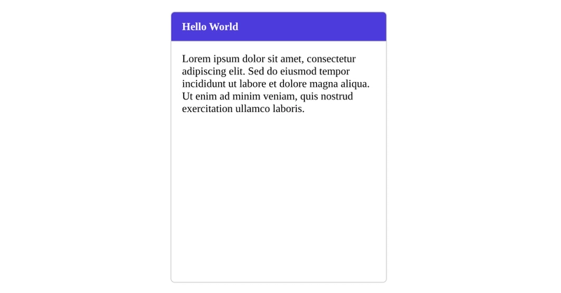
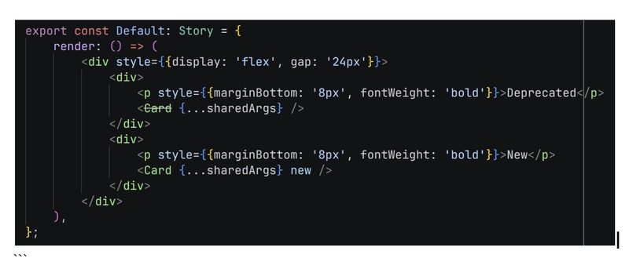
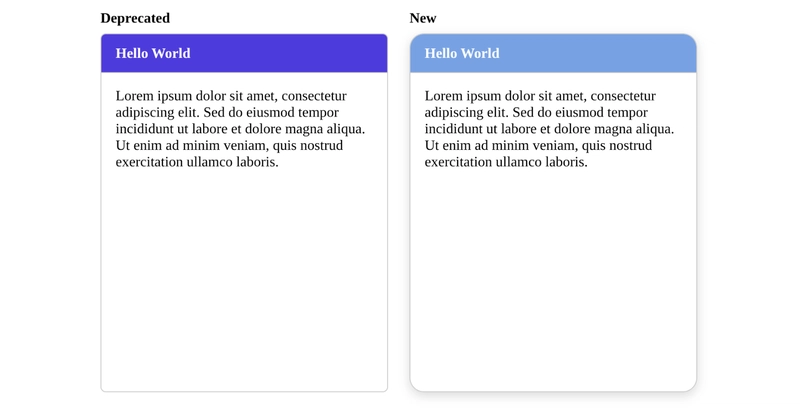

# Депрекация React-компонента с помощью перегрузок TypeScript

Учтите, что решение из этой статьи закрывает очень конкретную проблему и ситуацию. Это не рекомендуемый способ поддерживать версии компонентов внутри проекта.

<!-- more -->

## Что за ситуация?

Представим, что у вас есть монорепозиторий, а внутри него пакет с общими компонентами, которые используют разные приложения. Все потребители подключают этот пакет через `workspace:^`. Поскольку пакет с компонентами не публикуется в registry, разрешение версии на этапе публикации здесь не важно: `workspace:^` просто означает, что каждый пакет в монорепозитории, который от него зависит, всегда получает текущую локальную реализацию — живую версию, а не снимок из registry.

Но что произойдет, если вы захотите внести breaking change в компонент: например, изменить у `Card` радиус скругления, цвет фона заголовка и тень? Это значит, что все потребители потенциально могут сломаться, верно?

Кто-то может предложить создать новый компонент, а старый пометить как deprecated. Но тогда всем потребителям придется менять имя используемого компонента. Кроме того, у вас появятся два разных компонента в двух разных директориях (если вы хорошо организуете код), а это создает еще больше шума.

Мне хотелось чего-то более простого и устойчивого. Цели были такие:

- Сохранить то же имя компонента
- Видеть, что именно устарело
- Иметь простой способ переключаться между старой и новой версиями

## Один из способов сделать это

В TypeScript, как и в некоторых других языках вроде Java, есть полезная концепция перегрузок. Перегрузка означает, что у вас может быть одно и то же имя, например для функции, но при вызове с разными аргументами вы получаете разную реализацию. А React-компоненты, как мы знаем, по сути являются функциями. Отлично.

Допустим, у меня есть очень простой компонент `Card`:

```tsx
import React from 'react';
import './index.scss';

export interface CardProps {
    title: string;
    content: string;
    style?: React.CSSProperties;
}

const Card = ({ title, content, style }: CardProps) => {
    return (
        <div className="card" style={style}>
            <div className="card-header">
                <span className="card-title">{title}</span>
            </div>
            <div className="card-content">{content}</div>
        </div>
    );
};

export default Card;
```

Он выглядит так:



Но я хочу создать новую версию компонента `Card`, у которой будут другие радиус скругления, цвет фона заголовка и тень, а старую версию пометить как deprecated.

Для функции `Card` можно создать перегрузку. Посмотрим как.

Сначала я создал новый интерфейс для пропсов новой карточки. В нем есть единственный проп `new`, который всегда равен `true`. Чуть позже посмотрим, как он используется.

(Можно пойти дальше и завести `v1`, если вы планируете поддерживать больше одной версии, но, пожалуйста, не делайте так: этот подход не заменяет версионирование пакетов.)

```tsx
export interface NewCardProps extends CardProps {
    new: true;
}
```

Затем назовем старую функцию `Card` как `LegacyCard`, а новую версию — `NewCard`. В `NewCard` мы внесем все breaking changes, которые хотели.

```tsx
function LegacyCard({ title, content, style }: CardProps): React.JSX.Element {
    return (
        <div className="card" style={style}>
            <div className="card-header">
                <span className="card-title">{title}</span>
            </div>
            <div className="card-content">{content}</div>
        </div>
    );
}

const NewCard = ({ title, content, style }: CardProps) => {
    return (
        <div className="card card-new" style={style}>
            <div className="card-header">
                <span className="card-title">{title}</span>
            </div>
            <div className="card-content">{content}</div>
        </div>
    );
};
```

Теперь интересная часть — перегрузка:

Обратите внимание, что у нас есть три определения функции `Card`: одно для старой версии, одно для новой и одно для самой перегрузки. Также заметьте, что вариант со старыми `CardProps` помечен как `@deprecated`.

```tsx
/* eslint-disable no-redeclare */
/** @deprecated Use Card with "new" prop on it instead */
function Card(props: CardProps): React.JSX.Element;
function Card(props: NewCardProps): React.JSX.Element;

function Card(props: CardProps | NewCardProps): React.JSX.Element {
    if ('new' in props) {
        return NewCard(props);
    }
    return LegacyCard(props);
}
```

В итоге мы все равно экспортируем один `Card`:

```tsx
export default Card;
```

Вот и все — теперь можно начинать использовать компонент. Посмотрим, как выглядит реализация `Card` в Storybook. Обратите внимание: один `Card` зачеркнут, а другой выглядит нормально. Причина в том, что у второго компонента `Card` есть дополнительный проп `new`.



А вот как это выглядит:



Готово, на этом все.

Для AI я также создал небольшой SKILL, который может сделать это за вас. Его можно адаптировать под свои задачи. Найти его можно здесь: [deprecate-react-component skill](https://github.com/mbarzeev/pedalboard/tree/master/.claude/skills/deprecate-react-component)

<small>Источник: <https://dev.to/mbarzeev/deprecating-a-react-component-using-typescript-overload-2ka></small>
