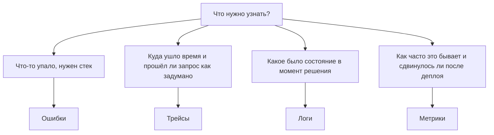

# Ошибки, трейсы, логи и метрики: когда что брать и что логировать {#errors-traces-logs-metrics}

Ошибки, трейсы, логи и метрики отвечают на разные вопросы. Их можно подменить друг другом, но от этого обычно пропадает именно тот рабочий процесс, ради которого сигнал и существует. Если же непонятно, с чего начать инструментацию, начните с нескольких точечных логов.

<!-- more -->

Материал собран из двух заметок блога Sentry. [Errors, traces, logs, metrics: when to reach for what](https://blog.sentry.io/errors-traces-logs-metrics-when-to-reach-for-what/) Сергея Дыбского задаёт рамку: какой сигнал брать. [When and what should I be logging?](https://blog.sentry.io/logging-best-practices/) Бена Коу — продолжение про то, что писать в логи, как их структурировать и чего туда не класть.

В Sentry все четыре сигнала приходят из одного SDK и есть на любом тарифе. Ошибки и трейсинг существуют давно, структурированные логи появились позже, метрики приложений закрыли набор в мае 2026 года. Если проект уже подключён к Sentry, ошибки и трейсы, скорее всего, уже текут. Логи и метрики остаются тем, что дописывают руками в точках, где код принимает решение.



## Четыре вопроса {#signals}

### Ошибки: что только что сломалось {#errors}

Стек и тип исключения, собранные в Issue: дедупликация, назначение, разбор до закрытия. Если код бросил исключение, это ошибка.

Для исключений почти всегда полезнее `captureException`, чем ещё одна строка в логе. Группировка, разбор и автоисправление завязаны на Issue, а не на поток логов.

### Трейсы: прошёл ли запрос так, как задумано {#traces}

Трейс — водопад спанов с длительностями. По нему видно путь запроса через сервисы и то, куда ушло время: запрос в базу, который завис, внешний вызов, который отвалился по таймауту, вызов инструмента LLM, который занял 8 секунд вместо 200 мс.

Большая часть спанов появляется сама: фреймворк и интеграции с базой инструментируют запрос без ручных обёрток. Свой спан имеет смысл добавлять на шаг, время которого важно увидеть в водопаде отдельно.

### Метрики: как это ведёт себя во времени {#metrics}

Счётчики, датчики (gauge) и распределения. Каждое измерение можно резать по атрибутам и от агрегата спускаться к конкретным сэмплам и трейсу за ними. Не «12 000 оформлений за неделю», а 8 400 из США, 2 600 из ЕС и 1 000 из остальных стран, и как линия сдвинулась после последнего деплоя.

Метрика — исторический сигнал в той же мере, что и сигнал «прямо сейчас». Поэтому на неё удобно вешать дашборды и алерты. Алерты в Sentry можно строить и по остальным сигналам, но метрика для этого заточена изначально.

### Логи: что было правдой в этой точке кода {#logs}

Состояние системы в конкретный момент: значения конфига, фича-флаги, входы и выходы функции, идентификатор пользователя. Лог — след по дереву решений. Маркеры ставят там, где код выбирает ветку, чтобы потом человек или агент могли восстановить, почему выбрана именно она.

Ошибки говорят, что сломалось. Трейс — куда ушло время. Лог заполняет «почему».

## Пример: рекомендации, которые «просто работают» {#example}

Витрина: React на фронте, Python API. Поддержка пересылает тикеты: у части авторизованных пользователей блок рекомендаций на странице аккаунта показывает общие бестселлеры, а не персональную подборку.

### Что-нибудь упало? {#did-it-crash}

Первое место — Issues. Исключений в React нет, упавших запросов нет, каждый `GET /recommendations/{user_id}` вернулся с 200. Для трекера ошибок приложение здорово.

### Запрос ушёл не туда или просто медленный? {#was-it-slow}

Трейс одного затронутого запроса. Маршрут и запросы в базу уже есть за счёт автоинструментации, несколько именованных спанов стоят на шагах рекомендаций:

1. Загрузили пользователя.
2. Вычислили флаг `ranking_v2`.
3. Сходили в `recommendations_v2`.
4. Упали в популярные товары.
5. Отранжировали их.

Путь верный, время в норме. Запрос к `recommendations_v2` успешен: ноль строк — это успешный запрос. Код сделал то, для чего его написали, и ушёл в запасной вариант. Трейс говорит, что запрос прошёл по проекту. Он не говорит, что проект тихо подвёл этого пользователя.

### Что было правдой в момент решения? {#decision-state}

Лог из обработчика, найденный по пользователю из тикета, показывает состояние в момент фолбэка.

Пользователь попал в группу флага `ranking_v2`. Флаг читает персональные рекомендации из новой таблицы `recommendations_v2`. Таблицу выкатили, строки не залили. Пустой результат для кода — законное «персональных рекомендаций нет», ровно как у нового пользователя без истории. Поэтому ответ — бестселлеры и 200.

Почему не повесить те же поля на спан? `outcome` и `candidate_count` как атрибуты спана читаются, когда трейс уже открыт. Трейсы сэмплируются, и жалоба клиента часто приходится на запрос, который в выборку не попал. Атрибут спана помогает читать найденный трейс. Найти трейс он не помогает. Логи не сэмплируются.

### Скольких это задело? {#how-many}

Один клиент — тикет в поддержку. Разница между «узкая когорта» и «заметная доля» — это разница между починкой в понедельник и ночным вызовом. Счётчик `recommendations.served` с тегами `ranking_version` и `outcome` рисует линию: путь v2 почти целиком уходит в фолбэк, v1 ведёт себя обычно, провал совпадает с раскаткой флага. Масштаб и причина видны без единого открытого трейса.

Ни один сигнал не закрыл задачу сам. Каждый отсёк версию. Пустой список Issues — это не падение. Метрика — это не единичный случай, фолбэчит вся когорта v2. Трейс, там где он сохранился, показал путь ровно по проекту, поэтому баг и проскочил. Лог по `user_id` из тикета сказал, почему, и трейс для этого уже не понадобился.

## Шпаргалка {#cheatsheet}

| Что нужно узнать | Что брать |
| --- | --- |
| Что-то упало, покажите стек | Ошибки |
| Сколько это заняло? Какой шаг медленный? | Трейсы |
| Запрос прошёл через те шаги, которые я ждал? | Трейсы |
| Какое было состояние, когда код принял решение? | Логи |
| Что функция получила и что вернула? | Логи |
| Как часто случается X? Частота нормальная? | Метрики |
| Что-то изменилось после деплоя? | Метрики |

Одно и то же значение может жить в нескольких сигналах. Ниже — случаи, где выбор неочевиден.

### Атрибут спана или метрика? {#span-or-metric}

Если это контекст одного прохода запроса и он нужен, пока вы читаете трейс, это атрибут спана. Он едет на спане в водопаде. Если это самостоятельная величина, которую надо строить на графике, алертить и резать по времени по всем запросам, это метрика.

Одно число может оправдать оба места. `candidate_count` на спане позволяет прочитать один запрос. `recommendations.served` как метрика позволяет смотреть частоту. Первое — осмотр одного потока, второе — наблюдение за агрегатом.

### Лог или спан? {#log-or-span}

Спан — узел потока со временем. Большинство из них пишет интеграция, руками их почти не ставят. Лог — состояние в точке решения внутри этого узла, и его пишут намеренно. Спан отвечает, где и как долго. Лог отвечает, что было правдой и почему.

### Лог или метрика? {#log-or-metric}

Лог — история одного запроса, иголка. Метрика — агрегат, вопрос, нормален ли стог. Найти конкретный запрос, который пошёл не так, — лог. Узнать, сколько запросов пошло не так, — метрика.

Считать частоту по строкам лога можно, но тогда вы платите за хранение каждой строки, чтобы получить число, которое можно было отправить метрикой напрямую.

### Ошибка или лог? {#error-or-log}

Если нужен стек и событие должно жить как Issue до исправления, это ошибка. Если условие неожиданное, но обработанное, и его стоит записать, это лог. Для действительно некритичного случая `logger.warning(..., exc_info=True)` сохраняет трейсбек в логах и не шумит в ленте ошибок.

Отдельный частый случай — нестабильный внешний API, где часть кодов ответа можно повторить N раз. На N-й попытке стоит поднять ошибку в Sentry. На попытках до N полезнее строка лога: номер попытки, код ответа, несекретные поля запроса и состояние вроде флагов и конфига.

## Как это выглядит в коде {#instrumentation}

Всё в примере выше выходит из одного обработчика `GET /recommendations/{user_id}`: загрузить пользователя, проверить `ranking_v2`, прочитать `recommendations_v2`, при пустом ответе отдать популярные товары.

Маршрут и каждый запрос в базу уже есть в трейсе. Руками остаются три вещи: пара атрибутов на текущем спане, лог в точке решения и метрика.

```python
import sentry_sdk
from sentry_sdk import logger

# Маршрут инструментирует FastAPI, запросы — интеграция с базой.
@app.get("/recommendations/{user_id}")
def get_recommendations(user_id: int):
    user = db.get_user(user_id)
    use_v2 = flag_enabled("ranking_v2", user)
    ranking_version = "v2" if use_v2 else "v1"

    candidates = db.personalized_recs(user_id, version=ranking_version)
    outcome = "personalized" if candidates else "fallback"
    items = candidates or db.popular_items()

    # Атрибут спана: контекст этого прохода, читается внутри трейса.
    span = sentry_sdk.get_current_span()
    span.set_data("ranking_version", ranking_version)
    span.set_data("recommendation.outcome", outcome)

    # Лог: состояние в момент выбора персональной выдачи или фолбэка.
    logger.info(
        "recommendations lookup",
        attributes={
            "user_id": user_id,
            "ranking_version": ranking_version,
            "flag.ranking_v2": use_v2,
            "source_table": f"recommendations_{ranking_version}",
            "candidate_count": len(candidates),
            "outcome": outcome,
        },
    )

    # Метрика: частота по всем запросам, срез по версии и исходу.
    sentry_sdk.metrics.count(
        "recommendations.served",
        1,
        attributes={"ranking_version": ranking_version, "outcome": outcome},
    )

    return items
```

Три явных касания, и каждое несёт то, чего нет у остальных. Атрибут помечает путь ранжирования, чтобы он был перед глазами в трейсе. Лог фиксирует, что функция решила и почему, в момент решения. Метрика считает исход с измерениями, по которым потом можно резать.

Если шаг надо увидеть отдельной длительностью в водопаде, его оборачивают в `sentry_sdk.start_span`.

SDK дописывает контекст сам. Фронтовые SDK ставят браузер, ОС и релиз. Один вызов `set_user` / `setUser` привязывает пользователя к ошибкам, спанам, логам и метрикам запроса. Общий `trace_id` связывает сигналы: у лога есть трейс, из всплеска метрики можно перейти к трейсам за ним.

Эти точки имеют смысл, только если их поставили заранее, там, где код принимает решение, которое потом захочется оспорить.

## Инструмент под задачу {#right-tool}

Разделение зашито в API. Metrics API считает и измеряет то, что будут агрегировать. Span API меряет длительности и форму запроса. Log API стыкуется со обычной библиотекой структурированных логов, и уже написанные строки становятся событиями, по которым можно искать. Брать API под рабочий процесс — значит брать API под вид величины: количество, длительность или момент.

Из той же логики следует сэмплирование.

| Сигнал | Что хранить |
| --- | --- |
| Трейсы | Представительную долю. `traces_sample_rate` выше в разработке, ниже в проде. Чтобы понять, куда уходит время, не нужен каждый запрос |
| Ошибки | По умолчанию все |
| Логи | Все. Смысл лога — найти тот редкий запрос, который пошёл вбок. Отфильтрованное `before_send_log` не восстановить |
| Метрики | Все. Фильтр — `before_send_metric`, а не случайный процент |

Удержание должно совпадать с вопросом: выборка для «куда уходит время», каждое событие для «что случилось с этим запросом».

### А широкие события? {#wide-events}

Есть довод, что четыре сигнала лишние: слать одно богатое событие на запрос и выводить остальное потом. Половина верна.

Слать широко нужно. Лучший вид любого сигнала — структурное событие с контекстом: какой флаг был включён, какой пользователь, какие входы и выходы. Голое число или однострочная строка хуже.

Но форма, в которой событие ушло, — это форма, с которой потом работают. Одно толстое событие в колоночном хранилище потом нормально рисуется на графике. Оно не сгруппируется в дедуплицированный Issue, не нарисуется водопадом и не поднимет алерт по порогу, который ещё не задан. Это разные рабочие процессы, и каждому нужна своя форма данных.

Поэтому широкое событие отправляют в тот сигнал, чей процесс нужен. Обработчик выше шлёт и метрику, и лог: одно решение, один трейс, две формы. Смотреть частоту и восстанавливать один запрос — разные работы.

### Агенты читают ту же телеметрию {#agents}

Телеметрия, которую пишут для отладки, — та же, которую читает агент. Трейс для этого удобнее потока логов: это дерево зависимостей со временем на каждом узле. Агенту не нужно сначала собирать граф вызовов из таймстемпов и совпадения строк.

Практическое правило из такого разбора: значение, которое имеет смысл только рядом с конкретной операцией, живёт атрибутом спана. Попадания в кэш и время до первого токена, за которыми смотрят во времени, становятся метриками. Короткие маркеры «это случилось здесь» остаются логами.

## Если сомневаетесь, начните с логов {#start-with-logs}

Логи дешевле всего добавить и быстрее всего начинают собирать факты о проде. На новой фиче имеет смысл поставить столько логов, чтобы её можно было отладить без выкладки. Временная инструментация нормальна: добавили, пока разбираете проблему или проверяете поведение, убрали, когда она перестала быть нужна.

Ниже — что логировать, как оформлять сообщения и чего избегать.

## Что логировать {#what-to-log}

### Решения, которые приложение принимает в рантайме {#runtime-decisions}

Разные пользователи часто идут разными путями. Когда поведение неожиданное, нужно видеть, какие решения определили ответ.

Например: у пользователя включён флаг и он видит экспериментальную версию страницы; мобильных уводят на другой опыт; платные и бесплатные получают разную функциональность.

Если код выбирает между ветками, логируйте и причину выбора, и то, какое поведение из него вышло:

```js
// У пользователя включён флаг экспериментальной ленты.
Sentry.logger.info("Check Feature Flags", {
    feature_flag: "fiesta_mode",
    feed_experience: "party mode",
    "user.id": userUuid,
});
```

По таким строкам видно, почему два пользователя увидели разное, и проще воспроизвести баг, который бьёт только одну когорту.

### Ведёт ли себя алгоритм так, как задумано {#algorithm-outcomes}

Логи полезны, когда фича состоит из нескольких шагов. Промежуточные исходы показывают, где процесс разваливается.

Пример из побочного проекта, куда импортируют скалолазный логбук из внешнего сервиса. Исход импорта проверяет, что исходные данные разобраны, и показывает, на каком шаге всё остановилось:

```js
// Экспорт аутентифицирован и разобран.
// Если импорт «плохой», первый вопрос — сколько записей вообще пришло.
Sentry.logger.info("Third-party import started", {
    "import.source": "aurora",
    "import.entries_received": body.ascents.length,
});

// Здесь работает алгоритм и заполняет skipDetails.

// Плоская разбивка исхода. Каждая причина пропуска — своё скалярное поле,
// поэтому всплеск import.skipped.unknown_grade можно смотреть отдельно.
Sentry.logger.info("Third-party import finished", {
    "import.source": "aurora",
    "import.entries_received": body.ascents.length,
    "import.imported": imported,
    "import.climbs_created": climbsCreated,
    "import.skipped": skipped,
    "import.skipped.missing_name": skipDetails.missingName,
    "import.skipped.unknown_grade": skipDetails.unknownGrade,
    "import.skipped.invalid_angle": skipDetails.invalidAngle,
    "import.skipped.already_imported": skipDetails.alreadyImported,
});
```

### Аудит: создание, изменение, удаление, доступ, права {#audit}

Аудит-лог отвечает на вопросы «кто это изменил?», «когда?» и «это ожидаемое действие?». Для поддержки это часто короткий путь к причине.

Пользователь спрашивает, куда делся недельный дашборд команды. По логам мутаций видно, что другой участник удалил его несколько дней назад. Дашборд восстанавливают, пользователю говорят, что произошло, и остаётся уверенность, что приложение не удаляет данные само.

Логи доступа и прав ещё и требование части стандартов, например HIPAA.

!!! warning "Соответствие требованиям"

    Аудит-лог — только одна часть комплаенса. Персональные данные, сроки хранения и то, кто имеет доступ к событиям, задаются отдельно. Если требования сложные, их нельзя закрыть набором полей в логе.

### Контекст вокруг сбоев, которые ещё не ошибка {#failure-context}

Не каждый сбой должен сразу становиться ошибкой. Пока идёт повтор запроса, полезен лог, а не Issue.

Что имеет смысл приложить:

- номер попытки;
- статус, код ошибки и другие несекретные детали внешнего сервиса;
- несекретные атрибуты запроса и ответа, которые объясняют сбой;
- состояние рантайма: флаги, конфигурация.

## Как оформлять сообщения {#how-to-log}

### Структурные поля, а не текст «я здесь был» {#structured-logs}

Строка `"DID I GET HERE"` почти ничего не даёт. Структурный лог кладёт факты в устойчивые пары ключ/значение.

Одинаковые поля вроде `user_id`, `request_id`, `feature_flag` и `action` упрощают поиск человеку и дают платформе фильтры, графики и алерты.

Хорошее сообщение отвечает на три вопроса:

- кто выполнил действие (например, аутентифицированный пользователь);
- что произошло (читаемый текст и поля);
- когда (обычно проставляет сама система логирования).

Контекст текущего пользователя в Sentry задают через `setUser`, а не через почту в каждом сообщении.

### Контекст копится по ходу запроса {#request-context}

Логи до аутентификации пользователя не знают. После неё данные пользователя идут рядом с полями конкретного события.

Особенно полезен идентификатор трейса: по нему строка лога связывается с распределённым трейсом. В Sentry логи связаны с трейсом сами, если контекст трейса уже есть.

### Уровень говорит, насколько это важно {#log-levels}

| Уровень | Когда |
| --- | --- |
| `debug` | Подробности для разработки и точечного расследования. В проде обычно выключены и включаются на время разбора |
| `info` | Обычные события: решения в рантайме, поведение алгоритма, аудит |
| `warn` | Восстановимые события, на которые стоит посмотреть. Например, внешний вызов перешёл порог по задержке |
| `error` | Неожиданный сбой, который обработали. Если сбой стал исключением, лучше `captureException`, а не второй такой же лог |

`debug` в проде можно отсечь в `beforeSendLog`, глядя на `level`:

```js
beforeSendLog(log) {
    return log.level !== "debug";
}
```

Тот же хук подходит, чтобы выкинуть чувствительные поля ещё на клиенте.

## Чего не логировать {#what-not-to-log}

### Каждый вызов функции {#not-every-call}

Построчная инструментация всех функций — работа профайлера и трейсинга, не логов. Лог ставят в точке решения, спан — там, где важна длительность шага.

### Персональные и секретные данные {#pii}

Перед каждым полем стоит вопрос: что будет, если эти данные увидит не тот человек.

- Предпочитайте непрозрачный идентификатор пользователя почте и полному имени.
- Пароли, токены доступа и ключи API в логах не появляются. Им место в хранилище секретов.
- Возраст, пол и почтовый индекс тоже могут попадать под регулирование.
- PCI, GDPR, CCPA и HIPAA задают, что можно хранить, как долго и кому показывать. Это зависит от отрасли, вашей страны и стран пользователей.

Серверная очистка данных в Sentry закрывает часть типичных попаданий паролей и PII, если логи структурные. Набор полей настраивается. Это не замена решению, что вообще отправлять.

Логируйте минимум, которого хватает, чтобы отлаживать и эксплуатировать приложение.

### Большие неструктурные куски без конкретной цели {#large-blobs}

Иногда большой кусок оправдан: полный промпт и ответ LLM, чтобы понять, ведёт ли себя продукт как задумано; тело вебхука, чтобы разобрать интеграцию.

У этого есть цена и риск:

- в промпт пользователь может положить персональные данные;
- полный HTTP-запрос и ответ часто содержат токены и секреты;
- объём хранения стоит денег, и неиспользованное поле всё равно тарифицируется.

Для диалогов с ассистентом отдельный продукт вроде Conversations в Sentry обычно уместнее, чем лог всей переписки. Если можно записать конкретные поля вместо целого запроса, ответа или документа, записывайте поля.

## С чего начать {#getting-started}

Все четыре сигнала с первого дня не нужны. Ошибки начинают собираться, как только инициализирован SDK. Около 80% спанов ставит фреймворк и интеграция с базой. Оставшиеся 20% — ручная работа: логи в точках решения и несколько метрик там, где выбор потом захочется проверить.

Практический набор на новую фичу:

- решение в рантайме, например фича-флаг и выбранная ветка;
- шаги и исход алгоритма, плоскими скалярными полями;
- мутации, доступ и права;
- контекст повторов и обработанных сбоев, которые ещё не должны стать Issue;
- счётчик исхода, если по частоте надо будет смотреть после деплоя.

Для каркаса «какой сигнал брать» есть отдельный skill:

```bash
npx skills add getsentry/sentry-for-ai --skill sentry-instrumentation-guide
```

Репозиторий [getsentry/sentry-for-ai](https://github.com/getsentry/sentry-for-ai) быстро меняется, пути к skill могут сдвинуться. Актуальная установка — в репозитории.

## Вопросы {#faq}

??? question "Лог, трейс или метрика?"

    Трейс, в основном автоматический, — куда ушло время и прошёл ли запрос по проекту. Лог — состояние и причина в конкретной точке решения; он не сэмплируется, поэтому один запрос можно найти всегда. Метрика — частота или тренд по всем запросам. Всё, у чего есть стек и что надо вести до исправления, — ошибка.

??? question "Можно ли логировать всё и обойтись без трейсов и метрик?"

    Можно, и пропадут процессы, под которые сделаны остальные сигналы. Трейс рисуется водопадом, по которому рассуждает человек или агент. Метрика — дешёвый агрегат для графика и алерта. Ошибки собираются в Issue со стеком. Частота, посчитанная по строкам лога, стоит хранения каждой строки ради числа, которое можно было отправить метрикой.

??? question "Нужны ли все четыре сигнала сразу?"

    Нет. Ошибки есть сразу после инициализации SDK, большая часть спанов появляется сама. Руками ставят логи в точках решения и немного метрик.

??? question "Как сэмплировать?"

    Сэмплируют трейсы: `traces_sample_rate`, выше в разработке, ниже в проде. Ошибки собираются по умолчанию. Логи и метрики не сэмплируют, их фильтруют через `before_send_log` и `before_send_metric`. Каждый отправленный лог и каждая метрика сохраняются и привязаны к трейсу, поэтому редкий запрос находится, а из всплеска метрики можно спуститься к сэмплам.

<small markdown>

Источники:

- Сергей Дыбский, [Errors, traces, logs, metrics: when to reach for what](https://blog.sentry.io/errors-traces-logs-metrics-when-to-reach-for-what/), 5 июня 2026.
- Бен Коу, [When and what should I be logging?](https://blog.sentry.io/logging-best-practices/), 9 июля 2026.

</small>
